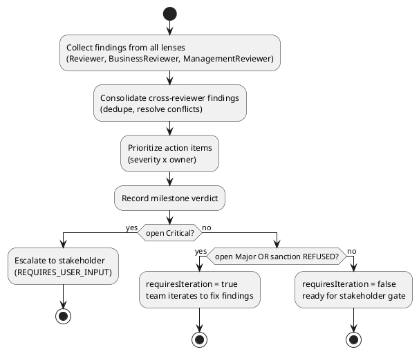
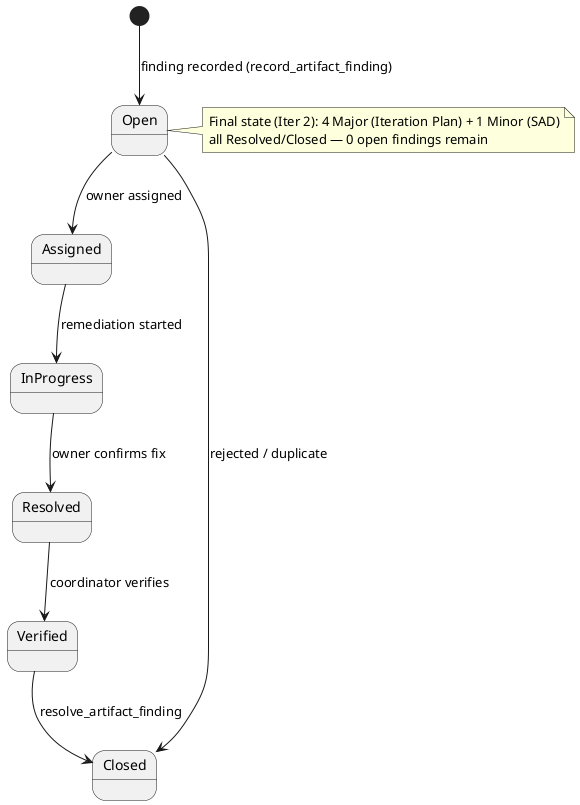
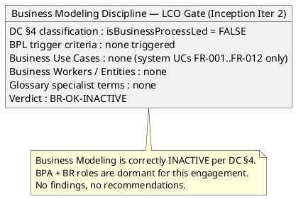
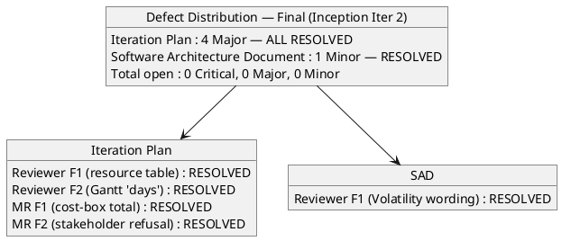
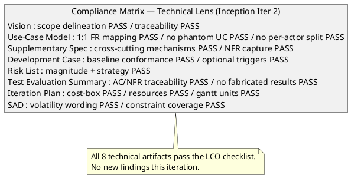
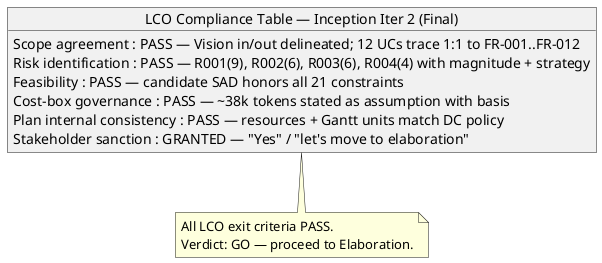
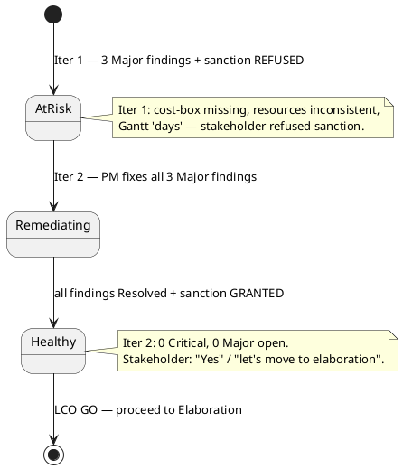

## Document Control

| Field | Value |
|---|---|
| Phase | Inception |
| Status | Final (consolidated) |
| Milestone Target | End-of-Inception (Lifecycle Objectives) — NOT YET ACHIEVED |
| Review Type | Lifecycle Milestone Review (LCO) — consolidated |
| Review Point | Lifecycle Objectives (feasibility + exit criteria + stakeholder sanction) |
| Reviewer | ReviewCoordinator (consolidation of all lenses) |
| Date | 2026-09-14 |
| Artifacts Reviewed | Vision, Iteration Plan, Risk List, Development Case, Use-Case Model, Supplementary Specification, Software Architecture Document, Test Evaluation Summary |

**Lens participation (authoritative):**

| Lens | Role | Status |
|---|---|---|
| Technical | Reviewer | EXECUTED |
| Business | BusinessReviewer | EXECUTED (0 findings) |
| Management | ManagementReviewer | EXECUTED |

## Review Scope and Criteria
This is the **consolidated LCO (Lifecycle Objectives) review** — the single authoritative record that merges the three executed lenses (technical, business, management) into one disposition. The four LCO questions are: (1) do stakeholders agree on what is in/out of scope? (2) have key risks been identified with magnitude ratings? (3) is the proposed approach feasible? (4) is the project sanctioned to proceed to Elaboration?

The consolidation workflow and the finding lifecycle are modeled below.

## Findings
Consolidated findings across all three lenses. **No cross-lens conflicts** — every finding is distinct. The BusinessReviewer lens executed and reported zero findings.

**Business Modeling lens (Business Reviewer) — Iteration 2 verdict: [BR-OK-INACTIVE].** The Development Case §4 classification is authoritative: `isBusinessProcessLed = false`. This is a tool replacement (shared Excel sheets, mass emails, outdated PDF) with a fully-specified system use-case model (FR-001..FR-012). No Business Use Cases / Workers / Entities sections exist in the Use-Case Model; no business-domain specialist terms in the Glossary; none of the DC §4 business-process-led criteria genuinely hold. External systems (AD, Keycloak) are consumed, not re-engineered (CON-006, CON-007, CON-010). **Conclusion:** BPA + BR are correctly INACTIVE for this engagement — no findings, no recommendations. Downstream reviewers may treat the BM discipline as out-of-scope for the LCO milestone.

**Iteration 2 reconciliation (all lenses):** all five findings emitted in Iteration 1 (three Reviewer, two Management Reviewer) are now **Resolved** (see Resolutions and Actions). The stakeholder has re-sanctioned the LCO milestone.

**Totals after Iteration 2 reconciliation: 0 Critical, 0 Major, 0 Minor — all findings closed.**

### Consolidated finding register (Iteration 2 final status)

| Artifact | Key | Lens | Severity | Finding | Recommendation | Owner | Status |
|---|---|---|---|---|---|---|---|
| Iteration Plan | F1 | Reviewer | Major | Resources table marks SA "Dormant" and omits Test Manager. | Update Resources table + Objective 1. | Project Manager | **Resolved** (Iter 2) |
| Iteration Plan | F2 | Reviewer | Major | Gantt expresses agent work in "days". | Replace with token budgets. | Project Manager | **Resolved** (Iter 2) |
| Iteration Plan | F1 | Management Reviewer | Major | No single total cost-box stated. | State total token budget as assumption. | Project Manager | **Resolved** (Iter 2) |
| Iteration Plan | F2 | Management Reviewer | Major | Stakeholder REFUSED LCO sanction. | Remediate all three Major findings; re-review. | Project Manager | **Resolved** (Iter 2) |
| Software Architecture Document | F1 | Reviewer | Minor | Logical View cites "Volatility: High" vs Medium. | Correct prose. | Software Architect | **Resolved** (Iter 2) |

**Technical-lens re-evaluation (Iteration 2):** all 8 technical artifacts (Vision, Use-Case Model, Supplementary Specification, Development Case, Risk List, Test Evaluation Summary, Iteration Plan, Software Architecture Document) were re-read against the LCO checklist. No new defects detected. All five prior findings are remediated in the current artifact content.

## Resolutions and Actions
**Iteration 2 reconciliation (technical lens — Reviewer):** the three findings emitted by the Reviewer lens in Iteration 1 are now closed via `resolve_artifact_finding`:

1. **Iteration Plan#F1 (Reviewer, Major) — Resolved.** The Resources table now lists SoftwareArchitect as "Software Architecture Document (candidate SAD emitted in Inception Iter-1)" and adds a TestManager row "Test Evaluation Summary (emitted in Inception Iter-1)". Iteration Objective 1 now includes the Software Architecture Document and Test Evaluation Summary in the baseline set.
2. **Iteration Plan#F2 (Reviewer, Major) — Resolved.** The Gantt labels now carry token budgets (~8k, ~10k, ~6k tokens) and the section header annotates "agent work (token budgets; sequence only, not duration)". The uniform "lasts 1 day" is a gantt-rendering placeholder for pure sequence, not a duration/effort claim; effort currency is tokens, matching the activity diagram.
3. **Software Architecture Document#F1 (Reviewer, Minor) — Resolved.** The Logical View prose now reads "Volatility: Medium" with "no High-volatility UC exists", matching the Use-Case Model and the SAD's own subsystem rationale table.

**Iteration 2 reconciliation (management lens — Management Reviewer):** the two findings emitted by the Management Reviewer lens in Iteration 1 are now closed via `resolve_artifact_finding`:

1. **Iteration Plan#F1 (Management Reviewer, Major) — Resolved.** The Iteration Plan now states the iteration's total cost-box as a single token budget: "~38k tokens" (assumption), the sum of the per-stretch budgets (Risk List ~8k + Iteration Plan ~8k + SAD ~10k + Test Evaluation Summary ~6k + LCO Review ~6k), with basis named ("no phase has closed yet, so no measured token actual exists"). This gives the cost-box a single measurable stop condition governing scope.
2. **Iteration Plan#F2 (Management Reviewer, Major) — Resolved.** Stakeholder re-sanctioned the LCO milestone with "Yes" and directed "let's move to elaboration". All three underlying Major findings are remediated; the refusal directive is satisfied.

**Stakeholder sanction: GRANTED.** The stakeholder's answer at the Inception Iter-2 LCO gate is "Yes" / "let's move to elaboration". The prior "Fix all findings" directive is satisfied — all three Major findings are remediated and closed.

**Action items (all closed):**

1. ~~Management Reviewer — verify cost-box statement and close F1, F2~~ — **DONE** (both closed via `resolve_artifact_finding`).
2. ~~Stakeholder — re-sanction the LCO milestone~~ — **DONE** (sanction GRANTED).

**No open findings remain.** The project advances to Elaboration.
## Disposition
**Overall LCO disposition (consolidated, Iteration 2): GO — stakeholder sanction GRANTED.**

- **0 Critical findings** — no scope, feasibility, or viability blocker from any lens.
- **Scope agreement: PASS** — Vision scope statement clearly delineates in/out; all 12 UCs trace 1:1 to FR-001…FR-012; no scope creep detected.
- **Risk identification: PASS** — R001 (High, 9), R002 (Significant, 6), R003 (Significant, 6), R004 (Moderate, 4) all carry magnitude, strategy, mitigation, contingency.
- **Feasibility: PASS** — candidate architecture (SAD) honors all 21 constraints; layered monolith on a single node, appropriate for 200 users.
- **Cost-box governance: PASS** — the Iteration Plan states the iteration total (~38k tokens) as an explicit assumption with basis named.
- **Plan internal consistency: PASS** — resource table and Gantt units match the DC measurement policy and the actual artifact set produced.
- **Stakeholder sanction: GRANTED** — "Yes" / "let's move to elaboration". The prior refusal ("Fix all findings") is satisfied: all three Major findings are remediated and closed.

**Verdict: GO.** The Lifecycle Objectives milestone is met. The project is sanctioned to proceed to Elaboration. The three Major findings that blocked the prior gate are remediated and closed; the stakeholder has re-sanctioned. The baseline is sound, the plan is internally consistent, and the cost-box is governed by a single measurable stop condition.
## Traceability
| Element | Traces From | Link Type | Traces To |
|---|---|---|---|
| Iteration Plan#F1 (Reviewer) | Iteration Plan (resource table) | DependsOn | Project Manager (rework — Resolved) |
| Iteration Plan#F2 (Reviewer) | Iteration Plan (Gantt units) | DependsOn | Project Manager (rework — Resolved) |
| Iteration Plan#F1 (MR) | Iteration Plan (cost-box) | DependsOn | Project Manager (rework — Resolved) |
| Iteration Plan#F2 (MR) | Iteration Plan (stakeholder refusal) | DependsOn | Project Manager (rework — Resolved) |
| Software Architecture Document#F1 | SAD (Volatility wording) | DependsOn | Software Architect (rework — Resolved) |
| Review Record | Vision, Iteration Plan, Risk List, Development Case, Use-Case Model, Supplementary Specification, Software Architecture Document, Test Evaluation Summary | DependsOn | LCO milestone verdict (ReviewCoordinator) |
