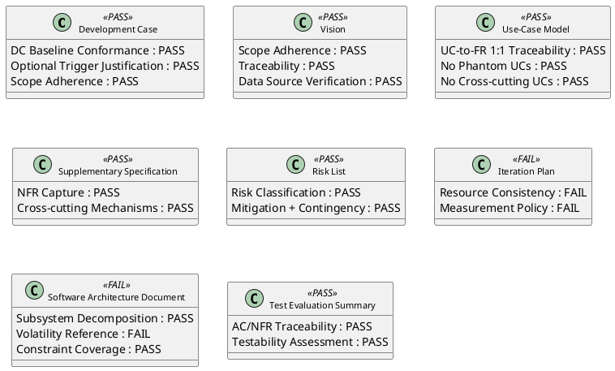
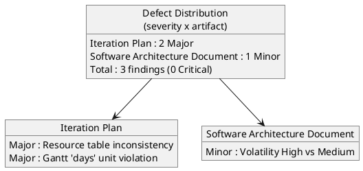
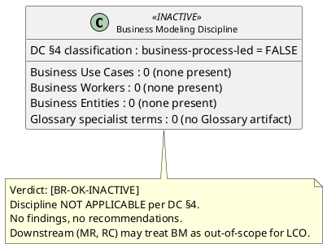

## Document Control

| Field | Value |
|---|---|
| Phase | Inception |
| Status | Draft |
| Milestone Target | End-of-Inception (Lifecycle Objectives) — NOT YET ACHIEVED |
| Review Type | Phase-level milestone review (LCO) — technical lens |
| Review Point | Lifecycle Objectives (feasibility + exit criteria) |
| Reviewer | Reviewer (technical lens) |
| Date | 2026-09-14 |
| Artifacts Reviewed | Development Case, Vision, Use-Case Model, Supplementary Specification, Risk List, Iteration Plan, Software Architecture Document, Test Evaluation Summary |

## Review Scope and Criteria

This review applies the **LCO (Lifecycle Objectives) exit-criteria lens**: are the Inception artifacts feasible, internally consistent, scope-adherent, and sufficient to decide whether the project is viable and initial risks are identified? The technical lens evaluates each artifact against its type-specific checklist (requirements quality, architecture integrity, DC baseline conformance, traceability, scope adherence).

**Checklist applied per artifact:**

| Artifact | Checklist |
|---|---|
| Development Case | DC Baseline Conformance (roster/ownership/CORE/merge), Optional Trigger Justification (§5.2) |
| Vision | Scope adherence, traceability, data-source verification |
| Use-Case Model | UC-to-FR 1:1 traceability, no phantom UCs, no cross-cutting UCs, multi-actor rule |
| Supplementary Specification | NFR capture, cross-cutting mechanisms as `<<include>>` |
| Risk List | Risk classification (P×I), mitigation + contingency |
| Iteration Plan | Resource consistency, measurement policy (tokens/elapsed vs days) |
| Software Architecture Document | Subsystem decomposition, constraint coverage, volatility reference |
| Test Evaluation Summary | AC/NFR traceability, testability assessment |

**SCM state:** No open pull requests at review time — nothing to dispose.

## Findings

Three findings were recorded via `record_artifact_finding` (0 Critical, 2 Major, 1 Minor). No Critical findings — no LCO blocker from the technical lens.

### Finding details

| Artifact | Key | Severity | Finding | Recommendation |
|---|---|---|---|---|
| Iteration Plan | F1 | Major | Resources table marks Software Architect "Dormant (SAD is Elaboration)" and omits Test Manager, yet the SAD and Test Evaluation Summary were both produced this iteration; Objective 1 omits them from the baseline set | Update Resources table (SA produced candidate SAD; add Test Manager) and Objective 1 to include SAD + Test Evaluation Summary |
| Iteration Plan | F2 | Major | Gantt chart expresses agent work in "days", contradicting the DC measurement policy (tokens + elapsed time) and the same artifact's own token-based activity diagram | Replace "days" for agent work with token budgets; keep "days" only for human-gate queue time |
| Software Architecture Document | F1 | Minor | Logical View prose cites "Volatility: High" for UC-001/UC-008, but the Use-Case Model marks them Medium (no High-volatility UC exists) | Correct to "Volatility: Medium" or "the two most volatile UCs" |

## Resolutions and Actions

No prior-iteration findings exist (Iteration 1, Cycle 1) — nothing to reconcile. The three findings above are open and carry concrete remediation for the authoring roles (Project Manager for Iteration Plan; Software Architect for SAD).

## Disposition
**Overall LCO disposition (technical lens): Approved with Changes.**

- **0 Critical findings** — no LCO blocker. The Inception baseline is feasible, scope-adherent, and internally traceable.
- **2 Major findings** on the Iteration Plan (resource-table inconsistency; measurement-unit violation) require rework before the plan is fully consistent, but neither blocks the LCO decision — they are internal-consistency defects, not scope or feasibility defects.
- **1 Minor finding** on the SAD (volatility reference) is a wording correction.
- The Development Case conforms to the IARI baseline (no roster redefinition, no ownership reassignment, no CORE omission, no role merge) and all 6 optional triggers are correctly NOT FIRED against their §5.2 conditions.
- The Use-Case Model is scope-adherent: 12 UCs trace 1:1 to FR-001…FR-012, no phantom UCs, no cross-cutting mechanisms promoted to UCs, no per-actor splitting of a single declared process.

**Business Modeling lens disposition: [BR-OK-INACTIVE] — Discipline NOT APPLICABLE per DC §4.**

The Business Modeling discipline is correctly INACTIVE for this engagement. The Process Engineer's DC §4 classification (`business-process-led = false`, rationale dated 2026-09-14) is confirmed by independent inspection of the artifacts:

- **No ERP / BPM / workflow-redesign / M&A signals** in the Vision — the project is a tool replacement (shared Excel sheets, mass emails, an outdated PDF → a single internal web application), not a business transformation.
- **No Business Use Cases / Workers / Entities sections** in the Use-Case Model — the model contains only system use cases (UC-001…UC-012), each tracing 1:1 to a stakeholder-declared requirement (FR-001…FR-012). The stakeholder fully specified the system use cases at the system level; there is no business process to model before the system.
- **No business-domain specialist terms** in a Glossary (no Glossary artifact exists; the domain vocabulary — clocking, worker category, featured news — is ordinary internal-HR language, not regulated/legal/medical/financial jargon).

**Conclusion (business lens):** The Business Process Analyst and Business Reviewer are correctly INACTIVE for this engagement. No findings, no recommendations. Downstream reviewers (Management Reviewer, Review Coordinator) may treat the Business Modeling discipline as out-of-scope for the LCO milestone. None of the six business modeling scenarios applies — the stakeholder declared concrete system features, not business processes to be modeled or re-engineered.
## Traceability

| Element | Traces From | Link Type | Traces To |
|---|---|---|---|
| Iteration Plan#F1 | Iteration Plan (Resources table) | DependsOn | Project Manager (rework) |
| Iteration Plan#F2 | Iteration Plan (Gantt) | DependsOn | Project Manager (rework) |
| Software Architecture Document#F1 | SAD (Logical View) | DependsOn | Software Architect (rework) |
| Review Record | Development Case, Vision, Use-Case Model, Supplementary Specification, Risk List, Iteration Plan, Software Architecture Document, Test Evaluation Summary | DependsOn | LCO milestone verdict (ReviewCoordinator) |
