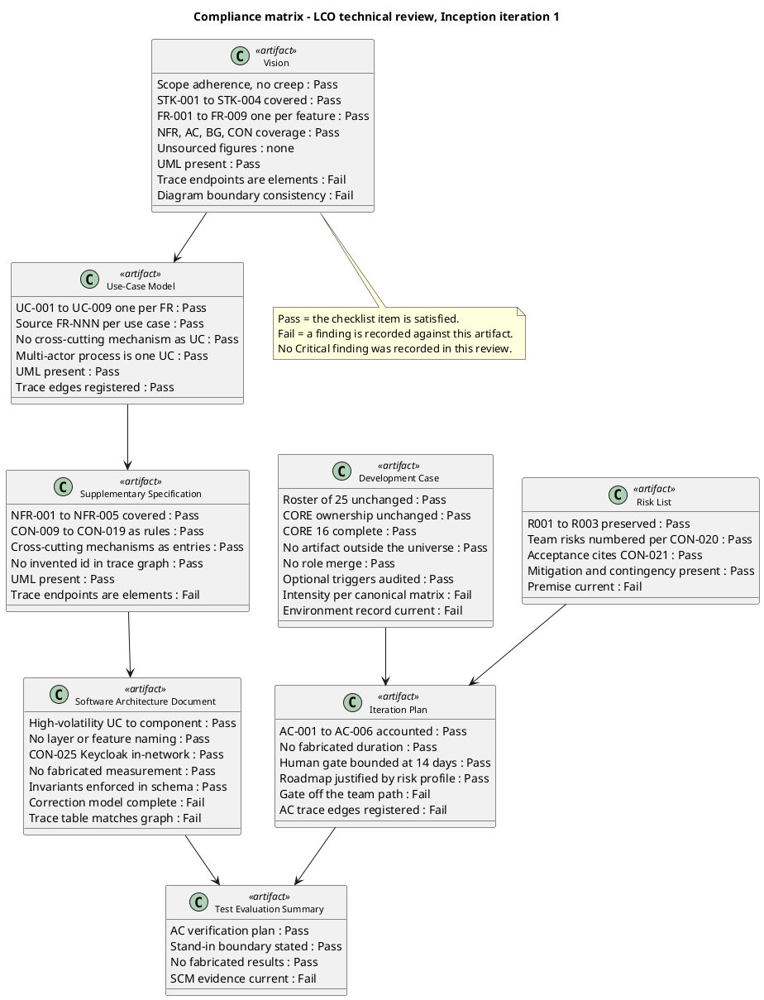
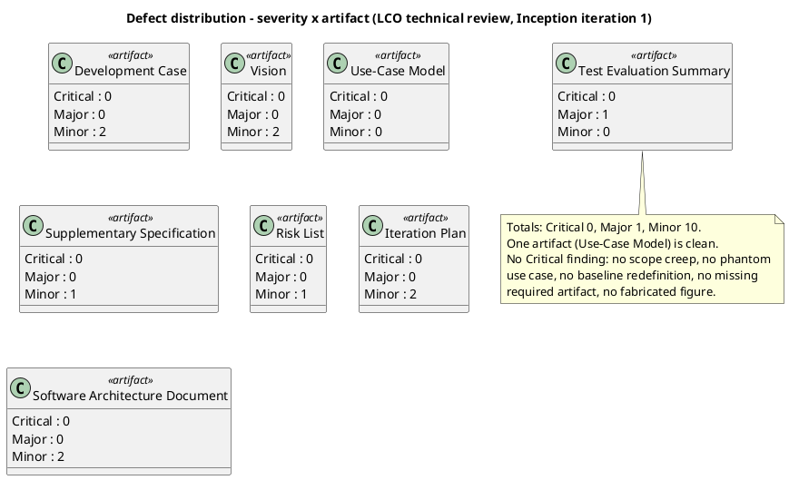

## Document Control

- **Phase:** Inception
- **Status:** Draft — LCO technical review, iteration 1
- **Milestone Target:** Lifecycle Objectives (LCO) — end of Inception. NOT YET ACHIEVED.

## Review Scope and Criteria

### Reviewer lens

**Review type.** Technical review (peer-led, checklist-driven, findings documented). Not a formal Fagan inspection: no reader paraphrase step and no separate recorder role.

**Review point.** Lifecycle milestone — LCO. The evaluative lens is **exit criteria**, not completion: do the artifacts collectively satisfy the conditions for phase transition? No completion lens is applied, because Inception produces a baseline and not a running system.

**Artifacts reviewed (8 of 8).** Development Case, Vision, Use-Case Model, Supplementary Specification, Risk List, Iteration Plan, Software Architecture Document, Test Evaluation Summary.

**Upstream consumption.** Every artifact was read in full before any finding was recorded. The traceability tree was projected from the Business level (47 roots, 150 nodes) and used as the completeness instrument, never the artifacts' own prose.

**Checklists applied, per artifact type.**

| Artifact | Checklist applied |
|---|---|
| Development Case | DC Baseline Conformance (§1.2) against the IARI baseline in force; Optional Trigger Justification against each §5.2 condition; intensity against the canonical matrix |
| Vision | Scope adherence against the declared scope; stakeholder coverage; unsourced-figure check; UML presence; trace endpoints |
| Use-Case Model | One UC per declared FR; `Source: FR-NNN` per use case; no cross-cutting mechanism as a UC; multi-actor process as one UC; UML presence |
| Supplementary Specification | NFR coverage; business rules as rules; cross-cutting mechanisms as entries with `<<include>>`; no invented identifier in the trace graph |
| Risk List | Declared risks preserved with identifier and magnitude; team risks numbered per CON-020; acceptance citing CON-021; mitigation and contingency present |
| Iteration Plan | Every declared acceptance criterion accounted for; no fabricated duration; human gate bounded and reported apart; roadmap justified against the risk profile |
| Software Architecture Document | Every High-volatility use case mapped to a component; no layer- or feature-named subsystem; CON-025 placement; no fabricated measurement; invariants enforced in the schema |
| Test Evaluation Summary | Acceptance-verification plan per criterion; stand-in boundary stated; no fabricated result; SCM evidence current |

**Entry criteria.** All eight artifacts present and in Draft; the Development Case present and carrying tailoring content, so it governs this review. No artifact was found to be a placeholder mid-review.

**SCM evidence (Construction/Transition rule applied at LCO as a reality check).**

| Evidence | Observed value |
|---|---|
| Open pull requests | none — `scm_list_pull_requests(open)` returned none |
| Branches awaiting review | none — `scm_list_branches_with_label("ready-for-review")` returned none |
| Build on `main` | success — run `36050339100` |
| Open issues | `Issue #1` |

**Pull-request disposition.** Zero open pull requests and zero branches awaiting review, so no PR reached a terminal disposition this pass. This is consistent with Inception scope: RUP Ch.4 places no implementation activity in Inception, and no scaffolding PR was raised either. No productive code, no scope-ahead branch, and no defective diff was found to dispose.

**Scope of this lens.** This is the generic Reviewer lens — the technical review of the artifacts produced this iteration. The Management Reviewer's lens and the Business Reviewer's lens are separate blocks in this same Review Record and are not written here.

## Findings

### Reviewer lens

**Summary.** 11 findings: 0 Critical, 1 Major, 10 Minor. One artifact — the Use-Case Model — is clean and carries no finding. No Critical finding was recorded, so no finding of this lens escalates to the stakeholder.

**Compliance matrix.** Every checklist item evaluated, recorded Pass or Fail. A Fail is a finding.

**Defect distribution.**

**Annotated review map.** Where each finding sits, and which LCO exit criterion the artifact evidences.

```plantuml
@startuml RR_AnnotatedMap
title Annotated review map - artifacts, findings and the LCO exit criteria they evidence
skinparam classAttributeIconSize 0

class "Vision" as V <<artifact>>
class "Use-Case Model" as UCM <<artifact>>
class "Supplementary Specification" as SS <<artifact>>
class "Development Case" as DC <<artifact>>
class "Risk List" as RL <<artifact>>
class "Iteration Plan" as IP <<artifact>>
class "Software Architecture Document" as SAD <<artifact>>
class "Test Evaluation Summary" as TES <<artifact>>

class "C1 Scope agreed" as C1 <<criterion>>
class "C2 Project viable" as C2 <<criterion>>
class "C3 Risks identified" as C3 <<criterion>>
class "C4 Process governs" as C4 <<criterion>>
class "C5 Stand-in environment" as C5 <<criterion>>
class "C6 Build verifiable" as C6 <<criterion>>

V --> C1
UCM --> C1
SS --> C1
SAD --> C2
DC --> C4
RL --> C3
IP --> C3
IP --> C5
IP --> C6
TES --> C6

note right of V
  2 Minor
  - trace endpoints are document sections
  - diagram draws Keycloak to UC-001 only
end note

note right of DC
  2 Minor
  - environment-readiness record stale
  - Environment narrative vs canonical matrix
end note

note right of SAD
  2 Minor
  - trace table vs registered graph
  - correction model incomplete
end note

note right of IP
  2 Minor
  - human gate serialized ahead of Iter-3
  - AC-002 to AC-005 carry no trace edge
end note

note right of TES
  1 Major
  - asserts the tracker holds no issues
end note

note bottom of C5
  C5 is not evidenced by any artifact: the
  Development Case records the stand-in
  environment as not ready. C6 is met by the
  green build on main despite the stale record.
end note
@enduml
```

**Findings.**

| Key | Artifact | Severity | Finding | Recommendation |
|---|---|---|---|---|
| `Development Case#F1` | Development Case | Minor | The Environment readiness verification table records the CI pipeline as not ready, and the Tailoring Overview and Environment narrative repeat the gap. The pipeline exists and builds — run `36050339100` on `main` is green. The record contradicts observable SCM state. | Record the CI pipeline as present and green on `main`, citing the observed run. Keep the gap open only for the genuinely absent items: `CONTRIBUTING.md`, lint configuration, stand-in environment. |
| `Development Case#F2` | Development Case | Minor | The Disciplines and Intensity table records Environment as "one-time at project start … recurring thereafter" in the delta column. The canonical matrix assigns Environment a level per phase. The row states a recurrence pattern where the matrix states a level, so it does not confirm the matrix it claims to confirm. | State the Environment row as per canonical matrix with the level per phase; move the one-time/recurring narrative to the Environment discipline section, where it already appears. |
| `Vision#F1` | Vision | Minor | The Traceability table's Traces To column names document sections — "Use-Case Model", "Supplementary Specification", "Risk List" — rather than trace-graph elements. A document section is not an element, so these rows register no edge. | Replace the section names with the element identifiers the row feeds — `UC-001`..`UC-009`, `NFR-001`..`NFR-005`, `R001`..`R003` — and register one edge per row. |
| `Vision#F2` | Vision | Minor | The Product Overview boundary diagram draws Keycloak to `UC-001` only, while the Use-Case Model's diagram of the same boundary draws Keycloak to all nine use cases. Two diagrams of one boundary disagree. | Draw Keycloak to all nine use cases, or state in the note that the single edge is a drawing simplification of the login mechanism that reaches every use case. |
| `Supplementary Specification#F1` | Supplementary Specification | Minor | The Traceability table's Traces To column names document sections — "Test Case", "Design Model", "Software Architecture Document", "Iteration Assessment", "Release Notes", "Risk List" — rather than elements. The registered graph shows this artifact as a leaf, so the downstream edges the table claims are not registered. | Name the element identifiers in Traces To, or state that the downstream artifacts do not yet exist and the edges will be registered when their elements are minted. Extend the existing label-scope note to the Traces To column. |
| `Risk List#F1` | Risk List | Minor | `R009`'s premise is that the CI pipeline definition is not in place, so the first build cannot be verified. The pipeline exists and builds — run `36050339100` on `main` is green. The risk as stated is partly retired and its mitigation claims work already done. | Restate `R009` to cover only the guideline files that are genuinely absent, or record the CI half as retired with the observed run as evidence, and adjust the mitigation. |
| `Iteration Plan#F1` | Iteration Plan | Minor | The roadmap gantt serializes the human validation gate ahead of Iter-3, placing the gate on the critical path. The plan's own text states the opposite: the team's work does not wait on the gate and every use case is built and tested against the stand-ins. | Draw the gate in parallel with Iter-2 and Iter-3 rather than in series before Iter-3, so the diagram matches the stated discipline. |
| `Iteration Plan#F2` | Iteration Plan | Minor | The Evaluation Criteria table accounts for all six acceptance criteria and defers each to a named iteration, but only `AC-001` and `AC-006` carry a registered trace edge. `AC-002`, `AC-003`, `AC-004` and `AC-005` have no outgoing edge, so the criterion-to-use-case mapping exists only as prose. | Register the missing edges — `AC-002` and `AC-005` to `UC-001`, `AC-003` to `UC-005`, `AC-004` to `UC-008`. |
| `Software Architecture Document#F1` | Software Architecture Document | Minor | The Traceability table declares edges not registered in the trace graph and, for `COMP-003`, lists `UC-001` on both sides of the row. A component realizes the use case it fulfils; it is not derived from it. The table also claims `COMP-001` reaches `UC-001`, `UC-002` and `UC-008`, while the graph registers only `COMP-001` to `UC-004`. | Reconcile the table with the registered edges: drop `UC-001` from the Traces From side of the `COMP-003` row, and either register the `COMP-001` edges or remove them from the table. |
| `Software Architecture Document#F2` | Software Architecture Document | Minor | The key-abstractions class diagram gives `Clocking` mutable `clockInUtc` and `clockOutUtc` fields plus a `corrected` flag, while the Data View states the clocking row is never updated in place (CON-012). The model does not state which value FR-003's ClockIn and ClockOut columns read when a correction exists, so the export contract is ambiguous against the correction model. | State that `Clocking`'s time fields are immutable and that the effective value is resolved from the correction chain, and name the resolution rule the export applies when a day carries one or more corrections. |
| `Test Evaluation Summary#F1` | Test Evaluation Summary | **Major** | The artifact asserts that the SCM issue tracker holds no issues and reports no defect — in the Test Summary evidence table, the Defects and Incidents section and the Conclusions table. The tracker holds `Issue #1`, labelled `severity:minor`, `nature:defect`, `configuration-record`. The claim is false against observable SCM state and would let the milestone verdict conclude that no defect exists. | Correct the three places to record `Issue #1` as the open defect and state the defect count as one. The artifact's own rule — a defect is an SCM issue and its identifier is the issue number — already supports this; the evidence block was not refreshed. |

**Traceability compliance.** The traceability tree was projected from the Business level and used as the completeness instrument. Result: 47 roots, 150 nodes, **no `SUSPECT` edge and no `UNKNOWN LABEL`**. No `«LEAF»` at Business level — every declared requirement and acceptance criterion reaches at least one downstream element, so no requirement is unrealized. The defects found are in the artifacts' own traceability *tables*, which declare edges the graph does not carry (`Vision#F1`, `Supplementary Specification#F1`, `Software Architecture Document#F1`) or omit edges the graph should carry (`Iteration Plan#F2`). The graph itself is sound; the tables are not reconciled with it.

**Scope-adherence result.** No scope creep was found. Nine use cases, one per declared `FR-001`..`FR-009`; every use case carries a `Source: FR-NNN` line citing a declared requirement; no phantom use case; no cross-cutting mechanism modelled as a use case — OIDC login, authorization, LDAP read, audit write and the clocking retry are all Supplementary Specification entries with `<<include>>` from their dependent use cases. No `[DERIVED]` marker was found in any artifact, so no silent derivation promotion exists to flag. No unsourced quantitative claim was found: the artifacts state declared targets and explicitly record that no measurement exists yet.

**DC baseline conformance result.** The Development Case does not redefine the 25-role roster, does not reassign CORE ownership, does not omit a CORE artifact, does not list an artifact outside the CORE + OPTIONAL universe, and does not merge two roles. Business Modeling is declared INACTIVE with the correct trigger condition (`business-process-led = false`). All six OPTIONAL triggers were audited against their §5.2 conditions and none was found over-triggered — each NOT-FIRED verdict holds against the project's real facts. The two findings against this artifact are a stale environment record and an intensity-row wording defect, not a baseline violation.

## Resolutions and Actions

### Reviewer lens

**Prior findings of this lens.** None. This is the first review pass of the Reviewer lens on this project: `read_artifact_findings` returned an empty list for all eight artifacts, so no prior finding of this lens exists to close, defer or reject. No `resolve_artifact_finding` call was emitted this pass.

**Actions arising from this pass.** Each action is the finding's Recommendation; its status is that finding's Resolution. No action identifier is minted.

| Finding | Owner | Action | Blocking? |
|---|---|---|---|
| `Test Evaluation Summary#F1` | TestManager | Record `Issue #1` as the open defect in the three places that assert none exists; state the defect count as one | No — the artifact's mission verdict is unaffected, but the evidence block must not contradict the tracker |
| `Development Case#F1` | ProcessEngineer | Refresh the Environment readiness record to show the CI pipeline present and green on `main` | No |
| `Development Case#F2` | ProcessEngineer | State the Environment intensity row per canonical matrix; move the recurrence narrative to the Environment section | No |
| `Risk List#F1` | ProjectManager | Restate `R009` to cover only the absent guideline files, or record the CI half as retired | No |
| `Iteration Plan#F1` | ProjectManager | Draw the human validation gate in parallel with Iter-2 and Iter-3 | No |
| `Iteration Plan#F2` | ProjectManager | Register the missing acceptance-criterion edges | No |
| `Vision#F1` | SystemAnalyst | Replace section names in Traces To with element identifiers | No |
| `Vision#F2` | SystemAnalyst | Align the boundary diagram with the Use-Case Model's | No |
| `Supplementary Specification#F1` | RequirementsSpecifier | Name element identifiers in Traces To, or state the downstream elements do not yet exist | No |
| `Software Architecture Document#F1` | SoftwareArchitect | Reconcile the traceability table with the registered edges | No |
| `Software Architecture Document#F2` | SoftwareArchitect | State the clocking time fields as immutable and name the export's correction-resolution rule | No |

**Carry-over.** No finding of this lens is deferred and none is rejected. All 11 remain open for the next iteration of this Reviewer, which will reconcile them in its closure state before recording new defects.

## Disposition

### Reviewer lens

**Overall disposition: Approved with Changes.**

The artifacts are fit to carry the project into Elaboration, subject to the 11 findings above. No Critical finding was recorded, so nothing blocks the phase transition and no finding of this lens escalates to the stakeholder. The single Major finding is a factual error in one evidence block, not a defect in the baseline it reports.

**LCO exit criteria, assessed against the artifacts and the SCM.**

| # | Exit criterion | Verdict | Basis |
|---|---|---|---|
| 1 | Stakeholders agree on the scope | Met | Vision and Use-Case Model carry the declared scope with no creep: nine use cases, one per declared `FR-001`..`FR-009`, each citing its source requirement. No element outside the declared scope. |
| 2 | The project is viable | Met | The stack is pinned by CON-022/CON-023/CON-024; the OIDC client is already registered (CON-003) so login is testable from day one; the Development Case's Architectural Proof-of-Concept NOT-FIRED verdict holds — no technical risk requires empirical validation. |
| 3 | Initial risks identified and classified | Met | Risk List carries `R001`..`R009` with probability, impact, magnitude, strategy, owner, mitigation and contingency. `R001`..`R003` preserved with the declared identifiers and magnitudes; team risks numbered per CON-020; every acceptance cites CON-021. |
| 4 | The process configuration governs the project | Met | Development Case conforms to the IARI baseline: roster unchanged, CORE ownership unchanged, no artifact outside the universe, Business Modeling INACTIVE on the correct trigger, all six OPTIONAL triggers audited and none over-triggered. |
| 5 | The stand-in environment is available (CON-028) | **Not met** | The Development Case records the stand-in OIDC issuer and stand-in directory as not ready, and no artifact evidences them. This is the criterion that gates every use case, and it is iteration-1 environment work still outstanding. |
| 6 | The build is verifiable (CON-026) | Met | Run `36050339100` on `main` is green. The Development Case's record of this criterion is stale (`Development Case#F1`), but the criterion itself is satisfied by the observed build. |

**Reading of the verdict.** Criteria 1, 2, 3, 4 and 6 are met. Criterion 5 is not met: the stand-in environment is the project's principal process control and it does not yet exist. That is a gap in the iteration's own exit criteria, not a defect in any artifact — the Development Case and the Iteration Plan both name it correctly and assign it an owner. It is recorded here so the milestone verdict is taken on the evidence rather than on the artifacts' self-assessment.

**What this lens does not decide.** The LCO verdict belongs to the ReviewCoordinator and the ManagementReviewer. This block states the technical lens's disposition and the exit-criteria evidence; it does not close the milestone.

## Traceability

| Element | Traces From | Link Type | Traces To |
|---|---|---|---|
| Review Record | Development Case, Vision, Use-Case Model, Supplementary Specification, Risk List, Iteration Plan, Software Architecture Document, Test Evaluation Summary | Refines | LCO |
| Reviewer lens — compliance matrix | Development Case, Vision, Use-Case Model, Supplementary Specification, Risk List, Iteration Plan, Software Architecture Document, Test Evaluation Summary | Refines | LCO |
| Reviewer lens — findings | Development Case#F1, Development Case#F2, Vision#F1, Vision#F2, Supplementary Specification#F1, Risk List#F1, Iteration Plan#F1, Iteration Plan#F2, Software Architecture Document#F1, Software Architecture Document#F2, Test Evaluation Summary#F1 | Refines | LCO |
| Reviewer lens — SCM evidence | Issue #1, run 36050339100 | Refines | LCO |
| Reviewer lens — disposition | AC-001, AC-002, AC-003, AC-004, AC-005, AC-006, CON-028, CON-026 | Refines | LCO |
