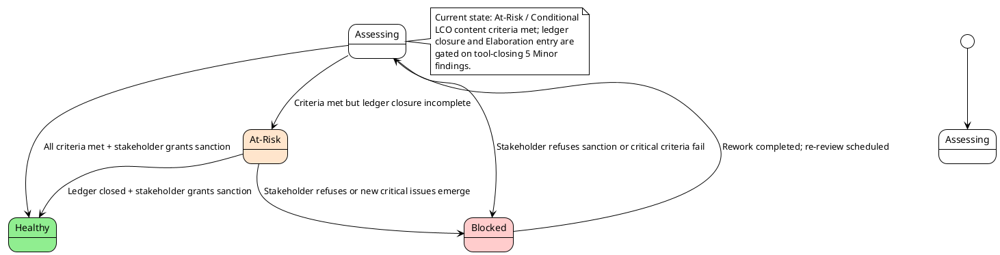
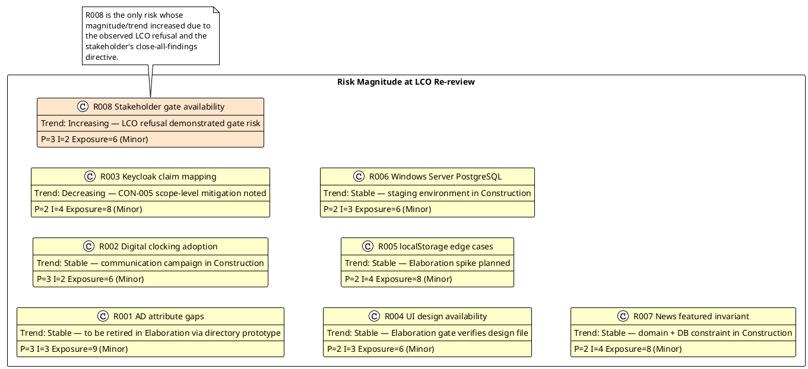
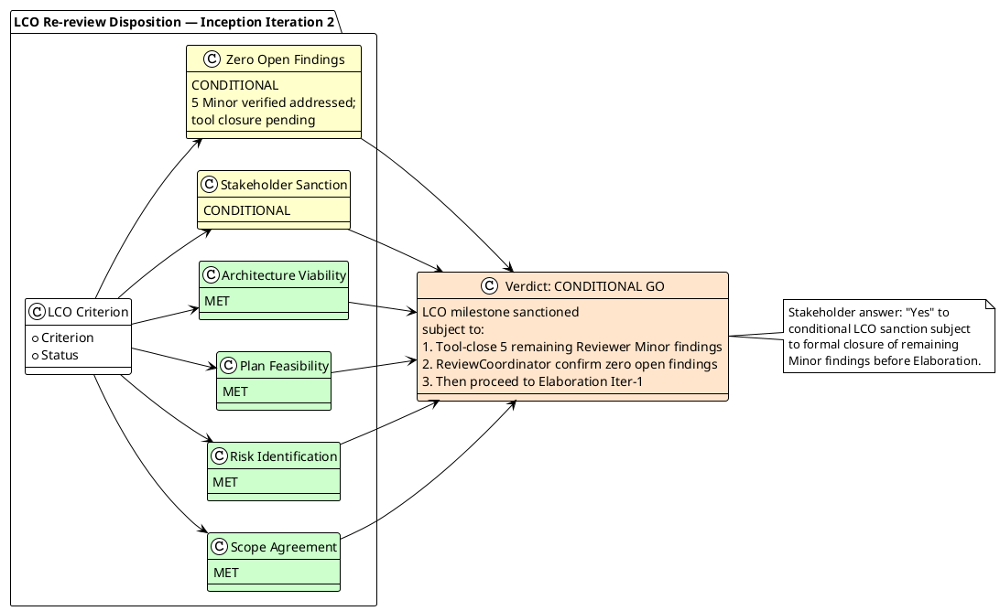
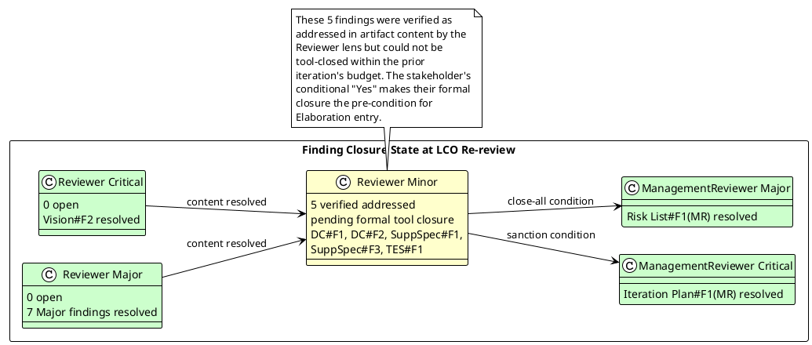

## Document Control

| Field | Value |
|---|---|
| Project | Portal |
| Phase | Inception |
| Iteration | 2 |
| Review Type | Lifecycle Objectives (LCO) milestone review |
| Reviewer Lens | Management Reviewer |
| Status | Draft |
| Milestone Target | End-of-Inception LCO re-review after findings closed |

## Review Scope and Criteria

This Management Reviewer assessment evaluates the Inception-phase planning and project-assessment artifacts for the Portal project against the Lifecycle Objectives (LCO) exit criteria. The review covers:

- Vision
- Iteration Plan
- Risk List
- Iteration Assessment

Evaluation criteria applied:
1. Scope agreement — stakeholders agree on what is in/out of scope.
2. Stakeholder acceptance — the stakeholder sanctions advancing past LCO.
3. Risk identification — key risks identified with magnitude ratings and trend direction.
4. Plan feasibility — initial plan is achievable under the two-currency measurement discipline.
5. Architecture viability — candidate architecture supports the declared scope.
6. Zero open findings — the stakeholder directed that all findings, including Minor findings, must close before LCO.

## Findings

### Prior ManagementReviewer Finding Reconciliation

| ID | Artifact | Severity | Finding | Disposition |
|---|---|---|---|---|
| Iteration Plan#F1(MR) | Iteration Plan | Critical | LCO stakeholder sanction REFUSED in Iteration 1; project blocked until all findings closed. | **RESOLVED** — Stakeholder granted conditional LCO sanction at re-review on 2026-09-11, subject to formal tool-closing of 5 remaining Reviewer Minor findings before Elaboration. |
| Risk List#F1(MR) | Risk List | Major | Stakeholder directive: close all findings including minors; elevates LCO gate bar to zero open findings. | **RESOLVED** — Directive incorporated into conditional LCO verdict; the 5 remaining Reviewer Minor findings (verified addressed in content) must be tool-closed before Elaboration begins. |

### New Findings This Iteration

No new ManagementReviewer findings were identified during the LCO re-review. All LCO content criteria are met; the only remaining conditions are ledger-level closure of 5 previously verified Minor findings and the stakeholder's conditional sanction, which has now been granted.

### LCO Compliance Assessment

```plantuml
@startuml LCO_Compliance_Table_Iter2
!theme plain
skinparam classAttributeIconSize 0

class "LCO Exit Criterion" as CRIT {
  + ID
  + Criterion
  + Status
  + Evidence
}

class "C-001 Scope Agreement" as C001 #LightGreen {
  Status: MET
  Evidence: Vision §Stakeholder Summary confirms HR capabilities belong to AD "HR" group role per stakeholder answer
}

class "C-002 Stakeholder Acceptance" as C002 #LightYellow {
  Status: CONDITIONAL MET
  Evidence: Stakeholder answered "Yes" to conditional LCO sanction subject to closing 5 remaining Minor findings
}

class "C-003 Risk Identification" as C003 #LightGreen {
  Status: MET
  Evidence: Risk List §Risk Register contains 8 risks with P/I ratings, magnitude, derivation markers
}

class "C-004 Initial Plan Feasibility" as C004 #LightGreen {
  Status: MET
  Evidence: Iteration Plan uses unanchored Gantt, token budget box, queue time reported separately
}

class "C-005 Architecture Viability" as C005 #LightGreen {
  Status: MET
  Evidence: SAD sketches proportionate single-server .NET 10 / Razor Pages / PostgreSQL architecture
}

class "C-006 Zero Open Findings" as C006 #LightYellow {
  Status: CONDITIONAL MET
  Evidence: 5 Reviewer Minor findings verified addressed but not tool-closed; closure is pre-condition for Elaboration
}

CRIT --> C001
CRIT --> C002
CRIT --> C003
CRIT --> C004
CRIT --> C005
CRIT --> C006

note right of C002
  Stakeholder acceptance is obtained
  by asking, not by manufacturing
  signatures. The stakeholder's
  "Yes" is the documented acceptance.
end note

note bottom of C006
  All artifact content issues are
  resolved. The remaining open items
  are ledger-level closure of 5 Minor
  findings and the stakeholder
  sanction itself, which is now
  granted conditionally.
end note
@enduml
```

### Project Health State

### Risk Retirement Trend

## Resolutions and Actions

### Closed ManagementReviewer Findings

| ID | Artifact | Severity | Resolution | Evidence |
|---|---|---|---|---|
| Iteration Plan#F1(MR) | Iteration Plan | Critical | Stakeholder granted conditional LCO sanction at re-review. | Stakeholder answer: "Yes" to conditional LCO sanction, subject to closing 5 remaining Minor findings before Elaboration. |
| Risk List#F1(MR) | Risk List | Major | Close-all-findings directive incorporated into conditional LCO verdict. | Stakeholder answer: "Yes" to conditional LCO sanction, subject to closing 5 remaining Minor findings before Elaboration. |

### Open Actions

| Action ID | Finding | Owner | Target Artifact | Severity | Status |
|---|---|---|---|---|---|
| A-020 | Development Case#F1 | Process Engineer | Development Case | Minor | Verified addressed; tool-close before Elaboration |
| A-021 | Development Case#F2 | Process Engineer | Development Case | Minor | Verified addressed; tool-close before Elaboration |
| A-022 | Supplementary Specification#F1 | RequirementsSpecifier | Supplementary Specification | Minor | Verified addressed; tool-close before Elaboration |
| A-023 | Supplementary Specification#F3 | RequirementsSpecifier | Supplementary Specification | Minor | Verified addressed; tool-close before Elaboration |
| A-024 | Test Evaluation Summary#F1 | Test Manager / Reviewer | Review Record / TES | Minor | Review observation; tool-close before Elaboration |

## Disposition

**LCO Milestone Verdict: CONDITIONAL GO**

The Lifecycle Objectives milestone is sanctioned for advancement to Elaboration, subject to the following explicit conditions:

1. The Reviewer lens must formally tool-close the 5 remaining Minor findings (Development Case#F1, Development Case#F2, Supplementary Specification#F1, Supplementary Specification#F3, Test Evaluation Summary#F1). These findings have been verified as addressed in artifact content but remain open in the process ledger.
2. The ReviewCoordinator must confirm zero open findings across all reviewer lenses before the project enters Elaboration.
3. Upon zero-open-findings confirmation, the project proceeds to Elaboration Iteration 1 without requiring a further stakeholder question.

**Rationale:**
- Scope agreement is achieved: the Vision correctly attributes HR capabilities to the AD "HR" group role per the stakeholder's Iteration 1 clarification.
- Risk identification is complete: the Risk List contains 8 risks with magnitude ratings, response strategies, owners, and derivation markers distinguishing declared from derived risks.
- Plan feasibility is demonstrated: the Iteration Plan uses an unanchored Gantt, a token budget box with planned vs actual columns, and reports human gate queue time separately from agent work.
- Architecture viability is proportionate: the Software Architecture Document sketches a single-server .NET 10 / Razor Pages / PostgreSQL solution integrated with existing Keycloak and Active Directory.
- The stakeholder has granted conditional sanction, accepting the project scope and objectives subject to the remaining Minor findings being tool-closed before Elaboration begins.

**Forward risk:** R008 (stakeholder availability for gates) has increased in observed magnitude because the LCO gate required rework and re-review. The Iteration Plan budgets queue time for future gates; if a stakeholder cannot respond within the 14-day ceiling, the process suspends.

### Final Disposition Diagram

### Finding Closure State

## Traceability

| Element | Traces From | Link Type | Traces To |
|---|---|---|---|
| Review Record | Iteration Plan#F1(MR) | Refines | Iteration Plan §Milestone Target |
| Review Record | Risk List#F1(MR) | Refines | Risk List §Risk Register, §Risk Mitigation and Contingency |
| Review Record | Stakeholder LCO sanction answer | DependsOn | Iteration Plan, Risk List |
| Review Record | LCO compliance assessment | Refines | Vision, Iteration Plan, Risk List, SAD |
| Review Record | Risk retirement trend | DependsOn | Risk List R001..R008 |
| Review Record | Open action items | Refines | Development Case, Supplementary Specification, Test Evaluation Summary |
