## Document Control
- **Phase:** Inception
- **Status:** Consolidated — LCO milestone review, iteration 2. Verdict: No-Go (stakeholder sanction REFUSED).
- **Milestone Target:** Lifecycle Objectives (LCO) — end of Inception. NOT YET ACHIEVED.
## Review Scope and Criteria
### Reviewer lens

**Review type.** Technical review at the Lifecycle Objectives review point. The evaluative lens is **exit criteria**, not completion: the question is whether the artifact set collectively satisfies the conditions for phase transition, and whether each artifact is internally sound and consistent with the artifacts it derives from.

**Artifacts reviewed this pass.** Eight: Vision, Use-Case Model, Supplementary Specification, Development Case, Risk List, Iteration Plan, Software Architecture Document, Test Evaluation Summary. The Iteration Assessment is not reviewed for currency — the Project Manager authors it in the Assess touchpoint that runs after this review, so at review time it cannot yet describe the iteration being reviewed. Its absence or lag is not a finding and not a gate condition.

**Upstream consumption.** Every artifact was read against the artifacts it derives from before any finding was recorded: the Use-Case Model against the Vision's declared scope, the Supplementary Specification against the Use-Case Model, the Software Architecture Document against the Use-Case Model and the Supplementary Specification, the Test Evaluation Summary against the acceptance criteria and the Use-Case Model, and the Development Case, Risk List and Iteration Plan against the declared scope and each other. The traceability tree was projected from the Business level and used as the completeness instrument.

**Checklists applied, per artifact type.**

| Artifact | Checklist |
|---|---|
| Vision | Scope adherence and no creep; stakeholder coverage; one feature per declared FR; NFR/AC/BG/CON coverage; no unsourced figure; UML present; trace endpoints are elements; diagram consistency with the Use-Case Model |
| Use-Case Model | One UC per declared FR with a `Source: FR-NNN` line; no cross-cutting mechanism as a UC; multi-actor process is one UC; UML present; trace edges registered; SUSPECT edges reviewed; realizing-component table current |
| Supplementary Specification | NFR-001..NFR-005 covered; CON-009..CON-019 as rules; cross-cutting mechanisms as entries; no invented identifier; UML present; trace endpoints are elements; downstream element currency |
| Development Case | DC baseline conformance (roster, CORE ownership, CORE completeness, artifact universe, no role merge); optional trigger justification against each §5.2 condition; intensity per canonical matrix; environment record current; SCM issue record current |
| Risk List | R001..R003 preserved with declared identifiers and magnitudes; team risks numbered per CON-020; acceptance cites CON-021; mitigation and contingency present; premise current; unconfirmed basis flagged |
| Iteration Plan | AC-001..AC-006 accounted for; no fabricated duration or calendar date; human gate bounded and off the team's path; AC trace edges registered; measured actuals recorded; exit criteria carry a verdict |
| Software Architecture Document | High-volatility UC to dedicated component; no layer or feature naming; CON-025 Keycloak in-network; no fabricated measurement; invariants enforced in schema; correction model complete; trace table matches the graph |
| Test Evaluation Summary | AC verification plan; stand-in boundary stated; no fabricated result; SCM evidence current |

**SCM evidence taken at this review.** `scm_list_pull_requests(open)` returns no open pull request, so no PR required a disposition. `scm_get_build_status(main)` returns success for run `36095051721`. `scm_list_issues(all)` returns three open issues: `Issue #1`, `Issue #2`, `Issue #3`, all labelled `severity:minor`, `nature:defect`, `configuration-record`.

**Entry criteria.** All eight artifacts are present and in a reviewable state; the upstream artifacts each depends on are available; the checklists above were prepared before the artifacts were read. No artifact was found to be a placeholder mid-review.

### Business Reviewer lens

**Review type.** Business Modeling quality gate — scenario-appropriateness assessment and derivation-readiness check. Not a Fagan inspection: no reader paraphrase step and no separate recorder role.

**Review point.** Lifecycle milestone — LCO. The evaluative lens is **exit criteria**: does the Business Modeling discipline's contribution satisfy the conditions for phase transition? The Business Modeling discipline is INACTIVE on this project, so the lens applied is the **inactivity justification** lens, not the artifact-quality lens.

**Scenario assessment (Heuristic 1 — assessed FIRST, before any artifact was read).** The six RUP business modeling scenarios were evaluated against the declared scope. **None applies.** The project builds one web application for one organisation against declared system requirements (`FR-001`..`FR-009`); no business process is modelled, re-engineered or reused. No scenario-appropriate standard can therefore be applied to a business-model artifact, because no such artifact is required. Applying New Business or Revamp standards here would manufacture false defects — the anti-pattern the discipline's own heuristics warn against.

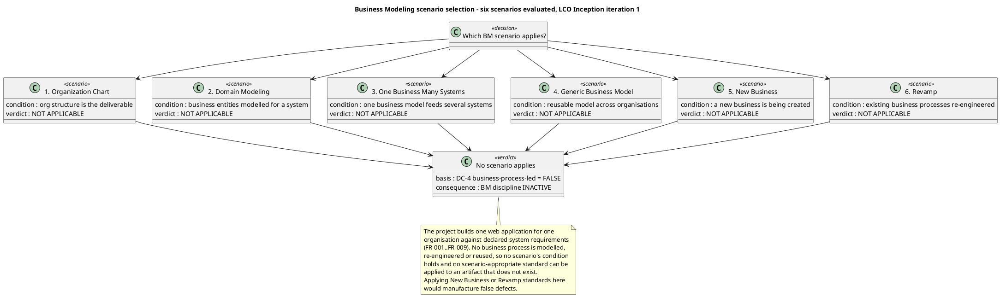

**DC §4 classification, independently re-verified.** `get_dc_classification` returned `isBusinessProcessLed: false`, re-evaluated this iteration, with all four criteria evaluated and none fired. I re-verified each criterion against the declared scope rather than accepting the verdict, and checked whether any Change Request had altered the basis — none has.

| DC §4 criterion | Recorded verdict | Independent re-verification |
|---|---|---|
| (a) project re-engineers or automates a business process | NOT FIRED | Confirmed. The portal replaces three manual artefacts (Excel clocking sheets, mass emails, PDF phone list) with a web application. No HR process is re-engineered and no process model is produced. |
| (b) business actors and business workers are modelled | NOT FIRED | Confirmed. The declared scope names system actors (Employee, HR Administrator) and external systems (AD, Keycloak). No business actor and no business worker is declared anywhere. |
| (c) a Business Use-Case Model is an input or an output | NOT FIRED | Confirmed. The declared scope supplies system use cases `UC01`/`UC02`/`UC03` and `FR-001`..`FR-009` directly. No BUC is declared or required. |
| (d) the stakeholder declared business processes rather than system requirements | NOT FIRED | Confirmed. The stakeholder declared system requirements, system invariants (`CON-009`..`CON-019`) and acceptance criteria (`AC-001`..`AC-006`), all system-level. |

**Business Modeling artifact inventory — the evidence for the inactivity verdict.** The gate is not the classification alone; it is the classification *plus* the observed absence of every business-model artifact. Both hold.

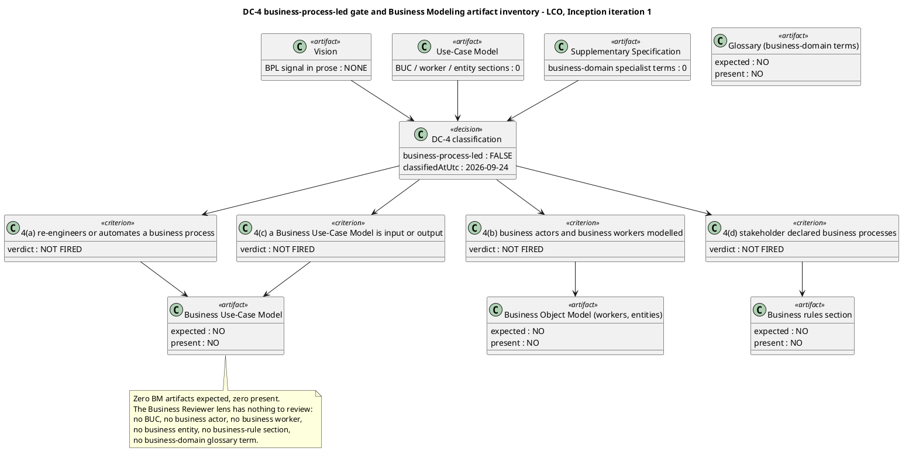

**Artifacts read in full before any finding was recorded (upstream consumption).** Vision, Use-Case Model, Supplementary Specification, Review Record (all existing lens blocks), plus the DC §4 classification. The Development Case, Risk List, Iteration Plan, Software Architecture Document and Test Evaluation Summary were not read: none can carry a business-model section, and the Business Modeling discipline's artifact surface is exhausted by the three read.

**Checklists applied.** The Business Modeling checklist (Heuristic 1.2) was applied item by item and every item recorded Pass or N/A. N/A is not a defect: the Development Case does not require a business-model artifact of the BPA this phase, so a finding against a non-required artifact would be a false defect.

**Entry criteria.** The Development Case is present and carries tailoring content, so it governs this review. The DC §4 classification is recorded and re-evaluated this iteration. No business-model artifact was expected and none was found to be a placeholder mid-review.

**Scope of this lens.** This is the Business Reviewer lens — the business-modeling quality gate. The generic Reviewer's technical lens and the Management Reviewer's lens are separate blocks in this same Review Record and are not written here.

### Management Reviewer lens

**Review type.** Lifecycle Milestone Review — the LCO gate, Inception iteration 2. This is a formal gate verdict, not a courtesy read-through: the question is whether the phase's exit criteria are satisfied, and the burden of proof rests on the project team.

**Review point.** Lifecycle milestone — LCO, end of Inception. The evaluative lens is **exit criteria**, not completion. Inception produces a baseline, not a running system, so no completion lens is applied and no acceptance criterion is expected to be verified.

**Artifacts reviewed (8 of 8).** Development Case, Vision, Use-Case Model, Supplementary Specification, Risk List, Iteration Plan, Software Architecture Document, Test Evaluation Summary.

**Upstream consumption.** Every artifact was read in full before any finding was recorded. The trace graph was projected from the Business level (66 roots, 231 nodes) and used as the completeness instrument, never the artifacts' own prose.

**Checklists applied, per artifact type.**

| Artifact | Management checklist applied |
|---|---|
| Iteration Plan | Every declared acceptance criterion accounted for; iteration exit criteria stated and evidenced; no fabricated duration or calendar date; human gate bounded and reported apart from agent time; measured spend recorded per CON-027; roadmap justified against the risk profile |
| Risk List | Declared risks preserved with identifier and magnitude; team risks numbered per CON-020; acceptance citing CON-021; magnitude bands anchored on a confirmed basis; mitigation and contingency present and their execution evidenced; retirement trend |
| Development Case | DC baseline conformance against the IARI baseline; optional-trigger justification against each §5.2 condition; intensity against the canonical matrix; environment readiness evidenced at the gate, not only planned |
| Vision | Scope adherence against the declared scope; stakeholder coverage; unsourced-figure check; business-goal verification path |
| Use-Case Model | One UC per declared FR; no cross-cutting mechanism as a UC; multi-actor process as one UC |
| Supplementary Specification | NFR coverage; business rules as rules; cross-cutting mechanisms as entries with `<<include>>` |
| Software Architecture Document | Every High-volatility use case mapped to a component; CON-025 placement; no fabricated measurement |
| Test Evaluation Summary | Acceptance-verification plan per criterion; stand-in boundary stated; no fabricated result; SCM evidence current |

**Entry criteria.** All eight artifacts present and in Draft; the Development Case present and carrying tailoring content, so it governs this review. No artifact was found to be a placeholder mid-review.

**SCM evidence.**

| Evidence | Observed value |
|---|---|
| Build on `main` | success — run `36095051721` |
| Open issues | `Issue #1`, `Issue #2`, `Issue #3` |
| Open pull requests | none |
| Branches awaiting review | none |

**Scope of this lens.** This is the Management Reviewer lens — the LCO gate verdict, the four-axis health assessment and the risk-retirement check. The generic Reviewer's technical lens and the Business Reviewer's lens are separate blocks in this same Review Record and are not written here.

### Review Coordinator — consolidation

**Review event.** Lifecycle Milestone Review — LCO, end of Inception, iteration 2. This is the project's second review event; the first was the iteration-1 LCO review, whose sanction was refused.

**Lens participation (authoritative).**

| Lens | Role | Participation | Findings recorded this pass | Prior findings closed this pass |
|---|---|---|---|---|
| Technical | Reviewer | EXECUTED | 6 — 0 Critical, 1 Major, 5 Minor | 11 |
| Business | BusinessReviewer | EXECUTED | 1 — 0 Critical, 0 Major, 1 Minor | 0 |
| Management | ManagementReviewer | EXECUTED | 2 — 0 Critical, 1 Major, 1 Minor | 7 |

All three lenses executed. No lens is recorded as INACTIVE — did not evaluate this review.

**Review process framework.** Seven review types, each triggered by the workflow activity that requires it. A PRA Review is never a substitute for a milestone review.

| Review type | Triggering workflow activity | Required participants | Entry criteria | Exit criteria | Primary output |
|---|---|---|---|---|---|
| Project Approval Review | Project Initiation | STK-001, SystemAnalyst, ProjectManager, ManagementReviewer | Vision and Risk List in target state; agenda distributed in advance | Scope feasibility ruled; Review Record signed | Review Record |
| Project Planning Review | Process configuration | ProcessEngineer, ProjectManager, STK-001, ManagementReviewer | Development Case and Iteration Plan in target state | Tailoring and roadmap ruled feasible and acceptable to stakeholders | Review Record |
| Iteration Plan Review | Plan for Next Iteration | ProjectManager, SoftwareArchitect, TestManager, Reviewer | Iteration Plan in target state; exit criteria stated | Plan reviewed before the iteration begins | Review Record |
| PRA Review | Manage Iteration (mid-iteration) | ProjectManager, discipline leads, ManagementReviewer | Progress and risk data current | Project health assessed; corrective actions assigned | Review Record |
| Iteration Evaluation Criteria Review | Manage Iteration (exit criteria) | Reviewer, TestManager, ProjectManager | Each exit criterion evidenced | Every exit criterion verified or recorded as not met | Review Record |
| Iteration Acceptance Review | Manage Iteration (close) | Reviewer, ManagementReviewer, STK-001 | Iteration deliverables complete | Deliverables formally accepted | Review Record |
| Lifecycle Milestone Review | Close-Out Phase | ManagementReviewer, Reviewer, BusinessReviewer, STK-001 | All phase artifacts in target state; exit criteria evidenced | Sanction to proceed granted or refused | Review Record |
| Project Acceptance Review | Close-Out Phase (project) | ManagementReviewer, STK-001, DeploymentManager | All acceptance criteria verified | Final project acceptance | Review Record |

**Review calendar — Inception, mapped to the iteration boundary.**

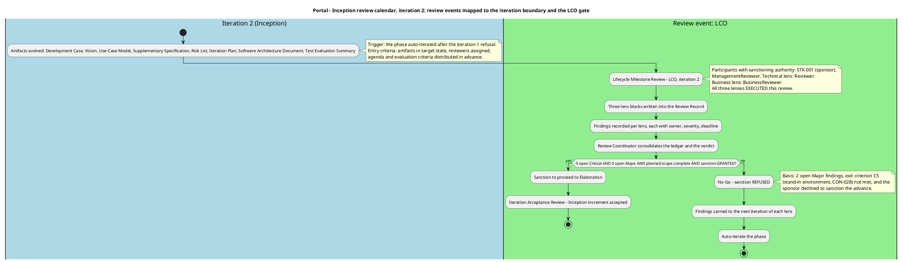

**Entry criteria — enforced before this review began.** All eight artifacts present and in target state; the Development Case present and carrying tailoring content, so it governs the review; reviewers assigned with expertise matched to artifact domain; agenda and evaluation criteria distributed in advance. No artifact was found to be a placeholder mid-review.

**Exit criteria — enforced before this review closes.** Every finding carries an owner, a severity and a resolution deadline; the Review Record is signed and archived. The milestone verdict is anchored to verified completeness, not to judgment: the sanction was asked of the stakeholder and refused, so the phase gate does not open.

**Reviewer pool and expertise mapping.**

| Artifact domain | Reviewer expertise required | Assigned lens |
|---|---|---|
| Vision, Use-Case Model, Supplementary Specification | Requirements and business-scope competency; stakeholder authority for scope | Reviewer (technical), BusinessReviewer (business gate), ManagementReviewer (scope) |
| Development Case | Process configuration and baseline conformance | Reviewer, ManagementReviewer |
| Risk List | Risk classification and magnitude-band basis | Reviewer, ManagementReviewer |
| Iteration Plan | Planning discipline; acceptance-criterion coverage; measurement policy | Reviewer, ManagementReviewer |
| Software Architecture Document | Architecture and design competency | Reviewer |
| Test Evaluation Summary | Test engineering knowledge; SCM evidence currency | Reviewer, ManagementReviewer |

**Scope of this block.** This is the Review Coordinator's consolidation — the process framework, the calendar, the entry/exit enforcement and the lens participation record. The three lens blocks that follow are the reviewers' own output and are preserved as written.

## Findings
### Reviewer lens

#### Iteration 1 — LCO technical review

**Summary.** 11 findings: 0 Critical, 1 Major, 10 Minor. One artifact — the Use-Case Model — was clean and carried no finding. No Critical finding was recorded, so no finding of this lens escalated to the stakeholder.

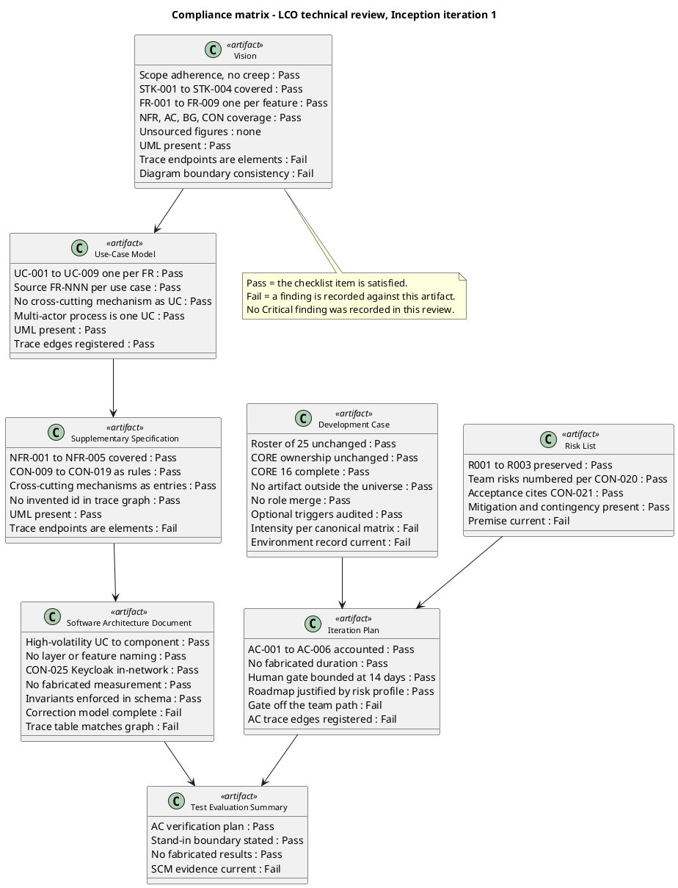

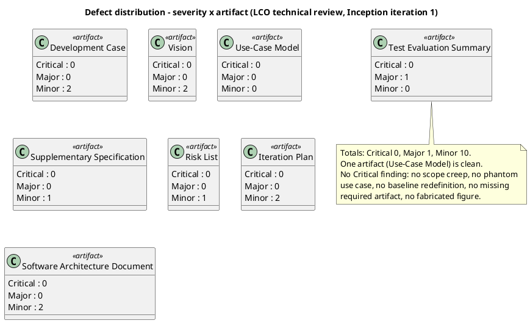

```plantuml
@startuml RR_AnnotatedMap
title Annotated review map - artifacts, findings and the LCO exit criteria they evidence
skinparam classAttributeIconSize 0

class "Vision" as V <<artifact>>
class "Use-Case Model" as UCM <<artifact>>
class "Supplementary Specification" as SS <<artifact>>
class "Development Case" as DC <<artifact>>
class "Risk List" as RL <<artifact>>
class "Iteration Plan" as IP <<artifact>>
class "Software Architecture Document" as SAD <<artifact>>
class "Test Evaluation Summary" as TES <<artifact>>

class "C1 Scope agreed" as C1 <<criterion>>
class "C2 Project viable" as C2 <<criterion>>
class "C3 Risks identified" as C3 <<criterion>>
class "C4 Process governs" as C4 <<criterion>>
class "C5 Stand-in environment" as C5 <<criterion>>
class "C6 Build verifiable" as C6 <<criterion>>

V --> C1
UCM --> C1
SS --> C1
SAD --> C2
DC --> C4
RL --> C3
IP --> C3
IP --> C5
IP --> C6
TES --> C6

note right of V
  2 Minor
  - trace endpoints are document sections
  - diagram draws Keycloak to UC-001 only
end note

note right of DC
  2 Minor
  - environment-readiness record stale
  - Environment narrative vs canonical matrix
end note

note right of SAD
  2 Minor
  - trace table vs registered graph
  - correction model incomplete
end note

note right of IP
  2 Minor
  - human gate serialized ahead of Iter-3
  - AC-002 to AC-005 carry no trace edge
end note

note right of TES
  1 Major
  - asserts the tracker holds no issues
end note

note bottom of C5
  C5 is not evidenced by any artifact: the
  Development Case records the stand-in
  environment as not ready. C6 is met by the
  green build on main despite the stale record.
end note
@enduml
```

**Findings.**

| Key | Artifact | Severity | Finding | Recommendation |
|---|---|---|---|---|
| `Development Case#F1` | Development Case | Minor | The Environment readiness verification table records the CI pipeline as not ready, and the Tailoring Overview and Environment narrative repeat the gap. The pipeline exists and builds — run `36050339100` on `main` is green. The record contradicts observable SCM state. | Record the CI pipeline as present and green on `main`, citing the observed run. Keep the gap open only for the genuinely absent items: `CONTRIBUTING.md`, lint configuration, stand-in environment. |
| `Development Case#F2` | Development Case | Minor | The Disciplines and Intensity table records Environment as "one-time at project start … recurring thereafter" in the delta column. The canonical matrix assigns Environment a level per phase. The row states a recurrence pattern where the matrix states a level, so it does not confirm the matrix it claims to confirm. | State the Environment row as per canonical matrix with the level per phase; move the one-time/recurring narrative to the Environment discipline section, where it already appears. |
| `Vision#F1` | Vision | Minor | The Traceability table's Traces To column names document sections — "Use-Case Model", "Supplementary Specification", "Risk List" — rather than trace-graph elements. A document section is not an element, so these rows register no edge. | Replace the section names with the element identifiers the row feeds — `UC-001`..`UC-009`, `NFR-001`..`NFR-005`, `R001`..`R003` — and register one edge per row. |
| `Vision#F2` | Vision | Minor | The Product Overview boundary diagram draws Keycloak to `UC-001` only, while the Use-Case Model's diagram of the same boundary draws Keycloak to all nine use cases. Two diagrams of one boundary disagree. | Draw Keycloak to all nine use cases, or state in the note that the single edge is a drawing simplification of the login mechanism that reaches every use case. |
| `Supplementary Specification#F1` | Supplementary Specification | Minor | The Traceability table's Traces To column names document sections — "Test Case", "Design Model", "Software Architecture Document", "Iteration Assessment", "Release Notes", "Risk List" — rather than elements. The registered graph shows this artifact as a leaf, so the downstream edges the table claims are not registered. | Name the element identifiers in Traces To, or state that the downstream artifacts do not yet exist and the edges will be registered when their elements are minted. Extend the existing label-scope note to the Traces To column. |
| `Risk List#F1` | Risk List | Minor | `R009`'s premise is that the CI pipeline definition is not in place, so the first build cannot be verified. The pipeline exists and builds — run `36050339100` on `main` is green. The risk as stated is partly retired and its mitigation claims work already done. | Restate `R009` to cover only the guideline files that are genuinely absent, or record the CI half as retired with the observed run as evidence, and adjust the mitigation. |
| `Iteration Plan#F1` | Iteration Plan | Minor | The roadmap gantt serializes the human validation gate ahead of Iter-3, placing the gate on the critical path. The plan's own text states the opposite: the team's work does not wait on the gate and every use case is built and tested against the stand-ins. | Draw the gate in parallel with Iter-2 and Iter-3 rather than in series before Iter-3, so the diagram matches the stated discipline. |
| `Iteration Plan#F2` | Iteration Plan | Minor | The Evaluation Criteria table accounts for all six acceptance criteria and defers each to a named iteration, but only `AC-001` and `AC-006` carry a registered trace edge. `AC-002`, `AC-003`, `AC-004` and `AC-005` have no outgoing edge, so the criterion-to-use-case mapping exists only as prose. | Register the missing edges — `AC-002` and `AC-005` to `UC-001`, `AC-003` to `UC-005`, `AC-004` to `UC-008`. |
| `Software Architecture Document#F1` | Software Architecture Document | Minor | The Traceability table declares edges not registered in the trace graph and, for `COMP-003`, lists `UC-001` on both sides of the row. A component realizes the use case it fulfils; it is not derived from it. The table also claims `COMP-001` reaches `UC-001`, `UC-002` and `UC-008`, while the graph registers only `COMP-001` to `UC-004`. | Reconcile the table with the registered edges: drop `UC-001` from the Traces From side of the `COMP-003` row, and either register the `COMP-001` edges or remove them from the table. |
| `Software Architecture Document#F2` | Software Architecture Document | Minor | The key-abstractions class diagram gives `Clocking` mutable `clockInUtc` and `clockOutUtc` fields plus a `corrected` flag, while the Data View states the clocking row is never updated in place (CON-012). The model does not state which value FR-003's ClockIn and ClockOut columns read when a correction exists, so the export contract is ambiguous against the correction model. | State that `Clocking`'s time fields are immutable and that the effective value is resolved from the correction chain, and name the resolution rule the export applies when a day carries one or more corrections. |
| `Test Evaluation Summary#F1` | Test Evaluation Summary | **Major** | The artifact asserts that the SCM issue tracker holds no issues and reports no defect — in the Test Summary evidence table, the Defects and Incidents section and the Conclusions table. The tracker holds `Issue #1`, labelled `severity:minor`, `nature:defect`, `configuration-record`. The claim is false against observable SCM state and would let the milestone verdict conclude that no defect exists. | Correct the three places to record `Issue #1` as the open defect and state the defect count as one. The artifact's own rule — a defect is an SCM issue and its identifier is the issue number — already supports this; the evidence block was not refreshed. |

**Traceability compliance (iteration 1).** The traceability tree was projected from the Business level and used as the completeness instrument. Result: 47 roots, 150 nodes, no `SUSPECT` edge and no `UNKNOWN LABEL`. No `«LEAF»` at Business level — every declared requirement and acceptance criterion reached at least one downstream element. The defects found were in the artifacts' own traceability *tables*, which declared edges the graph did not carry (`Vision#F1`, `Supplementary Specification#F1`, `Software Architecture Document#F1`) or omitted edges the graph should carry (`Iteration Plan#F2`). The graph itself was sound; the tables were not reconciled with it.

**Scope-adherence result (iteration 1).** No scope creep. Nine use cases, one per declared `FR-001`..`FR-009`; every use case carries a `Source: FR-NNN` line citing a declared requirement; no phantom use case; no cross-cutting mechanism modelled as a use case — OIDC login, authorization, LDAP read, audit write and the clocking retry are all Supplementary Specification entries with `<<include>>` from their dependent use cases. No `[DERIVED]` marker was found in any artifact, so no silent derivation promotion existed to flag. No unsourced quantitative claim was found.

**DC baseline conformance result (iteration 1).** The Development Case did not redefine the 25-role roster, did not reassign CORE ownership, did not omit a CORE artifact, did not list an artifact outside the CORE + OPTIONAL universe, and did not merge two roles. Business Modeling was declared INACTIVE with the correct trigger condition (`business-process-led = false`). All six OPTIONAL triggers were audited against their §5.2 conditions and none was found over-triggered. The two findings against this artifact were a stale environment record and an intensity-row wording defect, not a baseline violation.

#### Iteration 2 — LCO technical review

**Summary.** 6 findings: 0 Critical, 1 Major, 5 Minor. No Critical finding was recorded, so no finding of this lens escalates to the stakeholder on severity grounds. All 11 prior findings of this lens are closed — see Resolutions and Actions.

**Closure ledger.** Every prior finding of this lens, with its disposition.

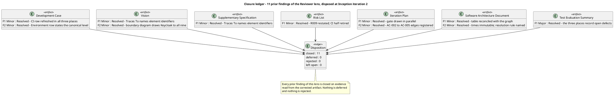

**Compliance matrix.** Every checklist item evaluated, recorded Pass or Fail. A Fail is a finding.

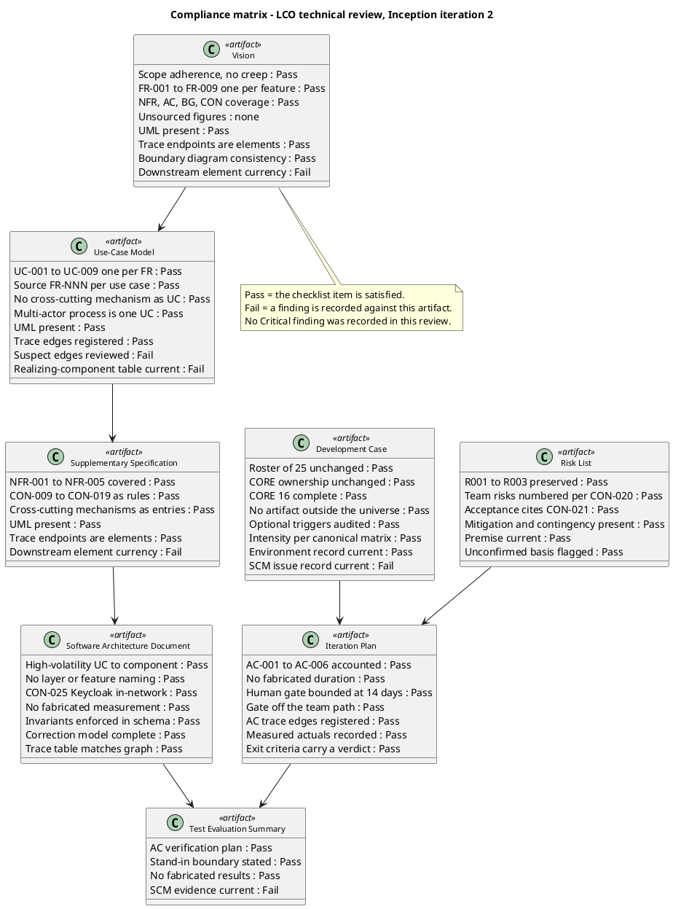

**Defect distribution.**

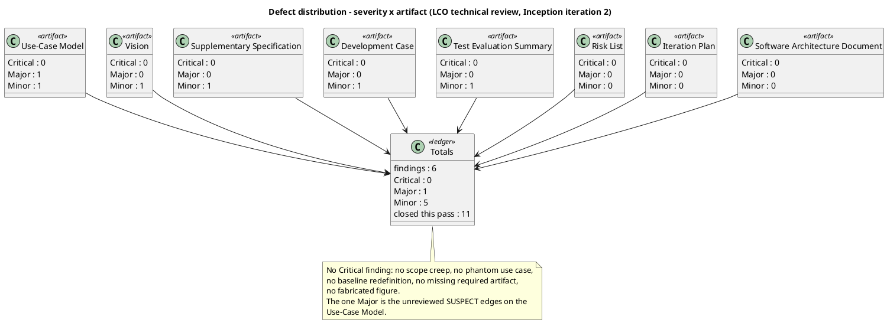

**Annotated review map.** Where each finding sits, and which LCO exit criterion the artifact evidences.

```plantuml
@startuml RR2_AnnotatedMap
title Annotated review map - artifacts, findings and the LCO exit criteria they evidence (Inception iteration 2)
skinparam classAttributeIconSize 0

class "Vision" as V <<artifact>>
class "Use-Case Model" as UCM <<artifact>>
class "Supplementary Specification" as SS <<artifact>>
class "Development Case" as DC <<artifact>>
class "Risk List" as RL <<artifact>>
class "Iteration Plan" as IP <<artifact>>
class "Software Architecture Document" as SAD <<artifact>>
class "Test Evaluation Summary" as TES <<artifact>>

class "C1 Scope agreed" as C1 <<criterion>>
class "C2 Project viable" as C2 <<criterion>>
class "C3 Risks identified" as C3 <<criterion>>
class "C4 Process governs" as C4 <<criterion>>
class "C5 Stand-in environment" as C5 <<criterion>>
class "C6 Build verifiable" as C6 <<criterion>>

V --> C1
UCM --> C1
SS --> C1
SAD --> C2
DC --> C4
RL --> C3
IP --> C3
IP --> C5
IP --> C6
TES --> C6

note right of UCM
  1 Major, 1 Minor
  - six SUSPECT edges unreviewed
  - realizing-component table stale
end note

note right of V
  1 Minor
  - NFR-003 downstream element stale
end note

note right of SS
  1 Minor
  - NFR-003 downstream element stale
end note

note right of DC
  1 Minor
  - open SCM issue set under-reported
end note

note right of TES
  1 Minor
  - defect count and CI run stale
end note

note bottom of C5
  C5 is still not evidenced by any artifact: the
  Development Case records the stand-in environment
  as not ready at the LCO gate. C6 is met by the
  green build on main.
end note
@enduml
```

**Findings.**

| Key | Artifact | Severity | Finding | Recommendation |
|---|---|---|---|---|
| `Use-Case Model#F1` | Use-Case Model | **Major** | The trace graph flags six `SUSPECT` edges into this artifact's use cases — `R001` → `UC-001`, `R001` → `UC-008`, `R004` → `UC-001`, `R004` → `UC-008`, `R009` → `UC-001` — and the artifact has not reviewed them. A `SUSPECT` edge means the owner of the other end declared a change and this artifact's end has not been re-read against it. The Risk List changed under this artifact: `R004` is now recorded as materialized, `R001`'s probability and impact are now marked `[ASSUMPTION — requires validation]`, and `R009` is restated to the guideline files only. The artifact's constraints-and-risks table still binds `UC-001` to `R001, R003, R004, R006, R009` and `UC-008` to `R001, R002, R004, R005` without recording any of it. | Re-read the Risk List's current `R001`, `R004` and `R009` entries and update the constraints-and-risks table: record `R004` as materialized, record `R001`'s probability and impact as `[ASSUMPTION — requires validation]`, and record `R009`'s remaining scope as the guideline files only. Then declare the change in turn so the `SUSPECT` edges clear. |
| `Use-Case Model#F2` | Use-Case Model | Minor | The "Realizing components" table is stale against the Software Architecture Document's registered edges. It records `COMP-001` realizing `UC-004` only, while the SAD registers `COMP-001` → `UC-001`, `UC-002`, `UC-004`, `UC-008`; it records `COMP-002` realizing `UC-001` only, while the SAD registers `COMP-002` → `UC-001`, `UC-002`, `UC-008`; and it omits `COMP-009` and `COMP-010` entirely, both of which the SAD registers as realizing use cases. | Reconcile the table with the SAD's registered edges: `COMP-001` → `UC-001`, `UC-002`, `UC-004`, `UC-008`; `COMP-002` → `UC-001`, `UC-002`, `UC-008`; add `COMP-009` and `COMP-010` with their registered use cases. The table references the Software Architect's elements, so it must state what the graph carries. |
| `Vision#F3` | Vision | Minor | The Traceability table's `NFR-003` row still reads "`NFR-003` Availability Window \| `CON-007` \| Derives \| — not yet minted", and the note beneath it states that the Software Architect's component view assigns no component to the availability window. The Software Architecture Document now registers `NFR-003` → `COMP-002`. The two artifacts disagree about the same requirement's downstream element. | Replace the `NFR-003` row's Traces To with `COMP-002` and delete the "not yet minted" note for that row. |
| `Supplementary Specification#F2` | Supplementary Specification | Minor | The Traceability table's `NFR-003` row still reads "`NFR-003` Availability Window \| `CON-007` \| Derives \| — not yet minted", and the note beneath it repeats that the Software Architect's component view assigns no component to the availability window. The Software Architecture Document now registers `NFR-003` → `COMP-002`. | Replace the `NFR-003` row's Traces To with `COMP-002` and delete the "not yet minted" note for that row. |
| `Development Case#F3` | Development Case | Minor | The Organization and tool assessment table's "Open SCM issues" row records a single issue — "`Issue #1` — the environment-readiness record for the CI pipeline was stale" — and states it was corrected. The tracker holds three open issues: `Issue #1`, `Issue #2` (`docs/BRANCHING_STRATEGY.md` cites a superseded blob sha for the CI configuration item) and `Issue #3` (`.github/workflows/README.md` records `Issue #2` as outstanding after its correction). The row is the artifact's own record of the open issue set and it under-reports it by two. | Record all three open issues, with their labels and the fact that all three are configuration-record defects owned by the ProcessEngineer, or state the count as three and name the tracker as the authoritative record. |
| `Test Evaluation Summary#F2` | Test Evaluation Summary | Minor | The evidence block is stale on both of its observable values. The Test Summary table and the Defects and Incidents section record two open defects (`Issue #1`, `Issue #2`), while the tracker holds three — `Issue #3` is not recorded. The CI run cited is `36094575395`, while the build observed on `main` at this review is run `36095051721`. | Record `Issue #3` alongside `Issue #1` and `Issue #2`, state the defect count as three, and refresh the CI run reference. The three places that carry the count — the Test Summary evidence table, the Defects and Incidents section and the Conclusions table — must agree with the tracker. |

**Traceability compliance (iteration 2).** The traceability tree was projected from the Business level and used as the completeness instrument. Result: 66 roots, 231 nodes. No `UNKNOWN LABEL` — every identifier in the graph belongs to a declared family. No `«LEAF»` at Business level: every declared requirement and acceptance criterion reaches at least one downstream element, so no requirement is unrealized. The iteration-1 table defects are corrected: the Vision, the Supplementary Specification and the Software Architecture Document now name element identifiers, and the four missing acceptance-criterion edges are registered (`AC-002` → `UC-001`, `AC-003` → `UC-005`, `AC-004` → `UC-008`, `AC-005` → `UC-001`).

**Six `SUSPECT` edges remain, all into the Use-Case Model.** `R001` → `UC-001`, `R001` → `UC-008`, `R004` → `UC-001`, `R004` → `UC-008`, `R009` → `UC-001`. Each is a change the Risk List's owner declared against a use case whose owner has not re-read it. They are recorded as `Use-Case Model#F1` (Major). A `SUSPECT` edge left open at phase close is a Major finding against the artifact owning the unreviewed end, and that is this artifact.

**Scope-adherence result (iteration 2).** No scope creep. Nine use cases, one per declared `FR-001`..`FR-009`; every use case carries a `Source: FR-NNN` line citing a declared requirement; no phantom use case; no cross-cutting mechanism modelled as a use case — OIDC login, authorization, LDAP read, audit write and the clocking retry are all Supplementary Specification entries with `<<include>>` from their dependent use cases. No `[DERIVED]` marker survives in any artifact, so no silent derivation promotion exists to flag. No unsourced quantitative claim was found: the artifacts state declared targets and explicitly record that no measurement exists yet. No financial figure appears anywhere in the artifact set.

**DC baseline conformance result (iteration 2).** The Development Case does not redefine the 25-role roster, does not reassign CORE ownership, does not omit a CORE artifact, does not list an artifact outside the CORE + OPTIONAL universe, and does not merge two roles. Business Modeling is declared INACTIVE with the correct trigger condition (`business-process-led = false`). All six OPTIONAL triggers were re-audited against their §5.2 conditions and none was found over-triggered — each NOT-FIRED verdict holds against the project's real facts. The Environment intensity row now states the canonical level per phase. The one finding against this artifact is a stale SCM issue record, not a baseline violation.

**Optional trigger justification (iteration 2).** Every NOT-FIRED verdict was checked against its §5.2 condition. Glossary: the domain vocabulary is ordinary HR and intranet language and the one closed list is fixed by `CON-014` — condition does not hold. Architectural Proof-of-Concept: no technical risk requires empirical validation, and `CON-028` removes the only candidate — condition does not hold. Data Model: the portal owns three entities, well under ten, and `CON-030` states there is no data migration — condition does not hold. Deployment Model: one application and one database on one estate, reachable only from the internal network — condition does not hold. User-Interface Prototype: `CON-031` makes the design already decided and authoritative — condition does not hold. Test Plan: `CON-019` states no external compliance regime applies and there is no contractual test reporting — condition does not hold. No over-triggering found.

### Business Reviewer lens

#### Iteration 1 — LCO business review

**Summary.** **0 findings: 0 Critical, 0 Major, 0 Minor.** No business-model artifact exists to carry a defect, and none is required by the Development Case. No finding of this lens escalates to the stakeholder.

**Compliance matrix.** Every Business Modeling checklist item evaluated and recorded Pass or N/A. N/A is the correct verdict for an item whose subject does not exist and is not required — it is not a Fail, and it is not a finding.

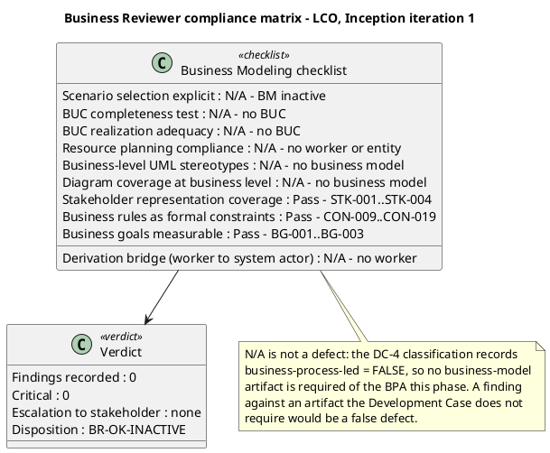

**Checklist detail — the three items that are NOT N/A.** Three Business Modeling checklist items have a subject that exists in this project even though the discipline is inactive. Each was evaluated on its merits and each passes.

| Checklist item | Verdict | Evidence |
|---|---|---|
| Stakeholder representation coverage | **Pass** | All four declared stakeholders are represented in the Vision's Stakeholder Summary with role, interest, influence and the needs the product must satisfy: `STK-001` Laura Gómez (HR Director, sponsor), `STK-002` Miguel Torres (Software Engineer), `STK-003` Infrastructure Team (operates AD and Keycloak), `STK-004` Cuba Corp Employees (200 people, 3 offices). No significant organisational part relevant to the declared scope is unrepresented. The Infrastructure Team is correctly modelled as a stakeholder and not as a use-case actor — it operates the portal in production (`CON-029`) and performs no in-portal administration. |
| Business rules as formal constraints | **Pass** | `CON-009`..`CON-019` are declared as `[BusinessRule]` constraints and each is attached to the element it constrains: `CON-009` to the news feature set (`FR-005`, `FR-006`, `FR-007`), `CON-010`/`CON-011`/`CON-012` to clocking (`FR-001`, `FR-002`, `FR-003`), `CON-013`/`CON-014`/`CON-015`/`CON-016` to the worker category (`FR-008`, `FR-009`), `CON-017` to news retention (`FR-007`), `CON-018`/`CON-019` to the audit (`NFR-004`). Each is testable and each carries its source. They are system invariants, not business-process definitions — which is precisely why they do not trigger Business Modeling. |
| Business goals measurable | **Pass** | `BG-001` (50% reduction in HR management time, measured against the current manual processes), `BG-002` (100% of new clockings out of Excel), `BG-003` (80% of 200 employees within 3 months) each carry a numeric target and a stated basis of measurement. |

**Derivation-readiness assessment (the Business-to-System Derivation Readiness Gate).** The gate is **not applicable, and correctly so** — it is not "failed". The gate asks whether a business model is a sound foundation for the System Analyst to derive system use cases from. Here the derivation never passes through a business model: the stakeholder declared the system use cases directly (`UC01` Clock In/Out, `UC02` Read News, `UC03` Employee Directory) alongside `FR-001`..`FR-009`, and the Use-Case Model realises them one-for-one. There is no business worker whose automation disposition must be annotated, because no business worker exists; there is no business entity needing a candidate analysis-class annotation, because no business entity exists. The bridge is not broken — it is not needed.

**Traceability compliance.** The traceability tree was projected from the Business level and used as the completeness instrument. Result: **no `SUSPECT` edge and no `UNKNOWN LABEL`**; no `«LEAF»` at Business level — every declared requirement and acceptance criterion reaches at least one downstream element. No business-level element (`BUC-NNN`, `BR-NNN`, `OBJ-NNN`) appears in the graph, which is the expected shape for a project with Business Modeling inactive. The defects the generic Reviewer lens found are in the artifacts' own traceability *tables* (`Vision#F1`, `Supplementary Specification#F1`), not in the graph, and they are that lens's findings to close — not mine.

**Scope-adherence result.** No scope creep was found in the business dimension. Nine use cases, one per declared `FR-001`..`FR-009`; no phantom use case; no cross-cutting mechanism modelled as a use case — OIDC login, authorization, LDAP read, audit write and the clocking retry are all Supplementary Specification entries with `<<include>>` from their dependent use cases. No `[DERIVED]` marker was found in any artifact, so no silent derivation promotion exists to flag. No unsourced quantitative claim was found: the artifacts state declared targets and explicitly record that no measurement exists yet.

**Prior findings of this lens.** None. This was the first review pass of the Business Reviewer lens on this project: `read_artifact_findings` returned an empty list for the Use-Case Model and no finding with `reviewerRole: BusinessReviewer` on any artifact. The three findings that existed — `Vision#F1`, `Vision#F2`, `Supplementary Specification#F1` — carry `reviewerRole: Reviewer` and belong to that lens; the ownership invariant forbids me from closing them, and no `resolve_artifact_finding` call was emitted that pass.

#### Iteration 2 — LCO business review

**Summary.** **1 finding: 0 Critical, 0 Major, 1 Minor.** The Business Modeling discipline remains INACTIVE on the correct trigger and no business-model artifact is required by the Development Case. The one finding is a declared business rule with no realizing flow in the use case that claims it. No finding of this lens escalates to the stakeholder.

**Business Modeling artifact coverage map.** The primary evidence of this review: which business-model artifacts the Development Case requires, which exist, and the verdict on each. Five artifacts, none required, none present — and the three checklist items whose subject does exist, all passing.

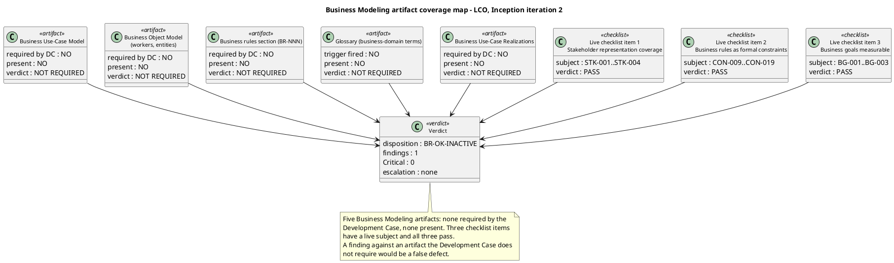

**DC §4 classification, independently re-verified this iteration.** `get_dc_classification` returns `isBusinessProcessLed: false`, re-evaluated this iteration, with all four criteria evaluated and none fired. I re-verified each criterion against the declared scope rather than accepting the verdict, and checked whether any Change Request had altered the basis — none has.

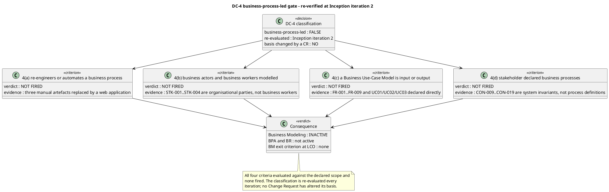

**Business-rule audit — the four formal-constraint properties, per rule.** Each of the eleven declared business rules was audited against the four properties a formal constraint must carry: a unique identifier, a source, an explicit attachment to the element it constrains, and a testable condition. **Eleven audited, zero structurally defective.** The audit also checked whether each rule's declared effect is realized by a flow in the use case that claims it — and that check found the one defect of this pass, recorded below.

```plantuml
@startuml BR2_BusinessRuleAudit
title Business-rule audit - CON-009..CON-019 against the four formal-constraint properties
skinparam classAttributeIconSize 0
skinparam classFontSize 10

class "CON-009 one featured item" as R9 <<rule>> {
  identifier : Pass
  source : Pass - declared BusinessRule
  attachment : Pass - COMP-005, UC-004/005/006/007
  testable : Pass
}
class "CON-010 pair never crosses midnight" as R10 <<rule>> {
  identifier : Pass
  source : Pass - declared BusinessRule
  attachment : Pass - COMP-004, UC-001/003
  testable : Pass
}
class "CON-011 one pair per day" as R11 <<rule>> {
  identifier : Pass
  source : Pass - declared BusinessRule
  attachment : Pass - COMP-004, UC-001/003
  testable : Pass
}
class "CON-012 no in-place overwrite" as R12 <<rule>> {
  identifier : Pass
  source : Pass - declared BusinessRule
  attachment : Pass - COMP-004, UC-001/003
  testable : Pass
}
class "CON-013 category does not drive access" as R13 <<rule>> {
  identifier : Pass
  source : Pass - declared BusinessRule
  attachment : Pass - COMP-007, UC-008/009
  testable : Pass
  realized by a flow : FAIL - filter half has no flow
}
class "CON-014 closed list of four" as R14 <<rule>> {
  identifier : Pass
  source : Pass - declared BusinessRule
  attachment : Pass - COMP-007, UC-009
  testable : Pass
}
class "CON-015 at most one, may be empty" as R15 <<rule>> {
  identifier : Pass
  source : Pass - declared BusinessRule
  attachment : Pass - COMP-007, UC-002/008/009
  testable : Pass
}
class "CON-016 one home for employee data" as R16 <<rule>> {
  identifier : Pass
  source : Pass - declared BusinessRule
  attachment : Pass - COMP-007, UC-002/008/009
  testable : Pass
}
class "CON-017 news never deleted" as R17 <<rule>> {
  identifier : Pass
  source : Pass - declared BusinessRule
  attachment : Pass - COMP-005, UC-007
  testable : Pass
}
class "CON-018 no in-portal audit view" as R18 <<rule>> {
  identifier : Pass
  source : Pass - declared BusinessRule
  attachment : Pass - COMP-009
  testable : Pass
}
class "CON-019 no compliance regime" as R19 <<rule>> {
  identifier : Pass
  source : Pass - declared Regulatory
  attachment : Pass - no design element, stated
  testable : Pass
}

class "Audit result" as A <<ledger>> {
  rules audited : 11
  structurally defective : 0
  unrealized declared effect : 1
}

R9 --> A
R10 --> A
R11 --> A
R12 --> A
R13 --> A
R14 --> A
R15 --> A
R16 --> A
R17 --> A
R18 --> A
R19 --> A

note bottom of A
  Each rule carries a unique identifier, a declared source,
  an explicit attachment to the element that must enforce it
  (stated once, in the Supplementary Specification's
  Traceability table and the Use-Case Model's
  constraints-and-risks table), and a testable condition.
  No rule is structurally defective. One rule - CON-013 -
  declares an effect (the directory filters by worker
  category) that no flow in UC-008 realizes.
end note
@enduml
```

**Findings.**

| Key | Artifact | Severity | Finding | Recommendation |
|---|---|---|---|---|
| `Use-Case Model#F1` | Use-Case Model | Minor | `CON-013` declares the worker category is used as "a column of the directory (which it also filters)". `UC-008` Search Employee Directory — the use case that owns the directory — enumerates its search inputs as a name, a department or an office in main flow step 1, and no main or alternative flow filters the directory by worker category. The use case cites `CON-013` among its applied business rules, so it claims the rule while realizing only its column half. The declared rule's filter half therefore has no realizing flow anywhere in the model, and a reader implementing `UC-008` would not build the category filter. | Add the worker-category filter to `UC-008`: extend main flow step 1, or add an alternative flow, so the employee can filter the directory by worker category, since `CON-013` declares the directory filters by it. If the filter is not intended, the conflict between `FR-008`'s declared search dimensions (name, department, office) and `CON-013`'s declared filter must be resolved by the stakeholder rather than left implicit in the model. |

**Defect distribution.**

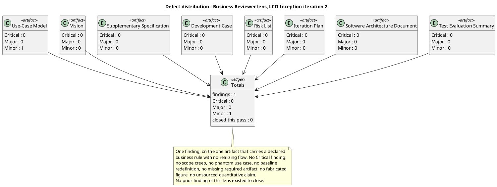

**Derivation-readiness assessment (the Business-to-System Derivation Readiness Gate).** The gate is **not applicable, and correctly so** — it is not "failed". The derivation never passes through a business model: the stakeholder declared the system use cases directly (`UC01`, `UC02`, `UC03`) alongside `FR-001`..`FR-009`, and the Use-Case Model realises them one-for-one as `UC-001`..`UC-009`. There is no business worker whose automation disposition must be annotated, because no business worker exists; there is no business entity needing a candidate analysis-class annotation, because no business entity exists. The bridge is not broken — it is not needed, and the System Analyst is not blocked.

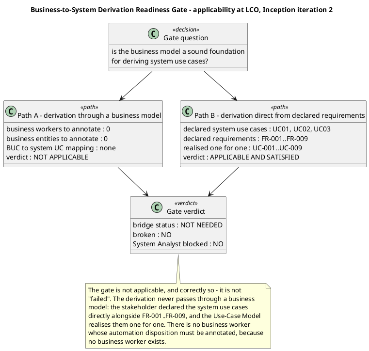

**Stakeholder representation coverage — independently verified, not accepted on the BPA's assertion.** All four declared parties are represented, and no significant organisational part relevant to the declared scope is missing.

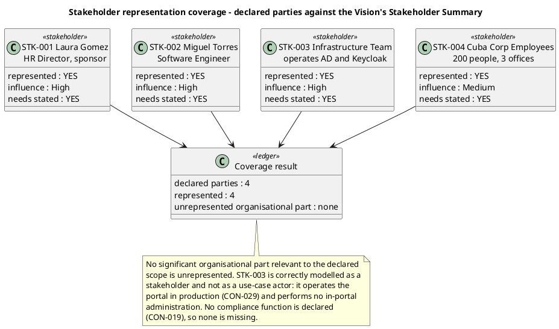

**Checklist detail — the three items that are NOT N/A.** Three Business Modeling checklist items have a subject that exists in this project even though the discipline is inactive. Each was evaluated on its merits.

| Checklist item | Verdict | Evidence |
|---|---|---|
| Stakeholder representation coverage | **Pass** | All four declared stakeholders are represented in the Vision's Stakeholder Summary with role, interest, influence and the needs the product must satisfy: `STK-001` Laura Gómez (HR Director, sponsor), `STK-002` Miguel Torres (Software Engineer), `STK-003` Infrastructure Team (operates AD and Keycloak), `STK-004` Cuba Corp Employees (200 people, 3 offices). No significant organisational part relevant to the declared scope is unrepresented. The Infrastructure Team is correctly modelled as a stakeholder and not as a use-case actor — it operates the portal in production (`CON-029`) and performs no in-portal administration. No compliance function is declared (`CON-019`), so none is missing. |
| Business rules as formal constraints | **Pass, with one realization defect** | `CON-009`..`CON-019` are declared as `[BusinessRule]` constraints and each is attached to the element it constrains: `CON-009` to the news feature set (`FR-005`, `FR-006`, `FR-007`), `CON-010`/`CON-011`/`CON-012` to clocking (`FR-001`, `FR-002`, `FR-003`), `CON-013`/`CON-014`/`CON-015`/`CON-016` to the worker category (`FR-008`, `FR-009`), `CON-017` to news retention (`FR-007`), `CON-018`/`CON-019` to the audit (`NFR-004`). Each is testable and each carries its source. All eleven are structurally sound; one — `CON-013` — declares an effect no flow realizes, which is `Use-Case Model#F1`. |
| Business goals measurable | **Pass** | `BG-001` (50% reduction in HR management time, measured against the current manual processes), `BG-002` (100% of new clockings out of Excel), `BG-003` (80% of 200 employees within 3 months) each carry a numeric target and a stated basis of measurement. `BG-003`'s verification path is now stated per goal in the Vision: it is measured with `STK-004` after go-live, outside the project's test effort, and no acceptance criterion the team can run closes it. |

**Traceability compliance (iteration 2).** The traceability tree was projected from the Business level and used as the completeness instrument. Result: 66 roots, 231 nodes, **no `UNKNOWN LABEL`** — every identifier in the graph belongs to a declared family. No `«LEAF»` at Business level: every declared requirement and acceptance criterion reaches at least one downstream element. No business-level element (`BUC-NNN`, `BR-NNN`, `OBJ-NNN`) appears in the graph, which is the expected shape for a project with Business Modeling inactive. The six `SUSPECT` edges the generic Reviewer lens records (`R001` → `UC-001`, `R001` → `UC-008`, `R004` → `UC-001`, `R004` → `UC-008`, `R009` → `UC-001`) are risk-to-use-case edges at the Business level and are that lens's finding (`Use-Case Model#F1` of the Reviewer lens) — they are not business-modeling defects and I record no finding on them.

**Scope-adherence result (iteration 2).** No scope creep was found in the business dimension. Nine use cases, one per declared `FR-001`..`FR-009`; every use case carries a `Source: FR-NNN` line citing a declared requirement; no phantom use case; no cross-cutting mechanism modelled as a use case — OIDC login, authorization, LDAP read, audit write and the clocking retry are all Supplementary Specification entries with `<<include>>` from their dependent use cases. No `[DERIVED]` marker survives in any artifact, so no silent derivation promotion exists to flag. No unsourced quantitative claim was found: the artifacts state declared targets and explicitly record that no measurement exists yet. No financial figure appears anywhere in the artifact set.

**Prior findings of this lens.** None. `read_artifact_findings` returns no finding carrying `reviewerRole: BusinessReviewer` on any artifact — the Use-Case Model, the Vision and the Supplementary Specification each return only findings of the Reviewer and Management Reviewer lenses. No prior finding of this lens exists to close, defer or reject, and no `resolve_artifact_finding` call was emitted this pass.

**Cross-lens findings left untouched.** The findings on the artifacts I read carry `reviewerRole: Reviewer` or `reviewerRole: ManagementReviewer` and are those lenses' to close. The ownership invariant rejects a cross-lens close attempt, so none was attempted.

| Finding | Lens | Severity | Why this lens does not act |
|---|---|---|---|
| `Use-Case Model#F1` | Reviewer | Major | Unreviewed `SUSPECT` risk-to-use-case edges. A trace-graph currency defect in the technical lens's checklist, not a business-modeling defect. |
| `Use-Case Model#F2` | Reviewer | Minor | Realizing-component table stale against the SAD. A trace-table defect, not a business-modeling defect. |
| `Vision#F3` | Reviewer | Minor | `NFR-003` downstream element stale. A trace-table defect, not a business-modeling defect. |
| `Supplementary Specification#F2` | Reviewer | Minor | `NFR-003` downstream element stale. A trace-table defect, not a business-modeling defect. |
| `Vision#F1` | Management Reviewer | Minor | Business-goal verification path. The business-goal measurability item is mine and it passes; the finding is that the Vision's *statement* of the path was wrong, which is the Management Reviewer's scope finding. |

### Management Reviewer lens

#### Iteration 1 — LCO management review

**Summary.** 7 findings: 0 Critical, 3 Major, 4 Minor. No Critical finding was recorded, so no finding of this lens escalated to the stakeholder on severity grounds. The stakeholder was nevertheless consulted before the verdict, with the leaning and all three Major defects inside the question, and **refused the sanction** — see Disposition.

**LCO compliance table.** Every exit criterion evaluated, with its verdict and the evidence behind it.

```plantuml
@startuml MR_LCO_Compliance
title LCO compliance table - exit criteria, verdict and evidence (Inception iteration 1)
skinparam classAttributeIconSize 0

class "C1 Stakeholders agree on the scope" as C1 <<criterion>> {
  verdict : MET
  evidence : Vision + Use-Case Model, 9 UC one per FR-001..FR-009
  evidence : trace graph 47 roots / 150 nodes, no SUSPECT, no UNKNOWN LABEL
}

class "C2 The project is viable" as C2 <<criterion>> {
  verdict : MET
  evidence : stack pinned CON-022 / CON-023 / CON-024
  evidence : OIDC client already registered (CON-003)
  evidence : PoC NOT FIRED - no technical unknown
}

class "C3 Initial risks identified and classified" as C3 <<criterion>> {
  verdict : MET
  evidence : R001..R009 with P, I, magnitude, strategy, owner
  evidence : R001..R003 preserved; team risks numbered per CON-020
}

class "C4 The process configuration governs" as C4 <<criterion>> {
  verdict : MET
  evidence : Development Case conforms to the IARI baseline
  evidence : BM INACTIVE on the correct trigger; 6 OPTIONAL triggers audited
}

class "C5 Stand-in environment available (CON-028)" as C5 <<criterion>> {
  verdict : NOT MET
  evidence : no artifact evidences the stand-in OIDC issuer or directory
  evidence : sole record is a pre-iteration snapshot, stale on its own CI row
}

class "C6 The build is verifiable (CON-026)" as C6 <<criterion>> {
  verdict : MET
  evidence : run 36050339100 on main is green
}

class "Stakeholder sanction" as SAN <<gate>> {
  question : accept scope and sanction advancing past LCO?
  answer : NO - REFUSED
  directive : all findings must be corrected, even if they are minor
}

class "LCO verdict" as V <<verdict>> {
  disposition : No-Go
  basis : stakeholder sanction REFUSED
  open defects : 0 Critical, 3 Major, 4 Minor (this lens)
}

C1 --> V
C2 --> V
C3 --> V
C4 --> V
C5 --> V
C6 --> V
SAN --> V

note bottom of C5
  C5 is the one criterion not met. It is the criterion
  that gates every use case: no use case can be built or
  tested against the real Keycloak or the real AD (CON-028).
end note

note bottom of SAN
  The sanction is the stakeholder's alone. It was asked
  with the leaning and every open Major defect inside the
  question, and it was refused. The refusal is the verdict.
end note
@enduml
```

**Defect distribution.**

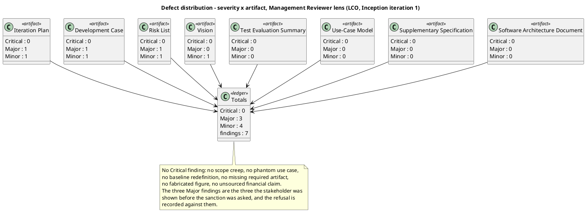

**Findings.**

| Key | Artifact | Severity | Finding | Recommendation |
|---|---|---|---|---|
| `Iteration Plan#F1` | Iteration Plan | **Major** | LCO exit criterion 5 (the stand-in environment, `CON-028`) is not evidenced at the milestone. The plan's own fine plan makes the LCO review (work item 9) depend on work items 1..8, and work item 6 is the stand-in environment. No artifact evidences that work item 6 was delivered. The plan's Evaluation Criteria layer (b) states this itself: criteria 5 and 6 "are the two items that can still fail this iteration". Criterion 6 is satisfied by the green build on `main`; criterion 5 is not satisfied by anything. This is the criterion that gates every use case — `CON-028` forbids building or testing against the real Keycloak or the real AD, so with no stand-in no use case can be built or tested and `R004` remains untreated. | Either evidence the stand-in environment and record that evidence in the artifact that owns it, or state explicitly in Evaluation Criteria layer (b) that exit criterion 5 is NOT met at this milestone and that the LCO gate is therefore not passable. Do not leave the criterion listed as an open item while the milestone verdict is taken as if it were met. |
| `Development Case#F1` | Development Case | **Major** | The Environment readiness verification table is the only evidence offered anywhere for LCO exit criterion 5, and it is not evidence of delivery. The table is explicitly a pre-iteration snapshot — "Verified before the iteration starts" — and records the stand-in OIDC issuer and stand-in directory as "Not ready — to be built this iteration". The same table is demonstrably stale on its own CI row, which records the pipeline as "Not ready — no pipeline definition found at `.github/workflows/ci.yml`" while the pipeline exists and builds green on `main`. A record stale on one row cannot be relied on as the milestone evidence for another. | Add a post-iteration environment verification recording the actual state of each item at the LCO gate, with the observed evidence for each — the stand-in OIDC issuer, the stand-in directory including its empty job-title and extension entries, the CI pipeline, `CONTRIBUTING.md` and the lint configuration. Keep the pre-iteration readiness table as the plan it is, and do not present it as the milestone evidence. |
| `Risk List#F1` | Risk List | **Major** | `R001`'s probability (3) and impact (4) are the analyst's own estimates, not values the stakeholder stated — the declared scope says so in `R001`'s own text. The Risk Classification section nevertheless calls `R001` "the highest declared exposure" and anchors the entire magnitude band scheme on it. Every magnitude in the register — including the High/Significant/Moderate boundaries that decide which risks need a stakeholder acceptance — is therefore derived from an unconfirmed estimate. The stakeholder was asked to confirm `R001`'s probability and impact and did **not** confirm them. | Mark `R001`'s probability and impact as `[ASSUMPTION — requires validation]` in the Risk Register and in the Risk Classification section, and state that the magnitude bands are provisional until the sponsor ratifies them. Then re-anchor the bands on a basis the sponsor has confirmed, or obtain the confirmation. Do not describe `R001` as "the highest declared exposure" while its P and I are the analyst's estimates. |
| `Iteration Plan#F2` | Iteration Plan | Minor | The plan records no measured spend or elapsed time for the iteration it plans. `CON-027` requires that each iteration's measured spend is recorded and used to forecast the next, and the plan's own "Two currencies, reported apart" section states the agent-work row as "Not yet measured — no phase has closed". That is correct for a forecast, but the iteration's own measured spend is a record the plan is the natural home for, and at the LCO gate the iteration has run. Without it the next iteration's forecast has no input. | Record the iteration's measured token spend and measured elapsed time (agent time and human queue time reported apart, never summed), or state explicitly that the measurement is taken at iteration close and name where it is recorded. |
| `Development Case#F2` | Development Case | Minor | The Development Case defines an "Iteration preparation checkpoint" requiring the Process Engineer to confirm before each iteration that the CI pipeline builds and tests, the stand-in environment is available, and the optional triggers have been re-evaluated — but it records no checkpoint result for the iteration that has just run, and none for the next. The only verification recorded is the pre-iteration readiness table. The checkpoint is the mechanism by which the Development Case's own process control is exercised, and at the LCO gate there is no record that it was exercised. | Record the iteration-preparation checkpoint result for the next iteration, with the observed state of each item it names, so the checkpoint is a record rather than a stated intention. |
| `Risk List#F2` | Risk List | Minor | `R004` — the risk the register itself identifies as gating every test — carries a mitigation whose execution is unverified at the milestone, and the register records no treatment evidence for it. Its mitigation claims that "the Development Case's iteration preparation checkpoint verifies it". The checkpoint record does not exist and the stand-in environment is not evidenced, so the register's own mitigation claim is unsupported. `R004` is also the only risk whose treatment this iteration was scoped to execute. | Record the observed state of `R004`'s treatment at the milestone — either the stand-in environment delivered, with its evidence, or the treatment not executed — and adjust the risk's status accordingly. |
| `Vision#F1` | Vision | Minor | The Problem Statement's Success criteria row states that `BG-001`, `BG-002` and `BG-003` are "Verified through AC-001..AC-006". That is not true for `BG-003`. `BG-003` is 80% employee adoption within 3 months, and `AC-005` — the criterion that carries it — is an adoption measure taken with real employees after go-live, which the Test Evaluation Summary states no test the team runs can close. The row asserts a verification path for a business goal that does not exist. | State the verification path per goal rather than as one range: `BG-001` and `BG-002` verified through the acceptance criteria the project can close, and `BG-003` measured with `STK-004` after go-live, outside the project's test effort. |

**Traceability compliance (iteration 1).** The trace graph was projected from the Business level and used as the completeness instrument. Result: 47 roots, 150 nodes, **no `SUSPECT` edge and no `UNKNOWN LABEL`**. No `«LEAF»` at Business level — every declared requirement and acceptance criterion reaches at least one downstream element, so no requirement is unrealized. The defects the generic Reviewer lens found are in the artifacts' own traceability *tables*, which declare edges the graph does not carry or omit edges it should carry; the graph itself is sound. No finding of this lens is a traceability defect.

**Scope-adherence result (iteration 1).** No scope creep was found. Nine use cases, one per declared `FR-001`..`FR-009`; every use case carries a `Source: FR-NNN` line citing a declared requirement; no phantom use case; no cross-cutting mechanism modelled as a use case — OIDC login, authorization, LDAP read, audit write and the clocking retry are all Supplementary Specification entries with `<<include>>` from their dependent use cases. No `[DERIVED]` marker was found in any artifact, so no silent derivation promotion exists to flag. No unsourced quantitative claim was found: the artifacts state declared targets and explicitly record that no measurement exists yet. No financial figure appears anywhere in the artifact set, so no unsourced financial claim exists to flag.

**DC baseline conformance result (iteration 1).** The Development Case does not redefine the 25-role roster, does not reassign CORE ownership, does not omit a CORE artifact, does not list an artifact outside the CORE + OPTIONAL universe, and does not merge two roles. Business Modeling is declared INACTIVE with the correct trigger condition (`business-process-led = false`). All six OPTIONAL triggers were audited against their §5.2 conditions and none was found over-triggered. The two findings against this artifact are an unevidenced gate criterion and an unrecorded checkpoint, not a baseline violation.

**Prior findings of this lens (iteration 1).** None. This was the first review pass of the Management Reviewer lens on this project: `read_artifact_findings` returned no finding carrying `reviewerRole: ManagementReviewer` on any artifact, so no prior finding of this lens existed to close, defer or reject. No `resolve_artifact_finding` call was emitted that pass.

#### Iteration 2 — LCO management review

**Summary.** 4 findings: 0 Critical, 1 Major, 3 Minor. No Critical finding was recorded, so no finding of this lens escalates to the stakeholder on severity grounds. All 7 prior findings of this lens are closed — see Resolutions and Actions.

**Closure ledger.** Every prior finding of this lens, with its disposition.

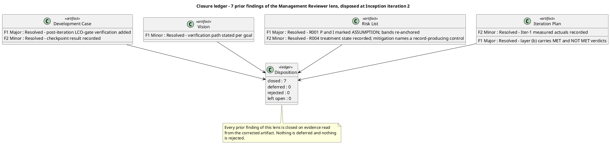

**Compliance matrix.** Every checklist item evaluated, recorded Pass or Fail. A Fail is a finding.

```plantuml
@startuml MR2_ComplianceMatrix
title Compliance matrix - LCO management review, Inception iteration 2
skinparam classAttributeIconSize 0
skinparam classFontSize 11

class "Iteration Plan" as IP <<artifact>> {
  AC-001 to AC-006 accounted : Pass
  Exit criteria carry a verdict : Pass
  No fabricated duration or date : Pass
  Human gate bounded at 14 days : Pass
  Gate off the team path : Pass
  Measured actuals recorded : Pass
  C5 verdict honest at writing : Pass
}

class "Risk List" as RL <<artifact>> {
  R001 to R003 preserved : Pass
  Team risks numbered per CON-020 : Pass
  Acceptance cites CON-021 : Pass
  Unconfirmed basis flagged : Pass
  Mitigation and contingency present : Pass
  Treatment execution evidenced : Fail
  Retirement progress : Fail
}

class "Development Case" as DC <<artifact>> {
  Roster of 25 unchanged : Pass
  CORE ownership unchanged : Pass
  CORE 16 complete : Pass
  No artifact outside the universe : Pass
  Optional triggers audited : Pass
  Intensity per canonical matrix : Pass
  Environment record current : Pass
  SCM issue record current : Fail
}

class "Vision" as V <<artifact>> {
  Scope adherence, no creep : Pass
  Stakeholder coverage : Pass
  Business-goal verification path : Pass
  Unsourced figures : none
}

class "Use-Case Model" as UCM <<artifact>> {
  One UC per declared FR : Pass
  No cross-cutting mechanism as UC : Pass
  Multi-actor process is one UC : Pass
}

class "Supplementary Specification" as SS <<artifact>> {
  NFR-001 to NFR-005 covered : Pass
  CON-009 to CON-019 as rules : Pass
  Cross-cutting mechanisms as entries : Pass
}

class "Software Architecture Document" as SAD <<artifact>> {
  High-volatility UC to component : Pass
  CON-025 Keycloak in-network : Pass
  No fabricated measurement : Pass
}

class "Test Evaluation Summary" as TES <<artifact>> {
  AC verification plan : Pass
  Stand-in boundary stated : Pass
  No fabricated result : Pass
  SCM evidence current : Fail
}

V --> UCM
UCM --> SS
SS --> SAD
DC --> IP
RL --> IP
SAD --> TES
IP --> TES

note bottom of V
  Pass = the checklist item is satisfied.
  Fail = a finding is recorded against this artifact.
  No Critical finding was recorded in this review.
end note
@enduml
```

**Defect distribution.**

```plantuml
@startuml MR2_DefectDistribution
title Defect distribution - severity x artifact, Management Reviewer lens (LCO, Inception iteration 2)
skinparam classAttributeIconSize 0

class "Risk List" as RL <<artifact>> {
  Critical : 0
  Major : 1
  Minor : 1
}
class "Development Case" as DC <<artifact>> {
  Critical : 0
  Major : 0
  Minor : 1
}
class "Test Evaluation Summary" as TES <<artifact>> {
  Critical : 0
  Major : 0
  Minor : 1
}
class "Iteration Plan" as IP <<artifact>> {
  Critical : 0
  Major : 0
  Minor : 0
}
class "Vision" as V <<artifact>> {
  Critical : 0
  Major : 0
  Minor : 0
}
class "Use-Case Model" as UCM <<artifact>> {
  Critical : 0
  Major : 0
  Minor : 0
}
class "Supplementary Specification" as SS <<artifact>> {
  Critical : 0
  Major : 0
  Minor : 0
}
class "Software Architecture Document" as SAD <<artifact>> {
  Critical : 0
  Major : 0
  Minor : 0
}
class "Totals" as T <<ledger>> {
  findings : 4
  Critical : 0
  Major : 1
  Minor : 3
  closed this pass : 7
}
RL --> T
DC --> T
TES --> T
IP --> T
V --> T
UCM --> T
SS --> T
SAD --> T
note bottom of T
  No Critical finding: no scope creep, no phantom use case,
  no baseline redefinition, no missing required artifact,
  no fabricated figure, no unsourced financial claim.
  The one Major is R004: the risk that gates every test
  materialized and its treatment failed for the second
  consecutive iteration with no re-assessment.
  The Iteration Plan converged - it states criterion 5's
  verdict honestly and does not pre-empt the gate.
end note
@enduml
```

**Annotated review map.** Where each finding sits, and which LCO exit criterion the artifact evidences.

```plantuml
@startuml MR2_AnnotatedMap
title Annotated review map - artifacts, findings and the LCO exit criteria they evidence (Inception iteration 2)
skinparam classAttributeIconSize 0

class "Vision" as V <<artifact>>
class "Use-Case Model" as UCM <<artifact>>
class "Supplementary Specification" as SS <<artifact>>
class "Development Case" as DC <<artifact>>
class "Risk List" as RL <<artifact>>
class "Iteration Plan" as IP <<artifact>>
class "Software Architecture Document" as SAD <<artifact>>
class "Test Evaluation Summary" as TES <<artifact>>

class "C1 Scope agreed" as C1 <<criterion>>
class "C2 Project viable" as C2 <<criterion>>
class "C3 Risks identified" as C3 <<criterion>>
class "C4 Process governs" as C4 <<criterion>>
class "C5 Stand-in environment" as C5 <<criterion>>
class "C6 Build verifiable" as C6 <<criterion>>

V --> C1
UCM --> C1
SS --> C1
SAD --> C2
DC --> C4
RL --> C3
IP --> C3
IP --> C5
IP --> C6
TES --> C6

note right of RL
  1 Major, 1 Minor
  - R004 treatment failed twice; no re-assessment
  - treatment column stale at Iter-1 close
end note
note right of DC
  1 Minor
  - open SCM issue set under-reported
end note
note right of TES
  1 Minor
  - defect count and CI run stale
end note
note right of IP
  no finding
  - layer (b) states criterion 5 NOT MET
    and the gate not passable
end note
note bottom of C5
  C5 is not evidenced by any artifact: the Development Case's
  LCO-gate verification records no stand-in configuration, and
  the Iteration Plan records criterion 5 as NOT MET. C6 is met
  by the green build on main.
end note
@enduml
```

**Findings.**

| Key | Artifact | Severity | Finding | Recommendation |
|---|---|---|---|---|
| `Risk List#F3` | Risk List | **Major** | `R004`'s treatment failed for the second consecutive iteration and the register records no escalation. `R004` is recorded as Materialized with its treatment "re-scoped as the first work item of Iter-2", and the Development Case's LCO-gate verification records the stand-in environment as "Not ready — no stand-in configuration in the repository". The register's mitigation for `R004` again names a delivery that did not occur, its magnitude (Significant) and strategy (Avoid) are unchanged after two failed executions, and no risk in the register has been retired by a treatment across two iterations. A risk that materialized and whose treatment failed twice is evidence that the treatment is not working, and the register carries it unchanged. | Re-assess `R004` at this milestone: record the second failed execution, and revisit its magnitude, strategy and mitigation rather than carrying them unchanged. If the stand-in environment cannot be delivered by the team, the treatment must change — different sequencing, a different owner, or escalation to the stakeholder as a decision only they can make. Record the treatment state at Iter-2 close, not at Iter-1 close. |
| `Risk List#F4` | Risk List | Minor | The Risk Register's treatment column is headed "Treatment state at Iter-1 close" while this review is taken at Iter-2 close, so every row's treatment evidence is one iteration stale. `R009`'s mitigation compounds it: it states that the ConfigurationManager and Implementer "author `CONTRIBUTING.md` and the lint configuration in Iter-2", and the Development Case's LCO-gate verification records both as "Not ready". The register's mitigation therefore claims work the iteration did not do. | Re-head the treatment column to the current iteration and refresh each row against observable state at Iter-2 close. For `R009`, record the guideline files as still absent and move the mitigation to the iteration that will actually author them. |
| `Development Case#F3` | Development Case | Minor | The Organization and tool assessment table's "Open SCM issues" row records a single issue — "`Issue #1` — the environment-readiness record for the CI pipeline was stale" — and states it was corrected. The tracker holds three open issues: `Issue #1`, `Issue #2` (`docs/BRANCHING_STRATEGY.md` cites a superseded blob sha for the CI configuration item) and `Issue #3` (`.github/workflows/README.md` records `Issue #2` as outstanding after its correction). The row is the artifact's own record of the open issue set and it under-reports it by two. | Record all three open issues, with their labels and the fact that all three are configuration-record defects owned by the ProcessEngineer, or state the count as three and name the tracker as the authoritative record. |
| `Test Evaluation Summary#F2` | Test Evaluation Summary | Minor | The evidence block is stale on both of its observable values. The Test Summary table and the Defects and Incidents section record two open defects (`Issue #1`, `Issue #2`), while the tracker holds three — `Issue #3` is not recorded. The CI run cited is `36094575395`, while the build observed on `main` at this review is run `36095051721`. | Record `Issue #3` alongside `Issue #1` and `Issue #2`, state the defect count as three, and refresh the CI run reference. The three places that carry the count — the Test Summary evidence table, the Defects and Incidents section and the Conclusions table — must agree with the tracker. |

**Traceability compliance (iteration 2).** The trace graph was projected from the Business level and used as the completeness instrument. Result: 66 roots, 231 nodes. No `UNKNOWN LABEL` — every identifier in the graph belongs to a declared family. No `«LEAF»` at Business level: every declared requirement and acceptance criterion reaches at least one downstream element, so no requirement is unrealized. The iteration-1 table defects are corrected: the Vision, the Supplementary Specification and the Software Architecture Document now name element identifiers, and the four missing acceptance-criterion edges are registered (`AC-002` → `UC-001`, `AC-003` → `UC-005`, `AC-004` → `UC-008`, `AC-005` → `UC-001`).

**Five `SUSPECT` edges remain, all into the Use-Case Model.** `R001` → `UC-001`, `R001` → `UC-008`, `R004` → `UC-001`, `R004` → `UC-008`, `R009` → `UC-001`. Each is a change the Risk List's owner declared against a use case whose owner has not re-read it. They are recorded as `Use-Case Model#F1` (Major) by the Reviewer lens, whose checklist owns trace-graph currency. A `SUSPECT` edge left open at phase close is a Major finding against the artifact owning the unreviewed end, and that is the Use-Case Model. This lens records no separate finding on them: the defect is one, and it is the Reviewer lens's to close.

**Scope-adherence result (iteration 2).** No scope creep. Nine use cases, one per declared `FR-001`..`FR-009`; every use case carries a `Source: FR-NNN` line citing a declared requirement; no phantom use case; no cross-cutting mechanism modelled as a use case — OIDC login, authorization, LDAP read, audit write and the clocking retry are all Supplementary Specification entries with `<<include>>` from their dependent use cases. No `[DERIVED]` marker survives in any artifact, so no silent derivation promotion exists to flag. No unsourced quantitative claim was found: the artifacts state declared targets and explicitly record that no measurement exists yet. No financial figure appears anywhere in the artifact set.

**DC baseline conformance result (iteration 2).** The Development Case does not redefine the 25-role roster, does not reassign CORE ownership, does not omit a CORE artifact, does not list an artifact outside the CORE + OPTIONAL universe, and does not merge two roles. Business Modeling is declared INACTIVE with the correct trigger condition (`business-process-led = false`). All six OPTIONAL triggers were re-audited against their §5.2 conditions and none was found over-triggered — each NOT-FIRED verdict holds against the project's real facts. The Environment intensity row now states the canonical level per phase. The one finding against this artifact is a stale SCM issue record, not a baseline violation.

**Optional trigger justification (iteration 2).** Every NOT-FIRED verdict was checked against its §5.2 condition. Glossary: the domain vocabulary is ordinary HR and intranet language and the one closed list is fixed by `CON-014` — condition does not hold. Architectural Proof-of-Concept: no technical risk requires empirical validation, and `CON-028` removes the only candidate — condition does not hold. Data Model: the portal owns three entities, well under ten, and `CON-030` states there is no data migration — condition does not hold. Deployment Model: one application and one database on one estate, reachable only from the internal network — condition does not hold. User-Interface Prototype: `CON-031` makes the design already decided and authoritative — condition does not hold. Test Plan: `CON-019` states no external compliance regime applies and there is no contractual test reporting — condition does not hold. No over-triggering found.

### Review Coordinator — consolidated finding tracker

**Consolidated ledger — open findings.** 9 findings across the three lenses: 0 Critical, 2 Major, 7 Minor. A finding key is scoped per artifact AND per reviewer lens, so `Use-Case Model#F1` from the Reviewer lens and `Use-Case Model#F1` from the Business Reviewer lens are two distinct findings and are listed separately.

**Deadline basis.** No calendar date is projected. The deadline for every finding is the **next iteration of the lens that emitted it** — the phase auto-iterates, so that boundary is a real event, not an estimated span. The stakeholder's directive is that all findings are fixed, so no finding is deferred and none is rejected.

| # | Finding | Lens | Severity | Owner | Deadline | Status |
|---|---|---|---|---|---|---|
| 1 | `Use-Case Model#F1` — six `SUSPECT` risk-to-use-case edges unreviewed; the constraints-and-risks table does not record `R004` materialized, `R001`'s probability and impact as `[ASSUMPTION — requires validation]`, or `R009`'s restated scope | Reviewer | **Major** | SystemAnalyst | Next iteration of the Reviewer lens | Open |
| 2 | `Risk List#F3` — `R004`'s treatment failed for the second consecutive iteration; magnitude, strategy and mitigation carried unchanged with no re-assessment | Management Reviewer | **Major** | ProjectManager | Next iteration of the Management Reviewer lens | Open |
| 3 | `Use-Case Model#F2` — the realizing-component table is stale against the Software Architecture Document's registered edges | Reviewer | Minor | SystemAnalyst | Next iteration of the Reviewer lens | Open |
| 4 | `Vision#F3` — the `NFR-003` row still reads "not yet minted" while the Software Architecture Document registers `NFR-003` → `COMP-002` | Reviewer | Minor | SystemAnalyst | Next iteration of the Reviewer lens | Open |
| 5 | `Supplementary Specification#F2` — the same `NFR-003` disagreement, on the second artifact that carries the row | Reviewer | Minor | RequirementsSpecifier | Next iteration of the Reviewer lens | Open |
| 6 | `Development Case#F3` — the "Open SCM issues" row records one issue while the tracker holds three | Reviewer | Minor | ProcessEngineer | Next iteration of the Reviewer lens | Open |
| 7 | `Test Evaluation Summary#F2` — the evidence block is stale on the defect count and on the CI run reference | Reviewer | Minor | TestManager | Next iteration of the Reviewer lens | Open |
| 8 | `Risk List#F4` — the treatment column is headed "at Iter-1 close"; `R009`'s mitigation claims work the iteration did not do | Management Reviewer | Minor | ProjectManager | Next iteration of the Management Reviewer lens | Open |
| 9 | `Use-Case Model#F1` — `CON-013`'s declared directory filter by worker category has no realizing flow in `UC-008` | BusinessReviewer | Minor | SystemAnalyst | Next iteration of the BusinessReviewer lens | Open |

**Consolidated ledger — findings closed this pass.** 18 findings, all of them recorded at the iteration-1 LCO review. Every one is closed on evidence read from the corrected artifact, by the lens that emitted it. Nothing is deferred and nothing is rejected.

| # | Finding | Lens | Severity | Disposition |
|---|---|---|---|---|
| 1 | `Test Evaluation Summary#F1` — asserted the tracker holds no issues | Reviewer | Major | Resolved |
| 2 | `Development Case#F1` — Environment readiness record stale on the CI row | Reviewer | Minor | Resolved |
| 3 | `Development Case#F2` — Environment intensity row stated a recurrence pattern where the matrix states a level | Reviewer | Minor | Resolved |
| 4 | `Vision#F1` — Traces To named document sections, not elements | Reviewer | Minor | Resolved |
| 5 | `Vision#F2` — boundary diagram drew Keycloak to `UC-001` only | Reviewer | Minor | Resolved |
| 6 | `Supplementary Specification#F1` — Traces To named document sections, not elements | Reviewer | Minor | Resolved |
| 7 | `Risk List#F1` — `R009`'s premise partly retired; the CI half was done | Reviewer | Minor | Resolved |
| 8 | `Iteration Plan#F1` — the gantt serialized the human gate onto the critical path | Reviewer | Minor | Resolved |
| 9 | `Iteration Plan#F2` — `AC-002`..`AC-005` carried no registered trace edge | Reviewer | Minor | Resolved |
| 10 | `Software Architecture Document#F1` — trace table declared unregistered edges; `UC-001` on both sides of the `COMP-003` row | Reviewer | Minor | Resolved |
| 11 | `Software Architecture Document#F2` — `Clocking` time fields mutable against `CON-012`; export correction-resolution rule unnamed | Reviewer | Minor | Resolved |
| 12 | `Iteration Plan#F1` — LCO exit criterion 5 not evidenced | Management Reviewer | Major | Resolved |
| 13 | `Development Case#F1` — the readiness table was not milestone evidence for C5 | Management Reviewer | Major | Resolved |
| 14 | `Risk List#F1` — `R001`'s unconfirmed P and I anchored every magnitude band | Management Reviewer | Major | Resolved |
| 15 | `Iteration Plan#F2` — no measured spend or elapsed time recorded | Management Reviewer | Minor | Resolved |
| 16 | `Development Case#F2` — no iteration-preparation checkpoint result recorded | Management Reviewer | Minor | Resolved |
| 17 | `Risk List#F2` — `R004`'s treatment unverified at the milestone | Management Reviewer | Minor | Resolved |
| 18 | `Vision#F1` — `BG-003`'s verification path asserted as `AC-001`..`AC-006` | Management Reviewer | Minor | Resolved |

**Defect distribution — open findings by artifact and severity.**

| Artifact | Critical | Major | Minor | Total |
|---|---|---|---|---|
| Use-Case Model | 0 | 1 | 2 | 3 |
| Risk List | 0 | 1 | 1 | 2 |
| Development Case | 0 | 0 | 1 | 1 |
| Vision | 0 | 0 | 1 | 1 |
| Supplementary Specification | 0 | 0 | 1 | 1 |
| Test Evaluation Summary | 0 | 0 | 1 | 1 |
| Iteration Plan | 0 | 0 | 0 | 0 |
| Software Architecture Document | 0 | 0 | 0 | 0 |
| **Total** | **0** | **2** | **7** | **9** |

The Iteration Plan and the Software Architecture Document carry no open finding: every finding recorded against them in iteration 1 is closed on evidence read from the artifact.

```plantuml
@startuml RC2_FindingLedger
title Consolidated finding ledger - open findings by artifact and severity, LCO Inception iteration 2
skinparam classAttributeIconSize 0

class "Use-Case Model" as UCM <<artifact>> {
  Critical : 0
  Major : 1
  Minor : 2
}
class "Risk List" as RL <<artifact>> {
  Critical : 0
  Major : 1
  Minor : 1
}
class "Development Case" as DC <<artifact>> {
  Critical : 0
  Major : 0
  Minor : 1
}
class "Vision" as V <<artifact>> {
  Critical : 0
  Major : 0
  Minor : 1
}
class "Supplementary Specification" as SS <<artifact>> {
  Critical : 0
  Major : 0
  Minor : 1
}
class "Test Evaluation Summary" as TES <<artifact>> {
  Critical : 0
  Major : 0
  Minor : 1
}
class "Iteration Plan" as IP <<artifact>> {
  Critical : 0
  Major : 0
  Minor : 0
}
class "Software Architecture Document" as SAD <<artifact>> {
  Critical : 0
  Major : 0
  Minor : 0
}
class "Ledger" as L <<ledger>> {
  open findings : 9
  Critical : 0
  Major : 2
  Minor : 7
  closed this pass : 18
}
UCM --> L
RL --> L
DC --> L
V --> L
SS --> L
TES --> L
IP --> L
SAD --> L
note bottom of L
  The Iteration Plan and the Software Architecture Document
  carry no open finding: every finding recorded against them
  in iteration 1 is closed on evidence read from the artifact.
end note
@enduml
```

**Reconciliation of the lens narratives against the finding records.** The finding records are the authoritative count; where a lens narrative differs, the record governs and the difference is stated here.

| Item | Lens narrative | Finding records | Authoritative reading |
|---|---|---|---|
| Management Reviewer findings recorded this pass | 4 — `Risk List#F3`, `Risk List#F4`, `Development Case#F3`, `Test Evaluation Summary#F2` | 2 carry `reviewerRole: ManagementReviewer` — `Risk List#F3`, `Risk List#F4` | 2. `Development Case#F3` and `Test Evaluation Summary#F2` carry `reviewerRole: Reviewer` and are counted once, under the Reviewer lens. The defect in each case is one defect; it is not double-counted |
| Open findings at this milestone | "11 open findings across the three lenses: 0 Critical, 2 Major, 9 Minor" in the Management Reviewer's summary; "0 Critical, 2 Major, 7 Minor open" in its health scorecard | 9 open — 0 Critical, 2 Major, 7 Minor | 9. The 11 figure counts `Development Case#F1` and `Test Evaluation Summary#F1`, which the same lens's closure ledger records as Resolved. The health scorecard's 0/2/7 agrees with the records |
| `SUSPECT` edges into the Use-Case Model | "six `SUSPECT` edges" in the Reviewer lens's summary; five named in the same block; five in the Management Reviewer's block | `Use-Case Model#F1`'s evidence enumerates five: `R001` → `UC-001`, `R001` → `UC-008`, `R004` → `UC-001`, `R004` → `UC-008`, `R009` → `UC-001` | Five, as enumerated in the finding record. The "six" is a miscount in one narrative line; the defect and its remediation are unaffected |
| Prior findings closed this pass | Reviewer 11, Management Reviewer 7, Business Reviewer 0 | 18 resolutions, all with `iteration: 2` — 11 by `Reviewer`, 7 by `ManagementReviewer` | 18 of 18 closed. No prior finding of any lens remains open |

**Conflict resolution between lenses.** Four pairs of findings sit on the same artifact or the same defect and required a ruling on which governs.

| Conflict | Ruling |
|---|---|
| `Use-Case Model#F1` (Reviewer, Major: unreviewed `SUSPECT` edges) vs `Use-Case Model#F1` (BusinessReviewer, Minor: `CON-013`'s filter has no realizing flow) | No conflict — two distinct defects on one artifact. Both stand and both are corrected. The Major governs the order of work |
| `Vision#F3` (Reviewer, Minor) vs `Supplementary Specification#F2` (Reviewer, Minor) | One defect — the `NFR-003` row disagrees with the Software Architecture Document — carried on two artifacts. Both rows are corrected; neither finding is closed by the other's correction |
| `Development Case#F3` (Reviewer, Minor) vs `Test Evaluation Summary#F2` (Reviewer, Minor) | One underlying staleness — the open SCM issue set — carried on two artifacts. Both stand; each artifact's own record must agree with the tracker |
| Reviewer lens disposition "Approved with Changes" vs Management Reviewer lens disposition "No-Go" | Not contradictory — the lenses answer different questions. The technical lens rules on whether the artifacts are fit to carry the project forward; the Management Reviewer rules on the phase gate. A technical "Approved with Changes" does not open the gate. The milestone disposition is **No-Go**, grounded in the unmet exit criterion C5 and the stakeholder's refusal |

**Finding lifecycle.**

```plantuml
@startuml RC2_FindingLifecycle
title Portal - finding lifecycle: Open -> Assigned -> In-Progress -> Resolved -> Verified -> Closed
[*] --> Open : record_artifact_finding by the lens that found it
Open --> Assigned : owner named (the artifact's producing role)
Assigned --> InProgress : owner begins the corrective action
InProgress --> Resolved : owner confirms the corrective action is complete
Resolved --> Verified : the SAME lens re-reads the artifact and confirms adequacy
Verified --> Closed : resolve_artifact_finding by the originating lens
Verified --> Reopened : the re-read finds the defect still present
Reopened --> Assigned : owner re-named
Open --> Overdue : resolution deadline missed
Assigned --> Overdue : resolution deadline missed
Overdue --> Escalated : escalation notice to the ProjectManager within 1 business day
Escalated --> InProgress : PM re-prioritises the corrective action
Closed --> [*]

note right of Open
  Every finding carries owner + severity + deadline
  at review close. A finding without an owner drifts;
  a finding without a deadline is never prioritised.
end note
note bottom of Closed
  Ownership invariant: only the lens that emitted a
  finding may close it. A cross-lens close is rejected.
  Writing "Resolved" in the Review Record without a
  successful resolve_artifact_finding leaves the state
  inconsistent and the milestone gate keeps counting
  the finding as open.
end note
note bottom of Escalated
  Review debt - open findings past their deadline - is
  a risk item escalated to the ProjectManager. The
  ReviewCoordinator surfaces it; it does not resolve it.
end note
@enduml
```

**Escalation status.** No finding is overdue: the deadline for every open finding is the next iteration of its lens, and that boundary has not yet passed. No Critical finding was recorded by any lens, so no Critical escalation to the stakeholder is triggered on severity grounds. The stakeholder was nevertheless consulted — the sanction is theirs alone — and refused it; that refusal is recorded in the Disposition, not as a finding.

**Review debt.** 9 open findings, 0 overdue. Review debt is 0% of the ledger. The ledger is not a burial ground: every finding carries an owner, a severity and a deadline, and the phase auto-iterates so the deadlines are live.

## Resolutions and Actions
### Reviewer lens

#### Iteration 1 — actions arising

**Prior findings of this lens.** None. This was the first review pass of the Reviewer lens on this project: `read_artifact_findings` returned an empty list for all eight artifacts, so no prior finding of this lens existed to close, defer or reject. No `resolve_artifact_finding` call was emitted that pass.

**Actions arising from that pass.** Each action is the finding's Recommendation; its status is that finding's Resolution. No action identifier is minted.

| Finding | Owner | Action | Blocking? |
|---|---|---|---|
| `Test Evaluation Summary#F1` | TestManager | Record `Issue #1` as the open defect in the three places that assert none exists; state the defect count as one | No — the artifact's mission verdict is unaffected, but the evidence block must not contradict the tracker |
| `Development Case#F1` | ProcessEngineer | Refresh the Environment readiness record to show the CI pipeline present and green on `main` | No |
| `Development Case#F2` | ProcessEngineer | State the Environment intensity row per canonical matrix; move the recurrence narrative to the Environment section | No |
| `Risk List#F1` | ProjectManager | Restate `R009` to cover only the absent guideline files, or record the CI half as retired | No |
| `Iteration Plan#F1` | ProjectManager | Draw the human validation gate in parallel with Iter-2 and Iter-3 | No |
| `Iteration Plan#F2` | ProjectManager | Register the missing acceptance-criterion edges | No |
| `Vision#F1` | SystemAnalyst | Replace section names in Traces To with element identifiers | No |
| `Vision#F2` | SystemAnalyst | Align the boundary diagram with the Use-Case Model's | No |
| `Supplementary Specification#F1` | RequirementsSpecifier | Name element identifiers in Traces To, or state the downstream elements do not yet exist | No |
| `Software Architecture Document#F1` | SoftwareArchitect | Reconcile the traceability table with the registered edges | No |
| `Software Architecture Document#F2` | SoftwareArchitect | State the clocking time fields as immutable and name the export's correction-resolution rule | No |

**Carry-over from iteration 1.** No finding of this lens was deferred and none was rejected. All 11 carried to iteration 2 of this lens, which reconciled them in its closure state before recording new defects.

#### Iteration 2 — closure of prior findings

**Disposition of every prior finding of this lens.** Each was re-read against the corrected artifact content and closed on the evidence cited. Nothing is deferred and nothing is rejected.

| Finding | Severity | Disposition | Evidence read from the corrected artifact |
|---|---|---|---|
| `Development Case#F1` | Minor | **Resolved** | The Organization and tool assessment table now records the CI workflow as "Present — `.github/workflows/ci.yml` at `358f1f8`, build and test jobs, green on `main`"; the Environment readiness criteria table records it as "Ready"; the LCO-gate verification records it as "Ready". The gap is kept open only for the genuinely absent items |
| `Development Case#F2` | Minor | **Resolved** | The Environment row now reads "Per canonical matrix — High (Inception), Medium (Elaboration), not scheduled in Construction or Transition"; the one-time/recurring activity-cluster narrative is stated in the Environment discipline section |
| `Vision#F1` | Minor | **Resolved** | The Traces To column names element identifiers on every row — `UC-NNN` for the FR rows, `COMP-NNN` for the NFR rows — and the not-yet-minted case is stated explicitly |
| `Vision#F2` | Minor | **Resolved** | The Product Overview diagram draws Keycloak to all nine use cases, matching the Use-Case Model's diagram of the same boundary |
| `Supplementary Specification#F1` | Minor | **Resolved** | The Traces To column names `COMP-NNN` on every row; the label-scope note is extended to the Traces To column |
| `Risk List#F1` | Minor | **Resolved** | `R009` is restated to the guideline files only, and the CI half is recorded as retired against the observed run |
| `Iteration Plan#F1` | Minor | **Resolved** | The roadmap gantt draws the human validation gate in parallel with Iter-2 and Iter-3, with the note that the team's work does not wait on it |
| `Iteration Plan#F2` | Minor | **Resolved** | The four missing edges are registered — `AC-002` and `AC-005` to `UC-001`, `AC-003` to `UC-005`, `AC-004` to `UC-008` — and the trace chain confirms each |
| `Software Architecture Document#F1` | Minor | **Resolved** | The traceability table is reconciled with the graph: `UC-001` is dropped from the Traces From side of the `COMP-003` row, and the `COMP-001` row matches the registered edges |
| `Software Architecture Document#F2` | Minor | **Resolved** | The model states the clocking's recorded times are immutable, the `corrected` flag is derived from the correction chain, and the Data View names the resolution rule the export applies |
| `Test Evaluation Summary#F1` | **Major** | **Resolved** | The three places that asserted the tracker holds no issues now record open defects, with `Issue #1` and `Issue #2` listed and the Conclusions table answering "Yes — two open" |

**Closure discipline.** Each closure was materialised by a `resolve_artifact_finding` call before this narrative was written. The tool call transitions the state; this table documents the rationale. The residual undercounts against the tracker's current three open issues are separate, newly observed defects and are recorded as new findings — `Development Case#F3` and `Test Evaluation Summary#F2` — not as a reopening of the closed ones.

#### Iteration 2 — actions arising

Each action is the finding's Recommendation; its status is that finding's Resolution. No action identifier is minted.

| Finding | Owner | Action | Blocking? |
|---|---|---|---|
| `Use-Case Model#F1` | SystemAnalyst | Re-read the Risk List's current `R001`, `R004` and `R009` entries and update the constraints-and-risks table: record `R004` as materialized, `R001`'s probability and impact as `[ASSUMPTION — requires validation]`, and `R009`'s remaining scope as the guideline files only. Then declare the change in turn so the six `SUSPECT` edges clear | **Yes** — a `SUSPECT` edge left open at phase close is a Major finding against the artifact owning the unreviewed end |
| `Use-Case Model#F2` | SystemAnalyst | Reconcile the realizing-component table with the SAD's registered edges: `COMP-001` → `UC-001`, `UC-002`, `UC-004`, `UC-008`; `COMP-002` → `UC-001`, `UC-002`, `UC-008`; add `COMP-009` and `COMP-010` | No |
| `Vision#F3` | SystemAnalyst | Replace the `NFR-003` row's Traces To with `COMP-002` and delete the "not yet minted" note for that row | No |
| `Supplementary Specification#F2` | RequirementsSpecifier | Replace the `NFR-003` row's Traces To with `COMP-002` and delete the "not yet minted" note for that row | No |
| `Development Case#F3` | ProcessEngineer | Record all three open issues in the "Open SCM issues" row, with their labels, or state the count as three and name the tracker as the authoritative record | No |
| `Test Evaluation Summary#F2` | TestManager | Record `Issue #3` alongside `Issue #1` and `Issue #2`, state the defect count as three, and refresh the CI run reference to the run observed at submission | No |

**Carry-over.** No finding of this lens is deferred and none is rejected. All six remain open for the next iteration of this lens, which will reconcile them in its closure state before recording new defects. The stakeholder's directive — all findings must be corrected, even if they are minor — governs the whole set.

**Cross-lens findings left untouched.** The findings carrying `reviewerRole: ManagementReviewer` and `reviewerRole: BusinessReviewer` are those lenses' to close. The ownership invariant rejects a cross-lens close attempt, so none was attempted.

### Business Reviewer lens

#### Iteration 1 — actions arising

**Prior findings of this lens.** None. This was the first review pass of the Business Reviewer lens on this project. `read_artifact_findings` returned an empty list for the Use-Case Model, and no finding on any artifact carried `reviewerRole: BusinessReviewer`. No `resolve_artifact_finding` call was emitted that pass, and none was due.

**Cross-lens findings left untouched.** Three findings existed on artifacts I read. All three carried `reviewerRole: Reviewer` and were that lens's to close. The ownership invariant rejects a cross-lens close attempt, so none was attempted.

| Finding | Lens | Severity | Why this lens does not act |
|---|---|---|---|
| `Vision#F1` | Reviewer | Minor | Traceability-table defect in the technical lens's checklist. Not a business-modeling defect. |
| `Vision#F2` | Reviewer | Minor | Boundary-diagram consistency between two system-level diagrams. Not a business-modeling defect. |
| `Supplementary Specification#F1` | Reviewer | Minor | Traceability-table defect in the technical lens's checklist. Not a business-modeling defect. |

**Actions arising from that pass.** None. Zero findings were recorded, so no action, owner or remediation exists to carry forward. No action identifier is minted — a remediation is the finding's Recommendation, and there is no finding.

**Carry-over.** Nothing was deferred and nothing was rejected. The Business Reviewer lens entered iteration 2 with no open finding and no outstanding action.

#### Iteration 2 — closure of prior findings

**Prior findings of this lens.** None. `read_artifact_findings` returns no finding carrying `reviewerRole: BusinessReviewer` on any artifact — the Use-Case Model, the Vision and the Supplementary Specification each return only findings of the Reviewer and Management Reviewer lenses. No prior finding of this lens exists to close, defer or reject, and no `resolve_artifact_finding` call was emitted this pass.

[PLAN] artifacts × prior BR findings with resolution==null: Use-Case Model: [], Vision: [], Supplementary Specification: [] — TOTAL: 0.
[EXIT] S_RECONCILE complete: closed=0, deferred=0, rejected=0, left-open=0. Total: 0 of 0.

**Cross-lens findings left untouched.** The findings on the artifacts I read carry `reviewerRole: Reviewer` or `reviewerRole: ManagementReviewer` and are those lenses' to close. The ownership invariant rejects a cross-lens close attempt, so none was attempted.

| Finding | Lens | Severity | Why this lens does not act |
|---|---|---|---|
| `Use-Case Model#F1` | Reviewer | Major | Unreviewed `SUSPECT` risk-to-use-case edges. A trace-graph currency defect in the technical lens's checklist, not a business-modeling defect. |
| `Use-Case Model#F2` | Reviewer | Minor | Realizing-component table stale against the SAD. A trace-table defect, not a business-modeling defect. |
| `Vision#F3` | Reviewer | Minor | `NFR-003` downstream element stale. A trace-table defect, not a business-modeling defect. |
| `Supplementary Specification#F2` | Reviewer | Minor | `NFR-003` downstream element stale. A trace-table defect, not a business-modeling defect. |
| `Vision#F1` | Management Reviewer | Minor | Business-goal verification path. The business-goal measurability item is mine and it passes; the finding is that the Vision's *statement* of the path was wrong, which is the Management Reviewer's scope finding. |

#### Iteration 2 — actions arising

Each action is the finding's Recommendation; its status is that finding's Resolution. No action identifier is minted.

| Finding | Owner | Action | Blocking? |
|---|---|---|---|
| `Use-Case Model#F1` (Business Reviewer) | SystemAnalyst | Add the worker-category filter to `UC-008` — extend main flow step 1 or add an alternative flow — so the directory filters by worker category as `CON-013` declares. If the filter is not intended, escalate the conflict between `FR-008`'s declared search dimensions and `CON-013`'s declared filter to the stakeholder rather than leaving it implicit in the model | No — Minor, and the discipline contributes no LCO exit criterion. Corrected per the stakeholder's directive that all findings are corrected, including the minor ones |

**Carry-over.** `Use-Case Model#F1` remains open for the next iteration of this lens, which will reconcile it in its closure state before recording new defects. Nothing is deferred and nothing is rejected.

**Condition that would re-activate this lens.** The lens re-activates if any of the following becomes true, and the Process Engineer's DC §4 classification is the trigger to watch:

| Condition | Effect |
|---|---|
| A Change Request introduces a business process to be re-engineered or automated | DC §4(a) fires; Business Modeling becomes ACTIVE; a Business Use-Case Model and its realizations become reviewable artifacts |
| A business actor or business worker is declared in scope | DC §4(b) fires; the BUC completeness test and the derivation bridge become applicable |
| A Business Use-Case Model becomes an input or an output of the work | DC §4(c) fires; the BUC-realization coverage gate becomes applicable |
| The stakeholder declares business processes rather than system requirements | DC §4(d) fires; the full Business Modeling checklist applies at Elaboration depth |
| A Glossary is triggered by specialist business-domain vocabulary | The business-terms review becomes applicable |

Until one of these holds, the Business Reviewer lens has no business-model artifact surface. The one finding it carries is a business-rule realization defect on a system use case, which is reviewable regardless of the discipline's activation state.

### Management Reviewer lens

#### Iteration 1 — actions arising

**Prior findings of this lens.** None. This was the first review pass of the Management Reviewer lens on this project: `read_artifact_findings` returned no finding carrying `reviewerRole: ManagementReviewer` on any artifact. No `resolve_artifact_finding` call was emitted this pass, and none was due.

**Stakeholder directive governing closure.** The stakeholder's answer to the sanction question was **No**, with the directive: *"All findings must be corrected, even if they are minor."* Every finding below is therefore blocking, including the four Minor ones. No finding of this lens is deferred and none is rejected.

**Actions arising from this pass.** Each action is the finding's Recommendation; its status is that finding's Resolution. No action identifier is minted.

| Finding | Owner | Action | Blocking? |
|---|---|---|---|
| `Iteration Plan#F1` | ProjectManager | Evidence the stand-in environment (`CON-028`) or state that exit criterion 5 is not met and the LCO gate is not passable | **Yes** — the criterion that gates every use case |
| `Development Case#F1` | ProcessEngineer | Add a post-iteration environment verification recording the actual state of each item at the LCO gate, with observed evidence | **Yes** |
| `Risk List#F1` | ProjectManager | Mark `R001`'s P and I as `[ASSUMPTION — requires validation]`; state the magnitude bands are provisional; re-anchor or obtain confirmation | **Yes** |
| `Iteration Plan#F2` | ProjectManager | Record the iteration's measured token spend and elapsed time, or name where the measurement is taken | **Yes** — per the stakeholder directive |
| `Development Case#F2` | ProcessEngineer | Record the iteration-preparation checkpoint result for the next iteration | **Yes** — per the stakeholder directive |
| `Risk List#F2` | ProjectManager | Record the observed state of `R004`'s treatment at the milestone and adjust its status | **Yes** — per the stakeholder directive |
| `Vision#F1` | SystemAnalyst | State the business-goal verification path per goal; `BG-003` is measured with `STK-004` after go-live | **Yes** — per the stakeholder directive |

**Cross-lens findings left untouched.** Eleven findings existed on artifacts this lens read. All carried `reviewerRole: Reviewer` and were that lens's to close. The ownership invariant rejects a cross-lens close attempt, so none was attempted. They were recorded there only so the milestone verdict was taken on the complete defect picture.

**Carry-over.** All 7 findings of this lens remained open for iteration 2 of this lens, which reconciled them in its closure state before recording new defects.

#### Iteration 2 — closure of prior findings

**Disposition of every prior finding of this lens.** Each was re-read against the corrected artifact content and closed on the evidence cited. Nothing is deferred and nothing is rejected.

| Finding | Severity | Disposition | Evidence read from the corrected artifact |
|---|---|---|---|
| `Development Case#F1` | **Major** | **Resolved** | The Development Case now carries "Environment verification at the LCO gate — Inception iteration 2", a post-iteration record stating the observed state of each item at the gate with its evidence, and it states explicitly that LCO exit criterion 5 is not met. The pre-iteration readiness table is retained but labelled a plan and is no longer offered as milestone evidence |
| `Development Case#F2` | Minor | **Resolved** | The iteration-preparation checkpoint is now a record: a "Checkpoint result — taken before the next iteration starts" table with the observed state and evidence for each of the four items it names, stating that the checkpoint does not pass because the stand-in environment is not confirmed |
| `Vision#F1` | Minor | **Resolved** | The Problem Statement's Success criteria row states the verification path per goal: `BG-001` through `AC-002`/`AC-003`/`AC-004`/`AC-006`, `BG-002` through `AC-002`/`AC-005`, and `BG-003` measured with `STK-004` after go-live, with the explicit statement that no acceptance criterion the team can run closes it |
| `Risk List#F1` | **Major** | **Resolved** | `R001`'s probability and impact are marked `[ASSUMPTION — requires validation]` in the Risk Register and the Risk Classification section, and the bands are re-anchored on the business-declared exposures `R002` (9) and `R003` (6). The High band's lower boundary is stated as provisional and the register no longer calls `R001` "the highest declared exposure" |
| `Risk List#F2` | Minor | **Resolved** | `R004`'s treatment state is recorded at the milestone: Materialized, "Treatment NOT executed at Iter-1 close", contingency executed, treatment re-scoped. Its mitigation now names a control that produces a record — the Development Case's post-iteration environment verification — rather than claiming a verification that did not happen |
| `Iteration Plan#F1` | **Major** | **Resolved** | Evaluation Criteria layer (b) now carries a verdict of MET or NOT MET per criterion at the point the plan is written, and criterion 5 is recorded as NOT MET with the explicit statement that the LCO gate is not passable until its evidence exists |
| `Iteration Plan#F2` | Minor | **Resolved** | The "Two currencies, reported apart" section records the measured actuals of the closed phase — 6,918,081 tokens and 8:35:00.7478289 elapsed agent time — with human queue time measured at 0:00:00 and reported apart |

**Closure discipline.** Each closure was materialised by a `resolve_artifact_finding` call before this narrative was written. The tool call transitions the state; this table documents the rationale. The residual defects observed against the Risk List, the Development Case and the Test Evaluation Summary are separate, newly observed defects and are recorded as new findings — `Risk List#F3`, `Risk List#F4`, `Development Case#F3`, `Test Evaluation Summary#F2` — not as a reopening of the closed ones.

#### Iteration 2 — actions arising

**Stakeholder directive governing closure.** The stakeholder's answer to the sanction question at this review was **No**, with the directive: *"Please fix all findings."* Every finding below is therefore blocking, including the Minor ones. No finding of this lens is deferred and none is rejected.

Each action is the finding's Recommendation; its status is that finding's Resolution. No action identifier is minted.

| Finding | Owner | Action | Blocking? |
|---|---|---|---|
| `Risk List#F3` | ProjectManager | Re-assess `R004` at this milestone: record the second failed execution and revisit its magnitude, strategy and mitigation rather than carrying them unchanged. If the stand-in environment cannot be delivered by the team, the treatment must change — different sequencing, a different owner, or escalation to the stakeholder as a decision only they can make | **Yes** — `R004` gates every test and its treatment has now failed twice |
| `Risk List#F4` | ProjectManager | Re-head the treatment column to the current iteration and refresh each row against observable state at Iter-2 close; for `R009`, record the guideline files as still absent and move the mitigation to the iteration that will author them | **Yes** — per the stakeholder directive |
| `Development Case#F3` | ProcessEngineer | Record all three open issues in the "Open SCM issues" row, with their labels, or state the count as three and name the tracker as the authoritative record | **Yes** — per the stakeholder directive |
| `Test Evaluation Summary#F2` | TestManager | Record `Issue #3` alongside `Issue #1` and `Issue #2`, state the defect count as three, and refresh the CI run reference to the run observed at submission | **Yes** — per the stakeholder directive |

**Carry-over.** All 4 findings of this lens remain open for the next iteration of this lens, which will reconcile them in its closure state before recording new defects. Nothing is deferred and nothing is rejected. The stakeholder's directive — "Please fix all findings" — governs the whole set, including the minor ones.

**Cross-lens findings left untouched.** The findings carrying `reviewerRole: Reviewer` and `reviewerRole: BusinessReviewer` are those lenses' to close. The ownership invariant rejects a cross-lens close attempt, so none was attempted.

| Finding | Lens | Severity | Why this lens does not act |
|---|---|---|---|
| `Use-Case Model#F1` | Reviewer | Major | Unreviewed `SUSPECT` risk-to-use-case edges. A trace-graph currency defect in the technical lens's checklist. |
| `Use-Case Model#F2` | Reviewer | Minor | Realizing-component table stale against the SAD. A trace-table defect. |
| `Vision#F3` | Reviewer | Minor | `NFR-003` downstream element stale. A trace-table defect. |
| `Supplementary Specification#F2` | Reviewer | Minor | `NFR-003` downstream element stale. A trace-table defect. |
| `Use-Case Model#F1` | BusinessReviewer | Minor | `CON-013`'s declared directory filter has no realizing flow in `UC-008`. A business-rule realization defect. |

### Review Coordinator — consolidated action plan

**Prioritisation rule.** The stakeholder's directive is that all findings are corrected, including the minor ones, so nothing is deferred. Priority is nevertheless ordered: the four Major findings first, because each one either withholds the evidence for an LCO exit criterion or misstates observable SCM state; then the fourteen Minor findings, grouped by owner so each producing role receives one work list.

**Priority 1 — Major findings (4).**

| Finding | Owner | Action | Why it is first |
|---|---|---|---|
| `Iteration Plan#F1` (Management Reviewer) | ProjectManager | Evidence the stand-in environment (CON-028) — a test OIDC issuer and a test directory carrying the declared attributes, including entries with empty job title and extension — or state explicitly in Evaluation Criteria layer (b) that exit criterion 5 is NOT met and the LCO gate is not passable | C5 is the one LCO exit criterion not met, and it is the criterion that gates every use case: CON-028 forbids building or testing against the real Keycloak or the real AD |
| `Development Case#F1` (Management Reviewer) | ProcessEngineer | Add a post-iteration environment verification recording the actual state of each item at the LCO gate, with observed evidence for each; keep the pre-iteration readiness table as the plan it is | The readiness table is the only evidence offered for C5 and is a pre-iteration snapshot, stale on its own CI row |
| `Risk List#F1` (Management Reviewer) | ProjectManager | Mark R001's probability and impact as `[ASSUMPTION — requires validation]` in the Risk Register and the Risk Classification section; state the magnitude bands are provisional; re-anchor on a confirmed basis or obtain the confirmation | The sponsor declined to confirm R001's P and I, yet every magnitude band — including the boundaries that decide which risks need a stakeholder acceptance — is derived from them |
| `Test Evaluation Summary#F1` (Reviewer) | TestManager | Record `Issue #1` as the open defect in the three places that assert none exists; state the defect count as one; refresh the CI run reference | The claim is false against observable SCM state and would let the milestone verdict conclude that no defect exists |

**Priority 2 — Minor findings, by owner.**

| Owner | Findings | Actions |
|---|---|---|
| ProjectManager | `Risk List#F1` (Reviewer), `Iteration Plan#F1` (Reviewer), `Iteration Plan#F2` (Reviewer), `Iteration Plan#F2` (Management Reviewer) | Restate R009 to cover only the genuinely absent guideline files, or record the CI half as retired with the observed run; draw the human validation gate in parallel with Iter-2 and Iter-3; register the missing acceptance-criterion edges (AC-002 and AC-005 to UC-001, AC-003 to UC-005, AC-004 to UC-008); record the iteration's measured token spend and elapsed time, agent time and human queue time reported apart |
| ProcessEngineer | `Development Case#F1` (Reviewer), `Development Case#F2` (Reviewer), `Development Case#F2` (Management Reviewer) | Refresh the Environment readiness record to show the CI pipeline present and green on `main`; state the Environment intensity row per canonical matrix and move the recurrence narrative to the Environment section; record the iteration-preparation checkpoint result for the next iteration |
| SystemAnalyst | `Vision#F1` (Reviewer), `Vision#F2` (Reviewer), `Vision#F1` (Management Reviewer) | Replace section names in Traces To with element identifiers; align the boundary diagram with the Use-Case Model's; state the business-goal verification path per goal, with BG-003 measured with STK-004 after go-live |
| SoftwareArchitect | `Software Architecture Document#F1`, `Software Architecture Document#F2` | Reconcile the traceability table with the registered edges and drop UC-001 from the Traces From side of the COMP-003 row; state that Clocking's time fields are immutable and name the export's correction-resolution rule |
| RequirementsSpecifier | `Supplementary Specification#F1` | Name element identifiers in Traces To, or state that the downstream elements do not yet exist and the edges will be registered when they are minted |

**Closure discipline.** A finding is closed only when its owner confirms the corrective action AND the lens that emitted it re-reads the artifact and verifies the action is adequate. Closure is executed by the originating lens via `resolve_artifact_finding`; the Review Record narrative documents the rationale, tool call first. No closure was due this pass: this is the first review event, so no lens had a prior finding to reconcile.

**Carry-over.** All 18 findings remain open and carry to the next iteration of their originating lens. Nothing is deferred and nothing is rejected. The phase auto-iterates, so the next iteration of each lens is a real event and the deadlines are live.

**Escalation.** No finding is overdue, so no escalation notice is due. No Critical finding exists, so no Critical escalation is triggered. Review debt is 0% of the ledger.

## Disposition
### Reviewer lens

#### Iteration 1 — disposition

**Overall disposition: Approved with Changes.**

The artifacts were fit to carry the project into Elaboration, subject to the 11 findings above. No Critical finding was recorded, so nothing blocked the phase transition and no finding of this lens escalated to the stakeholder. The single Major finding was a factual error in one evidence block, not a defect in the baseline it reported.

| # | Exit criterion | Verdict | Basis |
|---|---|---|---|
| 1 | Stakeholders agree on the scope | Met | Vision and Use-Case Model carry the declared scope with no creep: nine use cases, one per declared `FR-001`..`FR-009`, each citing its source requirement |
| 2 | The project is viable | Met | The stack is pinned by CON-022/CON-023/CON-024; the OIDC client is already registered (CON-003) so login is testable from day one; the Architectural Proof-of-Concept NOT-FIRED verdict holds |
| 3 | Initial risks identified and classified | Met | Risk List carries `R001`..`R009` with probability, impact, magnitude, strategy, owner, mitigation and contingency |
| 4 | The process configuration governs the project | Met | Development Case conforms to the IARI baseline: roster unchanged, CORE ownership unchanged, no artifact outside the universe, Business Modeling INACTIVE on the correct trigger, all six OPTIONAL triggers audited |
| 5 | The stand-in environment is available (CON-028) | **Not met** | The Development Case recorded the stand-in OIDC issuer and stand-in directory as not ready, and no artifact evidenced them |
| 6 | The build is verifiable (CON-026) | Met | Run `36050339100` on `main` was green |

**What that lens did not decide.** The LCO verdict belongs to the ReviewCoordinator and the ManagementReviewer. That block stated the technical lens's disposition and the exit-criteria evidence; it did not close the milestone.

#### Iteration 2 — disposition

**Overall disposition: Approved with Changes.**

The artifacts are fit to carry the project into Elaboration, subject to the six findings above. No Critical finding was recorded, so nothing blocks the phase transition and no finding of this lens escalates to the stakeholder. The one Major finding is an unreviewed change on the Use-Case Model, not a defect in the baseline it reports.

**LCO exit criteria, assessed against the artifacts and the SCM.**

| # | Exit criterion | Verdict | Basis |
|---|---|---|---|
| 1 | Stakeholders agree on the scope | Met | Vision and Use-Case Model carry the declared scope with no creep: nine use cases, one per declared `FR-001`..`FR-009`, each citing its source requirement. Trace graph: 66 roots, 231 nodes, no `UNKNOWN LABEL`, no `«LEAF»` at Business level |
| 2 | The project is viable | Met | The stack is pinned by CON-022/CON-023/CON-024; the OIDC client is already registered (CON-003) so login is testable from day one; the Architectural Proof-of-Concept NOT-FIRED verdict holds — no technical risk requires empirical validation |
| 3 | Initial risks identified and classified | Met | Risk List carries `R001`..`R009` with probability, impact, magnitude, strategy, owner, mitigation and contingency. `R001`'s probability and impact are now marked `[ASSUMPTION — requires validation]` and the bands are stated as provisional, so the classification no longer rests on an unconfirmed figure |
| 4 | The process configuration governs the project | Met | Development Case conforms to the IARI baseline: roster unchanged, CORE ownership unchanged, no artifact outside the universe, Business Modeling INACTIVE on the correct trigger, all six OPTIONAL triggers re-audited and none over-triggered |
| 5 | The stand-in environment is available (CON-028) | **Not met** | The Development Case's LCO-gate verification records the stand-in OIDC issuer and stand-in directory as "Not ready — no stand-in configuration in the repository", and no artifact evidences them. This is the criterion that gates every use case |
| 6 | The build is verifiable (CON-026) | Met | Run `36095051721` on `main` is green |

**Reading of the verdict.** Criteria 1, 2, 3, 4 and 6 are met. Criterion 5 is not met: the stand-in environment is the project's principal process control and it does not yet exist. That is a gap in the iteration's own exit criteria, not a defect in any artifact — the Development Case and the Iteration Plan both name it correctly, assign it an owner and record it as NOT MET rather than as an open item. It is recorded here so the milestone verdict is taken on the evidence rather than on the artifacts' self-assessment.

**SCM evidence at this review.** No open pull request, so no PR required a disposition. The build on `main` is green (run `36095051721`). The tracker holds three open issues, all configuration-record defects owned by the ProcessEngineer; none is a product defect, because no use case is implemented and no test has executed.

**What this lens does not decide.** The LCO verdict belongs to the ReviewCoordinator and the ManagementReviewer. This block states the technical lens's disposition and the exit-criteria evidence; it does not close the milestone.

### Business Reviewer lens

#### Iteration 1 — disposition

**Verdict: [BR-OK-INACTIVE] — Discipline NOT APPLICABLE per DC §4**

DC §4 trigger evaluation: project does not exhibit business-process-led characteristics. No ERP / BPM / workflow-redesign / M&A signals found in Vision. No Business Use Cases / Workers / Entities sections present in Use-Case Model. No business-domain specialist terms in Glossary.

Conclusion: BPA + BR are correctly INACTIVE for this engagement. No findings, no recommendations. Downstream reviewers (MR, RC) may treat the BM discipline as out-of-scope for the LCO milestone.

**Basis of the verdict — the two conditions that must BOTH hold, and both do.**

| Condition | Observed | Evidence |
|---|---|---|
| No business-process-led signal in the Vision prose | Holds | The Vision describes a web application replacing three manual artefacts (Excel clocking sheets, mass emails, PDF phone list). No ERP, BPM, workflow-redesign or M&A signal. No business process is named as the subject of the work. |
| Zero Business Modeling sections in any artifact | Holds | Use-Case Model: 0 business use cases, 0 business workers, 0 business entities — its Actors section names system actors (Employee, HR Administrator) and external systems (Keycloak, Active Directory). Supplementary Specification: `CON-009`..`CON-019` are declared system invariants, not business-process definitions. Glossary: artifact does not exist; its §5.2 trigger is NOT FIRED. |

**What this verdict does NOT say.** It does not say the business dimension of the project is unexamined. Three Business Modeling checklist items have a live subject and each was evaluated and passed: stakeholder representation coverage (`STK-001`..`STK-004` all represented), business rules as formal constraints (`CON-009`..`CON-019`, each attached to the element it constrains and each testable), and business-goal measurability (`BG-001`..`BG-003`, each with a numeric target and a stated basis of measurement). The verdict is that no *business-model artifact* is required, not that no business thinking was done.

**What this verdict does NOT decide.** The LCO verdict belongs to the ReviewCoordinator and the ManagementReviewer. This block states the Business Modeling lens's disposition and the evidence for it; it does not close the milestone. The generic Reviewer lens's disposition (Approved with Changes, 11 findings, 0 Critical) and the Management Reviewer's lens are separate blocks in this same Review Record.

**Effect on the LCO exit criteria.** The Business Modeling discipline contributes no exit criterion of its own to LCO, because it is inactive. It therefore neither blocks nor advances the milestone. The criterion the generic Reviewer lens records as **Not met** — the stand-in environment (`CON-028`) — is an Environment-discipline gap and is outside this lens's scope; I record no finding on it and take no position on it.

**Escalation.** No Critical finding was recorded by this lens, so nothing escalates to the stakeholder via `REQUIRES_USER_INPUT`. No `[SCOPE_QUESTION]` is open in this block: the declared scope is complete and unambiguous for the business dimension, and no business value was invented.

#### Iteration 2 — disposition

**Verdict: [BR-OK-INACTIVE] — Discipline NOT APPLICABLE per DC §4**

DC §4 trigger evaluation, re-run this iteration: the project does not exhibit business-process-led characteristics. All four criteria were evaluated against the declared scope and none fired. No Business Use Cases / Workers / Entities sections are present in the Use-Case Model. No business-domain specialist terms exist in a Glossary, and the Glossary's §5.2 trigger is NOT FIRED. No Change Request has altered the basis of the classification.

Conclusion: the BPA and the Business Reviewer are correctly INACTIVE for this engagement. The discipline contributes no LCO exit criterion of its own. Downstream reviewers (MR, RC) may treat the Business Modeling discipline as out-of-scope for the LCO milestone.

**Basis of the verdict — the two conditions that must BOTH hold, and both do.**

| Condition | Observed | Evidence |
|---|---|---|
| No business-process-led signal in the Vision prose | Holds | The Vision describes a web application replacing three manual artefacts (Excel clocking sheets, mass emails, PDF phone list). No ERP, BPM, workflow-redesign or M&A signal. No business process is named as the subject of the work. |
| Zero Business Modeling sections in any artifact | Holds | Use-Case Model: 0 business use cases, 0 business workers, 0 business entities — its Actors section names system actors (Employee, HR Administrator) and external systems (Keycloak, Active Directory). Supplementary Specification: `CON-009`..`CON-019` are declared system invariants, not business-process definitions. Glossary: artifact does not exist; its §5.2 trigger is NOT FIRED. |

**What this verdict does NOT say.** It does not say the business dimension of the project is unexamined. Three Business Modeling checklist items have a live subject and each was evaluated: stakeholder representation coverage (`STK-001`..`STK-004` all represented, no organisational part missing — Pass), business rules as formal constraints (eleven rules audited against the four formal-constraint properties, zero structurally defective — Pass, with one realization defect recorded as `Use-Case Model#F1`), and business-goal measurability (`BG-001`..`BG-003`, each with a numeric target and a stated basis of measurement — Pass). The verdict is that no *business-model artifact* is required, not that no business thinking was done.

**The one finding of this lens.** `Use-Case Model#F1` (Minor): `CON-013` declares the directory filters by worker category, and `UC-008` — the use case that owns the directory and cites `CON-013` — realizes only the column half of the rule. The rule's declared filter has no realizing flow. The remediation is to add the filter to `UC-008`, or to have the stakeholder resolve the conflict between `FR-008`'s declared search dimensions and `CON-013`'s declared filter. The finding is Minor and does not block the milestone; it is recorded because the stakeholder's directive is that all findings are corrected, including the minor ones.

**What this verdict does NOT decide.** The LCO verdict belongs to the ReviewCoordinator and the ManagementReviewer. This block states the Business Modeling lens's disposition and the evidence for it; it does not close the milestone. The generic Reviewer lens's disposition and the Management Reviewer's lens are separate blocks in this same Review Record.

**Effect on the LCO exit criteria.** The Business Modeling discipline contributes no exit criterion of its own to LCO, because it is inactive. It therefore neither blocks nor advances the milestone. The criterion the generic Reviewer lens records as **Not met** — the stand-in environment (`CON-028`) — is an Environment-discipline gap and is outside this lens's scope; I record no finding on it and take no position on it.

**Escalation.** No Critical finding was recorded by this lens, so nothing escalates to the stakeholder via `REQUIRES_USER_INPUT`. No `[SCOPE_QUESTION]` is open in this block: the declared scope is complete and unambiguous for the business dimension, and no business value was invented.

### Management Reviewer lens

#### Iteration 1 — disposition

**Stakeholder sanction: REFUSED**

**Stakeholder acceptance:** "No" — the stakeholder does not accept the project scope and objectives and does not sanction advancing past the Lifecycle Objectives milestone. Directive recorded verbatim: "All findings must be corrected, even if they are minor." The stakeholder also declined to confirm `R001`'s probability (3) and impact (4).

**Overall disposition: No-Go.**

The LCO milestone is **not achieved**. The sanction to proceed to Elaboration was asked of the stakeholder — the sole sanctioning authority — with the leaning and all three open Major defects inside the question, and it was refused. A refusal is a verdict, not a defect the team must fix: the reasons the stakeholder gave are recorded as findings on the artifacts they target, and the refusal itself is the disposition.

**LCO exit criteria, assessed against the artifacts and the SCM.**

| # | Exit criterion | Verdict | Basis |
|---|---|---|---|
| 1 | Stakeholders agree on the scope | Met | Vision and Use-Case Model carry the declared scope with no creep: nine use cases, one per declared `FR-001`..`FR-009`, each citing its source requirement. Trace graph: 47 roots, 150 nodes, no `SUSPECT`, no `UNKNOWN LABEL`. |
| 2 | The project is viable | Met | Stack pinned by `CON-022`/`CON-023`/`CON-024`; the OIDC client is already registered (`CON-003`) so login is testable from day one; the Architectural Proof-of-Concept NOT-FIRED verdict holds. |
| 3 | Initial risks identified and classified | Met | Risk List carries `R001`..`R009` with probability, impact, magnitude, strategy, owner, mitigation and contingency. `R001`..`R003` preserved with the declared identifiers; team risks numbered per `CON-020`; every acceptance cites `CON-021`. The classification's *basis* is defective (`Risk List#F1`), but the criterion — that risks are identified and classified — is met. |
| 4 | The process configuration governs the project | Met | Development Case conforms to the IARI baseline: roster unchanged, CORE ownership unchanged, no artifact outside the universe, Business Modeling INACTIVE on the correct trigger, all six OPTIONAL triggers audited and none over-triggered. |
| 5 | The stand-in environment is available (`CON-028`) | **Not met** | No artifact evidences the stand-in OIDC issuer or the stand-in directory. The only record is the Development Case's pre-iteration readiness table, which is stale on its own CI row. |
| 6 | The build is verifiable (`CON-026`) | Met | Run `36050339100` on `main` is green. |

**Four-axis health scorecard.**

| Dimension | Rating | Basis |
|---|---|---|
| Scope | **Green** | Nine use cases, one per declared requirement, all traced, no creep, no phantom use case, no silent derivation. |
| Schedule | **Amber** | Five of six iteration exit criteria met. No calendar date exists and none is invented. The human gate is bounded at 14 days of queue time and reported apart from agent time. |
| Cost | **Not measurable** | No budget or cap is declared (`CON-027`) and no phase has closed, so no measured actual exists and no forecast is invented. The iteration's own measured spend is not recorded (`Iteration Plan#F2`). |
| Quality | **Amber** | 18 open findings across the three lenses: 0 Critical, 4 Major, 14 Minor. SCM defect identifier: `Issue #1`. |

A project green on three dimensions and amber on two is not a green project. The two amber dimensions are the ones the stakeholder's refusal is grounded in.

```plantuml
@startuml MR_ProjectHealth
title Project health state machine - LCO, Inception iteration 1
skinparam classAttributeIconSize 0

[*] --> Healthy : iteration 1 opens

Healthy --> AtRisk : C5 stand-in environment not evidenced at the milestone
AtRisk --> AtRisk : 11 Reviewer-lens findings (0 Critical, 1 Major)
AtRisk --> AtRisk : 7 Management Reviewer-lens findings (0 Critical, 3 Major)
AtRisk --> NoGo : stakeholder sanction REFUSED

NoGo --> Rework : all findings corrected, even the minor ones
Rework --> AtRisk : findings closed and re-verified
AtRisk --> Healthy : C5 evidenced and sanction GRANTED
Healthy --> [*] : LCO achieved

note right of AtRisk
  Four-axis health at this milestone:
  Scope   GREEN  - 9 UC, one per declared FR, no creep
  Schedule AMBER - 5 of 6 iteration exit criteria met
  Cost    NOT MEASURABLE - no budget declared (CON-027),
          no phase closed, no measured actual exists
  Quality AMBER - 0 Critical, 4 Major, 14 Minor across lenses
end note

note bottom of NoGo
  The transition into NoGo is the stakeholder's refusal,
  not a technical defect. No Critical finding was recorded
  by any lens, so nothing here is a safety or correctness
  stop - it is the sponsor declining to sanction the advance
  until the findings are corrected.
end note
@enduml
```

**Risk retirement.** No prior review exists, so no trend line is computed and none is asserted. What the register shows is that **no risk was retired by a treatment this iteration**: `R008` is retired as not applicable (its mechanism names no actor in this project), and `R001`..`R007` and `R009` all remain Open. `R004` — the risk the register itself identifies as gating every test — is the one whose treatment this iteration was scoped to execute, and that treatment is unverified at the milestone. That unverified treatment is exit criterion 5.

```plantuml
@startuml MR_RiskRetirement
title Risk status and retirement trend - LCO, Inception iteration 1 (no prior review: no trend asserted)
skinparam classAttributeIconSize 0

class "R001" as R1 <<risk>> {
  magnitude : High (12)
  strategy : Accept (CON-021)
  status : Open
  retired this iteration : NO
}
class "R002" as R2 <<risk>> {
  magnitude : Significant (9)
  strategy : Accept (CON-021)
  status : Open
  retired this iteration : NO
}
class "R003" as R3 <<risk>> {
  magnitude : Moderate (6)
  strategy : Accept (CON-021)
  status : Open
  retired this iteration : NO
}
class "R004" as R4 <<risk>> {
  magnitude : Significant (9)
  strategy : Avoid
  status : Open
  retired this iteration : NO
}
class "R005" as R5 <<risk>> {
  magnitude : Significant (9)
  strategy : Accept (CON-021)
  status : Open
  retired this iteration : NO
}
class "R006" as R6 <<risk>> {
  magnitude : Moderate (6)
  strategy : Avoid
  status : Open
  retired this iteration : NO
}
class "R007" as R7 <<risk>> {
  magnitude : Moderate (6)
  strategy : Avoid
  status : Open
  retired this iteration : NO
}
class "R008" as R8 <<risk>> {
  magnitude : none
  strategy : Not applicable
  status : Retired
  retired this iteration : YES - no actor for its mechanism
}
class "R009" as R9 <<risk>> {
  magnitude : Minor (4)
  strategy : Avoid
  status : Open
  retired this iteration : NO
}

class "Retirement ledger" as LED <<ledger>> {
  risks retired this iteration : 1 of 9
  risks retired by a treatment : 0
  R004 treatment executed : NOT VERIFIED
}

R1 --> LED
R2 --> LED
R3 --> LED
R4 --> LED
R5 --> LED
R6 --> LED
R7 --> LED
R8 --> LED
R9 --> LED

note bottom of LED
  No prior review exists, so no trend line is computed and
  none is asserted. What the register shows is that no risk
  was retired by a TREATMENT this iteration: R008 is retired
  as not applicable (its mechanism names no actor), and
  R001..R007 and R009 all remain Open.
  R004 is the risk that gates every test. Its treatment is
  the stand-in environment, and that treatment is unverified
  at the milestone - which is exit criterion C5.
end note
@enduml
```

**Review workflow and sign-off.**

```plantuml
@startuml MR_ReviewWorkflow
title LCO review workflow and stakeholder sign-off - Inception iteration 1
skinparam classAttributeIconSize 0

actor "Management Reviewer\n(this lens)" as MR
participant "Review Record" as RR
participant "Reviewer lens" as REV
participant "Business Reviewer lens" as BR
actor "STK-001 Laura Gomez\n(project sponsor)" as STK

MR -> RR : read prior findings of this lens
RR --> MR : none - first pass of this lens
note over MR
  S_RECONCILE: 0 prior MR findings, so 0 closures.
  The 11 Reviewer-lens findings are that lens's to close;
  the ownership invariant rejects a cross-lens close.
end note

MR -> MR : assess LCO exit criteria C1..C6
note over MR
  C1..C4 and C6 MET. C5 (stand-in environment,
  CON-028) NOT MET - no artifact evidences it.
end note

REV -> RR : 11 findings (0 Critical, 1 Major, 10 Minor)
BR -> RR : 0 findings - BM INACTIVE, no artifact surface

MR -> STK : ask the sanction, with the leaning and every open Major defect inside the question
note over STK
  The sanction is the stakeholder's alone and is never
  left as an un-actionable finding. It was asked with
  the leaning (Conditional Go) and the 3 Major defects
  in the question, so the answer is informed.
end note
STK --> MR : NO - sanction REFUSED
STK --> MR : all findings must be corrected, even if they are minor
STK --> MR : R001 P=3 / I=4 NOT confirmed

MR -> RR : record 7 findings of this lens (0 Critical, 3 Major, 4 Minor)
MR -> RR : write the verdict - No-Go, basis: sanction REFUSED
MR -> RR : write "Stakeholder sanction: REFUSED" and the verbatim acceptance

note over STK
  A refusal is a verdict, not a defect the team must fix.
  The reasons the stakeholder gave are recorded as findings
  on the artifacts they target; the refusal itself is
  recorded as the disposition.
end note
@enduml
```

**What this lens does not decide.** The iteration's closure and the re-planning that follows the refusal belong to the ReviewCoordinator. This block states the Management Reviewer lens's gate verdict and the evidence for it. The generic Reviewer lens's disposition (Approved with Changes, 11 findings, 0 Critical) and the Business Reviewer lens's verdict (`BR-OK-INACTIVE`) are separate blocks in this same Review Record.

**Escalation.** No Critical finding was recorded by this lens, so nothing escalates on severity grounds. The stakeholder was consulted regardless, because the sanction is theirs alone, and refused it. No `[SCOPE_QUESTION]` is open in this block: the declared scope is complete and unambiguous, and no element was invented.

#### Iteration 2 — disposition

**Stakeholder sanction: REFUSED**

**Stakeholder acceptance:** "No" — the stakeholder does not accept the project scope and objectives and does not sanction advancing past the Lifecycle Objectives milestone. Directive recorded verbatim: "Please fix all findings."

**Overall disposition: No-Go.**

The LCO milestone is **not achieved**. The sanction was asked of the stakeholder — the sole sanctioning authority — at this review, with the leaning (No-Go) and both open Major defects inside the question, and it was refused. A refusal is a verdict, not a defect the team must fix: the reasons the stakeholder gave are recorded as findings on the artifacts they target, and the refusal itself is the disposition. The directive that all findings be fixed governs the whole ledger, including the minor ones.

**LCO exit criteria, assessed against the artifacts and the SCM.**

| # | Exit criterion | Verdict | Basis |
|---|---|---|---|
| 1 | Stakeholders agree on the scope | Met | Vision and Use-Case Model carry the declared scope with no creep: nine use cases, one per declared `FR-001`..`FR-009`, each citing its source requirement. Trace graph: 66 roots, 231 nodes, no `UNKNOWN LABEL`, no `«LEAF»` at Business level. |
| 2 | The project is viable | Met | Stack pinned by `CON-022`/`CON-023`/`CON-024`; the OIDC client is already registered (`CON-003`) so login is testable from day one; the Architectural Proof-of-Concept NOT-FIRED verdict holds — no technical risk requires empirical validation. |
| 3 | Initial risks identified and classified | Met | Risk List carries `R001`..`R009` with probability, impact, magnitude, strategy, owner, mitigation and contingency. `R001`'s probability and impact are now marked `[ASSUMPTION — requires validation]` and the bands are re-anchored on `R002`'s and `R003`'s declared exposures, so the classification no longer rests on an unconfirmed figure. |
| 4 | The process configuration governs the project | Met | Development Case conforms to the IARI baseline: roster unchanged, CORE ownership unchanged, no artifact outside the universe, Business Modeling INACTIVE on the correct trigger, all six OPTIONAL triggers re-audited and none over-triggered. |
| 5 | The stand-in environment is available (`CON-028`) | **Not met** | The Development Case's LCO-gate verification records the stand-in OIDC issuer and stand-in directory as "Not ready — no stand-in configuration in the repository", and the Iteration Plan's layer (b) records criterion 5 as NOT MET. No artifact evidences them. This is the criterion that gates every use case. |
| 6 | The build is verifiable (`CON-026`) | Met | Run `36095051721` on `main` is green. |

**Four-axis health scorecard.**

| Dimension | Rating | Basis |
|---|---|---|
| Scope | **Green** | Nine use cases, one per declared requirement, all traced, no creep, no phantom use case, no silent derivation. |
| Schedule | **Red** | C5 — the criterion that gates every use case — is not met, and the stand-in environment has now failed delivery in two consecutive iterations. No calendar date exists and none is invented; the human gate is bounded at 14 days of queue time and reported apart from agent time. |
| Cost | **Not measurable** | No budget or cap is declared (`CON-027`) and no phase has closed, so no forecast is invented. Iteration 1's measured actuals are now recorded (6,918,081 tokens; 8:35:00.7478289 agent time; 0:00:00 human queue time), which is the input the next forecast needs. |
| Quality | **Amber** | 11 open findings across the three lenses: 0 Critical, 2 Major, 9 Minor. SCM defect identifiers: `Issue #1`, `Issue #2`, `Issue #3`. |

A project green on one dimension, red on one and amber on one is not a green project. The red dimension is the one the phase gate turns on.

```plantuml
@startuml MR2_ProjectHealth
title Project health state machine - LCO, Inception iteration 2
skinparam classAttributeIconSize 0

[*] --> AtRisk : iteration 2 opens carrying 7 open findings of this lens
AtRisk --> AtRisk : 7 prior findings of this lens closed on evidence
AtRisk --> AtRisk : Reviewer lens records 6 new findings (1 Major)
AtRisk --> AtRisk : Business Reviewer lens records 1 new finding (Minor)
AtRisk --> NoGo : C5 stand-in environment still not evidenced
NoGo --> Rework : all findings fixed, including the minor ones
Rework --> AtRisk : findings closed and re-verified
AtRisk --> Healthy : C5 evidenced and sanction GRANTED
Healthy --> [*] : LCO achieved

note right of AtRisk
  Four-axis health at this milestone:
  Scope    GREEN - 9 UC, one per declared FR, no creep
  Schedule RED - C5, the gate criterion, not met; the
           stand-in environment has failed delivery twice
  Cost     NOT MEASURABLE - no budget declared (CON-027);
           Iter-1 actuals recorded, no phase closed
  Quality  AMBER - 0 Critical, 2 Major, 7 Minor open
end note

note bottom of NoGo
  The transition into NoGo is grounded in the unmet exit
  criterion C5 and the open findings, not in a Critical
  defect: no lens recorded a Critical finding.
end note
@enduml
```

**Risk retirement.** This is the second review event, so a trend is now computable and it is asserted. **No risk has been retired by a treatment across two iterations.** `R008` is retired as not applicable (its mechanism names no actor in this project). `R001`..`R007` and `R009` all remain Open. `R004` — the risk the register itself identifies as gating every test — materialized in iteration 1 and its treatment was again not executed in iteration 2: the Development Case's LCO-gate verification records the stand-in environment as not ready. Its magnitude (Significant) and strategy (Avoid) are unchanged after two failed executions, and the register records no re-assessment. That is `Risk List#F3` (Major), and it is exit criterion C5.

```plantuml
@startuml MR2_RiskRetirement
title Risk status and retirement trend - LCO, Inception iteration 2
skinparam classAttributeIconSize 0

class "R001" as R1 <<risk>> {
  magnitude : High provisional (12)
  strategy : Accept (CON-021)
  status : Open
  retired by a treatment : NO
}
class "R002" as R2 <<risk>> {
  magnitude : Significant (9)
  strategy : Accept (CON-021)
  status : Open
  retired by a treatment : NO
}
class "R003" as R3 <<risk>> {
  magnitude : Moderate (6)
  strategy : Accept (CON-021)
  status : Open
  retired by a treatment : NO
}
class "R004" as R4 <<risk>> {
  magnitude : Significant (9)
  strategy : Avoid
  status : Materialized
  retired by a treatment : NO - treatment failed twice
}
class "R005" as R5 <<risk>> {
  magnitude : Significant (9)
  strategy : Accept (CON-021)
  status : Open
  retired by a treatment : NO
}
class "R006" as R6 <<risk>> {
  magnitude : Moderate (6)
  strategy : Avoid
  status : Open
  retired by a treatment : NO
}
class "R007" as R7 <<risk>> {
  magnitude : Moderate (6)
  strategy : Avoid
  status : Open
  retired by a treatment : NO
}
class "R008" as R8 <<risk>> {
  magnitude : none
  strategy : Not applicable
  status : Retired
  retired by a treatment : NO - no actor for its mechanism
}
class "R009" as R9 <<risk>> {
  magnitude : Minor (4)
  strategy : Avoid
  status : Open
  retired by a treatment : NO - CI half retired
}
class "Retirement ledger" as LED <<ledger>> {
  risks retired by a treatment : 0 of 9
  R004 treatment executed : NO - second consecutive failure
  trend : no retirement progress across two iterations
}
R1 --> LED
R2 --> LED
R3 --> LED
R4 --> LED
R5 --> LED
R6 --> LED
R7 --> LED
R8 --> LED
R9 --> LED
note bottom of LED
  No risk has been retired by a treatment in two iterations.
  R008 is retired as not applicable (its mechanism names no
  actor). R004 - the risk the register itself identifies as
  gating every test - materialized in Iter-1 and its treatment
  was again not executed in Iter-2. That is exit criterion C5.
end note
@enduml
```

**Review workflow and sign-off.**

```plantuml
@startuml MR2_ReviewWorkflow
title LCO review workflow and stakeholder sign-off - Inception iteration 2
skinparam classAttributeIconSize 0

actor "Management Reviewer\n(this lens)" as MR
participant "Review Record" as RR
participant "Reviewer lens" as REV
participant "Business Reviewer lens" as BR
actor "STK-001 Laura Gomez\n(project sponsor)" as STK

MR -> RR : read prior findings of this lens
RR --> MR : 7 open - Development Case F1/F2, Vision F1, Risk List F1/F2, Iteration Plan F1/F2
note over MR
  S_RECONCILE: 7 prior MR findings, 7 closures.
  The Reviewer-lens and BusinessReviewer-lens findings are
  those lenses' to close; the ownership invariant rejects
  a cross-lens close.
end note

MR -> MR : assess LCO exit criteria C1..C6
note over MR
  C1..C4 and C6 MET. C5 (stand-in environment,
  CON-028) NOT MET - no artifact evidences it.
end note

REV -> RR : 6 findings (0 Critical, 1 Major, 5 Minor)
BR -> RR : 1 finding (0 Critical, 0 Major, 1 Minor)

MR -> STK : ask the sanction, with the leaning and every open Major defect inside the question
note over STK
  The sanction is the stakeholder's alone and is never
  left as an un-actionable finding. It was asked with
  the leaning (No-Go), the unmet exit criterion C5 and
  both open Major defects inside the question, so the
  answer is informed.
end note
STK --> MR : NO - sanction REFUSED
STK --> MR : Please fix all findings

MR -> RR : record 4 findings of this lens (0 Critical, 1 Major, 3 Minor)
MR -> RR : write the verdict - No-Go, basis: C5 not met and sanction REFUSED
MR -> RR : write "Stakeholder sanction: REFUSED" and the verbatim acceptance
@enduml
```

**What this lens does not decide.** The iteration's closure and the re-planning that follows belong to the ReviewCoordinator. This block states the Management Reviewer lens's gate verdict and the evidence for it. The generic Reviewer lens's disposition (Approved with Changes, 6 findings, 0 Critical) and the Business Reviewer lens's verdict (`BR-OK-INACTIVE`, 1 Minor finding) are separate blocks in this same Review Record.

**Escalation.** No Critical finding was recorded by this lens, so nothing escalates on severity grounds. The stakeholder was consulted — the sanction is theirs alone — and refused it; the refusal stands and the directive to fix all findings is recorded. No `[SCOPE_QUESTION]` is open in this block: the declared scope is complete and unambiguous, and no element was invented.

### Review Coordinator — consolidated milestone disposition

**Milestone verdict: No-Go. The LCO milestone is NOT achieved.**

**Basis of the verdict — anchored to data, not judgment.**

| Condition for advancing the phase | Observed | Verdict |
|---|---|---|
| Unresolved Critical findings | 0 across all three lenses | Satisfied |
| Unresolved Major findings | 4 — `Iteration Plan#F1`, `Development Case#F1`, `Risk List#F1` (Management Reviewer), `Test Evaluation Summary#F1` (Reviewer) | **Not satisfied** |
| Planned iteration objectives achieved | 5 of 6 iteration exit criteria met; C5 (the stand-in environment, CON-028) is not evidenced by any artifact | **Not satisfied** |
| Stakeholder sanction | **REFUSED** — the sponsor declined to accept the scope and objectives and declined to sanction advancing past LCO | **Not satisfied** |

Three of the four conditions fail. The phase gate does not open.

**The refusal is the verdict.** The sanction was asked of the stakeholder — the sole sanctioning authority — with the leaning and all three open Major defects inside the question, so the answer was informed. A refusal is a disposition, not a defect the team must fix: the reasons the stakeholder gave are recorded as findings on the artifacts they target, and the refusal itself is recorded here. The stakeholder's directive — all findings must be corrected, even if they are minor — governs the whole 18-finding ledger, not only the lens that asked.

**The one unmet exit criterion.** C5, the stand-in environment (CON-028), is the criterion that gates every use case: CON-028 forbids building or testing against the real Keycloak or the real AD, so with no stand-in no use case can be built or tested and R004 — the risk the register itself calls the one that gates all testing — remains untreated. C6 (the build is verifiable) is met by the green build on `main`; the Development Case's record of it is stale, which is `Development Case#F1`.

**Lens dispositions consolidated.**

| Lens | Disposition | Findings | Effect on the gate |
|---|---|---|---|
| Reviewer (technical) | Approved with Changes | 11 — 0 Critical, 1 Major, 10 Minor | The artifacts are fit to carry the project forward; a technical "Approved with Changes" does not open the phase gate |
| BusinessReviewer (business) | `BR-OK-INACTIVE` — discipline NOT APPLICABLE per DC §4 | 0 | Contributes no exit criterion of its own, so it neither blocks nor advances the milestone |
| ManagementReviewer (gate) | No-Go — stakeholder sanction REFUSED | 7 — 0 Critical, 3 Major, 4 Minor | The gate verdict |

**Review effectiveness report — current metrics only.** This is the project's first review event. No prior review history exists, so no trend is computed and none is asserted; no earlier iteration or cycle is invented to populate one. Trend analysis begins once a second review has actually occurred.

| Indicator | Current value | Basis |
|---|---|---|
| Review coverage | **100%** — 8 of 8 planned artifacts received formal review | Vision, Use-Case Model, Supplementary Specification, Development Case, Risk List, Iteration Plan, Software Architecture Document, Test Evaluation Summary |
| Findings recorded | **18** — 0 Critical, 4 Major, 14 Minor | Three lenses: Reviewer 11, BusinessReviewer 0, ManagementReviewer 7 |
| Defect density | **2.25 findings per artifact** (18 / 8) | Reported per artifact. Page counts and KLOC are not measured by this system, so density per page or per KLOC is not computable and is not stated |
| Artifacts carrying no finding | **1 of 8** — the Use-Case Model | The cleanest artifact is the one whose checklist is the most mechanical: one use case per declared requirement, each citing its source |
| Defect removal efficiency | **Not computable at this milestone** | DRE compares defects found in review against defects found in test. No use case is implemented and no test has executed, so the test half of the ratio does not exist. Reporting a figure here would be fabrication |
| Rework effort | **Not measurable in this system's units** | Hours are not a unit this system produces. The corrective obligation is the 18 findings, each with an owner and a deadline; the measured currencies are tokens and elapsed time, and no phase has closed so no measured actual exists |
| Review debt | **0%** — 0 of 18 findings overdue | First review event: no deadline has yet passed |
| Escalations | **0** | No Critical finding exists and no finding is overdue |

**Interpretation.** Coverage is complete and the process worked: the review surfaced the one unmet exit criterion, the stale evidence records and the unconfirmed basis of the risk bands — none of which the artifacts' own prose disclosed. The finding distribution is the signal to read: the four Major findings cluster on the artifacts that carry *evidence* rather than *content* (the Development Case's readiness record, the Test Evaluation Summary's evidence block, the Risk List's classification basis, the Iteration Plan's exit-criteria evidence). The content artifacts — the Use-Case Model, the Supplementary Specification, the Software Architecture Document — are clean or near-clean. The defect pattern is therefore not a requirements-quality problem; it is an evidence-currency problem, and it is corrected by refreshing records against observable state, not by reworking the baseline.

**What this disposition does not do.** It does not cut or defer declared scope. CON-027 forbids it, and the remedy for an incomplete iteration is another iteration. It does not close any finding: closure belongs to the lens that emitted it, and no closure was due this pass. It does not mark the milestone, the iteration or the phase as completed.

**Next action.** The phase auto-iterates. Each lens reconciles its own findings in its closure state before recording new defects; the producing roles execute the Priority 1 actions first. The LCO gate is re-asked once the stand-in environment is evidenced, the four Major findings are corrected and the stakeholder is willing to sanction the advance.

**Review workflow and sign-off.**

```plantuml
@startuml RC_ReviewEventSequence
title Portal - LCO review event: interaction between coordinator, lenses, artifact authors and the sanctioning stakeholder
actor "ReviewCoordinator" as RC
participant "Review Record" as RR
participant "Reviewer\n(technical lens)" as REV
participant "BusinessReviewer\n(business lens)" as BR
participant "ManagementReviewer\n(gate lens)" as MR
actor "STK-001 Laura Gomez\n(project sponsor)" as STK
participant "Artifact authors\n(SystemAnalyst, ProjectManager,\nProcessEngineer, SoftwareArchitect,\nTestManager)" as AUTH

RC -> AUTH : request artifacts in target state
AUTH --> RC : 8 artifacts delivered (Vision, UCM, SS, DC, RL, IP, SAD, TES)
RC -> RC : enforce entry criteria - artifacts not draft, reviewers assigned, agenda distributed 48h ahead
RC -> REV : assign technical review of 8 artifacts
RC -> BR : assign business-modeling gate
RC -> MR : assign the LCO gate verdict
REV -> RR : 11 findings (0 Critical, 1 Major, 10 Minor)
BR -> RR : 0 findings - BM INACTIVE, no artifact surface
MR -> RR : 7 findings (0 Critical, 3 Major, 4 Minor)
MR -> STK : ask the sanction, with the leaning and every open Major defect inside the question
STK --> MR : NO - sanction REFUSED
STK --> MR : all findings must be corrected, even if they are minor
MR -> RR : write "Stakeholder sanction: REFUSED" and the verbatim acceptance
RC -> RR : read all findings of all three lenses
RC -> RC : consolidate - 18 findings, 0 Critical, 4 Major, 14 Minor
RC -> RC : resolve conflicts between lenses, prioritise actions
RC -> RR : upsert the authoritative Review Record for this milestone
RC -> RC : record_milestone_auto_iterate(requiresIteration: true)
note over RC
  The refusal is the verdict. No Critical finding exists,
  so no Critical escalation is due; the phase auto-iterates
  because the planned scope is not complete and the
  sanction was refused.
end note
@enduml
```

### Review Coordinator — stakeholder input on the next iteration

**Stakeholder finding (STK-001, project sponsor).** Asked, at the close of this consolidation, whether there was anything to add for the next pass — a missed requirement, a correction, a priority — the sponsor answered: *"Nothing new for this new iteration. Let's iterate again and address the findings."*

**What this decides.** No new requirement, no correction and no re-prioritisation is added. The 18-finding ledger stands as consolidated, and the sponsor's earlier directive — all findings must be corrected, even if they are minor — remains the governing priority. The remedy for the incomplete iteration is another iteration, which is what the sponsor directs and what CON-027 requires: declared scope is never cut or deferred to fit an estimate.

**Verified against the artifacts, not deferred blindly.** The answer adds no element to the declared scope, so nothing in the Vision, the Use-Case Model or the Supplementary Specification changes as a result of it. It confirms the disposition already recorded: the phase auto-iterates, each lens reconciles its own findings in its closure state, and the producing roles execute the Priority 1 actions first. No marker remains open — the question was asked in this review and answered, and the answer is written here in the sponsor's own words.

**Effect on the milestone verdict.** None. The verdict remains **No-Go**: the sanction to advance past LCO was refused, four Major findings are open, and exit criterion C5 (the stand-in environment, CON-028) is not evidenced. The sponsor's answer directs the next iteration; it does not open the phase gate.

## Traceability
| Element | Traces From | Link Type | Traces To |
|---|---|---|---|
| Review Record | Development Case, Vision, Use-Case Model, Supplementary Specification, Risk List, Iteration Plan, Software Architecture Document, Test Evaluation Summary | Refines | LCO |
| Reviewer lens — compliance matrix | Development Case, Vision, Use-Case Model, Supplementary Specification, Risk List, Iteration Plan, Software Architecture Document, Test Evaluation Summary | Refines | LCO |
| Reviewer lens — findings | Development Case#F1, Development Case#F2, Vision#F1, Vision#F2, Supplementary Specification#F1, Risk List#F1, Iteration Plan#F1, Iteration Plan#F2, Software Architecture Document#F1, Software Architecture Document#F2, Test Evaluation Summary#F1 | Refines | LCO |
| Reviewer lens — SCM evidence | Issue #1, run 36050339100 | Refines | LCO |
| Reviewer lens — disposition | AC-001, AC-002, AC-003, AC-004, AC-005, AC-006, CON-028, CON-026 | Refines | LCO |

### Reviewer lens

**Iteration 1 — LCO technical review.**

| Element | Traces From | Link Type | Traces To |
|---|---|---|---|
| Review Record | Development Case, Vision, Use-Case Model, Supplementary Specification, Risk List, Iteration Plan, Software Architecture Document, Test Evaluation Summary | Refines | LCO |
| Reviewer lens — compliance matrix | Development Case, Vision, Use-Case Model, Supplementary Specification, Risk List, Iteration Plan, Software Architecture Document, Test Evaluation Summary | Refines | LCO |
| Reviewer lens — findings | Development Case#F1, Development Case#F2, Vision#F1, Vision#F2, Supplementary Specification#F1, Risk List#F1, Iteration Plan#F1, Iteration Plan#F2, Software Architecture Document#F1, Software Architecture Document#F2, Test Evaluation Summary#F1 | Refines | LCO |
| Reviewer lens — SCM evidence | Issue #1, run 36050339100 | Refines | LCO |
| Reviewer lens — disposition | AC-001, AC-002, AC-003, AC-004, AC-005, AC-006, CON-028, CON-026 | Refines | LCO |

**Iteration 2 — LCO technical review.**

| Element | Traces From | Link Type | Traces To |
|---|---|---|---|
| Review Record | Development Case, Vision, Use-Case Model, Supplementary Specification, Risk List, Iteration Plan, Software Architecture Document, Test Evaluation Summary | Refines | LCO |
| Reviewer lens — closure ledger | Development Case#F1, Development Case#F2, Vision#F1, Vision#F2, Supplementary Specification#F1, Risk List#F1, Iteration Plan#F1, Iteration Plan#F2, Software Architecture Document#F1, Software Architecture Document#F2, Test Evaluation Summary#F1 | Refines | LCO |
| Reviewer lens — compliance matrix | Development Case, Vision, Use-Case Model, Supplementary Specification, Risk List, Iteration Plan, Software Architecture Document, Test Evaluation Summary | Refines | LCO |
| Reviewer lens — findings | Use-Case Model#F1, Use-Case Model#F2, Vision#F3, Supplementary Specification#F2, Development Case#F3, Test Evaluation Summary#F2 | Refines | LCO |
| Reviewer lens — traceability compliance | R001, R004, R009, UC-001, UC-008 | Refines | LCO |
| Reviewer lens — SCM evidence | Issue #1, Issue #2, Issue #3, run 36095051721 | Refines | LCO |
| Reviewer lens — disposition | AC-001, AC-002, AC-003, AC-004, AC-005, AC-006, CON-026, CON-028 | Refines | LCO |

**Trace endpoints.** `FR-001`..`FR-009`, `NFR-001`..`NFR-005`, `AC-001`..`AC-006`, `CON-001`..`CON-032`, `BG-001`..`BG-003`, `STK-001`..`STK-004` and `R001`..`R009` are declared identifiers, copied exactly from the work order. `UC-001`..`UC-009` are the System Analyst's use-case identifiers; `COMP-001`..`COMP-010` are the Software Architect's component identifiers. `Issue #1`, `Issue #2`, `Issue #3` and `run 36095051721` are observed SCM facts, cited as returned by the `scm_*` tools. `LCO` is the milestone this review serves. The findings of this lens are cited by their `<artifact>#<key>` handles; a finding is not an element and no edge is registered on one.

**No element of this lens is minted.** The Reviewer produces no `UC-NNN`, `CLS-NNN`, `COMP-NNN`, `TC-NNN` or `INT-NNN`; those families belong to other authorities. The compliance matrix, the defect distribution, the annotated review map, the closure ledger and the disposition are sections of this Review Record, not trace-graph elements, so no edge is registered on them — naming a document section in a Traces To column registers nothing, which is the defect recorded as `Vision#F1` and `Supplementary Specification#F1` in iteration 1.

**Lens blocks preserved.** The Business Reviewer and Management Reviewer blocks in this section are those lenses' own output and are preserved as written. This block adds the Reviewer lens's rows and does not rewrite theirs.

### Business Reviewer lens

**Iteration 1 — LCO business review.**

| Element | Traces From | Link Type | Traces To |
|---|---|---|---|
| Business Reviewer lens — scenario assessment | DC §4 classification (`business-process-led = false`) | Refines | LCO |
| Business Reviewer lens — DC §4 re-verification | DC §4 classification, Vision, Use-Case Model, Supplementary Specification | Refines | LCO |
| Business Reviewer lens — BM artifact inventory | Use-Case Model, Supplementary Specification | Refines | LCO |
| Business Reviewer lens — compliance matrix | Vision, Use-Case Model, Supplementary Specification | Refines | LCO |
| Business Reviewer lens — stakeholder coverage check | STK-001, STK-002, STK-003, STK-004 | Refines | LCO |
| Business Reviewer lens — business-rule audit | CON-009, CON-010, CON-011, CON-012, CON-013, CON-014, CON-015, CON-016, CON-017, CON-018, CON-019 | Refines | LCO |
| Business Reviewer lens — business-goal measurability check | BG-001, BG-002, BG-003 | Refines | LCO |
| Business Reviewer lens — derivation-readiness assessment | FR-001, FR-002, FR-003, FR-004, FR-005, FR-006, FR-007, FR-008, FR-009 | Refines | LCO |
| Business Reviewer lens — disposition | CON-028 | Refines | LCO |

**Iteration 2 — LCO business review.**

| Element | Traces From | Link Type | Traces To |
|---|---|---|---|
| Business Reviewer lens — scenario assessment | DC §4 classification (`business-process-led = false`) | Refines | LCO |
| Business Reviewer lens — DC §4 re-verification | DC §4 classification, Vision, Use-Case Model, Supplementary Specification | Refines | LCO |
| Business Reviewer lens — BM artifact coverage map | Use-Case Model, Supplementary Specification | Refines | LCO |
| Business Reviewer lens — business-rule audit | CON-009, CON-010, CON-011, CON-012, CON-013, CON-014, CON-015, CON-016, CON-017, CON-018, CON-019 | Refines | LCO |
| Business Reviewer lens — stakeholder coverage check | STK-001, STK-002, STK-003, STK-004 | Refines | LCO |
| Business Reviewer lens — business-goal measurability check | BG-001, BG-002, BG-003 | Refines | LCO |
| Business Reviewer lens — derivation-readiness assessment | FR-001, FR-002, FR-003, FR-004, FR-005, FR-006, FR-007, FR-008, FR-009 | Refines | LCO |
| Business Reviewer lens — traceability compliance | UC-001, UC-008, R001, R004, R009 | Refines | LCO |
| Business Reviewer lens — disposition | CON-028 | Refines | LCO |

**Trace endpoints.** `STK-001`..`STK-004`, `FR-001`..`FR-009`, `CON-009`..`CON-019`, `CON-028`, `BG-001`..`BG-003`, `AC-001`..`AC-006` and `R001`..`R009` are declared identifiers, copied exactly from the work order. `UC-001` and `UC-008` are the System Analyst's use-case identifiers. `LCO` is the milestone this review serves. No `BUC-NNN`, `BR-NNN` or `OBJ-NNN` appears: those are the Business Process Analyst's element families, and no element of any of them exists on this project — which is the substance of the `BR-OK-INACTIVE` verdict, not an omission.

**Findings of this lens.** One: `Use-Case Model#F1` (Minor) — `CON-013`'s declared directory filter by worker category has no realizing flow in `UC-008`. The finding is cited by its `<artifact>#<key>` handle; a finding is not an element and no edge is registered on one. The other findings named in the Findings block — `Use-Case Model#F1` and `Use-Case Model#F2` of the Reviewer lens, `Vision#F3`, `Supplementary Specification#F2`, `Vision#F1` of the Management Reviewer lens — are those lenses', cited there for the record of what this lens deliberately did not touch.

**No element of this lens is minted.** The Business Reviewer produces no `UC-NNN`, `CLS-NNN`, `COMP-NNN`, `TC-NNN` or `INT-NNN`; those families belong to other authorities. The coverage map, the DC §4 gate diagram, the business-rule audit, the defect distribution, the derivation-gate diagram, the stakeholder coverage diagram and the disposition are sections of this Review Record, not trace-graph elements, so no edge is registered on them — naming a document section in a Traces To column registers nothing, which is the defect recorded as `Vision#F1` and `Supplementary Specification#F1` in iteration 1.

**Observed SCM facts.** None cited by this lens. The Business Modeling discipline produces no code, no build and no pull request, so no `scm_*` observation bears on this verdict. The SCM evidence in the Reviewer lens's block is that lens's instrument.

**Lens blocks preserved.** The Reviewer and Management Reviewer blocks in this section are those lenses' own output and are preserved as written. This block adds the Business Reviewer lens's rows and does not rewrite theirs.

### Management Reviewer lens

#### Iteration 1 — LCO management review

| Element | Traces From | Link Type | Traces To |
|---|---|---|---|
| `Iteration Plan#F1` | CON-028 | Refines | R004 |
| `Iteration Plan#F2` | CON-027 | Refines | R007 |
| `Development Case#F1` | CON-028 | Refines | R004 |
| `Development Case#F2` | CON-028 | Refines | R004 |
| `Risk List#F1` | R001 | Refines | R001 |
| `Risk List#F2` | R004 | Refines | R004 |
| `Vision#F1` | BG-003 | Refines | AC-005 |
| `Issue #1` | CON-026 | DependsOn | R009 |
| `run 36050339100` | CON-026 | DependsOn | R009 |

**Trace endpoints.** `FR-001`..`FR-009`, `AC-001`..`AC-006`, `CON-026`, `CON-027`, `CON-028`, `BG-003`, `R001`..`R009` and `STK-001` are declared identifiers, copied exactly from the work order. `Issue #1` and `run 36050339100` are observed SCM facts, cited as returned by the `scm_*` tools. The findings of this lens are cited by their `<artifact>#<key>` handles; a finding is not an element and no edge is registered on one.

**No element of this lens is minted.** The Management Reviewer produces no `UC-NNN`, `CLS-NNN`, `COMP-NNN`, `TC-NNN` or `INT-NNN`; those families belong to other authorities. The verdict, the four-axis health scorecard and the risk-retirement ledger are sections of this Review Record, not trace-graph elements, so no edge is registered on them — naming a document section in a Traces To column registers nothing, which is the defect recorded as `Vision#F1`.

**Stakeholder decision recorded.** `STK-001` declined to sanction the advance past LCO and declined to confirm `R001`'s probability and impact. The refusal is the disposition of this lens; the `R001` answer is recorded as `Risk List#F1`. No marker remains open: the question was asked in this review and answered, and the answer is written here in the stakeholder's own words.

#### Iteration 2 — LCO management review

| Element | Traces From | Link Type | Traces To |
|---|---|---|---|
| `Risk List#F3` | R004 | Refines | CON-028 |
| `Risk List#F4` | R009 | Refines | CON-026 |
| `Development Case#F3` | CON-026 | Refines | Issue #1, Issue #2, Issue #3 |
| `Test Evaluation Summary#F2` | CON-026 | Refines | Issue #1, Issue #2, Issue #3 |
| `Issue #1`, `Issue #2`, `Issue #3` | CON-026 | DependsOn | R009 |
| `run 36095051721` | CON-026 | DependsOn | R009 |

**Trace endpoints.** `FR-001`..`FR-009`, `NFR-001`..`NFR-005`, `AC-001`..`AC-006`, `CON-001`..`CON-032`, `BG-001`..`BG-003`, `STK-001`..`STK-004` and `R001`..`R009` are declared identifiers, copied exactly from the work order. `UC-001`..`UC-009` are the System Analyst's use-case identifiers; `COMP-001`..`COMP-010` are the Software Architect's component identifiers. `Issue #1`, `Issue #2`, `Issue #3` and `run 36095051721` are observed SCM facts, cited as returned by the `scm_*` tools. The findings of this lens are cited by their `<artifact>#<key>` handles; a finding is not an element and no edge is registered on one.

**No element of this lens is minted.** The Management Reviewer produces no `UC-NNN`, `CLS-NNN`, `COMP-NNN`, `TC-NNN` or `INT-NNN`; those families belong to other authorities. The verdict, the four-axis health scorecard, the risk-retirement ledger and the closure ledger are sections of this Review Record, not trace-graph elements, so no edge is registered on them — naming a document section in a Traces To column registers nothing, which is the defect recorded as `Vision#F1` and `Supplementary Specification#F1` in iteration 1.

**Traceability compliance result (iteration 2).** The trace graph was projected from the Business level and used as the completeness instrument. Result: 66 roots, 231 nodes, **no `UNKNOWN LABEL`** — every identifier in the graph belongs to a declared family. No `«LEAF»` at Business level: every declared requirement and acceptance criterion reaches at least one downstream element, so no requirement is unrealized. Five `SUSPECT` edges remain, all risk-to-use-case edges into the Use-Case Model (`R001` → `UC-001`, `R001` → `UC-008`, `R004` → `UC-001`, `R004` → `UC-008`, `R009` → `UC-001`); they are recorded as `Use-Case Model#F1` (Major) by the Reviewer lens, whose checklist owns trace-graph currency. This lens records no separate finding on them: the defect is one, and it is that lens's to close.

**Stakeholder decision recorded.** `STK-001` declined to sanction the advance past the Lifecycle Objectives milestone, answering "No" to the sanction question asked at this review with the leaning (No-Go), the unmet exit criterion C5 and both open Major defects inside the question. The refusal is the disposition of this lens. The stakeholder's directive, recorded verbatim, is "Please fix all findings" — it governs the whole finding ledger, including the minor ones. The stakeholder also declined to confirm `R001`'s probability and impact; that answer is recorded as `Risk List#F1` and is now reflected in the register. No marker remains open: every question asked in this review has been answered, and each answer is written in the stakeholder's own words.

### Review Coordinator — consolidation

| Element | Traces From | Link Type | Traces To |
|---|---|---|---|
| Review Record | Development Case, Vision, Use-Case Model, Supplementary Specification, Risk List, Iteration Plan, Software Architecture Document, Test Evaluation Summary | Refines | LCO |
| Review process framework | Development Case | Refines | LCO |
| Review calendar — Inception | Iteration Plan | Refines | LCO |
| Lens participation record | Reviewer, BusinessReviewer, ManagementReviewer | Refines | LCO |
| Consolidated finding tracker | Development Case#F1, Development Case#F2, Vision#F1, Vision#F2, Supplementary Specification#F1, Risk List#F1, Risk List#F2, Iteration Plan#F1, Iteration Plan#F2, Software Architecture Document#F1, Software Architecture Document#F2, Test Evaluation Summary#F1 | Refines | LCO |
| Consolidated action plan | CON-027, CON-028 | DependsOn | R004, R007 |
| Review effectiveness report | CON-026, CON-027 | DependsOn | LCO |
| Milestone disposition — No-Go | CON-028, AC-001, AC-002, AC-003, AC-004, AC-005, AC-006 | Refines | LCO |
| Stakeholder input on the next iteration | STK-001, CON-027 | Refines | LCO |
| Observed SCM evidence | Issue #1, run 36050339100 | DependsOn | R009 |

**Trace endpoints.** `FR-001`..`FR-009`, `NFR-001`..`NFR-005`, `AC-001`..`AC-006`, `CON-001`..`CON-032`, `BG-001`..`BG-003`, `STK-001`..`STK-004` and `R001`..`R009` are declared identifiers, copied exactly from the work order. `Issue #1` and `run 36050339100` are observed SCM facts, cited as returned by the `scm_*` tools. `LCO` is the milestone this review serves. The findings of the three lenses are cited by their `<artifact>#<key>` handles; a finding is not an element and no edge is registered on one.

**No element of this role is minted.** The Review Coordinator produces no `UC-NNN`, `CLS-NNN`, `COMP-NNN`, `TC-NNN` or `INT-NNN`; those families belong to other authorities. The review framework, the calendar, the finding tracker, the effectiveness report, the disposition and the stakeholder input are sections of this Review Record, not trace-graph elements, so no edge is registered on them — naming a document section in a Traces To column registers nothing, which is the defect recorded as `Vision#F1` and `Supplementary Specification#F1`.

**Stakeholder decisions recorded.** `STK-001` declined to sanction the advance past LCO and declined to confirm `R001`'s probability and impact. The refusal is the disposition of this review; the `R001` answer is recorded as `Risk List#F1`. Asked for anything to add for the next pass, the sponsor answered that there is nothing new and directed another iteration to address the findings; that answer is recorded in the Disposition and adds no element to the declared scope. No marker remains open: every question asked in this review has been answered, and each answer is written in the stakeholder's own words.

**Lens blocks preserved.** The three lens blocks — Reviewer, Business Reviewer, Management Reviewer — are the reviewers' own output and are preserved as written. This consolidation adds the Review Coordinator's blocks and does not rewrite theirs.

