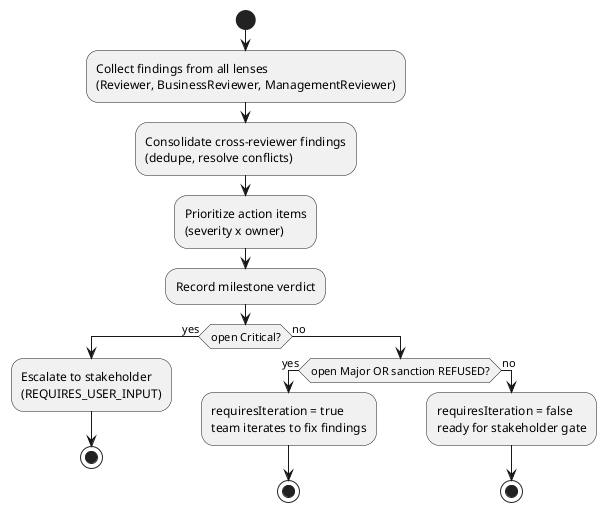
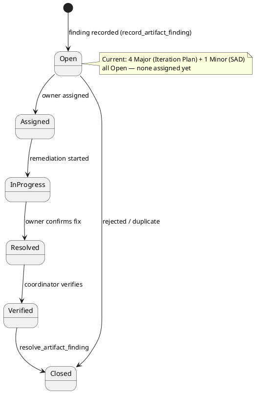
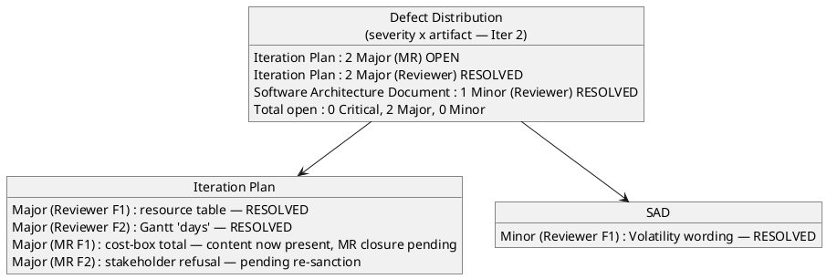
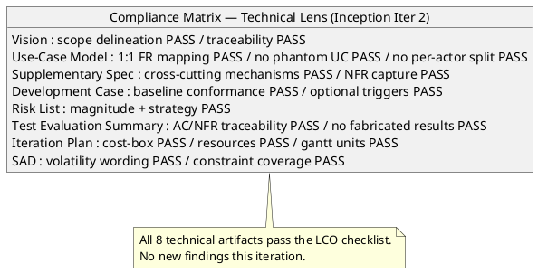

## Document Control

| Field | Value |
|---|---|
| Phase | Inception |
| Status | Final (consolidated) |
| Milestone Target | End-of-Inception (Lifecycle Objectives) — NOT YET ACHIEVED |
| Review Type | Lifecycle Milestone Review (LCO) — consolidated |
| Review Point | Lifecycle Objectives (feasibility + exit criteria + stakeholder sanction) |
| Reviewer | ReviewCoordinator (consolidation of all lenses) |
| Date | 2026-09-14 |
| Artifacts Reviewed | Vision, Iteration Plan, Risk List, Development Case, Use-Case Model, Supplementary Specification, Software Architecture Document, Test Evaluation Summary |

**Lens participation (authoritative):**

| Lens | Role | Status |
|---|---|---|
| Technical | Reviewer | EXECUTED |
| Business | BusinessReviewer | EXECUTED (0 findings) |
| Management | ManagementReviewer | EXECUTED |

## Review Scope and Criteria

This is the **consolidated LCO (Lifecycle Objectives) review** — the single authoritative record that merges the three executed lenses (technical, business, management) into one disposition. The four LCO questions are: (1) do stakeholders agree on what is in/out of scope? (2) have key risks been identified with magnitude ratings? (3) is the proposed approach feasible? (4) is the project sanctioned to proceed to Elaboration?

The consolidation workflow and the finding lifecycle are modeled below.

## Findings
Consolidated findings across all three lenses. **No cross-lens conflicts** — every finding is distinct. The BusinessReviewer lens executed and reported zero findings.

**Iteration 2 reconciliation (technical lens — Reviewer):** all three findings emitted by the Reviewer lens in Iteration 1 are now **Resolved** (see Resolutions and Actions). The two Management Reviewer findings on the Iteration Plan remain open pending that lens's own closure and the stakeholder's re-sanction.

**Totals after Iteration 2 reconciliation: 0 Critical, 2 Major (Management Reviewer, open), 0 Minor.**

### Consolidated finding register (Iteration 2 status)

| Artifact | Key | Lens | Severity | Finding | Recommendation | Owner | Status |
|---|---|---|---|---|---|---|---|
| Iteration Plan | F1 | Reviewer | Major | Resources table marks SA "Dormant" and omits Test Manager. | Update Resources table + Objective 1. | Project Manager | **Resolved** (Iter 2) |
| Iteration Plan | F2 | Reviewer | Major | Gantt expresses agent work in "days". | Replace with token budgets. | Project Manager | **Resolved** (Iter 2) |
| Iteration Plan | F1 | Management Reviewer | Major | No single total cost-box stated. | State total token budget as assumption. | Project Manager | Open (content now present — MR closure pending) |
| Iteration Plan | F2 | Management Reviewer | Major | Stakeholder REFUSED LCO sanction. | Remediate all three Major findings; re-review. | Project Manager | Open (pending re-sanction) |
| Software Architecture Document | F1 | Reviewer | Minor | Logical View cites "Volatility: High" vs Medium. | Correct prose. | Software Architect | **Resolved** (Iter 2) |

**Technical-lens re-evaluation (Iteration 2):** all 8 technical artifacts (Vision, Use-Case Model, Supplementary Specification, Development Case, Risk List, Test Evaluation Summary, Iteration Plan, Software Architecture Document) were re-read against the LCO checklist. No new defects detected. The three Reviewer-lens findings are remediated in the current artifact content.

## Resolutions and Actions

No prior-iteration findings exist (Iteration 1, Cycle 1) — nothing to reconcile from earlier cycles. All five findings above are **open** and carry concrete remediation.

**Action items (prioritized):**

1. **Project Manager** — remediate all four Major findings on the Iteration Plan (cost-box total; resource table; Gantt units; then the refusal directive resolves once the other three are fixed).
2. **Software Architect** — remediate the one Minor finding on the SAD (Volatility wording).

**Stakeholder sanction: REFUSED.** The stakeholder answered "No" to the LCO sanction question and directed "Fix all findings." The project does NOT advance past LCO until the four Major findings on the Iteration Plan are remediated and the stakeholder re-sanctions.

## Disposition

**Overall LCO disposition (consolidated): No-Go — stakeholder sanction REFUSED.**

- **0 Critical findings** — no scope, feasibility, or viability blocker from any lens.
- **Scope agreement: PASS** — Vision scope statement clearly delineates in/out; all 12 UCs trace 1:1 to FR-001…FR-012; no scope creep detected (technical + management lenses agree).
- **Risk identification: PASS** — R001 (High, 9), R002 (Significant, 6), R003 (Significant, 6), R004 (Moderate, 4) all carry magnitude, strategy, mitigation, contingency.
- **Feasibility: PASS** — candidate architecture (SAD) honors all 21 constraints; layered monolith on a single node, appropriate for 200 users.
- **Cost-box governance: FAIL (Major)** — iteration total token budget not stated; stop condition unmeasurable.
- **Plan internal consistency: FAIL (Major)** — resource table and Gantt units contradict the DC measurement policy and the actual artifact set produced.
- **Stakeholder sanction: REFUSED** — "Fix all findings."

**Verdict: No-Go.** The project does not advance past the Lifecycle Objectives milestone until the four Major findings on the Iteration Plan are remediated and the stakeholder re-sanctions. This is a governance/consistency stop, not a scope or feasibility stop — the baseline is sound; the plan's internal consistency and cost-box governance must be corrected first.

## Traceability

| Element | Traces From | Link Type | Traces To |
|---|---|---|---|
| Iteration Plan#F1 (Reviewer) | Iteration Plan (resource table) | DependsOn | Project Manager (rework) |
| Iteration Plan#F2 (Reviewer) | Iteration Plan (Gantt units) | DependsOn | Project Manager (rework) |
| Iteration Plan#F1 (MR) | Iteration Plan (cost-box) | DependsOn | Project Manager (rework) |
| Iteration Plan#F2 (MR) | Iteration Plan (stakeholder refusal) | DependsOn | Project Manager (rework) |
| Software Architecture Document#F1 | SAD (Volatility wording) | DependsOn | Software Architect (rework) |
| Review Record | Vision, Iteration Plan, Risk List, Development Case, Use-Case Model, Supplementary Specification, Software Architecture Document, Test Evaluation Summary | DependsOn | LCO milestone verdict (ReviewCoordinator) |
