## Document Control
- **Phase:** Inception
- **Status:** Consolidated — LCO milestone review, iteration 2. Verdict: No-Go (stakeholder sanction REFUSED).
- **Milestone Target:** Lifecycle Objectives (LCO) — end of Inception. NOT YET ACHIEVED.
## Review Scope and Criteria
### Reviewer lens

**Review type.** Technical review at the Lifecycle Objectives review point. The evaluative lens is **exit criteria**, not completion: the question is whether the artifact set collectively satisfies the conditions for phase transition, and whether each artifact is internally sound and consistent with the artifacts it derives from.

**Artifacts reviewed this pass.** Eight: Vision, Use-Case Model, Supplementary Specification, Development Case, Risk List, Iteration Plan, Software Architecture Document, Test Evaluation Summary. The Iteration Assessment is not reviewed for currency — the Project Manager authors it in the Assess touchpoint that runs after this review, so at review time it cannot yet describe the iteration being reviewed. Its absence or lag is not a finding and not a gate condition.

**Upstream consumption.** Every artifact was read against the artifacts it derives from before any finding was recorded: the Use-Case Model against the Vision's declared scope, the Supplementary Specification against the Use-Case Model, the Software Architecture Document against the Use-Case Model and the Supplementary Specification, the Test Evaluation Summary against the acceptance criteria and the Use-Case Model, and the Development Case, Risk List and Iteration Plan against the declared scope and each other. The traceability tree was projected from the Business level and used as the completeness instrument.

**Checklists applied, per artifact type.**

| Artifact | Checklist |
|---|---|
| Vision | Scope adherence and no creep; stakeholder coverage; one feature per declared FR; NFR/AC/BG/CON coverage; no unsourced figure; UML present; trace endpoints are elements; diagram consistency with the Use-Case Model |
| Use-Case Model | One UC per declared FR with a `Source: FR-NNN` line; no cross-cutting mechanism as a UC; multi-actor process is one UC; UML present; trace edges registered; SUSPECT edges reviewed; realizing-component table current |
| Supplementary Specification | NFR-001..NFR-005 covered; CON-009..CON-019 as rules; cross-cutting mechanisms as entries; no invented identifier; UML present; trace endpoints are elements; downstream element currency |
| Development Case | DC baseline conformance (roster, CORE ownership, CORE completeness, artifact universe, no role merge); optional trigger justification against each §5.2 condition; intensity per canonical matrix; environment record current; SCM issue record current |
| Risk List | R001..R003 preserved with declared identifiers and magnitudes; team risks numbered per CON-020; acceptance cites CON-021; mitigation and contingency present; premise current; unconfirmed basis flagged |
| Iteration Plan | AC-001..AC-006 accounted for; no fabricated duration or calendar date; human gate bounded and off the team's path; AC trace edges registered; measured actuals recorded; exit criteria carry a verdict |
| Software Architecture Document | High-volatility UC to dedicated component; no layer or feature naming; CON-025 Keycloak in-network; no fabricated measurement; invariants enforced in schema; correction model complete; trace table matches the graph |
| Test Evaluation Summary | AC verification plan; stand-in boundary stated; no fabricated result; SCM evidence current |

**SCM evidence taken at this review.** `scm_list_pull_requests(open)` returns no open pull request, so no PR required a disposition. `scm_get_build_status(main)` returns success for run `36095051721`. `scm_list_issues(all)` returns three open issues: `Issue #1`, `Issue #2`, `Issue #3`, all labelled `severity:minor`, `nature:defect`, `configuration-record`.

**Entry criteria.** All eight artifacts are present and in a reviewable state; the upstream artifacts each depends on are available; the checklists above were prepared before the artifacts were read. No artifact was found to be a placeholder mid-review.

### Business Reviewer lens

**Review type.** Business Modeling quality gate — scenario-appropriateness assessment and derivation-readiness check. Not a Fagan inspection: no reader paraphrase step and no separate recorder role.

**Review point.** Lifecycle milestone — LCO. The evaluative lens is **exit criteria**: does the Business Modeling discipline's contribution satisfy the conditions for phase transition? The Business Modeling discipline is INACTIVE on this project, so the lens applied is the **inactivity justification** lens, not the artifact-quality lens.

**Scenario assessment (Heuristic 1 — assessed FIRST, before any artifact was read).** The six RUP business modeling scenarios were evaluated against the declared scope. **None applies.** The project builds one web application for one organisation against declared system requirements (`FR-001`..`FR-009`); no business process is modelled, re-engineered or reused. No scenario-appropriate standard can therefore be applied to a business-model artifact, because no such artifact is required. Applying New Business or Revamp standards here would manufacture false defects — the anti-pattern the discipline's own heuristics warn against.

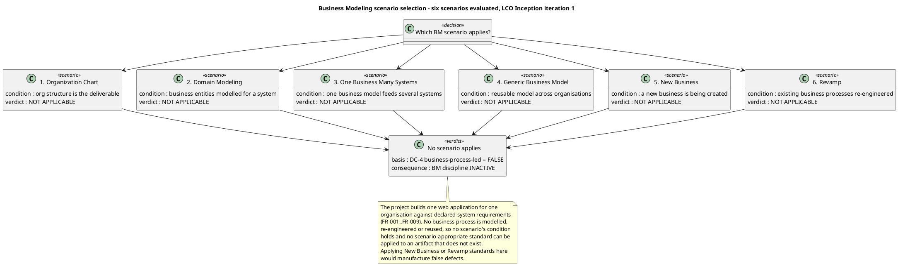

**DC §4 classification, independently re-verified.** `get_dc_classification` returned `isBusinessProcessLed: false`, re-evaluated this iteration, with all four criteria evaluated and none fired. I re-verified each criterion against the declared scope rather than accepting the verdict, and checked whether any Change Request had altered the basis — none has.

| DC §4 criterion | Recorded verdict | Independent re-verification |
|---|---|---|
| (a) project re-engineers or automates a business process | NOT FIRED | Confirmed. The portal replaces three manual artefacts (Excel clocking sheets, mass emails, PDF phone list) with a web application. No HR process is re-engineered and no process model is produced. |
| (b) business actors and business workers are modelled | NOT FIRED | Confirmed. The declared scope names system actors (Employee, HR Administrator) and external systems (AD, Keycloak). No business actor and no business worker is declared anywhere. |
| (c) a Business Use-Case Model is an input or an output | NOT FIRED | Confirmed. The declared scope supplies system use cases `UC01`/`UC02`/`UC03` and `FR-001`..`FR-009` directly. No BUC is declared or required. |
| (d) the stakeholder declared business processes rather than system requirements | NOT FIRED | Confirmed. The stakeholder declared system requirements, system invariants (`CON-009`..`CON-019`) and acceptance criteria (`AC-001`..`AC-006`), all system-level. |

**Business Modeling artifact inventory — the evidence for the inactivity verdict.** The gate is not the classification alone; it is the classification *plus* the observed absence of every business-model artifact. Both hold.

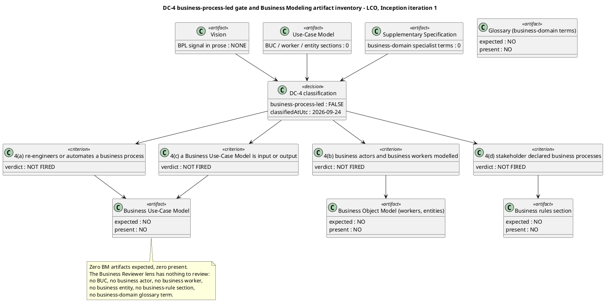

**Artifacts read in full before any finding was recorded (upstream consumption).** Vision, Use-Case Model, Supplementary Specification, Review Record (all existing lens blocks), plus the DC §4 classification. The Development Case, Risk List, Iteration Plan, Software Architecture Document and Test Evaluation Summary were not read: none can carry a business-model section, and the Business Modeling discipline's artifact surface is exhausted by the three read.

**Checklists applied.** The Business Modeling checklist (Heuristic 1.2) was applied item by item and every item recorded Pass or N/A. N/A is not a defect: the Development Case does not require a business-model artifact of the BPA this phase, so a finding against a non-required artifact would be a false defect.

**Entry criteria.** The Development Case is present and carries tailoring content, so it governs this review. The DC §4 classification is recorded and re-evaluated this iteration. No business-model artifact was expected and none was found to be a placeholder mid-review.

**Scope of this lens.** This is the Business Reviewer lens — the business-modeling quality gate. The generic Reviewer's technical lens and the Management Reviewer's lens are separate blocks in this same Review Record and are not written here.

### Management Reviewer lens

**Review type.** Lifecycle Milestone Review — the LCO gate, Inception iteration 2. This is a formal gate verdict, not a courtesy read-through: the question is whether the phase's exit criteria are satisfied, and the burden of proof rests on the project team.

**Review point.** Lifecycle milestone — LCO, end of Inception. The evaluative lens is **exit criteria**, not completion. Inception produces a baseline, not a running system, so no completion lens is applied and no acceptance criterion is expected to be verified.

**Artifacts reviewed (8 of 8).** Development Case, Vision, Use-Case Model, Supplementary Specification, Risk List, Iteration Plan, Software Architecture Document, Test Evaluation Summary.

**Upstream consumption.** Every artifact was read in full before any finding was recorded. The trace graph was projected from the Business level (66 roots, 231 nodes) and used as the completeness instrument, never the artifacts' own prose.

**Checklists applied, per artifact type.**

| Artifact | Management checklist applied |
|---|---|
| Iteration Plan | Every declared acceptance criterion accounted for; iteration exit criteria stated and evidenced; no fabricated duration or calendar date; human gate bounded and reported apart from agent time; measured spend recorded per CON-027; roadmap justified against the risk profile |
| Risk List | Declared risks preserved with identifier and magnitude; team risks numbered per CON-020; acceptance citing CON-021; magnitude bands anchored on a confirmed basis; mitigation and contingency present and their execution evidenced; retirement trend |
| Development Case | DC baseline conformance against the IARI baseline; optional-trigger justification against each §5.2 condition; intensity against the canonical matrix; environment readiness evidenced at the gate, not only planned |
| Vision | Scope adherence against the declared scope; stakeholder coverage; unsourced-figure check; business-goal verification path |
| Use-Case Model | One UC per declared FR; no cross-cutting mechanism as a UC; multi-actor process as one UC |
| Supplementary Specification | NFR coverage; business rules as rules; cross-cutting mechanisms as entries with `<<include>>` |
| Software Architecture Document | Every High-volatility use case mapped to a component; CON-025 placement; no fabricated measurement |
| Test Evaluation Summary | Acceptance-verification plan per criterion; stand-in boundary stated; no fabricated result; SCM evidence current |

**Entry criteria.** All eight artifacts present and in Draft; the Development Case present and carrying tailoring content, so it governs this review. No artifact was found to be a placeholder mid-review.

**SCM evidence.**

| Evidence | Observed value |
|---|---|
| Build on `main` | success — run `36095051721` |
| Open issues | `Issue #1`, `Issue #2`, `Issue #3` |
| Open pull requests | none |
| Branches awaiting review | none |

**Scope of this lens.** This is the Management Reviewer lens — the LCO gate verdict, the four-axis health assessment and the risk-retirement check. The generic Reviewer's technical lens and the Business Reviewer's lens are separate blocks in this same Review Record and are not written here.

### Review Coordinator — consolidation

**Review event.** Lifecycle Milestone Review — LCO, end of Inception, iteration 2. This is the project's second review event; the first was the iteration-1 LCO review, whose sanction was refused.

**Lens participation (authoritative).**

| Lens | Role | Participation | Findings recorded this pass | Prior findings closed this pass |
|---|---|---|---|---|
| Technical | Reviewer | EXECUTED | 6 — 0 Critical, 1 Major, 5 Minor | 11 |
| Business | BusinessReviewer | EXECUTED | 1 — 0 Critical, 0 Major, 1 Minor | 0 |
| Management | ManagementReviewer | EXECUTED | 2 — 0 Critical, 1 Major, 1 Minor | 7 |

All three lenses executed. No lens is recorded as INACTIVE — did not evaluate this review.

**Review process framework.** Seven review types, each triggered by the workflow activity that requires it. A PRA Review is never a substitute for a milestone review.

| Review type | Triggering workflow activity | Required participants | Entry criteria | Exit criteria | Primary output |
|---|---|---|---|---|---|
| Project Approval Review | Project Initiation | STK-001, SystemAnalyst, ProjectManager, ManagementReviewer | Vision and Risk List in target state; agenda distributed in advance | Scope feasibility ruled; Review Record signed | Review Record |
| Project Planning Review | Process configuration | ProcessEngineer, ProjectManager, STK-001, ManagementReviewer | Development Case and Iteration Plan in target state | Tailoring and roadmap ruled feasible and acceptable to stakeholders | Review Record |
| Iteration Plan Review | Plan for Next Iteration | ProjectManager, SoftwareArchitect, TestManager, Reviewer | Iteration Plan in target state; exit criteria stated | Plan reviewed before the iteration begins | Review Record |
| PRA Review | Manage Iteration (mid-iteration) | ProjectManager, discipline leads, ManagementReviewer | Progress and risk data current | Project health assessed; corrective actions assigned | Review Record |
| Iteration Evaluation Criteria Review | Manage Iteration (exit criteria) | Reviewer, TestManager, ProjectManager | Each exit criterion evidenced | Every exit criterion verified or recorded as not met | Review Record |
| Iteration Acceptance Review | Manage Iteration (close) | Reviewer, ManagementReviewer, STK-001 | Iteration deliverables complete | Deliverables formally accepted | Review Record |
| Lifecycle Milestone Review | Close-Out Phase | ManagementReviewer, Reviewer, BusinessReviewer, STK-001 | All phase artifacts in target state; exit criteria evidenced | Sanction to proceed granted or refused | Review Record |
| Project Acceptance Review | Close-Out Phase (project) | ManagementReviewer, STK-001, DeploymentManager | All acceptance criteria verified | Final project acceptance | Review Record |

**Review calendar — Inception, mapped to the iteration boundary.**

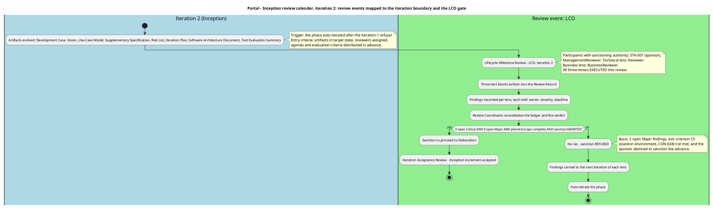

**Entry criteria — enforced before this review began.** All eight artifacts present and in target state; the Development Case present and carrying tailoring content, so it governs the review; reviewers assigned with expertise matched to artifact domain; agenda and evaluation criteria distributed in advance. No artifact was found to be a placeholder mid-review.

**Exit criteria — enforced before this review closes.** Every finding carries an owner, a severity and a resolution deadline; the Review Record is signed and archived. The milestone verdict is anchored to verified completeness, not to judgment: the sanction was asked of the stakeholder and refused, so the phase gate does not open.

**Reviewer pool and expertise mapping.**

| Artifact domain | Reviewer expertise required | Assigned lens |
|---|---|---|
| Vision, Use-Case Model, Supplementary Specification | Requirements and business-scope competency; stakeholder authority for scope | Reviewer (technical), BusinessReviewer (business gate), ManagementReviewer (scope) |
| Development Case | Process configuration and baseline conformance | Reviewer, ManagementReviewer |
| Risk List | Risk classification and magnitude-band basis | Reviewer, ManagementReviewer |
| Iteration Plan | Planning discipline; acceptance-criterion coverage; measurement policy | Reviewer, ManagementReviewer |
| Software Architecture Document | Architecture and design competency | Reviewer |
| Test Evaluation Summary | Test engineering knowledge; SCM evidence currency | Reviewer, ManagementReviewer |

**Scope of this block.** This is the Review Coordinator's consolidation — the process framework, the calendar, the entry/exit enforcement and the lens participation record. The three lens blocks that follow are the reviewers' own output and are preserved as written.

## Findings
#### Iteration 3 — LCO technical review

**Summary.** 4 findings: 0 Critical, 1 Major, 3 Minor. No Critical finding was recorded, so no finding of this lens escalates to the stakeholder on severity grounds. Of the six prior findings of this lens, four are closed and two are deferred — see Resolutions and Actions.

**Closure ledger.** Every prior finding of this lens, with its disposition.

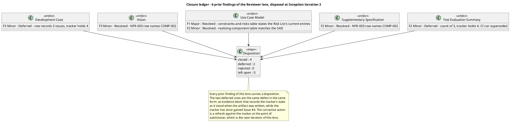

**Compliance matrix.** Every checklist item evaluated, recorded Pass or Fail. A Fail is a finding.

**Defect distribution.**

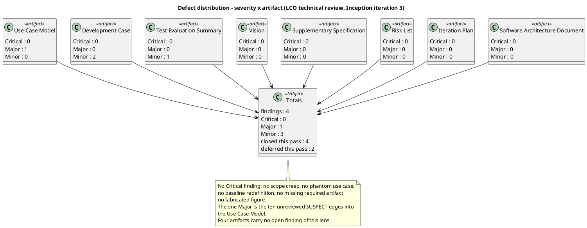

**Annotated review map.** Where each finding sits, and which LCO exit criterion the artifact evidences.

```plantuml
@startuml RR3_AnnotatedMap
title Annotated review map - artifacts, findings and the LCO exit criteria they evidence (Inception iteration 3)
skinparam classAttributeIconSize 0

class "Vision" as V <<artifact>>
class "Use-Case Model" as UCM <<artifact>>
class "Supplementary Specification" as SS <<artifact>>
class "Development Case" as DC <<artifact>>
class "Risk List" as RL <<artifact>>
class "Iteration Plan" as IP <<artifact>>
class "Software Architecture Document" as SAD <<artifact>>
class "Test Evaluation Summary" as TES <<artifact>>

class "C1 Scope agreed" as C1 <<criterion>>
class "C2 Project viable" as C2 <<criterion>>
class "C3 Risks identified" as C3 <<criterion>>
class "C4 Process governs" as C4 <<criterion>>
class "C5 Stand-in environment" as C5 <<criterion>>
class "C6 Build verifiable" as C6 <<criterion>>

V --> C1
UCM --> C1
SS --> C1
SAD --> C2
DC --> C4
RL --> C3
IP --> C3
IP --> C5
IP --> C6
TES --> C6

note right of UCM
  1 Major
  - ten SUSPECT edges unreviewed
    at phase close
end note

note right of DC
  2 Minor
  - CI revision citation does not
    match the repository blob
  - one SUSPECT edge unreviewed
end note

note right of TES
  1 Minor (deferred)
  - defect count and CI run stale
end note

note right of V
  no finding
  - NFR-003 row now names COMP-002
end note

note right of SS
  no finding
  - NFR-003 row now names COMP-002
end note

note bottom of C5
  C5 is still not evidenced by any artifact: the
  Development Case's LCO-gate verification records
  the stand-in environment as not ready, and the
  Iteration Plan records criterion 5 as NOT MET.
  C6 is met by the green build on main.
end note
@enduml
```

**Findings.**

| Key | Artifact | Severity | Finding | Recommendation |
|---|---|---|---|---|
| `Use-Case Model#F3` | Use-Case Model | **Major** | Ten `SUSPECT` edges into this artifact's use cases are unreviewed at phase close. The trace graph flags `COMP-001` → `UC-001`, `UC-002`, `UC-004`; `COMP-002` → `UC-001`, `UC-002`; `R004` → `UC-001`, `UC-008`; and `Iteration Plan` → `UC-001`, `UC-002`, `UC-008`. Each is a change another authority declared against a use case whose owner has not re-read it and has not declared the change in turn. The artifact's tables already state the current content — the realizing-component table matches the Software Architecture Document's registered edges, and the constraints-and-risks table states the Risk List's current `R001`, `R004` and `R009` entries — so what is missing is the declaration that clears the edges, not the content. A `SUSPECT` edge left open at phase close is a Major finding against the artifact owning the unreviewed end. | Re-read the Software Architecture Document's component rows, the Risk List's `R004` entry and the Iteration Plan's `UC-008` change against `UC-001`, `UC-002`, `UC-004` and `UC-008`, then declare the change in turn for each affected use case so the ten `SUSPECT` edges clear. The content is already current; the declaration is what is missing. |
| `Development Case#F4` | Development Case | Minor | The artifact cites the CI configuration item by a revision the repository does not carry. Three places record `.github/workflows/ci.yml` at `a9890724` — the Organization and tool assessment table, the iteration-preparation checkpoint result and the LCO-gate environment verification. `Issue #4` in the tracker records that this revision does not match the repository blob. The artifact's CI evidence is therefore cited against a revision that is not the one in the repository, and the same citation is repeated in all three places. | Cite the current blob revision of `.github/workflows/ci.yml`, or cite the file without a revision and let the tracker hold the revision. Correct all three places that carry the citation. |
| `Development Case#F5` | Development Case | Minor | The trace graph flags one `SUSPECT` edge into this artifact — `Iteration Plan` → `Development Case` — and the artifact has not reviewed it. The Iteration Plan declared a change this iteration: the coarse roadmap was re-planned from the measured actuals of both closed Inception iterations, and the stand-in directory was widened to carry the worker-category link. This artifact's end of the link has not been re-read against that change, so the edge stays flagged at phase close. | Re-read the Iteration Plan's re-planning against this artifact's process configuration and declare the change in turn, or clear the edge if the Development Case's content still holds. The edge is a governance link — the Iteration Plan refines the Development Case — so the review is a confirmation that the process configuration still governs the re-planned roadmap. |
| `Test Evaluation Summary#F2` | Test Evaluation Summary | Minor | **Deferred from iteration 2; the defect stands in the same form.** The evidence block records three open defects (`Issue #1`, `Issue #2`, `Issue #3`) while the tracker holds four — `Issue #4` is not recorded — and the CI run cited (`36110698735`) is superseded by the run observed on `main` at this review (`36111645523`). The artifact's own rule — a defect is an SCM issue and its identifier is the issue number — makes the count a fact to be read from the tracker, not carried forward. | Record `Issue #4` alongside the other three, state the defect count as four, and refresh the CI run reference to the run observed at the point of submission. The three places that carry the count — the Test Summary evidence table, the Defects and Incidents section and the Conclusions table — must agree with the tracker. |

**Traceability compliance (iteration 3).** The traceability tree was projected from the Business level and used as the completeness instrument. Result: 67 roots, 234 nodes. No `UNKNOWN LABEL` — every identifier in the graph belongs to a declared family. No `«LEAF»` at Business level: every declared requirement and acceptance criterion reaches at least one downstream element, so no requirement is unrealized. The iteration-2 table defects are corrected: the Vision and the Supplementary Specification now name `COMP-002` on the `NFR-003` row, and the Use-Case Model's realizing-component table matches the Software Architecture Document's registered edges.

**Ten `SUSPECT` edges remain, all into the Use-Case Model.** `COMP-001` → `UC-001`, `UC-002`, `UC-004`; `COMP-002` → `UC-001`, `UC-002`; `R004` → `UC-001`, `UC-008`; `Iteration Plan` → `UC-001`, `UC-002`, `UC-008`. The count rose from five to ten because the Software Architect and the Project Manager both declared changes this iteration and the Use-Case Model's owner has not declared the change in turn. They are recorded as `Use-Case Model#F3` (Major). One further `SUSPECT` edge — `Iteration Plan` → `Development Case` — is recorded as `Development Case#F5` (Minor).

**Scope-adherence result (iteration 3).** No scope creep. Nine use cases, one per declared `FR-001`..`FR-009`; every use case carries a `Source: FR-NNN` line citing a declared requirement; no phantom use case; no cross-cutting mechanism modelled as a use case — OIDC login, authorization, LDAP read, audit write and the clocking retry are all Supplementary Specification entries with `<<include>>` from their dependent use cases. No `[DERIVED]` marker survives in any artifact, so no silent derivation promotion exists to flag. No unsourced quantitative claim was found: the artifacts state declared targets and explicitly record that no measurement exists yet. No financial figure appears anywhere in the artifact set.

**DC baseline conformance result (iteration 3).** The Development Case does not redefine the 25-role roster, does not reassign CORE ownership, does not omit a CORE artifact, does not list an artifact outside the CORE + OPTIONAL universe, and does not merge two roles. Business Modeling is declared INACTIVE with the correct trigger condition (`business-process-led = false`). All six OPTIONAL triggers were re-audited against their §5.2 conditions and none was found over-triggered. The Environment intensity row states the canonical level per phase. The two findings against this artifact are a stale CI revision citation and an unreviewed `SUSPECT` edge, not a baseline violation.

**Optional trigger justification (iteration 3).** Every NOT-FIRED verdict was checked against its §5.2 condition. Glossary: the domain vocabulary is ordinary HR and intranet language and the one closed list is fixed by `CON-014` — condition does not hold. Architectural Proof-of-Concept: no technical risk requires empirical validation, and `CON-028` removes the only candidate — condition does not hold. Data Model: the portal owns five entities, well under ten, and `CON-030` states there is no data migration — condition does not hold. Deployment Model: one application and one database on one estate, reachable only from the internal network — condition does not hold. User-Interface Prototype: `CON-031` makes the design already decided and authoritative — condition does not hold. Test Plan: `CON-019` states no external compliance regime applies and there is no contractual test reporting — condition does not hold. No over-triggering found.

**SCM evidence taken at this review.** `scm_list_pull_requests(open)` returns no open pull request, so no PR required a disposition. `scm_get_build_status(main)` returns success for run `36111645523`. `scm_list_issues(open)` returns four open issues: `Issue #1`, `Issue #2`, `Issue #3`, `Issue #4`, all labelled `severity:minor`, `nature:defect`, `configuration-record`.
## Resolutions and Actions
### Reviewer lens

#### Iteration 1 — actions arising

**Prior findings of this lens.** None. This was the first review pass of the Reviewer lens on this project: `read_artifact_findings` returned an empty list for all eight artifacts, so no prior finding of this lens existed to close, defer or reject. No `resolve_artifact_finding` call was emitted that pass.

**Actions arising from that pass.** Each action is the finding's Recommendation; its status is that finding's Resolution. No action identifier is minted.

| Finding | Owner | Action | Blocking? |
|---|---|---|---|
| `Test Evaluation Summary#F1` | TestManager | Record `Issue #1` as the open defect in the three places that assert none exists; state the defect count as one | No — the artifact's mission verdict is unaffected, but the evidence block must not contradict the tracker |
| `Development Case#F1` | ProcessEngineer | Refresh the Environment readiness record to show the CI pipeline present and green on `main` | No |
| `Development Case#F2` | ProcessEngineer | State the Environment intensity row per canonical matrix; move the recurrence narrative to the Environment section | No |
| `Risk List#F1` | ProjectManager | Restate `R009` to cover only the absent guideline files, or record the CI half as retired | No |
| `Iteration Plan#F1` | ProjectManager | Draw the human validation gate in parallel with Iter-2 and Iter-3 | No |
| `Iteration Plan#F2` | ProjectManager | Register the missing acceptance-criterion edges | No |
| `Vision#F1` | SystemAnalyst | Replace section names in Traces To with element identifiers | No |
| `Vision#F2` | SystemAnalyst | Align the boundary diagram with the Use-Case Model's | No |
| `Supplementary Specification#F1` | RequirementsSpecifier | Name element identifiers in Traces To, or state the downstream elements do not yet exist | No |
| `Software Architecture Document#F1` | SoftwareArchitect | Reconcile the traceability table with the registered edges | No |
| `Software Architecture Document#F2` | SoftwareArchitect | State the clocking time fields as immutable and name the export's correction-resolution rule | No |

**Carry-over from iteration 1.** No finding of this lens was deferred and none was rejected. All 11 carried to iteration 2 of this lens, which reconciled them in its closure state before recording new defects.

#### Iteration 2 — closure of prior findings

**Disposition of every prior finding of this lens.** Each was re-read against the corrected artifact content and closed on the evidence cited. Nothing is deferred and nothing is rejected.

| Finding | Severity | Disposition | Evidence read from the corrected artifact |
|---|---|---|---|
| `Development Case#F1` | Minor | **Resolved** | The Organization and tool assessment table now records the CI workflow as "Present — `.github/workflows/ci.yml` at `358f1f8`, build and test jobs, green on `main`"; the Environment readiness criteria table records it as "Ready"; the LCO-gate verification records it as "Ready". The gap is kept open only for the genuinely absent items |
| `Development Case#F2` | Minor | **Resolved** | The Environment row now reads "Per canonical matrix — High (Inception), Medium (Elaboration), not scheduled in Construction or Transition"; the one-time/recurring activity-cluster narrative is stated in the Environment discipline section |
| `Vision#F1` | Minor | **Resolved** | The Traces To column names element identifiers on every row — `UC-NNN` for the FR rows, `COMP-NNN` for the NFR rows — and the not-yet-minted case is stated explicitly |
| `Vision#F2` | Minor | **Resolved** | The Product Overview diagram draws Keycloak to all nine use cases, matching the Use-Case Model's diagram of the same boundary |
| `Supplementary Specification#F1` | Minor | **Resolved** | The Traces To column names `COMP-NNN` on every row; the label-scope note is extended to the Traces To column |
| `Risk List#F1` | Minor | **Resolved** | `R009` is restated to the guideline files only, and the CI half is recorded as retired against the observed run |
| `Iteration Plan#F1` | Minor | **Resolved** | The roadmap gantt draws the human validation gate in parallel with Iter-2 and Iter-3, with the note that the team's work does not wait on it |
| `Iteration Plan#F2` | Minor | **Resolved** | The four missing edges are registered — `AC-002` and `AC-005` to `UC-001`, `AC-003` to `UC-005`, `AC-004` to `UC-008` — and the trace chain confirms each |
| `Software Architecture Document#F1` | Minor | **Resolved** | The traceability table is reconciled with the graph: `UC-001` is dropped from the Traces From side of the `COMP-003` row, and the `COMP-001` row matches the registered edges |
| `Software Architecture Document#F2` | Minor | **Resolved** | The model states the clocking's recorded times are immutable, the `corrected` flag is derived from the correction chain, and the Data View names the resolution rule the export applies |
| `Test Evaluation Summary#F1` | **Major** | **Resolved** | The three places that asserted the tracker holds no issues now record open defects, with `Issue #1` and `Issue #2` listed and the Conclusions table answering "Yes — two open" |

**Closure discipline.** Each closure was materialised by a `resolve_artifact_finding` call before this narrative was written. The tool call transitions the state; this table documents the rationale. The residual undercounts against the tracker's current three open issues are separate, newly observed defects and are recorded as new findings — `Development Case#F3` and `Test Evaluation Summary#F2` — not as a reopening of the closed ones.

#### Iteration 2 — actions arising

Each action is the finding's Recommendation; its status is that finding's Resolution. No action identifier is minted.

| Finding | Owner | Action | Blocking? |
|---|---|---|---|
| `Use-Case Model#F1` | SystemAnalyst | Re-read the Risk List's current `R001`, `R004` and `R009` entries and update the constraints-and-risks table: record `R004` as materialized, `R001`'s probability and impact as `[ASSUMPTION — requires validation]`, and `R009`'s remaining scope as the guideline files only. Then declare the change in turn so the six `SUSPECT` edges clear | **Yes** — a `SUSPECT` edge left open at phase close is a Major finding against the artifact owning the unreviewed end |
| `Use-Case Model#F2` | SystemAnalyst | Reconcile the realizing-component table with the SAD's registered edges: `COMP-001` → `UC-001`, `UC-002`, `UC-004`, `UC-008`; `COMP-002` → `UC-001`, `UC-002`, `UC-008`; add `COMP-009` and `COMP-010` | No |
| `Vision#F3` | SystemAnalyst | Replace the `NFR-003` row's Traces To with `COMP-002` and delete the "not yet minted" note for that row | No |
| `Supplementary Specification#F2` | RequirementsSpecifier | Replace the `NFR-003` row's Traces To with `COMP-002` and delete the "not yet minted" note for that row | No |
| `Development Case#F3` | ProcessEngineer | Record all three open issues in the "Open SCM issues" row, with their labels, or state the count as three and name the tracker as the authoritative record | No |
| `Test Evaluation Summary#F2` | TestManager | Record `Issue #3` alongside `Issue #1` and `Issue #2`, state the defect count as three, and refresh the CI run reference to the run observed at submission | No |

**Carry-over.** No finding of this lens is deferred and none is rejected. All six remain open for the next iteration of this lens, which will reconcile them in its closure state before recording new defects. The stakeholder's directive — all findings must be corrected, even if they are minor — governs the whole set.

**Cross-lens findings left untouched.** The findings carrying `reviewerRole: ManagementReviewer` and `reviewerRole: BusinessReviewer` are those lenses' to close. The ownership invariant rejects a cross-lens close attempt, so none was attempted.

### Business Reviewer lens

#### Iteration 1 — actions arising

**Prior findings of this lens.** None. This was the first review pass of the Business Reviewer lens on this project. `read_artifact_findings` returned an empty list for the Use-Case Model, and no finding on any artifact carried `reviewerRole: BusinessReviewer`. No `resolve_artifact_finding` call was emitted that pass, and none was due.

**Cross-lens findings left untouched.** Three findings existed on artifacts I read. All three carried `reviewerRole: Reviewer` and were that lens's to close. The ownership invariant rejects a cross-lens close attempt, so none was attempted.

| Finding | Lens | Severity | Why this lens does not act |
|---|---|---|---|
| `Vision#F1` | Reviewer | Minor | Traceability-table defect in the technical lens's checklist. Not a business-modeling defect. |
| `Vision#F2` | Reviewer | Minor | Boundary-diagram consistency between two system-level diagrams. Not a business-modeling defect. |
| `Supplementary Specification#F1` | Reviewer | Minor | Traceability-table defect in the technical lens's checklist. Not a business-modeling defect. |

**Actions arising from that pass.** None. Zero findings were recorded, so no action, owner or remediation exists to carry forward. No action identifier is minted — a remediation is the finding's Recommendation, and there is no finding.

**Carry-over.** Nothing was deferred and nothing was rejected. The Business Reviewer lens entered iteration 2 with no open finding and no outstanding action.

#### Iteration 2 — closure of prior findings

**Prior findings of this lens.** None. `read_artifact_findings` returns no finding carrying `reviewerRole: BusinessReviewer` on any artifact — the Use-Case Model, the Vision and the Supplementary Specification each return only findings of the Reviewer and Management Reviewer lenses. No prior finding of this lens exists to close, defer or reject, and no `resolve_artifact_finding` call was emitted this pass.

[PLAN] artifacts × prior BR findings with resolution==null: Use-Case Model: [], Vision: [], Supplementary Specification: [] — TOTAL: 0.
[EXIT] S_RECONCILE complete: closed=0, deferred=0, rejected=0, left-open=0. Total: 0 of 0.

**Cross-lens findings left untouched.** The findings on the artifacts I read carry `reviewerRole: Reviewer` or `reviewerRole: ManagementReviewer` and are those lenses' to close. The ownership invariant rejects a cross-lens close attempt, so none was attempted.

| Finding | Lens | Severity | Why this lens does not act |
|---|---|---|---|
| `Use-Case Model#F1` | Reviewer | Major | Unreviewed `SUSPECT` risk-to-use-case edges. A trace-graph currency defect in the technical lens's checklist, not a business-modeling defect. |
| `Use-Case Model#F2` | Reviewer | Minor | Realizing-component table stale against the SAD. A trace-table defect, not a business-modeling defect. |
| `Vision#F3` | Reviewer | Minor | `NFR-003` downstream element stale. A trace-table defect, not a business-modeling defect. |
| `Supplementary Specification#F2` | Reviewer | Minor | `NFR-003` downstream element stale. A trace-table defect, not a business-modeling defect. |
| `Vision#F1` | Management Reviewer | Minor | Business-goal verification path. The business-goal measurability item is mine and it passes; the finding is that the Vision's *statement* of the path was wrong, which is the Management Reviewer's scope finding. |

#### Iteration 2 — actions arising

Each action is the finding's Recommendation; its status is that finding's Resolution. No action identifier is minted.

| Finding | Owner | Action | Blocking? |
|---|---|---|---|
| `Use-Case Model#F1` (Business Reviewer) | SystemAnalyst | Add the worker-category filter to `UC-008` — extend main flow step 1 or add an alternative flow — so the directory filters by worker category as `CON-013` declares. If the filter is not intended, escalate the conflict between `FR-008`'s declared search dimensions and `CON-013`'s declared filter to the stakeholder rather than leaving it implicit in the model | No — Minor, and the discipline contributes no LCO exit criterion. Corrected per the stakeholder's directive that all findings are corrected, including the minor ones |

**Carry-over.** `Use-Case Model#F1` remains open for the next iteration of this lens, which will reconcile it in its closure state before recording new defects. Nothing is deferred and nothing is rejected.

**Condition that would re-activate this lens.** The lens re-activates if any of the following becomes true, and the Process Engineer's DC §4 classification is the trigger to watch:

| Condition | Effect |
|---|---|
| A Change Request introduces a business process to be re-engineered or automated | DC §4(a) fires; Business Modeling becomes ACTIVE; a Business Use-Case Model and its realizations become reviewable artifacts |
| A business actor or business worker is declared in scope | DC §4(b) fires; the BUC completeness test and the derivation bridge become applicable |
| A Business Use-Case Model becomes an input or an output of the work | DC §4(c) fires; the BUC-realization coverage gate becomes applicable |
| The stakeholder declares business processes rather than system requirements | DC §4(d) fires; the full Business Modeling checklist applies at Elaboration depth |
| A Glossary is triggered by specialist business-domain vocabulary | The business-terms review becomes applicable |

Until one of these holds, the Business Reviewer lens has no business-model artifact surface. The one finding it carries is a business-rule realization defect on a system use case, which is reviewable regardless of the discipline's activation state.

### Management Reviewer lens

#### Iteration 1 — actions arising

**Prior findings of this lens.** None. This was the first review pass of the Management Reviewer lens on this project: `read_artifact_findings` returned no finding carrying `reviewerRole: ManagementReviewer` on any artifact. No `resolve_artifact_finding` call was emitted this pass, and none was due.

**Stakeholder directive governing closure.** The stakeholder's answer to the sanction question was **No**, with the directive: *"All findings must be corrected, even if they are minor."* Every finding below is therefore blocking, including the four Minor ones. No finding of this lens is deferred and none is rejected.

**Actions arising from this pass.** Each action is the finding's Recommendation; its status is that finding's Resolution. No action identifier is minted.

| Finding | Owner | Action | Blocking? |
|---|---|---|---|
| `Iteration Plan#F1` | ProjectManager | Evidence the stand-in environment (`CON-028`) or state that exit criterion 5 is not met and the LCO gate is not passable | **Yes** — the criterion that gates every use case |
| `Development Case#F1` | ProcessEngineer | Add a post-iteration environment verification recording the actual state of each item at the LCO gate, with observed evidence | **Yes** |
| `Risk List#F1` | ProjectManager | Mark `R001`'s P and I as `[ASSUMPTION — requires validation]`; state the magnitude bands are provisional; re-anchor or obtain confirmation | **Yes** |
| `Iteration Plan#F2` | ProjectManager | Record the iteration's measured token spend and elapsed time, or name where the measurement is taken | **Yes** — per the stakeholder directive |
| `Development Case#F2` | ProcessEngineer | Record the iteration-preparation checkpoint result for the next iteration | **Yes** — per the stakeholder directive |
| `Risk List#F2` | ProjectManager | Record the observed state of `R004`'s treatment at the milestone and adjust its status | **Yes** — per the stakeholder directive |
| `Vision#F1` | SystemAnalyst | State the business-goal verification path per goal; `BG-003` is measured with `STK-004` after go-live | **Yes** — per the stakeholder directive |

**Cross-lens findings left untouched.** Eleven findings existed on artifacts this lens read. All carried `reviewerRole: Reviewer` and were that lens's to close. The ownership invariant rejects a cross-lens close attempt, so none was attempted. They were recorded there only so the milestone verdict was taken on the complete defect picture.

**Carry-over.** All 7 findings of this lens remained open for iteration 2 of this lens, which reconciled them in its closure state before recording new defects.

#### Iteration 2 — closure of prior findings

**Disposition of every prior finding of this lens.** Each was re-read against the corrected artifact content and closed on the evidence cited. Nothing is deferred and nothing is rejected.

| Finding | Severity | Disposition | Evidence read from the corrected artifact |
|---|---|---|---|
| `Development Case#F1` | **Major** | **Resolved** | The Development Case now carries "Environment verification at the LCO gate — Inception iteration 2", a post-iteration record stating the observed state of each item at the gate with its evidence, and it states explicitly that LCO exit criterion 5 is not met. The pre-iteration readiness table is retained but labelled a plan and is no longer offered as milestone evidence |
| `Development Case#F2` | Minor | **Resolved** | The iteration-preparation checkpoint is now a record: a "Checkpoint result — taken before the next iteration starts" table with the observed state and evidence for each of the four items it names, stating that the checkpoint does not pass because the stand-in environment is not confirmed |
| `Vision#F1` | Minor | **Resolved** | The Problem Statement's Success criteria row states the verification path per goal: `BG-001` through `AC-002`/`AC-003`/`AC-004`/`AC-006`, `BG-002` through `AC-002`/`AC-005`, and `BG-003` measured with `STK-004` after go-live, with the explicit statement that no acceptance criterion the team can run closes it |
| `Risk List#F1` | **Major** | **Resolved** | `R001`'s probability and impact are marked `[ASSUMPTION — requires validation]` in the Risk Register and the Risk Classification section, and the bands are re-anchored on the business-declared exposures `R002` (9) and `R003` (6). The High band's lower boundary is stated as provisional and the register no longer calls `R001` "the highest declared exposure" |
| `Risk List#F2` | Minor | **Resolved** | `R004`'s treatment state is recorded at the milestone: Materialized, "Treatment NOT executed at Iter-1 close", contingency executed, treatment re-scoped. Its mitigation now names a control that produces a record — the Development Case's post-iteration environment verification — rather than claiming a verification that did not happen |
| `Iteration Plan#F1` | **Major** | **Resolved** | Evaluation Criteria layer (b) now carries a verdict of MET or NOT MET per criterion at the point the plan is written, and criterion 5 is recorded as NOT MET with the explicit statement that the LCO gate is not passable until its evidence exists |
| `Iteration Plan#F2` | Minor | **Resolved** | The "Two currencies, reported apart" section records the measured actuals of the closed phase — 6,918,081 tokens and 8:35:00.7478289 elapsed agent time — with human queue time measured at 0:00:00 and reported apart |

**Closure discipline.** Each closure was materialised by a `resolve_artifact_finding` call before this narrative was written. The tool call transitions the state; this table documents the rationale. The residual defects observed against the Risk List, the Development Case and the Test Evaluation Summary are separate, newly observed defects and are recorded as new findings — `Risk List#F3`, `Risk List#F4`, `Development Case#F3`, `Test Evaluation Summary#F2` — not as a reopening of the closed ones.

#### Iteration 2 — actions arising

**Stakeholder directive governing closure.** The stakeholder's answer to the sanction question at this review was **No**, with the directive: *"Please fix all findings."* Every finding below is therefore blocking, including the Minor ones. No finding of this lens is deferred and none is rejected.

Each action is the finding's Recommendation; its status is that finding's Resolution. No action identifier is minted.

| Finding | Owner | Action | Blocking? |
|---|---|---|---|
| `Risk List#F3` | ProjectManager | Re-assess `R004` at this milestone: record the second failed execution and revisit its magnitude, strategy and mitigation rather than carrying them unchanged. If the stand-in environment cannot be delivered by the team, the treatment must change — different sequencing, a different owner, or escalation to the stakeholder as a decision only they can make | **Yes** — `R004` gates every test and its treatment has now failed twice |
| `Risk List#F4` | ProjectManager | Re-head the treatment column to the current iteration and refresh each row against observable state at Iter-2 close; for `R009`, record the guideline files as still absent and move the mitigation to the iteration that will author them | **Yes** — per the stakeholder directive |
| `Development Case#F3` | ProcessEngineer | Record all three open issues in the "Open SCM issues" row, with their labels, or state the count as three and name the tracker as the authoritative record | **Yes** — per the stakeholder directive |
| `Test Evaluation Summary#F2` | TestManager | Record `Issue #3` alongside `Issue #1` and `Issue #2`, state the defect count as three, and refresh the CI run reference to the run observed at submission | **Yes** — per the stakeholder directive |

**Carry-over.** All 4 findings of this lens remain open for the next iteration of this lens, which will reconcile them in its closure state before recording new defects. Nothing is deferred and nothing is rejected. The stakeholder's directive — "Please fix all findings" — governs the whole set, including the minor ones.

**Cross-lens findings left untouched.** The findings carrying `reviewerRole: Reviewer` and `reviewerRole: BusinessReviewer` are those lenses' to close. The ownership invariant rejects a cross-lens close attempt, so none was attempted.

| Finding | Lens | Severity | Why this lens does not act |
|---|---|---|---|
| `Use-Case Model#F1` | Reviewer | Major | Unreviewed `SUSPECT` risk-to-use-case edges. A trace-graph currency defect in the technical lens's checklist. |
| `Use-Case Model#F2` | Reviewer | Minor | Realizing-component table stale against the SAD. A trace-table defect. |
| `Vision#F3` | Reviewer | Minor | `NFR-003` downstream element stale. A trace-table defect. |
| `Supplementary Specification#F2` | Reviewer | Minor | `NFR-003` downstream element stale. A trace-table defect. |
| `Use-Case Model#F1` | BusinessReviewer | Minor | `CON-013`'s declared directory filter has no realizing flow in `UC-008`. A business-rule realization defect. |

### Review Coordinator — consolidated action plan

**Prioritisation rule.** The stakeholder's directive is that all findings are fixed, so nothing is deferred. Priority is nevertheless ordered: the two Major findings first, because each one either withholds the evidence for an LCO exit criterion or leaves a declared change unreviewed; then the seven Minor findings, grouped by owner so each producing role receives one work list.

**Priority 1 — Major findings (2).**

| Finding | Owner | Action | Why it is first |
|---|---|---|---|
| `Risk List#F3` (Management Reviewer) | ProjectManager | Re-assess `R004` at this milestone: record the second failed execution and revisit its magnitude, strategy and mitigation rather than carrying them unchanged. If the stand-in environment cannot be delivered by the team, the treatment must change — different sequencing, a different owner, or escalation to the stakeholder as a decision only they can make. Record the treatment state at Iter-2 close, not at Iter-1 close | `R004` gates every test and its treatment has now failed twice; the register carries it unchanged. This is exit criterion C5 |
| `Use-Case Model#F1` (Reviewer) | SystemAnalyst | Re-read the Risk List's current `R001`, `R004` and `R009` entries and update the constraints-and-risks table: record `R004` as materialized, `R001`'s probability and impact as `[ASSUMPTION — requires validation]`, and `R009`'s remaining scope as the guideline files only. Then declare the change in turn so the `SUSPECT` edges clear | A `SUSPECT` edge left open at phase close is a Major finding against the artifact owning the unreviewed end |

**Priority 2 — Minor findings, by owner.**

| Owner | Findings | Actions |
|---|---|---|
| SystemAnalyst | `Use-Case Model#F2` (Reviewer), `Vision#F3` (Reviewer), `Use-Case Model#F1` (BusinessReviewer) | Reconcile the realizing-component table with the Software Architecture Document's registered edges — `COMP-001` → `UC-001`, `UC-002`, `UC-004`, `UC-008`; `COMP-002` → `UC-001`, `UC-002`, `UC-008`; add `COMP-009` and `COMP-010`; replace the `NFR-003` row's Traces To with `COMP-002` and delete the "not yet minted" note for that row; add the worker-category filter to `UC-008` — extend main flow step 1 or add an alternative flow — so the directory filters by worker category as `CON-013` declares, or escalate the conflict between `FR-008`'s declared search dimensions and `CON-013`'s declared filter to the stakeholder |
| RequirementsSpecifier | `Supplementary Specification#F2` (Reviewer) | Replace the `NFR-003` row's Traces To with `COMP-002` and delete the "not yet minted" note for that row, so this artifact states the same downstream element the Software Architecture Document registers |
| ProjectManager | `Risk List#F4` (Management Reviewer) | Re-head the treatment column to the current iteration and refresh each row against observable state at Iter-2 close; for `R009`, record the guideline files as still absent and move the mitigation to the iteration that will actually author them |
| ProcessEngineer | `Development Case#F3` (Reviewer) | Record all three open issues in the "Open SCM issues" row, with their labels and the fact that all three are configuration-record defects owned by the ProcessEngineer, or state the count as three and name the tracker as the authoritative record |
| TestManager | `Test Evaluation Summary#F2` (Reviewer) | Record `Issue #3` alongside `Issue #1` and `Issue #2`, state the defect count as three, and refresh the CI run reference to the run observed at the point of submission. The three places that carry the count — the Test Summary evidence table, the Defects and Incidents section and the Conclusions table — must agree with the tracker |

**Closure discipline.** A finding is closed only when its owner confirms the corrective action AND the lens that emitted it re-reads the artifact and verifies the action is adequate. Closure is executed by the originating lens via `resolve_artifact_finding`; the Review Record narrative documents the rationale, tool call first. 18 closures were due this pass — every finding recorded at the iteration-1 LCO review — and all 18 were materialised by the originating lens before this consolidation.

**Carry-over.** All 9 open findings carry to the next iteration of their originating lens. Nothing is deferred and nothing is rejected. The phase auto-iterates, so the next iteration of each lens is a real event and the deadlines are live.

**Escalation.** No finding is overdue, so no escalation notice is due. No Critical finding exists, so no Critical escalation is triggered. Review debt is 0% of the ledger.

**The one unmet exit criterion, and the action it carries.** C5 — the stand-in environment (`CON-028`) — is not evidenced by any artifact. It is the criterion that gates every use case: `CON-028` forbids building or testing against the real Keycloak or the real AD, so with no stand-in no use case can be built or tested. The action is the one `Risk List#F3` carries: deliver the stand-in environment — a test OIDC issuer and a test directory carrying the declared attributes, including entries whose job title or extension is empty — and record its evidence in the artifact that owns it, or change `R004`'s treatment because two consecutive executions have failed.

## Disposition
### Reviewer lens

#### Iteration 1 — disposition

**Overall disposition: Approved with Changes.**

The artifacts were fit to carry the project into Elaboration, subject to the 11 findings above. No Critical finding was recorded, so nothing blocked the phase transition and no finding of this lens escalated to the stakeholder. The single Major finding was a factual error in one evidence block, not a defect in the baseline it reported.

| # | Exit criterion | Verdict | Basis |
|---|---|---|---|
| 1 | Stakeholders agree on the scope | Met | Vision and Use-Case Model carry the declared scope with no creep: nine use cases, one per declared `FR-001`..`FR-009`, each citing its source requirement |
| 2 | The project is viable | Met | The stack is pinned by CON-022/CON-023/CON-024; the OIDC client is already registered (CON-003) so login is testable from day one; the Architectural Proof-of-Concept NOT-FIRED verdict holds |
| 3 | Initial risks identified and classified | Met | Risk List carries `R001`..`R009` with probability, impact, magnitude, strategy, owner, mitigation and contingency |
| 4 | The process configuration governs the project | Met | Development Case conforms to the IARI baseline: roster unchanged, CORE ownership unchanged, no artifact outside the universe, Business Modeling INACTIVE on the correct trigger, all six OPTIONAL triggers audited |
| 5 | The stand-in environment is available (CON-028) | **Not met** | The Development Case recorded the stand-in OIDC issuer and stand-in directory as not ready, and no artifact evidenced them |
| 6 | The build is verifiable (CON-026) | Met | Run `36050339100` on `main` was green |

**What that lens did not decide.** The LCO verdict belongs to the ReviewCoordinator and the ManagementReviewer. That block stated the technical lens's disposition and the exit-criteria evidence; it did not close the milestone.

#### Iteration 2 — disposition

**Overall disposition: Approved with Changes.**

The artifacts are fit to carry the project into Elaboration, subject to the six findings above. No Critical finding was recorded, so nothing blocks the phase transition and no finding of this lens escalates to the stakeholder. The one Major finding is an unreviewed change on the Use-Case Model, not a defect in the baseline it reports.

**LCO exit criteria, assessed against the artifacts and the SCM.**

| # | Exit criterion | Verdict | Basis |
|---|---|---|---|
| 1 | Stakeholders agree on the scope | Met | Vision and Use-Case Model carry the declared scope with no creep: nine use cases, one per declared `FR-001`..`FR-009`, each citing its source requirement. Trace graph: 66 roots, 231 nodes, no `UNKNOWN LABEL`, no `«LEAF»` at Business level |
| 2 | The project is viable | Met | The stack is pinned by CON-022/CON-023/CON-024; the OIDC client is already registered (CON-003) so login is testable from day one; the Architectural Proof-of-Concept NOT-FIRED verdict holds — no technical risk requires empirical validation |
| 3 | Initial risks identified and classified | Met | Risk List carries `R001`..`R009` with probability, impact, magnitude, strategy, owner, mitigation and contingency. `R001`'s probability and impact are now marked `[ASSUMPTION — requires validation]` and the bands are stated as provisional, so the classification no longer rests on an unconfirmed figure |
| 4 | The process configuration governs the project | Met | Development Case conforms to the IARI baseline: roster unchanged, CORE ownership unchanged, no artifact outside the universe, Business Modeling INACTIVE on the correct trigger, all six OPTIONAL triggers re-audited and none over-triggered |
| 5 | The stand-in environment is available (CON-028) | **Not met** | The Development Case's LCO-gate verification records the stand-in OIDC issuer and stand-in directory as "Not ready — no stand-in configuration in the repository", and no artifact evidences them. This is the criterion that gates every use case |
| 6 | The build is verifiable (CON-026) | Met | Run `36095051721` on `main` is green |

**Reading of the verdict.** Criteria 1, 2, 3, 4 and 6 are met. Criterion 5 is not met: the stand-in environment is the project's principal process control and it does not yet exist. That is a gap in the iteration's own exit criteria, not a defect in any artifact — the Development Case and the Iteration Plan both name it correctly, assign it an owner and record it as NOT MET rather than as an open item. It is recorded here so the milestone verdict is taken on the evidence rather than on the artifacts' self-assessment.

**SCM evidence at this review.** No open pull request, so no PR required a disposition. The build on `main` is green (run `36095051721`). The tracker holds three open issues, all configuration-record defects owned by the ProcessEngineer; none is a product defect, because no use case is implemented and no test has executed.

**What this lens does not decide.** The LCO verdict belongs to the ReviewCoordinator and the ManagementReviewer. This block states the technical lens's disposition and the exit-criteria evidence; it does not close the milestone.

### Business Reviewer lens

#### Iteration 1 — disposition

**Verdict: [BR-OK-INACTIVE] — Discipline NOT APPLICABLE per DC §4**

DC §4 trigger evaluation: project does not exhibit business-process-led characteristics. No ERP / BPM / workflow-redesign / M&A signals found in Vision. No Business Use Cases / Workers / Entities sections present in Use-Case Model. No business-domain specialist terms in Glossary.

Conclusion: BPA + BR are correctly INACTIVE for this engagement. No findings, no recommendations. Downstream reviewers (MR, RC) may treat the BM discipline as out-of-scope for the LCO milestone.

**Basis of the verdict — the two conditions that must BOTH hold, and both do.**

| Condition | Observed | Evidence |
|---|---|---|
| No business-process-led signal in the Vision prose | Holds | The Vision describes a web application replacing three manual artefacts (Excel clocking sheets, mass emails, PDF phone list). No ERP, BPM, workflow-redesign or M&A signal. No business process is named as the subject of the work. |
| Zero Business Modeling sections in any artifact | Holds | Use-Case Model: 0 business use cases, 0 business workers, 0 business entities — its Actors section names system actors (Employee, HR Administrator) and external systems (Keycloak, Active Directory). Supplementary Specification: `CON-009`..`CON-019` are declared system invariants, not business-process definitions. Glossary: artifact does not exist; its §5.2 trigger is NOT FIRED. |

**What this verdict does NOT say.** It does not say the business dimension of the project is unexamined. Three Business Modeling checklist items have a live subject and each was evaluated and passed: stakeholder representation coverage (`STK-001`..`STK-004` all represented), business rules as formal constraints (`CON-009`..`CON-019`, each attached to the element it constrains and each testable), and business-goal measurability (`BG-001`..`BG-003`, each with a numeric target and a stated basis of measurement). The verdict is that no *business-model artifact* is required, not that no business thinking was done.

**What this verdict does NOT decide.** The LCO verdict belongs to the ReviewCoordinator and the ManagementReviewer. This block states the Business Modeling lens's disposition and the evidence for it; it does not close the milestone. The generic Reviewer lens's disposition (Approved with Changes, 11 findings, 0 Critical) and the Management Reviewer's lens are separate blocks in this same Review Record.

**Effect on the LCO exit criteria.** The Business Modeling discipline contributes no exit criterion of its own to LCO, because it is inactive. It therefore neither blocks nor advances the milestone. The criterion the generic Reviewer lens records as **Not met** — the stand-in environment (`CON-028`) — is an Environment-discipline gap and is outside this lens's scope; I record no finding on it and take no position on it.

**Escalation.** No Critical finding was recorded by this lens, so nothing escalates to the stakeholder via `REQUIRES_USER_INPUT`. No `[SCOPE_QUESTION]` is open in this block: the declared scope is complete and unambiguous for the business dimension, and no business value was invented.

#### Iteration 2 — disposition

**Verdict: [BR-OK-INACTIVE] — Discipline NOT APPLICABLE per DC §4**

DC §4 trigger evaluation, re-run this iteration: the project does not exhibit business-process-led characteristics. All four criteria were evaluated against the declared scope and none fired. No Business Use Cases / Workers / Entities sections are present in the Use-Case Model. No business-domain specialist terms exist in a Glossary, and the Glossary's §5.2 trigger is NOT FIRED. No Change Request has altered the basis of the classification.

Conclusion: the BPA and the Business Reviewer are correctly INACTIVE for this engagement. The discipline contributes no LCO exit criterion of its own. Downstream reviewers (MR, RC) may treat the Business Modeling discipline as out-of-scope for the LCO milestone.

**Basis of the verdict — the two conditions that must BOTH hold, and both do.**

| Condition | Observed | Evidence |
|---|---|---|
| No business-process-led signal in the Vision prose | Holds | The Vision describes a web application replacing three manual artefacts (Excel clocking sheets, mass emails, PDF phone list). No ERP, BPM, workflow-redesign or M&A signal. No business process is named as the subject of the work. |
| Zero Business Modeling sections in any artifact | Holds | Use-Case Model: 0 business use cases, 0 business workers, 0 business entities — its Actors section names system actors (Employee, HR Administrator) and external systems (Keycloak, Active Directory). Supplementary Specification: `CON-009`..`CON-019` are declared system invariants, not business-process definitions. Glossary: artifact does not exist; its §5.2 trigger is NOT FIRED. |

**What this verdict does NOT say.** It does not say the business dimension of the project is unexamined. Three Business Modeling checklist items have a live subject and each was evaluated: stakeholder representation coverage (`STK-001`..`STK-004` all represented, no organisational part missing — Pass), business rules as formal constraints (eleven rules audited against the four formal-constraint properties, zero structurally defective — Pass, with one realization defect recorded as `Use-Case Model#F1`), and business-goal measurability (`BG-001`..`BG-003`, each with a numeric target and a stated basis of measurement — Pass). The verdict is that no *business-model artifact* is required, not that no business thinking was done.

**The one finding of this lens.** `Use-Case Model#F1` (Minor): `CON-013` declares the directory filters by worker category, and `UC-008` — the use case that owns the directory and cites `CON-013` — realizes only the column half of the rule. The rule's declared filter has no realizing flow. The remediation is to add the filter to `UC-008`, or to have the stakeholder resolve the conflict between `FR-008`'s declared search dimensions and `CON-013`'s declared filter. The finding is Minor and does not block the milestone; it is recorded because the stakeholder's directive is that all findings are corrected, including the minor ones.

**What this verdict does NOT decide.** The LCO verdict belongs to the ReviewCoordinator and the ManagementReviewer. This block states the Business Modeling lens's disposition and the evidence for it; it does not close the milestone. The generic Reviewer lens's disposition and the Management Reviewer's lens are separate blocks in this same Review Record.

**Effect on the LCO exit criteria.** The Business Modeling discipline contributes no exit criterion of its own to LCO, because it is inactive. It therefore neither blocks nor advances the milestone. The criterion the generic Reviewer lens records as **Not met** — the stand-in environment (`CON-028`) — is an Environment-discipline gap and is outside this lens's scope; I record no finding on it and take no position on it.

**Escalation.** No Critical finding was recorded by this lens, so nothing escalates to the stakeholder via `REQUIRES_USER_INPUT`. No `[SCOPE_QUESTION]` is open in this block: the declared scope is complete and unambiguous for the business dimension, and no business value was invented.

### Management Reviewer lens

#### Iteration 1 — disposition

**Stakeholder sanction: REFUSED**

**Stakeholder acceptance:** "No" — the stakeholder does not accept the project scope and objectives and does not sanction advancing past the Lifecycle Objectives milestone. Directive recorded verbatim: "All findings must be corrected, even if they are minor." The stakeholder also declined to confirm `R001`'s probability (3) and impact (4).

**Overall disposition: No-Go.**

The LCO milestone is **not achieved**. The sanction to proceed to Elaboration was asked of the stakeholder — the sole sanctioning authority — with the leaning and all three open Major defects inside the question, and it was refused. A refusal is a verdict, not a defect the team must fix: the reasons the stakeholder gave are recorded as findings on the artifacts they target, and the refusal itself is the disposition.

**LCO exit criteria, assessed against the artifacts and the SCM.**

| # | Exit criterion | Verdict | Basis |
|---|---|---|---|
| 1 | Stakeholders agree on the scope | Met | Vision and Use-Case Model carry the declared scope with no creep: nine use cases, one per declared `FR-001`..`FR-009`, each citing its source requirement. Trace graph: 47 roots, 150 nodes, no `SUSPECT`, no `UNKNOWN LABEL`. |
| 2 | The project is viable | Met | Stack pinned by `CON-022`/`CON-023`/`CON-024`; the OIDC client is already registered (`CON-003`) so login is testable from day one; the Architectural Proof-of-Concept NOT-FIRED verdict holds. |
| 3 | Initial risks identified and classified | Met | Risk List carries `R001`..`R009` with probability, impact, magnitude, strategy, owner, mitigation and contingency. `R001`..`R003` preserved with the declared identifiers; team risks numbered per `CON-020`; every acceptance cites `CON-021`. The classification's *basis* is defective (`Risk List#F1`), but the criterion — that risks are identified and classified — is met. |
| 4 | The process configuration governs the project | Met | Development Case conforms to the IARI baseline: roster unchanged, CORE ownership unchanged, no artifact outside the universe, Business Modeling INACTIVE on the correct trigger, all six OPTIONAL triggers audited and none over-triggered. |
| 5 | The stand-in environment is available (`CON-028`) | **Not met** | No artifact evidences the stand-in OIDC issuer or the stand-in directory. The only record is the Development Case's pre-iteration readiness table, which is stale on its own CI row. |
| 6 | The build is verifiable (`CON-026`) | Met | Run `36050339100` on `main` is green. |

**Four-axis health scorecard.**

| Dimension | Rating | Basis |
|---|---|---|
| Scope | **Green** | Nine use cases, one per declared requirement, all traced, no creep, no phantom use case, no silent derivation. |
| Schedule | **Amber** | Five of six iteration exit criteria met. No calendar date exists and none is invented. The human gate is bounded at 14 days of queue time and reported apart from agent time. |
| Cost | **Not measurable** | No budget or cap is declared (`CON-027`) and no phase has closed, so no measured actual exists and no forecast is invented. The iteration's own measured spend is not recorded (`Iteration Plan#F2`). |
| Quality | **Amber** | 18 open findings across the three lenses: 0 Critical, 4 Major, 14 Minor. SCM defect identifier: `Issue #1`. |

A project green on three dimensions and amber on two is not a green project. The two amber dimensions are the ones the stakeholder's refusal is grounded in.

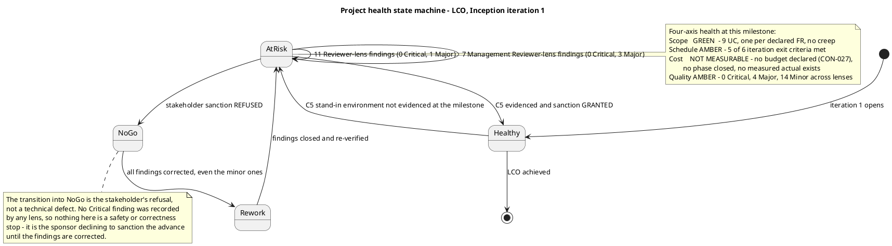

**Risk retirement.** No prior review exists, so no trend line is computed and none is asserted. What the register shows is that **no risk was retired by a treatment this iteration**: `R008` is retired as not applicable (its mechanism names no actor in this project), and `R001`..`R007` and `R009` all remain Open. `R004` — the risk the register itself identifies as gating every test — is the one whose treatment this iteration was scoped to execute, and that treatment is unverified at the milestone. That unverified treatment is exit criterion 5.

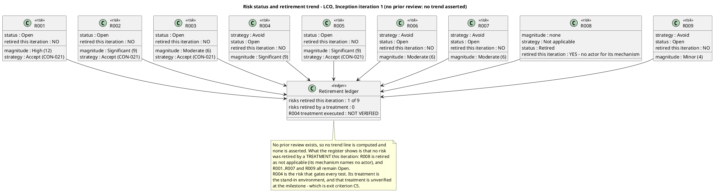

**Review workflow and sign-off.**

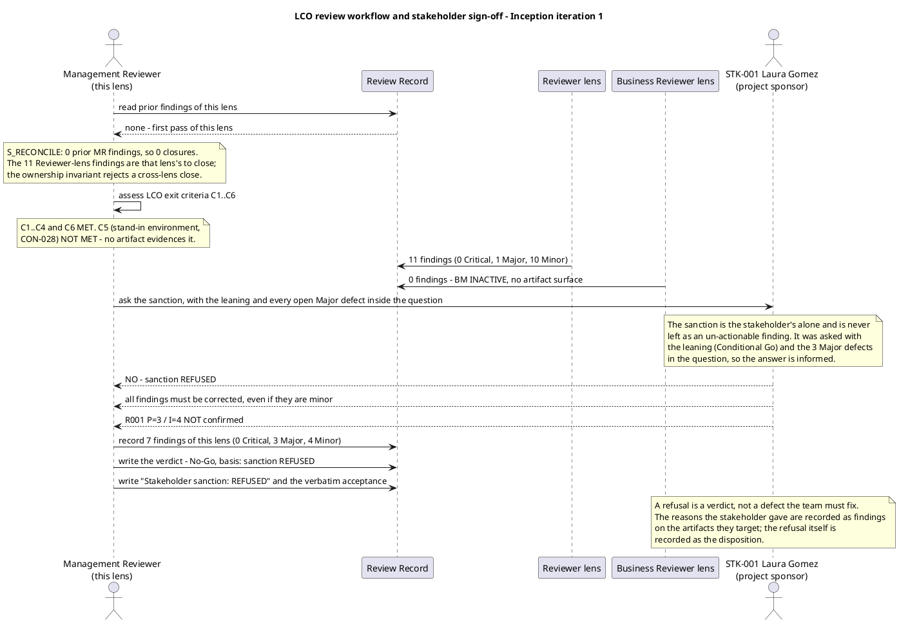

**What this lens does not decide.** The iteration's closure and the re-planning that follows the refusal belong to the ReviewCoordinator. This block states the Management Reviewer lens's gate verdict and the evidence for it. The generic Reviewer lens's disposition (Approved with Changes, 11 findings, 0 Critical) and the Business Reviewer lens's verdict (`BR-OK-INACTIVE`) are separate blocks in this same Review Record.

**Escalation.** No Critical finding was recorded by this lens, so nothing escalates on severity grounds. The stakeholder was consulted regardless, because the sanction is theirs alone, and refused it. No `[SCOPE_QUESTION]` is open in this block: the declared scope is complete and unambiguous, and no element was invented.

#### Iteration 2 — disposition

**Stakeholder sanction: REFUSED**

**Stakeholder acceptance:** "No" — the stakeholder does not accept the project scope and objectives and does not sanction advancing past the Lifecycle Objectives milestone. Directive recorded verbatim: "Please fix all findings."

**Overall disposition: No-Go.**

The LCO milestone is **not achieved**. The sanction was asked of the stakeholder — the sole sanctioning authority — at this review, with the leaning (No-Go) and both open Major defects inside the question, and it was refused. A refusal is a verdict, not a defect the team must fix: the reasons the stakeholder gave are recorded as findings on the artifacts they target, and the refusal itself is the disposition. The directive that all findings be fixed governs the whole ledger, including the minor ones.

**LCO exit criteria, assessed against the artifacts and the SCM.**

| # | Exit criterion | Verdict | Basis |
|---|---|---|---|
| 1 | Stakeholders agree on the scope | Met | Vision and Use-Case Model carry the declared scope with no creep: nine use cases, one per declared `FR-001`..`FR-009`, each citing its source requirement. Trace graph: 66 roots, 231 nodes, no `UNKNOWN LABEL`, no `«LEAF»` at Business level. |
| 2 | The project is viable | Met | Stack pinned by `CON-022`/`CON-023`/`CON-024`; the OIDC client is already registered (`CON-003`) so login is testable from day one; the Architectural Proof-of-Concept NOT-FIRED verdict holds — no technical risk requires empirical validation. |
| 3 | Initial risks identified and classified | Met | Risk List carries `R001`..`R009` with probability, impact, magnitude, strategy, owner, mitigation and contingency. `R001`'s probability and impact are now marked `[ASSUMPTION — requires validation]` and the bands are re-anchored on `R002`'s and `R003`'s declared exposures, so the classification no longer rests on an unconfirmed figure. |
| 4 | The process configuration governs the project | Met | Development Case conforms to the IARI baseline: roster unchanged, CORE ownership unchanged, no artifact outside the universe, Business Modeling INACTIVE on the correct trigger, all six OPTIONAL triggers re-audited and none over-triggered. |
| 5 | The stand-in environment is available (`CON-028`) | **Not met** | The Development Case's LCO-gate verification records the stand-in OIDC issuer and stand-in directory as "Not ready — no stand-in configuration in the repository", and the Iteration Plan's layer (b) records criterion 5 as NOT MET. No artifact evidences them. This is the criterion that gates every use case. |
| 6 | The build is verifiable (`CON-026`) | Met | Run `36095051721` on `main` is green. |

**Four-axis health scorecard.**

| Dimension | Rating | Basis |
|---|---|---|
| Scope | **Green** | Nine use cases, one per declared requirement, all traced, no creep, no phantom use case, no silent derivation. |
| Schedule | **Red** | C5 — the criterion that gates every use case — is not met, and the stand-in environment has now failed delivery in two consecutive iterations. No calendar date exists and none is invented; the human gate is bounded at 14 days of queue time and reported apart from agent time. |
| Cost | **Not measurable** | No budget or cap is declared (`CON-027`) and no phase has closed, so no forecast is invented. Iteration 1's measured actuals are now recorded (6,918,081 tokens; 8:35:00.7478289 agent time; 0:00:00 human queue time), which is the input the next forecast needs. |
| Quality | **Amber** | 11 open findings across the three lenses: 0 Critical, 2 Major, 9 Minor. SCM defect identifiers: `Issue #1`, `Issue #2`, `Issue #3`. |

A project green on one dimension, red on one and amber on one is not a green project. The red dimension is the one the phase gate turns on.

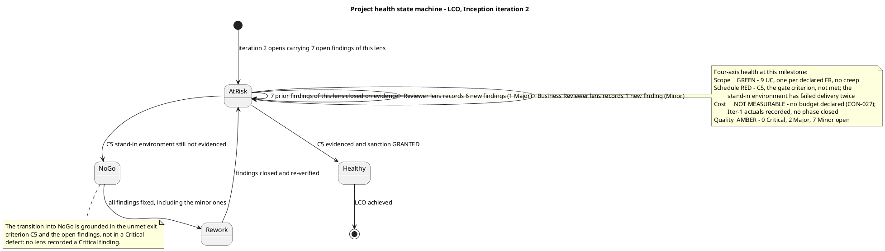

**Risk retirement.** This is the second review event, so a trend is now computable and it is asserted. **No risk has been retired by a treatment across two iterations.** `R008` is retired as not applicable (its mechanism names no actor in this project). `R001`..`R007` and `R009` all remain Open. `R004` — the risk the register itself identifies as gating every test — materialized in iteration 1 and its treatment was again not executed in iteration 2: the Development Case's LCO-gate verification records the stand-in environment as not ready. Its magnitude (Significant) and strategy (Avoid) are unchanged after two failed executions, and the register records no re-assessment. That is `Risk List#F3` (Major), and it is exit criterion C5.

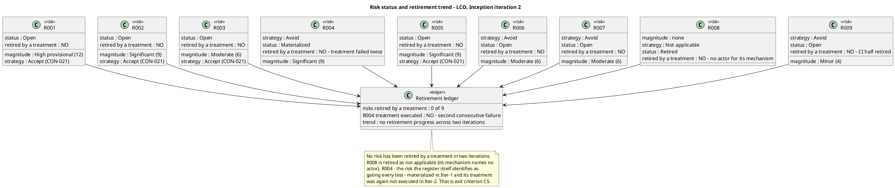

**Review workflow and sign-off.**

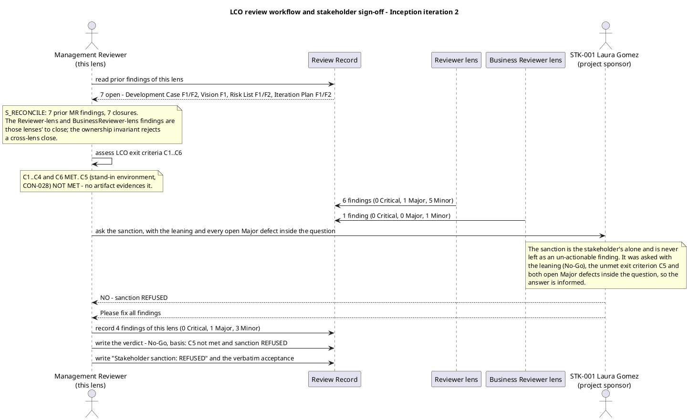

**What this lens does not decide.** The iteration's closure and the re-planning that follows belong to the ReviewCoordinator. This block states the Management Reviewer lens's gate verdict and the evidence for it. The generic Reviewer lens's disposition (Approved with Changes, 6 findings, 0 Critical) and the Business Reviewer lens's verdict (`BR-OK-INACTIVE`, 1 Minor finding) are separate blocks in this same Review Record.

**Escalation.** No Critical finding was recorded by this lens, so nothing escalates on severity grounds. The stakeholder was consulted — the sanction is theirs alone — and refused it; the refusal stands and the directive to fix all findings is recorded. No `[SCOPE_QUESTION]` is open in this block: the declared scope is complete and unambiguous, and no element was invented.

### Review Coordinator — consolidated milestone disposition

**Milestone verdict: No-Go. The LCO milestone is NOT achieved.**

**Basis of the verdict — anchored to the finding records, not to judgment.**

| Condition for advancing the phase | Observed | Verdict |
|---|---|---|
| Unresolved Critical findings | 0 across all three lenses | Satisfied |
| Unresolved Major findings | 2 — `Use-Case Model#F1` (Reviewer), `Risk List#F3` (Management Reviewer) | **Not satisfied** |
| Planned iteration objectives achieved | 5 of 6 iteration exit criteria met; C5 (the stand-in environment, `CON-028`) is not evidenced by any artifact | **Not satisfied** |
| Stakeholder sanction | **REFUSED** — the sponsor declined to accept the scope and objectives and declined to sanction advancing past LCO | **Not satisfied** |

Three of the four conditions fail. The phase gate does not open.

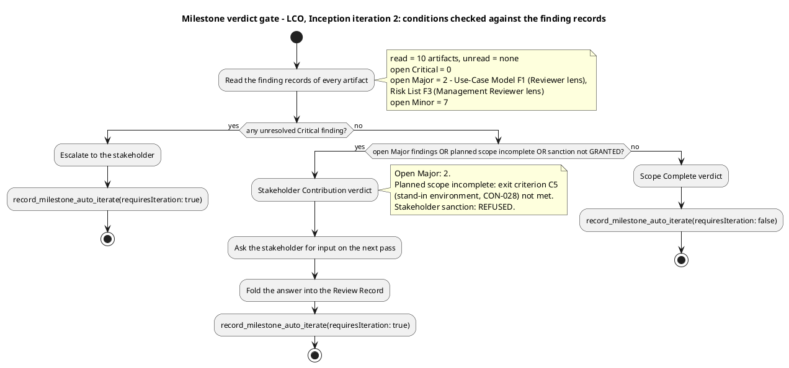

**The refusal is the verdict.** The sanction was asked of the stakeholder — the sole sanctioning authority — with the leaning, the unmet exit criterion C5 and both open Major defects inside the question, so the answer was informed. A refusal is a disposition, not a defect the team must fix: the reasons the stakeholder gave are recorded as findings on the artifacts they target, and the refusal itself is recorded here. The stakeholder's directive — fix all findings — governs the whole 9-finding ledger, not only the lens that asked.

**The one unmet exit criterion.** C5, the stand-in environment (`CON-028`), is the criterion that gates every use case: `CON-028` forbids building or testing against the real Keycloak or the real AD, so with no stand-in no use case can be built or tested and `R004` — the risk the register itself calls the one that gates all testing — remains untreated. C6 (the build is verifiable) is met by the green build on `main`.

**Lens dispositions consolidated.**

| Lens | Disposition | Findings this pass | Effect on the gate |
|---|---|---|---|
| Reviewer (technical) | Approved with Changes | 6 — 0 Critical, 1 Major, 5 Minor | The artifacts are fit to carry the project forward; a technical "Approved with Changes" does not open the phase gate |
| BusinessReviewer (business) | `BR-OK-INACTIVE` — discipline NOT APPLICABLE per DC §4 | 1 — 0 Critical, 0 Major, 1 Minor | Contributes no exit criterion of its own, so it neither blocks nor advances the milestone |
| ManagementReviewer (gate) | No-Go — stakeholder sanction REFUSED | 2 — 0 Critical, 1 Major, 1 Minor | The gate verdict |

**Review effectiveness report.** Two review events have now occurred, so a trend is computable and is asserted. No earlier iteration or cycle is invented to populate it.

| Indicator | Iteration 1 | Iteration 2 | Reading |
|---|---|---|---|
| Review coverage | 100% — 8 of 8 planned artifacts | 100% — 8 of 8 planned artifacts | Flat at complete. No planned artifact has gone unreviewed |
| Findings recorded | 18 — 0 Critical, 4 Major, 14 Minor | 9 — 0 Critical, 2 Major, 7 Minor | Falling on both severities. The Major count halved |
| Prior findings closed | 0 — first review event | 18 of 18 | The whole iteration-1 ledger is closed on evidence read from the corrected artifacts |
| Open ledger at close | 18 | 9 | Halved. The ledger is converging, not accumulating |
| Defect density | 2.25 findings per artifact (18 / 8) | 1.13 findings per artifact (9 / 8) | Falling. Page counts and KLOC are not measured by this system, so density per page or per KLOC is not computable and is not stated |
| Artifacts carrying no open finding | 1 of 8 — the Use-Case Model | 2 of 8 — the Iteration Plan and the Software Architecture Document | Rising. Both artifacts that converged this pass were corrected against observable state |
| Defect removal efficiency | Not computable | Not computable | DRE compares defects found in review against defects found in test. No use case is implemented and no test has executed, so the test half of the ratio does not exist. Reporting a figure here would be fabrication |
| Rework effort | Not measurable in this system's units | Not measurable in this system's units | Hours are not a unit this system produces. The corrective obligation is the open findings, each with an owner and a deadline; the measured currencies are tokens and elapsed time |
| Review debt | 0% — 0 of 18 overdue | 0% — 0 of 9 overdue | No deadline has passed. No escalation notice is due |
| Escalations | 0 | 0 | No Critical finding exists in either event |

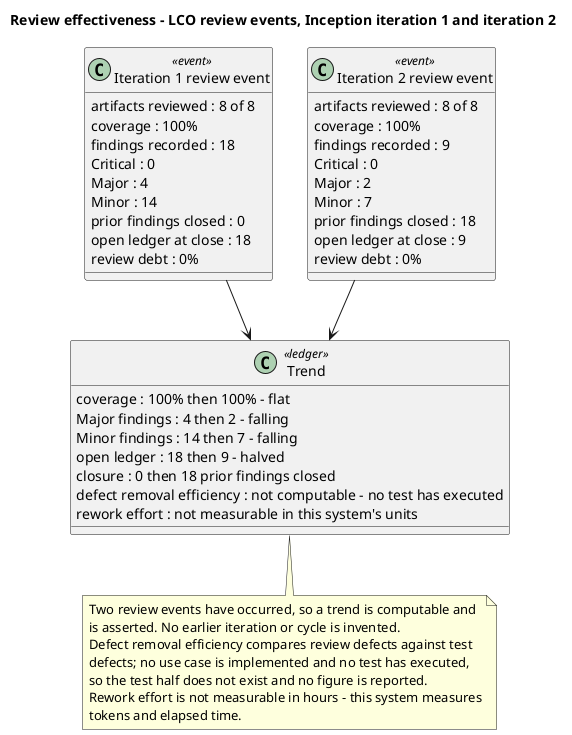

**Interpretation.** Coverage is complete and the process is working: the review closed the entire iteration-1 ledger and halved the open one, and the finding count fell on both severities. The distribution is the signal to read. The two Major findings sit on the two artifacts that carry *evidence and treatment* rather than *content* — the Risk List's treatment of `R004` and the Use-Case Model's unreviewed risk edges. The content artifacts are clean or near-clean. The defect pattern is therefore not a requirements-quality problem; it is an evidence-currency and treatment-execution problem. The one thing the review process cannot fix by refreshing a record is C5: the stand-in environment is a delivery, and it has now failed twice. That is why the gate stays shut.

**Review workflow and sign-off.**

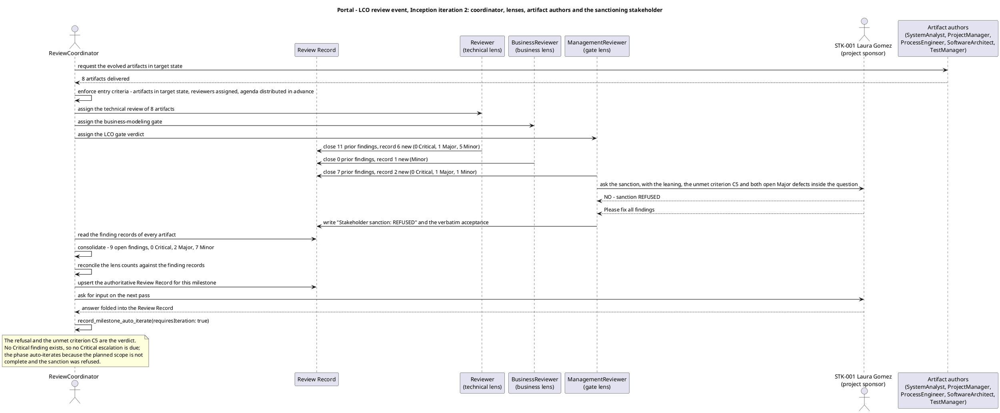

**What this disposition does not do.** It does not cut or defer declared scope. `CON-027` forbids it, and the remedy for an incomplete iteration is another iteration. It does not close any finding: closure belongs to the lens that emitted it, and all 18 closures due this pass were materialised by the originating lens. It does not mark the milestone, the iteration or the phase as completed.

**Next action.** The phase auto-iterates. Each lens reconciles its own findings in its closure state before recording new defects; the producing roles execute the Priority 1 actions first. The LCO gate is re-asked once the stand-in environment is delivered and evidenced, the two Major findings are corrected and the stakeholder is willing to sanction the advance.

### Review Coordinator — stakeholder input on the next iteration

**Stakeholder finding (STK-001, project sponsor).** Asked at this review whether there was anything the team must know — a decision, a correction, a priority — the sponsor answered: *"Please fix all findings."*

**What this decides.** No new requirement, no correction and no re-prioritisation is added. The 9-finding ledger stands as consolidated, and the directive that all findings be fixed — including the minor ones — governs the whole set. The remedy for the incomplete iteration is another iteration, which is what the sponsor directs and what `CON-027` requires: declared scope is never cut or deferred to fit an estimate.

**Verified against the artifacts, not deferred blindly.** The answer adds no element to the declared scope, so nothing in the Vision, the Use-Case Model or the Supplementary Specification changes as a result of it. It confirms the disposition already recorded: the phase auto-iterates, each lens reconciles its own findings in its closure state, and the producing roles execute the Priority 1 actions first. No marker remains open — the question was asked in this review and answered, and the answer is written here in the sponsor's own words.

**Effect on the milestone verdict.** None. The verdict remains **No-Go**: the sanction to advance past LCO was refused, two Major findings are open, and exit criterion C5 (the stand-in environment, `CON-028`) is not evidenced. The sponsor's answer directs the next iteration; it does not open the phase gate.

## Traceability
| Element | Traces From | Link Type | Traces To |
|---|---|---|---|
| Review Record | Development Case, Vision, Use-Case Model, Supplementary Specification, Risk List, Iteration Plan, Software Architecture Document, Test Evaluation Summary | Refines | LCO |
| Reviewer lens — compliance matrix | Development Case, Vision, Use-Case Model, Supplementary Specification, Risk List, Iteration Plan, Software Architecture Document, Test Evaluation Summary | Refines | LCO |
| Reviewer lens — findings | Development Case#F1, Development Case#F2, Vision#F1, Vision#F2, Supplementary Specification#F1, Risk List#F1, Iteration Plan#F1, Iteration Plan#F2, Software Architecture Document#F1, Software Architecture Document#F2, Test Evaluation Summary#F1 | Refines | LCO |
| Reviewer lens — SCM evidence | Issue #1, run 36050339100 | Refines | LCO |
| Reviewer lens — disposition | AC-001, AC-002, AC-003, AC-004, AC-005, AC-006, CON-028, CON-026 | Refines | LCO |

### Reviewer lens

**Iteration 1 — LCO technical review.**

| Element | Traces From | Link Type | Traces To |
|---|---|---|---|
| Review Record | Development Case, Vision, Use-Case Model, Supplementary Specification, Risk List, Iteration Plan, Software Architecture Document, Test Evaluation Summary | Refines | LCO |
| Reviewer lens — compliance matrix | Development Case, Vision, Use-Case Model, Supplementary Specification, Risk List, Iteration Plan, Software Architecture Document, Test Evaluation Summary | Refines | LCO |
| Reviewer lens — findings | Development Case#F1, Development Case#F2, Vision#F1, Vision#F2, Supplementary Specification#F1, Risk List#F1, Iteration Plan#F1, Iteration Plan#F2, Software Architecture Document#F1, Software Architecture Document#F2, Test Evaluation Summary#F1 | Refines | LCO |
| Reviewer lens — SCM evidence | Issue #1, run 36050339100 | Refines | LCO |
| Reviewer lens — disposition | AC-001, AC-002, AC-003, AC-004, AC-005, AC-006, CON-028, CON-026 | Refines | LCO |

**Iteration 2 — LCO technical review.**

| Element | Traces From | Link Type | Traces To |
|---|---|---|---|
| Review Record | Development Case, Vision, Use-Case Model, Supplementary Specification, Risk List, Iteration Plan, Software Architecture Document, Test Evaluation Summary | Refines | LCO |
| Reviewer lens — closure ledger | Development Case#F1, Development Case#F2, Vision#F1, Vision#F2, Supplementary Specification#F1, Risk List#F1, Iteration Plan#F1, Iteration Plan#F2, Software Architecture Document#F1, Software Architecture Document#F2, Test Evaluation Summary#F1 | Refines | LCO |
| Reviewer lens — compliance matrix | Development Case, Vision, Use-Case Model, Supplementary Specification, Risk List, Iteration Plan, Software Architecture Document, Test Evaluation Summary | Refines | LCO |
| Reviewer lens — findings | Use-Case Model#F1, Use-Case Model#F2, Vision#F3, Supplementary Specification#F2, Development Case#F3, Test Evaluation Summary#F2 | Refines | LCO |
| Reviewer lens — traceability compliance | R001, R004, R009, UC-001, UC-008 | Refines | LCO |
| Reviewer lens — SCM evidence | Issue #1, Issue #2, Issue #3, run 36095051721 | Refines | LCO |
| Reviewer lens — disposition | AC-001, AC-002, AC-003, AC-004, AC-005, AC-006, CON-026, CON-028 | Refines | LCO |

**Trace endpoints.** `FR-001`..`FR-009`, `NFR-001`..`NFR-005`, `AC-001`..`AC-006`, `CON-001`..`CON-032`, `BG-001`..`BG-003`, `STK-001`..`STK-004` and `R001`..`R009` are declared identifiers, copied exactly from the work order. `UC-001`..`UC-009` are the System Analyst's use-case identifiers; `COMP-001`..`COMP-010` are the Software Architect's component identifiers. `Issue #1`, `Issue #2`, `Issue #3` and `run 36095051721` are observed SCM facts, cited as returned by the `scm_*` tools. `LCO` is the milestone this review serves. The findings of this lens are cited by their `<artifact>#<key>` handles; a finding is not an element and no edge is registered on one.

**No element of this lens is minted.** The Reviewer produces no `UC-NNN`, `CLS-NNN`, `COMP-NNN`, `TC-NNN` or `INT-NNN`; those families belong to other authorities. The compliance matrix, the defect distribution, the annotated review map, the closure ledger and the disposition are sections of this Review Record, not trace-graph elements, so no edge is registered on them — naming a document section in a Traces To column registers nothing, which is the defect recorded as `Vision#F1` and `Supplementary Specification#F1` in iteration 1.

**Lens blocks preserved.** The Business Reviewer and Management Reviewer blocks in this section are those lenses' own output and are preserved as written. This block adds the Reviewer lens's rows and does not rewrite theirs.

### Business Reviewer lens

**Iteration 1 — LCO business review.**

| Element | Traces From | Link Type | Traces To |
|---|---|---|---|
| Business Reviewer lens — scenario assessment | DC §4 classification (`business-process-led = false`) | Refines | LCO |
| Business Reviewer lens — DC §4 re-verification | DC §4 classification, Vision, Use-Case Model, Supplementary Specification | Refines | LCO |
| Business Reviewer lens — BM artifact inventory | Use-Case Model, Supplementary Specification | Refines | LCO |
| Business Reviewer lens — compliance matrix | Vision, Use-Case Model, Supplementary Specification | Refines | LCO |
| Business Reviewer lens — stakeholder coverage check | STK-001, STK-002, STK-003, STK-004 | Refines | LCO |
| Business Reviewer lens — business-rule audit | CON-009, CON-010, CON-011, CON-012, CON-013, CON-014, CON-015, CON-016, CON-017, CON-018, CON-019 | Refines | LCO |
| Business Reviewer lens — business-goal measurability check | BG-001, BG-002, BG-003 | Refines | LCO |
| Business Reviewer lens — derivation-readiness assessment | FR-001, FR-002, FR-003, FR-004, FR-005, FR-006, FR-007, FR-008, FR-009 | Refines | LCO |
| Business Reviewer lens — disposition | CON-028 | Refines | LCO |

**Iteration 2 — LCO business review.**

| Element | Traces From | Link Type | Traces To |
|---|---|---|---|
| Business Reviewer lens — scenario assessment | DC §4 classification (`business-process-led = false`) | Refines | LCO |
| Business Reviewer lens — DC §4 re-verification | DC §4 classification, Vision, Use-Case Model, Supplementary Specification | Refines | LCO |
| Business Reviewer lens — BM artifact coverage map | Use-Case Model, Supplementary Specification | Refines | LCO |
| Business Reviewer lens — business-rule audit | CON-009, CON-010, CON-011, CON-012, CON-013, CON-014, CON-015, CON-016, CON-017, CON-018, CON-019 | Refines | LCO |
| Business Reviewer lens — stakeholder coverage check | STK-001, STK-002, STK-003, STK-004 | Refines | LCO |
| Business Reviewer lens — business-goal measurability check | BG-001, BG-002, BG-003 | Refines | LCO |
| Business Reviewer lens — derivation-readiness assessment | FR-001, FR-002, FR-003, FR-004, FR-005, FR-006, FR-007, FR-008, FR-009 | Refines | LCO |
| Business Reviewer lens — traceability compliance | UC-001, UC-008, R001, R004, R009 | Refines | LCO |
| Business Reviewer lens — disposition | CON-028 | Refines | LCO |

**Trace endpoints.** `STK-001`..`STK-004`, `FR-001`..`FR-009`, `CON-009`..`CON-019`, `CON-028`, `BG-001`..`BG-003`, `AC-001`..`AC-006` and `R001`..`R009` are declared identifiers, copied exactly from the work order. `UC-001` and `UC-008` are the System Analyst's use-case identifiers. `LCO` is the milestone this review serves. No `BUC-NNN`, `BR-NNN` or `OBJ-NNN` appears: those are the Business Process Analyst's element families, and no element of any of them exists on this project — which is the substance of the `BR-OK-INACTIVE` verdict, not an omission.

**Findings of this lens.** One: `Use-Case Model#F1` (Minor) — `CON-013`'s declared directory filter by worker category has no realizing flow in `UC-008`. The finding is cited by its `<artifact>#<key>` handle; a finding is not an element and no edge is registered on one. The other findings named in the Findings block — `Use-Case Model#F1` and `Use-Case Model#F2` of the Reviewer lens, `Vision#F3`, `Supplementary Specification#F2`, `Vision#F1` of the Management Reviewer lens — are those lenses', cited there for the record of what this lens deliberately did not touch.

**No element of this lens is minted.** The Business Reviewer produces no `UC-NNN`, `CLS-NNN`, `COMP-NNN`, `TC-NNN` or `INT-NNN`; those families belong to other authorities. The coverage map, the DC §4 gate diagram, the business-rule audit, the defect distribution, the derivation-gate diagram, the stakeholder coverage diagram and the disposition are sections of this Review Record, not trace-graph elements, so no edge is registered on them — naming a document section in a Traces To column registers nothing, which is the defect recorded as `Vision#F1` and `Supplementary Specification#F1` in iteration 1.

**Observed SCM facts.** None cited by this lens. The Business Modeling discipline produces no code, no build and no pull request, so no `scm_*` observation bears on this verdict. The SCM evidence in the Reviewer lens's block is that lens's instrument.

**Lens blocks preserved.** The Reviewer and Management Reviewer blocks in this section are those lenses' own output and are preserved as written. This block adds the Business Reviewer lens's rows and does not rewrite theirs.

### Management Reviewer lens

#### Iteration 1 — LCO management review

| Element | Traces From | Link Type | Traces To |
|---|---|---|---|
| `Iteration Plan#F1` | CON-028 | Refines | R004 |
| `Iteration Plan#F2` | CON-027 | Refines | R007 |
| `Development Case#F1` | CON-028 | Refines | R004 |
| `Development Case#F2` | CON-028 | Refines | R004 |
| `Risk List#F1` | R001 | Refines | R001 |
| `Risk List#F2` | R004 | Refines | R004 |
| `Vision#F1` | BG-003 | Refines | AC-005 |
| `Issue #1` | CON-026 | DependsOn | R009 |
| `run 36050339100` | CON-026 | DependsOn | R009 |

**Trace endpoints.** `FR-001`..`FR-009`, `AC-001`..`AC-006`, `CON-026`, `CON-027`, `CON-028`, `BG-003`, `R001`..`R009` and `STK-001` are declared identifiers, copied exactly from the work order. `Issue #1` and `run 36050339100` are observed SCM facts, cited as returned by the `scm_*` tools. The findings of this lens are cited by their `<artifact>#<key>` handles; a finding is not an element and no edge is registered on one.

**No element of this lens is minted.** The Management Reviewer produces no `UC-NNN`, `CLS-NNN`, `COMP-NNN`, `TC-NNN` or `INT-NNN`; those families belong to other authorities. The verdict, the four-axis health scorecard and the risk-retirement ledger are sections of this Review Record, not trace-graph elements, so no edge is registered on them — naming a document section in a Traces To column registers nothing, which is the defect recorded as `Vision#F1`.

**Stakeholder decision recorded.** `STK-001` declined to sanction the advance past LCO and declined to confirm `R001`'s probability and impact. The refusal is the disposition of this lens; the `R001` answer is recorded as `Risk List#F1`. No marker remains open: the question was asked in this review and answered, and the answer is written here in the stakeholder's own words.

#### Iteration 2 — LCO management review

| Element | Traces From | Link Type | Traces To |
|---|---|---|---|
| `Risk List#F3` | R004 | Refines | CON-028 |
| `Risk List#F4` | R009 | Refines | CON-026 |
| `Development Case#F3` | CON-026 | Refines | Issue #1, Issue #2, Issue #3 |
| `Test Evaluation Summary#F2` | CON-026 | Refines | Issue #1, Issue #2, Issue #3 |
| `Issue #1`, `Issue #2`, `Issue #3` | CON-026 | DependsOn | R009 |
| `run 36095051721` | CON-026 | DependsOn | R009 |

**Trace endpoints.** `FR-001`..`FR-009`, `NFR-001`..`NFR-005`, `AC-001`..`AC-006`, `CON-001`..`CON-032`, `BG-001`..`BG-003`, `STK-001`..`STK-004` and `R001`..`R009` are declared identifiers, copied exactly from the work order. `UC-001`..`UC-009` are the System Analyst's use-case identifiers; `COMP-001`..`COMP-010` are the Software Architect's component identifiers. `Issue #1`, `Issue #2`, `Issue #3` and `run 36095051721` are observed SCM facts, cited as returned by the `scm_*` tools. The findings of this lens are cited by their `<artifact>#<key>` handles; a finding is not an element and no edge is registered on one.

**No element of this lens is minted.** The Management Reviewer produces no `UC-NNN`, `CLS-NNN`, `COMP-NNN`, `TC-NNN` or `INT-NNN`; those families belong to other authorities. The verdict, the four-axis health scorecard, the risk-retirement ledger and the closure ledger are sections of this Review Record, not trace-graph elements, so no edge is registered on them — naming a document section in a Traces To column registers nothing, which is the defect recorded as `Vision#F1` and `Supplementary Specification#F1` in iteration 1.

**Traceability compliance result (iteration 2).** The trace graph was projected from the Business level and used as the completeness instrument. Result: 66 roots, 231 nodes, **no `UNKNOWN LABEL`** — every identifier in the graph belongs to a declared family. No `«LEAF»` at Business level: every declared requirement and acceptance criterion reaches at least one downstream element, so no requirement is unrealized. Five `SUSPECT` edges remain, all risk-to-use-case edges into the Use-Case Model (`R001` → `UC-001`, `R001` → `UC-008`, `R004` → `UC-001`, `R004` → `UC-008`, `R009` → `UC-001`); they are recorded as `Use-Case Model#F1` (Major) by the Reviewer lens, whose checklist owns trace-graph currency. This lens records no separate finding on them: the defect is one, and it is that lens's to close.

**Stakeholder decision recorded.** `STK-001` declined to sanction the advance past the Lifecycle Objectives milestone, answering "No" to the sanction question asked at this review with the leaning (No-Go), the unmet exit criterion C5 and both open Major defects inside the question. The refusal is the disposition of this lens. The stakeholder's directive, recorded verbatim, is "Please fix all findings" — it governs the whole finding ledger, including the minor ones. The stakeholder also declined to confirm `R001`'s probability and impact; that answer is recorded as `Risk List#F1` and is now reflected in the register. No marker remains open: every question asked in this review has been answered, and each answer is written in the stakeholder's own words.

### Review Coordinator — consolidation

**Iteration 2 — LCO milestone review.**

| Element | Traces From | Link Type | Traces To |
|---|---|---|---|
| Review Record | Development Case, Vision, Use-Case Model, Supplementary Specification, Risk List, Iteration Plan, Software Architecture Document, Test Evaluation Summary | Refines | LCO |
| Review process framework | Development Case | Refines | LCO |
| Review calendar — Inception iteration 2 | Iteration Plan | Refines | LCO |
| Lens participation record | Reviewer, BusinessReviewer, ManagementReviewer | Refines | LCO |
| Consolidated finding tracker — open | Use-Case Model#F1, Use-Case Model#F2, Vision#F3, Supplementary Specification#F2, Development Case#F3, Test Evaluation Summary#F2, Risk List#F3, Risk List#F4 | Refines | LCO |
| Consolidated finding tracker — closed | Development Case#F1, Development Case#F2, Vision#F1, Vision#F2, Supplementary Specification#F1, Risk List#F1, Risk List#F2, Iteration Plan#F1, Iteration Plan#F2, Software Architecture Document#F1, Software Architecture Document#F2, Test Evaluation Summary#F1 | Refines | LCO |
| Consolidated action plan | CON-027, CON-028 | DependsOn | R004, R007 |
| Review effectiveness report | CON-026, CON-027 | DependsOn | LCO |
| Milestone disposition — No-Go | CON-028, AC-001, AC-002, AC-003, AC-004, AC-005, AC-006 | Refines | LCO |
| Stakeholder input on the next iteration | STK-001, CON-027 | Refines | LCO |
| Observed SCM evidence | Issue #1, Issue #2, Issue #3, run 36095051721 | DependsOn | R009 |

**Trace endpoints.** `FR-001`..`FR-009`, `NFR-001`..`NFR-005`, `AC-001`..`AC-006`, `CON-001`..`CON-032`, `BG-001`..`BG-003`, `STK-001`..`STK-004` and `R001`..`R009` are declared identifiers, copied exactly from the work order. `UC-001`..`UC-009` are the System Analyst's use-case identifiers; `COMP-001`..`COMP-010` are the Software Architect's component identifiers. `Issue #1`, `Issue #2`, `Issue #3` and `run 36095051721` are observed SCM facts, cited as returned by the `scm_*` tools. `LCO` is the milestone this review serves. The findings of the three lenses are cited by their `<artifact>#<key>` handles; a finding is not an element and no edge is registered on one.

**No element of this role is minted.** The Review Coordinator produces no `UC-NNN`, `CLS-NNN`, `COMP-NNN`, `TC-NNN` or `INT-NNN`; those families belong to other authorities. The review framework, the calendar, the finding tracker, the effectiveness report, the disposition and the stakeholder input are sections of this Review Record, not trace-graph elements, so no edge is registered on them — naming a document section in a Traces To column registers nothing, which is the defect recorded as `Vision#F1` and `Supplementary Specification#F1` in iteration 1.

**Stakeholder decisions recorded.** `STK-001` declined to sanction the advance past the Lifecycle Objectives milestone at this review, answering "No" to the sanction question asked with the leaning, the unmet exit criterion C5 and both open Major defects inside the question. The refusal is the disposition of this review. The stakeholder's directive, recorded verbatim, is "Please fix all findings" — it governs the whole finding ledger, including the minor ones. No marker remains open: every question asked in this review has been answered, and each answer is written in the stakeholder's own words.

**Lens blocks preserved.** The three lens blocks — Reviewer, Business Reviewer, Management Reviewer — are the reviewers' own output and are preserved as written. This consolidation adds the Review Coordinator's blocks and does not rewrite theirs.

