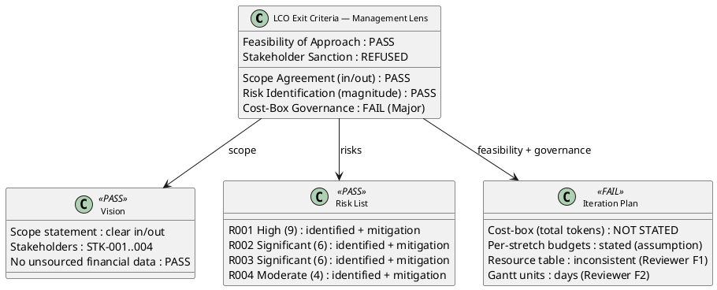
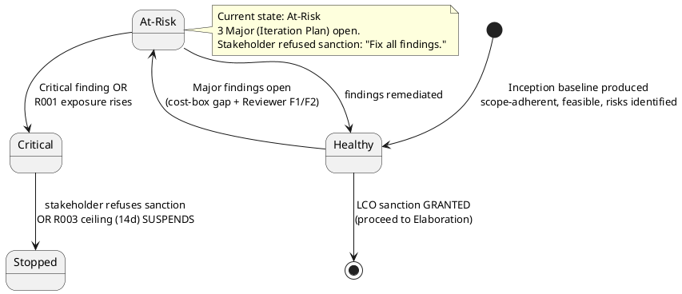
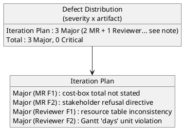

## Document Control

| Field | Value |
|---|---|
| Phase | Inception |
| Status | Draft |
| Milestone Target | End-of-Inception (Lifecycle Objectives) — NOT YET ACHIEVED |
| Review Type | Lifecycle Milestone Review (LCO) — management lens |
| Review Point | Lifecycle Objectives (feasibility + exit criteria + stakeholder sanction) |
| Reviewer | Management Reviewer (management lens) |
| Date | 2026-09-14 |
| Artifacts Reviewed | Vision, Iteration Plan, Risk List, Development Case, Use-Case Model, Supplementary Specification, Software Architecture Document, Test Evaluation Summary |

## Review Scope and Criteria

This review applies the **LCO (Lifecycle Objectives) exit-criteria lens** from the management (project governance) perspective. The four LCO questions are: (1) do stakeholders agree on what is in/out of scope? (2) have key risks been identified with magnitude ratings? (3) is the proposed approach feasible? (4) is the project sanctioned to proceed to Elaboration?

The management lens evaluates project viability, risk retirement posture, cost-box governance, and — critically — obtains the stakeholder's sanction directly (the sanction is the stakeholder's call, not a finding the team manufactures).

## Findings

Two findings were recorded via `record_artifact_finding` from the management lens (2 Major). Combined with the technical lens (Reviewer), the Iteration Plan carries 3 Major findings total — all on the same artifact.

### Finding details (management lens)

| Artifact | Key | Severity | Finding | Recommendation |
|---|---|---|---|---|
| Iteration Plan | F1 | Major | The Iteration Plan states per-stretch token budgets (~8k, ~8k, ~8k, ~6k tokens) but never states the iteration's total cost-box as a single token budget. The Development Case measurement policy governs iterations by cost-boxing — "an iteration ends when exit criteria pass or the token budget is spent (scope bends to the box)" — but without an absolute total box, the "scope bends to the box" rule has no measurable stop condition. | State the iteration's total token budget as an explicit assumption with its basis named (e.g., "~30k tokens, the sum of the per-stretch budgets"). |
| Iteration Plan | F2 | Major | Stakeholder REFUSED the LCO sanction with the directive "Fix all findings." The three open Major findings on this artifact must all be remediated before the stakeholder will sanction advancing past the LCO milestone. | Project Manager remediates all three Major findings (cost-box total; resource table; Gantt units). Re-review at the next LCO gate. |

## Resolutions and Actions

No prior-iteration Management Reviewer findings exist (Iteration 1, Cycle 1) — nothing to reconcile from the management lens. The two findings above are open and carry concrete remediation for the Project Manager.

**Stakeholder sanction: REFUSED.** The stakeholder answered "No" to the LCO sanction question and directed "Fix all findings." This is the recorded acceptance decision — the project does NOT advance past LCO until the three Major findings on the Iteration Plan are remediated and the stakeholder re-sanctions.

## Disposition

**Overall LCO disposition (management lens): No-Go — stakeholder sanction REFUSED.**

- **0 Critical findings** — no scope, feasibility, or viability blocker from the management lens.
- **Scope agreement: PASS** — the Vision's scope statement clearly delineates in/out; all 12 UCs trace 1:1 to FR-001…FR-012; no scope creep detected.
- **Risk identification: PASS** — R001 (High, exposure 9), R002 (Significant, 6), R003 (Significant, 6), R004 (Moderate, 4) all carry magnitude ratings, strategy, mitigation, and contingency.
- **Feasibility: PASS** — the candidate architecture (SAD) honors all 21 constraints; the approach is a layered monolith on a single node, appropriate for 200 users.
- **Cost-box governance: FAIL (Major)** — the iteration's total token budget is not stated, so the cost-box stop condition is unmeasurable.
- **Stakeholder sanction: REFUSED** — the stakeholder directed "Fix all findings" before sanctioning Elaboration.

**Verdict: No-Go.** The project does not advance past the Lifecycle Objectives milestone until the three Major findings on the Iteration Plan are remediated and the stakeholder re-sanctions. This is a governance stop, not a scope or feasibility stop — the baseline is sound; the plan's internal consistency and cost-box governance must be corrected first.

## Traceability

| Element | Traces From | Link Type | Traces To |
|---|---|---|---|
| Iteration Plan#F1 | Iteration Plan (cost-box) | DependsOn | Project Manager (rework) |
| Iteration Plan#F2 | Iteration Plan (stakeholder refusal) | DependsOn | Project Manager (rework) |
| Review Record | Vision, Iteration Plan, Risk List, Development Case, Use-Case Model, Supplementary Specification, Software Architecture Document, Test Evaluation Summary | DependsOn | LCO milestone verdict (ReviewCoordinator) |
