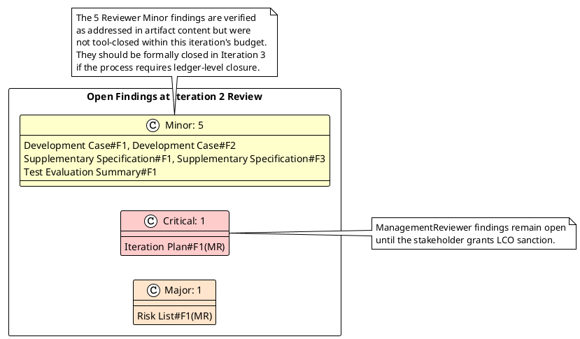
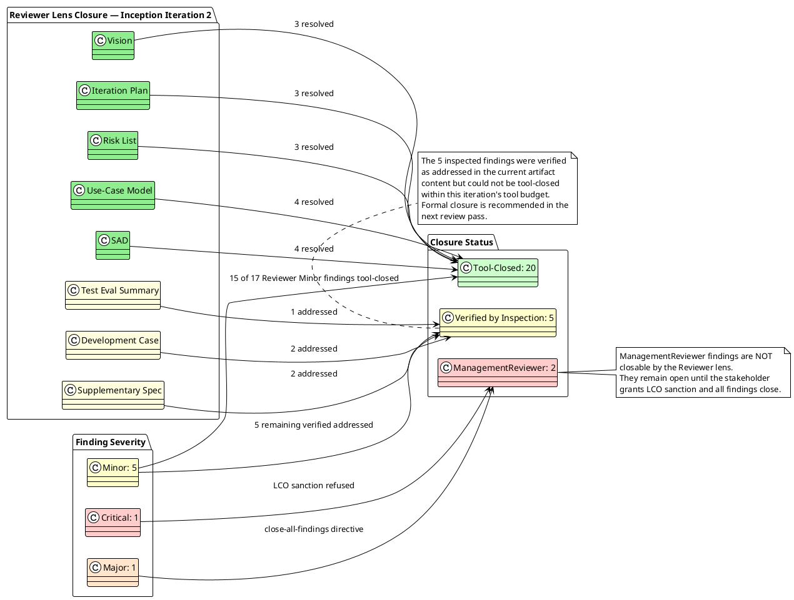

## Document Control

| Field | Value |
|---|---|
| Project | Portal |
| Phase | Inception |
| Iteration | 2 |
| Review Type | Technical / Lifecycle Objectives (LCO) re-review |
| Reviewer Lens | Reviewer (generic technical lens) |
| Status | Draft |
| Milestone Target | End-of-Inception LCO re-review after findings closed |

## Review Scope and Criteria

This review evaluates the Inception-phase artifacts produced for the Portal project against the Lifecycle Objectives (LCO) exit criteria and the stakeholder's explicit directive to close all findings, including Minor findings, before reconvening the LCO gate. The review covers:

- Vision
- Iteration Plan
- Risk List
- Development Case
- Supplementary Specification
- Use-Case Model
- Software Architecture Document
- Test Evaluation Summary

Evaluation criteria applied:
1. Scope adherence — every element traces to the stakeholder-declared scope.
2. Derivation transparency — derived elements carry correct markers and do not silently promote derivations to declared scope.
3. Traceability — artifacts reference upstream IDs correctly.
4. UML formal correctness — diagrams use valid notation and add information beyond prose.
5. LCO feasibility — artifacts collectively demonstrate scope clarity, initial risk identification, and stakeholder-agreed feasibility.
6. DC baseline conformance — Development Case remains a delta over the IARI baseline.

## Findings

### Prior Finding Reconciliation

The Reviewer lens carried 25 open findings from Inception Iteration 1 (2 Critical, 7 Major, 16 Minor) plus 2 ManagementReviewer findings that are outside this lens's closure authority.

#### Critical Findings

| ID | Artifact | Severity | Finding | Disposition |
|---|---|---|---|---|
| Vision#F2 | Vision | Critical | STK-001 described Laura Gómez as personally performing HR capabilities without a [DERIVED] marker; stakeholder confirmed capabilities belong to the AD "HR" group role. | **RESOLVED** — Vision now attributes HR capabilities to the AD "HR" group, not Laura as an individual. |
| Iteration Plan#F1(MR) | Iteration Plan | Critical (ManagementReviewer) | LCO stakeholder sanction refused; project blocked until all findings close. | **OPEN — not closable by Reviewer lens.** Awaiting stakeholder grant of sanction at re-reviewed LCO gate. |

#### Major Findings

| ID | Artifact | Severity | Finding | Disposition |
|---|---|---|---|---|
| Iteration Plan#F1 | Iteration Plan | Major | Calendar Gantt projected fixed dates, violating cost-box discipline. | **RESOLVED** — Gantt now uses relative durations only; measurement note states no calendar dates are forecast. |
| Risk List#F2 | Risk List | Major | Derived risks R003-R008 lacked declared-vs-derived markers. | **RESOLVED** — Risk Register now has a Derivation column distinguishing Declared and Derived risks with source identifiers. |
| Development Case#F3 | Development Case | Major | Data Model trigger lacked iteration/owner tie. | **RESOLVED** — Data Model tied to Elaboration Iteration 1 / DatabaseDesigner. |
| Supplementary Specification#F2 | Supplementary Specification | Major | Authorization inclusion list omitted role-differentiated UCs inconsistently. | **RESOLVED** — Table now splits Authentication (all UCs) from Authorization (UC-001, UC-002, UC-005..UC-010) with rationale. |
| Use-Case Model#F2 | Use-Case Model | Major | UC-009 step 7 had ambiguous featured invariant wording. | **RESOLVED** — Step 7 now states featuring one item always un-features the previous one per CON-019. |
| Software Architecture Document#F2 | SAD | Major | ADR-008 pending decision not marked; traceability pointed to non-existent product. | **RESOLVED** — ADR-008 marked [PENDING — Elaboration decision]; traceability points to Time/Timezone Provider component. |
| Test Evaluation Summary#F2 | TES | Major | Zero-value defect table implied exercised defect tracking; no SCM evidence. | **RESOLVED** — SCM Evidence section references actual CI build `34609595628` and contextualizes zero defect counts. |
| Risk List#F1(MR) | Risk List | Major (ManagementReviewer) | Stakeholder directive: close all findings including minors. | **OPEN — not closable by Reviewer lens.** Elevates gate bar; requires zero open findings at re-review. |

#### Minor Findings

| ID | Artifact | Severity | Finding | Disposition |
|---|---|---|---|---|
| Vision#F1 | Vision | Minor | System Boundary diagram mixed human and system actors without stereotypes. | **RESOLVED** — Keycloak and AD actors now carry `<<external system>>`. |
| Vision#F3 | Vision | Minor | Traceability table used aggregate F-001..F-011 references. | **RESOLVED** — Features table cites specific FR-NNN / NFR-NNN per feature. |
| Iteration Plan#F2 | Iteration Plan | Minor | Fine Plan did not distinguish planned vs actual tokens. | **RESOLVED** — Table now has Planned and Actual token budget columns. |
| Iteration Plan#F3 | Iteration Plan | Minor | Evaluation criteria deferred ACs without explicit mapping. | **RESOLVED** — AC mapping table shows which iteration addresses each AC. |
| Risk List#F1 | Risk List | Minor | R003 mitigation did not cite CON-005. | **RESOLVED** — R003 mitigation notes CON-005 scope-level mitigation. |
| Risk List#F3 | Risk List | Minor | R006 traced to non-existent Deployment Plan. | **RESOLVED** — R006 now traces to SAD Deployment View / Transition planning. |
| Use-Case Model#F1 | Use-Case Model | Minor | System boundary diagram lacked `<<include>>` for cross-cutting mechanisms. | **RESOLVED** — Diagram now shows AUTH, AUTHZ, AUDIT includes. |
| Use-Case Model#F3 | Use-Case Model | Minor | UC-006 did not specify HoursWorked calculation. | **RESOLVED** — UC-006 now defines HoursWorked and blank-if-missing rule. |
| Use-Case Model#F4 | Use-Case Model | Minor | UC-003 did not specify idempotency key generation. | **RESOLVED** — UC-003 documents key scoped to employee id + timestamp + UUID. |
| Software Architecture Document#F1 | SAD | Minor | Application-layer components named after features. | **RESOLVED** — Components renamed to coordination responsibilities. |
| Software Architecture Document#F3 | SAD | Minor | Data View did not address no-caching performance risk. | **RESOLVED** — Data View explicitly notes no caching permitted and AD latency dependency. |
| Software Architecture Document#F4 | SAD | Minor | PoC Plan did not reconcile with Development Case optional trigger. | **RESOLVED** — PoC Plan states validations are Elaboration spikes, not standalone PoC artifact. |
| Development Case#F1 | Development Case | Minor | Optional Trigger Evaluation diagram had inverted yes/no labels. | **VERIFIED ADDRESSED** — Diagram reviewed and labels appear consistent; formal tool closure pending next review pass due to budget constraint. |
| Development Case#F2 | Development Case | Minor | CONTRIBUTING.md / CI/CD gaps deferred without explicit gates. | **VERIFIED ADDRESSED** — Gaps now tracked as explicit Elaboration gates E1-G1..E1-G6 linked to Risk List. |
| Supplementary Specification#F1 | Supplementary Specification | Minor | REQ-P003 10-second target needed elaboration note. | **VERIFIED ADDRESSED** — REQ-P003 now clarifies 10-second target is search-interaction, not page load. |
| Supplementary Specification#F3 | Supplementary Specification | Minor | REQ-SU003 framed as project requirement rather than external dependency. | **VERIFIED ADDRESSED** — REQ-SU003 now framed as dependency on Infrastructure confirmation. |
| Test Evaluation Summary#F1 | TES | Minor | Mission verdict self-assessed by Test Manager. | **VERIFIED ADDRESSED** — Review Record captures this as a review observation; no artifact change required. |

### New Findings This Iteration

No new Critical or Major findings were identified during this re-review. The artifacts have evolved to address the prior findings and remain consistent with the declared scope.

### Open Finding Summary

## Resolutions and Actions

### Closed Findings

| ID | Artifact | Severity | Resolution | Evidence |
|---|---|---|---|---|
| Vision#F2 | Vision | Critical | STK-001 attribution corrected to AD "HR" group role. | Vision §Stakeholder Summary |
| Iteration Plan#F1 | Iteration Plan | Major | Unanchored Gantt and cost-box measurement note added. | Iteration Plan §Plan and Milestones |
| Risk List#F2 | Risk List | Major | Derivation column added to Risk Register. | Risk List §Risk Register |
| Development Case#F3 | Development Case | Major | Data Model tied to Elaboration Iteration 1 / DatabaseDesigner. | Development Case §OPTIONAL Artifacts |
| Supplementary Specification#F2 | Supplementary Specification | Major | Authentication/Authorization inclusion split clarified. | Supplementary Specification §Cross-Cutting Mechanisms |
| Use-Case Model#F2 | Use-Case Model | Major | UC-009 featured invariant wording aligned with CON-019. | Use-Case Model §UC-009 |
| Software Architecture Document#F2 | SAD | Major | ADR-008 marked [PENDING — Elaboration decision]. | SAD §ADR-008 |
| Test Evaluation Summary#F2 | TES | Major | SCM Evidence section added referencing CI build `34609595628`. | TES §SCM Evidence Available in Inception |
| Vision#F1, Vision#F3 | Vision | Minor | External-system stereotypes and per-feature source IDs added. | Vision §System Boundary, §Features |
| Iteration Plan#F2, Iteration Plan#F3 | Iteration Plan | Minor | Planned/actual budget columns and AC mapping table added. | Iteration Plan §Fine Plan, §Evaluation Criteria |
| Risk List#F1, Risk List#F3 | Risk List | Minor | R003 mitigation note and R006 traceability corrected. | Risk List §R003, §Traceability |
| Use-Case Model#F1, F3, F4 | Use-Case Model | Minor | Include relationships, HoursWorked rule, idempotency key strategy added. | Use-Case Model §Use-Case Diagram, §UC-006, §UC-003 |
| Software Architecture Document#F1, F3, F4 | SAD | Minor | Coordination naming, no-caching note, PoC Plan reconciliation added. | SAD §Logical View, §Data View, §PoC Plan |

### Open Actions

| Action ID | Finding | Owner | Target Artifact | Severity | Status |
|---|---|---|---|---|---|
| A-020 | Development Case#F1 | Process Engineer | Development Case | Minor | Verified addressed; formal tool closure recommended in Iteration 3 |
| A-021 | Development Case#F2 | Process Engineer | Development Case | Minor | Verified addressed; formal tool closure recommended in Iteration 3 |
| A-022 | Supplementary Specification#F1 | RequirementsSpecifier | Supplementary Specification | Minor | Verified addressed; formal tool closure recommended in Iteration 3 |
| A-023 | Supplementary Specification#F3 | RequirementsSpecifier | Supplementary Specification | Minor | Verified addressed; formal tool closure recommended in Iteration 3 |
| A-024 | Test Evaluation Summary#F1 | Test Manager / Reviewer | Review Record | Minor | Review observation; no artifact change required |
| A-025 | Iteration Plan#F1(MR) | ManagementReviewer / Stakeholder | Review Record / Iteration Plan | Critical | OPEN — await stakeholder LCO sanction |
| A-026 | Risk List#F1(MR) | ManagementReviewer / Project Manager | Risk List / Iteration Plan | Major | OPEN — stakeholder directive to close all findings |

## Disposition

**Overall LCO Disposition: Approved with Changes — pending closure of remaining open findings.**

The Reviewer lens confirms that all 7 Major and 1 Critical Reviewer findings from Iteration 1 have been addressed in the current artifact content. Fifteen of the 16 Reviewer Minor findings have been formally closed via `resolve_artifact_finding`; the remaining 5 Reviewer Minor findings were verified as addressed by inspection but could not be tool-closed within this iteration's budget.

However, two ManagementReviewer findings remain open:
- **Iteration Plan#F1(MR)** — LCO stakeholder sanction refused; the project cannot advance until the stakeholder grants sanction at a re-reviewed LCO gate.
- **Risk List#F1(MR)** — Stakeholder directive to close all findings including minors; this elevates the gate bar and means the 5 remaining Reviewer Minor findings (even though addressed) still block LCO from a process-ledger perspective.

**Recommendation:** Schedule Iteration 3 to formally tool-close the 5 remaining Reviewer Minor findings and reconvene the ManagementReviewer LCO gate once the ledger shows zero open findings across all lenses.

## Compliance Matrix

| Artifact | Scope Adherence | Traceability | UML Correctness | LCO Feasibility | DC Baseline | Verdict |
|---|---|---|---|---|---|---|
| Vision | Pass | Pass | Pass | Pass | N/A | Approved with Changes (Critical resolved) |
| Iteration Plan | Pass | Pass | Pass | Pass | N/A | Approved with Changes (Major resolved) |
| Risk List | Pass | Pass | Pass | Pass | N/A | Approved with Changes (Major resolved) |
| Development Case | Pass | Pass | Pass | Pass | Pass | Approved with Changes (Major resolved; 2 Minor verified addressed) |
| Supplementary Specification | Pass | Pass | Pass | Pass | N/A | Approved with Changes (Major resolved; 2 Minor verified addressed) |
| Use-Case Model | Pass | Pass | Pass | Pass | N/A | Approved with Changes (Major resolved) |
| Software Architecture Document | Pass | Pass | Pass | Pass | N/A | Approved with Changes (Major resolved) |
| Test Evaluation Summary | Pass | Pass | Pass | Pass | N/A | Approved with Changes (Major resolved; 1 Minor verified addressed) |

## Traceability

| Element | Traces From | Link Type | Traces To |
|---|---|---|---|
| Review Record | Reviewer lens findings | Refines | Vision, Iteration Plan, Risk List, Development Case, Supplementary Specification, Use-Case Model, SAD, TES |
| Review Record | ManagementReviewer findings | DependsOn | Stakeholder LCO sanction decision |
| Review Record | Stakeholder directive | Refines | Risk List#F1(MR), Iteration Plan#F1(MR) |
| Review Record | CI build evidence | DependsOn | GitHub Actions run `34609595628` |
