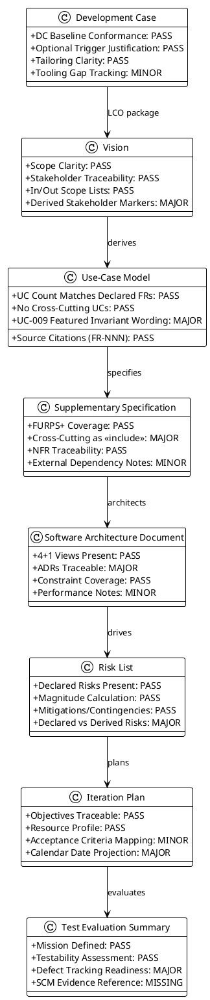
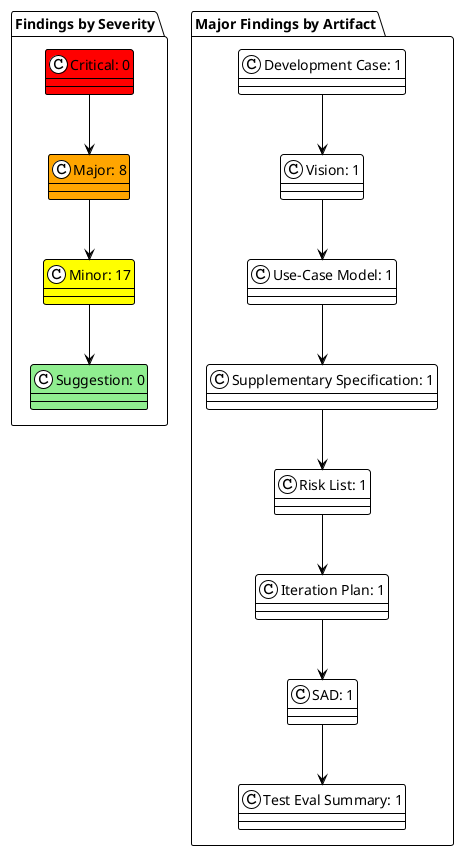

## Document Control

| Field | Value |
|---|---|
| Project | Portal |
| Phase | Inception |
| Iteration | 1 |
| Status | Draft |
| Milestone Target | End-of-Inception review (LCO) |
| Review Type | Technical / LCO feasibility review |
| Reviewer Lens | Reviewer (base) |
| Review Date | 2026-09-11 |

## Review Scope and Criteria

This review evaluates the Inception Iteration 1 artifacts produced for the Portal project against the Lifecycle Objectives (LCO) exit criteria. The review applies a feasibility and acceptability lens: scope clarity, traceability to declared requirements, architectural viability, risk ownership, and readiness for Elaboration.

Artifacts reviewed:

| # | Artifact | Owner | Status |
|---|---|---|---|
| 1 | Development Case | ProcessEngineer | Reviewed |
| 2 | Vision | SystemAnalyst | Reviewed |
| 3 | Use-Case Model | SystemAnalyst | Reviewed |
| 4 | Supplementary Specification | RequirementsSpecifier | Reviewed |
| 5 | Risk List | ProjectManager | Reviewed |
| 6 | Iteration Plan | ProjectManager | Reviewed |
| 7 | Software Architecture Document | SoftwareArchitect | Reviewed |
| 8 | Test Evaluation Summary | TestManager | Reviewed |

Review criteria applied:

- **Development Case:** IARI baseline conformance, optional trigger justification, tailoring clarity.
- **Vision:** Scope clarity, stakeholder traceability, in/out-of-scope lists, derivation transparency.
- **Use-Case Model:** UC count matches declared FRs, no cross-cutting UCs, source citations, invariant correctness.
- **Supplementary Specification:** FURPS+ coverage, cross-cutting mechanisms as `<<include>>`, NFR traceability.
- **Risk List:** Declared risks present, magnitude calculation, mitigations/contingencies, declared vs derived distinction.
- **Iteration Plan:** Objectives traceable, resource profile, acceptance criteria mapping, calendar-date discipline.
- **Software Architecture Document:** 4+1 views, ADR traceability, constraint coverage, performance notes.
- **Test Evaluation Summary:** Mission definition, testability assessment, defect tracking readiness, SCM evidence.

## Findings

### Compliance Matrix

### Defect Distribution

### Per-Artifact Findings

#### Development Case

| ID | Severity | Finding | Recommendation | Verdict |
|---|---|---|---|---|
| F1 | Minor | Optional Trigger Evaluation activity diagram has inverted yes/no labels on the Glossary decision branch. | Correct branch labels or rephrase the decision text. | Approved |
| F2 | Minor | CONTRIBUTING.md / CI workflow gaps are noted but not tracked as risks or gates. | Add to Risk List or as explicit Environment exit criteria. | Approved |
| F3 | Major | Data Model optional artifact is triggered but lacks sanctioned iteration/owner in the DC. | Clarify owner (DatabaseDesigner) and iteration in Optional Triggers; ensure Iteration Plan includes work item. | NeedsRework |

#### Vision

| ID | Severity | Finding | Recommendation | Verdict |
|---|---|---|---|---|
| F1 | Minor | System-boundary diagram does not stereotype external-system actors. | Add `<<system>>` / `<<external system>>` stereotypes to Keycloak and AD. | Approved |
| F2 | Major | STK-001 capabilities are silently restated as stakeholder-given when they are derived from the HR role. | Add [DERIVED] marker/footnote to STK-001 description. | NeedsRework |
| F3 | Minor | Traceability table aggregates UC-001..UC-012 and F-001..F-011 without specific FR/NFR citations. | Expand table to cite specific FR-NNN / NFR-NNN per feature. | Approved |

#### Use-Case Model

| ID | Severity | Finding | Recommendation | Verdict |
|---|---|---|---|---|
| F1 | Minor | System boundary diagram omits `<<include>>` relationships for cross-cutting mechanisms. | Add include arrows to Authentication, Authorization, Audit Logging. | Approved |
| F2 | Major | UC-009 step 7 wording is ambiguous about the featured invariant; reads as conditional rather than unconditional un-feature. | Rewrite step to match CON-019: setting featured always clears any existing featured item. | NeedsRework |
| F3 | Minor | UC-006 does not define HoursWorked calculation rule. | Add [ELABORATION NOTE] for HoursWorked formula. | Approved |
| F4 | Minor | UC-003 does not specify idempotency key generation strategy. | Add [ELABORATION NOTE] for idempotency key strategy. | Approved |

#### Supplementary Specification

| ID | Severity | Finding | Recommendation | Verdict |
|---|---|---|---|---|
| F1 | Minor | REQ-P003 10-second target from AC-003 needs decomposition in Elaboration. | Add [ELABORATION NOTE] decomposing query vs render time. | Approved |
| F2 | Major | Authorization `<<include>>` table is inconsistent: omits employee-only UCs that still need role derivation, and conflates authentication with authorization. | Split into Authentication (all UCs) and Authorization (role-gated UCs) columns. | NeedsRework |
| F3 | Minor | REQ-SU003 should cite Infrastructure confirmation as external dependency. | Add dependency note citing written confirmation + verified restore test. | Approved |

#### Risk List

| ID | Severity | Finding | Recommendation | Verdict |
|---|---|---|---|---|
| F1 | Minor | R003 does not cite CON-005 as a scope-level mitigation. | Add mitigation note citing CON-005 and clarify residual risk is claim mapping. | Approved |
| F2 | Major | Six derived risks (R003-R008) are not distinguished from the two stakeholder-declared risks (R001-R002). | Add Declared vs Derived column and ensure each derived risk links to a constraint/AC. | NeedsRework |
| F3 | Minor | R006 traces to 'Deployment Plan' which does not exist in Inception. | Update trace to Software Architecture Document Deployment View. | Approved |

#### Iteration Plan

| ID | Severity | Finding | Recommendation | Verdict |
|---|---|---|---|---|
| F1 | Major | Gantt chart projects calendar dates from assumed durations, violating cost-boxed iteration discipline. | Replace with cost-boxed roadmap; do not project calendar dates. | NeedsRework |
| F2 | Minor | Fine plan token budgets are not distinguished from actuals. | Add planned vs actual budget columns. | Approved |
| F3 | Minor | Acceptance criteria mapping is implicit; all ACs deferred without iteration mapping. | Add table mapping each AC to the iteration that will verify it. | Approved |

#### Software Architecture Document

| ID | Severity | Finding | Recommendation | Verdict |
|---|---|---|---|---|
| F1 | Minor | Application-layer components are named after features. | Rename to coordination responsibilities or add note that boundaries are candidates. | Approved |
| F2 | Major | ADR-008 product selection is pending but not marked [PENDING] and traceability cites a non-existent product. | Mark ADR-008 [PENDING — Elaboration decision]; trace to component, not product. | NeedsRework |
| F3 | Minor | Data View does not address no-caching performance implication for AD queries. | Add note that no caching is permitted and performance depends on AD latency. | Approved |
| F4 | Minor | PoC Plan does not reconcile with Development Case's non-triggered Architectural Proof-of-Concept. | Clarify that listed validations are Elaboration spikes, not a standalone PoC artifact. | Approved |

#### Test Evaluation Summary

| ID | Severity | Finding | Recommendation | Verdict |
|---|---|---|---|---|
| F1 | Minor | Mission verdict is self-assessed by Test Manager with no independent review noted. | Capture in Review Record; add independent review step in future iterations. | Approved |
| F2 | Major | Defect status table with zeros implies tracking was exercised; no SCM evidence section exists. | Replace zero table with statement that defect tracking begins in Construction; add SCM State section. | NeedsRework |

## Resolutions and Actions

No prior findings of this Reviewer lens existed; all findings above are new for Inception Iteration 1.

Required actions before LCO can be considered achieved:

1. **Development Case#F3:** Clarify Data Model owner and iteration in Optional Triggers.
2. **Vision#F2:** Add [DERIVED] marker to STK-001 description.
3. **Use-Case Model#F2:** Correct UC-009 featured invariant wording.
4. **Supplementary Specification#F2:** Split authentication/authorization include table.
5. **Risk List#F2:** Distinguish declared vs derived risks.
6. **Iteration Plan#F1:** Remove calendar-date Gantt; use cost-boxed roadmap.
7. **Software Architecture Document#F2:** Mark ADR-008 pending and correct traceability.
8. **Test Evaluation Summary#F2:** Remove premature defect status table; add SCM state section.

Minor findings should be addressed in the same rework pass but do not block LCO on their own.

## Disposition

**Overall LCO Disposition: Approved with Changes**

The Inception artifact set is feasible and aligned with the declared scope. No Critical findings were identified. Eight Major findings require rework before the artifacts can be considered LCO-complete. All findings are actionable and localized; none indicate fundamental scope or architectural infeasibility.

The project may proceed to Elaboration once the eight Major findings are resolved and re-reviewed by the Reviewer lens.

## Traceability

| Element | Traces From | Link Type | Traces To |
|---|---|---|---|
| Review Record | Development Case | Reviews | DC#F1, DC#F2, DC#F3 |
| Review Record | Vision | Reviews | Vision#F1, Vision#F2, Vision#F3 |
| Review Record | Use-Case Model | Reviews | UCM#F1, UCM#F2, UCM#F3, UCM#F4 |
| Review Record | Supplementary Specification | Reviews | Supp#F1, Supp#F2, Supp#F3 |
| Review Record | Risk List | Reviews | Risk#F1, Risk#F2, Risk#F3 |
| Review Record | Iteration Plan | Reviews | Plan#F1, Plan#F2, Plan#F3 |
| Review Record | Software Architecture Document | Reviews | SAD#F1, SAD#F2, SAD#F3, SAD#F4 |
| Review Record | Test Evaluation Summary | Reviews | TES#F1, TES#F2 |
| Review Record | FR-001..FR-012 | Refines | UC-001..UC-012 |
| Review Record | NFR-001..NFR-008 | Refines | Supplementary Specification |
| Review Record | R001, R002 | DependsOn | Risk List |
| Review Record | AC-001..AC-005 | Refines | Test Evaluation Summary |
