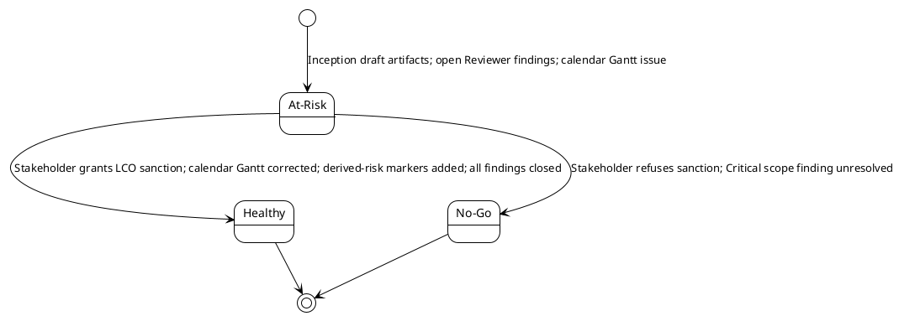
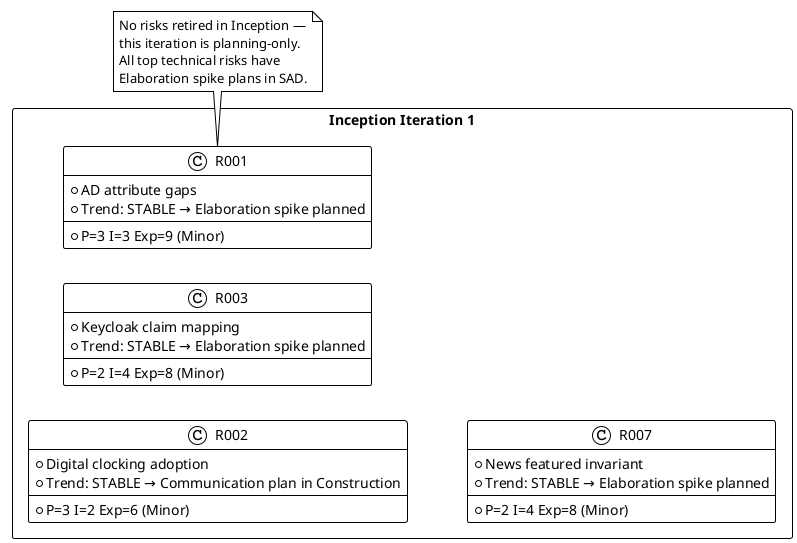
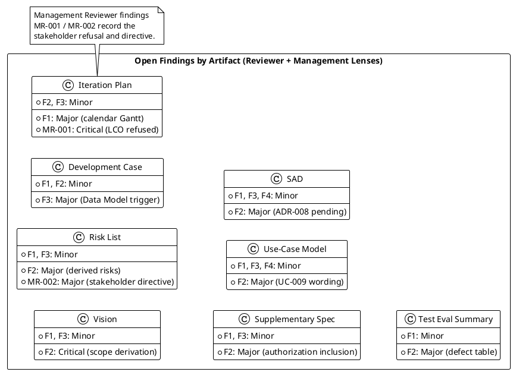

## Document Control

| Field | Value |
|---|---|
| Project | Portal |
| Phase | Inception |
| Iteration | 1 |
| Status | Draft |
| Milestone Target | Lifecycle Objectives (LCO) |
| Review Type | Lifecycle Milestone Review |
| Reviewer | Management Reviewer |
| Date | 2026-09-11 |

## Review Scope and Criteria

This review assesses the Inception Iteration 1 artifacts against the Lifecycle Objectives (LCO) exit criteria:

1. Stakeholders agree on what is in/out of scope.
2. Project is viable: proposed approach is feasible and constraints are respected.
3. Key risks are identified with magnitude ratings, owners, and strategies.
4. Initial planning baseline exists (Iteration Plan + Risk List).
5. Project Approval Review / sanction to proceed to Elaboration is obtained from the stakeholder.

Artifacts reviewed: Vision, Use-Case Model, Supplementary Specification, Software Architecture Document, Iteration Plan, Risk List, Development Case, Test Evaluation Summary.

## LCO Compliance Assessment

```plantuml
@startuml LCO_Compliance_Table
!theme plain
skinparam classAttributeIconSize 0

class "LCO Exit Criterion" as CRIT {
  + ID
  + Criterion
  + Status
  + Evidence
}

class "C-001" as C001 <<scope>> {
  + Stakeholders agree on what is in/out of scope
  + Status: MET
  + Evidence: Vision In Scope / Not In Scope lists match Work Order; Use-Case Model traces FR-001..FR-012 to UC-001..UC-012
}

class "C-002" as C002 <<viability>> {
  + Project is viable: approach feasible, constraints respected
  + Status: MET WITH RISK
  + Evidence: SAD sketches layered .NET 10 / Razor Pages / PostgreSQL architecture; ADR-001..ADR-008 recorded; R001/R003/R005/R007 flagged for Elaboration spikes
}

class "C-003" as C003 <<risks>> {
  + Key risks identified with magnitude, owner, strategy
  + Status: MET WITH GAP
  + Evidence: Risk List has 8 risks with P/I/magnitude; R001/R002 declared; R003-R008 derived without explicit declared-vs-derived marker
}

class "C-004" as C004 <<planning>> {
  + Initial planning baseline exists (Iteration Plan + Risk List)
  + Status: MET WITH GAP
  + Evidence: Iteration Plan has coarse roadmap, fine plan, token budgets; calendar Gantt violates IARI cost-box discipline (Reviewer F1)
}

class "C-005" as C005 <<approval>> {
  + Project Approval Review conducted / sanction to proceed to Elaboration
  + Status: NOT MET
  + Evidence: Stakeholder refused LCO sanction; all findings must be closed before re-review
}

CRIT --> C001
CRIT --> C002
CRIT --> C003
CRIT --> C004
CRIT --> C005
@enduml
```

## Project Health State

## Risk Retirement Trend

## Findings

### Management Reviewer Findings (this review)

| ID | Artifact | Severity | Finding | Recommendation | Verdict |
|---|---|---|---|---|---|
| MR-001 | Iteration Plan | Critical | LCO stakeholder sanction REFUSED. The stakeholder did not accept advancing past the Lifecycle Objectives milestone while open findings remain. The project is blocked at the LCO gate until all findings (including Minor findings per the stakeholder's explicit directive) are closed. | Resolve all open Reviewer findings across Vision, Iteration Plan, Risk List, Development Case, Supplementary Specification, Use-Case Model, Software Architecture Document, and Test Evaluation Summary. Reconvene the LCO review after closure confirmation. | NeedsRework |
| MR-002 | Risk List | Major | Stakeholder directive: "Close all findings even if they are minors." This raises the LCO exit bar — no findings of any severity may remain open at re-review. The project must budget additional rework and re-review queue time. | Add a stakeholder-communication risk or update R008 to reflect the elevated gate bar; ensure the Iteration Plan reserves token budget and queue time for finding closure and re-review before Elaboration starts. | NeedsRework |

### Reviewer Findings Relevant to LCO (not closed by this lens)

The following findings were emitted by the Reviewer lens and remain open. They are cited here as evidence for the No-Go verdict; closure is owned by the Reviewer lens in the reconciliation state.

| Artifact | Severity | Finding Key | Summary |
|---|---|---|---|
| Vision | Critical | F2 | STK-001 description silently promotes derivation to declared scope. |
| Iteration Plan | Major | F1 | Calendar Gantt projects dates from assumed durations, violating IARI cost-box discipline. |
| Risk List | Major | F2 | R003-R008 lack declared-vs-derived marker. |
| Development Case | Major | F3 | Data Model optional trigger lacks iteration/owner tie. |
| Supplementary Specification | Major | F2 | Authorization inclusion table inconsistent. |
| Use-Case Model | Major | F2 | UC-009 featured invariant wording ambiguous. |
| Software Architecture Document | Major | F2 | ADR-008 pending product selection not marked. |
| Test Evaluation Summary | Major | F2 | Zero-value defect table misrepresents Inception state. |

### Defect Distribution

## Resolutions and Actions

| Action | Owner | Target Artifact | Due |
|---|---|---|---|
| Close Vision F2 (STK-001 derivation marker) and F1/F3 | System Analyst / Project Manager | Vision | Before LCO re-review |
| Close Iteration Plan F1 (calendar Gantt) and F2/F3 | Project Manager | Iteration Plan | Before LCO re-review |
| Close Risk List F2 (declared-vs-derived marker) and F1/F3 | Project Manager | Risk List | Before LCO re-review |
| Close Development Case F3 (Data Model trigger iteration/owner) and F1/F2 | Process Engineer | Development Case | Before LCO re-review |
| Close Supplementary Specification F2 (authorization inclusion) and F1/F3 | RequirementsSpecifier | Supplementary Specification | Before LCO re-review |
| Close Use-Case Model F2 (UC-009 wording) and F1/F3/F4 | System Analyst | Use-Case Model | Before LCO re-review |
| Close SAD F2 (ADR-008 pending mark) and F1/F3/F4 | Software Architect | Software Architecture Document | Before LCO re-review |
| Close Test Evaluation Summary F2 (defect table) and F1 | Test Manager | Test Evaluation Summary | Before LCO re-review |
| Reserve token budget and queue time for finding closure and re-review | Project Manager | Iteration Plan / Risk List | Before LCO re-review |
| Reconvene LCO review with stakeholder | ReviewCoordinator | Review Record | After all findings closed |

## Stakeholder Sanction

**Stakeholder sanction: REFUSED**

The stakeholder was asked: "Knowing the open defects, do you accept the project scope and objectives and sanction advancing past the Lifecycle Objectives milestone, subject to the team resolving the Conditional findings before Elaboration begins?"

The stakeholder answered: **No**

Additional stakeholder directive: **"Close all findings even if they are minors."**

This decision is recorded as the stakeholder's own answer. No signature from a named person is required; the stakeholder's response IS the documented acceptance/refusal.

## Disposition

**Verdict: No-Go**

The Lifecycle Objectives (LCO) milestone is **not sanctioned**. The project may not proceed to Elaboration until:

1. All open findings across all reviewed artifacts are closed, including all Minor findings as directed by the stakeholder.
2. The Reviewer lens reconciles and closes its prior findings (F1-F4 / F1-F3 as applicable per artifact).
3. The Management Reviewer confirms closure in a follow-up LCO review.
4. The stakeholder grants explicit sanction to proceed.

The project remains in Inception until the LCO gate is satisfied.

## Traceability

| Element | Traces From | Link Type | Traces To |
|---|---|---|---|
| Review Record | Vision, Use-Case Model, Supplementary Specification, SAD, Iteration Plan, Risk List, Development Case, Test Evaluation Summary | Refines | LCO exit criteria |
| MR-001 | Iteration Plan#F1 (Reviewer) | DependsOn | Stakeholder refusal |
| MR-002 | Stakeholder directive | DependsOn | Risk List, Iteration Plan |
| LCO verdict | C-001..C-005 | Refines | Stakeholder sanction |
