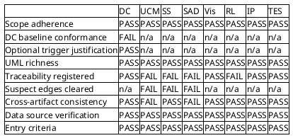
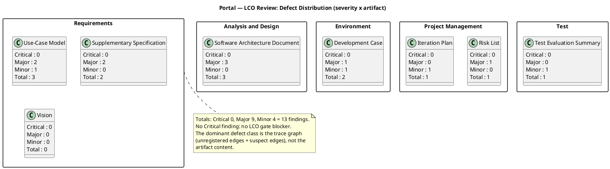
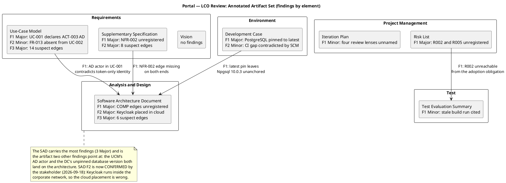

## Document Control

| Field | Value |
|---|---|
| Artifact | Review Record — Portal (Employee Portal, Cuba Corp) |
| Phase | Inception |
| Status | Draft — review executed; milestone NOT YET ACHIEVED |
| Milestone Target | End-of-Inception (LCO) — **not marked complete by this artifact** |
| Iteration / Cycle | 1 / 1 |
| Owner | Reviewer (technical lens) |
| Date | 2026-09-18 |
| Review type | Technical review against the LCO exit criteria — feasibility lens |
| Review point | Lifecycle Milestone (LCO) — exit criteria, not completion |
| Artifacts reviewed | 8 of 8 persisted artifacts |
| Findings this iteration | 13 (Critical 0, Major 9, Minor 4) |
| Prior findings of this lens | 0 — iteration 1, nothing to reconcile |

## Review Scope and Criteria

**What was reviewed.** Every artifact persisted for this project at the time of review — the complete inventory returned by `list_artifacts`, not a sample. The review point is the **Lifecycle Milestone (LCO)**, so the evaluative lens is **exit criteria**: do these artifacts collectively satisfy the conditions for phase transition? It is not a completion lens — Inception's increment is a decision-ready baseline, not an executable, and no artifact was judged for lacking code, test results or a running system.

**Checklist applied.** The artifact-type checklists from the Reviewer base competencies, plus the two Development-Case-specific criteria (DC Baseline Conformance, Optional Trigger Justification) applied to the Development Case, plus the scope-adherence criterion applied to every artifact that creates elements.

**Upstream consumption.** Every artifact was read in full before any finding was recorded. The traceability tree was projected from the model (`get_trace_chain`, rootLevel=Business) and the Requirements Traceability Matrix generated (`model_generate_rtm`) — the registered graph, not the artifacts' prose, is the authority for every traceability finding below. SCM state was read directly (`scm_list_pull_requests`, `scm_get_build_status`, `scm_list_issues`).

**SCM evidence (Construction/Transition discipline applied at LCO).**

| Observation | Value | Source |
|---|---|---|
| Open pull requests | **None** — no PR to dispose | `scm_list_pull_requests(state=open)` |
| Latest CI build on `main` | **success** — run `35324628665`, started 2026-09-18 08:29:27Z, completed 08:30:53Z | `scm_get_build_status` |
| Issues / Change Requests | **None** of any kind | `scm_list_issues(state=all)` |

No open PR required a terminal disposition: the S1B state exited with zero dispositions because the repository holds no open pull request. No productive code, no scope-ahead branch and no defective diff exists to approve, reject or defer. The green build is a signal that the repository builds; it is **not** evidence about any declared acceptance criterion, because no acceptance criterion is exercised by a build.

**Entry criteria verified.** All 8 artifacts present and non-placeholder; upstream artifacts available; checklist prepared. No review was abandoned mid-way.

### Compliance matrix — checklist items × artifact

**Reading the matrix.** `DC baseline conformance` is FAIL on the Development Case for the version-policy pin only — the roster, the CORE catalog, ownership and the optional-trigger table all conform. `Traceability registered` is FAIL on the four artifacts whose declared traceability tables are not matched by registered edges. `Suspect edges cleared` is FAIL on the three artifacts carrying inbound SUSPECT links at phase close. `Scope adherence` PASSes everywhere: no artifact added a functional area the stakeholder did not declare, no cross-cutting mechanism was promoted to a use case, and no per-actor use-case split occurred.

**Scope-adherence verification (the criterion most likely to fail on this project).** The declared scope is a closed set of 14 FRs, 4 NFRs, 24 CONs, 3 UCs, 5 ACs, 3 BGs, 4 STKs and 2 risks. Verified: the Use-Case Model defines **exactly three** use cases, matching the three declared `UC01`/`UC02`/`UC03`; there is no `UC-AUTH`, no `UC-LOG`, no `UC-SYNC`; authentication, the audit trail and the no-connection handling are Supplementary Specification constraints, correctly; each of the three use cases carries two primary actors on the **same** declared process rather than being split per actor. The Vision's "Not in scope" list reproduces every declared exclusion and adds the stakeholder's audit-view answer. No artifact invented a requirement, a screen or a subsystem outside the declared scope. **No scope-creep finding is recorded.**

**Optional-trigger audit (every FIRED row checked against its §5.2 condition).** The Development Case declares exactly one FIRED trigger: Architectural Proof-of-Concept, on R001 (exposure 9). The §5.2 condition is "Elaboration phase + at least one technical risk requiring empirical validation". R001 is a fact about the organization's AD data, not about the architecture, and the portal holds no local copy of the employee (CON-020) so a gap in AD has no fallback — the condition genuinely holds. The five NOT-FIRED verdicts were each checked: Glossary (no specialist vocabulary; the one closed value set is fixed by CON-023), Data Model (fewer than 10 entities, no migration per CON-012), Deployment Model (single node per CON-007, no multi-environment), User-Interface Prototype (the stakeholder already supplied and mandated the design per CON-013), Test Plan (no regulatory or contractual test-reporting obligation). **All six verdicts are justified; no over-triggering finding is recorded.**

## Findings
13 findings recorded via `record_artifact_finding`. Every finding carries severity, location, remediation and a verdict from this lens. No finding is Critical: **no LCO gate blocker was found.**

### Defect distribution — severity × artifact

### Annotated artifact set — where the findings land

### Finding register

| # | Artifact | Key | Sev | Location | Defect | Remediation |
|---|---|---|---|---|---|---|
| 1 | Supplementary Specification | F1 | **Major** | Traceability / Coverage check | NFR-002 has **no registered trace edge** — `model_get_downstream(NFR-002)` returns nothing and the RTM omits it while listing NFR-001/003/004. Only 6 of 24 CON-NNN are registered sources against a Coverage check claiming all 24 placed. | Register NFR-002 → SS-PER-02 and the remaining CON-NNN → their SS-* elements. |
| 2 | Risk List | F1 | **Major** | Traceability | R002 (exposure 6, second-highest) and R005 have no registered edge; the RTM lists R001/R003/R004/R006 only. Artifact-level edges to Iteration Plan / Iteration Assessment also unregistered. | Register R002 → Test Evaluation Summary, R005 → Iteration Plan, and the artifact-level edges. |
| 3 | Software Architecture Document | F1 | **Major** | Traceability | Only 4 COMP→requirement edges registered (R003→COMP-001, R004→COMP-004, R006→COMP-009, FR-014→COMP-003) against a table declaring 11 COMP rows with multiple upstream identifiers each. The decomposition cannot be audited against the declared scope. | Register the COMP→requirement edges the table declares. |
| 4 | Use-Case Model | F1 | **Major** | UC-001 supporting actors + use-case diagram | UC-001 declares ACT-003 Active Directory a supporting actor for "employee identity resolution" and draws UC1 → AD, while the SAD's UC-001 realization resolves identity from the OIDC token with no AD call and states employeeId is the sAMAccountName from the authenticated session. A Designer following the UCM would build an AD lookup the architecture forbids, widening R001 into UC-001. | Remove ACT-003 from UC-001 and the UC1 → AD edge; keep ACT-003 as a supporting actor of UC-003 only. |
| 5 | Use-Case Model | F2 | Minor | UC-002 Source field + traceability row | FR-013 is cited in UC-002's alternative flow A6 but absent from its Source field and trace row; the registered graph carries FR-013 → UC-003 only, so the news-side realization is invisible. | Add FR-013 to UC-002's Source field and traceability row. |
| 6 | Development Case | F1 | **Major** | Version policy (delta D4) | PostgreSQL pinned to `latest` — a moving target, not a version. The build is not reproducible and the SAD's Npgsql 10.0.3 pin is left unanchored to any database version, for a system the Infrastructure team must operate and patch (CON-011). | Propose a concrete major version via Change Request; if the stakeholder reaffirms `latest`, record the reaffirmation and the accepted reproducibility risk explicitly. |
| 7 | Development Case | F2 | Minor | S1 tool inventory + readiness checkpoint | CI workflow recorded as GAP / UNVERIFIED while `scm_get_build_status(main)` reports a successful run (`35324628665`). The recorded gap is contradicted by observable SCM state and would send the Implementer to create a workflow that exists. | Re-verify the checkpoint against the SCM and close the CI gap with the observed run as evidence. |
| 8 | Software Architecture Document | F2 | **Major** | Deployment View | **CONFIRMED BY THE STAKEHOLDER 2026-09-18 — the defect persists in the artifact.** Keycloak is placed in a `cloud` node **outside** the "Corporate Network — intranet only (CON-008)" boundary. The stakeholder has stated that Keycloak runs **inside** the corporate network, is the company's internal identity provider deployed on the internal estate, and is operated by STK-003 alongside Active Directory. No declared input supports an external placement, and CON-007 (internal Windows Server, no cloud) and CON-008 (no access from outside the corporate network) say the opposite. The diagram also misrepresents the login path as crossing the corporate boundary. | Redraw the Deployment View with Keycloak as an **internal node** inside the corporate network boundary, alongside Active Directory, and the portal's OIDC redirect as an **intra-network call**. Remove the `cloud` node. State that login keeps working with no internet link and that nothing about the login path crosses the corporate boundary. Update the node/connector table and environment mapping, and re-trace the affected edges. |
| 9 | Test Evaluation Summary | F1 | Minor | Defects and Incidents / Observed SCM state | Cites run `35323925165` as "the latest CI build on main"; the current latest is `35324628665`. The artifact restates the state of an SCM identifier that has since changed. | Cite the run identifier without the "latest" qualifier, or refresh the observation. |
| 10 | Iteration Plan | F1 | Minor | WI-7 + critical chain | Budgets "Reviewer (4 lenses)" without naming them, while the Development Case declares Business Modeling INACTIVE (BusinessReviewer not engaged) and names three review roles for the Review Record. Either the plan contradicts the DC or the review scope is undefined for the iteration producing the LCO verdict. | Name the four lenses and reconcile the count with the DC's engaged-role set. |
| 11 | Supplementary Specification | F2 | **Major** | Inbound trace edges | 8 edges SUSPECT at phase close: CON-004→SS-DC-04, CON-005→SS-SEC-01, CON-018→SS-BR-05, AC-003→SS-USA-04, FR-012→SS-REL-02, NFR-001→SS-PER-01, NFR-003→SS-REL-01, R001→SS-IF-02. | Re-read each changed element against its upstream and clear with `model_clear_suspect` or evolve and re-trace. |
| 12 | Software Architecture Document | F3 | **Major** | Inbound trace edges | 6 edges SUSPECT at phase close: CON-005, CON-006, CON-018, CON-020, NFR-004 and Supplementary Specification → Software Architecture Document. | Re-read each changed element against its upstream and clear or re-trace. |
| 13 | Use-Case Model | F3 | **Major** | Inbound trace edges | 14 edges SUSPECT at phase close: FR-001..FR-014 → UC-001/UC-002/UC-003. Requirement-to-use-case coverage is unverified at the gate. | Clear or re-trace; resolve finding 4 first, since it changes UC-001's actor set. |

**Findings deliberately NOT recorded.** The Iteration Assessment is absent — correctly. The ProjectManager authors it in the Assess touchpoint that runs *after* this review, so at review time it cannot yet describe the iteration being reviewed. Its absence is not a finding and not a gate condition. Likewise, no finding is recorded for the absence of code, test execution, a Design Model or an Implementation Model: Inception produces none of them, and judging these artifacts against an Elaboration or Construction checklist would be applying the wrong lens.

## Resolutions and Actions

**Prior findings of this lens: none.** `read_artifact_findings` was called for all 8 artifacts; every call returned an empty array. This is iteration 1 and this lens has emitted no prior finding, so `S_RECONCILE_PRIOR_FINDINGS` exited with zero `resolve_artifact_finding` calls and `[PLAN] ... TOTAL: 0`. No closure is claimed and none is owed.

**Actions required before the LCO gate can close.** Ordered by what unblocks the most downstream work:

| Order | Action | Owner | Finding |
|---|---|---|---|
| 1 | Resolve the UC-001 / Active Directory contradiction — it changes an actor set and a diagram, and it is the only finding where two artifacts disagree about a dependency carrying the project's dominant risk | SystemAnalyst | UCM F1 |
| 2 | Register the missing trace edges (NFR-002, R002, R005, the COMP→requirement edges, the remaining CON-NNN) so the registered graph matches every declared traceability table | SystemAnalyst, SoftwareArchitect, ProjectManager | SS F1, RL F1, SAD F1 |
| 3 | Clear or re-trace the 28 SUSPECT edges across the three artifacts | SystemAnalyst, SoftwareArchitect | SS F2, SAD F3, UCM F3 |
| 4 | Resolve the PostgreSQL `latest` pin — via Change Request to the stakeholder, since the pin is theirs | ProcessEngineer → STK-001 | DC F1 |
| 5 | Resolve Keycloak's network placement in the Deployment View | SoftwareArchitect | SAD F2 |
| 6 | Re-verify the Development Case environment checkpoint against the SCM and close the CI gap | ProcessEngineer | DC F2 |
| 7 | Add FR-013 to UC-002's Source field and trace row | SystemAnalyst | UCM F2 |
| 8 | Name the four review lenses and reconcile with the DC's engaged-role set | ProjectManager | IP F1 |
| 9 | Cite the CI run identifier without the "latest" qualifier | TestManager | TES F1 |

**No action is deferred to a later phase.** All nine are correctable within Inception Iteration 1 or at its close; none requires Elaboration work. Findings 1–3 are the ones that must close before the gate, because they are the ones that make the baseline unreadable to the roles that consume it next.

## Disposition
**Overall LCO disposition: APPROVED WITH CHANGES.**

| Dimension | Verdict | Basis |
|---|---|---|
| Scope adherence | **Pass** | Exactly 3 use cases against 3 declared; no cross-cutting mechanism promoted to a UC; no per-actor split; no undeclared functional area; every declared exclusion reproduced |
| LCO exit criteria — Vision clarity | **Pass** | Problem, position, stakeholders, features, assumptions, dependencies and constraints all present and traced |
| LCO exit criteria — initial risk identification | **Pass** | 6 risks classified with P × I = exposure, magnitude, strategy, mitigation, contingency; the High risk is scheduled into the iteration that confronts it |
| LCO exit criteria — use-case survey level | **Pass** | 3 UCs identified; UC-001 and UC-003 detailed, UC-002 surveyed with scenarios; ATM test applied to each |
| LCO exit criteria — stakeholder agreement on scope and feasibility | **Not this lens's to give** | The LCO gate is STK-001's decision. This review supplies the findings it decides on |
| Development Case conformance | **Pass with one exception** | Roster, CORE catalog, ownership, optional triggers and intensity all conform; the `latest` version pin is the exception (DC F1) |
| Traceability integrity | **Fail** | 4 artifacts with unregistered declared edges; 28 SUSPECT edges open at phase close |
| Cross-artifact consistency | **Fail** | One substantive contradiction (UCM F1) and one confirmed deployment-topology defect (SAD F2) |
| SCM state | **Pass** | No open PR, no open issue, green build on `main` |

**Why Approved with Changes and not Rejected.** No Critical finding exists. Every artifact is substantively sound: the scope is faithfully bounded, the risk register is complete and correctly sequenced, the architecture's decomposition is justified by area of change with the reasoning recorded, and the requirements baseline places every declared input. The defects are of two kinds — a trace graph that under-reports what the artifacts declare, and two genuine cross-artifact defects — and both are correctable without reworking the substance of any artifact. Rejecting would discard a sound baseline over bookkeeping, one actor-list correction and one deployment-diagram correction.

**Why not Approved.** The trace graph is the mechanism by which every downstream role finds what it must satisfy. With NFR-002, R002 and R005 unreachable and 28 edges suspect, the baseline is not yet readable by the roles that consume it next — and the UC-001/AD contradiction would propagate a dependency the architecture forbids into the Design Model. Approving now would carry both defects into Elaboration.

**Milestone status.** The end-of-Inception milestone is **NOT YET ACHIEVED** and is not marked complete by this artifact. This review supplies the findings; the LCO verdict is the ReviewCoordinator's, and the gate decision is STK-001's.

**Escalation — ANSWERED this round; the marker is retired.** Finding 8 (SAD F2) was escalated to the stakeholder as an integration-boundary question: the network placement of Keycloak. The stakeholder answered on 2026-09-18, in their own words: *"Keycloak runs inside the corporate network. It is the company's internal identity provider, deployed on the internal estate and reachable by the internal applications — Infrastructure (STK-003) operates it alongside Active Directory, exactly as the stakeholder input says."* The stakeholder further stated that the Software Architecture Document is wrong and must be corrected: its Deployment View places Keycloak in a cloud node outside the corporate network, which no declared input supports and which CON-007 (internal Windows Server, no cloud) and CON-008 (no access from outside the corporate network) contradict. The required correction, in the stakeholder's terms: redraw the deployment diagram with Keycloak as an **internal node**, and the portal's OIDC redirect as an **intra-network call** — nothing about login crosses the corporate boundary, and login keeps working with no internet link. The question is closed; the finding's remediation is now authoritative rather than proposed, and the SoftwareArchitect corrects the artifact against this decision.

**Escalation — one question deliberately NOT re-asked.** Finding 6 (the PostgreSQL `latest` pin) is **not** put back to the stakeholder. The question was asked and answered on 2026-09-17, and re-opening an answered question is forbidden. The answer conflicts with sound engineering practice (a moving target is not a version, and the build is not reproducible), so the conflict is stated explicitly and an alternative is proposed — a concrete PostgreSQL major version — and routed as a **Change Request** through the ChangeControlManager. The pin is recorded and work can proceed; what is missing is reproducibility, not a decision.

## Traceability

| Element | Traces From | Link Type | Traces To |
|---|---|---|---|
| Review Record | Development Case, Vision, Use-Case Model, Supplementary Specification | Derives | Iteration Assessment |
| Review Record | Software Architecture Document, Risk List, Iteration Plan, Test Evaluation Summary | Derives | Iteration Assessment |
| Review Record | AC-001, AC-002, AC-003, AC-004, AC-005 | Derives | Iteration Assessment |
| Review Record | R001, R002, R003, R004, R005, R006 | Derives | Iteration Assessment |
| Use-Case Model#F1 | UC-001, ACT-003 | Derives | Design Model |
| Use-Case Model#F2 | FR-013, UC-002 | Derives | Design Model |
| Use-Case Model#F3 | FR-001, FR-002, FR-003, FR-004, FR-005, FR-006, FR-007, FR-008, FR-009, FR-010, FR-011, FR-012, FR-013, FR-014 | Derives | Design Model |
| Supplementary Specification#F1 | NFR-002, SS-PER-02 | Derives | Design Model |
| Supplementary Specification#F2 | CON-004, CON-005, CON-018, AC-003, FR-012, NFR-001, NFR-003, R001 | Derives | Design Model |
| Software Architecture Document#F1 | COMP-001, COMP-002, COMP-003, COMP-004, COMP-005, COMP-006, COMP-007, COMP-008, COMP-009, COMP-010, COMP-011 | Derives | Design Model |
| Software Architecture Document#F2 | CON-005, CON-007, CON-008 | Derives | Deployment Model |
| Software Architecture Document#F3 | CON-005, CON-006, CON-018, CON-020, NFR-004 | Derives | Design Model |
| Development Case#F1 | CON-004 | Derives | Software Architecture Document |
| Development Case#F2 | CON-011 | Derives | Iteration Plan |
| Risk List#F1 | R002, R005 | Derives | Iteration Plan |
| Iteration Plan#F1 | R005 | Derives | Iteration Assessment |
| Test Evaluation Summary#F1 | AC-004 | Derives | Iteration Assessment |

**Reading the table.** The Review Record itself derives from all eight reviewed artifacts and from the declared acceptance criteria and risks, and it feeds the Iteration Assessment — which the ProjectManager authors after this review, given this verdict. Each finding row traces to the elements the finding concerns, so a downstream role can follow a defect from this record into the artifact and element it names. Finding identifiers are `<artifact>#<key>` as minted by `record_artifact_finding`; no action identifier is minted, because a remediation is the finding's Recommendation and its status is that finding's Resolution.
