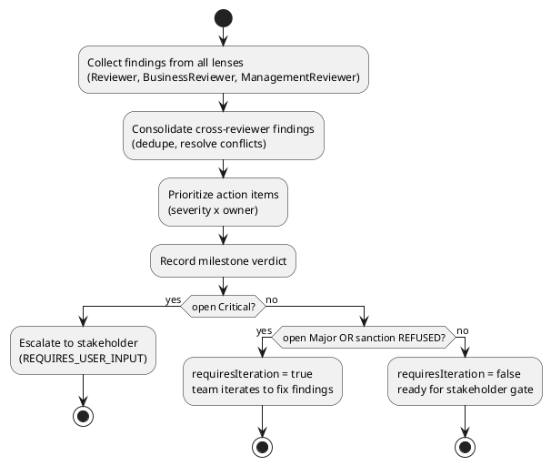
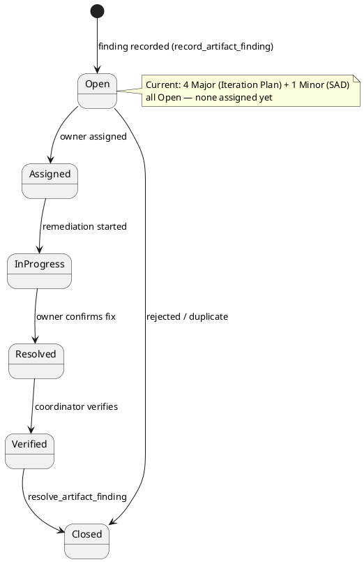
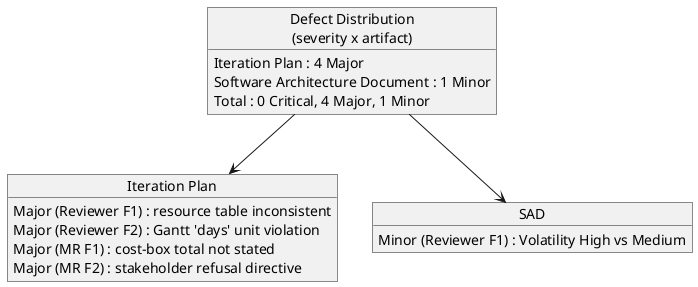

## Document Control

| Field | Value |
|---|---|
| Phase | Inception |
| Status | Final (consolidated) |
| Milestone Target | End-of-Inception (Lifecycle Objectives) — NOT YET ACHIEVED |
| Review Type | Lifecycle Milestone Review (LCO) — consolidated |
| Review Point | Lifecycle Objectives (feasibility + exit criteria + stakeholder sanction) |
| Reviewer | ReviewCoordinator (consolidation of all lenses) |
| Date | 2026-09-14 |
| Artifacts Reviewed | Vision, Iteration Plan, Risk List, Development Case, Use-Case Model, Supplementary Specification, Software Architecture Document, Test Evaluation Summary |

**Lens participation (authoritative):**

| Lens | Role | Status |
|---|---|---|
| Technical | Reviewer | EXECUTED |
| Business | BusinessReviewer | EXECUTED (0 findings) |
| Management | ManagementReviewer | EXECUTED |

## Review Scope and Criteria

This is the **consolidated LCO (Lifecycle Objectives) review** — the single authoritative record that merges the three executed lenses (technical, business, management) into one disposition. The four LCO questions are: (1) do stakeholders agree on what is in/out of scope? (2) have key risks been identified with magnitude ratings? (3) is the proposed approach feasible? (4) is the project sanctioned to proceed to Elaboration?

The consolidation workflow and the finding lifecycle are modeled below.

## Findings

Consolidated findings across all three lenses. **No cross-lens conflicts** — every finding is distinct (no two lenses reported the same defect, and no lens contradicted another). The BusinessReviewer lens executed and reported zero findings.

**Totals: 0 Critical, 4 Major, 1 Minor.**

### Consolidated finding register

| Artifact | Key | Lens | Severity | Finding | Recommendation | Owner | Status |
|---|---|---|---|---|---|---|---|
| Iteration Plan | F1 | Reviewer | Major | Resources table marks Software Architect "Dormant" and omits Test Manager, yet the SAD and Test Evaluation Summary were both produced in Inception Iter-1. Iteration Objective 1 also omits SAD and Test Evaluation Summary from the baseline set. | Update Resources table (SA produced candidate SAD; add Test Manager row); update Objective 1 to include SAD + Test Evaluation Summary. | Project Manager | Open |
| Iteration Plan | F2 | Reviewer | Major | Gantt chart expresses agent work in "days" (duration/effort fusion), contradicting the DC measurement policy (tokens + elapsed time only) and the artifact's own activity diagram. | Replace "days" with token budgets for agent work; keep "days" only for human-gate queue time. | Project Manager | Open |
| Iteration Plan | F1 | Management Reviewer | Major | Per-stretch token budgets stated but no single total cost-box; "scope bends to the box" has no measurable stop condition. | State the iteration's total token budget as an explicit assumption with basis named. | Project Manager | Open |
| Iteration Plan | F2 | Management Reviewer | Major | Stakeholder REFUSED LCO sanction ("Fix all findings"); all three Major findings must be remediated before re-sanction. | Project Manager remediates all three Major findings; re-review at next LCO gate. | Project Manager | Open |
| Software Architecture Document | F1 | Reviewer | Minor | Logical View prose cites "Volatility: High" for UC-001/UC-008, but the Use-Case Model marks them Medium (no High-volatility UC exists). | Correct prose to "Volatility: Medium" or "the two most volatile UCs". | Software Architect | Open |

## Resolutions and Actions

No prior-iteration findings exist (Iteration 1, Cycle 1) — nothing to reconcile from earlier cycles. All five findings above are **open** and carry concrete remediation.

**Action items (prioritized):**

1. **Project Manager** — remediate all four Major findings on the Iteration Plan (cost-box total; resource table; Gantt units; then the refusal directive resolves once the other three are fixed).
2. **Software Architect** — remediate the one Minor finding on the SAD (Volatility wording).

**Stakeholder sanction: REFUSED.** The stakeholder answered "No" to the LCO sanction question and directed "Fix all findings." The project does NOT advance past LCO until the four Major findings on the Iteration Plan are remediated and the stakeholder re-sanctions.

## Disposition

**Overall LCO disposition (consolidated): No-Go — stakeholder sanction REFUSED.**

- **0 Critical findings** — no scope, feasibility, or viability blocker from any lens.
- **Scope agreement: PASS** — Vision scope statement clearly delineates in/out; all 12 UCs trace 1:1 to FR-001…FR-012; no scope creep detected (technical + management lenses agree).
- **Risk identification: PASS** — R001 (High, 9), R002 (Significant, 6), R003 (Significant, 6), R004 (Moderate, 4) all carry magnitude, strategy, mitigation, contingency.
- **Feasibility: PASS** — candidate architecture (SAD) honors all 21 constraints; layered monolith on a single node, appropriate for 200 users.
- **Cost-box governance: FAIL (Major)** — iteration total token budget not stated; stop condition unmeasurable.
- **Plan internal consistency: FAIL (Major)** — resource table and Gantt units contradict the DC measurement policy and the actual artifact set produced.
- **Stakeholder sanction: REFUSED** — "Fix all findings."

**Verdict: No-Go.** The project does not advance past the Lifecycle Objectives milestone until the four Major findings on the Iteration Plan are remediated and the stakeholder re-sanctions. This is a governance/consistency stop, not a scope or feasibility stop — the baseline is sound; the plan's internal consistency and cost-box governance must be corrected first.

## Traceability

| Element | Traces From | Link Type | Traces To |
|---|---|---|---|
| Iteration Plan#F1 (Reviewer) | Iteration Plan (resource table) | DependsOn | Project Manager (rework) |
| Iteration Plan#F2 (Reviewer) | Iteration Plan (Gantt units) | DependsOn | Project Manager (rework) |
| Iteration Plan#F1 (MR) | Iteration Plan (cost-box) | DependsOn | Project Manager (rework) |
| Iteration Plan#F2 (MR) | Iteration Plan (stakeholder refusal) | DependsOn | Project Manager (rework) |
| Software Architecture Document#F1 | SAD (Volatility wording) | DependsOn | Software Architect (rework) |
| Review Record | Vision, Iteration Plan, Risk List, Development Case, Use-Case Model, Supplementary Specification, Software Architecture Document, Test Evaluation Summary | DependsOn | LCO milestone verdict (ReviewCoordinator) |
