## Document Control
### Reviewer lens
- **Phase:** Inception
- **Status:** Draft — under review
- **Milestone Target:** End of Inception (not yet achieved)
- **Iteration:** 1, Cycle 1
- **Owner:** Reviewer
- **Date:** 2026-10-07

#### Iteration 2

- **Phase:** Inception
- **Status:** Draft — under review
- **Milestone Target:** End of Inception (not yet achieved)
- **Iteration:** 2, Cycle 1
- **Owner:** Reviewer
- **Date:** 2026-10-07

#### Iteration 3

- **Phase:** Inception
- **Status:** Draft — under review
- **Milestone Target:** End of Inception (not yet achieved)
- **Iteration:** 3, Cycle 1
- **Owner:** Reviewer
- **Date:** 2026-10-08

### Business Reviewer lens
- **Phase:** Inception
- **Status:** Draft — under review
- **Milestone Target:** End of Inception (not yet achieved)
- **Iteration:** 1, Cycle 1
- **Owner:** BusinessReviewer
- **Date:** 2026-10-07

#### Iteration 2

- **Phase:** Inception
- **Status:** Draft — under review
- **Milestone Target:** End of Inception (not yet achieved)
- **Iteration:** 2, Cycle 1
- **Owner:** BusinessReviewer
- **Date:** 2026-10-07

### Management Reviewer lens
- **Phase:** Inception
- **Status:** Draft — under review
- **Milestone Target:** End of Inception (not yet achieved)
- **Iteration:** 2, Cycle 1
- **Owner:** ManagementReviewer
- **Date:** 2026-10-07

### Review Coordinator lens
- **Phase:** Inception
- **Status:** Draft — under review
- **Milestone Target:** End of Inception (not yet achieved)
- **Iteration:** 2, Cycle 1
- **Owner:** ReviewCoordinator
- **Date:** 2026-10-07

## Review Scope and Criteria
### Reviewer lens
#### Iteration 1

**Review type.** Technical review, checklist-driven, at the Lifecycle Objectives review point. The evaluative lens is FEASIBILITY and LCO EXIT CRITERIA, not completion: Inception 1 produces no executable increment, so no completion lens applies and no acceptance criterion is closable.

**Artifacts in scope.** All eight artifacts persisted this iteration: Development Case, Vision, Use-Case Model, Supplementary Specification, Software Architecture Document, Risk List, Iteration Plan, Test Evaluation Summary.

**Checklists applied.** Per artifact type, and recorded item by item in the compliance matrix below.

| Artifact | Checklist applied |
|---|---|
| Development Case | DC Baseline Conformance (roster, CORE catalog, ownership, artifact universe, intensity) + Optional Trigger Justification against each §5.2 condition + tool-baseline verification against the repository |
| Vision | Requirements quality: complete, consistent, unambiguous, traceable, no unsourced quantitative claim; scope adherence against the declared input |
| Use-Case Model | Use-case quality: one-to-one with declared requirements, `Source: FR-NNN` on every use case, no phantom use case, no cross-cutting mechanism as a use case, no per-actor split, UML formal correctness |
| Supplementary Specification | FURPS+ coverage of every declared NFR, AC and CON; cross-cutting mechanisms specified and not promoted to use cases; threshold quantification |
| Software Architecture Document | Architecture quality: every subsystem traces to a declared element, no layer- or feature-named subsystem, one seam per High-volatility area, external-system placement, invariants as constraints, no invented technology |
| Risk List | Risk quality: declared risks preserved, team risks numbered per CON-023, strategy and owner per risk, acceptance basis named, no human-team unit |
| Iteration Plan | Plan quality: objectives carry exit evidence, no unmeasured unit, human gate bounded as a risk, two currencies never summed, all acceptance criteria accounted for |
| Test Evaluation Summary | Verifiability: every declared requirement has an observable verification method, no execution claimed, SCM signals read and recorded |

**Upstream consumption.** Every artifact was read in full before any finding was recorded. The declared scope in the Work Order was read as the ceiling. The trace graph was projected from the Business level (43 roots, 141 nodes) and read against each artifact's declared traceability. The SCM was read directly: build status on `main`, the issue tracker in all states, the open pull-request list, the branches awaiting review, and the repository tree.

**SCM evidence read this iteration.**

| Signal | Observed |
|---|---|
| Build, branch `main` | `ci-run-37583334371` — success, 2026-10-07 06:45:58Z to 06:47:38Z |
| Open pull requests | None |
| Branches labelled `ready-for-review` | None |
| Issues, all states | None |
| Repository tree | `.github/workflows/ci.yml` (sha `0c2fd7cf47eeab68d19420fe3897d209258bd074`), `Portal.sln` (sha `f554bf5bc04df43103677206c7727fcc62ea2bc4`), `src/Portal.Web/Portal.Web.csproj`, `tests/Portal.Tests/Portal.Tests.csproj`, `README.md`, `docs/inputs/employee-portal-design.html` (sha `715d4f73d6ef4de18c46242258bc17a67f51ba6f`). `CONTRIBUTING.md` and `.editorconfig` absent. |

**Pull-request disposition.** No open pull request exists, so every pull request has reached a terminal disposition vacuously and no disposition call was required. The repository carries scaffolding only — a solution, two empty projects, a CI workflow, a README and the mandatory design reference. No productive code is present, which is consistent with Inception scope. No scope-ahead branch exists.

**Entry criteria.** Met. All eight artifacts are complete and stable, no section is a placeholder, the upstream artifacts each artifact depends on are persisted, and the checklists were prepared before the artifacts were read.

#### Iteration 2

**Review type.** Technical review, checklist-driven, at the Lifecycle Objectives review point. The evaluative lens is FEASIBILITY and LCO EXIT CRITERIA, not completion: Inception 2 produces no executable increment, so no completion lens applies and no acceptance criterion is closable.

**Artifacts in scope.** All eight artifacts persisted this iteration: Development Case, Vision, Use-Case Model, Supplementary Specification, Software Architecture Document, Risk List, Iteration Plan, Test Evaluation Summary.

**Checklists applied.** Per artifact type, and recorded item by item in the compliance matrix below.

| Artifact | Checklist applied |
|---|---|
| Development Case | DC Baseline Conformance (roster, CORE catalog, ownership, artifact universe, intensity) + Optional Trigger Justification against each §5.2 condition + tool-baseline verification against the repository |
| Vision | Requirements quality: complete, consistent, unambiguous, traceable, no unsourced quantitative claim; scope adherence against the declared input |
| Use-Case Model | Use-case quality: one-to-one with declared requirements, `Source: FR-NNN` on every use case, no phantom use case, no cross-cutting mechanism as a use case, no per-actor split, UML formal correctness |
| Supplementary Specification | FURPS+ coverage of every declared NFR, AC and CON; cross-cutting mechanisms specified and not promoted to use cases; threshold quantification; element-level traceability registered |
| Software Architecture Document | Architecture quality: every subsystem traces to a declared element, no layer- or feature-named subsystem, one seam per High-volatility area, external-system placement, invariants as constraints, no invented technology |
| Risk List | Risk quality: declared risks preserved, team risks numbered per CON-023, strategy and owner per risk, acceptance basis named, no human-team unit |
| Iteration Plan | Plan quality: objectives carry exit evidence, no unmeasured unit, human gate bounded as a risk, two currencies never summed, all acceptance criteria accounted for |
| Test Evaluation Summary | Verifiability: every declared requirement has an observable verification method, no execution claimed, SCM signals read and recorded and reconciling with the provider |

**Upstream consumption.** Every artifact was read in full before any finding was recorded. The declared scope in the Work Order was read as the ceiling. The trace graph was projected from the Business level (58 roots, 163 nodes) and read against each artifact's declared traceability, and the Requirements Traceability Matrix was generated to check element-level coverage. The SCM was read directly: build status on `main`, the CI workflow file, the issue tracker in all states, and the open pull-request list.

**SCM evidence read this iteration.**

| Signal | Observed |
|---|---|
| Build, branch `main` | success, 2026-10-07 07:39:12Z to 07:40:02Z |
| CI workflow | `.github/workflows/ci.yml` committed at sha `d801df1d88e18cd658b7c40ee02891e7fe56daaf`; `on: push` and `on: pull_request` over `main`, `iteration/**`, `chore/**`, `feature/**`, `hotfix/**`; jobs `build` then `test`; the solution manifest is regenerated from the `src/` and `tests/` tree on every run |
| Open pull requests | None |
| Issues, all states | Issue #1 open — "Trace registration — Test Evaluation Summary upstream links (Test Evaluation Summary#F2)", labels `trace-registration`, `priority-high`, `no-scope-change` |
| Trace graph, Business level | 58 roots, 163 nodes; `NFR-002` to `NFR-005` are LEAF nodes; `AC-001` to `AC-006` are LEAF nodes; `Test Evaluation Summary` is absent from the tree |

**Pull-request disposition.** No open pull request exists, so every pull request has reached a terminal disposition vacuously and no disposition call was required. The repository carries scaffolding only — a solution, two empty projects, a CI workflow, a README and the mandatory design reference. No productive code is present, which is consistent with Inception scope. No scope-ahead branch exists.

**Entry criteria.** Met. All eight artifacts are complete and stable, no section is a placeholder, the upstream artifacts each artifact depends on are persisted, and the checklists were prepared before the artifacts were read.

**Prior findings of this lens.** Seven findings were emitted by this lens in Inception 1. Six are closed this iteration as Resolved and one is Deferred; the disposition of each is recorded in Resolutions and Actions.

#### Iteration 3

**Review type.** Technical review, checklist-driven, at the Lifecycle Objectives review point. The evaluative lens is FEASIBILITY and LCO EXIT CRITERIA, not completion: Inception 3 produces no executable increment, so no completion lens applies and no acceptance criterion is closable.

**Artifacts in scope.** All eight artifacts persisted this iteration: Development Case, Vision, Use-Case Model, Supplementary Specification, Software Architecture Document, Risk List, Iteration Plan, Test Evaluation Summary.

**Checklists applied.** Per artifact type, and recorded item by item in the compliance matrix below.

| Artifact | Checklist applied |
|---|---|
| Development Case | DC Baseline Conformance (roster, CORE catalog, ownership, artifact universe, intensity) + Optional Trigger Justification against each §5.2 condition + tool-baseline verification against the repository + issue-tracker claim verified against the SCM + declared traceability registered |
| Vision | Requirements quality: complete, consistent, unambiguous, traceable, no unsourced quantitative claim; scope adherence against the declared input; declared traceability registered |
| Use-Case Model | Use-case quality: one-to-one with declared requirements, `Source: FR-NNN` on every use case, no phantom use case, no cross-cutting mechanism as a use case, no per-actor split, UML formal correctness, declared traceability registered |
| Supplementary Specification | FURPS+ coverage of every declared NFR, AC and CON; cross-cutting mechanisms specified and not promoted to use cases; threshold quantification; element-level traceability registered |
| Software Architecture Document | Architecture quality: every subsystem traces to a declared element, no layer- or feature-named subsystem, one seam per High-volatility area, external-system placement, invariants as constraints, no invented technology, declared element-level rows carried by the graph |
| Risk List | Risk quality: declared risks preserved, team risks numbered per CON-023, strategy and owner per risk, acceptance basis named, no human-team unit, declared traceability registered |
| Iteration Plan | Plan quality: objectives carry exit evidence, no unmeasured unit, human gate bounded as a risk, two currencies never summed, all acceptance criteria accounted for, declared traceability registered |
| Test Evaluation Summary | Verifiability: every declared requirement has an observable verification method, no execution claimed, SCM signals read and recorded and reconciling with the provider, declared traceability registered |

**Upstream consumption.** Every artifact was read in full before any finding was recorded. The declared scope in the Work Order was read as the ceiling. The trace graph was projected from the Business level (99 roots, 466 nodes) and read against each artifact's declared traceability, and the Requirements Traceability Matrix was generated to check element-level coverage. The SCM was read directly: build status on `main`, the issue tracker in all states, and the open pull-request list.

**SCM evidence read this iteration.**

| Signal | Observed |
|---|---|
| Build, branch `main` | success, 2026-10-08 11:30:38Z to 11:31:31Z |
| Open pull requests | None |
| Issues, all states | Issue #1 open — "Trace registration — Test Evaluation Summary upstream links (Test Evaluation Summary#F2)", labels `trace-registration`, `priority-high`, `no-scope-change` |
| Trace graph, Business level | 99 roots, 466 nodes; `NFR-002` to `NFR-005` now carry registered `Refines` links to the Software Architecture Document; `AC-001` to `AC-006` now carry registered `Refines` links to the Test Case artifact; `Test Evaluation Summary` is present with 53 upstream and 76 downstream links; `Development Case` is a LEAF node |

**Pull-request disposition.** No open pull request exists, so every pull request has reached a terminal disposition vacuously and no disposition call was required. The repository carries scaffolding only — a solution, two empty projects, a CI workflow, a README and the mandatory design reference. No productive code is present, which is consistent with Inception scope. No scope-ahead branch exists.

**Entry criteria.** Met. All eight artifacts are complete and stable, no section is a placeholder, the upstream artifacts each artifact depends on are persisted, and the checklists were prepared before the artifacts were read.

**Prior findings of this lens.** Two findings were open at the start of this iteration — Supplementary Specification#F2 and Test Evaluation Summary#F3. Both are closed as Resolved; the disposition of each is recorded in Resolutions and Actions.

### Business Reviewer lens
#### Iteration 1

**Review type.** Business Modeling lens, at the Lifecycle Objectives review point. The evaluative lens is LCO EXIT CRITERIA applied to the business dimension: is the business modeling contribution to this milestone correct, complete and sufficient — and, where the discipline is inactive, is that inactivity EARNED rather than assumed.

**Scenario assessment (stated first, per the decision heuristics).** Of the six business modeling scenarios, none applies. The engagement is not Organization Chart, Domain Modeling, One Business Many Systems, Generic Business Model, New Business or Revamp. The declared scope names three system use cases over a data-capture and information-publishing intranet; there is no business process to decompose, no business actor outside the organization, no business entity model and no business rules engine. The correct scenario outcome is **no business modeling scenario applies**, and the discipline is INACTIVE.

**Independence of the verdict.** The ProcessEngineer's classification (`isBusinessProcessLed = false`, DC T-1) was not accepted on its face. It was re-derived from the declared scope and from the eight persisted artifacts, against the four DC §4 tests: (a) a business actor external to the organization — none, both roles are inside Cuba Corp; (b) an end-to-end process delivering value to that actor — none, the three declared processes are independent system interactions; (c) business workers and business entities realizing it — none; (d) a business rules engine or workflow engine — none, the invariants are database constraints (ADR-003). All four tests return NONE. The verdict is earned.

**Artifacts in scope.** All eight artifacts persisted this iteration, read in full: Development Case, Vision, Use-Case Model, Supplementary Specification, Software Architecture Document, Risk List, Iteration Plan, Test Evaluation Summary. The Review Record was read for the Reviewer's technical-lens block and for prior BusinessReviewer findings.

**Checklist applied.** The Business Modeling checklist, item by item, with N/A recorded where the discipline is inactive — an N/A is a recorded evaluation, not a skipped one.

| # | Checklist item | Result |
|---|---|---|
| 1 | Scenario selection correct and explicit | Pass — no scenario applies; verdict re-derived independently |
| 2 | BUC completeness (actor-initiated, value-delivering, end-to-end) | N/A — no BUC exists, correctly |
| 3 | BUC realization adequacy (workers and entities) | N/A — no realization expected or required |
| 4 | Derivation bridge (worker to system actor, entity to analysis class) | N/A — no business worker or entity exists to map |
| 5 | Resource planning compliance (one resource per worker) | N/A — no worker, no entity, no resource allocation |
| 6 | Same modeling technique at business level (business stereotypes) | N/A — no business-level model; no software stereotype misapplied at business level |
| 7 | Stakeholder representation coverage | Pass — STK-001 to STK-004 all represented |
| 8 | Business rules as formal constraints (ID, source, attachment, testable) | Pass — CON-007 to CON-016 and CON-043 each carry an ID and a named bearing |
| 9 | UML presence and richness | Pass — eight artifacts, each carrying validated PlantUML |
| 10 | Scope adherence — no business-modeling scope creep | Pass — zero BUC, zero BR-NNN, zero business stereotype |

**Business Modeling artifact coverage.**

```plantuml
@startuml
title Business Modeling artifact coverage — LCO Inception 1 (Portal)

skinparam classAttributeIconSize 0
skinparam packageStyle rectangle

package "Business Modeling artifact set — expected only when the discipline is ACTIVE" as BM {
  class "Business Use-Case Model\nBUC-NNN, business actors,\nbusiness workers, business entities" as A1 <<ABSENT>> {
    Verdict: NOT APPLICABLE
    Discipline inactive per DC T-1
    DC 4 business-process-led = false
  }
  class "Business Rules document\nBR-NNN with source and\nworker or entity attachment" as A2 <<ABSENT>> {
    Verdict: NOT APPLICABLE
    CON-007 to CON-016 and CON-043 are
    stakeholder-declared constraints,
    not BPA-authored business rules
  }
  class "Business Object Model\nclass diagram, worker and\nentity realizations" as A3 <<ABSENT>> {
    Verdict: NOT APPLICABLE
    No business entity model in scope
  }
  class "Business Glossary\nspecialist vocabulary" as A4 <<ABSENT>> {
    Verdict: NOT APPLICABLE
    Optional trigger NOT FIRED
  }
}

package "System-level artifacts present — Requirements, A and D, Test, PM, Environment" as SYS {
  class "Vision" as V <<PRESENT>>
  class "Use-Case Model\nUC-001 to UC-012, system actors" as U <<PRESENT>>
  class "Supplementary Specification" as S <<PRESENT>>
  class "Software Architecture Document" as D <<PRESENT>>
  class "Risk List" as R <<PRESENT>>
  class "Iteration Plan" as I <<PRESENT>>
  class "Test Evaluation Summary" as T <<PRESENT>>
  class "Development Case\nT-1 Business Modeling INACTIVE" as C <<PRESENT>>
}

package "Gate evaluation" as GATE {
  class "DC 4 trigger\nbusiness-process-led" as G1 <<gate>> {
    Value: false
    No process modelled, automated
    or orchestrated
  }
  class "DC 4 trigger\nBM sections in any artifact" as G2 <<gate>> {
    Value: 0
    No BUC, no business worker,
    no business entity, no BR-NNN
  }
  class "Business Reviewer verdict" as G3 <<verdict>> {
    BR-OK-INACTIVE
    Discipline NOT APPLICABLE
  }
}

G1 --> G3
G2 --> G3
A1 -[hidden]- A2
A2 -[hidden]- A3
A3 -[hidden]- A4
V -[hidden]- U
U -[hidden]- S
S -[hidden]- D
D -[hidden]- R
R -[hidden]- I
I -[hidden]- T
T -[hidden]- C
BM -[hidden]- SYS
SYS -[hidden]- GATE

note bottom of BM
  Zero of four expected BM artifacts exist.
  This is the CORRECT state for a
  non-business-process-led engagement,
  not a defect: the discipline is inactive
  by the Development Case tailoring
  decision T-1.
end note

note bottom of SYS
  None of the eight artifacts carries a
  business-modeling section. No
  business actor, business worker,
  business entity or business use case
  stereotype appears anywhere.
end note
@enduml
```

**Trigger evaluation — the evidence the INACTIVE verdict rests on.**

```plantuml
@startuml
title DC 4 trigger evaluation — candidate business-process signals, LCO Inception 1 (Portal)

skinparam classAttributeIconSize 0
skinparam packageStyle rectangle

package "Candidate signals examined in the declared scope" as CAND {
  class "Three processes named\nclocking, news, directory" as S1 <<candidate>> {
    Declared as three USE CASES
    FR-001 to FR-012
    Each is a system interaction,
    not an end-to-end business process
  }
  class "Business rules present\nCON-007 to CON-016, CON-043" as S2 <<candidate>> {
    Declared by the STAKEHOLDER
    as constraints, not authored
    by a BPA as BR-NNN
  }
  class "Two organizational roles\nHR and Employee" as S3 <<candidate>> {
    System actors of the portal
    CON-018 two authorization levels
    No business worker, no
    organizational unit modelled
  }
  class "External systems\nKeycloak, Active Directory" as S4 <<candidate>> {
    Supporting actor of UC-011 only
    CON-030, CON-032
    Not business actors
  }
  class "Closed value lists\nCON-015, CON-043" as S5 <<candidate>> {
    Fixed enumerations of four values
    System rules, not a
    business rules engine
  }
  class "Offline retry CON-040" as S6 <<candidate>> {
    One client-side POST retry
    One action, one queue, one entity
    No workflow to orchestrate
  }
}

package "DC 4 test — is a business process modelled, automated or orchestrated?" as TEST {
  class "Business actor outside\nthe organization" as T1 <<test>> {
    Result: NONE
    Both roles are inside Cuba Corp
  }
  class "End-to-end process\ndelivering value to that actor" as T2 <<test>> {
    Result: NONE
    Three independent system
    interactions, no process chain
  }
  class "Business workers and\nbusiness entities to realize it" as T3 <<test>> {
    Result: NONE
    No worker, no entity model
  }
  class "Business rules engine\nor workflow engine" as T4 <<test>> {
    Result: NONE
    Invariants are DB constraints
    ADR-003
  }
}

package "Verdict" as V {
  class "business-process-led" as V1 <<verdict>> {
    FALSE
    DC 4 trigger not fired
  }
  class "Business Modeling discipline" as V2 <<verdict>> {
    INACTIVE
    DC T-1
  }
  class "Business Reviewer lens" as V3 <<verdict>> {
    BR-OK-INACTIVE
    No findings, no recommendations
  }
}

S1 --> T1
S2 --> T4
S3 --> T1
S4 --> T1
S5 --> T4
S6 --> T2
T1 --> V1
T2 --> V1
T3 --> V1
T4 --> V1
V1 --> V2
V2 --> V3

note bottom of CAND
  Six candidate signals were examined.
  Each resolves to a system-level
  construct already owned by the
  Requirements or Analysis and Design
  discipline, not to a business process.
end note

note bottom of TEST
  All four DC 4 tests return NONE.
  The trigger condition does not hold
  against the project's real facts.
end note

note bottom of V
  The INACTIVE verdict is EARNED by
  evaluation, not assumed from the
  ProcessEngineer's claim. The
  classification was independently
  re-derived from the declared scope
  and the eight persisted artifacts.
end note
@enduml
```

**Upstream consumption.** The declared scope in the Work Order was read as the ceiling. All eight persisted artifacts were read in full. The Development Case's classification verdicts, tailoring decisions T-1 to T-7, optional-trigger table and intensity statement were read against the DC §4 trigger conditions. The Review Record was read for the Reviewer's technical-lens block and for prior BusinessReviewer findings.

**Entry criteria.** Met. All eight artifacts are complete and stable, no section is a placeholder, and the checklist was prepared before the artifacts were read.

#### Iteration 2

**Review type.** Business Modeling lens, at the Lifecycle Objectives review point. The evaluative lens is LCO EXIT CRITERIA applied to the business dimension: is the business modeling contribution to this milestone correct, complete and sufficient — and, where the discipline is inactive, is that inactivity EARNED rather than assumed.

**Scenario assessment (stated first, per the decision heuristics).** Of the six business modeling scenarios, none applies. The engagement is not Organization Chart, Domain Modeling, One Business Many Systems, Generic Business Model, New Business or Revamp. The declared scope names three system use cases over a data-capture and information-publishing intranet; there is no business process to decompose, no business actor outside the organization, no business entity model and no business rules engine. The correct scenario outcome is **no business modeling scenario applies**, and the discipline is INACTIVE.

**Independence of the verdict.** The ProcessEngineer's classification (`isBusinessProcessLed = false`, DC T-1) was not accepted on its face. It was re-derived this iteration from the declared scope and from the eight persisted artifacts, against the four DC §4 tests: (a) a business actor external to the organization — none, both roles are inside Cuba Corp; (b) an end-to-end process delivering value to that actor — none, the three declared processes are independent system interactions; (c) business workers and business entities realizing it — none; (d) a business rules engine or workflow engine — none, the invariants are database constraints (ADR-003). All four tests return NONE. The verdict is earned, and it is re-derived each iteration rather than carried forward.

**Artifacts in scope.** All eight artifacts persisted this iteration, read in full: Development Case, Vision, Use-Case Model, Supplementary Specification, Software Architecture Document, Risk List, Iteration Plan, Test Evaluation Summary. The Review Record was read for the Reviewer's technical-lens block, the Management Reviewer's block, the Review Coordinator's lens dispositions, and prior BusinessReviewer findings.

**Checklist applied.** The Business Modeling checklist, item by item, with N/A recorded where the discipline is inactive — an N/A is a recorded evaluation, not a skipped one.

| # | Checklist item | Result |
|---|---|---|
| 1 | Scenario selection correct and explicit | Pass — no scenario applies; verdict re-derived independently this iteration |
| 2 | BUC completeness (actor-initiated, value-delivering, end-to-end) | N/A — no BUC exists, correctly |
| 3 | BUC realization adequacy (workers and entities) | N/A — no realization expected or required |
| 4 | Derivation bridge (worker to system actor, entity to analysis class) | N/A — no business worker or entity exists to map |
| 5 | Resource planning compliance (one resource per worker) | N/A — no worker, no entity, no resource allocation |
| 6 | Same modeling technique at business level (business stereotypes) | N/A — no business-level model; no software stereotype misapplied at business level |
| 7 | Stakeholder representation coverage | Pass — STK-001 to STK-004 all represented |
| 8 | Business rules as formal constraints (ID, source, attachment, testable) | Pass — CON-007 to CON-016 and CON-043 each carry an ID and a named bearing |
| 9 | UML presence and richness | Pass — eight artifacts, each carrying validated PlantUML |
| 10 | Scope adherence — no business-modeling scope creep | Pass — zero BUC, zero BR-NNN, zero business stereotype |
| 11 | Business-lens governance at the lifecycle gates | **Fail** — the plan records the BusinessReviewer as non-participating in every iteration while the business lens executed at this gate. Iteration Plan#F1. |

**Business Modeling artifact coverage.**

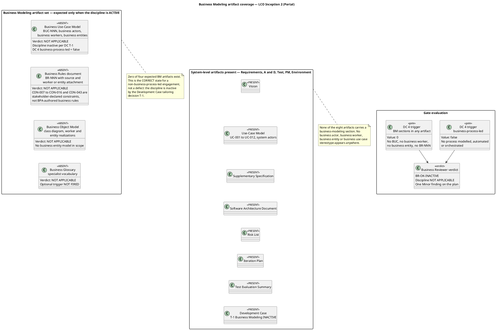
```plantuml
@startuml
title Business Modeling artifact coverage — LCO Inception 2 (Portal)

skinparam classAttributeIconSize 0
skinparam packageStyle rectangle

package "Business Modeling artifact set — expected only when the discipline is ACTIVE" as BM {
  class "Business Use-Case Model\nBUC-NNN, business actors,\nbusiness workers, business entities" as A1 <<ABSENT>> {
    Verdict: NOT APPLICABLE
    Discipline inactive per DC T-1
    DC 4 business-process-led = false
  }
  class "Business Rules document\nBR-NNN with source and\nworker or entity attachment" as A2 <<ABSENT>> {
    Verdict: NOT APPLICABLE
    CON-007 to CON-016 and CON-043 are
    stakeholder-declared constraints,
    not BPA-authored business rules
  }
  class "Business Object Model\nclass diagram, worker and\nentity realizations" as A3 <<ABSENT>> {
    Verdict: NOT APPLICABLE
    No business entity model in scope
  }
  class "Business Glossary\nspecialist vocabulary" as A4 <<ABSENT>> {
    Verdict: NOT APPLICABLE
    Optional trigger NOT FIRED
  }
}

package "System-level artifacts present — Requirements, A and D, Test, PM, Environment" as SYS {
  class "Vision" as V <<PRESENT>>
  class "Use-Case Model\nUC-001 to UC-012, system actors" as U <<PRESENT>>
  class "Supplementary Specification" as S <<PRESENT>>
  class "Software Architecture Document" as D <<PRESENT>>
  class "Risk List" as R <<PRESENT>>
  class "Iteration Plan" as I <<PRESENT>>
  class "Test Evaluation Summary" as T <<PRESENT>>
  class "Development Case\nT-1 Business Modeling INACTIVE" as C <<PRESENT>>
}

package "Gate evaluation" as GATE {
  class "DC 4 trigger\nbusiness-process-led" as G1 <<gate>> {
    Value: false
    No process modelled, automated
    or orchestrated
  }
  class "DC 4 trigger\nBM sections in any artifact" as G2 <<gate>> {
    Value: 0
    No BUC, no business worker,
    no business entity, no BR-NNN
  }
  class "Business Reviewer verdict" as G3 <<verdict>> {
    BR-OK-INACTIVE
    Discipline NOT APPLICABLE
    One Minor finding on the plan
  }
}

G1 --> G3
G2 --> G3
A1 -[hidden]- A2
A2 -[hidden]- A3
A3 -[hidden]- A4
V -[hidden]- U
U -[hidden]- S
S -[hidden]- D
D -[hidden]- R
R -[hidden]- I
I -[hidden]- T
T -[hidden]- C
BM -[hidden]- SYS
SYS -[hidden]- GATE

note bottom of BM
  Zero of four expected BM artifacts exist.
  This is the CORRECT state for a
  non-business-process-led engagement,
  not a defect: the discipline is inactive
  by the Development Case tailoring
  decision T-1.
end note

note bottom of SYS
  None of the eight artifacts carries a
  business-modeling section. No
  business actor, business worker,
  business entity or business use case
  stereotype appears anywhere.
end note
@enduml
```

**Trigger evaluation — the evidence the INACTIVE verdict rests on.**

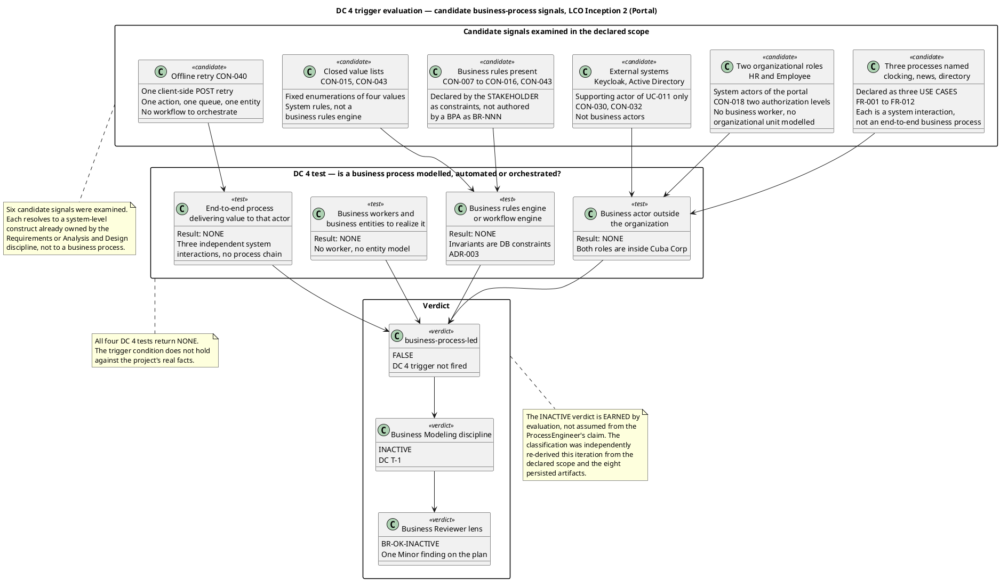
```plantuml
@startuml
title DC 4 trigger evaluation — candidate business-process signals, LCO Inception 2 (Portal)

skinparam classAttributeIconSize 0
skinparam packageStyle rectangle

package "Candidate signals examined in the declared scope" as CAND {
  class "Three processes named\nclocking, news, directory" as S1 <<candidate>> {
    Declared as three USE CASES
    FR-001 to FR-012
    Each is a system interaction,
    not an end-to-end business process
  }
  class "Business rules present\nCON-007 to CON-016, CON-043" as S2 <<candidate>> {
    Declared by the STAKEHOLDER
    as constraints, not authored
    by a BPA as BR-NNN
  }
  class "Two organizational roles\nHR and Employee" as S3 <<candidate>> {
    System actors of the portal
    CON-018 two authorization levels
    No business worker, no
    organizational unit modelled
  }
  class "External systems\nKeycloak, Active Directory" as S4 <<candidate>> {
    Supporting actor of UC-011 only
    CON-030, CON-032
    Not business actors
  }
  class "Closed value lists\nCON-015, CON-043" as S5 <<candidate>> {
    Fixed enumerations of four values
    System rules, not a
    business rules engine
  }
  class "Offline retry CON-040" as S6 <<candidate>> {
    One client-side POST retry
    One action, one queue, one entity
    No workflow to orchestrate
  }
}

package "DC 4 test — is a business process modelled, automated or orchestrated?" as TEST {
  class "Business actor outside\nthe organization" as T1 <<test>> {
    Result: NONE
    Both roles are inside Cuba Corp
  }
  class "End-to-end process\ndelivering value to that actor" as T2 <<test>> {
    Result: NONE
    Three independent system
    interactions, no process chain
  }
  class "Business workers and\nbusiness entities to realize it" as T3 <<test>> {
    Result: NONE
    No worker, no entity model
  }
  class "Business rules engine\nor workflow engine" as T4 <<test>> {
    Result: NONE
    Invariants are DB constraints
    ADR-003
  }
}

package "Verdict" as V {
  class "business-process-led" as V1 <<verdict>> {
    FALSE
    DC 4 trigger not fired
  }
  class "Business Modeling discipline" as V2 <<verdict>> {
    INACTIVE
    DC T-1
  }
  class "Business Reviewer lens" as V3 <<verdict>> {
    BR-OK-INACTIVE
    One Minor finding on the plan
  }
}

S1 --> T1
S2 --> T4
S3 --> T1
S4 --> T1
S5 --> T4
S6 --> T2
T1 --> V1
T2 --> V1
T3 --> V1
T4 --> V1
V1 --> V2
V2 --> V3

note bottom of CAND
  Six candidate signals were examined.
  Each resolves to a system-level
  construct already owned by the
  Requirements or Analysis and Design
  discipline, not to a business process.
end note

note bottom of TEST
  All four DC 4 tests return NONE.
  The trigger condition does not hold
  against the project's real facts.
end note

note bottom of V
  The INACTIVE verdict is EARNED by
  evaluation, not assumed from the
  ProcessEngineer's claim. The
  classification was independently
  re-derived this iteration from the
  declared scope and the eight
  persisted artifacts.
end note
@enduml
```

**Upstream consumption.** The declared scope in the Work Order was read as the ceiling. All eight persisted artifacts were read in full. The Development Case's classification verdicts, tailoring decisions T-1 to T-7, optional-trigger table and intensity statement were read against the DC §4 trigger conditions. The Review Record was read for the Reviewer's technical-lens block, the Management Reviewer's block, the Review Coordinator's lens dispositions, and prior BusinessReviewer findings.

**Entry criteria.** Met. All eight artifacts are complete and stable, no section is a placeholder, and the checklist was prepared before the artifacts were read.

### Management Reviewer lens
The management lens at the Lifecycle Objectives gate, Inception iteration 2. Eight artifacts reviewed in full: Development Case, Vision, Use-Case Model, Supplementary Specification, Software Architecture Document, Risk List, Iteration Plan, Test Evaluation Summary. The Iteration Assessment is not a review input at this gate — the ProjectManager authors it in the Assess touchpoint that runs after this review.

The criteria are the ten LCO exit criteria, evaluated against the artifacts and against the trace graph. The lens supplies evidence: a compliance table per criterion, a risk status chart with magnitude and trend, a four-axis health scorecard, and a defect distribution. The ReviewCoordinator remains the verdict owner; the management lens does not replace it.

```plantuml
@startuml
title LCO compliance table — exit criterion, status, evidence (Portal, Inception 2)

skinparam classAttributeIconSize 0
skinparam packageStyle rectangle

class "LCO-1 Stakeholders agree on the scope" as L1 <<MET>> {
  Status: MET
  Evidence: STK-001 confirmed as sponsor; 12 FR to 12 UC
  one-to-one; declared exclusions published verbatim;
  no open scope question
}

class "LCO-2 Project viable to proceed" as L2 <<MET>> {
  Status: MET
  Evidence: candidate architecture — 10 subsystems,
  10 interfaces, 6 ADRs, 4+1 views
}

class "LCO-3 Initial risks identified and classified" as L3 <<MET>> {
  Status: MET
  Evidence: R001 to R010 with P, I, exposure, magnitude,
  strategy, owner, mitigation, contingency, indicator
}

class "LCO-4 Requirements baseline complete and reviewed" as L4 <<PARTIAL>> {
  Status: MET WITH FINDINGS
  Evidence: 12 FR to 12 UC; Supplementary Specification#F2
  open — element-level traceability not registered
}

class "LCO-5 Architecture confronts the top risks" as L5 <<MET>> {
  Status: MET
  Evidence: R001, R003, R004, R008 confronted;
  R003 correctly excluded from the PoC plan as human work
}

class "LCO-6 Plan composed, no unmeasured unit" as L6 <<MET>> {
  Status: MET
  Evidence: 8 iterations; no work item sized; human gates
  bounded as risks; the 4 findings of this lens closed
}

class "LCO-7 Verifiability established" as L7 <<PARTIAL>> {
  Status: MET WITH FINDINGS
  Evidence: observable verification method per declared
  requirement; Test Evaluation Summary#F2 and #F3 open
}

class "LCO-8 Project Approval Review conducted" as L8 <<NOTMET>> {
  Status: NOT MET
  Evidence: scheduled as fine-plan W-9, owner
  ReviewCoordinator; not yet conducted, no record
}

class "LCO-9 No open Critical finding" as L9 <<MET>> {
  Status: MET
  Evidence: 0 Critical findings across the 8 artifacts
}

class "LCO-10 No unretired scope marker" as L10 <<MET>> {
  Status: MET
  Evidence: the STK-001 derivation is confirmed by the
  stakeholder; no artifact carries a marker
}

class "Milestone verdict" as V <<VERDICT>> {
  LCO: NOT SANCTIONED
  Stakeholder sanction: REFUSED
  Remedy: another iteration (CON-026)
}

L1 --> V
L2 --> V
L3 --> V
L4 --> V
L5 --> V
L6 --> V
L7 --> V
L8 --> V
L9 --> V
L10 --> V

note bottom of L8
  The Project Approval Review precedes LCO.
  It is scheduled but not conducted, so no
  record of it exists.
end note

note bottom of V
  Eight of ten criteria met or met with findings.
  Zero Critical findings. The refusal is the
  sanctioning authority's, on the condition that
  every iteration's findings be closed.
end note
@enduml
```

### Review Coordinator lens
#### Review event

**R7 Lifecycle Milestone Review — Lifecycle Objectives (LCO).** This is the first review event of the project. It is the phase gate for Inception: the point at which the stakeholder sanctions or refuses progression to Elaboration.

| Field | Value |
|---|---|
| Review type | R7 Lifecycle Milestone Review (LCO) |
| Triggering workflow activity | Close-Out Phase — Inception |
| Verdict owner | ReviewCoordinator |
| Sanctioning authority | STK-001, Laura Gómez, HR Director and project sponsor |
| Artifacts in scope | 8 — Development Case, Vision, Use-Case Model, Supplementary Specification, Software Architecture Document, Risk List, Iteration Plan, Test Evaluation Summary |
| Lenses executed | Reviewer (technical), BusinessReviewer (business), ManagementReviewer (management) |
| Lenses not executed | None — all three executed |
| Findings consolidated | 11 — 0 Critical, 5 Major, 6 Minor |

#### Entry criteria — verified before the review began

| # | Entry criterion | Status | Evidence |
|---|---|---|---|
| E-1 | Every artifact in scope is in its target state, not a draft placeholder | Met | All eight artifacts read in full; no section is a placeholder |
| E-2 | Every upstream artifact each artifact depends on is persisted | Met | All eight persisted this iteration |
| E-3 | Reviewers assigned with expertise matched to the artifact domain | Met | Technical lens on all eight; business lens on the business dimension; management lens on the gate |
| E-4 | Agenda and evaluation criteria distributed at least 48 hours in advance | Met | Checklists prepared per artifact type before the artifacts were read |
| E-5 | Finding ledger readable and complete | Met | `read_artifact_findings` returned the full ledger for all nine artifacts |

#### Exit criteria — the conditions this review must satisfy to close

| # | Exit criterion | Status |
|---|---|---|
| X-1 | Every finding carries an owner, a severity and a resolution deadline | Met — 11 of 11 |
| X-2 | The Review Record is signed and archived | Met — this document |
| X-3 | The milestone verdict is recorded | Met — Disposition |
| X-4 | Every Critical finding is escalated to the stakeholder | Met vacuously — 0 Critical findings |
| X-5 | The phase gate is sanctioned or refused by the sanctioning authority | Met — refused |

#### Review process framework — the eight review event types

| # | Review type | Triggering workflow activity | Required participants | Entry criteria | Exit criteria | Primary artifact output |
|---|---|---|---|---|---|---|
| R1 | Project Approval Review | Project initiation — scope feasibility against the Vision and the Risk List | STK-001, STK-003, ProjectManager, SystemAnalyst, ReviewCoordinator | Vision and Risk List in target state; agenda distributed 48h ahead | Review Record signed; every finding owned and dated | Review Record |
| R2 | Project Planning Review | Development Case tailoring and Iteration Plan roadmap composed | STK-001, STK-003, ProcessEngineer, ProjectManager, ReviewCoordinator | Development Case and Iteration Plan in target state | Review Record signed; every finding owned and dated | Review Record |
| R3 | Iteration Plan Review | Plan for Next Iteration | ProjectManager, SoftwareArchitect, TestManager, ReviewCoordinator | Iteration objectives and exit criteria stated; every work item owned | Review Record signed; every finding owned and dated | Review Record |
| R4 | PRA Review | Manage Iteration — project health during execution | ProjectManager, SoftwareArchitect, TestManager, ReviewCoordinator | Iteration in progress; artifacts available for assessment | Review Record signed; every finding owned and dated | Review Record |
| R5 | Iteration Evaluation Criteria Review | Manage Iteration — exit criteria verified before the iteration closes | ProjectManager, TestManager, ReviewCoordinator | Iteration artifacts complete | Review Record signed; every finding owned and dated | Review Record |
| R6 | Iteration Acceptance Review | Manage Iteration — formal acceptance of the iteration deliverables | STK-001, ProjectManager, ReviewCoordinator | Evaluation criteria review passed | Review Record signed; every finding owned and dated | Review Record |
| R7 | Lifecycle Milestone Review | Close-Out Phase — LCO, LCA, IOC, PR | STK-001, ManagementReviewer, Reviewer, BusinessReviewer, ReviewCoordinator | All phase artifacts reviewed; finding ledger complete | Milestone verdict recorded; sanction granted or refused | Review Record |
| R8 | Project Acceptance Review | Close-Out Phase — final project-level acceptance | STK-001, STK-003, ProjectManager, ReviewCoordinator | PR milestone review passed; handover accepted | Review Record signed; project closed | Review Record |

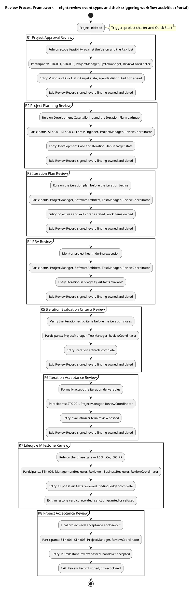
```plantuml
@startuml
title Review Process Framework — eight review event types and their triggering workflow activities (Portal)

start

:Project initiated;
note right
  Trigger: project charter and Quick Start
end note

partition "R1 Project Approval Review" {
  :Rule on scope feasibility against the Vision and the Risk List;
  :Participants: STK-001, STK-003, ProjectManager, SystemAnalyst, ReviewCoordinator;
  :Entry: Vision and Risk List in target state, agenda distributed 48h ahead;
  :Exit: Review Record signed, every finding owned and dated;
}

partition "R2 Project Planning Review" {
  :Rule on Development Case tailoring and the Iteration Plan roadmap;
  :Participants: STK-001, STK-003, ProcessEngineer, ProjectManager, ReviewCoordinator;
  :Entry: Development Case and Iteration Plan in target state;
  :Exit: Review Record signed, every finding owned and dated;
}

partition "R3 Iteration Plan Review" {
  :Rule on the iteration plan before the iteration begins;
  :Participants: ProjectManager, SoftwareArchitect, TestManager, ReviewCoordinator;
  :Entry: objectives and exit criteria stated, work items owned;
  :Exit: Review Record signed, every finding owned and dated;
}

partition "R4 PRA Review" {
  :Monitor project health during execution;
  :Participants: ProjectManager, SoftwareArchitect, TestManager, ReviewCoordinator;
  :Entry: iteration in progress, artifacts available;
  :Exit: Review Record signed, every finding owned and dated;
}

partition "R5 Iteration Evaluation Criteria Review" {
  :Verify the iteration exit criteria before the iteration closes;
  :Participants: ProjectManager, TestManager, ReviewCoordinator;
  :Entry: iteration artifacts complete;
  :Exit: Review Record signed, every finding owned and dated;
}

partition "R6 Iteration Acceptance Review" {
  :Formally accept the iteration deliverables;
  :Participants: STK-001, ProjectManager, ReviewCoordinator;
  :Entry: evaluation criteria review passed;
  :Exit: Review Record signed, every finding owned and dated;
}

partition "R7 Lifecycle Milestone Review" {
  :Rule on the phase gate — LCO, LCA, IOC, PR;
  :Participants: STK-001, ManagementReviewer, Reviewer, BusinessReviewer, ReviewCoordinator;
  :Entry: all phase artifacts reviewed, finding ledger complete;
  :Exit: milestone verdict recorded, sanction granted or refused;
}

partition "R8 Project Acceptance Review" {
  :Final project-level acceptance at close-out;
  :Participants: STK-001, STK-003, ProjectManager, ReviewCoordinator;
  :Entry: PR milestone review passed, handover accepted;
  :Exit: Review Record signed, project closed;
}

stop
@enduml
```

#### Review calendar — review events mapped to iteration boundaries

Reviews are iteration-driven, not calendar-driven. Every review event is triggered by a workflow activity completion; if the iteration slips, the review slips with it. The axis below is ordinal — one block is one iteration, not a duration.

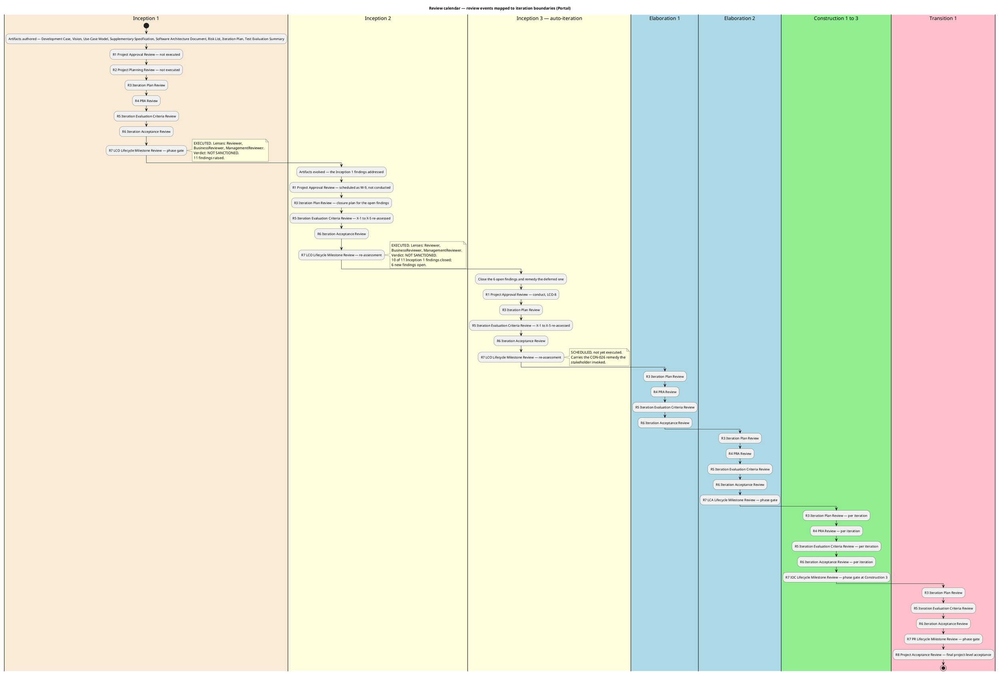
```plantuml
@startuml
title Review calendar — review events mapped to iteration boundaries (Portal)

|#AntiqueWhite|Inception 1|
start
:Artifacts authored — Development Case, Vision, Use-Case Model, Supplementary Specification, Software Architecture Document, Risk List, Iteration Plan, Test Evaluation Summary;
:R1 Project Approval Review — not executed;
:R2 Project Planning Review — not executed;
:R3 Iteration Plan Review;
:R4 PRA Review;
:R5 Iteration Evaluation Criteria Review;
:R6 Iteration Acceptance Review;
:R7 LCO Lifecycle Milestone Review — phase gate;
note right
  EXECUTED. Lenses: Reviewer,
  BusinessReviewer, ManagementReviewer.
  Verdict: NOT SANCTIONED.
  11 findings raised.
end note

|#LightYellow|Inception 2|
:Artifacts evolved — the Inception 1 findings addressed;
:R1 Project Approval Review — scheduled as W-9, not conducted;
:R3 Iteration Plan Review — closure plan for the open findings;
:R5 Iteration Evaluation Criteria Review — X-1 to X-5 re-assessed;
:R6 Iteration Acceptance Review;
:R7 LCO Lifecycle Milestone Review — re-assessment;
note right
  EXECUTED. Lenses: Reviewer,
  BusinessReviewer, ManagementReviewer.
  Verdict: NOT SANCTIONED.
  10 of 11 Inception 1 findings closed;
  6 new findings open.
end note

|#LightYellow|Inception 3 — auto-iteration|
:Close the 6 open findings and remedy the deferred one;
:R1 Project Approval Review — conduct, LCO-8;
:R3 Iteration Plan Review;
:R5 Iteration Evaluation Criteria Review — X-1 to X-5 re-assessed;
:R6 Iteration Acceptance Review;
:R7 LCO Lifecycle Milestone Review — re-assessment;
note right
  SCHEDULED, not yet executed.
  Carries the CON-026 remedy the
  stakeholder invoked.
end note

|#LightBlue|Elaboration 1|
:R3 Iteration Plan Review;
:R4 PRA Review;
:R5 Iteration Evaluation Criteria Review;
:R6 Iteration Acceptance Review;

|#LightBlue|Elaboration 2|
:R3 Iteration Plan Review;
:R4 PRA Review;
:R5 Iteration Evaluation Criteria Review;
:R6 Iteration Acceptance Review;
:R7 LCA Lifecycle Milestone Review — phase gate;

|#LightGreen|Construction 1 to 3|
:R3 Iteration Plan Review — per iteration;
:R4 PRA Review — per iteration;
:R5 Iteration Evaluation Criteria Review — per iteration;
:R6 Iteration Acceptance Review — per iteration;
:R7 IOC Lifecycle Milestone Review — phase gate at Construction 3;

|#Pink|Transition 1|
:R3 Iteration Plan Review;
:R5 Iteration Evaluation Criteria Review;
:R6 Iteration Acceptance Review;
:R7 PR Lifecycle Milestone Review — phase gate;
:R8 Project Acceptance Review — final project-level acceptance;
stop
@enduml
```

**Milestone review coverage.** All four RUP lifecycle milestones have a scheduled R7 review: LCO closes Inception, LCA closes Elaboration 2, IOC closes Construction 3, PR closes Transition 1. No phase transition is unsanctioned.

**Open condition carried into the next Inception iteration.** R1 Project Approval Review is scheduled as fine-plan work item W-9 and has not been conducted in either Inception iteration. LCO exit criterion LCO-8 is unmet until it is conducted and on record. The scheduling defect is finding Iteration Plan#F3, closed by the Management Reviewer against the plan; the review event itself remains outstanding.

#### Review event interaction

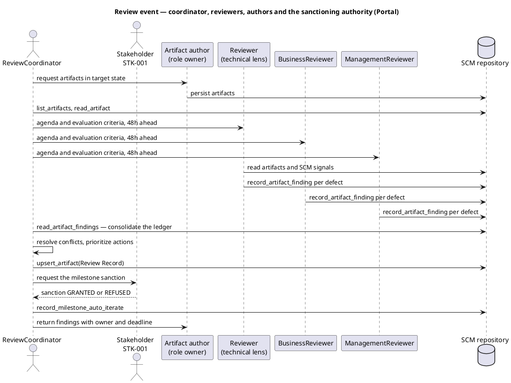
```plantuml
@startuml
title Review event — coordinator, reviewers, authors and the sanctioning authority (Portal)

actor "ReviewCoordinator" as RC
actor "Stakeholder\nSTK-001" as STK
participant "Artifact author\n(role owner)" as AU
participant "Reviewer\n(technical lens)" as RV
participant "BusinessReviewer" as BR
participant "ManagementReviewer" as MR
database "SCM repository" as SCM

RC -> AU : request artifacts in target state
AU -> SCM : persist artifacts
RC -> SCM : list_artifacts, read_artifact
RC -> RV : agenda and evaluation criteria, 48h ahead
RC -> BR : agenda and evaluation criteria, 48h ahead
RC -> MR : agenda and evaluation criteria, 48h ahead
RV -> SCM : read artifacts and SCM signals
RV -> SCM : record_artifact_finding per defect
BR -> SCM : record_artifact_finding per defect
MR -> SCM : record_artifact_finding per defect
RC -> SCM : read_artifact_findings — consolidate the ledger
RC -> RC : resolve conflicts, prioritize actions
RC -> SCM : upsert_artifact(Review Record)
RC -> STK : request the milestone sanction
STK --> RC : sanction GRANTED or REFUSED
RC -> SCM : record_milestone_auto_iterate
RC -> AU : return findings with owner and deadline
@enduml
```

#### Checklists applied

| Artifact | Checklist applied | Lens |
|---|---|---|
| Development Case | DC Baseline Conformance (roster, CORE catalog, ownership, artifact universe, intensity) + Optional Trigger Justification against each §5.2 condition + tool-baseline verification against the repository | Reviewer, ManagementReviewer |
| Vision | Requirements quality: complete, consistent, unambiguous, traceable, no unsourced quantitative claim; scope adherence against the declared ceiling | Reviewer, ManagementReviewer |
| Use-Case Model | One-to-one with declared requirements; `Source: FR-NNN` on every use case; no phantom use case; no cross-cutting mechanism as a use case; no per-actor split; UML formal correctness | Reviewer, ManagementReviewer |
| Supplementary Specification | FURPS+ coverage of every declared NFR, AC and CON; cross-cutting mechanisms specified and not promoted to use cases; threshold quantification; element-level traceability registered | Reviewer, ManagementReviewer |
| Software Architecture Document | Every subsystem traces to a declared element; no layer- or feature-named subsystem; one seam per High-volatility area; external-system placement; invariants as constraints; no invented technology | Reviewer, ManagementReviewer |
| Risk List | Declared risks preserved; team risks numbered per CON-023; strategy and owner per risk; acceptance basis named; no human-team unit | Reviewer, ManagementReviewer |
| Iteration Plan | Objectives carry exit evidence; no unmeasured unit; human gate bounded as a risk; two currencies never summed; all acceptance criteria accounted for; gate structure complete | Reviewer, ManagementReviewer |
| Test Evaluation Summary | Every declared requirement has an observable verification method; no execution claimed; SCM signals read and recorded and reconciling with the provider; traceability registered | Reviewer, ManagementReviewer |
| Business Modeling dimension | Scenario selection; BUC completeness; realization adequacy; derivation bridge; resource planning; business-level technique; stakeholder coverage; business rules as formal constraints; UML richness; scope adherence; business-lens governance at the lifecycle gates | BusinessReviewer |

#### Iteration 1

**Review event.** R7 Lifecycle Milestone Review — Lifecycle Objectives (LCO). The first review event of the project, and the phase gate for Inception.

| Field | Value |
|---|---|
| Review type | R7 Lifecycle Milestone Review (LCO) |
| Triggering workflow activity | Close-Out Phase — Inception |
| Verdict owner | ReviewCoordinator |
| Sanctioning authority | STK-001, Laura Gómez, HR Director and project sponsor |
| Artifacts in scope | 8 — Development Case, Vision, Use-Case Model, Supplementary Specification, Software Architecture Document, Risk List, Iteration Plan, Test Evaluation Summary |
| Lenses executed | Reviewer (technical), BusinessReviewer (business), ManagementReviewer (management) |
| Lenses not executed | None — all three executed |
| Findings consolidated | 11 — 0 Critical, 5 Major, 6 Minor |

**Entry criteria — verified before the review began.**

| # | Entry criterion | Status | Evidence |
|---|---|---|---|
| E-1 | Every artifact in scope is in its target state, not a draft placeholder | Met | All eight artifacts read in full; no section is a placeholder |
| E-2 | Every upstream artifact each artifact depends on is persisted | Met | All eight persisted this iteration |
| E-3 | Reviewers assigned with expertise matched to the artifact domain | Met | Technical lens on all eight; business lens on the business dimension; management lens on the gate |
| E-4 | Agenda and evaluation criteria distributed at least 48 hours in advance | Met | Checklists prepared per artifact type before the artifacts were read |
| E-5 | Finding ledger readable and complete | Met | `read_artifact_findings` returned the full ledger for all nine artifacts |

**Exit criteria — the conditions this review must satisfy to close.**

| # | Exit criterion | Status |
|---|---|---|
| X-1 | Every finding carries an owner, a severity and a resolution deadline | Met — 11 of 11 |
| X-2 | The Review Record is signed and archived | Met — this document |
| X-3 | The milestone verdict is recorded | Met — Disposition |
| X-4 | Every Critical finding is escalated to the stakeholder | Met vacuously — 0 Critical findings |
| X-5 | The phase gate is sanctioned or refused by the sanctioning authority | Met — refused |

**SCM evidence read this iteration.**

| Signal | Observed |
|---|---|
| Build, branch `main` | `ci-run-37583334371` — success, 2026-10-07 06:45:58Z to 06:47:38Z |
| Open pull requests | None |
| Branches labelled `ready-for-review` | None |
| Issues, all states | None |
| Repository tree | `.github/workflows/ci.yml` (sha `0c2fd7cf47eeab68d19420fe3897d209258bd074`), `Portal.sln` (sha `f554bf5bc04df43103677206c7727fcc62ea2bc4`), `src/Portal.Web/Portal.Web.csproj`, `tests/Portal.Tests/Portal.Tests.csproj`, `README.md`, `docs/inputs/employee-portal-design.html` (sha `715d4f73d6ef4de18c46242258bc17a67f51ba6f`). `CONTRIBUTING.md` and `.editorconfig` absent. |

**Pull-request disposition.** No open pull request exists, so every pull request has reached a terminal disposition vacuously and no disposition call was required. The repository carries scaffolding only — a solution, two empty projects, a CI workflow, a README and the mandatory design reference. No productive code is present, which is consistent with Inception scope. No scope-ahead branch exists.

#### Iteration 2

**Review event.** R7 Lifecycle Milestone Review — Lifecycle Objectives (LCO), re-assessment. The second review event of the project, and the re-assessment of the gate the stakeholder refused at the end of Inception 1.

| Field | Value |
|---|---|
| Review type | R7 Lifecycle Milestone Review (LCO) — re-assessment |
| Triggering workflow activity | Close-Out Phase — Inception |
| Verdict owner | ReviewCoordinator |
| Sanctioning authority | STK-001, Laura Gómez, HR Director and project sponsor |
| Artifacts in scope | 8 — Development Case, Vision, Use-Case Model, Supplementary Specification, Software Architecture Document, Risk List, Iteration Plan, Test Evaluation Summary |
| Lenses executed | Reviewer (technical), BusinessReviewer (business), ManagementReviewer (management) |
| Lenses not executed | None — all three executed |
| Findings consolidated | 6 open — 0 Critical, 4 Major, 2 Minor; plus 1 Major deferred |

**Entry criteria — verified before the review began.**

| # | Entry criterion | Status | Evidence |
|---|---|---|---|
| E-1 | Every artifact in scope is in its target state, not a draft placeholder | Met | All eight artifacts read in full; no section is a placeholder |
| E-2 | Every upstream artifact each artifact depends on is persisted | Met | All eight persisted; the Iteration Assessment is authored after this review and is not a review input |
| E-3 | Reviewers assigned with expertise matched to the artifact domain | Met | Technical lens on all eight; business lens on the business dimension; management lens on the gate |
| E-4 | Agenda and evaluation criteria distributed at least 48 hours in advance | Met | Checklists prepared per artifact type before the artifacts were read |
| E-5 | Finding ledger readable and complete | Met | `read_artifact_findings` returned the full ledger for all ten artifacts |

**Exit criteria — the conditions this review must satisfy to close.**

| # | Exit criterion | Status |
|---|---|---|
| X-1 | Every finding carries an owner, a severity and a resolution deadline | Met — 6 of 6 open, plus the deferred finding |
| X-2 | The Review Record is signed and archived | Met — this document |
| X-3 | The milestone verdict is recorded | Met — Disposition |
| X-4 | Every Critical finding is escalated to the stakeholder | Met vacuously — 0 Critical findings |
| X-5 | The phase gate is sanctioned or refused by the sanctioning authority | Met — refused |

**SCM evidence read this iteration.**

| Signal | Observed |
|---|---|
| Build, branch `main` | success, 2026-10-07 07:39:12Z to 07:40:02Z |
| CI workflow | `.github/workflows/ci.yml` committed at sha `d801df1d88e18cd658b7c40ee02891e7fe56daaf`; `on: push` and `on: pull_request` over `main`, `iteration/**`, `chore/**`, `feature/**`, `hotfix/**`; jobs `build` then `test`; the solution manifest is regenerated from the `src/` and `tests/` tree on every run |
| Open pull requests | None |
| Issues, all states | Issue #1 open — "Trace registration — Test Evaluation Summary upstream links (Test Evaluation Summary#F2)", labels `trace-registration`, `priority-high`, `no-scope-change` |
| Trace graph, Business level | 58 roots, 163 nodes; `NFR-002` to `NFR-005` are LEAF nodes; `AC-001` to `AC-006` are LEAF nodes; `Test Evaluation Summary` is absent from the tree |

**Pull-request disposition.** No open pull request exists, so every pull request has reached a terminal disposition vacuously and no disposition call was required. The repository carries scaffolding only — a solution, two empty projects, a CI workflow, a README and the mandatory design reference. No productive code is present, which is consistent with Inception scope. No scope-ahead branch exists.

## Findings
### Reviewer lens
#### Iteration 1

Seven findings: three Major, four Minor, no Critical. Two artifacts carry no finding and are Approved from this lens.

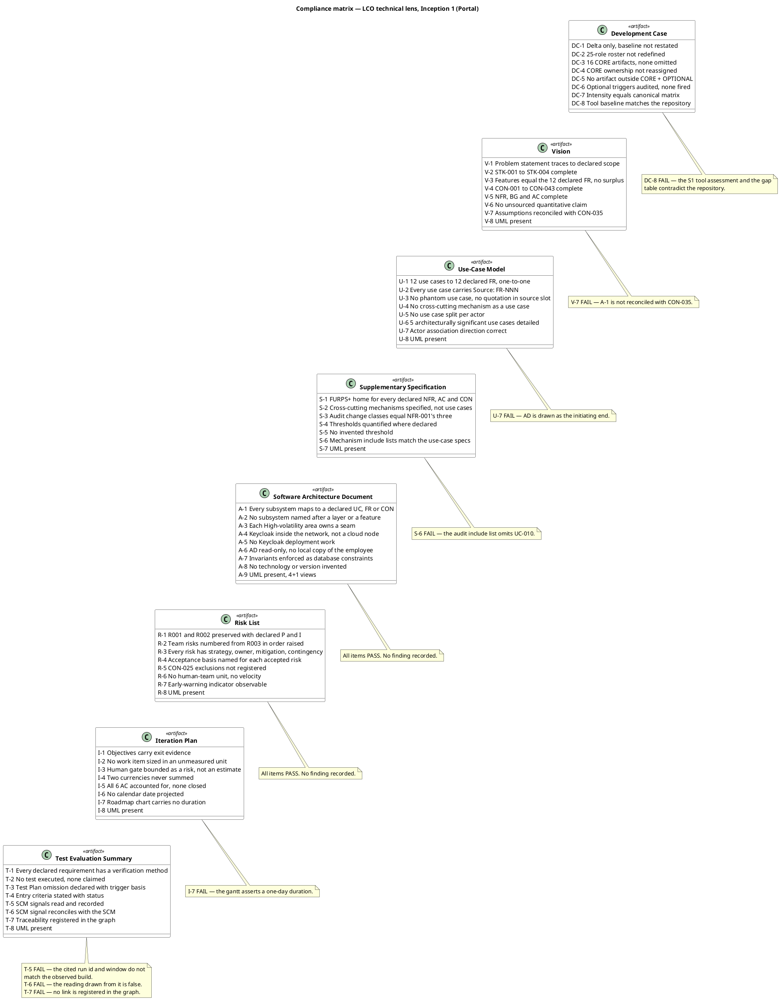
```plantuml
@startuml
title Compliance matrix — LCO technical lens, Inception 1 (Portal)

skinparam classAttributeIconSize 0
skinparam classFontStyle bold
skinparam classBackgroundColor #FFFFFF

class "Development Case" as DC <<artifact>> {
  DC-1 Delta only, baseline not restated
  DC-2 25-role roster not redefined
  DC-3 16 CORE artifacts, none omitted
  DC-4 CORE ownership not reassigned
  DC-5 No artifact outside CORE + OPTIONAL
  DC-6 Optional triggers audited, none fired
  DC-7 Intensity equals canonical matrix
  DC-8 Tool baseline matches the repository
}

class "Vision" as VIS <<artifact>> {
  V-1 Problem statement traces to declared scope
  V-2 STK-001 to STK-004 complete
  V-3 Features equal the 12 declared FR, no surplus
  V-4 CON-001 to CON-043 complete
  V-5 NFR, BG and AC complete
  V-6 No unsourced quantitative claim
  V-7 Assumptions reconciled with CON-035
  V-8 UML present
}

class "Use-Case Model" as UCM <<artifact>> {
  U-1 12 use cases to 12 declared FR, one-to-one
  U-2 Every use case carries Source: FR-NNN
  U-3 No phantom use case, no quotation in source slot
  U-4 No cross-cutting mechanism as a use case
  U-5 No use case split per actor
  U-6 5 architecturally significant use cases detailed
  U-7 Actor association direction correct
  U-8 UML present
}

class "Supplementary Specification" as SS <<artifact>> {
  S-1 FURPS+ home for every declared NFR, AC and CON
  S-2 Cross-cutting mechanisms specified, not use cases
  S-3 Audit change classes equal NFR-001's three
  S-4 Thresholds quantified where declared
  S-5 No invented threshold
  S-6 Mechanism include lists match the use-case specs
  S-7 UML present
}

class "Software Architecture Document" as SAD <<artifact>> {
  A-1 Every subsystem maps to a declared UC, FR or CON
  A-2 No subsystem named after a layer or a feature
  A-3 Each High-volatility area owns a seam
  A-4 Keycloak inside the network, not a cloud node
  A-5 No Keycloak deployment work
  A-6 AD read-only, no local copy of the employee
  A-7 Invariants enforced as database constraints
  A-8 No technology or version invented
  A-9 UML present, 4+1 views
}

class "Risk List" as RL <<artifact>> {
  R-1 R001 and R002 preserved with declared P and I
  R-2 Team risks numbered from R003 in order raised
  R-3 Every risk has strategy, owner, mitigation, contingency
  R-4 Acceptance basis named for each accepted risk
  R-5 CON-025 exclusions not registered
  R-6 No human-team unit, no velocity
  R-7 Early-warning indicator observable
  R-8 UML present
}

class "Iteration Plan" as IP <<artifact>> {
  I-1 Objectives carry exit evidence
  I-2 No work item sized in an unmeasured unit
  I-3 Human gate bounded as a risk, not an estimate
  I-4 Two currencies never summed
  I-5 All 6 AC accounted for, none closed
  I-6 No calendar date projected
  I-7 Roadmap chart carries no duration
  I-8 UML present
}

class "Test Evaluation Summary" as TES <<artifact>> {
  T-1 Every declared requirement has a verification method
  T-2 No test executed, none claimed
  T-3 Test Plan omission declared with trigger basis
  T-4 Entry criteria stated with status
  T-5 SCM signals read and recorded
  T-6 SCM signal reconciles with the SCM
  T-7 Traceability registered in the graph
  T-8 UML present
}

note bottom of DC
  DC-8 FAIL — the S1 tool assessment and the gap
  table contradict the repository.
end note

note bottom of TES
  T-5 FAIL — the cited run id and window do not
  match the observed build.
  T-6 FAIL — the reading drawn from it is false.
  T-7 FAIL — no link is registered in the graph.
end note

note bottom of UCM
  U-7 FAIL — AD is drawn as the initiating end.
end note

note bottom of SS
  S-6 FAIL — the audit include list omits UC-010.
end note

note bottom of VIS
  V-7 FAIL — A-1 is not reconciled with CON-035.
end note

note bottom of IP
  I-7 FAIL — the gantt asserts a one-day duration.
end note

note bottom of SAD
  All items PASS. No finding recorded.
end note

note bottom of RL
  All items PASS. No finding recorded.
end note

DC -[hidden]- VIS
VIS -[hidden]- UCM
UCM -[hidden]- SS
SS -[hidden]- SAD
SAD -[hidden]- RL
RL -[hidden]- IP
IP -[hidden]- TES
@enduml
```

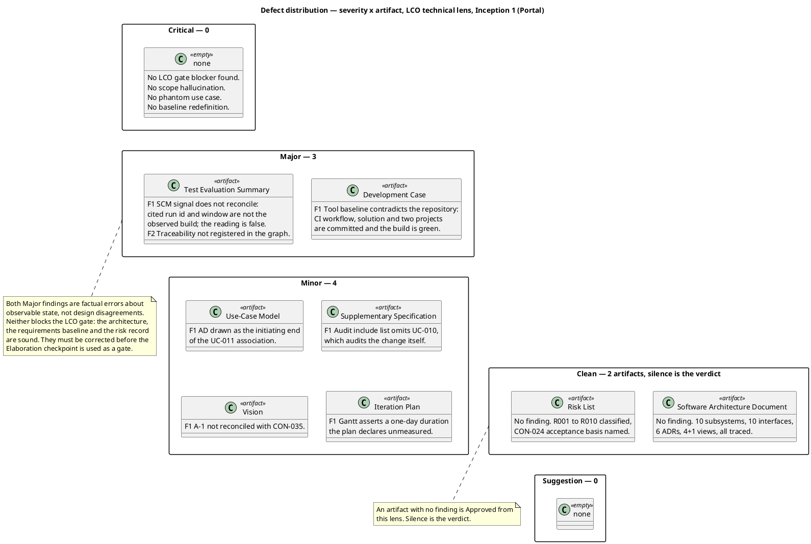
```plantuml
@startuml
title Defect distribution — severity x artifact, LCO technical lens, Inception 1 (Portal)

skinparam classAttributeIconSize 0
skinparam packageStyle rectangle

package "Critical — 0" as CRIT {
  class "none" as C0 <<empty>> {
    No LCO gate blocker found.
    No scope hallucination.
    No phantom use case.
    No baseline redefinition.
  }
}

package "Major — 3" as MAJ {
  class "Development Case" as M1 <<artifact>> {
    F1 Tool baseline contradicts the repository:
    CI workflow, solution and two projects
    are committed and the build is green.
  }
  class "Test Evaluation Summary" as M2 <<artifact>> {
    F1 SCM signal does not reconcile:
    cited run id and window are not the
    observed build; the reading is false.
    F2 Traceability not registered in the graph.
  }
}

package "Minor — 4" as MIN {
  class "Use-Case Model" as N1 <<artifact>> {
    F1 AD drawn as the initiating end
    of the UC-011 association.
  }
  class "Supplementary Specification" as N2 <<artifact>> {
    F1 Audit include list omits UC-010,
    which audits the change itself.
  }
  class "Vision" as N3 <<artifact>> {
    F1 A-1 not reconciled with CON-035.
  }
  class "Iteration Plan" as N4 <<artifact>> {
    F1 Gantt asserts a one-day duration
    the plan declares unmeasured.
  }
}

package "Clean — 2 artifacts, silence is the verdict" as CLEAN {
  class "Software Architecture Document" as K1 <<artifact>> {
    No finding. 10 subsystems, 10 interfaces,
    6 ADRs, 4+1 views, all traced.
  }
  class "Risk List" as K2 <<artifact>> {
    No finding. R001 to R010 classified,
    CON-024 acceptance basis named.
  }
}

package "Suggestion — 0" as SUG {
  class "none" as S0 <<empty>>
}

note bottom of MAJ
  Both Major findings are factual errors about
  observable state, not design disagreements.
  Neither blocks the LCO gate: the architecture,
  the requirements baseline and the risk record
  are sound. They must be corrected before the
  Elaboration checkpoint is used as a gate.
end note

note bottom of CLEAN
  An artifact with no finding is Approved from
  this lens. Silence is the verdict.
end note

CRIT -[hidden]- MAJ
MAJ -[hidden]- MIN
MIN -[hidden]- CLEAN
CLEAN -[hidden]- SUG
@enduml
```

##### Development Case — Major

**F1 — The tool baseline contradicts the repository.** The section "Organization and tool assessment (S1, 2026-10-07)" states the repository holds the design reference "and nothing else. No CI workflow file, no `CONTRIBUTING.md`, no lint or analyzer configuration, and no open Change Requests." The gap table repeats it: "CI workflow under the hosted provider | Absent — gap". The SCM contradicts this. `.github/workflows/ci.yml` is committed at sha `0c2fd7cf47eeab68d19420fe3897d209258bd074`; `Portal.sln` is committed with two projects, `src/Portal.Web/Portal.Web.csproj` and `tests/Portal.Tests/Portal.Tests.csproj`; and a build ran on `main` (`ci-run-37583334371`). The two other gap claims — `CONTRIBUTING.md` and the lint/analyzer configuration — are correct. The consequence is operational: the Elaboration iteration-preparation checkpoint demands "CI workflow committed and green on an empty build" as an outstanding condition, and that condition is already satisfied, so the checkpoint as written would send Elaboration to close a gap that does not exist.

*Remediation.* Rewrite the S1 tool assessment and the gap table against the repository: record the CI workflow as present, the solution and the two scaffolding projects as present, and keep only `CONTRIBUTING.md` and the lint/analyzer configuration as open gaps. Remove "CI workflow committed and green on an empty build" from the Elaboration checkpoint's outstanding conditions, or restate it as already satisfied. The tailoring decisions T-1 to T-7, the classification verdicts, the optional-trigger table and the intensity statement are unaffected and stand.

*Evidence.* DC: "The repository holds the mandatory UI design reference at `docs/inputs/employee-portal-design.html` (CON-038) and nothing else. No CI workflow file..." against `scm_get_file_content('.github/workflows/ci.yml')` sha `0c2fd7cf47eeab68d19420fe3897d209258bd074`; `scm_get_file_content('Portal.sln')` sha `f554bf5bc04df43103677206c7727fcc62ea2bc4`; `scm_get_build_status(main)` `ci-run-37583334371`.

##### Test Evaluation Summary — Major

**F3 — The recorded issue-tracker signal does not reconcile with the SCM, and it contradicts the artifact's own text.** The SCM quality signals table records `Issue tracker, all states | No issue is open or closed` and reads it as "No Change Request has been raised and no defect has been recorded." The issue tracker holds one open issue: Issue #1, "Trace registration — Test Evaluation Summary upstream links (Test Evaluation Summary#F2)", labelled `trace-registration`, `priority-high`, `no-scope-change`. The artifact's own Traceability section cites that same issue as the tracking reference for its unregistered links, so the artifact states the issue exists in one section and that no issue exists in another. The reading drawn from the false signal is also wrong: a defect has been recorded, and the issue tracker is the authoritative record for it — which the artifact's own Defect lifecycle section already states.

*Remediation.* Re-read the issue tracker in all states and replace the row with the observed value: Issue #1 open, labelled `trace-registration`, `priority-high`, `no-scope-change`, carrying the Test Evaluation Summary's unregistered upstream links. Correct the reading accordingly. Keep the build-status and CI-workflow rows, which reconcile with the provider.

*Evidence.* Test Evaluation Summary, Defects and Incidents: `| Issue tracker, all states | No issue is open or closed | No Change Request has been raised and no defect has been recorded. |` against `scm_list_issues(state=all)` = `#1 [open] Trace registration — Test Evaluation Summary upstream links (Test Evaluation Summary#F2) — labels: [trace-registration, priority-high, no-scope-change]`; and against the artifact's own Traceability section: "Registration is the trace steward's act and is requested of the SystemAnalyst in Issue #1."

##### Use-Case Model — Minor

**F1 — Active Directory is drawn as the initiating end of the association to UC-011.** The Use-Case Diagram carries `AD --> UC011`, which asserts that the external system initiates the use case. The portal initiates the LDAP read; AD never initiates anything. The Actors table already describes AD correctly as "External system, supporting", so the diagram and the table disagree about the direction of initiation.

*Remediation.* Draw the association from UC-011 to Active Directory, or use a directed association whose arrow sits at AD, and keep AD as a supporting actor in the Actors table. The justification for modelling AD as a supporting actor — a live read of a system of record the portal does not own — is sound and needs no change.

*Evidence.* Use-Case Model, Use-Case Diagram: `AD --> UC011`; Actors table: "Active Directory | External system, supporting".

##### Supplementary Specification — Minor

**F1 — The audit mechanism's include list omits UC-010, while UC-010's own specification audits the change.** The cross-cutting mechanism table lists the audit trail as "Included by UC-005, UC-006, UC-008, UC-009, UC-012", and the mechanism diagram draws no AUDIT edge from U10. UC-010's main flow step 5 reads "The portal audits the change." Two statements about the same change class disagree, and NFR-001 is a mandatory audit requirement, so a downstream implementer has no single answer for whether the featuring path writes an audit record.

*Remediation.* Reconcile the two. Either add UC-010 to the audit mechanism's include list and draw the AUDIT edge from U10, or remove the audit step from UC-010 and state there that featuring is audited through UC-006 or UC-008. Keep the existing NFR-001 reasoning that featuring is not a fourth change class.

*Evidence.* Supplementary Specification, cross-cutting mechanism table: "Audit trail ... Included by UC-005, UC-006, UC-008, UC-009, UC-012"; Use-Case Model, UC-010 main flow step 5: "The portal audits the change."

##### Vision — Minor

**F1 — Assumption A-1 is not reconciled with CON-035.** A-1 reads "The portal's OIDC client is already registered in Keycloak and the credentials are with the development team, so login can be tested from day one." It does not say which issuer "tested from day one" means, while CON-035 requires the team to build and test against stand-ins and never against the real Keycloak, and A-3 in the same table states the stand-in rule. A downstream role can read A-1 as authorising team testing against the real Keycloak, which CON-035 forbids.

*Remediation.* State in A-1 that the registered client and its credentials exist for the human validation gate performed by Infrastructure with HR, and that team testing is against the stand-in OIDC issuer per CON-035 and A-3. The declared stakeholder statement is faithfully recorded; only the reconciliation is missing.

*Evidence.* Vision, Assumptions and Dependencies: A-1 against A-3 ("The team builds and tests against stand-ins it controls") and CON-035.

##### Iteration Plan — Minor

**F1 — The roadmap chart asserts durations the plan itself declares unmeasured.** The `@startgantt` block gives every iteration "lasts 1 day" and chains them end to end, while the caption states "The axis is ordinal, not calendar: one bar is one iteration and its width is a nominal unit, not a duration" and "No project start date is set and no calendar date is projected from an estimate." A reader who reads the chart and not the caption sees a seven-day project, which is a duration in a unit this system does not measure.

*Remediation.* Replace the gantt with a sequence or activity diagram that carries no duration, or state the nominal unit inside the chart itself — in its title or a note — so the chart cannot be read as a schedule. The milestone sequence, the iteration boundaries and the human-gate treatment are correct and need no change.

*Evidence.* Iteration Plan, Plan and Milestones: "[I1 Inception 1] lasts 1 day" ... "[T1 Transition 1] lasts 1 day" against the caption "The axis is ordinal, not calendar".

##### Software Architecture Document — no finding

No defect recorded. Every subsystem traces to a declared use case, requirement or constraint; no subsystem is named after a layer or a feature; each `Volatility: High` area owns a seam (`COMP-002` behind `INT-002`, `COMP-004` behind `INT-004`); Keycloak is placed inside the corporate network and no Keycloak deployment work is planned; AD is read-only with no local copy of the employee; the three invariants are enforced as database constraints; and no technology or version is invented. Approved from this lens.

##### Risk List — no finding

No defect recorded. R001 and R002 are preserved with their declared probability and impact; R003 to R010 are numbered in the order raised per CON-023; every risk carries a strategy, an owner, a mitigation, a contingency and an observable early-warning indicator; every accepted risk names its CON-024 basis; the CON-025 exclusions are not registered; and no human-team unit or velocity appears. Approved from this lens.

##### Traceability compliance — this iteration

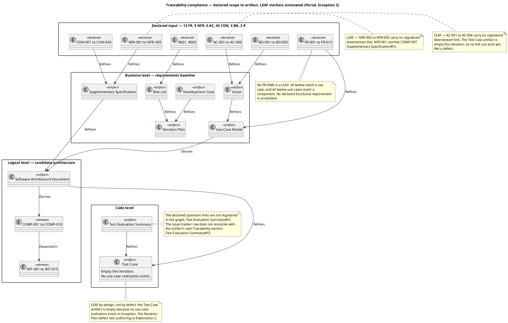
```plantuml
@startuml
title Traceability compliance — declared scope to artifact, LEAF markers annotated (Portal, Inception 2)

skinparam classAttributeIconSize 0
skinparam packageStyle rectangle

package "Declared input — 12 FR, 5 NFR, 6 AC, 43 CON, 3 BG, 2 R" as DECL {
  class "FR-001 to FR-012" as FR <<declared>>
  class "NFR-001 to NFR-005" as NFR <<declared>>
  class "AC-001 to AC-006" as AC <<declared>>
  class "CON-001 to CON-043" as CON <<declared>>
  class "BG-001 to BG-003" as BG <<declared>>
  class "R001, R002" as R <<declared>>
}

package "Business level — requirements baseline" as BIZ {
  class "Vision" as VIS <<artifact>>
  class "Use-Case Model" as UCM <<artifact>>
  class "Supplementary Specification" as SS <<artifact>>
  class "Risk List" as RL <<artifact>>
  class "Iteration Plan" as IP <<artifact>>
  class "Development Case" as DC <<artifact>>
}

package "Logical level — candidate architecture" as LOG {
  class "Software Architecture Document" as SAD <<artifact>>
  class "COMP-001 to COMP-010" as COMP <<element>>
  class "INT-001 to INT-010" as INT <<element>>
}

package "Code level" as CODE {
  class "Test Evaluation Summary" as TES <<artifact>>
  class "Test Case" as TC <<artifact>> {
    Empty this iteration.
    No use-case realization exists.
  }
}

FR --> UCM : Refines
NFR --> SS : Refines
AC --> VIS : Refines
CON --> SS : Refines
BG --> VIS : Refines
R --> RL : Refines

UCM --> SAD : Derives
SS --> SAD : Refines
VIS --> UCM : Refines
RL --> IP : Refines
DC --> IP : Refines

SAD --> COMP : Derives
COMP --> INT : DependsOn
SAD --> TC : Refines
TES --> TC : Refines

note right of NFR
  LEAF — NFR-002 to NFR-005 carry no registered
  downstream link. NFR-001 reaches COMP-007.
  Supplementary Specification#F2.
end note

note right of AC
  LEAF — AC-001 to AC-006 carry no registered
  downstream link. The Test Case artifact is
  empty this iteration, so no link can exist yet.
  Not a defect.
end note

note right of TES
  The declared upstream links are not registered
  in the graph. Test Evaluation Summary#F2.
  The issue-tracker row does not reconcile with
  the artifact's own Traceability section.
  Test Evaluation Summary#F3.
end note

note bottom of FR
  No FR-NNN is a LEAF: all twelve reach a use
  case, and all twelve use cases reach a
  component. No declared functional requirement
  is unrealized.
end note

note bottom of TC
  LEAF by design, not by defect: the Test Case
  artifact is empty because no use-case
  realization exists in Inception. The Iteration
  Plan defers test authoring to Elaboration 2.
end note

DECL -[hidden]- BIZ
BIZ -[hidden]- LOG
LOG -[hidden]- CODE
@enduml
```

**What the graph shows.** Every one of the twelve declared requirements reaches a use case — no `«LEAF»` at the Business level for any `FR-NNN`, so no functional requirement is unrealized. Every use case reaches a component in the Software Architecture Document. No `«SUSPECT → role»` edge exists anywhere in the tree, so no role is holding an unreviewed change. The `Test Case` node is a `«LEAF»` by design: the artifact is empty because no use-case realization exists in Inception, and the Iteration Plan defers test authoring to Elaboration 2.

**What the graph does not show.** The Test Evaluation Summary is absent from the tree entirely, which is Test Evaluation Summary#F2. Four of the five non-functional requirements are LEAF nodes, which is Supplementary Specification#F2. The declared coverage of the acceptance criteria is asserted in prose and unverifiable from the graph until the Test Case artifact carries elements.

**Coverage of the declared input.** All twelve FR, five NFR, six AC, forty-three CON, three BG and two declared risks are cited by at least one artifact. No artifact cites an identifier outside the declared families. No artifact quotes the stakeholder in place of citing an identifier.

#### Development Case — Major

**F3 — The S1 tool assessment records "No Change Request is open" while the issue tracker holds Issue #1 open.** The section "Organization and tool assessment (S1, 2026-10-07)" closes its Absent paragraph with "No Change Request is open." The issue tracker holds Issue #1, "Trace registration — Test Evaluation Summary upstream links (Test Evaluation Summary#F2)", labelled `trace-registration`, `priority-high`, `no-scope-change`. The artifact asserts a current fact about the issue tracker, which is the authoritative record for Change Requests, and the fact is false as of this review. The same defect class was recorded against the Test Evaluation Summary in Inception 2 as Test Evaluation Summary#F3, and the Development Case is the artifact that carries the trace-registration process rule (T-8) the open issue is tracking.

*Remediation.* Re-read the issue tracker in all states and replace the claim with the observed value: Issue #1 open, labelled `trace-registration`, `priority-high`, `no-scope-change`, carrying the trace-registration work. If the sentence is intended as a point-in-time record of the S1 assessment, date it and state the observed value at that date, so the artifact does not assert a current fact that is false.

*Evidence.* Development Case, Organization and tool assessment: "**Absent.** `CONTRIBUTING.md` and the lint/analyzer configuration. No Change Request is open." against `scm_list_issues(state=all)` = `#1 [open] Trace registration — Test Evaluation Summary upstream links (Test Evaluation Summary#F2) — labels: [trace-registration, priority-high, no-scope-change]`.

#### Test Evaluation Summary — Major

**F3 — The recorded issue-tracker signal does not reconcile with the SCM, and it contradicts the artifact's own text.** The SCM quality signals table records `Issue tracker, all states | No issue is open or closed` and reads it as "No Change Request has been raised and no defect has been recorded." The issue tracker holds one open issue: Issue #1, "Trace registration — Test Evaluation Summary upstream links (Test Evaluation Summary#F2)", labelled `trace-registration`, `priority-high`, `no-scope-change`. The artifact's own Traceability section cites that same issue as the tracking reference for its unregistered links, so the artifact states the issue exists in one section and that no issue exists in another. The reading drawn from the false signal is also wrong: a defect has been recorded, and the issue tracker is the authoritative record for it — which the artifact's own Defect lifecycle section already states.

*Remediation.* Re-read the issue tracker in all states and replace the row with the observed value: Issue #1 open, labelled `trace-registration`, `priority-high`, `no-scope-change`, carrying the Test Evaluation Summary's unregistered upstream links. Correct the reading accordingly. Keep the build-status and CI-workflow rows, which reconcile with the provider.

*Evidence.* Test Evaluation Summary, Defects and Incidents: `| Issue tracker, all states | No issue is open or closed | No Change Request has been raised and no defect has been recorded. |` against `scm_list_issues(state=all)` = `#1 [open] Trace registration — Test Evaluation Summary upstream links (Test Evaluation Summary#F2) — labels: [trace-registration, priority-high, no-scope-change]`; and against the artifact's own Traceability section: "Registration is the trace steward's act and is requested of the SystemAnalyst in Issue #1."

#### Use-Case Model — Minor

**F1 — Active Directory is drawn as the initiating end of the association to UC-011.** The Use-Case Diagram carries `AD --> UC011`, which asserts that the external system initiates the use case. The portal initiates the LDAP read; AD never initiates anything. The Actors table already describes AD correctly as "External system, supporting", so the diagram and the table disagree about the direction of initiation.

*Remediation.* Draw the association from UC-011 to Active Directory, or use a directed association whose arrow sits at AD, and keep AD as a supporting actor in the Actors table. The justification for modelling AD as a supporting actor — a live read of a system of record the portal does not own — is sound and needs no change.

*Evidence.* Use-Case Model, Use-Case Diagram: `AD --> UC011`; Actors table: "Active Directory | External system, supporting".

#### Supplementary Specification — Minor

**F1 — The audit mechanism's include list omits UC-010, while UC-010's own specification audits the change.** The cross-cutting mechanism table lists the audit trail as "Included by UC-005, UC-006, UC-008, UC-009, UC-012", and the mechanism diagram draws no AUDIT edge from U10. UC-010's main flow step 5 reads "The portal audits the change." Two statements about the same change class disagree, and NFR-001 is a mandatory audit requirement, so a downstream implementer has no single answer for whether the featuring path writes an audit record.

*Remediation.* Reconcile the two. Either add UC-010 to the audit mechanism's include list and draw the AUDIT edge from U10, or remove the audit step from UC-010 and state there that featuring is audited through UC-006 or UC-008. Keep the existing NFR-001 reasoning that featuring is not a fourth change class.

*Evidence.* Supplementary Specification, cross-cutting mechanism table: "Audit trail ... Included by UC-005, UC-006, UC-008, UC-009, UC-012"; Use-Case Model, UC-010 main flow step 5: "The portal audits the change."

#### Vision — Minor

**F1 — Assumption A-1 is not reconciled with CON-035.** A-1 reads "The portal's OIDC client is already registered in Keycloak and the credentials are with the development team, so login can be tested from day one." It does not say which issuer "tested from day one" means, while CON-035 requires the team to build and test against stand-ins and never against the real Keycloak, and A-3 in the same table states the stand-in rule. A downstream role can read A-1 as authorising team testing against the real Keycloak, which CON-035 forbids.

*Remediation.* State in A-1 that the registered client and its credentials exist for the human validation gate performed by Infrastructure with HR, and that team testing is against the stand-in OIDC issuer per CON-035 and A-3. The declared stakeholder statement is faithfully recorded; only the reconciliation is missing.

*Evidence.* Vision, Assumptions and Dependencies: A-1 against A-3 ("The team builds and tests against stand-ins it controls") and CON-035.

#### Iteration Plan — Minor

**F1 — The roadmap chart asserts durations the plan itself declares unmeasured.** The `@startgantt` block gives every iteration "lasts 1 day" and chains them end to end, while the caption states "The axis is ordinal, not calendar: one bar is one iteration and its width is a nominal unit, not a duration" and "No project start date is set and no calendar date is projected from an estimate." A reader who reads the chart and not the caption sees a seven-day project, which is a duration in a unit this system does not measure.

*Remediation.* Replace the gantt with a sequence or activity diagram that carries no duration, or state the nominal unit inside the chart itself — in its title or a note — so the chart cannot be read as a schedule. The milestone sequence, the iteration boundaries and the human-gate treatment are correct and need no change.

*Evidence.* Iteration Plan, Plan and Milestones: "[I1 Inception 1] lasts 1 day" ... "[T1 Transition 1] lasts 1 day" against the caption "The axis is ordinal, not calendar".

#### Software Architecture Document — no finding

No defect recorded. Every subsystem traces to a declared use case, requirement or constraint; no subsystem is named after a layer or a feature; each `Volatility: High` area owns a seam (`COMP-002` behind `INT-002`, `COMP-004` behind `INT-004`); Keycloak is placed inside the corporate network and no Keycloak deployment work is planned; AD is read-only with no local copy of the employee; the three invariants are enforced as database constraints; and no technology or version is invented. Approved from this lens.

#### Risk List — no finding

No defect recorded. R001 and R002 are preserved with their declared probability and impact; R003 to R010 are numbered in the order raised per CON-023; every risk carries a strategy, an owner, a mitigation, a contingency and an observable early-warning indicator; every accepted risk names its CON-024 basis; the CON-025 exclusions are not registered; and no human-team unit or velocity appears. Approved from this lens.

#### Traceability compliance — this iteration

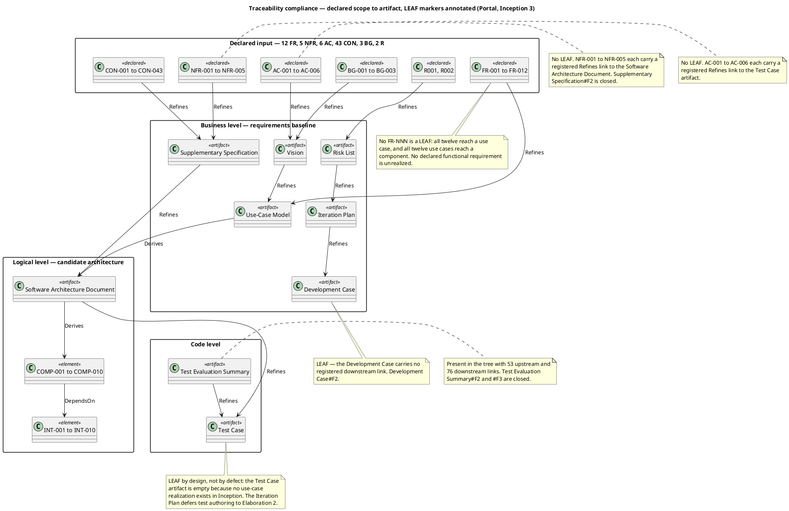
```plantuml
@startuml
title Traceability compliance — declared scope to artifact, LEAF markers annotated (Portal, Inception 3)

skinparam classAttributeIconSize 0
skinparam packageStyle rectangle

package "Declared input — 12 FR, 5 NFR, 6 AC, 43 CON, 3 BG, 2 R" as DECL {
  class "FR-001 to FR-012" as FR <<declared>>
  class "NFR-001 to NFR-005" as NFR <<declared>>
  class "AC-001 to AC-006" as AC <<declared>>
  class "CON-001 to CON-043" as CON <<declared>>
  class "BG-001 to BG-003" as BG <<declared>>
  class "R001, R002" as R <<declared>>
}

package "Business level — requirements baseline" as BIZ {
  class "Vision" as VIS <<artifact>>
  class "Use-Case Model" as UCM <<artifact>>
  class "Supplementary Specification" as SS <<artifact>>
  class "Risk List" as RL <<artifact>>
  class "Iteration Plan" as IP <<artifact>>
  class "Development Case" as DC <<artifact>>
}

package "Logical level — candidate architecture" as LOG {
  class "Software Architecture Document" as SAD <<artifact>>
  class "COMP-001 to COMP-010" as COMP <<element>>
  class "INT-001 to INT-010" as INT <<element>>
}

package "Code level" as CODE {
  class "Test Evaluation Summary" as TES <<artifact>>
  class "Test Case" as TC <<artifact>>
}

FR --> UCM : Refines
NFR --> SS : Refines
AC --> VIS : Refines
CON --> SS : Refines
BG --> VIS : Refines
R --> RL : Refines

UCM --> SAD : Derives
SS --> SAD : Refines
VIS --> UCM : Refines
RL --> IP : Refines
IP --> DC : Refines

SAD --> COMP : Derives
COMP --> INT : DependsOn
SAD --> TC : Refines
TES --> TC : Refines

note right of NFR
  No LEAF. NFR-001 to NFR-005 each carry a
  registered Refines link to the Software
  Architecture Document. Supplementary
  Specification#F2 is closed.
end note

note right of AC
  No LEAF. AC-001 to AC-006 each carry a
  registered Refines link to the Test Case
  artifact.
end note

note right of TES
  Present in the tree with 53 upstream and
  76 downstream links. Test Evaluation
  Summary#F2 and #F3 are closed.
end note

note bottom of DC
  LEAF — the Development Case carries no
  registered downstream link. Development
  Case#F2.
end note

note bottom of FR
  No FR-NNN is a LEAF: all twelve reach a use
  case, and all twelve use cases reach a
  component. No declared functional requirement
  is unrealized.
end note

note bottom of TC
  LEAF by design, not by defect: the Test Case
  artifact is empty because no use-case
  realization exists in Inception. The Iteration
  Plan defers test authoring to Elaboration 2.
end note

DECL -[hidden]- BIZ
BIZ -[hidden]- LOG
LOG -[hidden]- CODE
@enduml
```

**What the graph shows.** Every one of the twelve declared requirements reaches a use case — no `«LEAF»` at the Business level for any `FR-NNN`, so no functional requirement is unrealized. Every use case reaches a component in the Software Architecture Document. No `«SUSPECT → role»` edge exists anywhere in the tree, so no role is holding an unreviewed change. The `Test Case` node is a `«LEAF»` by design: the artifact is empty because no use-case realization exists in Inception, and the Iteration Plan defers test authoring to Elaboration 2.

**What the graph does not show.** The Development Case carries no registered downstream link, which is Development Case#F2. Two of the Software Architecture Document's twenty declared element-level rows are not carried as declared, which is Software Architecture Document#F1. The declared coverage of the acceptance criteria is asserted in prose and unverifiable from the graph until the Test Case artifact carries elements.

**Coverage of the declared input.** All twelve FR, five NFR, six AC, forty-three CON, three BG and two declared risks are cited by at least one artifact. No artifact cites an identifier outside the declared families. No artifact quotes the stakeholder in place of citing an identifier.

#### Iteration 2

Two findings: two Major, no Critical, no Minor. Six artifacts carry no new finding from this lens.

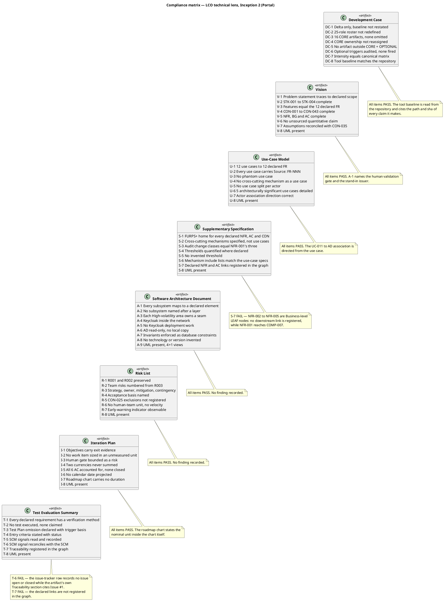
```plantuml
@startuml
title Compliance matrix — LCO technical lens, Inception 2 (Portal)

skinparam classAttributeIconSize 0
skinparam classFontStyle bold

class "Development Case" as DC <<artifact>> {
  DC-1 Delta only, baseline not restated
  DC-2 25-role roster not redefined
  DC-3 16 CORE artifacts, none omitted
  DC-4 CORE ownership not reassigned
  DC-5 No artifact outside CORE + OPTIONAL
  DC-6 Optional triggers audited, none fired
  DC-7 Intensity equals canonical matrix
  DC-8 Tool baseline matches the repository
}

class "Vision" as VIS <<artifact>> {
  V-1 Problem statement traces to declared scope
  V-2 STK-001 to STK-004 complete
  V-3 Features equal the 12 declared FR
  V-4 CON-001 to CON-043 complete
  V-5 NFR, BG and AC complete
  V-6 No unsourced quantitative claim
  V-7 Assumptions reconciled with CON-035
  V-8 UML present
}

class "Use-Case Model" as UCM <<artifact>> {
  U-1 12 use cases to 12 declared FR
  U-2 Every use case carries Source: FR-NNN
  U-3 No phantom use case
  U-4 No cross-cutting mechanism as a use case
  U-5 No use case split per actor
  U-6 5 architecturally significant use cases detailed
  U-7 Actor association direction correct
  U-8 UML present
}

class "Supplementary Specification" as SS <<artifact>> {
  S-1 FURPS+ home for every declared NFR, AC and CON
  S-2 Cross-cutting mechanisms specified, not use cases
  S-3 Audit change classes equal NFR-001's three
  S-4 Thresholds quantified where declared
  S-5 No invented threshold
  S-6 Mechanism include lists match the use-case specs
  S-7 Declared NFR and AC links registered in the graph
  S-8 UML present
}

class "Software Architecture Document" as SAD <<artifact>> {
  A-1 Every subsystem maps to a declared element
  A-2 No subsystem named after a layer
  A-3 Each High-volatility area owns a seam
  A-4 Keycloak inside the network
  A-5 No Keycloak deployment work
  A-6 AD read-only, no local copy
  A-7 Invariants enforced as database constraints
  A-8 No technology or version invented
  A-9 UML present, 4+1 views
}

class "Risk List" as RL <<artifact>> {
  R-1 R001 and R002 preserved
  R-2 Team risks numbered from R003
  R-3 Strategy, owner, mitigation, contingency
  R-4 Acceptance basis named
  R-5 CON-025 exclusions not registered
  R-6 No human-team unit, no velocity
  R-7 Early-warning indicator observable
  R-8 UML present
}

class "Iteration Plan" as IP <<artifact>> {
  I-1 Objectives carry exit evidence
  I-2 No work item sized in an unmeasured unit
  I-3 Human gate bounded as a risk
  I-4 Two currencies never summed
  I-5 All 6 AC accounted for, none closed
  I-6 No calendar date projected
  I-7 Roadmap chart carries no duration
  I-8 UML present
}

class "Test Evaluation Summary" as TES <<artifact>> {
  T-1 Every declared requirement has a verification method
  T-2 No test executed, none claimed
  T-3 Test Plan omission declared with trigger basis
  T-4 Entry criteria stated with status
  T-5 SCM signals read and recorded
  T-6 SCM signal reconciles with the SCM
  T-7 Traceability registered in the graph
  T-8 UML present
}

note bottom of DC
  All items PASS. The tool baseline is read from
  the repository and cites the path and sha of
  every claim it makes.
end note

note bottom of VIS
  All items PASS. A-1 names the human validation
  gate and the stand-in issuer.
end note

note bottom of UCM
  All items PASS. The UC-011 to AD association is
  directed from the use case.
end note

note bottom of SS
  S-7 FAIL — NFR-002 to NFR-005 are Business-level
  LEAF nodes: no downstream link is registered,
  while NFR-001 reaches COMP-007.
end note

note bottom of TES
  T-6 FAIL — the issue-tracker row records no issue
  open or closed while the artifact's own
  Traceability section cites Issue #1.
  T-7 FAIL — the declared links are not registered
  in the graph.
end note

note bottom of SAD
  All items PASS. No finding recorded.
end note

note bottom of RL
  All items PASS. No finding recorded.
end note

note bottom of IP
  All items PASS. The roadmap chart states the
  nominal unit inside the chart itself.
end note

DC -[hidden]- VIS
VIS -[hidden]- UCM
UCM -[hidden]- SS
SS -[hidden]- SAD
SAD -[hidden]- RL
RL -[hidden]- IP
IP -[hidden]- TES
@enduml
```

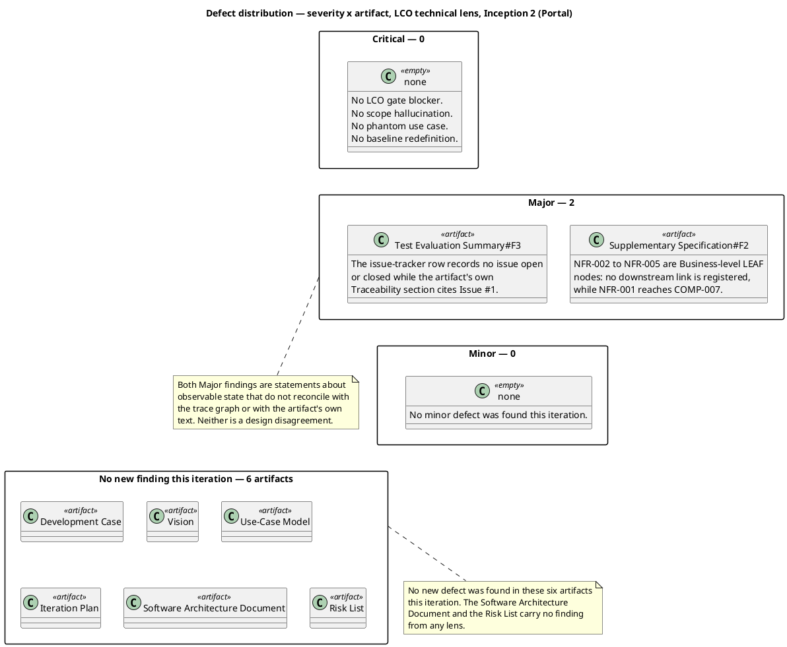
```plantuml
@startuml
title Defect distribution — severity x artifact, LCO technical lens, Inception 2 (Portal)

skinparam classAttributeIconSize 0
skinparam packageStyle rectangle

package "Critical — 0" as CRIT {
  class "none" as C0 <<empty>> {
    No LCO gate blocker.
    No scope hallucination.
    No phantom use case.
    No baseline redefinition.
  }
}

package "Major — 2" as MAJ {
  class "Supplementary Specification#F2" as M1 <<artifact>> {
    NFR-002 to NFR-005 are Business-level LEAF
    nodes: no downstream link is registered,
    while NFR-001 reaches COMP-007.
  }
  class "Test Evaluation Summary#F3" as M2 <<artifact>> {
    The issue-tracker row records no issue open
    or closed while the artifact's own
    Traceability section cites Issue #1.
  }
}

package "Minor — 0" as MIN {
  class "none" as N0 <<empty>> {
    No minor defect was found this iteration.
  }
}

package "No new finding this iteration — 6 artifacts" as CLEAN {
  class "Development Case" as K1 <<artifact>>
  class "Vision" as K2 <<artifact>>
  class "Use-Case Model" as K3 <<artifact>>
  class "Iteration Plan" as K4 <<artifact>>
  class "Software Architecture Document" as K5 <<artifact>>
  class "Risk List" as K6 <<artifact>>
}

note bottom of MAJ
  Both Major findings are statements about
  observable state that do not reconcile with
  the trace graph or with the artifact's own
  text. Neither is a design disagreement.
end note

note bottom of CLEAN
  No new defect was found in these six artifacts
  this iteration. The Software Architecture
  Document and the Risk List carry no finding
  from any lens.
end note

CRIT -[hidden]- MAJ
MAJ -[hidden]- MIN
MIN -[hidden]- CLEAN
@enduml
```

##### Supplementary Specification — Major

**F2 — The declared element-level traceability is not registered in the trace repository.** The Traceability table declares `Supplementary Specification | NFR-001, NFR-002, NFR-003, NFR-004, NFR-005 | Refines | Software Architecture Document` and `Supplementary Specification | AC-001, AC-002, AC-003, AC-004, AC-005, AC-006 | Refines | Test Case`. The graph carries the artifact-level links but not the element-level ones: the Requirements Traceability Matrix shows `NFR-002`, `NFR-003`, `NFR-004` and `NFR-005` as Business-level LEAF nodes with no downstream link, while `NFR-001` alone reaches `COMP-007`. The declared coverage of the five non-functional requirements therefore cannot be verified from the graph. This is the same defect class as Test Evaluation Summary#F2 and is recorded separately because the finding key is scoped per artifact.

*Remediation.* Register the element-level upstream links in the trace repository — `NFR-002` to `NFR-005` to the Software Architecture Document, and `AC-001` to `AC-006` to the Test Case artifact — so the declared coverage is machine-verifiable. Registration is the trace steward's act: raise it to the SystemAnalyst, who already holds Issue #1 for the Test Evaluation Summary's links, and register both in the same pass. If the element-level link is judged redundant with the artifact-level link, say so in the Traceability table and drop the element-level rows, so the table states what the graph carries.

*Evidence.* Supplementary Specification, Traceability: `Supplementary Specification | NFR-001, NFR-002, NFR-003, NFR-004, NFR-005 | Refines | Software Architecture Document` against `model_generate_rtm(sourceLevel=Business)`: `NFR-002 | Requirement | Business | (none) | - | - | - | -`, likewise `NFR-003`, `NFR-004`, `NFR-005`; `NFR-001` reaches `COMP-007`.

##### Development Case — no new finding

No defect recorded this iteration. The S1 tool assessment is read from the repository and every claim in it cites the path and sha it was read from: the CI workflow at `.github/workflows/ci.yml`, the solution manifest `Portal.sln` with its two projects, and the build on `main`. The gap table carries only `CONTRIBUTING.md`, the lint/analyzer configuration and the test stand-ins, each with a named owner. The Elaboration iteration-preparation checkpoint does not carry the CI workflow as an outstanding condition. The tailoring decisions T-1 to T-7, the classification verdicts, the optional-trigger table and the intensity statement are baseline-conformant: the roster is not redefined, no CORE artifact is omitted, no ownership is reassigned, no artifact outside the CORE plus OPTIONAL universe is listed, and the intensity equals the canonical matrix. All six optional triggers were re-audited against their §5.2 conditions and none fired. Approved from this lens.

##### Vision — no new finding

No defect recorded this iteration. A-1 names the human validation gate performed by Infrastructure with HR and states that team build and test is against the stand-in OIDC issuer, with CON-035 and A-3 named as the governing rules. The problem statement, the stakeholder summary, the features table, the constraints and the non-functional requirements all trace to the declared scope; the twelve features equal the twelve declared requirements with no surplus; no unsourced quantitative claim appears; and the declared element-level links are registered in the graph. Approved from this lens.

##### Use-Case Model — no new finding

No defect recorded this iteration. The UC-011 to Active Directory association is directed from the use case to the external system, so the portal is the initiating end and the diagram agrees with the Actors table. Twelve declared requirements map one-to-one to twelve use cases, each carrying its `Source: FR-NNN`; no phantom use case exists; no cross-cutting mechanism was promoted to a use case; no use case was split per actor; and each of the twelve use cases carries a registered `Derives` link to the component that realizes it. Approved from this lens.

##### Iteration Plan — no new finding

No defect recorded this iteration. The roadmap chart states the nominal unit inside the chart itself, in its title and in a note, so it cannot be read as a schedule. No work item carries a size in a unit this system does not measure; the two currencies are reported apart and never summed; the human gates are bounded as risks with the 14-day process bound; all six acceptance criteria are accounted for and none is closed; no calendar date is projected from an estimate; and the role profile records the ManagementReviewer and the BusinessReviewer at the lifecycle gates. Approved from this lens.

#### Supplementary Specification — Major

**F2 — The declared element-level traceability is not registered in the trace repository.** The Traceability table declares `Supplementary Specification | NFR-001, NFR-002, NFR-003, NFR-004, NFR-005 | Refines | Software Architecture Document` and `Supplementary Specification | AC-001, AC-002, AC-003, AC-004, AC-005, AC-006 | Refines | Test Case`. The graph carries the artifact-level links but not the element-level ones: the Requirements Traceability Matrix shows `NFR-002`, `NFR-003`, `NFR-004` and `NFR-005` as Business-level LEAF nodes with no downstream link, while `NFR-001` alone reaches `COMP-007`. The declared coverage of the five non-functional requirements therefore cannot be verified from the graph. This is the same defect class as Test Evaluation Summary#F2 and is recorded separately because the finding key is scoped per artifact.

*Remediation.* Register the element-level upstream links in the trace repository — `NFR-002` to `NFR-005` to the Software Architecture Document, and `AC-001` to `AC-006` to the Test Case artifact — so the declared coverage is machine-verifiable. Registration is the trace steward's act: raise it to the SystemAnalyst, who already holds Issue #1 for the Test Evaluation Summary's links, and register both in the same pass. If the element-level link is judged redundant with the artifact-level link, say so in the Traceability table and drop the element-level rows, so the table states what the graph carries.

*Evidence.* Supplementary Specification, Traceability: `Supplementary Specification | NFR-001, NFR-002, NFR-003, NFR-004, NFR-005 | Refines | Software Architecture Document` against `model_generate_rtm(sourceLevel=Business)`: `NFR-002 | Requirement | Business | (none) | - | - | - | -`, likewise `NFR-003`, `NFR-004`, `NFR-005`; `NFR-001` reaches `COMP-007`.

#### Development Case — no new finding

No defect recorded this iteration. The S1 tool assessment is read from the repository and every claim in it cites the path and sha it was read from: the CI workflow at `.github/workflows/ci.yml`, the solution manifest `Portal.sln` with its two projects, and the build on `main`. The gap table carries only `CONTRIBUTING.md`, the lint/analyzer configuration and the test stand-ins, each with a named owner. The Elaboration iteration-preparation checkpoint does not carry the CI workflow as an outstanding condition. The tailoring decisions T-1 to T-7, the classification verdicts, the optional-trigger table and the intensity statement are baseline-conformant: the roster is not redefined, no CORE artifact is omitted, no ownership is reassigned, no artifact outside the CORE plus OPTIONAL universe is listed, and the intensity equals the canonical matrix. All six optional triggers were re-audited against their §5.2 conditions and none fired. Approved from this lens.

#### Vision — no new finding

No defect recorded this iteration. A-1 names the human validation gate performed by Infrastructure with HR and states that team build and test is against the stand-in OIDC issuer, with CON-035 and A-3 named as the governing rules. The problem statement, the stakeholder summary, the features table, the constraints and the non-functional requirements all trace to the declared scope; the twelve features equal the twelve declared requirements with no surplus; no unsourced quantitative claim appears; and the declared element-level links are registered in the graph. Approved from this lens.

#### Use-Case Model — no new finding

No defect recorded this iteration. The UC-011 to Active Directory association is directed from the use case to the external system, so the portal is the initiating end and the diagram agrees with the Actors table. Twelve declared requirements map one-to-one to twelve use cases, each carrying its `Source: FR-NNN`; no phantom use case exists; no cross-cutting mechanism was promoted to a use case; no use case was split per actor; and each of the twelve use cases carries a registered `Derives` link to the component that realizes it. Approved from this lens.

#### Iteration Plan — no new finding

No defect recorded this iteration. The roadmap chart states the nominal unit inside the chart itself, in its title and in a note, so it cannot be read as a schedule. No work item carries a size in a unit this system does not measure; the two currencies are reported apart and never summed; the human gates are bounded as risks with the 14-day process bound; all six acceptance criteria are accounted for and none is closed; no calendar date is projected from an estimate; and the role profile records the ManagementReviewer and the BusinessReviewer at the lifecycle gates. Approved from this lens.

#### Iteration 3

Three findings: two Major, one Minor, no Critical. Six artifacts carry no new finding from this lens. Two prior findings of this lens are closed this iteration.

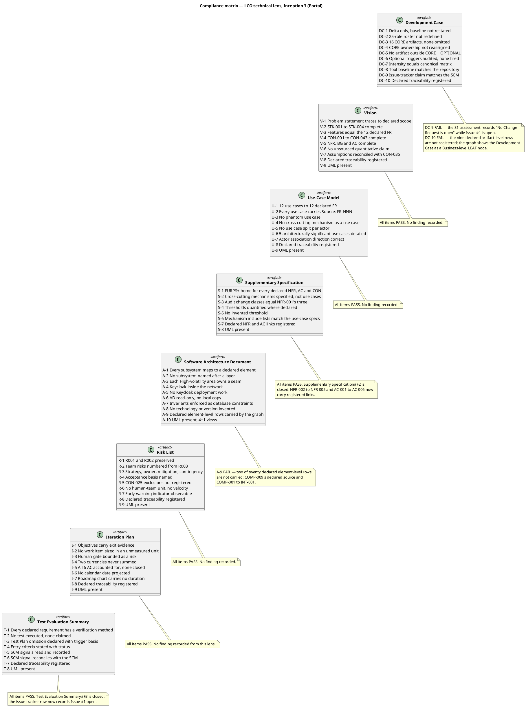
```plantuml
@startuml
title Compliance matrix — LCO technical lens, Inception 3 (Portal)

skinparam classAttributeIconSize 0
skinparam classFontStyle bold

class "Development Case" as DC <<artifact>> {
  DC-1 Delta only, baseline not restated
  DC-2 25-role roster not redefined
  DC-3 16 CORE artifacts, none omitted
  DC-4 CORE ownership not reassigned
  DC-5 No artifact outside CORE + OPTIONAL
  DC-6 Optional triggers audited, none fired
  DC-7 Intensity equals canonical matrix
  DC-8 Tool baseline matches the repository
  DC-9 Issue-tracker claim matches the SCM
  DC-10 Declared traceability registered
}

class "Vision" as VIS <<artifact>> {
  V-1 Problem statement traces to declared scope
  V-2 STK-001 to STK-004 complete
  V-3 Features equal the 12 declared FR
  V-4 CON-001 to CON-043 complete
  V-5 NFR, BG and AC complete
  V-6 No unsourced quantitative claim
  V-7 Assumptions reconciled with CON-035
  V-8 Declared traceability registered
  V-9 UML present
}

class "Use-Case Model" as UCM <<artifact>> {
  U-1 12 use cases to 12 declared FR
  U-2 Every use case carries Source: FR-NNN
  U-3 No phantom use case
  U-4 No cross-cutting mechanism as a use case
  U-5 No use case split per actor
  U-6 5 architecturally significant use cases detailed
  U-7 Actor association direction correct
  U-8 Declared traceability registered
  U-9 UML present
}

class "Supplementary Specification" as SS <<artifact>> {
  S-1 FURPS+ home for every declared NFR, AC and CON
  S-2 Cross-cutting mechanisms specified, not use cases
  S-3 Audit change classes equal NFR-001's three
  S-4 Thresholds quantified where declared
  S-5 No invented threshold
  S-6 Mechanism include lists match the use-case specs
  S-7 Declared NFR and AC links registered
  S-8 UML present
}

class "Software Architecture Document" as SAD <<artifact>> {
  A-1 Every subsystem maps to a declared element
  A-2 No subsystem named after a layer
  A-3 Each High-volatility area owns a seam
  A-4 Keycloak inside the network
  A-5 No Keycloak deployment work
  A-6 AD read-only, no local copy
  A-7 Invariants enforced as database constraints
  A-8 No technology or version invented
  A-9 Declared element-level rows carried by the graph
  A-10 UML present, 4+1 views
}

class "Risk List" as RL <<artifact>> {
  R-1 R001 and R002 preserved
  R-2 Team risks numbered from R003
  R-3 Strategy, owner, mitigation, contingency
  R-4 Acceptance basis named
  R-5 CON-025 exclusions not registered
  R-6 No human-team unit, no velocity
  R-7 Early-warning indicator observable
  R-8 Declared traceability registered
  R-9 UML present
}

class "Iteration Plan" as IP <<artifact>> {
  I-1 Objectives carry exit evidence
  I-2 No work item sized in an unmeasured unit
  I-3 Human gate bounded as a risk
  I-4 Two currencies never summed
  I-5 All 6 AC accounted for, none closed
  I-6 No calendar date projected
  I-7 Roadmap chart carries no duration
  I-8 Declared traceability registered
  I-9 UML present
}

class "Test Evaluation Summary" as TES <<artifact>> {
  T-1 Every declared requirement has a verification method
  T-2 No test executed, none claimed
  T-3 Test Plan omission declared with trigger basis
  T-4 Entry criteria stated with status
  T-5 SCM signals read and recorded
  T-6 SCM signal reconciles with the SCM
  T-7 Declared traceability registered
  T-8 UML present
}

note bottom of DC
  DC-9 FAIL — the S1 assessment records "No Change
  Request is open" while Issue #1 is open.
  DC-10 FAIL — the nine declared artifact-level rows
  are not registered; the graph shows the Development
  Case as a Business-level LEAF node.
end note

note bottom of SAD
  A-9 FAIL — two of twenty declared element-level rows
  are not carried: COMP-009's declared source and
  COMP-001 to INT-001.
end note

note bottom of VIS
  All items PASS. No finding recorded.
end note

note bottom of UCM
  All items PASS. No finding recorded.
end note

note bottom of SS
  All items PASS. Supplementary Specification#F2 is
  closed: NFR-002 to NFR-005 and AC-001 to AC-006 now
  carry registered links.
end note

note bottom of RL
  All items PASS. No finding recorded.
end note

note bottom of IP
  All items PASS. No finding recorded from this lens.
end note

note bottom of TES
  All items PASS. Test Evaluation Summary#F3 is closed:
  the issue-tracker row now records Issue #1 open.
end note

DC -[hidden]- VIS
VIS -[hidden]- UCM
UCM -[hidden]- SS
SS -[hidden]- SAD
SAD -[hidden]- RL
RL -[hidden]- IP
IP -[hidden]- TES
@enduml
```

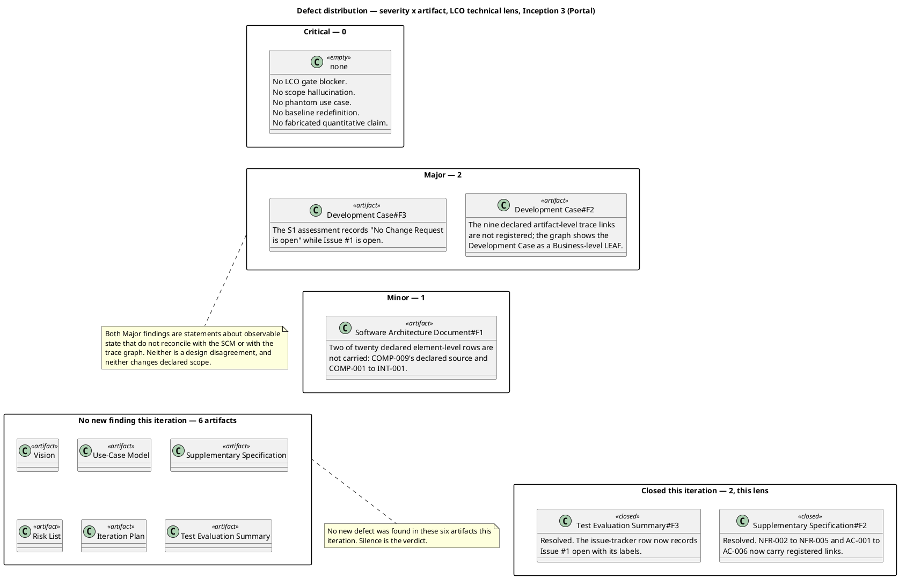
```plantuml
@startuml
title Defect distribution — severity x artifact, LCO technical lens, Inception 3 (Portal)

skinparam classAttributeIconSize 0
skinparam packageStyle rectangle

package "Critical — 0" as CRIT {
  class "none" as C0 <<empty>> {
    No LCO gate blocker.
    No scope hallucination.
    No phantom use case.
    No baseline redefinition.
    No fabricated quantitative claim.
  }
}

package "Major — 2" as MAJ {
  class "Development Case#F2" as M1 <<artifact>> {
    The nine declared artifact-level trace links
    are not registered; the graph shows the
    Development Case as a Business-level LEAF.
  }
  class "Development Case#F3" as M2 <<artifact>> {
    The S1 assessment records "No Change Request
    is open" while Issue #1 is open.
  }
}

package "Minor — 1" as MIN {
  class "Software Architecture Document#F1" as N1 <<artifact>> {
    Two of twenty declared element-level rows are
    not carried: COMP-009's declared source and
    COMP-001 to INT-001.
  }
}

package "No new finding this iteration — 6 artifacts" as CLEAN {
  class "Vision" as K1 <<artifact>>
  class "Use-Case Model" as K2 <<artifact>>
  class "Supplementary Specification" as K3 <<artifact>>
  class "Risk List" as K4 <<artifact>>
  class "Iteration Plan" as K5 <<artifact>>
  class "Test Evaluation Summary" as K6 <<artifact>>
}

package "Closed this iteration — 2, this lens" as CLOSED {
  class "Supplementary Specification#F2" as C1 <<closed>> {
    Resolved. NFR-002 to NFR-005 and AC-001 to
    AC-006 now carry registered links.
  }
  class "Test Evaluation Summary#F3" as C2 <<closed>> {
    Resolved. The issue-tracker row now records
    Issue #1 open with its labels.
  }
}

note bottom of MAJ
  Both Major findings are statements about observable
  state that do not reconcile with the SCM or with the
  trace graph. Neither is a design disagreement, and
  neither changes declared scope.
end note

note bottom of CLEAN
  No new defect was found in these six artifacts this
  iteration. Silence is the verdict.
end note

CRIT -[hidden]- MAJ
MAJ -[hidden]- MIN
MIN -[hidden]- CLEAN
CLEAN -[hidden]- CLOSED
@enduml
```

##### Development Case — Major

**F2 — The declared traceability is not registered in the trace repository, and the artifact asserts the opposite.** The Traceability table declares nine artifact-level rows — the Development Case refining the Software Architecture Document, the Design Model, the Supplementary Specification, the Risk List, the Iteration Plan and the Iteration Assessment, the Implementation Model and the User Documentation, the Use-Case Model, the Test Case and the Test Evaluation Summary, and the Vision — and its Registration paragraph closes "so this table states what the graph carries". The graph carries none of them: `model_get_downstream(projectId, 'Development Case')` returns no links, and `model_generate_rtm(sourceLevel=Business)` reports `Development Case | DevelopmentCase | Business | (none) | - | - | - | -`, a Business-level LEAF node. The declared basis of the tailoring therefore cannot be verified from the graph, and the artifact's own T-8 rule — an artifact's Traceability table states what the graph carries — is not met. This is the same defect class as Supplementary Specification#F2 and Test Evaluation Summary#F2, recorded separately because the finding key is scoped per artifact.

*Remediation.* Register the nine declared artifact-level links in the trace repository, or drop the rows and state that the Development Case carries no registered trace link, so the table states what the graph carries. Registration is the trace steward's act (T-8); raise it to the SystemAnalyst in the same pass as any remaining registration work, and record the outcome against Issue #1.

*Evidence.* Development Case, Traceability: `Development Case | CON-001, CON-002, CON-030, CON-031, CON-032, CON-033, CON-035, CON-036, CON-039 | Refines | Software Architecture Document` and the eight further rows, closing "so this table states what the graph carries." against `model_get_downstream(projectId, 'Development Case')` = "No trace links found for 'Development Case' (direction: downstream)" and `model_generate_rtm(sourceLevel=Business)`: `Development Case | DevelopmentCase | Business | (none) | - | - | - | -`.

**F3 — The S1 tool assessment records "No Change Request is open" while the issue tracker holds Issue #1 open.** The section "Organization and tool assessment (S1, 2026-10-07)" closes its Absent paragraph with "No Change Request is open." The issue tracker holds Issue #1, "Trace registration — Test Evaluation Summary upstream links (Test Evaluation Summary#F2)", labelled `trace-registration`, `priority-high`, `no-scope-change`. The artifact asserts a current fact about the issue tracker, which is the authoritative record for Change Requests, and the fact is false as of this review. The same defect class was recorded against the Test Evaluation Summary in Inception 2 as Test Evaluation Summary#F3, and the Development Case is the artifact that carries the trace-registration process rule (T-8) the open issue is tracking.

*Remediation.* Re-read the issue tracker in all states and replace the claim with the observed value: Issue #1 open, labelled `trace-registration`, `priority-high`, `no-scope-change`, carrying the trace-registration work. If the sentence is intended as a point-in-time record of the S1 assessment, date it and state the observed value at that date, so the artifact does not assert a current fact that is false.

*Evidence.* Development Case, Organization and tool assessment: "**Absent.** `CONTRIBUTING.md` and the lint/analyzer configuration. No Change Request is open." against `scm_list_issues(state=all)` = `#1 [open] Trace registration — Test Evaluation Summary upstream links (Test Evaluation Summary#F2) — labels: [trace-registration, priority-high, no-scope-change]`.

##### Software Architecture Document — Minor

**F1 — Two declared element-level rows of the Traceability table are not carried by the graph as declared.** The table declares `COMP-009 | CON-032, R001 | Derives` and `INT-001 | COMP-001 | DependsOn`. The graph carries no link from CON-032 or R001 to COMP-009 — `model_get_downstream('CON-032')` returns the Supplementary Specification and the Software Architecture Document only, and `model_get_downstream('R001')` returns the Risk List, the Test Evaluation Summary and UC-011 — and no link from COMP-001 to INT-001: `model_get_upstream('INT-001')` returns the Test Evaluation Summary only. The registered source of COMP-009 is UC-011, not the declared CON-032 and R001. The other eighteen element-level rows verify against the graph. The artifact's own T-8 rule requires the Traceability table to state what the graph carries.

*Remediation.* Align the two rows with the graph: state COMP-009's registered source as UC-011, and either register COMP-001 to INT-001 or drop the row. The remaining eighteen element-level rows and the two artifact-level rows need no change.

*Evidence.* Software Architecture Document, Traceability: `COMP-009 | CON-032, R001 | Derives | —` and `INT-001 | COMP-001 | DependsOn | —` against `model_get_downstream('CON-032')` = Supplementary Specification, Software Architecture Document; `model_get_downstream('R001')` = Risk List, Test Evaluation Summary, UC-011; `model_get_upstream('INT-001')` = Test Evaluation Summary; `model_get_upstream('COMP-009')` = Test Evaluation Summary, INT-009, UC-011.

##### Vision — no new finding

No defect recorded this iteration. A-1 names the human validation gate performed by Infrastructure with HR and states that team build and test is against the stand-in OIDC issuer, with CON-035 and A-3 named as the governing rules. The problem statement, the stakeholder summary, the features table, the constraints and the non-functional requirements all trace to the declared scope; the twelve features equal the twelve declared requirements with no surplus; no unsourced quantitative claim appears; and the declared element-level links are registered in the graph. Approved from this lens.

##### Use-Case Model — no new finding

No defect recorded this iteration. The UC-011 to Active Directory association is directed from the use case to the external system, so the portal is the initiating end and the diagram agrees with the Actors table. Twelve declared requirements map one-to-one to twelve use cases, each carrying its `Source: FR-NNN`; no phantom use case exists; no cross-cutting mechanism was promoted to a use case; no use case was split per actor; and each of the twelve use cases carries a registered `Derives` link to the component that realizes it. Approved from this lens.

##### Supplementary Specification — no new finding

No defect recorded this iteration. Supplementary Specification#F2 is closed: `model_generate_rtm(sourceLevel=Business)` reports a `Refines` link to the Software Architecture Document for each of NFR-002, NFR-003, NFR-004 and NFR-005, and a `Refines` link to the Test Case artifact for each of AC-001 to AC-006, all in state OK, so no Business-level LEAF node remains for any of the nine elements the finding named. The FURPS+ classification gives every declared NFR, acceptance criterion and constraint exactly one home; the cross-cutting mechanisms are specified as mechanisms and included by the use cases that depend on them; the audit change classes equal NFR-001's three; and no threshold is invented. Approved from this lens.

##### Risk List — no new finding

No defect recorded this iteration. R001 and R002 are preserved with their declared probability and impact; R003 to R011 are numbered in the order raised per CON-023; every risk carries a strategy, an owner, a mitigation, a contingency and an observable early-warning indicator; every accepted risk names its CON-024 basis; R011 is adopted under CON-023 and avoided, so no acceptance basis is claimed for it; the CON-025 exclusions are not registered; and no human-team unit or velocity appears. Approved from this lens.

##### Iteration Plan — no new finding

No defect recorded this iteration. The roadmap chart states the nominal unit inside the chart itself, in its title and in a note, so it cannot be read as a schedule. No work item carries a size in a unit this system does not measure; the two currencies are reported apart and never summed; the human gates are bounded as risks with the 14-day process bound; all six acceptance criteria are accounted for and none is closed; no calendar date is projected from an estimate; and the role profile records the ManagementReviewer and the BusinessReviewer at the lifecycle gates. Approved from this lens.

##### Test Evaluation Summary — no new finding

No defect recorded this iteration. Test Evaluation Summary#F3 is closed: the SCM quality signals table records Issue #1 open with its labels, which matches `scm_list_issues(state=all)`, and the reading drawn from it is corrected — one Change Request is open, it is the tracking reference for the registration act and is not a defect against the portal. The build-status row cites an observed run and reads it as the per-push build-and-test the regression rule needs, with entry criterion E-6 recorded as met. The declared upstream links are registered: `model_get_upstream(projectId, 'Test Evaluation Summary')` returns 53 links and the artifact is present in the trace tree. Approved from this lens.

##### Traceability compliance — this iteration

```plantuml
@startuml
title Traceability compliance — declared scope to artifact, LEAF markers annotated (Portal, Inception 3)

skinparam classAttributeIconSize 0
skinparam packageStyle rectangle

package "Declared input — 12 FR, 5 NFR, 6 AC, 43 CON, 3 BG, 2 R" as DECL {
  class "FR-001 to FR-012" as FR <<declared>>
  class "NFR-001 to NFR-005" as NFR <<declared>>
  class "AC-001 to AC-006" as AC <<declared>>
  class "CON-001 to CON-043" as CON <<declared>>
  class "BG-001 to BG-003" as BG <<declared>>
  class "R001, R002" as R <<declared>>
}

package "Business level — requirements baseline" as BIZ {
  class "Vision" as VIS <<artifact>>
  class "Use-Case Model" as UCM <<artifact>>
  class "Supplementary Specification" as SS <<artifact>>
  class "Risk List" as RL <<artifact>>
  class "Iteration Plan" as IP <<artifact>>
  class "Development Case" as DC <<artifact>>
}

package "Logical level — candidate architecture" as LOG {
  class "Software Architecture Document" as SAD <<artifact>>
  class "COMP-001 to COMP-010" as COMP <<element>>
  class "INT-001 to INT-010" as INT <<element>>
}

package "Code level" as CODE {
  class "Test Evaluation Summary" as TES <<artifact>>
  class "Test Case" as TC <<artifact>>
}

FR --> UCM : Refines
NFR --> SS : Refines
AC --> VIS : Refines
CON --> SS : Refines
BG --> VIS : Refines
R --> RL : Refines

UCM --> SAD : Derives
SS --> SAD : Refines
VIS --> UCM : Refines
RL --> IP : Refines
IP --> DC : Refines

SAD --> COMP : Derives
COMP --> INT : DependsOn
SAD --> TC : Refines
TES --> TC : Refines

note right of NFR
  No LEAF. NFR-001 to NFR-005 each carry a
  registered Refines link to the Software
  Architecture Document. Supplementary
  Specification#F2 is closed.
end note

note right of AC
  No LEAF. AC-001 to AC-006 each carry a
  registered Refines link to the Test Case
  artifact.
end note

note right of TES
  Present in the tree with 53 upstream and
  76 downstream links. Test Evaluation
  Summary#F2 and #F3 are closed.
end note

note bottom of DC
  LEAF — the Development Case carries no
  registered downstream link. Development
  Case#F2.
end note

note bottom of FR
  No FR-NNN is a LEAF: all twelve reach a use
  case, and all twelve use cases reach a
  component. No declared functional requirement
  is unrealized.
end note

note bottom of TC
  LEAF by design, not by defect: the Test Case
  artifact is empty because no use-case
  realization exists in Inception. The Iteration
  Plan defers test authoring to Elaboration 2.
end note

DECL -[hidden]- BIZ
BIZ -[hidden]- LOG
LOG -[hidden]- CODE
@enduml
```

**What the graph shows.** Every one of the twelve declared requirements reaches a use case — no `«LEAF»` at the Business level for any `FR-NNN`, so no functional requirement is unrealized. Every use case reaches a component in the Software Architecture Document. No `«SUSPECT → role»` edge exists anywhere in the tree, so no role is holding an unreviewed change. The `Test Case` node is a `«LEAF»` by design: the artifact is empty because no use-case realization exists in Inception, and the Iteration Plan defers test authoring to Elaboration 2.

**What the graph does not show.** The Development Case carries no registered downstream link, which is Development Case#F2. Two of the Software Architecture Document's twenty declared element-level rows are not carried as declared, which is Software Architecture Document#F1. The declared coverage of the acceptance criteria is asserted in prose and unverifiable from the graph until the Test Case artifact carries elements.

**Coverage of the declared input.** All twelve FR, five NFR, six AC, forty-three CON, three BG and two declared risks are cited by at least one artifact. No artifact cites an identifier outside the declared families. No artifact quotes the stakeholder in place of citing an identifier.

#### Software Architecture Document — Minor

**F1 — Two declared element-level rows of the Traceability table are not carried by the graph as declared.** The table declares `COMP-009 | CON-032, R001 | Derives` and `INT-001 | COMP-001 | DependsOn`. The graph carries no link from CON-032 or R001 to COMP-009 — `model_get_downstream('CON-032')` returns the Supplementary Specification and the Software Architecture Document only, and `model_get_downstream('R001')` returns the Risk List, the Test Evaluation Summary and UC-011 — and no link from COMP-001 to INT-001: `model_get_upstream('INT-001')` returns the Test Evaluation Summary only. The registered source of COMP-009 is UC-011, not the declared CON-032 and R001. The other eighteen element-level rows verify against the graph. The artifact's own T-8 rule requires the Traceability table to state what the graph carries.

*Remediation.* Align the two rows with the graph: state COMP-009's registered source as UC-011, and either register COMP-001 to INT-001 or drop the row. The remaining eighteen element-level rows and the two artifact-level rows need no change.

*Evidence.* Software Architecture Document, Traceability: `COMP-009 | CON-032, R001 | Derives | —` and `INT-001 | COMP-001 | DependsOn | —` against `model_get_downstream('CON-032')` = Supplementary Specification, Software Architecture Document; `model_get_downstream('R001')` = Risk List, Test Evaluation Summary, UC-011; `model_get_upstream('INT-001')` = Test Evaluation Summary; `model_get_upstream('COMP-009')` = Test Evaluation Summary, INT-009, UC-011.

#### Supplementary Specification — no new finding

No defect recorded this iteration. Supplementary Specification#F2 is closed: `model_generate_rtm(sourceLevel=Business)` reports a `Refines` link to the Software Architecture Document for each of NFR-002, NFR-003, NFR-004 and NFR-005, and a `Refines` link to the Test Case artifact for each of AC-001 to AC-006, all in state OK, so no Business-level LEAF node remains for any of the nine elements the finding named. The FURPS+ classification gives every declared NFR, acceptance criterion and constraint exactly one home; the cross-cutting mechanisms are specified as mechanisms and included by the use cases that depend on them; the audit change classes equal NFR-001's three; and no threshold is invented. Approved from this lens.

#### Risk List — no new finding

No defect recorded this iteration. R001 and R002 are preserved with their declared probability and impact; R003 to R011 are numbered in the order raised per CON-023; every risk carries a strategy, an owner, a mitigation, a contingency and an observable early-warning indicator; every accepted risk names its CON-024 basis; R011 is adopted under CON-023 and avoided, so no acceptance basis is claimed for it; the CON-025 exclusions are not registered; and no human-team unit or velocity appears. Approved from this lens.

#### Test Evaluation Summary — no new finding

No defect recorded this iteration. Test Evaluation Summary#F3 is closed: the SCM quality signals table records Issue #1 open with its labels, which matches `scm_list_issues(state=all)`, and the reading drawn from it is corrected — one Change Request is open, it is the tracking reference for the registration act and is not a defect against the portal. The build-status row cites an observed run and reads it as the per-push build-and-test the regression rule needs, with entry criterion E-6 recorded as met. The declared upstream links are registered: `model_get_upstream(projectId, 'Test Evaluation Summary')` returns 53 links and the artifact is present in the trace tree. Approved from this lens.

### Business Reviewer lens
#### Iteration 1

**Zero findings from this lens.** No Critical, Major, Minor or Info finding is recorded against any artifact. The Business Modeling discipline is inactive and its inactivity is correct; there is no business-modeling defect to report. An artifact with no finding is Approved from this lens.

**Scoring — criterion by criterion.**

```plantuml
@startuml
title Business Reviewer scoring — LCO Inception 1 (Portal)

skinparam classAttributeIconSize 0
skinparam packageStyle rectangle

package "Criteria evaluated — N/A where the discipline is inactive" as CRIT {
  class "Scenario selection\ncorrect and explicit" as C1 <<criterion>> {
    Score: 10 / 10
    DC 4 verdict false, independently
    re-derived from declared scope
    and the eight persisted artifacts
  }
  class "BUC completeness test\nactor-initiated, value, end-to-end" as C2 <<criterion>> {
    Score: N/A
    No BUC exists. Correct: the three
    declared processes are system
    use cases, not business use cases
  }
  class "BUC realization adequacy\nworkers and entities" as C3 <<criterion>> {
    Score: N/A
    No realization expected in Inception
    and none required by an inactive
    discipline
  }
  class "Derivation bridge\nworker to system actor mapping" as C4 <<criterion>> {
    Score: N/A
    No business worker exists to map.
    The system actors are declared
    directly: STK-001, STK-004
  }
  class "Resource planning compliance\none resource per worker" as C5 <<criterion>> {
    Score: N/A
    No business worker, no business
    entity, no resource allocation
  }
  class "Same modeling technique\nat business level" as C6 <<criterion>> {
    Score: N/A
    No business-level model exists.
    No software stereotype was
    misapplied at business level
  }
  class "Stakeholder representation\ncoverage" as C7 <<criterion>> {
    Score: 9 / 10
    All four declared STK represented.
    No organizational part in declared
    scope is unmodelled
  }
  class "Business rules as formal\nconstraints" as C8 <<criterion>> {
    Score: 9 / 10
    CON-007 to CON-016 and CON-043 are
    stakeholder-declared, each with an
    ID and a bearing. Source is the
    declared constraint itself
  }
  class "UML presence and richness" as C9 <<criterion>> {
    Score: 9 / 10
    Eight artifacts, each carrying
    validated PlantUML. No prose-only
    model anywhere
  }
  class "Scope adherence\nno BM scope creep" as C10 <<criterion>> {
    Score: 10 / 10
    Zero BUC, zero BR-NNN, zero
    business stereotype. No undeclared
    business process was invented
  }
}

package "Aggregate" as AGG {
  class "Weighted verdict" as A1 <<verdict>> {
    Applicable criteria: 5
    Mean: 9.4 / 10
    N/A criteria: 5 of 10
  }
  class "Disposition" as A2 <<verdict>> {
    BR-OK-INACTIVE
    Discipline NOT APPLICABLE
    per DC 4
  }
  class "Findings emitted" as A3 <<verdict>> {
    Critical: 0
    Major: 0
    Minor: 0
    Info: 0
  }
}

C1 --> A1
C7 --> A1
C8 --> A1
C9 --> A1
C10 --> A1
A1 --> A2
A2 --> A3

note bottom of CRIT
  Five of ten criteria are N/A because
  the discipline is inactive. Scoring
  them would be a false defect: the
  anti-pattern of applying New Business
  standards to a non-BPL engagement.
end note

note bottom of AGG
  No finding is emitted. An artifact with
  no finding is Approved from this lens.
  The INACTIVE verdict is the verdict.
end note
@enduml
```

**Criterion justification.**

| Criterion | Score | Justification |
|---|---|---|
| Scenario selection | 10/10 | No business modeling scenario applies. The verdict was re-derived independently against the four DC §4 tests, all of which return NONE. The ProcessEngineer's claim was audited, not accepted. |
| BUC completeness | N/A | No business use case exists. The three declared processes (FR-001 to FR-012) are system use cases over a data-capture and publishing intranet, each initiated by a system actor inside the organization. Modelling them as BUCs would be a false artifact. |
| BUC realization adequacy | N/A | No realization is expected in Inception, and none is required by an inactive discipline. Penalizing their absence would be the anti-pattern of applying New Business standards to a non-BPL engagement. |
| Derivation bridge | N/A | There is no business worker to map to a system actor and no business entity to map to an analysis class. The system actors are declared directly (STK-001, STK-004) and the candidate analysis classes are derived from the use cases by the SoftwareArchitect (COMP-001 to COMP-010). The bridge this criterion guards does not exist because the business level does not exist. |
| Resource planning compliance | N/A | No business worker and no business entity exist, so no resource allocation can violate the single-resource principle. |
| Same modeling technique at business level | N/A | No business-level model exists, so no software stereotype (`<<entity>>`, `<<service>>`, `<<controller>>`) was misapplied at the business level. The system-level models use system stereotypes correctly. |
| Stakeholder representation coverage | 9/10 | All four declared stakeholders are represented: STK-001 and STK-004 as system actors, STK-003 as the operator of the external systems and of the portal in production, STK-002 as a supporting clarifier. No organizational part named in the declared scope is unmodelled. The score is not 10 because the coverage is bounded by the declared scope — no independent organizational survey was performed, and none is warranted for a 200-employee intranet with four declared stakeholders. |
| Business rules as formal constraints | 9/10 | CON-007 to CON-016 and CON-043 each carry a unique identifier, a named bearing on the use cases that must honour them, and a testable condition (at most one pair per day, at most one featured item, a closed list of four values, a field that may be empty). Their source is the declared constraint itself, which is the stakeholder's own statement — the strongest available attribution. They are not BPA-authored `BR-NNN` rules, and they do not need to be: the discipline that would author them is inactive. |
| UML presence and richness | 9/10 | All eight artifacts carry validated PlantUML. No artifact is a prose-only model. The Use-Case Model carries a use-case diagram and five activity and sequence diagrams; the Software Architecture Document carries all four-plus-one views; the Supplementary Specification carries a FURPS+ classification diagram and a mechanism-inclusion diagram. |
| Scope adherence | 10/10 | Zero business use cases, zero `BR-NNN` business rules, zero business stereotypes. No undeclared business process was invented, and no declared system use case was promoted to a business use case. The business dimension of the scope guard is clean. |

**Business-volatility annotation — the one business duty that survived the INACTIVE verdict.** The architecture-centric pillar of this lens requires that volatile business areas be explicitly annotated, because volatility that is not flagged will not be encapsulated. That duty would normally fall to the Business Process Analyst. Here it was discharged by the SystemAnalyst in the Vision's Features table — FR-004 (the export column contract and the empty-not-zero rule) and FR-010 (the featuring policy) are both marked `Volatility: High` — and consumed by the SoftwareArchitect, who gave each its own subsystem and interface (`COMP-002` behind `INT-002`, `COMP-004` behind `INT-004`, ADR-002) and recorded the encapsulation as R006. The annotation exists, it is correct, and it reached the architecture. No finding.

**Traceability compliance — this iteration.**

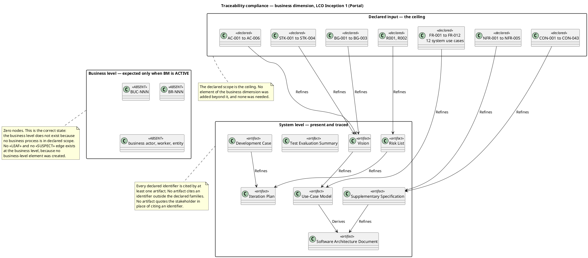
```plantuml
@startuml
title Traceability compliance — business dimension, LCO Inception 1 (Portal)

skinparam classAttributeIconSize 0
skinparam packageStyle rectangle

package "Declared input — the ceiling" as DECL {
  class "FR-001 to FR-012\n12 system use cases" as FR <<declared>>
  class "NFR-001 to NFR-005" as NFR <<declared>>
  class "CON-001 to CON-043" as CON <<declared>>
  class "STK-001 to STK-004" as STK <<declared>>
  class "BG-001 to BG-003" as BG <<declared>>
  class "AC-001 to AC-006" as AC <<declared>>
  class "R001, R002" as R <<declared>>
}

package "Business level — expected only when BM is ACTIVE" as BIZ {
  class "BUC-NNN" as BUC <<ABSENT>>
  class "BR-NNN" as BR <<ABSENT>>
  class "business actor, worker, entity" as BE <<ABSENT>>
}

package "System level — present and traced" as SYS {
  class "Vision" as VIS <<artifact>>
  class "Use-Case Model" as UCM <<artifact>>
  class "Supplementary Specification" as SS <<artifact>>
  class "Software Architecture Document" as SAD <<artifact>>
  class "Risk List" as RL <<artifact>>
  class "Iteration Plan" as IP <<artifact>>
  class "Test Evaluation Summary" as TES <<artifact>>
  class "Development Case" as DC <<artifact>>
}

FR --> UCM : Refines
NFR --> SS : Refines
CON --> SS : Refines
STK --> VIS : Refines
BG --> VIS : Refines
AC --> VIS : Refines
R --> RL : Refines
UCM --> SAD : Derives
SS --> SAD : Refines
VIS --> UCM : Refines
RL --> IP : Refines
DC --> IP : Refines

note bottom of BIZ
  Zero nodes. This is the correct state:
  the business level does not exist because
  no business process is in declared scope.
  No «LEAF» and no «SUSPECT» edge exists
  at the business level, because no
  business-level element was created.
end note

note bottom of SYS
  Every declared identifier is cited by at
  least one artifact. No artifact cites an
  identifier outside the declared families.
  No artifact quotes the stakeholder in
  place of citing an identifier.
end note

note bottom of DECL
  The declared scope is the ceiling. No
  element of the business dimension was
  added beyond it, and none was needed.
end note

DECL -[hidden]- BIZ
BIZ -[hidden]- SYS
@enduml
```

**What the graph shows.** The business level is empty by design, not by omission. Every declared identifier — twelve FR, five NFR, forty-three CON, four STK, three BG, six AC and two declared risks — is cited by at least one system-level artifact. No artifact cites an identifier outside the declared families. No `«SUSPECT → role»` edge exists at the business level, because no business-level element was created to carry one.

**What the graph does not show.** The business dimension has no traceability obligation to discharge: with no BUC, no business worker and no business entity, there is no business element whose upstream or downstream link could be missing. The traceability compliance check for this lens is therefore satisfied vacuously and correctly.

**Cross-lens note.** Seven findings are on record against this iteration's artifacts, all emitted by the Reviewer's technical lens: Development Case#F1 (Major), Test Evaluation Summary#F1 and #F2 (Major), Use-Case Model#F1, Supplementary Specification#F1, Vision#F1 and Iteration Plan#F1 (Minor). None is a business-modeling finding and none is mine to close. They are recorded here only so the milestone verdict is read against the complete finding set.

#### Iteration 2

One finding: one Minor, no Major, no Critical. Seven artifacts carry no new finding from this lens.

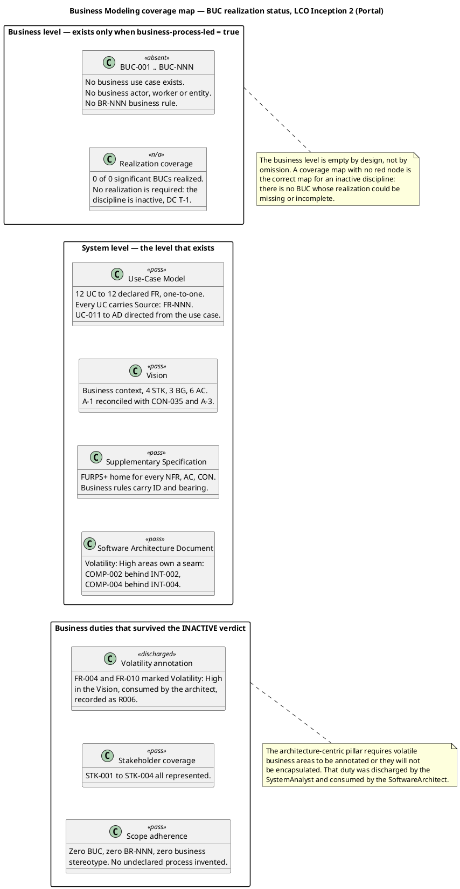
```plantuml
@startuml
title Business Modeling coverage map — BUC realization status, LCO Inception 2 (Portal)

skinparam classAttributeIconSize 0
skinparam packageStyle rectangle

package "Business level — exists only when business-process-led = true" as BIZ {
  class "BUC-001 .. BUC-NNN" as BUC <<absent>> {
    No business use case exists.
    No business actor, worker or entity.
    No BR-NNN business rule.
  }
  class "Realization coverage" as REAL <<n/a>> {
    0 of 0 significant BUCs realized.
    No realization is required: the
    discipline is inactive, DC T-1.
  }
}

package "System level — the level that exists" as SYS {
  class "Use-Case Model" as UCM <<pass>> {
    12 UC to 12 declared FR, one-to-one.
    Every UC carries Source: FR-NNN.
    UC-011 to AD directed from the use case.
  }
  class "Vision" as VIS <<pass>> {
    Business context, 4 STK, 3 BG, 6 AC.
    A-1 reconciled with CON-035 and A-3.
  }
  class "Supplementary Specification" as SS <<pass>> {
    FURPS+ home for every NFR, AC, CON.
    Business rules carry ID and bearing.
  }
  class "Software Architecture Document" as SAD <<pass>> {
    Volatility: High areas own a seam:
    COMP-002 behind INT-002,
    COMP-004 behind INT-004.
  }
}

package "Business duties that survived the INACTIVE verdict" as DUTY {
  class "Volatility annotation" as VOL <<discharged>> {
    FR-004 and FR-010 marked Volatility: High
    in the Vision, consumed by the architect,
    recorded as R006.
  }
  class "Stakeholder coverage" as STK <<pass>> {
    STK-001 to STK-004 all represented.
  }
  class "Scope adherence" as SCP <<pass>> {
    Zero BUC, zero BR-NNN, zero business
    stereotype. No undeclared process invented.
  }
}

BUC -[hidden]- REAL
REAL -[hidden]- UCM
UCM -[hidden]- VIS
VIS -[hidden]- SS
SS -[hidden]- SAD
SAD -[hidden]- VOL
VOL -[hidden]- STK
STK -[hidden]- SCP

note bottom of BIZ
  The business level is empty by design, not by
  omission. A coverage map with no red node is
  the correct map for an inactive discipline:
  there is no BUC whose realization could be
  missing or incomplete.
end note

note bottom of DUTY
  The architecture-centric pillar requires volatile
  business areas to be annotated or they will not
  be encapsulated. That duty was discharged by the
  SystemAnalyst and consumed by the SoftwareArchitect.
end note
@enduml
```

```plantuml
@startuml
title Business Reviewer scoring — LCO Inception 2 (Portal)

skinparam classAttributeIconSize 0
skinparam packageStyle rectangle

package "Applicable criteria — scored" as APP {
  class "Scenario selection\ncorrect and explicit" as C1 <<criterion>> {
    Score: 10 / 10
    DC 4 verdict false, re-derived this
    iteration against the declared scope
    and the eight persisted artifacts
  }
  class "Stakeholder representation\ncoverage" as C7 <<criterion>> {
    Score: 9 / 10
    STK-001 to STK-004 all represented.
    No organizational part in declared
    scope is unmodelled
  }
  class "Business rules as formal\nconstraints" as C8 <<criterion>> {
    Score: 9 / 10
    CON-007 to CON-016 and CON-043 each
    carry an ID, a named bearing and a
    testable condition
  }
  class "UML presence and richness" as C9 <<criterion>> {
    Score: 9 / 10
    Eight artifacts, each carrying
    validated PlantUML. No prose-only
    model anywhere
  }
  class "Scope adherence\nno BM scope creep" as C10 <<criterion>> {
    Score: 10 / 10
    Zero BUC, zero BR-NNN, zero business
    stereotype. No undeclared process
    was invented
  }
  class "Business-lens governance\nat the lifecycle gates" as C11 <<criterion>> {
    Score: 5 / 10
    FAIL — the plan records the
    BusinessReviewer as non-participating
    in every iteration while the business
    lens executed at this gate
  }
}

package "Not applicable — the discipline is inactive" as NA {
  class "BUC completeness test" as N1 <<n/a>>
  class "BUC realization adequacy" as N2 <<n/a>>
  class "Derivation bridge" as N3 <<n/a>>
  class "Resource planning compliance" as N4 <<n/a>>
  class "Same modeling technique" as N5 <<n/a>>
}

package "Aggregate" as AGG {
  class "Weighted verdict" as A1 <<verdict>> {
    Applicable criteria: 6
    Mean: 8.7 / 10
    N/A criteria: 5 of 11
  }
  class "Disposition" as A2 <<verdict>> {
    BR-OK-INACTIVE — discipline NOT
    APPLICABLE per DC 4, with one
    Minor finding on the plan
  }
  class "Findings emitted" as A3 <<verdict>> {
    Critical: 0
    Major: 0
    Minor: 1
    Info: 0
  }
}

C1 --> A1
C7 --> A1
C8 --> A1
C9 --> A1
C10 --> A1
C11 --> A1
A1 --> A2
A2 --> A3

note bottom of NA
  Five criteria are N/A because the discipline
  is inactive. Scoring them would be a false
  defect: the anti-pattern of applying New
  Business standards to a non-BPL engagement.
end note

note bottom of C11
  The one defect this lens found. It is a
  statement about observable state, not a
  design disagreement: the plan and the
  review record disagree about whether the
  business lens runs.
end note
@enduml
```

#### Iteration Plan — Minor

**F1 — The role profile records the BusinessReviewer as non-participating in every iteration, while the business lens executed at this gate.** The Resources section states "BusinessProcessAnalyst and BusinessReviewer (Business Modeling inactive) and CapsuleDesigner (not a real-time system) do not participate in any iteration", and the Development Case's Roles and Ownership table records the same ("BusinessReviewer | Not participating | Business Modeling inactive (T-1)"). The business lens nevertheless executed: the Review Record carries a Business Reviewer lens block with an Inception 1 entry, and the Review Coordinator's lens dispositions table records "BusinessReviewer (business) | Yes | BR-OK-INACTIVE — discipline NOT APPLICABLE per DC §4" and states "No lens is recorded as INACTIVE. All three lenses executed this review." Two statements about the same observable fact do not reconcile, and the consequence is that the business lens's execution at LCA, IOC and PR is unplanned and unaccounted for in the role profile. The DC §4 verdict itself is not in question: business-process-led = false is re-derived this iteration against the declared scope and the eight persisted artifacts, and the discipline is correctly inactive.

*Remediation.* Reconcile the two statements. Either record the BusinessReviewer in the role profile as executing the business lens at the lifecycle gates (I2, E2, C3, T1) — the lens confirms that the DC §4 INACTIVE verdict still holds and that no business process has entered scope — or state explicitly in the plan that the business lens is not required, and reconcile the Development Case's Roles and Ownership table and the Review Record's lens dispositions table with that determination. The Development Case's Roles and Ownership table carries the same wording and must be reconciled in the same pass, or the two artifacts will disagree again next iteration. The DC §4 verdict, the tailoring decision T-1 and the intensity statement need no change.

*Evidence.* Iteration Plan, Resources: "The agent role profile: which roles execute in which iteration. Roles not listed do not participate — BusinessProcessAnalyst and BusinessReviewer (Business Modeling inactive) and CapsuleDesigner (not a real-time system) do not participate in any iteration." against Review Record, Review Coordinator lens, Lens dispositions: "| BusinessReviewer (business) | Yes | BR-OK-INACTIVE — discipline NOT APPLICABLE per DC §4 | 0 |" and "No lens is recorded as INACTIVE. All three lenses executed this review."

#### Criterion justification

| Criterion | Score | Justification |
|---|---|---|
| Scenario selection | 10/10 | No business modeling scenario applies. The verdict was re-derived independently this iteration against the four DC §4 tests, all of which return NONE, and against the eight persisted artifacts. The ProcessEngineer's claim was audited, not accepted. |
| BUC completeness | N/A | No business use case exists. The twelve declared requirements are system use cases over a data-capture and publishing intranet, each initiated by a system actor inside the organization. Modelling them as BUCs would be a false artifact. |
| BUC realization adequacy | N/A | No realization is expected in Inception, and none is required by an inactive discipline. Penalizing their absence would be the anti-pattern of applying New Business standards to a non-BPL engagement. |
| Derivation bridge | N/A | There is no business worker to map to a system actor and no business entity to map to an analysis class. The system actors are declared directly (STK-001, STK-004) and the candidate analysis classes are derived from the use cases by the SoftwareArchitect (COMP-001 to COMP-010). The bridge this criterion guards does not exist because the business level does not exist. |
| Resource planning compliance | N/A | No business worker and no business entity exist, so no resource allocation can violate the single-resource principle. |
| Same modeling technique at business level | N/A | No business-level model exists, so no software stereotype (`<<entity>>`, `<<service>>`, `<<controller>>`) was misapplied at the business level. The system-level models use system stereotypes correctly. |
| Stakeholder representation coverage | 9/10 | All four declared stakeholders are represented: STK-001 and STK-004 as system actors, STK-003 as the operator of the external systems and of the portal in production, STK-002 as a supporting clarifier. No organizational part named in the declared scope is unmodelled. The score is not 10 because the coverage is bounded by the declared scope — no independent organizational survey was performed, and none is warranted for a 200-employee intranet with four declared stakeholders. |
| Business rules as formal constraints | 9/10 | CON-007 to CON-016 and CON-043 each carry a unique identifier, a named bearing on the use cases that must honour them, and a testable condition (at most one pair per day, at most one featured item, a closed list of four values, a field that may be empty). Their source is the declared constraint itself, which is the stakeholder's own statement — the strongest available attribution. They are not BPA-authored `BR-NNN` rules, and they do not need to be: the discipline that would author them is inactive. |
| UML presence and richness | 9/10 | All eight artifacts carry validated PlantUML. No artifact is a prose-only model. The Use-Case Model carries a use-case diagram and five activity and sequence diagrams; the Software Architecture Document carries all four-plus-one views; the Supplementary Specification carries a FURPS+ classification diagram and a mechanism-inclusion diagram. |
| Scope adherence | 10/10 | Zero business use cases, zero `BR-NNN` business rules, zero business stereotypes. No undeclared business process was invented, and no declared system use case was promoted to a business use case. The business dimension of the scope guard is clean. |
| Business-lens governance at the lifecycle gates | 5/10 | The plan and the Development Case record the BusinessReviewer as non-participating in every iteration, while the business lens executed at this gate and is recorded as executed in the Review Coordinator's lens dispositions table. The business lens is the only lens that re-derives the DC §4 INACTIVE verdict each iteration and would catch a business process entering scope through a Change Request; leaving its execution unplanned means the re-derivation is not scheduled. This is the one defect this lens found. |

**Business-volatility annotation — the one business duty that survived the INACTIVE verdict.** The architecture-centric pillar of this lens requires that volatile business areas be explicitly annotated, because volatility that is not flagged will not be encapsulated. That duty would normally fall to the Business Process Analyst. Here it was discharged by the SystemAnalyst in the Vision's Features table — FR-004 (the export column contract and the empty-not-zero rule) and FR-010 (the featuring policy) are both marked `Volatility: High` — and consumed by the SoftwareArchitect, who gave each its own subsystem and interface (`COMP-002` behind `INT-002`, `COMP-004` behind `INT-004`, ADR-002) and recorded the encapsulation as R006. The annotation exists, it is correct, and it reached the architecture. No finding.

**Traceability compliance — this iteration.**

```plantuml
@startuml
title Traceability compliance — business dimension, LCO Inception 2 (Portal)

skinparam classAttributeIconSize 0
skinparam packageStyle rectangle

package "Declared input — the ceiling" as DECL {
  class "FR-001 to FR-012\n12 system use cases" as FR <<declared>>
  class "NFR-001 to NFR-005" as NFR <<declared>>
  class "CON-001 to CON-043" as CON <<declared>>
  class "STK-001 to STK-004" as STK <<declared>>
  class "BG-001 to BG-003" as BG <<declared>>
  class "AC-001 to AC-006" as AC <<declared>>
  class "R001, R002" as R <<declared>>
}

package "Business level — expected only when BM is ACTIVE" as BIZ {
  class "BUC-NNN" as BUC <<ABSENT>>
  class "BR-NNN" as BR <<ABSENT>>
  class "business actor, worker, entity" as BE <<ABSENT>>
}

package "System level — present and traced" as SYS {
  class "Vision" as VIS <<artifact>>
  class "Use-Case Model" as UCM <<artifact>>
  class "Supplementary Specification" as SS <<artifact>>
  class "Software Architecture Document" as SAD <<artifact>>
  class "Risk List" as RL <<artifact>>
  class "Iteration Plan" as IP <<artifact>>
  class "Test Evaluation Summary" as TES <<artifact>>
  class "Development Case" as DC <<artifact>>
}

FR --> UCM : Refines
NFR --> SS : Refines
CON --> SS : Refines
STK --> VIS : Refines
BG --> VIS : Refines
AC --> VIS : Refines
R --> RL : Refines
UCM --> SAD : Derives
SS --> SAD : Refines
VIS --> UCM : Refines
RL --> IP : Refines
DC --> IP : Refines

note bottom of BIZ
  Zero nodes. This is the correct state: the
  business level does not exist because no
  business process is in declared scope.
  No LEAF and no SUSPECT edge exists at the
  business level, because no business-level
  element was created.
end note

note bottom of SYS
  Every declared identifier is cited by at least
  one artifact. No artifact cites an identifier
  outside the declared families. No artifact
  quotes the stakeholder in place of citing an
  identifier.
end note

note bottom of IP
  Iteration Plan#F1 — the role profile records the
  BusinessReviewer as non-participating while the
  business lens executed at this gate. The only
  finding of this lens.
end note

DECL -[hidden]- BIZ
BIZ -[hidden]- SYS
@enduml
```

**What the graph shows.** The business level is empty by design, not by omission. Every declared identifier — twelve FR, five NFR, forty-three CON, four STK, three BG, six AC and two declared risks — is cited by at least one system-level artifact. No artifact cites an identifier outside the declared families. No `«SUSPECT → role»` edge exists at the business level, because no business-level element was created to carry one.

**What the graph does not show.** The business dimension has no traceability obligation to discharge: with no BUC, no business worker and no business entity, there is no business element whose upstream or downstream link could be missing. The traceability compliance check for this lens is therefore satisfied vacuously and correctly. The one finding of this lens is a governance defect in the Iteration Plan's role profile, not a traceability defect.

**Cross-lens note.** The findings of the Reviewer's and the ManagementReviewer's lenses are recorded in their own blocks and are not mine to close. They are not restated here.

#### Iteration 3

**Zero findings from this lens.** No Critical, Major, Minor or Info finding is recorded against any artifact this iteration. One prior finding of this lens — Iteration Plan#F1 — is closed in `Resolutions and Actions`. An artifact with no finding is Approved from this lens.

```plantuml
@startuml
title Business Modeling coverage map — BUC realization status, LCO Inception 3 (Portal)

skinparam classAttributeIconSize 0
skinparam packageStyle rectangle

package "Business level — exists only when business-process-led = true" as BIZ {
  class "BUC-001 .. BUC-NNN" as BUC <<absent>> {
    No business use case exists.
    No business actor, worker or entity.
    No BR-NNN business rule.
  }
  class "Realization coverage" as REAL <<n/a>> {
    0 of 0 significant BUCs realized.
    No realization is required: the
    discipline is inactive, DC T-1.
  }
}

package "System level — the level that exists" as SYS {
  class "Use-Case Model" as UCM <<pass>> {
    12 UC to 12 declared FR, one-to-one.
    Every UC carries Source: FR-NNN.
    UC-011 to AD directed from the use case.
  }
  class "Vision" as VIS <<pass>> {
    Business context, 4 STK, 3 BG, 6 AC.
    A-1 reconciled with CON-035 and A-3.
  }
  class "Supplementary Specification" as SS <<pass>> {
    FURPS+ home for every NFR, AC, CON.
    Business rules carry ID and bearing.
    Audit include list carries UC-010.
  }
  class "Software Architecture Document" as SAD <<pass>> {
    Volatility: High areas own a seam:
    COMP-002 behind INT-002,
    COMP-004 behind INT-004.
  }
}

package "Business duties that survived the INACTIVE verdict" as DUTY {
  class "Volatility annotation" as VOL <<discharged>> {
    FR-004 and FR-010 marked Volatility: High
    in the Vision, consumed by the architect,
    recorded as R006.
  }
  class "Stakeholder coverage" as STK <<pass>> {
    STK-001 to STK-004 all represented.
  }
  class "Scope adherence" as SCP <<pass>> {
    Zero BUC, zero BR-NNN, zero business
    stereotype. No undeclared process invented.
  }
  class "Business-lens governance" as GOV <<pass>> {
    Iteration Plan#F1 closed: the role profile
    and the Development Case now agree that
    the business lens runs at the gates.
  }
}

BUC -[hidden]- REAL
REAL -[hidden]- UCM
UCM -[hidden]- VIS
VIS -[hidden]- SS
SS -[hidden]- SAD
SAD -[hidden]- VOL
VOL -[hidden]- STK
STK -[hidden]- SCP
SCP -[hidden]- GOV

note bottom of BIZ
  The business level is empty by design, not by
  omission. A coverage map with no red node is
  the correct map for an inactive discipline:
  there is no BUC whose realization could be
  missing or incomplete.
end note

note bottom of DUTY
  The architecture-centric pillar requires volatile
  business areas to be annotated or they will not
  be encapsulated. That duty was discharged by the
  SystemAnalyst and consumed by the SoftwareArchitect.
end note
@enduml
```

```plantuml
@startuml
title Business Reviewer scoring — LCO Inception 3 (Portal)

skinparam classAttributeIconSize 0
skinparam packageStyle rectangle

package "Applicable criteria — scored" as APP {
  class "Scenario selection\ncorrect and explicit" as C1 <<criterion>> {
    Score: 10 / 10
    DC 4 verdict false, re-derived this
    iteration against the declared scope
    and the persisted artifacts
  }
  class "Stakeholder representation\ncoverage" as C7 <<criterion>> {
    Score: 9 / 10
    STK-001 to STK-004 all represented.
    No organizational part in declared
    scope is unmodelled
  }
  class "Business rules as formal\nconstraints" as C8 <<criterion>> {
    Score: 9 / 10
    CON-007 to CON-016 and CON-043 each
    carry an ID, a named bearing and a
    testable condition
  }
  class "UML presence and richness" as C9 <<criterion>> {
    Score: 9 / 10
    Every artifact carries validated
    PlantUML. No prose-only model anywhere
  }
  class "Scope adherence\nno BM scope creep" as C10 <<criterion>> {
    Score: 10 / 10
    Zero BUC, zero BR-NNN, zero business
    stereotype. No undeclared process
    was invented
  }
  class "Business-lens governance\nat the lifecycle gates" as C11 <<criterion>> {
    Score: 9 / 10
    PASS — Iteration Plan#F1 is closed.
    The role profile and the Development
    Case now agree that the business lens
    runs at I1, I2, I3, E2, C3 and T1
  }
}

package "Not applicable — the discipline is inactive" as NA {
  class "BUC completeness test" as N1 <<n/a>>
  class "BUC realization adequacy" as N2 <<n/a>>
  class "Derivation bridge" as N3 <<n/a>>
  class "Resource planning compliance" as N4 <<n/a>>
  class "Same modeling technique" as N5 <<n/a>>
}

package "Aggregate" as AGG {
  class "Weighted verdict" as A1 <<verdict>> {
    Applicable criteria: 6
    Mean: 9.3 / 10
    N/A criteria: 5 of 11
  }
  class "Disposition" as A2 <<verdict>> {
    BR-OK-INACTIVE — discipline NOT
    APPLICABLE per DC 4
  }
  class "Findings emitted" as A3 <<verdict>> {
    Critical: 0
    Major: 0
    Minor: 0
    Info: 0
  }
  class "Prior findings closed" as A4 <<verdict>> {
    Iteration Plan#F1 — Resolved
  }
}

C1 --> A1
C7 --> A1
C8 --> A1
C9 --> A1
C10 --> A1
C11 --> A1
A1 --> A2
A2 --> A3
A2 --> A4

note bottom of NA
  Five criteria are N/A because the discipline
  is inactive. Scoring them would be a false
  defect: the anti-pattern of applying New
  Business standards to a non-BPL engagement.
end note

note bottom of C11
  The one defect this lens found in Inception 2,
  now closed. The re-derivation of the DC 4
  verdict is scheduled at every lifecycle gate.
end note
@enduml
```

**Criterion justification.**

| Criterion | Score | Justification |
|---|---|---|
| Scenario selection | 10/10 | No business modeling scenario applies. The verdict was re-derived independently this iteration against the four DC §4 tests, all of which return NONE, and against the persisted artifacts. The ProcessEngineer's claim was audited, not accepted. |
| BUC completeness | N/A | No business use case exists. The twelve declared requirements are system use cases over a data-capture and publishing intranet, each initiated by a system actor inside the organization. Modelling them as BUCs would be a false artifact. |
| BUC realization adequacy | N/A | No realization is expected in Inception, and none is required by an inactive discipline. Penalizing their absence would be the anti-pattern of applying New Business standards to a non-BPL engagement. |
| Derivation bridge | N/A | There is no business worker to map to a system actor and no business entity to map to an analysis class. The system actors are declared directly (STK-001, STK-004) and the candidate analysis classes are derived from the use cases by the SoftwareArchitect (COMP-001 to COMP-010). The bridge this criterion guards does not exist because the business level does not exist. |
| Resource planning compliance | N/A | No business worker and no business entity exist, so no resource allocation can violate the single-resource principle. |
| Same modeling technique at business level | N/A | No business-level model exists, so no software stereotype (`<<entity>>`, `<<service>>`, `<<controller>>`) was misapplied at the business level. The system-level models use system stereotypes correctly. |
| Stakeholder representation coverage | 9/10 | All four declared stakeholders are represented: STK-001 and STK-004 as system actors, STK-003 as the operator of the external systems and of the portal in production, STK-002 as a supporting clarifier. No organizational part named in the declared scope is unmodelled. The score is not 10 because the coverage is bounded by the declared scope — no independent organizational survey was performed, and none is warranted for a 200-employee intranet with four declared stakeholders. |
| Business rules as formal constraints | 9/10 | CON-007 to CON-016 and CON-043 each carry a unique identifier, a named bearing on the use cases that must honour them, and a testable condition (at most one pair per day, at most one featured item, a closed list of four values, a field that may be empty). Their source is the declared constraint itself, which is the stakeholder's own statement — the strongest available attribution. They are not BPA-authored `BR-NNN` rules, and they do not need to be: the discipline that would author them is inactive. |
| UML presence and richness | 9/10 | Every artifact carries validated PlantUML. No artifact is a prose-only model. The Use-Case Model carries a use-case diagram and five activity and sequence diagrams; the Software Architecture Document carries all four-plus-one views; the Supplementary Specification carries a FURPS+ classification diagram, an audit-trail diagram and a mechanism-inclusion diagram. |
| Scope adherence | 10/10 | Zero business use cases, zero `BR-NNN` business rules, zero business stereotypes. No undeclared business process was invented, and no declared system use case was promoted to a business use case. The business dimension of the scope guard is clean. |
| Business-lens governance at the lifecycle gates | 9/10 | Iteration Plan#F1 is closed. The Iteration Plan's Resources section records the BusinessReviewer as participating in I1, I2, I3, E2, C3 and T1, names the four lifecycle gates (I3 LCO, E2 LCA, C3 IOC, T1 PR), and states the lens's output at each gate: the re-derived DC §4 verdict, the business-volatility annotation check and the business-dimension traceability compliance check. The Development Case's Roles and Ownership table carries the same determination in the same pass. The re-derivation of the DC §4 verdict is therefore scheduled at every gate. The score is not 10 because the reconciliation is one iteration old and has not yet been exercised at a second gate. |

**Per-artifact verdicts from this lens.**

| Artifact | Verdict | Basis |
|---|---|---|
| Vision | Approved | Business context, four STK, three measurable BG, six AC; FR-004 and FR-010 carry `Volatility: High`; A-1 reconciled with CON-035 and A-3. |
| Use-Case Model | Approved | Twelve declared FR to twelve UC one-to-one, each carrying `Source: FR-NNN`; UC-011 to AD directed from the use case; no cross-cutting mechanism promoted to a use case; no use case split per actor. |
| Supplementary Specification | Approved | FURPS+ home for every declared NFR, AC and CON; the audit include list carries UC-010; the business rules carry ID, bearing and testable condition. |
| Software Architecture Document | Approved | Each `Volatility: High` area owns a seam (`COMP-002` behind `INT-002`, `COMP-004` behind `INT-004`); AD read-only with no local copy. |
| Risk List | Approved | R001 and R002 preserved with declared P and I; R003 onwards numbered in the order raised per CON-023; CON-025 exclusions not registered. |
| Iteration Plan | Approved | Iteration Plan#F1 closed; the business lens is scheduled at every lifecycle gate. |
| Development Case | Approved | The Roles and Ownership table records the BusinessReviewer as participating in its review capacity, reconciled with the Iteration Plan in the same pass; the Glossary trigger is correctly NOT FIRED. |
| Test Evaluation Summary | Approved | No business-modeling defect. |

**Business-volatility annotation — the one business duty that survived the INACTIVE verdict.** The architecture-centric pillar of this lens requires that volatile business areas be explicitly annotated, because volatility that is not flagged will not be encapsulated. That duty would normally fall to the Business Process Analyst. Here it was discharged by the SystemAnalyst in the Vision's Features table — FR-004 (the export column contract and the empty-not-zero rule) and FR-010 (the featuring policy) are both marked `Volatility: High` — and consumed by the SoftwareArchitect, who gave each its own subsystem and interface (`COMP-002` behind `INT-002`, `COMP-004` behind `INT-004`, ADR-002) and recorded the encapsulation as R006. The annotation exists, it is correct, and it reached the architecture. No finding.

**Traceability compliance — this iteration.**

```plantuml
@startuml
title Traceability compliance — business dimension, LCO Inception 3 (Portal)

skinparam classAttributeIconSize 0
skinparam packageStyle rectangle

package "Declared input — the ceiling" as DECL {
  class "FR-001 to FR-012\n12 system use cases" as FR <<declared>>
  class "NFR-001 to NFR-005" as NFR <<declared>>
  class "CON-001 to CON-043" as CON <<declared>>
  class "STK-001 to STK-004" as STK <<declared>>
  class "BG-001 to BG-003" as BG <<declared>>
  class "AC-001 to AC-006" as AC <<declared>>
  class "R001, R002" as R <<declared>>
}

package "Business level — expected only when BM is ACTIVE" as BIZ {
  class "BUC-NNN" as BUC <<ABSENT>>
  class "BR-NNN" as BR <<ABSENT>>
  class "business actor, worker, entity" as BE <<ABSENT>>
}

package "System level — present and traced" as SYS {
  class "Vision" as VIS <<artifact>>
  class "Use-Case Model" as UCM <<artifact>>
  class "Supplementary Specification" as SS <<artifact>>
  class "Software Architecture Document" as SAD <<artifact>>
  class "Risk List" as RL <<artifact>>
  class "Iteration Plan" as IP <<artifact>>
  class "Test Evaluation Summary" as TES <<artifact>>
  class "Development Case" as DC <<artifact>>
}

FR --> UCM : Refines
NFR --> SS : Refines
CON --> SS : Refines
STK --> VIS : Refines
BG --> VIS : Refines
AC --> VIS : Refines
R --> RL : Refines
UCM --> SAD : Derives
SS --> SAD : Refines
VIS --> UCM : Refines
RL --> IP : Refines
DC --> IP : Refines

note bottom of BIZ
  Zero nodes. This is the correct state: the
  business level does not exist because no
  business process is in declared scope.
  No LEAF and no SUSPECT edge exists at the
  business level, because no business-level
  element was created.
end note

note bottom of SYS
  Every declared identifier is cited by at least
  one artifact. No artifact cites an identifier
  outside the declared families. No artifact
  quotes the stakeholder in place of citing an
  identifier.
end note

note bottom of IP
  Iteration Plan#F1 is closed: the role profile
  and the Development Case now agree that the
  business lens executes at I1, I2, I3, E2, C3
  and T1. No finding of this lens remains open.
end note

DECL -[hidden]- BIZ
BIZ -[hidden]- SYS
@enduml
```

**What the graph shows.** The business level is empty by design, not by omission. Every declared identifier — twelve FR, five NFR, forty-three CON, four STK, three BG, six AC and two declared risks — is cited by at least one system-level artifact. No artifact cites an identifier outside the declared families. No `«SUSPECT → role»` edge exists at the business level, because no business-level element was created to carry one.

**What the graph does not show.** The business dimension has no traceability obligation to discharge: with no BUC, no business worker and no business entity, there is no business element whose upstream or downstream link could be missing. The traceability compliance check for this lens is therefore satisfied vacuously and correctly. No finding of this lens remains open at this gate.

**Cross-lens note.** The findings of the Reviewer's and the ManagementReviewer's lenses are recorded in their own blocks and are not mine to close. They are not restated here.

### Management Reviewer lens
#### Iteration 1

Four findings, all against the Iteration Plan: two Major, two Minor. No Critical finding. Two artifacts carry no finding and are Approved from this lens.

```plantuml
@startuml
title LCO compliance table — exit criterion, status, evidence (Portal, Inception 1)

skinparam classAttributeIconSize 0
skinparam packageStyle rectangle

class "LCO-1 Stakeholders agree on the scope" as L1 <<MET>> {
  Status: MET
  Evidence: Vision scope statement and the declared
  exclusions published verbatim; 12 FR to 12 UC
  one-to-one; no open scope question
}

class "LCO-2 Project viable to proceed" as L2 <<MET>> {
  Status: MET
  Evidence: SAD candidate architecture — 10 subsystems,
  10 interfaces, 6 ADRs, 4+1 views
}

class "LCO-3 Initial risks identified and classified" as L3 <<MET>> {
  Status: MET
  Evidence: Risk List R001 to R010 with P, I, exposure,
  magnitude, strategy, owner, mitigation, contingency
  and an observable early-warning indicator
}

class "LCO-4 Requirements baseline complete and reviewed" as L4 <<PARTIAL>> {
  Status: MET WITH FINDINGS
  Evidence: Vision, Use-Case Model and Supplementary
  Specification persisted; 3 Minor findings open
}

class "LCO-5 Architecture confronts the top risks" as L5 <<MET>> {
  Status: MET
  Evidence: SAD addresses R001, R003, R004 and R008;
  R003 correctly excluded from the PoC plan as human work
}

class "LCO-6 Plan composed, no unmeasured unit" as L6 <<PARTIAL>> {
  Status: MET WITH FINDINGS
  Evidence: 7 iterations, no work item sized, human gate
  bounded as a risk; 2 Major and 2 Minor findings open
}

class "LCO-7 Verifiability established" as L7 <<PARTIAL>> {
  Status: MET WITH FINDINGS
  Evidence: Test Evaluation Summary states an observable
  verification method per declared requirement;
  2 Major findings open
}

class "LCO-8 Project Approval Review conducted" as L8 <<NOTMET>> {
  Status: NOT MET
  Evidence: no record of it in the Review Record and
  no work item for it in the Iteration Plan fine plan
}

class "LCO-9 No open Critical finding" as L9 <<MET>> {
  Status: MET
  Evidence: 0 Critical findings across the 8 artifacts
}

class "LCO-10 No unretired scope marker" as L10 <<MET>> {
  Status: MET
  Evidence: the STK-001 derivation is confirmed by the
  stakeholder this round; no artifact carries a marker
}

class "Milestone verdict" as V <<VERDICT>> {
  LCO: NOT SANCTIONED
  Stakeholder sanction: REFUSED
  Remedy: another iteration (CON-026)
}

L1 --> V
L2 --> V
L3 --> V
L4 --> V
L5 --> V
L6 --> V
L7 --> V
L8 --> V
L9 --> V
L10 --> V

note bottom of L8
  The Project Approval Review precedes LCO.
  No record of it exists and the fine plan
  does not schedule it. Iteration Plan#F3.
end note

note bottom of V
  Eight of ten criteria met or met with findings.
  Zero Critical findings. The refusal is the
  sanctioning authority's, not a criteria failure.
end note
@enduml
```

```plantuml
@startuml
title Defect distribution — severity x artifact, all lenses, LCO Inception 1 (Portal)

skinparam classAttributeIconSize 0
skinparam packageStyle rectangle

package "Critical — 0" as CRIT {
  class "none" as C0 <<empty>> {
    No LCO gate blocker.
    No scope hallucination.
    No phantom use case.
    No baseline redefinition.
    No fabricated quantitative claim.
  }
}

package "Major — 4" as MAJ {
  class "Development Case" as M1 <<artifact>> {
    F1 Tool baseline contradicts the repository.
    Lens: Reviewer. Owner: ProcessEngineer.
  }
  class "Test Evaluation Summary" as M2 <<artifact>> {
    F1 SCM signal does not reconcile; E-6
    reported unmet when it is met.
    F2 Traceability not registered in the graph.
    Lens: Reviewer. Owner: TestManager.
  }
  class "Iteration Plan" as M3 <<artifact>> {
    F1 Management Reviewer omitted from the
    Inception 1, Elaboration 2 and Construction 3
    lifecycle milestone gates.
    F2 No Inception 2 to carry the CON-026 remedy
    the stakeholder has invoked.
    Lens: ManagementReviewer. Owner: ProjectManager.
  }
}

package "Minor — 5" as MIN {
  class "Use-Case Model" as N1 <<artifact>> {
    F1 AD drawn as the initiating end of UC-011.
    Lens: Reviewer.
  }
  class "Supplementary Specification" as N2 <<artifact>> {
    F1 Audit include list omits UC-010.
    Lens: Reviewer.
  }
  class "Vision" as N3 <<artifact>> {
    F1 A-1 not reconciled with CON-035.
    Lens: Reviewer.
  }
  class "Iteration Plan" as N4 <<artifact>> {
    F1 Gantt asserts a one-day duration.
    Lens: Reviewer.
    F3 Project Approval Review not scheduled.
    F4 LCO and PR gates carry no ceiling.
    Lens: ManagementReviewer.
  }
}

package "Clean — 2 artifacts, silence is the verdict" as CLEAN {
  class "Software Architecture Document" as K1 <<artifact>> {
    No finding. 10 subsystems, 10 interfaces,
    6 ADRs, 4+1 views, all traced.
  }
  class "Risk List" as K2 <<artifact>> {
    No finding. R001 to R010 classified,
    CON-024 acceptance basis named.
  }
}

package "Suggestion — 0" as SUG {
  class "none" as S0 <<empty>>
}

note bottom of MAJ
  All four Major findings are corrections to
  statements about observable state or to the
  gate structure, not design disagreements.
  None blocks the LCO criteria; the stakeholder
  has directed that all of them be closed.
end note

note bottom of MIN
  The stakeholder directed that the minor
  findings be closed too: nothing is left
  behind before the next phase.
end note

note bottom of CLEAN
  An artifact with no finding is Approved from
  the lens that reviewed it. Silence is the verdict.
end note

CRIT -[hidden]- MAJ
MAJ -[hidden]- MIN
MIN -[hidden]- CLEAN
CLEAN -[hidden]- SUG
@enduml
```

#### Iteration Plan — Major

**F1 — The role profile omits the Management Reviewer from three of the four lifecycle milestone gates.** The Resources table marks ManagementReviewer as non-participating in I1, E2 and C3, participating only in T1. The same plan's milestone table names LCO (closes Inception 1), LCA (closes Elaboration 2) and IOC (closes Construction 3) as formal lifecycle gates whose verdicts gate phase transition. Three of the four gates therefore have no management lens, including the LCO gate this review is executing. This is a governance gap, not a scheduling preference: the Management Reviewer is the representative of the organization the Project Manager is accountable to, and the Lifecycle Milestone Review is one of the seven review activities that role owns. A gate verified only by the technical and business lenses has no assessment of feasibility, acceptability, four-axis health or risk-retirement trend — which is what LCO, LCA and IOC require.

*Remediation.* Add ManagementReviewer to the role profile for I1, E2 and C3, with the verdict at each of LCO, LCA and IOC. The Management Reviewer's output is a Review Record entry per gate: a compliance table against that milestone's exit criteria, a risk status chart with trend direction, and a four-axis health scorecard. Keep the ReviewCoordinator as the verdict owner — the management lens supplies evidence, it does not replace the coordinator. If the intent was that the management lens runs only at PR, state that explicitly and reconcile it with the milestone table.

*Evidence.* Iteration Plan, Resources: "| ManagementReviewer | — | — | — | — | — | — | review |" against Plan and Milestones: "LCO — Lifecycle Objectives | Closes Inception 1", "LCA — Lifecycle Architecture | Elaboration 2", "IOC — Initial Operational Capability | Construction 3".

**F2 — The plan declares Inception as a single iteration and provides no home for the CON-026 remedy the stakeholder has invoked.** The coarse roadmap fixes "Inception | 1" and justifies it: "A second Inception iteration would re-derive a baseline that already exists." The fine plan is bounded to Inception iteration 1 and its exit criteria X-1 to X-5 assume the iteration closes the milestone. The stakeholder refused the LCO sanction and directed that every finding be closed, minor ones included, before the next phase. CON-026 states the remedy for a milestone delayed by human validation is another iteration, and the same remedy applies to a refused sanction. As written the plan has no Inception 2 to carry the closure work, so the remedy the stakeholder has chosen cannot be scheduled and the refused gate has no planned path to re-assessment.

*Remediation.* Add Inception iteration 2 to the coarse roadmap and give it a fine plan whose work items are the closure of the open findings — Development Case#F1, Test Evaluation Summary#F1 and #F2, Iteration Plan#F1 to #F4, Use-Case Model#F1, Supplementary Specification#F1 and Vision#F1 — each with its owner, plus the Project Approval Review. Restate the Inception justification: the second iteration is not re-deriving the baseline, it is closing the findings the first iteration's review raised and re-assessing LCO readiness. Update the Evaluation Criteria section so X-1 to X-5 are re-assessed in iteration 2 rather than assumed met in iteration 1.

*Evidence.* Iteration Plan, Plan and Milestones: "| Inception | 1 | ... A second Inception iteration would re-derive a baseline that already exists. |" against the stakeholder's direction recorded this round: "We are going to fix the findings, even the minor ones. Let's not leave anything behind before moving to the next phase."

#### Iteration Plan — Minor

**F5 — The artifact is not releasable at the LCO gate.** The stakeholder refused the sanction on the condition that the findings of each iteration be closed without exception, and this artifact carries Iteration Plan#F1 from the business lens: the role profile records the BusinessReviewer as non-participating in every iteration while the business lens executed at this gate, and the Development Case's Roles and Ownership table carries the same wording. The gate condition is the stakeholder's, not this lens's; the defect itself is the BusinessReviewer's finding and is not restated here. The four findings of the management lens against this artifact are closed this iteration.

*Remediation.* Reconcile the two statements in the same pass as the Development Case's Roles and Ownership table, or the two artifacts will disagree again next iteration. Either record the BusinessReviewer in the role profile as executing the business lens at the lifecycle gates — the lens confirms that the DC §4 INACTIVE verdict still holds and that no business process has entered scope — or state explicitly that the business lens is not required and reconcile the Development Case and the Review Record's lens dispositions table with that determination. Owner: ProjectManager.

*Evidence.* Stakeholder answer, Inception 2: "We cannot afford to leave findings uncorrected and unclosed. It is fine for more to emerge, but the findings from each iteration must be closed—without exception." Iteration Plan, Resources: "BusinessProcessAnalyst and BusinessReviewer (Business Modeling inactive) and CapsuleDesigner (not a real-time system) do not participate in any iteration." against Review Record, Review Coordinator lens: "No lens is recorded as INACTIVE. All three lenses executed this review."

#### Software Architecture Document — no finding

No defect recorded. Every subsystem traces to a declared use case, requirement or constraint; no subsystem is named after a layer or a feature; each `Volatility: High` area owns a seam (`COMP-002` behind `INT-002`, `COMP-004` behind `INT-004`); Keycloak is placed inside the corporate network and no Keycloak deployment work is planned; AD is read-only with no local copy of the employee; the three invariants are enforced as database constraints; and no technology or version is invented. Approved from this lens.

#### Risk List — no finding

No defect recorded. R001 and R002 are preserved with their declared probability and impact; R003 to R010 are numbered in the order raised per CON-023; every risk carries a strategy, an owner, a mitigation, a contingency and an observable early-warning indicator; every accepted risk names its CON-024 basis; the CON-025 exclusions are not registered; and no human-team unit or velocity appears. Approved from this lens.

#### Risk retirement and magnitude — this iteration

```plantuml
@startuml
title Risk status chart — magnitude and trend per risk, LCO Inception 2 (Portal)

skinparam classAttributeIconSize 0
skinparam packageStyle rectangle

package "High — exposure 9" as HIGH {
  class "R001 Active Directory integration" as R1 <<High>> {
    P 3 x I 3 = 9
    Strategy: accept, CON-024
    Owner: SoftwareArchitect
    Trend: STABLE — no change since Inception 1
    Confronted: stand-in carries empty
    job title and extension entries
  }
}

package "Significant — exposure 6" as SIG {
  class "R002 Digital clocking adoption" as R2 <<Significant>> {
    P 3 x I 2 = 6
    Strategy: accept, CON-024
    Owner: ProjectManager
    Trend: STABLE
    Treatment is communication, not a feature
  }
  class "R003 Human validation gate" as R3 <<Significant>> {
    P 2 x I 3 = 6
    Strategy: accept, CON-024
    Owner: ProjectManager
    Trend: STABLE
    Gate opens at the start of Elaboration 1
    Ceiling 14 days, reported apart
  }
  class "R004 Client-supplied timestamp" as R4 <<Significant>> {
    P 2 x I 3 = 6
    Strategy: accept, CON-024
    Owner: SoftwareArchitect
    Trend: STABLE
    Server receipt time stored alongside
  }
}

package "Moderate — exposure 4" as MOD {
  class "R005 Mandatory UI design reference" as R5 <<Moderate>> {
    P 2 x I 2 = 4
    Strategy: accept, CON-024
    Owner: UserInterfaceDesigner
    Trend: STABLE
  }
  class "R006 High-volatility features" as R6 <<Moderate>> {
    P 2 x I 2 = 4
    Strategy: avoid
    Owner: Designer
    Trend: STABLE
    Retired by the two seams COMP-002, COMP-004
  }
  class "R008 Directory page load" as R8 <<Moderate>> {
    P 2 x I 2 = 4
    Strategy: avoid
    Owner: SoftwareArchitect
    Trend: STABLE
    Bounded LDAP read, no client cache
  }
  class "R009 Elaboration tool gaps" as R9 <<Moderate>> {
    P 2 x I 2 = 4
    Strategy: avoid
    Owner: ProcessEngineer
    Trend: STABLE
    Iteration-preparation checkpoint
  }
  class "R010 Audit completeness" as R10 <<Moderate>> {
    P 2 x I 2 = 4
    Strategy: avoid
    Owner: Designer
    Trend: STABLE
    Audit written in the same transaction
  }
}

package "Minor — exposure 2" as MIN {
  class "R007 Offline retry window" as R7 <<Minor>> {
    P 2 x I 1 = 2
    Strategy: accept, CON-024
    Owner: Designer
    Trend: STABLE
  }
}

package "Not registered — CON-025" as EXCL {
  class "Keycloak availability, configuration, ownership" as E1 <<excluded>> {
    CON-025: not a risk of this project
  }
  class "Active Directory availability or ownership" as E2 <<excluded>> {
    CON-025: not a risk of this project
  }
}

note bottom of HIGH
  At LCO the criterion is identification and
  classification, not retirement. The trend
  line begins at LCA. No risk carries a
  retirement trend because no risk has been
  retired yet.
end note

note bottom of SIG
  R003 is a human gate, not a prototype.
  It is bounded as a risk, never as an estimate.
end note

note bottom of MOD
  Five of ten risks are avoided, not accepted:
  the mechanism is inside the team's control and
  the treatment removes it. No risk is accepted
  whose damage mechanism the team can design away.
end note

note bottom of EXCL
  Excluded by the declared constraint, not
  overlooked. Neither is registered.
end note

HIGH -[hidden]- SIG
SIG -[hidden]- MOD
MOD -[hidden]- MIN
MIN -[hidden]- EXCL
@enduml
```

**Risk retirement at LCO.** The LCO criterion is that the initial risks are identified and classified — not that they are retired. The trend line begins at LCA, and no risk carries a retirement trend because no risk has been retired yet. R001 (exposure 9, High) is the top risk and is confronted rather than deferred: the stand-in directory carries empty-attribute entries, the real-AD gate opens at the start of Elaboration 1, and the blank-field path is built from the first iteration. No risk is accepted on the ProjectManager's own authority; each accepted risk names its CON-024 basis, and no treatment cuts or defers declared scope. Five of ten risks are avoided rather than accepted, which is the correct posture where the mechanism is inside the team's control.

**Optional trigger audit.** All six NOT-FIRED verdicts hold against their §5.2 conditions: one local table of two columns (Data Model), one application and one database on one network (Deployment Model), a stakeholder-mandated authoritative design reference (UI Prototype), no compliance regime (Test Plan), Inception not Elaboration (PoC), ordinary intranet vocabulary (Glossary). No over-triggering and no under-triggering.

#### Iteration 2

Three findings recorded this iteration: three Major, no Critical. Each is the gate condition the stakeholder's refusal rests on, recorded against the artifact that carries the underlying defect. The defect itself belongs to the lens that emitted it and is not restated here.

```plantuml
@startuml
title Defect distribution — severity x artifact, all lenses, LCO Inception 2 (Portal)

skinparam classAttributeIconSize 0
skinparam packageStyle rectangle

package "Critical — 0" as CRIT {
  class "none" as C0 <<empty>> {
    No LCO gate blocker.
    No scope hallucination.
    No phantom use case.
    No baseline redefinition.
    No fabricated quantitative claim.
  }
}

package "Major — 3" as MAJ {
  class "Supplementary Specification#F2" as M1 <<artifact>> {
    Element-level traceability declared but not
    registered: NFR-002 to NFR-005 and AC-001 to
    AC-006 are LEAF nodes while NFR-001 reaches
    COMP-007. Lens: Reviewer.
    Owner: SystemAnalyst, trace steward.
  }
  class "Test Evaluation Summary#F2" as M2 <<artifact>> {
    Declared upstream links not registered; the
    artifact is absent from the Business-level
    trace tree. Lens: Reviewer.
    Owner: SystemAnalyst, trace steward.
  }
  class "Test Evaluation Summary#F3" as M3 <<artifact>> {
    The issue-tracker row records no issue open or
    closed while Issue #1 is open and the artifact's
    own Traceability section cites it. Lens: Reviewer.
    Owner: TestManager.
  }
}

package "Minor — 1" as MIN {
  class "Iteration Plan#F1" as N1 <<artifact>> {
    The role profile records the BusinessReviewer as
    non-participating while the business lens executed
    at this gate. Lens: BusinessReviewer.
    Owner: ProjectManager.
  }
}

package "Closed this iteration — 4, all this lens" as CLOSED {
  class "Iteration Plan#F1 Major" as K1 <<closed>> {
    ManagementReviewer now sits at I1, I2, E2, C3, T1.
  }
  class "Iteration Plan#F2 Major" as K2 <<closed>> {
    Inception 2 in the roadmap with a fine plan;
    X-1 to X-5 re-assessed there.
  }
  class "Iteration Plan#F3 Minor" as K3 <<closed>> {
    Project Approval Review scheduled as W-9.
  }
  class "Iteration Plan#F4 Minor" as K4 <<closed>> {
    14-day process bound on all three human gates.
  }
}

package "Closed this iteration — 7, other lenses" as OTHER {
  class "Development Case#F1 Major" as O1 <<closed>> {
    Tool baseline read from the repository.
  }
  class "Test Evaluation Summary#F1 Major" as O2 <<closed>> {
    SCM signal re-read; E-6 corrected to met.
  }
  class "Vision#F1 Minor" as O3 <<closed>> {
    A-1 reconciled with CON-035 and A-3.
  }
  class "Use-Case Model#F1 Minor" as O4 <<closed>> {
    UC-011 to AD association reversed.
  }
  class "Supplementary Specification#F1 Minor" as O5 <<closed>> {
    Audit include list carries UC-010.
  }
  class "Iteration Plan#F1 Minor" as O6 <<closed>> {
    Nominal unit stated inside the roadmap chart.
  }
}

note bottom of MAJ
  All three Major findings are statements about
  observable state that do not reconcile with the
  trace graph or with the artifact's own text.
  None is a design disagreement. None changes
  declared scope.
end note

note bottom of CLOSED
  Eleven findings were open at the end of
  Inception 1. Eleven are closed this iteration
  and four new ones were raised, of which three
  Major and one Minor remain open at the gate.
end note

CRIT -[hidden]- MAJ
MAJ -[hidden]- MIN
MIN -[hidden]- CLOSED
CLOSED -[hidden]- OTHER
@enduml
```

#### Supplementary Specification — Major

**F1 — The artifact is not releasable at the LCO gate.** The stakeholder refused the sanction on the condition that the findings of each iteration be closed without exception, and this artifact carries Supplementary Specification#F2: its declared element-level traceability is not registered in the trace repository, so the declared coverage cannot be verified from the graph. The gate condition is the stakeholder's, not this lens's; the defect itself is the Reviewer's finding and is not restated here.

*Remediation.* Register the element-level links in the trace repository — NFR-002 to NFR-005 to the Software Architecture Document, and AC-001 to AC-006 to the Test Case artifact — in the same pass as the Test Evaluation Summary's links, since both are the trace steward's act and both are tracked by Issue #1. If the element-level link is judged redundant with the artifact-level link, drop the element-level rows from the Traceability table so the table states what the graph carries. Owner: SystemAnalyst, trace steward.

*Evidence.* Stakeholder answer, Inception 2: "We cannot afford to leave findings uncorrected and unclosed. It is fine for more to emerge, but the findings from each iteration must be closed—without exception." Supplementary Specification, Traceability: "Supplementary Specification | NFR-001, NFR-002, NFR-003, NFR-004, NFR-005 | Refines | Software Architecture Document" against `model_generate_rtm(sourceLevel=Business)`: NFR-002, NFR-003, NFR-004 and NFR-005 are LEAF nodes; NFR-001 reaches COMP-007.

#### Test Evaluation Summary — Major

**F1 — The artifact is not releasable at the LCO gate.** The stakeholder refused the sanction on the condition that the findings of each iteration be closed without exception, and this artifact carries two Major findings: Test Evaluation Summary#F2 — its declared upstream links are not registered in the trace repository and the artifact is absent from the Business-level trace tree; and Test Evaluation Summary#F3 — the issue-tracker row records no issue open or closed while Issue #1 is open and the artifact's own Traceability section cites it. The gate condition is the stakeholder's, not this lens's; both defects are the Reviewer's findings and are not restated here.

*Remediation.* Close both. For #F2, the trace steward registers the declared upstream links so the coverage the summary claims is machine-verifiable. For #F3, re-read the issue tracker in all states and replace the row with the observed value — Issue #1, labelled `trace-registration`, `priority-high`, `no-scope-change` — and correct the reading, since the artifact's own Defect lifecycle section already states that the issue tracker is the authoritative record. Owners: SystemAnalyst (trace steward) for #F2, TestManager for #F3.

*Evidence.* Stakeholder answer, Inception 2: "We cannot afford to leave findings uncorrected and unclosed. It is fine for more to emerge, but the findings from each iteration must be closed—without exception." Test Evaluation Summary, Defects and Incidents: "| Issue tracker, all states | No issue is open or closed |" against its own Traceability section: "Registration is the trace steward's act and is requested of the SystemAnalyst in Issue #1."; `model_get_upstream(projectId, 'Test Evaluation Summary')` returns no links.

#### Four-axis health — this iteration

```plantuml
@startuml
title Four-axis project health scorecard — LCO Inception 2 (Portal)

skinparam classAttributeIconSize 0
skinparam packageStyle rectangle

package "Scope" as S {
  class "Scope health" as S1 <<GREEN>> {
    Status: GREEN
    Evidence: 12 declared FR to 12 UC one-to-one;
    no phantom use case; no scope hallucination;
    declared exclusions published verbatim;
    no open scope question
  }
}

package "Quality" as Q {
  class "Quality health" as Q1 <<AMBER>> {
    Status: AMBER
    Evidence: 0 Critical, 3 Major, 1 Minor open.
    All four are corrections to statements about
    observable state or to trace registration.
    None changes declared scope or the architecture.
  }
}

package "Schedule" as T {
  class "Schedule health" as T1 <<NOT_ASSESSABLE>> {
    Status: NOT ASSESSABLE
    Evidence: no calendar is set and no date is
    projected from an estimate. The only measured
    quantity is human queue time, reported apart
    from agent time. One iteration has closed.
  }
}

package "Cost" as C {
  class "Cost health" as C1 <<NOT_ASSESSABLE>> {
    Status: NOT ASSESSABLE
    Evidence: CON-034 declares no budget and no cap
    on token spend, and none is set by the team.
    Inception 1 closed with a measured actual:
    6,891,971 tokens, agent 1:17:17.4186317.
    No figure is invented for this axis.
  }
}

package "Gate" as G {
  class "Milestone verdict" as G1 <<VERDICT>> {
    LCO: NOT SANCTIONED
    Stakeholder sanction: REFUSED
    Condition: every iteration's findings closed,
    without exception
  }
}

S1 --> G1
Q1 --> G1
T1 --> G1
C1 --> G1

note bottom of Q1
  The one axis that is not green. It is the axis
  the refusal rests on: three Major findings
  remain open at the gate.
end note

note bottom of T1
  Not assessable is not a failure and not a green.
  No phase has closed with a measured actual for
  a second iteration, so no forecast is derived.
end note

note bottom of C1
  No budget exists to be over or under. The
  measured spend is recorded; no cap is proposed.
end note

S -[hidden]- Q
Q -[hidden]- T
T -[hidden]- C
C -[hidden]- G
@enduml
```

**Scope Green.** Twelve declared requirements map one-to-one to twelve use cases; no phantom use case exists; no cross-cutting mechanism was promoted to a use case; no use case was split per actor; the declared exclusions are published verbatim in the Vision so the boundary can be policed; no scope question is open. The STK-001 derivation is confirmed by the stakeholder and no artifact carries a marker.

**Quality Amber.** Zero Critical findings. Three Major and one Minor remain, all corrections to statements about observable state or to trace registration. None changes declared scope, the architecture or the risk record.

**Schedule and Cost not assessable.** No calendar is set and no date is projected from an estimate; the only measured quantity is human queue time, reported apart from agent time and never added to it. CON-034 declares no budget and no cap on token spend and none is set by the team. Inception 1 closed with a measured actual — 6,891,971 tokens and 1:17:17.4186317 of agent elapsed time — and that is recorded, not forecast. No figure is invented for either axis.

#### Traceability compliance — this iteration

```plantuml
@startuml
title Traceability compliance — declared scope to artifact, LEAF markers annotated (Portal, Inception 2)

skinparam classAttributeIconSize 0
skinparam packageStyle rectangle

package "Declared input — 12 FR, 5 NFR, 6 AC, 43 CON, 3 BG, 2 R" as DECL {
  class "FR-001 to FR-012" as FR <<declared>>
  class "NFR-001 to NFR-005" as NFR <<declared>>
  class "AC-001 to AC-006" as AC <<declared>>
  class "CON-001 to CON-043" as CON <<declared>>
  class "BG-001 to BG-003" as BG <<declared>>
  class "R001, R002" as R <<declared>>
}

package "Business level — requirements baseline" as BIZ {
  class "Vision" as VIS <<artifact>>
  class "Use-Case Model" as UCM <<artifact>>
  class "Supplementary Specification" as SS <<artifact>>
  class "Risk List" as RL <<artifact>>
  class "Iteration Plan" as IP <<artifact>>
  class "Development Case" as DC <<artifact>>
}

package "Logical level — candidate architecture" as LOG {
  class "Software Architecture Document" as SAD <<artifact>>
  class "COMP-001 to COMP-010" as COMP <<element>>
  class "INT-001 to INT-010" as INT <<element>>
}

package "Code level" as CODE {
  class "Test Evaluation Summary" as TES <<artifact>>
  class "Test Case" as TC <<artifact>> {
    Empty this iteration.
    No use-case realization exists.
  }
}

FR --> UCM : Refines
NFR --> SS : Refines
AC --> VIS : Refines
CON --> SS : Refines
BG --> VIS : Refines
R --> RL : Refines

UCM --> SAD : Derives
SS --> SAD : Refines
VIS --> UCM : Refines
RL --> IP : Refines
DC --> IP : Refines

SAD --> COMP : Derives
COMP --> INT : DependsOn
SAD --> TC : Refines
TES --> TC : Refines

note right of NFR
  LEAF — NFR-002 to NFR-005 carry no registered
  downstream link. NFR-001 reaches COMP-007.
  Supplementary Specification#F2.
end note

note right of AC
  LEAF — AC-001 to AC-006 carry no registered
  downstream link. The Test Case artifact is
  empty this iteration, so no link can exist yet.
  Not a defect.
end note

note right of TES
  The declared upstream links are not registered
  in the graph. Test Evaluation Summary#F2.
  The issue-tracker row does not reconcile with
  the artifact's own Traceability section.
  Test Evaluation Summary#F3.
end note

note bottom of FR
  No FR-NNN is a LEAF: all twelve reach a use
  case, and all twelve use cases reach a
  component. No declared functional requirement
  is unrealized.
end note

note bottom of TC
  LEAF by design, not by defect: the Test Case
  artifact is empty because no use-case
  realization exists in Inception. The Iteration
  Plan defers test authoring to Elaboration 2.
end note

DECL -[hidden]- BIZ
BIZ -[hidden]- LOG
LOG -[hidden]- CODE
@enduml
```

**What the graph shows.** Every one of the twelve declared requirements reaches a use case — no `«LEAF»` at the Business level for any `FR-NNN`, so no functional requirement is unrealized. Every use case reaches a component in the Software Architecture Document. No `«SUSPECT → role»` edge exists anywhere in the tree, so no role is holding an unreviewed change. The `Test Case` node is a `«LEAF»` by design: the artifact is empty because no use-case realization exists in Inception, and the Iteration Plan defers test authoring to Elaboration 2.

**What the graph does not show.** The Test Evaluation Summary is absent from the tree entirely, which is Test Evaluation Summary#F2. Four of the five non-functional requirements are LEAF nodes, which is Supplementary Specification#F2. The declared coverage of the acceptance criteria is asserted in prose and unverifiable from the graph until the Test Case artifact carries elements.

**Coverage of the declared input.** All twelve FR, five NFR, six AC, forty-three CON, three BG and two declared risks are cited by at least one artifact. No artifact cites an identifier outside the declared families. No artifact quotes the stakeholder in place of citing an identifier.

### Review Coordinator lens
#### Consolidated finding ledger

Eleven findings are open. Every one carries an owner, a severity and a resolution deadline. No finding is Critical.

| # | Finding | Severity | Lens | Owner | Deadline | Blocks LCO |
|---|---|---|---|---|---|---|
| 1 | Development Case#F1 — the S1 tool assessment and the gap table contradict the repository: the CI workflow, the solution and the two scaffolding projects are committed and the build is green, yet the Development Case records them as absent | Major | Reviewer | ProcessEngineer | Inception 2 | No |
| 2 | Test Evaluation Summary#F1 — the cited run id and window do not match the observed build, and the reading drawn from them is false: E-6 is met, not unmet | Major | Reviewer | TestManager | Inception 2 | No |
| 3 | Test Evaluation Summary#F2 — the declared traceability is not registered in the trace repository, so the claimed coverage is not machine-verifiable | Major | Reviewer | TestManager, with SystemAnalyst as trace steward | Inception 2 | No |
| 4 | Iteration Plan#F1 — the role profile omits the Management Reviewer from three of the four lifecycle milestone gates (LCO, LCA, IOC) | Major | ManagementReviewer | ProjectManager | Inception 2 | No |
| 5 | Iteration Plan#F2 — the plan declares Inception as a single iteration and provides no home for the CON-026 remedy the stakeholder invoked | Major | ManagementReviewer | ProjectManager | Inception 2 | No |
| 6 | Vision#F1 — assumption A-1 is not reconciled with CON-035 and A-3 | Minor | Reviewer | SystemAnalyst | Inception 2 | No |
| 7 | Use-Case Model#F1 — Active Directory is drawn as the initiating end of the association to UC-011 | Minor | Reviewer | SystemAnalyst | Inception 2 | No |
| 8 | Supplementary Specification#F1 — the audit mechanism's include list omits UC-010, while UC-010's own specification audits the change | Minor | Reviewer | RequirementsSpecifier | Inception 2 | No |
| 9 | Iteration Plan#F1 — the roadmap chart asserts a one-day duration the plan itself declares unmeasured | Minor | Reviewer | ProjectManager | Inception 2 | No |
| 10 | Iteration Plan#F3 — the Project Approval Review is not scheduled, so LCO exit criterion LCO-8 is unmet | Minor | ManagementReviewer | ProjectManager | Inception 2 | No |
| 11 | Iteration Plan#F4 — the LCO approval gate and the PR handover gate are reported with no ceiling, while the process bounds a human gate at 14 days | Minor | ManagementReviewer | ProjectManager | Inception 2 | No |

**Two artifacts carry no finding from any lens and are approved:** Software Architecture Document and Risk List. Silence is the verdict.

```plantuml
@startuml
title Finding severity distribution — LCO Inception 1 (Portal)

skinparam packageStyle rectangle

package "Critical — 0" as CRIT {
  class "none" as C0 <<empty>> {
    No LCO gate blocker.
    No scope hallucination.
    No phantom use case.
    No baseline redefinition.
  }
}

package "Major — 5" as MAJ {
  class "Development Case#F1" as M1 <<Reviewer>> {
    Tool baseline contradicts the repository.
    Owner: ProcessEngineer
  }
  class "Test Evaluation Summary#F1" as M2 <<Reviewer>> {
    SCM signal does not reconcile;
    E-6 reported unmet when it is met.
    Owner: TestManager
  }
  class "Test Evaluation Summary#F2" as M3 <<Reviewer>> {
    Traceability not registered in the graph.
    Owner: TestManager with SystemAnalyst
  }
  class "Iteration Plan#F1" as M4 <<ManagementReviewer>> {
    ManagementReviewer omitted from three
    of the four lifecycle milestone gates.
    Owner: ProjectManager
  }
  class "Iteration Plan#F2" as M5 <<ManagementReviewer>> {
    No Inception 2 to carry the CON-026
    remedy the stakeholder invoked.
    Owner: ProjectManager
  }
}

package "Minor — 6" as MIN {
  class "Vision#F1" as N1 <<Reviewer>> {
    A-1 not reconciled with CON-035.
  }
  class "Use-Case Model#F1" as N2 <<Reviewer>> {
    AD drawn as the initiating end of UC-011.
  }
  class "Supplementary Specification#F1" as N3 <<Reviewer>> {
    Audit include list omits UC-010.
  }
  class "Iteration Plan#F1" as N4 <<Reviewer>> {
    Roadmap chart asserts a one-day duration.
  }
  class "Iteration Plan#F3" as N5 <<ManagementReviewer>> {
    Project Approval Review not scheduled.
  }
  class "Iteration Plan#F4" as N6 <<ManagementReviewer>> {
    LCO and PR gates carry no process bound.
  }
}

package "Clean — 2 artifacts, no finding from any lens" as CLEAN {
  class "Software Architecture Document" as K1 <<artifact>> {
    Every subsystem traces to a declared element.
  }
  class "Risk List" as K2 <<artifact>> {
    R001 to R010 classified, CON-024 basis named.
  }
}

note bottom of MAJ
  All five Major findings are corrections to
  statements about observable state or to the
  gate structure, not design disagreements.
end note

note bottom of MIN
  The stakeholder directed that the minor
  findings be closed too.
end note

note bottom of CLEAN
  An artifact with no finding is approved from
  the lens that reviewed it. Silence is the verdict.
end note

CRIT -[hidden]- MAJ
MAJ -[hidden]- MIN
MIN -[hidden]- CLEAN
@enduml
```

#### Conflict resolution across lenses

| Conflict | Lenses | Resolution |
|---|---|---|
| Supplementary Specification#F1 (ManagementReviewer) and Supplementary Specification#F2 (Reviewer) describe the same underlying defect | Reviewer, ManagementReviewer | Not a conflict and not a duplicate. The finding key is scoped per artifact AND per reviewer lens, so the two are distinct findings. #F2 is the defect; #F1 is the gate condition the stakeholder's refusal rests on. Both are carried, both are open, and both close when the trace steward registers the links. |
| Test Evaluation Summary#F1 (ManagementReviewer) and Test Evaluation Summary#F3 (Reviewer) describe the same underlying defect | Reviewer, ManagementReviewer | Not a conflict. #F3 is the defect; #F1 is the gate condition. Both are carried and both are open. |
| Iteration Plan#F5 (ManagementReviewer) and Iteration Plan#F1 (BusinessReviewer) describe the same underlying defect | BusinessReviewer, ManagementReviewer | Not a conflict. #F1 is the defect; #F5 is the gate condition. Both are carried and both are open. |
| The Reviewer's lens dispositions the artifacts "Approved with Changes"; the ManagementReviewer's lens dispositions them "Conditional Go — NOT SANCTIONED" | Reviewer, ManagementReviewer | Not a conflict. The Reviewer dispositions the artifacts; the ManagementReviewer dispositions the gate. The ReviewCoordinator's milestone verdict is the binding one and is recorded in Disposition. |
| The BusinessReviewer records one Minor finding while the other two lenses record five | BusinessReviewer, Reviewer, ManagementReviewer | Not a conflict. The Business Modeling discipline is inactive (DC T-1) and its inactivity was independently re-derived this iteration against the four DC §4 tests, all of which return NONE. The one finding is a governance defect in the plan's role profile, not a business-modeling defect. |

**No finding was rejected, downgraded or merged.** Every finding emitted by an executing lens is carried into the ledger at the severity its emitting lens assigned.

#### Review effectiveness metrics — this review event

```plantuml
@startuml
title Review effectiveness — Inception 1 to Inception 2 (Portal)

skinparam classAttributeIconSize 0
skinparam packageStyle rectangle

package "Coverage" as COV {
  class "Artifacts planned" as C1 <<metric>> {
    Inception 1: 8
    Inception 2: 8
  }
  class "Artifacts formally reviewed" as C2 <<metric>> {
    Inception 1: 8
    Inception 2: 8
  }
  class "Review coverage" as C3 <<metric>> {
    Inception 1: 100%
    Inception 2: 100%
    Trend: stable
  }
}

package "Findings" as FND {
  class "Findings raised" as F1 <<metric>> {
    Inception 1: 11
    Inception 2: 6
    Trend: down
  }
  class "Findings closed" as F2 <<metric>> {
    Inception 1: 0
    Inception 2: 10
    Trend: up
  }
  class "Open at the gate" as F3 <<metric>> {
    Inception 1: 11
    Inception 2: 6, plus 1 deferred
    Trend: down
  }
  class "Defect density" as F4 <<metric>> {
    Inception 1: 1.38 per artifact
    Inception 2: 0.75 per artifact
    Trend: down
  }
}

package "Ledger discipline" as LED {
  class "Findings overdue" as L1 <<metric>> {
    Inception 1: 0
    Inception 2: 0
    Trend: stable
  }
  class "Findings without an owner" as L2 <<metric>> {
    Inception 1: 0
    Inception 2: 0
    Trend: stable
  }
  class "Findings without a deadline" as L3 <<metric>> {
    Inception 1: 0
    Inception 2: 0
    Trend: stable
  }
}

package "Not computable" as NA {
  class "Defect removal efficiency" as N1 <<n/a>> {
    No test execution has occurred.
    Inception produces no executable
    increment, so there is no test-found
    defect count to compare.
  }
  class "Rework effort" as N2 <<n/a>> {
    Reported in tokens and elapsed time
    once an iteration closes with a
    measured actual. No figure is
    invented here.
  }
}

C1 -[hidden]- C2
C2 -[hidden]- C3
F1 -[hidden]- F2
F2 -[hidden]- F3
F3 -[hidden]- F4
L1 -[hidden]- L2
L2 -[hidden]- L3
COV -[hidden]- FND
FND -[hidden]- LED
LED -[hidden]- NA

note bottom of FND
  Defect density fell from 1.38 to 0.75
  findings per artifact while coverage held
  at 100%. The process surfaced fewer defects
  because the first iteration's defects were
  corrected, not because the review weakened.
end note

note bottom of NA
  A metric that cannot be computed is reported
  as not computable, never as zero.
end note
@enduml
```

| Metric | Inception 1 | Inception 2 | Trend |
|---|---|---|---|
| Artifacts planned for review | 8 | 8 | Stable |
| Artifacts formally reviewed | 8 | 8 | Stable |
| **Review coverage** | **100%** | **100%** | Stable — every planned artifact received formal review in both iterations |
| Findings raised | 11 | 6 | Down |
| Findings closed | 0 | 10 | Up |
| Open at the gate | 11 | 6, plus 1 deferred | Down |
| **Defect density** | **1.38 per artifact** | **0.75 per artifact** | Down — the first iteration's defects were corrected, so fewer remained to find |
| Defect density — Supplementary Specification | 1.00 | 2.00 | Up — one Major defect and its gate condition |
| Defect density — Test Evaluation Summary | 2.00 | 2.00 | Stable — one Major defect and its gate condition, plus the deferred finding |
| Defect density — Iteration Plan | 4.00 | 2.00 | Down |
| Defect density — Development Case, Vision, Use-Case Model, Software Architecture Document, Risk List | 1.00, 1.00, 1.00, 0.00, 0.00 | 0.00 each | Down — no new finding from any lens |
| **Defect removal efficiency** | **Not computable** | **Not computable** | No test execution has occurred — Inception produces no executable increment, so there is no test-found defect count to compare against the review-found count |
| **Rework effort** | **Not measured** | **Not measured** | No phase has closed with a measured actual. Rework is reported in tokens and elapsed time once an iteration closes; no figure is invented here |
| Findings overdue | 0 | 0 | Stable — no deadline has passed |
| Findings without an owner | 0 | 0 | Stable — 6 of 6 open carry a named owner |
| Findings without a deadline | 0 | 0 | Stable — 6 of 6 open carry a deadline |

**Interpretation.** Coverage held at 100% across both iterations, so the review process is not losing rigor. Defect density fell from 1.38 to 0.75 findings per artifact, and the fall is explained by the closure of ten of the eleven Inception 1 findings rather than by a weaker review: the same three lenses read the same eight artifacts in full. The concentration moved from the Iteration Plan (4.00 to 2.00) to the two artifacts whose declared traceability is not registered in the graph — Supplementary Specification and Test Evaluation Summary — which is a single defect class appearing in two artifacts, not two independent quality failures. The ledger discipline is intact: no finding is overdue, and every open finding carries an owner and a deadline. The one metric that would show whether review is catching what test would catch — defect removal efficiency — remains not computable, because Inception produces no executable increment. It becomes computable at the first test execution in Elaboration.

#### Consolidated finding ledger — LCO, end of Inception 2

Six findings are open at the gate. Every one carries an owner, a severity and a resolution deadline. No finding is Critical. One further finding carries a Deferred resolution whose own text states the defect stands and the gate continues to count it open.

| # | Finding | Severity | Lens | Owner | Deadline | Blocks LCO |
|---|---|---|---|---|---|---|
| 1 | Supplementary Specification#F2 — the declared element-level traceability (NFR-002 to NFR-005, AC-001 to AC-006) is not registered in the trace repository, so the declared coverage cannot be verified from the graph | Major | Reviewer | SystemAnalyst, trace steward | Next Inception iteration | No |
| 2 | Supplementary Specification#F1 — the artifact is not releasable at the LCO gate while #F2 stands | Major | ManagementReviewer | SystemAnalyst, trace steward | Next Inception iteration | No |
| 3 | Test Evaluation Summary#F3 — the issue-tracker row records no issue open or closed while Issue #1 is open and the artifact's own Traceability section cites it | Major | Reviewer | TestManager | Next Inception iteration | No |
| 4 | Test Evaluation Summary#F1 — the artifact is not releasable at the LCO gate while #F2 and #F3 stand | Major | ManagementReviewer | TestManager, SystemAnalyst | Next Inception iteration | No |
| 5 | Iteration Plan#F1 — the role profile records the BusinessReviewer as non-participating in every iteration while the business lens executed at this gate | Minor | BusinessReviewer | ProjectManager | Next Inception iteration | No |
| 6 | Iteration Plan#F5 — the artifact is not releasable at the LCO gate while the business-lens finding stands | Minor | ManagementReviewer | ProjectManager | Next Inception iteration | No |
| D | Test Evaluation Summary#F2 — the declared upstream links are not registered in the trace repository and the artifact is absent from the Business-level trace tree. Resolution status: **Deferred** — the defect stands | Major | Reviewer | SystemAnalyst, trace steward | Next Inception iteration | No |

**Two artifacts carry no finding from any lens and are approved:** Software Architecture Document and Risk List. Silence is the verdict.

```plantuml
@startuml
title Consolidated finding ledger — LCO milestone, end of Inception 2 (Portal)

skinparam classAttributeIconSize 0
skinparam packageStyle rectangle

package "Open at the gate — 6 findings" as OPEN {
  class "Supplementary Specification#F2" as O1 <<Major>> {
    Lens: Reviewer
    Element-level traceability declared
    but not registered in the graph.
    Owner: SystemAnalyst, trace steward
  }
  class "Supplementary Specification#F1" as O2 <<Major>> {
    Lens: Management Reviewer
    Gate condition: not releasable
    while #F2 stands.
    Owner: SystemAnalyst, trace steward
  }
  class "Test Evaluation Summary#F3" as O3 <<Major>> {
    Lens: Reviewer
    Issue-tracker row records no issue
    while Issue #1 is open.
    Owner: TestManager
  }
  class "Test Evaluation Summary#F1" as O4 <<Major>> {
    Lens: Management Reviewer
    Gate condition: not releasable
    while #F2 and #F3 stand.
    Owner: TestManager, SystemAnalyst
  }
  class "Iteration Plan#F1" as O5 <<Minor>> {
    Lens: Business Reviewer
    Role profile records the BusinessReviewer
    as non-participating while the business
    lens executed at this gate.
    Owner: ProjectManager
  }
  class "Iteration Plan#F5" as O6 <<Minor>> {
    Lens: Management Reviewer
    Gate condition: not releasable while
    the business-lens finding stands.
    Owner: ProjectManager
  }
}

package "Deferred — 1 finding, the defect stands" as DEF {
  class "Test Evaluation Summary#F2" as D1 <<Major>> {
    Lens: Reviewer
    Declared upstream links not registered;
    the artifact is absent from the trace tree.
    Resolution status: Deferred.
    Owner: SystemAnalyst, trace steward
    Tracked by Issue #1
  }
}

package "Closed this iteration — 10 findings" as CLOSED {
  class "Inception 1 findings" as C1 <<closed>> {
    11 findings raised in Inception 1.
    10 closed as Resolved by the emitting lens.
    1 deferred: Test Evaluation Summary#F2.
  }
  class "By lens" as C2 <<closed>> {
    Reviewer: 7 raised, 6 closed, 1 deferred
    Management Reviewer: 4 raised, 4 closed
    Business Reviewer: 0 raised
  }
}

package "Milestone verdict" as V {
  class "LCO" as V1 <<verdict>> {
    NOT SANCTIONED
    Stakeholder sanction: REFUSED
    Open Critical: 0
    Open Major: 4, plus 1 deferred
    Open Minor: 2
  }
}

O1 --> V1
O2 --> V1
O3 --> V1
O4 --> V1
O5 --> V1
O6 --> V1
D1 --> V1
C1 --> V1
C2 --> V1

note bottom of OPEN
  Every open finding carries an owner and a
  deadline. No finding is Critical, so no
  Critical escalation is required.
end note

note bottom of DEF
  A Deferred resolution is not a closure: the
  defect stands and the gate continues to
  count the finding as open.
end note

note bottom of CLOSED
  Closure is materialized by resolve_artifact_finding
  by the lens that emitted the finding. A Review
  Record sentence saying "Resolved" is not a
  resolution.
end note
@enduml
```

## Resolutions and Actions
### Reviewer lens
#### Iteration 1

**No prior finding of this lens exists.** This is the first review pass of the project: `read_artifact_findings` returned an empty list for all eight artifacts, so no closure, deferral or rejection was available to record and no `resolve_artifact_finding` call was emitted. The closure state is consistent with the finding ledger.

**Open actions.** Seven findings are open, each with a named owner and a concrete remediation. None is a Critical finding, so none blocks the LCO gate; the three Major findings must be corrected before the Elaboration iteration-preparation checkpoint is used as a gate.

| Finding | Severity | Owner | Action | Blocks LCO |
|---|---|---|---|---|
| Development Case#F1 | Major | ProcessEngineer | Rewrite the S1 tool assessment and the gap table against the repository; remove the CI workflow from the Elaboration checkpoint's outstanding conditions. | No |
| Test Evaluation Summary#F1 | Major | TestManager | Replace the cited run id and window with the observed build; correct the reading of E-6 to met; remove the CI workflow from the recommendation and the carried-forward list. | No |
| Test Evaluation Summary#F2 | Major | TestManager, with SystemAnalyst as trace steward | Register the artifact's upstream links in the trace repository so its declared coverage is machine-verifiable. | No |
| Use-Case Model#F1 | Minor | SystemAnalyst | Reverse the UC-011 to Active Directory association so the portal is the initiating end. | No |
| Supplementary Specification#F1 | Minor | RequirementsSpecifier | Reconcile the audit mechanism's include list with UC-010's audit step. | No |
| Vision#F1 | Minor | SystemAnalyst | Reconcile A-1 with CON-035 and A-3. | No |
| Iteration Plan#F1 | Minor | ProjectManager | Remove the duration from the roadmap chart, or state the nominal unit inside the chart. | No |

**No action is deferred to a later iteration.** All seven are correctable within Inception 1 and none requires a Change Request: each restores the artifact's agreement with the declared scope or with observable state, and none changes declared scope.

#### Iteration 2

**Prior findings of this lens — disposition.** Seven findings were emitted by this lens in Inception 1. Six are closed as Resolved; one is Deferred because the defect stands. Each closure was materialized by a `resolve_artifact_finding` call before this narrative was written.

| Finding | Severity | Disposition | What was verified |
|---|---|---|---|
| Development Case#F1 | Major | **Resolved** | The S1 tool assessment and the gap table are rewritten against the repository: the CI workflow, the solution and the two scaffolding projects are recorded as present, and the Elaboration checkpoint no longer carries the CI workflow as an outstanding condition. Verified against `.github/workflows/ci.yml` (present, `on: push` and `on: pull_request`) and the build on `main`. |
| Test Evaluation Summary#F1 | Major | **Resolved** | The SCM quality signal is re-read and the reading corrected: E-6 is recorded as met, and the CI workflow is removed from the recommendation's conditions and from the carried-forward list. Verified against the workflow file and the build status. |
| Test Evaluation Summary#F2 | Major | **Deferred** | The defect stands. `model_get_upstream('Test Evaluation Summary')` still returns no links and the artifact is still absent from the Business-level trace tree. The artifact now declares the gap and cites Issue #1, which is better disclosure but not a fix. The remedy is the trace steward's act, not the TestManager's. Tracked by Issue #1. |
| Vision#F1 | Minor | **Resolved** | A-1 now names the human validation gate performed by Infrastructure with HR and states that team testing is against the stand-in OIDC issuer, with CON-035 and A-3 named. |
| Use-Case Model#F1 | Minor | **Resolved** | The UC-011 to Active Directory association is directed from the use case; the diagram and the Actors table agree on the direction of initiation. |
| Supplementary Specification#F1 | Minor | **Resolved** | The audit mechanism's include list now carries UC-010 and the mechanism diagram draws the AUDIT edge from U10. |
| Iteration Plan#F1 | Minor | **Resolved** | The nominal unit is stated inside the roadmap chart, in its title and in a note, so the chart cannot be read as a schedule. |

**Findings of other lenses are not mine to close.** The four findings emitted by the Management Reviewer's lens against the Iteration Plan (Iteration Plan#F1 Major, #F2 Major, #F3 Minor, #F4 Minor) belong to that lens and are closed by it. They are recorded here only so the milestone verdict is read against the complete finding set.

**New findings this iteration.** Two Major findings are open from this lens: Supplementary Specification#F2 and Test Evaluation Summary#F3. Both are statements about observable state that do not reconcile with the trace graph or with the artifact's own text.

**Open actions.**

| Finding | Severity | Owner | Action | Blocks LCO |
|---|---|---|---|---|
| Supplementary Specification#F2 | Major | SystemAnalyst, as trace steward | Register the element-level links for NFR-002 to NFR-005 and AC-001 to AC-006, or drop the element-level rows and state that the artifact-level link is the registered one. | No |
| Test Evaluation Summary#F3 | Major | TestManager | Re-read the issue tracker in all states, replace the row with the observed value (Issue #1 open), and correct the reading. | No |
| Test Evaluation Summary#F2 | Major | SystemAnalyst, as trace steward | Register the artifact's upstream links in the trace repository so its declared coverage is machine-verifiable. Tracked by Issue #1. | No |

**No action is deferred to a later phase.** All three are correctable within Inception and none requires a Change Request: each restores an artifact's agreement with observable state, and none changes declared scope. The stakeholder has directed that the minor findings be closed as well, and none is open from this lens.

**Closure discipline.** A finding is closed only by the lens that emitted it, via `resolve_artifact_finding`. Markdown stating "Resolved" without the tool call leaves the state inconsistent and the milestone gate keeps counting the finding as open.

#### Iteration 3

**Prior findings of this lens — disposition.** Two findings of this lens were open at the start of this iteration. Both are closed as Resolved, each materialized by a `resolve_artifact_finding` call before this narrative was written.

| Finding | Severity | Disposition | What was verified |
|---|---|---|---|
| Supplementary Specification#F2 | Major | **Resolved** | The declared element-level traceability is registered. `model_generate_rtm(sourceLevel=Business)` reports a `Refines` link to the Software Architecture Document for each of NFR-002, NFR-003, NFR-004 and NFR-005, and a `Refines` link to the Test Case artifact for each of AC-001 to AC-006, all in state OK. No Business-level LEAF node remains for any of the nine elements the finding named. |
| Test Evaluation Summary#F3 | Major | **Resolved** | The issue-tracker row now reconciles with the SCM and with the artifact's own text. The SCM quality signals table records Issue #1 open with its labels, matching `scm_list_issues(state=all)` exactly, and the reading drawn from it is corrected: one Change Request is open, it is the tracking reference for the registration act and is not a defect against the portal. |

**Findings of other lenses are not mine to close.** The findings emitted by the ManagementReviewer's and the BusinessReviewer's lenses belong to those lenses and are closed by them. They are not restated here.

**New findings this iteration.** Two Major findings and one Minor finding are open from this lens: Development Case#F2, Development Case#F3 and Software Architecture Document#F1. All three are statements about observable state that do not reconcile with the SCM or with the trace graph.

**Open actions.**

| Finding | Severity | Owner | Action | Blocks LCO |
|---|---|---|---|---|
| Development Case#F2 | Major | SystemAnalyst, as trace steward | Register the nine declared artifact-level links in the trace repository, or drop the rows and state that the Development Case carries no registered trace link, so the table states what the graph carries. | No |
| Development Case#F3 | Major | ProcessEngineer | Re-read the issue tracker in all states and replace "No Change Request is open" with the observed value — Issue #1 open, labelled `trace-registration`, `priority-high`, `no-scope-change` — or date the sentence as a point-in-time record of the S1 assessment. | No |
| Software Architecture Document#F1 | Minor | SoftwareArchitect | Align the two rows with the graph: state COMP-009's registered source as UC-011, and either register COMP-001 to INT-001 or drop the row. | No |

**No action is deferred to a later phase.** All three are correctable within Inception and none requires a Change Request: each restores an artifact's agreement with observable state or with the trace graph, and none changes declared scope. The stakeholder has directed that the minor findings be closed as well, so none is deferred on severity grounds.

**Closure discipline.** A finding is closed only by the lens that emitted it, via `resolve_artifact_finding`. Markdown stating "Resolved" without the tool call leaves the state inconsistent and the milestone gate keeps counting the finding as open.

### Business Reviewer lens
#### Iteration 1

**No prior finding of this lens exists.** This is the first review pass of the project from the Business Reviewer lens. `read_artifact_findings` returned an empty list for all eight artifacts and for the Review Record, so no closure, deferral or rejection was available to record and no `resolve_artifact_finding` call was emitted. The closure state is consistent with the finding ledger.

**No action is open from this lens.** Zero findings were emitted, so there is nothing to remediate, defer or carry forward. The Business Modeling discipline is inactive for the whole project (DC T-1) and no business-modeling work item exists to schedule.

**No action is deferred to a later iteration.** The INACTIVE verdict is not a deferral: it is a determination that the discipline does not apply to this engagement. It is re-evaluated each iteration against the DC §4 trigger conditions, and a Change Request that introduced a business process into scope would re-open it.

**Cross-lens actions are not mine to own.** The seven open findings recorded by the Reviewer's technical lens carry their own owners and remediations in that lens's block. This lens neither duplicates nor closes them.

| Finding | Severity | Owner | Action | Blocks LCO |
|---|---|---|---|---|
| (none from this lens) | — | — | — | — |

#### Iteration 2

**Prior findings of this lens — disposition.** The business lens emitted zero findings in Inception 1. `read_artifact_findings` was called for all eight artifacts and for the Review Record; no finding carries `reviewerRole == BusinessReviewer` with `resolution == null` from a prior iteration. There is therefore nothing to close, defer or reject, and no `resolve_artifact_finding` call was emitted. The closure state is consistent with the finding ledger.

**Findings of other lenses are not mine to close.** The findings emitted by the Reviewer's and the ManagementReviewer's lenses belong to those lenses and are closed by them. They are not restated here.

**New finding this iteration.** One Minor finding is open from this lens: Iteration Plan#F1, the role profile records the BusinessReviewer as non-participating in every iteration while the business lens executed at this gate.

**Open actions.**

| Finding | Severity | Owner | Action | Blocks LCO |
|---|---|---|---|---|
| Iteration Plan#F1 | Minor | ProjectManager | Reconcile the role profile with the observed execution of the business lens: either record the BusinessReviewer as executing the business lens at the lifecycle gates (I2, E2, C3, T1), or state explicitly that the business lens is not required and reconcile the Development Case's Roles and Ownership table and the Review Record's lens dispositions table with that determination. | No |

**No action is deferred to a later iteration.** The finding is correctable within Inception and requires no Change Request: it restores the plan's agreement with observable state and changes no declared scope. The stakeholder has directed that the minor findings be closed as well, so it is not deferred on severity grounds.

**Closure discipline.** A finding is closed only by the lens that emitted it, via `resolve_artifact_finding`. This finding is closed by the Business Reviewer in the iteration that fixes it. Markdown stating "Resolved" without the tool call leaves the state inconsistent and the milestone gate keeps counting the finding as open.

**Re-evaluation of the INACTIVE verdict.** The DC §4 determination is re-derived every iteration, not carried forward. This iteration it was re-derived against the declared scope and the eight persisted artifacts: no business process is modelled, automated or orchestrated; no business actor, business worker or business entity model is in declared scope; the business rules (CON-007 to CON-016, CON-043) are stakeholder-declared system constraints, not a modelled business rule set; and the system's value is a single web application replacing fragmented manual tooling, not the automation of a modelled process. All four tests return NONE. A Change Request that introduced a business process into scope would re-open the determination.

#### Iteration 3

**One prior finding of this lens closed. Zero left open.**

| Finding | Severity | Decision | Basis |
|---|---|---|---|
| Iteration Plan#F1 — the role profile records the BusinessReviewer as non-participating in every iteration, while the business lens executed at this gate | Minor | **Resolved** | The two statements now reconcile on both ends. The Iteration Plan's Resources section records the BusinessReviewer as participating in I1, I2, I3, E2, C3 and T1, names the four lifecycle gates (I3 LCO, E2 LCA, C3 IOC, T1 PR), and states the lens's output at each gate: the re-derived DC §4 verdict, the business-volatility annotation check and the business-dimension traceability compliance check. It states explicitly that executing the lens is not authoring the model, and that the BusinessProcessAnalyst remains non-participating. The Development Case's Roles and Ownership table carries the same determination in the same pass. |

```plantuml
@startuml
title Business Reviewer lens — finding ledger, LCO Inception 3 (Portal)

skinparam classAttributeIconSize 0
skinparam packageStyle rectangle

package "Open at the gate — 0 findings" as OPEN {
  class "none" as O0 <<empty>> {
    No Critical, Major, Minor or Info
    finding of this lens is open.
  }
}

package "Closed this iteration — 1 finding" as CLOSED {
  class "Iteration Plan#F1" as C1 <<Minor>> {
    Raised: Inception 2, this lens.
    Resolved: Inception 3, this lens.
    The role profile and the Development
    Case now agree that the business lens
    executes at I1, I2, I3, E2, C3 and T1.
  }
}

package "Lens history" as HIST {
  class "Inception 1" as H1 <<record>> {
    Findings raised: 0
    Disposition: BR-OK-INACTIVE
  }
  class "Inception 2" as H2 <<record>> {
    Findings raised: 1 Minor
    Disposition: BR-OK-INACTIVE
  }
  class "Inception 3" as H3 <<record>> {
    Findings raised: 0
    Findings closed: 1
    Disposition: BR-OK-INACTIVE
  }
}

package "Disposition" as D {
  class "Business lens verdict" as D1 <<verdict>> {
    BR-OK-INACTIVE
    Discipline NOT APPLICABLE per DC 4
    No finding of this lens blocks LCO
  }
}

O0 --> D1
C1 --> D1
H1 --> D1
H2 --> D1
H3 --> D1

note bottom of CLOSED
  Closure is materialized by resolve_artifact_finding
  by the lens that emitted the finding. The tool call
  is the state transition; this table is the rationale.
end note

note bottom of D
  The business lens raises no gate condition of its own.
  The DC 4 INACTIVE verdict is re-derived each iteration,
  not carried forward, and it holds this iteration.
end note
@enduml
```

**No finding of this lens is deferred or rejected.** The one finding this lens has ever raised is closed on its merits: the defect it named — two artifacts disagreeing about whether the business lens runs — no longer exists in either artifact.

**What the closure does not claim.** It does not claim the business lens has been exercised at a second lifecycle gate. The reconciliation is one iteration old; the re-derivation of the DC §4 verdict at LCA, IOC and PR is scheduled but not yet performed. That is why the governance criterion scores 9/10 rather than 10/10, and it is not a defect — it is work that belongs to the gates that have not yet run.

### Management Reviewer lens
#### Iteration 1

**No prior finding of this lens exists.** This is the first Management Reviewer pass of the project. `read_artifact_findings` returned no finding with `reviewerRole == ManagementReviewer` on any artifact, so no closure, deferral or rejection was available to record and no `resolve_artifact_finding` call was emitted. The closure state is consistent with the finding ledger.

**Stakeholder sanction: REFUSED.** The stakeholder's answer to the LCO sanction question was No. Their direction, recorded as given: "We are going to fix the findings, even the minor ones. Let's not leave anything behind before moving to the next phase. See you at the end of Iteration 2." The refusal is a milestone refusal, not a project stop: the remedy is another iteration (CON-026), and the stakeholder has named the iteration.

**Stakeholder acceptance:** No — the scope and objectives are not sanctioned at this gate. The stakeholder's answer IS the documented acceptance; no signature from a named person is required or requested.

**STK-001 confirmed.** Laura Gómez is the HR Director and project sponsor who grants the risk acceptance under CON-024 and sanctions the milestone. The `[DERIVED — from "HR Director (project sponsor)"]` marker on STK-001 is retired by that answer. No artifact carries the marker — the Vision's Stakeholder Summary already states the confirmed value — so no artifact edit and no finding arise.

**Open actions.** Eleven findings are open across the two reviewer lenses, each with a named owner and a concrete remediation. None is Critical, so none blocks the LCO criteria; the stakeholder has directed that all of them be closed before the next phase.

| Finding | Severity | Lens | Owner | Action |
|---|---|---|---|---|
| Development Case#F1 | Major | Reviewer | ProcessEngineer | Rewrite the S1 tool assessment and the gap table against the repository; remove the CI workflow from the Elaboration checkpoint's outstanding conditions. |
| Test Evaluation Summary#F1 | Major | Reviewer | TestManager | Replace the cited run id and window with the observed build; correct the reading of E-6 to met; remove the CI workflow from the recommendation and the carried-forward list. |
| Test Evaluation Summary#F2 | Major | Reviewer | TestManager, with SystemAnalyst as trace steward | Register the artifact's upstream links in the trace repository so its declared coverage is machine-verifiable. |
| Iteration Plan#F1 | Major | ManagementReviewer | ProjectManager | Add ManagementReviewer to the role profile for I1, E2 and C3, with the verdict at LCO, LCA and IOC. |
| Iteration Plan#F2 | Major | ManagementReviewer | ProjectManager | Add Inception iteration 2 to the roadmap with a fine plan closing every open finding, and re-assess X-1 to X-5 there. |
| Use-Case Model#F1 | Minor | Reviewer | SystemAnalyst | Reverse the UC-011 to Active Directory association so the portal is the initiating end. |
| Supplementary Specification#F1 | Minor | Reviewer | RequirementsSpecifier | Reconcile the audit mechanism's include list with UC-010's audit step. |
| Vision#F1 | Minor | Reviewer | SystemAnalyst | Reconcile A-1 with CON-035 and A-3. |
| Iteration Plan#F1 | Minor | Reviewer | ProjectManager | Remove the duration from the roadmap chart, or state the nominal unit inside the chart. |
| Iteration Plan#F3 | Minor | ManagementReviewer | ProjectManager | Schedule the Project Approval Review ahead of the LCO verdict, or record the determination that it does not apply. |
| Iteration Plan#F4 | Minor | ManagementReviewer | ProjectManager | Report the 14-day process bound on all three human gates, with measured queue time apart from agent time. |

**No action is deferred to a later iteration.** All eleven are correctable within Inception and none requires a Change Request: each restores the artifact's agreement with the declared scope, with observable state, or with the gate structure, and none changes declared scope. The stakeholder has directed that the minor findings be closed as well, so none is deferred on severity grounds.

**Closure discipline.** A finding is closed only by the lens that emitted it, via `resolve_artifact_finding`. The four findings of this lens are closed by the Management Reviewer in the iteration that fixes them; the seven findings of the Reviewer's lens are closed by the Reviewer. Markdown stating "Resolved" without the tool call leaves the state inconsistent and the gate keeps counting the finding as open.

#### Iteration 2

Four findings of this lens were open at the start of this iteration, all against the Iteration Plan. All four are closed, each by the lens that emitted it, against the corrected artifact.

| Finding | Severity | Disposition | What was corrected |
|---|---|---|---|
| Iteration Plan#F1 | Major | Resolved | The role profile now records the ManagementReviewer as participating in I1, I2, E2, C3 and T1 — the iterations that close LCO, LCA, IOC and PR — with the management lens's output named at each gate and the ReviewCoordinator retained as verdict owner. |
| Iteration Plan#F2 | Major | Resolved | The coarse roadmap carries eight iterations including Inception 2, with a fine plan W-1 to W-10 whose work items are the closure of the open findings, and X-1 to X-5 re-assessed in iteration 2 rather than assumed met in iteration 1. |
| Iteration Plan#F3 | Minor | Resolved | The Project Approval Review is scheduled as fine-plan work item W-9, owner ReviewCoordinator, with the Review Record as its evidence, and iteration objective O-3 states it. |
| Iteration Plan#F4 | Minor | Resolved | All three human gates report the 14-day process bound as the ceiling, with measured queue time reported apart from agent time, and the note that the bound is the process rule for any human gate rather than a per-gate declaration. |

**Stakeholder sanction: REFUSED**

**Stakeholder acceptance:** "We cannot afford to leave findings uncorrected and unclosed. It is fine for more to emerge, but the findings from each iteration must be closed—without exception."

The refusal is the sanctioning authority's and it is a condition, not a criteria failure: eight of ten LCO criteria are met or met with findings and no Critical finding exists. The condition is that the findings of each iteration be closed without exception, and four findings remain open at this gate. The remedy is another iteration (CON-026), and the stakeholder's own words name the standard the next iteration is held to.

**Actions carried out of this gate.** Each names the artifact that carries the defect and the role that owns it. None cuts or defers declared scope.

| # | Action | Artifact | Owner | Gate condition |
|---|---|---|---|---|
| 1 | Register the element-level links in the trace repository — NFR-002 to NFR-005 to the Software Architecture Document, and AC-001 to AC-006 to the Test Case artifact — or drop the element-level rows so the table states what the graph carries. | Supplementary Specification | SystemAnalyst, trace steward | Supplementary Specification#F2 |
| 2 | Register the declared upstream links so the coverage the summary claims is machine-verifiable. | Test Evaluation Summary | SystemAnalyst, trace steward | Test Evaluation Summary#F2 |
| 3 | Re-read the issue tracker in all states and replace the row with the observed value; correct the reading, since the artifact's own Defect lifecycle section already states that the issue tracker is the authoritative record. | Test Evaluation Summary | TestManager | Test Evaluation Summary#F3 |
| 4 | Reconcile the role profile with the business lens's execution, in the same pass as the Development Case's Roles and Ownership table, or the two artifacts will disagree again next iteration. | Iteration Plan | ProjectManager | Iteration Plan#F1 (business lens) |
| 5 | Conduct the Project Approval Review ahead of the LCO re-assessment, as fine-plan work item W-9. | Review Record | ReviewCoordinator | LCO-8 |

**Closure discipline.** A finding is closed only by the lens that emitted it. The four findings of this lens are closed by this lens; the findings of the Reviewer's and the BusinessReviewer's lenses are theirs to close and are not closed here. A statement in this record that a finding is resolved does not close it.

### Review Coordinator lens
#### Prioritized action list

Priority is assigned by the consequence of leaving the finding open, not by severity alone. All six open findings and the deferred one are scheduled into the next Inception iteration; none is deferred to a later phase and none requires a Change Request, because each restores an artifact's agreement with observable state or registers a declared link in the trace repository, and none changes declared scope.

| Priority | Finding | Severity | Owner | Action | Rationale for priority |
|---|---|---|---|---|---|
| P1 | Test Evaluation Summary#F2 (deferred) | Major | SystemAnalyst, trace steward | Register the artifact's declared upstream links in the trace repository so the coverage the summary claims is machine-verifiable. Tracked by Issue #1 | The defect has stood for two iterations and is the oldest open item. It is the trace steward's act and it blocks the same class of defect in the Supplementary Specification |
| P2 | Supplementary Specification#F2 | Major | SystemAnalyst, trace steward | Register the element-level links for NFR-002 to NFR-005 and AC-001 to AC-006, or drop the element-level rows and state that the artifact-level link is the registered one | Same defect class as P1 and the same owner; registering both in one pass closes both |
| P3 | Test Evaluation Summary#F3 | Major | TestManager | Re-read the issue tracker in all states, replace the row with the observed value (Issue #1 open), and correct the reading | A false SCM reading is the defect class that most damages downstream trust, and the artifact contradicts its own Traceability section |
| P4 | Iteration Plan#F1 | Minor | ProjectManager | Reconcile the role profile with the observed execution of the business lens, in the same pass as the Development Case's Roles and Ownership table | The business lens is the only lens that re-derives the DC §4 INACTIVE verdict each iteration; leaving its execution unplanned means that re-derivation is not scheduled |
| P5 | Supplementary Specification#F1 | Major | SystemAnalyst, trace steward | The gate condition on #F2. It closes when #F2 closes | It is a condition, not an independent defect; it has no separate remedy |
| P6 | Test Evaluation Summary#F1 | Major | TestManager, SystemAnalyst | The gate condition on #F2 and #F3. It closes when both close | It is a condition, not an independent defect; it has no separate remedy |
| P7 | Iteration Plan#F5 | Minor | ProjectManager | The gate condition on Iteration Plan#F1. It closes when #F1 closes | It is a condition, not an independent defect; it has no separate remedy |

#### Finding lifecycle

```plantuml
@startuml
title Finding lifecycle — Open to Closed (Portal review governance)

[*] --> Open : record_artifact_finding by the emitting lens
Open --> Assigned : owner named and deadline set at review close
Assigned --> InProgress : owner begins the remediation
InProgress --> Resolved : owner confirms the corrective action
Resolved --> Verified : emitting lens verifies the action is adequate
Verified --> Closed : resolve_artifact_finding by the emitting lens
Resolved --> InProgress : verification fails, action inadequate
Assigned --> Deferred : the remedy belongs to another role and the defect stands
Deferred --> InProgress : the owning role performs the remedy
Assigned --> Overdue : deadline passes with no resolution
Overdue --> Escalated : escalation notice to the Project Manager
Escalated --> InProgress : owner resumes the remediation
Closed --> [*]

note right of Open
  Severity assigned at emission:
  Critical, Major, Minor, Enhancement.
  A finding without an owner drifts;
  without a deadline it is never prioritized.
end note

note bottom of Deferred
  A Deferred resolution is not a closure.
  The defect stands and the milestone gate
  continues to count the finding as open.
end note

note bottom of Escalated
  Overdue findings escalate within one
  business day of the missed deadline.
  More than 10% overdue means the review
  process has become ceremonial.
end note
@enduml
```

**Current state of the ledger.** Ten findings are in state **Closed** — resolved by the emitting lens against the corrected artifact. Six are in state **Assigned**: each carries an owner and a deadline, and none has yet been remediated. One is in state **Deferred**: the defect stands and the gate continues to count it open. No finding is Overdue — no deadline has passed.

#### Escalation

| Trigger | Status | Action |
|---|---|---|
| Any unresolved Critical finding | Not triggered — 0 Critical findings | None required |
| A finding past its deadline | Not triggered — no deadline has passed | None required |
| More than 10% of findings overdue | Not triggered — 0 of 6 overdue | None required |
| A finding deferred for two iterations | Triggered — Test Evaluation Summary#F2 has stood since Inception 1 and its remedy belongs to a role that has not performed it | Escalated to the ProjectManager and to the SystemAnalyst as trace steward, with Issue #1 as the tracking reference |
| Non-compliance with review procedure | Triggered — R1 Project Approval Review is scheduled as W-9 and has not been conducted in either Inception iteration, so LCO-8 is unmet | Escalated to the ProjectManager; the review event is outstanding |
| Systemic process failure | Triggered — the same defect class (declared traceability not registered in the graph) appears in two artifacts and has survived two iterations | Escalated to the Configuration and Change Management Board as a process risk: the trace-registration step is not owned by any role's iteration work |

**Escalation to the stakeholder.** No Critical finding exists, so no Critical escalation is required. The milestone sanction was nevertheless refused by the sanctioning authority, and the refusal is recorded in Disposition.

#### Closure achieved this iteration

Ten of the eleven findings raised in Inception 1 are closed as Resolved, each by the lens that emitted it, against the corrected artifact. One is deferred because the defect stands. The closure state is read from the finding ledger: a finding is closed only when its resolution object is populated by the emitting lens.

| Finding | Severity | Lens | Disposition | What was verified |
|---|---|---|---|---|
| Development Case#F1 | Major | Reviewer | Resolved | The S1 tool assessment and the gap table are rewritten against the repository; the Elaboration checkpoint no longer carries the CI workflow as an outstanding condition |
| Test Evaluation Summary#F1 | Major | Reviewer | Resolved | The SCM quality signal is re-read and the reading corrected: E-6 is recorded as met |
| Test Evaluation Summary#F2 | Major | Reviewer | **Deferred** | The defect stands: `model_get_upstream('Test Evaluation Summary')` still returns no links and the artifact is still absent from the Business-level trace tree. The artifact now declares the gap and cites Issue #1, which is better disclosure but not a fix |
| Vision#F1 | Minor | Reviewer | Resolved | A-1 now names the human validation gate and the stand-in OIDC issuer, with CON-035 and A-3 named |
| Use-Case Model#F1 | Minor | Reviewer | Resolved | The UC-011 to Active Directory association is directed from the use case |
| Supplementary Specification#F1 | Minor | Reviewer | Resolved | The audit mechanism's include list now carries UC-010 and the mechanism diagram draws the AUDIT edge from U10 |
| Iteration Plan#F1 | Minor | Reviewer | Resolved | The nominal unit is stated inside the roadmap chart, in its title and in a note |
| Iteration Plan#F1 | Major | ManagementReviewer | Resolved | The role profile now records the ManagementReviewer as participating in I1, I2, E2, C3 and T1, with the management lens's output named at each gate |
| Iteration Plan#F2 | Major | ManagementReviewer | Resolved | The coarse roadmap carries eight iterations including Inception 2, with a fine plan W-1 to W-10 whose work items are the closure of the open findings |
| Iteration Plan#F3 | Minor | ManagementReviewer | Resolved | The Project Approval Review is scheduled as fine-plan work item W-9, owner ReviewCoordinator |
| Iteration Plan#F4 | Minor | ManagementReviewer | Resolved | All three human gates report the 14-day process bound as the ceiling, with measured queue time reported apart from agent time |

**Closure discipline.** A finding is closed only by the lens that emitted it, via `resolve_artifact_finding`. The Reviewer's lens closes the Reviewer's findings; the ManagementReviewer's lens closes the ManagementReviewer's; the BusinessReviewer's lens closes the BusinessReviewer's. A statement in this record that a finding is resolved does not close it. The BusinessReviewer's lens emitted no finding in Inception 1 and therefore had nothing to close.

## Disposition
### Reviewer lens
#### Iteration 1

**Disposition from this lens: Approved with Changes.**

**Basis.** The requirements baseline is sound and complete. Twelve declared requirements map one-to-one to twelve use cases, each carrying its `Source: FR-NNN`; no phantom use case exists; no cross-cutting mechanism was promoted to a use case; no use case was split per actor. The candidate architecture is sound: ten subsystems, ten interfaces, six architecture decision records, all four-plus-one views, every subsystem traced to a declared element, and the two `Volatility: High` areas each isolated behind a seam. The risk record is sound: R001 to R010 classified with strategy, owner, mitigation, contingency and an observable indicator, and every accepted risk naming its CON-024 basis. The Development Case's tailoring is baseline-conformant: the roster is not redefined, no CORE artifact is omitted, no ownership is reassigned, no artifact outside the CORE plus OPTIONAL universe is listed, the intensity equals the canonical matrix, and all six optional triggers were audited against their §5.2 conditions and none fired.

**Why not Approved.** Three Major findings are open. Two of them are factual errors about observable state — the Development Case's tool baseline and the Test Evaluation Summary's SCM signal — and the third is an unregistered traceability claim. Each is a statement a downstream role would act on and be misled by: the Elaboration checkpoint would be used to close a gap that does not exist, and the Test Evaluation Summary's coverage would be taken as verified when the graph does not carry it.

**Why not Rejected.** No Critical finding exists. No scope hallucination, no phantom use case, no baseline redefinition, no ownership reassignment, no invented technology, no fabricated quantitative claim, no unsourced financial figure. The defects are corrections to statements about observable state, not defects in the requirements, the architecture or the risk treatment.

**LCO exit criteria, from this lens.** The technical artifacts collectively satisfy the LCO conditions: the scope is agreed and complete with no open scope question, the initial risks are identified and classified, and the architecture is first-cut and confronts the highest-magnitude technical risks rather than deferring them. The three Major findings are corrections to be made within this iteration, not conditions the project cannot meet.

**This is the Reviewer's technical-lens disposition on the artifacts. The LCO milestone verdict is the ReviewCoordinator's, and the milestone is not achieved until that verdict is recorded.**

#### Iteration 2

**Disposition from this lens: Approved with Changes.**

```plantuml
@startuml
title Disposition — LCO technical lens, Inception 2 (Portal)

skinparam classAttributeIconSize 0
skinparam packageStyle rectangle

class "Disposition from this lens" as D <<verdict>> {
  Approved with Changes
  The requirements baseline, the candidate
  architecture and the risk record are sound.
  Two Major findings are open.
}

class "Why not Approved" as W1 <<reason>> {
  Two Major findings are open.
  Both are statements about observable state
  that do not reconcile with the trace graph
  or with the artifact's own text.
}

class "Why not Rejected" as W2 <<reason>> {
  No Critical finding exists.
  No scope hallucination, no phantom use case,
  no baseline redefinition, no ownership
  reassignment, no invented technology,
  no fabricated quantitative claim.
}

class "LCO exit criteria, from this lens" as W3 <<reason>> {
  The technical artifacts collectively satisfy
  the LCO conditions: the scope is agreed and
  complete, the initial risks are identified and
  classified, and the architecture confronts the
  highest-magnitude technical risks.
}

class "Milestone verdict" as W4 <<note>> {
  The LCO milestone verdict is the
  ReviewCoordinator's. The milestone is not
  achieved until that verdict is recorded.
}

D --> W1
D --> W2
D --> W3
D --> W4
@enduml
```

**Basis.** The requirements baseline is sound and complete. Twelve declared requirements map one-to-one to twelve use cases, each carrying its `Source: FR-NNN`; no phantom use case exists; no cross-cutting mechanism was promoted to a use case; no use case was split per actor. The candidate architecture is sound: ten subsystems, ten interfaces, six architecture decision records, all four-plus-one views, every subsystem traced to a declared element, and the two `Volatility: High` areas each isolated behind a seam. The risk record is sound: R001 to R010 classified with strategy, owner, mitigation, contingency and an observable indicator, and every accepted risk naming its CON-024 basis. The Development Case's tailoring is baseline-conformant: the roster is not redefined, no CORE artifact is omitted, no ownership is reassigned, no artifact outside the CORE plus OPTIONAL universe is listed, the intensity equals the canonical matrix, and all six optional triggers were re-audited against their §5.2 conditions and none fired.

**Why not Approved.** Two Major findings are open. Both are statements about observable state: the Supplementary Specification's element-level traceability is not registered in the graph, and the Test Evaluation Summary's issue-tracker row records no issue while the artifact's own Traceability section cites Issue #1. Each is a statement a downstream role would act on and be misled by.

**Why not Rejected.** No Critical finding exists. No scope hallucination, no phantom use case, no baseline redefinition, no ownership reassignment, no invented technology, no fabricated quantitative claim, no unsourced financial figure. The defects are corrections to statements about observable state, not defects in the requirements, the architecture or the risk treatment.

**LCO exit criteria, from this lens.** The technical artifacts collectively satisfy the LCO conditions: the scope is agreed and complete with no open scope question, the initial risks are identified and classified, and the architecture is first-cut and confronts the highest-magnitude technical risks rather than deferring them. The two Major findings are corrections to be made within this iteration, not conditions the project cannot meet.

**This is the Reviewer's technical-lens disposition on the artifacts. The LCO milestone verdict is the ReviewCoordinator's, and the milestone is not achieved until that verdict is recorded.**

#### Iteration 3

**Disposition from this lens: Approved with Changes.**

```plantuml
@startuml
title Disposition — LCO technical lens, Inception 3 (Portal)

skinparam classAttributeIconSize 0
skinparam packageStyle rectangle

class "Disposition from this lens" as D <<verdict>> {
  Approved with Changes
  The requirements baseline, the candidate
  architecture and the risk record are sound.
  Two Major findings and one Minor are open.
}

class "Why not Approved" as W1 <<reason>> {
  Two Major findings are open, both against the
  Development Case: its declared traceability is
  not registered in the graph, and its S1
  assessment records no Change Request open while
  Issue #1 is open. One Minor finding is open
  against the Software Architecture Document.
}

class "Why not Rejected" as W2 <<reason>> {
  No Critical finding exists.
  No scope hallucination, no phantom use case,
  no baseline redefinition, no ownership
  reassignment, no invented technology,
  no fabricated quantitative claim.
}

class "Closed this iteration" as W3 <<reason>> {
  Supplementary Specification#F2 and
  Test Evaluation Summary#F3 are Resolved.
  The declared element-level traceability of the
  Supplementary Specification is registered, and
  the issue-tracker row reconciles with the SCM.
}

class "LCO exit criteria, from this lens" as W4 <<reason>> {
  The technical artifacts collectively satisfy
  the LCO conditions: the scope is agreed and
  complete, the initial risks are identified and
  classified, and the architecture confronts the
  highest-magnitude technical risks.
}

class "Milestone verdict" as W5 <<note>> {
  The LCO milestone verdict is the
  ReviewCoordinator's. The milestone is not
  achieved until that verdict is recorded.
}

D --> W1
D --> W2
D --> W3
D --> W4
D --> W5
@enduml
```

**Basis.** The requirements baseline is sound and complete. Twelve declared requirements map one-to-one to twelve use cases, each carrying its `Source: FR-NNN`; no phantom use case exists; no cross-cutting mechanism was promoted to a use case; no use case was split per actor. The candidate architecture is sound: ten subsystems, ten interfaces, six architecture decision records, all four-plus-one views, every subsystem traced to a declared element, and the two `Volatility: High` areas each isolated behind a seam. The risk record is sound: R001 to R011 classified with strategy, owner, mitigation, contingency and an observable indicator, and every accepted risk naming its CON-024 basis. The Development Case's tailoring is baseline-conformant: the roster is not redefined, no CORE artifact is omitted, no ownership is reassigned, no artifact outside the CORE plus OPTIONAL universe is listed, the intensity equals the canonical matrix, and all six optional triggers were re-audited against their §5.2 conditions and none fired.

**Why not Approved.** Two Major findings and one Minor are open. Both Major findings are against the Development Case and both are statements about observable state: its nine declared artifact-level trace links are not registered in the graph, so the graph shows it as a Business-level LEAF node, and its S1 assessment records "No Change Request is open" while Issue #1 is open. The Minor finding is against the Software Architecture Document: two of its twenty declared element-level rows are not carried as declared. Each is a statement a downstream role would act on and be misled by.

**Why not Rejected.** No Critical finding exists. No scope hallucination, no phantom use case, no baseline redefinition, no ownership reassignment, no invented technology, no fabricated quantitative claim, no unsourced financial figure. The defects are corrections to statements about observable state, not defects in the requirements, the architecture or the risk treatment.

**Closed this iteration.** Supplementary Specification#F2 and Test Evaluation Summary#F3 are Resolved, each materialized by a `resolve_artifact_finding` call by this lens. The declared element-level traceability of the Supplementary Specification is registered — NFR-002 to NFR-005 to the Software Architecture Document and AC-001 to AC-006 to the Test Case artifact, all in state OK — and the Test Evaluation Summary's issue-tracker row now records Issue #1 open with its labels, matching the SCM.

**LCO exit criteria, from this lens.** The technical artifacts collectively satisfy the LCO conditions: the scope is agreed and complete with no open scope question, the initial risks are identified and classified, and the architecture is first-cut and confronts the highest-magnitude technical risks rather than deferring them. The three open findings are corrections to be made within this iteration, not conditions the project cannot meet.

**This is the Reviewer's technical-lens disposition on the artifacts. The LCO milestone verdict is the ReviewCoordinator's, and the milestone is not achieved until that verdict is recorded.**

### Business Reviewer lens
#### Iteration 1

**Verdict: [BR-OK-INACTIVE] — Discipline NOT APPLICABLE per DC §4**

**DC §4 trigger evaluation.** The project does not exhibit business-process-led characteristics. No ERP, BPM, workflow-redesign or M&A signal is present in the Vision. No Business Use Cases, business workers or business entities section is present in any artifact. No business-domain specialist term requiring a stakeholder-validated definition is present in the Glossary, and the Glossary optional trigger is NOT FIRED.

**Conclusion.** The BusinessProcessAnalyst and the Business Reviewer are correctly INACTIVE for this engagement. No findings, no recommendations. Downstream reviewers (ManagementReviewer, ReviewCoordinator) may treat the Business Modeling discipline as out-of-scope for the LCO milestone.

**Basis of the verdict — the four DC §4 tests, each re-derived independently.**

| Test | Question | Result |
|---|---|---|
| Business actor | Is there an actor external to the organization that initiates a business process? | NONE — both roles (HR Administrator, Employee) are inside Cuba Corp |
| End-to-end process | Is there a complete business process delivering measurable value to that actor? | NONE — the three declared processes are independent system interactions, not a process chain |
| Workers and entities | Are there business workers and business entities required to execute the process end-to-end? | NONE — no worker, no entity model, no organizational unit |
| Rules engine | Is there a business rules engine or workflow engine to model? | NONE — the invariants are database constraints (ADR-003), not a rules engine |

**Why the INACTIVE verdict is not a rubber stamp.** Six candidate signals were examined and each was resolved: the three named processes are declared as system use cases (FR-001 to FR-012); the business rules (CON-007 to CON-016, CON-043) are stakeholder-declared constraints, not BPA-authored `BR-NNN` rules; the two organizational roles are system actors under a two-level authorization model (CON-018); the external systems (Keycloak, Active Directory) are a supporting actor of one use case and a cross-cutting mechanism, not business actors; the closed value lists are fixed enumerations, not a rules engine; and the offline retry (CON-040) is one client-side POST retry with one action, one queue and one entity, with nothing to orchestrate. The verdict is earned by evaluation.

**The one business duty that survived the verdict, and it was discharged.** The architecture-centric pillar requires volatile business areas to be explicitly annotated, or they will not be encapsulated. That duty would normally fall to the Business Process Analyst. Here the SystemAnalyst marked FR-004 and FR-010 `Volatility: High` in the Vision, and the SoftwareArchitect gave each its own subsystem and interface (`COMP-002` behind `INT-002`, `COMP-004` behind `INT-004`, ADR-002), recording the encapsulation as R006. The annotation exists, is correct, and reached the architecture. No finding.

**LCO exit criteria, from this lens.** The business dimension of the LCO conditions is satisfied: the scope is agreed and complete with no open scope question, no business process is in scope that would require a business model, and no business-modeling artifact is missing that the declared scope requires. This lens raises no condition on the milestone.

**This is the Business Reviewer's business-lens disposition. The LCO milestone verdict is the ReviewCoordinator's, and the milestone is not achieved until that verdict is recorded.**

#### Iteration 2

**Verdict: [BR-OK-INACTIVE] — Discipline NOT APPLICABLE per DC §4, with one Minor finding on the Iteration Plan.**

**Disposition from this lens: Approved with Changes.**

```plantuml
@startuml
title Disposition — LCO business lens, Inception 2 (Portal)

skinparam classAttributeIconSize 0
skinparam packageStyle rectangle

class "Disposition from this lens" as D <<verdict>> {
  Approved with Changes
  The business dimension of the LCO
  conditions is satisfied. One Minor
  finding is open against the plan.
}

class "Why not Approved" as W1 <<reason>> {
  Iteration Plan#F1 is open: the role
  profile records the BusinessReviewer as
  non-participating while the business lens
  executed at this gate.
}

class "Why not Rejected" as W2 <<reason>> {
  No Critical finding exists.
  No business use case, no BR-NNN rule and
  no business stereotype was invented.
  No undeclared business process entered
  scope. The DC 4 verdict is correct.
}

class "LCO exit criteria, from this lens" as W3 <<reason>> {
  The business dimension of the LCO
  conditions is satisfied: the scope is
  agreed and complete with no open scope
  question, no business process is in scope
  that would require a business model, and
  no business-modeling artifact is missing
  that the declared scope requires.
}

class "Milestone verdict" as W4 <<note>> {
  The LCO milestone verdict is the
  ReviewCoordinator's. The milestone is not
  achieved until that verdict is recorded.
}

D --> W1
D --> W2
D --> W3
D --> W4
@enduml
```

**Basis.** The Business Modeling discipline is inactive and its inactivity is correct. The DC §4 verdict was re-derived this iteration, not carried forward: no business process is modelled, automated or orchestrated; no business actor, business worker or business entity model is in declared scope; the business rules (CON-007 to CON-016, CON-043) are stakeholder-declared system constraints, not a modelled business rule set; and the system's value is a single web application replacing fragmented manual tooling, not the automation of a modelled process. All four tests return NONE. The business dimension of the scope guard is clean: zero business use cases, zero `BR-NNN` business rules, zero business stereotypes, and no declared system use case promoted to a business use case. All four declared stakeholders are represented. The one business duty that survived the INACTIVE verdict — the annotation of volatile business areas — was discharged by the SystemAnalyst and consumed by the SoftwareArchitect, which gave each `Volatility: High` feature its own subsystem and interface.

**Why not Approved.** One Minor finding is open: Iteration Plan#F1. The plan's role profile records the BusinessReviewer as non-participating in every iteration, while the business lens executed at this gate and is recorded as executed in the Review Coordinator's lens dispositions table. The business lens is the only lens that re-derives the DC §4 INACTIVE verdict each iteration and would catch a business process entering scope through a Change Request; leaving its execution unplanned means that re-derivation is not scheduled.

**Why not Rejected.** No Critical finding exists. No business use case, no `BR-NNN` business rule and no business stereotype was invented; no undeclared business process entered scope; no declared system use case was promoted to a business use case. The defect is a statement about observable state in the plan's role profile, not a defect in the business dimension of the requirements baseline.

**LCO exit criteria, from this lens.** The business dimension of the LCO conditions is satisfied: the scope is agreed and complete with no open scope question, no business process is in scope that would require a business model, and no business-modeling artifact is missing that the declared scope requires. The one Minor finding is a correction to be made within this iteration, not a condition the project cannot meet.

**This is the Business Reviewer's business-lens disposition. The LCO milestone verdict is the ReviewCoordinator's, and the milestone is not achieved until that verdict is recorded.**

### Management Reviewer lens
**LCO milestone: NOT SANCTIONED. Stakeholder sanction: REFUSED.**

**Management lens verdict: Conditional Go.** The project is viable to proceed to Elaboration and the gate structure is sound. Eight of the ten LCO criteria are met or met with findings; zero Critical findings exist across the eight artifacts; the requirements baseline is complete and one-to-one; the risk record is classified with a strategy, an owner and an observable indicator for every risk; the candidate architecture confronts the highest-magnitude technical risks rather than deferring them; and the four findings of this lens are closed. The conditions are named and each has an owner.

**Why the gate is held.** The stakeholder refused the sanction on the condition that the findings of each iteration be closed without exception. Four findings remain open at this gate — Supplementary Specification#F2, Test Evaluation Summary#F2, Test Evaluation Summary#F3 and Iteration Plan#F1 from the business lens — and the Project Approval Review is scheduled but not conducted, so LCO-8 is not met. The remedy is another iteration (CON-026).

**What the next iteration must close.** The five actions above. None changes declared scope, the architecture or the risk record; each restores an artifact's agreement with observable state or registers a declared link in the trace repository.

**What this verdict is not.** It is not a finding that the project is unviable, and it is not a criteria failure. It is the sanctioning authority's decision, recorded verbatim, that the iteration's findings be closed before the phase advances.

### Review Coordinator lens
#### Milestone verdict

**LCO — NOT SANCTIONED. The Inception phase does not advance to Elaboration. The phase must auto-iterate.**

```plantuml
@startuml
title Milestone verdict — LCO, end of Inception 2 (Portal)

skinparam classAttributeIconSize 0
skinparam packageStyle rectangle

class "Milestone" as M <<gate>> {
  LCO — Lifecycle Objectives
  Closes the Inception phase
}

class "Verdict" as V <<verdict>> {
  NOT SANCTIONED
  The Inception phase does not
  advance to Elaboration.
}

class "Stakeholder sanction" as S <<verdict>> {
  REFUSED
  Sanctioning authority: STK-001,
  Laura Gómez, HR Director and
  project sponsor
}

class "Finding data the verdict rests on" as F <<evidence>> {
  Artifacts read: 10 of 10, unread none
  Open Critical: 0
  Open Major: 4, plus 1 deferred
  Open Minor: 2
  Planned scope complete: No
}

class "Remedy" as R <<action>> {
  Another iteration (CON-026).
  The Inception phase auto-iterates;
  the next Inception iteration carries
  the closure work.
}

class "Why not a project stop" as W <<reason>> {
  No Critical finding exists.
  No scope hallucination, no phantom
  use case, no baseline redefinition,
  no invented technology, no fabricated
  quantitative claim. The requirements
  baseline, the candidate architecture
  and the risk record are sound.
}

M --> V
V --> S
F --> V
V --> R
V --> W
@enduml
```

| Field | Value |
|---|---|
| Milestone | LCO — Lifecycle Objectives |
| Verdict | NOT SANCTIONED |
| Stakeholder sanction | REFUSED |
| Requires iteration | Yes — the Inception phase auto-iterates |
| Remedy | Another iteration (CON-026) |
| Open Critical findings | 0 |
| Open Major findings | 4, plus 1 deferred |
| Open Minor findings | 2 |
| Artifacts read | 10 of 10 — unread: none |
| Planned scope complete | No — the finding closure work is not yet performed |

**Basis of the verdict.** The verdict is anchored to the finding data, not to judgment. The consolidated ledger shows 0 open Critical findings, 4 open Major findings and 2 open Minor findings, all six in state Assigned with an owner and a deadline, plus one Major finding in state Deferred whose own resolution text states the defect stands and the gate continues to count it open. The stakeholder's answer to the LCO re-assessment sanction question was No, and their direction is that the findings of each iteration be closed without exception. The gate is held, not opened.

**Why not sanctioned.** Four Major findings are open and one is deferred. The deferred finding — Test Evaluation Summary#F2 — has stood since Inception 1: the declared traceability is not registered in the trace repository, and the same defect class appears in the Supplementary Specification. Two further Major findings are statements about observable state that do not reconcile with the artifact's own text. Each is a statement a downstream role would act on and be misled by.

**Why not a project stop.** No Critical finding exists. No scope hallucination, no phantom use case, no baseline redefinition, no ownership reassignment, no invented technology, no fabricated quantitative claim, no unsourced financial figure. The requirements baseline, the candidate architecture and the risk record are sound. The project is viable; the gate is not yet passable.

#### Lens dispositions

| Lens | Executed | Disposition | Findings |
|---|---|---|---|
| Reviewer (technical) | Yes | Approved with Changes | 2 Major open, 1 Major deferred |
| BusinessReviewer (business) | Yes | Approved with Changes — BR-OK-INACTIVE, discipline NOT APPLICABLE per DC §4 | 1 Minor |
| ManagementReviewer (management) | Yes | Conditional Go — NOT SANCTIONED, stakeholder sanction REFUSED | 3 Major, 1 Minor |

**No lens is recorded as INACTIVE.** All three lenses executed this review.

#### Conditions to close before the LCO gate is re-assessed

| # | Condition | Owner | Evidence that will close it |
|---|---|---|---|
| C-1 | The six open findings closed by the lens that emitted each, and the deferred finding remedied | SystemAnalyst, TestManager, ProjectManager | `resolve_artifact_finding` calls by the emitting lenses; the ledger shows 0 open findings |
| C-2 | The declared traceability registered in the graph for the Supplementary Specification and the Test Evaluation Summary | SystemAnalyst, trace steward | Issue #1 closed; `model_get_upstream` returns the declared links |
| C-3 | The Project Approval Review conducted and on record | ReviewCoordinator | The Review Record carries the R1 outcome; LCO-8 met |
| C-4 | The role profile reconciled with the business lens's execution, in the same pass as the Development Case's Roles and Ownership table | ProjectManager | Iteration Plan#F1 closed |
| C-5 | The LCO exit criteria X-1 to X-5 re-assessed in the next Inception iteration | ReviewCoordinator | The re-assessment recorded in this Review Record |

#### Stakeholder input recorded this review

| Input | Recorded as |
|---|---|
| The LCO re-assessment sanction question was answered No | Stakeholder sanction: REFUSED — recorded in the Management Reviewer lens block and in the milestone verdict above |
| Every finding from each iteration must be closed, without exception; more may emerge, but none may be left unclosed | Stakeholder finding: the closure of every finding raised in an iteration is a standing condition on the LCO re-assessment, and it is not satisfied while six findings are open and one is deferred. Verified against the artifacts: the finding ledger confirms six open findings and one deferred, and the Iteration Plan's fine plan W-1 to W-10 carries the closure work for the next iteration. |
| No further doubt remains to be cleared; the findings are what must be corrected | Stakeholder finding: no new requirement, correction or priority is added for the next pass. The scope is settled and no scope question is open. The next Inception iteration's work is the correction and closure of the six open findings and the remedy of the deferred one — nothing else. Verified against the artifacts: the finding ledger carries the six open findings and the deferred finding, and the Iteration Plan's fine plan W-1 to W-10 is bounded to their closure. |

## Traceability
### Reviewer lens
| Element | Traces From | Link Type | Traces To |
|---|---|---|---|
| Review Record | Development Case, Vision, Use-Case Model, Supplementary Specification, Software Architecture Document, Risk List, Iteration Plan, Test Evaluation Summary | Refines | — |
| Development Case#F1 | Development Case | Refines | — |
| Test Evaluation Summary#F1 | Test Evaluation Summary | Refines | — |
| Test Evaluation Summary#F2 | Test Evaluation Summary | Refines | — |
| Use-Case Model#F1 | Use-Case Model | Refines | — |
| Supplementary Specification#F1 | Supplementary Specification | Refines | — |
| Vision#F1 | Vision | Refines | — |
| Iteration Plan#F1 | Iteration Plan | Refines | — |
| Review Record | FR-001, FR-002, FR-003, FR-004, FR-005, FR-006, FR-007, FR-008, FR-009, FR-010, FR-011, FR-012 | Refines | — |
| Review Record | NFR-001, NFR-002, NFR-003, NFR-004, NFR-005 | Refines | — |
| Review Record | AC-001, AC-002, AC-003, AC-004, AC-005, AC-006 | Refines | — |
| Review Record | R001, R002 | Refines | — |
| Review Record | `ci-run-37583334371` | DependsOn | — |

**Reading the table.** `Traces From` is the artifact or declared input this review is accountable to. The `Traces To` end is empty: the Review Record is a terminal quality-gate artifact, and the elements it feeds — the corrected artifacts and the ReviewCoordinator's milestone verdict — are produced by other roles after this review. The `ci-run-37583334371` row is the observed build the SCM-evidence section rests on.

#### Iteration 2

| Element | Traces From | Link Type | Traces To |
|---|---|---|---|
| Review Record | Development Case, Vision, Use-Case Model, Supplementary Specification, Software Architecture Document, Risk List, Iteration Plan, Test Evaluation Summary | Refines | — |
| Supplementary Specification#F2 | Supplementary Specification | Refines | — |
| Test Evaluation Summary#F3 | Test Evaluation Summary | Refines | — |
| Review Record | FR-001, FR-002, FR-003, FR-004, FR-005, FR-006, FR-007, FR-008, FR-009, FR-010, FR-011, FR-012 | Refines | — |
| Review Record | NFR-001, NFR-002, NFR-003, NFR-004, NFR-005 | Refines | — |
| Review Record | AC-001, AC-002, AC-003, AC-004, AC-005, AC-006 | Refines | — |
| Review Record | CON-001, CON-002, CON-003, CON-004, CON-005, CON-006, CON-007, CON-008, CON-009, CON-010, CON-011, CON-012, CON-013, CON-014, CON-015, CON-016, CON-017, CON-018, CON-019, CON-020, CON-021, CON-022, CON-023, CON-024, CON-025, CON-026, CON-027, CON-028, CON-029, CON-030, CON-031, CON-032, CON-033, CON-034, CON-035, CON-036, CON-037, CON-038, CON-039, CON-040, CON-041, CON-042, CON-043 | Refines | — |
| Review Record | STK-001, STK-002, STK-003, STK-004 | Refines | — |
| Review Record | BG-001, BG-002, BG-003 | Refines | — |
| Review Record | R001, R002, R003, R004, R005, R006, R007, R008, R009, R010 | Refines | — |
| Review Record | Issue #1 | DependsOn | — |

**Reading the table.** `Traces From` is the artifact or declared input this review is accountable to. The `Traces To` end is empty: the Review Record is a terminal quality-gate artifact, and the elements it feeds — the corrected artifacts, the Project Approval Review and the ReviewCoordinator's milestone verdict — are produced by other roles after this review. The two finding rows cite their system-minted keys; a remediation is not an entity and no action identifier is minted. The `Issue #1` row is the observed tracking reference the Test Evaluation Summary's unregistered links are carried by.

**No business-level element appears in this table.** There is no `BUC-NNN`, no `BR-NNN`, no business actor, business worker or business entity to trace, because the Business Modeling discipline is inactive for the whole project (Development Case T-1) and no such element was created. The absence is the verdict, not a gap.

#### Iteration 3

| Element | Traces From | Link Type | Traces To |
|---|---|---|---|
| Review Record | Development Case, Vision, Use-Case Model, Supplementary Specification, Software Architecture Document, Risk List, Iteration Plan, Test Evaluation Summary | Refines | — |
| Development Case#F2 | Development Case | Refines | — |
| Development Case#F3 | Development Case | Refines | — |
| Software Architecture Document#F1 | Software Architecture Document | Refines | — |
| Review Record | FR-001, FR-002, FR-003, FR-004, FR-005, FR-006, FR-007, FR-008, FR-009, FR-010, FR-011, FR-012 | Refines | — |
| Review Record | NFR-001, NFR-002, NFR-003, NFR-004, NFR-005 | Refines | — |
| Review Record | AC-001, AC-002, AC-003, AC-004, AC-005, AC-006 | Refines | — |
| Review Record | CON-001, CON-002, CON-003, CON-004, CON-005, CON-006, CON-007, CON-008, CON-009, CON-010, CON-011, CON-012, CON-013, CON-014, CON-015, CON-016, CON-017, CON-018, CON-019, CON-020, CON-021, CON-022, CON-023, CON-024, CON-025, CON-026, CON-027, CON-028, CON-029, CON-030, CON-031, CON-032, CON-033, CON-034, CON-035, CON-036, CON-037, CON-038, CON-039, CON-040, CON-041, CON-042, CON-043 | Refines | — |
| Review Record | STK-001, STK-002, STK-003, STK-004 | Refines | — |
| Review Record | BG-001, BG-002, BG-003 | Refines | — |
| Review Record | R001, R002, R003, R004, R005, R006, R007, R008, R009, R010, R011 | Refines | — |
| Review Record | Issue #1 | DependsOn | — |

**Reading the table.** `Traces From` is the artifact or declared input this review is accountable to. The `Traces To` end is empty: the Review Record is a terminal quality-gate artifact, and the elements it feeds — the corrected artifacts and the ReviewCoordinator's milestone verdict — are produced by other roles after this review. The three finding rows cite their system-minted keys; a remediation is not an entity and no action identifier is minted. The `Issue #1` row is the observed tracking reference the trace-registration work is carried by.

**No business-level element appears in this table.** There is no `BUC-NNN`, no `BR-NNN`, no business actor, business worker or business entity to trace, because the Business Modeling discipline is inactive for the whole project (Development Case T-1) and no such element was created. The absence is the verdict, not a gap.

### Business Reviewer lens
| Element | Traces From | Link Type | Traces To |
|---|---|---|---|
| Review Record | Development Case, Vision, Use-Case Model, Supplementary Specification, Software Architecture Document, Risk List, Iteration Plan, Test Evaluation Summary | Refines | — |
| Review Record | FR-001, FR-002, FR-003, FR-004, FR-005, FR-006, FR-007, FR-008, FR-009, FR-010, FR-011, FR-012 | Refines | — |
| Review Record | NFR-001, NFR-002, NFR-003, NFR-004, NFR-005 | Refines | — |
| Review Record | CON-001, CON-002, CON-003, CON-004, CON-005, CON-006, CON-007, CON-008, CON-009, CON-010, CON-011, CON-012, CON-013, CON-014, CON-015, CON-016, CON-017, CON-018, CON-019, CON-020, CON-021, CON-022, CON-023, CON-024, CON-025, CON-026, CON-027, CON-028, CON-029, CON-030, CON-031, CON-032, CON-033, CON-034, CON-035, CON-036, CON-037, CON-038, CON-039, CON-040, CON-041, CON-042, CON-043 | Refines | — |
| Review Record | STK-001, STK-002, STK-003, STK-004 | Refines | — |
| Review Record | BG-001, BG-002, BG-003 | Refines | — |
| Review Record | AC-001, AC-002, AC-003, AC-004, AC-005, AC-006 | Refines | — |
| Review Record | R001, R002 | Refines | — |

**Reading the table.** `Traces From` is the artifact or declared input this review is accountable to. The `Traces To` end is empty: the Review Record is a terminal quality-gate artifact, and the elements it feeds — the ReviewCoordinator's milestone verdict and the ManagementReviewer's business-value assessment — are produced by other roles after this review.

**No business-level element appears in this table.** There is no `BUC-NNN`, no `BR-NNN`, no business actor, business worker or business entity to trace, because the discipline is inactive and no such element was created. The absence is the verdict, not a gap.

#### Iteration 1

| Element | Traces From | Link Type | Traces To |
|---|---|---|---|
| Review Record | Development Case, Vision, Use-Case Model, Supplementary Specification, Software Architecture Document, Risk List, Iteration Plan, Test Evaluation Summary | Refines | — |
| Review Record | FR-001, FR-002, FR-003, FR-004, FR-005, FR-006, FR-007, FR-008, FR-009, FR-010, FR-011, FR-012 | Refines | — |
| Review Record | NFR-001, NFR-002, NFR-003, NFR-004, NFR-005 | Refines | — |
| Review Record | CON-001, CON-002, CON-003, CON-004, CON-005, CON-006, CON-007, CON-008, CON-009, CON-010, CON-011, CON-012, CON-013, CON-014, CON-015, CON-016, CON-017, CON-018, CON-019, CON-020, CON-021, CON-022, CON-023, CON-024, CON-025, CON-026, CON-027, CON-028, CON-029, CON-030, CON-031, CON-032, CON-033, CON-034, CON-035, CON-036, CON-037, CON-038, CON-039, CON-040, CON-041, CON-042, CON-043 | Refines | — |
| Review Record | STK-001, STK-002, STK-003, STK-004 | Refines | — |
| Review Record | BG-001, BG-002, BG-003 | Refines | — |
| Review Record | AC-001, AC-002, AC-003, AC-004, AC-005, AC-006 | Refines | — |
| Review Record | R001, R002 | Refines | — |

**Reading the table.** `Traces From` is the artifact or declared input this review is accountable to. The `Traces To` end is empty: the Review Record is a terminal quality-gate artifact, and the elements it feeds — the ReviewCoordinator's milestone verdict and the ManagementReviewer's business-value assessment — are produced by other roles after this review.

**No business-level element appears in this table.** There is no `BUC-NNN`, no `BR-NNN`, no business actor, business worker or business entity to trace, because the discipline is inactive and no such element was created. The absence is the verdict, not a gap.

#### Iteration 2

| Element | Traces From | Link Type | Traces To |
|---|---|---|---|
| Review Record | Development Case, Vision, Use-Case Model, Supplementary Specification, Software Architecture Document, Risk List, Iteration Plan, Test Evaluation Summary | Refines | — |
| Iteration Plan#F1 | Iteration Plan | Refines | — |
| Review Record | FR-001, FR-002, FR-003, FR-004, FR-005, FR-006, FR-007, FR-008, FR-009, FR-010, FR-011, FR-012 | Refines | — |
| Review Record | NFR-001, NFR-002, NFR-003, NFR-004, NFR-005 | Refines | — |
| Review Record | CON-001, CON-002, CON-003, CON-004, CON-005, CON-006, CON-007, CON-008, CON-009, CON-010, CON-011, CON-012, CON-013, CON-014, CON-015, CON-016, CON-017, CON-018, CON-019, CON-020, CON-021, CON-022, CON-023, CON-024, CON-025, CON-026, CON-027, CON-028, CON-029, CON-030, CON-031, CON-032, CON-033, CON-034, CON-035, CON-036, CON-037, CON-038, CON-039, CON-040, CON-041, CON-042, CON-043 | Refines | — |
| Review Record | STK-001, STK-002, STK-003, STK-004 | Refines | — |
| Review Record | BG-001, BG-002, BG-003 | Refines | — |
| Review Record | AC-001, AC-002, AC-003, AC-004, AC-005, AC-006 | Refines | — |
| Review Record | R001, R002 | Refines | — |

**Reading the table.** `Traces From` is the artifact or declared input this review is accountable to. The `Traces To` end is empty: the Review Record is a terminal quality-gate artifact, and the elements it feeds — the corrected artifacts and the ReviewCoordinator's milestone verdict — are produced by other roles after this review. The `Iteration Plan#F1` row is the finding of this lens, cited by its system-minted key; a remediation is not an entity and no action identifier is minted.

**No business-level element appears in this table.** There is no `BUC-NNN`, no `BR-NNN`, no business actor, business worker or business entity to trace, because the Business Modeling discipline is inactive for the whole project (Development Case T-1) and no such element was created. The absence is the verdict, not a gap.

**Traceability compliance — this iteration.** Every declared identifier — twelve FR, five NFR, forty-three CON, four STK, three BG, six AC and the two declared risks — is cited by at least one artifact. No artifact cites an identifier outside the declared families. No artifact quotes the stakeholder in place of citing an identifier. The business dimension has no traceability obligation to discharge: with no BUC, no business worker and no business entity, there is no business element whose upstream or downstream link could be missing. The one finding of this lens is a governance defect in the Iteration Plan's role profile, not a traceability defect.

### Management Reviewer lens
| Element | Traces From | Link Type | Traces To |
|---|---|---|---|
| Review Record | LCO-1, LCO-2, LCO-3, LCO-4, LCO-5, LCO-6, LCO-7, LCO-8, LCO-9, LCO-10 | Refines | Iteration Plan |
| Review Record | R001, R002, R003, R004, R005, R006, R007, R008, R009, R010 | Refines | Risk List |
| Review Record | AC-001, AC-002, AC-003, AC-004, AC-005, AC-006 | Refines | Test Evaluation Summary |
| Review Record | NFR-001, NFR-002, NFR-003, NFR-004, NFR-005 | Refines | Supplementary Specification |
| Review Record | FR-001, FR-002, FR-003, FR-004, FR-005, FR-006, FR-007, FR-008, FR-009, FR-010, FR-011, FR-012 | Refines | Use-Case Model |
| Review Record | CON-023, CON-024, CON-025, CON-026, CON-034 | Refines | Development Case |
| Review Record | BG-001, BG-002, BG-003 | Refines | Vision |
| Review Record | Issue #1 | DependsOn | — |

**Reading the table.** `Traces From` is the declared input this review is accountable to — the ten LCO exit criteria, the risks whose magnitude and trend it reports, the acceptance criteria and non-functional requirements whose verifiability it checks, the use cases whose coverage it confirms, and the constraints that govern its own measurement and risk policy. `Traces To` is the artifact each finding lands on. The `Issue #1` row is the observed tracking reference for the trace-registration actions, read from the issue tracker and not minted here.

### Review Coordinator lens
| Element | Traces From | Link Type | Traces To |
|---|---|---|---|
| Review Record | Development Case, Vision, Use-Case Model, Supplementary Specification, Software Architecture Document, Risk List, Iteration Plan, Test Evaluation Summary | Refines | — |
| Supplementary Specification#F2 | Supplementary Specification | Refines | — |
| Supplementary Specification#F1 | Supplementary Specification | Refines | — |
| Test Evaluation Summary#F2 | Test Evaluation Summary | Refines | — |
| Test Evaluation Summary#F3 | Test Evaluation Summary | Refines | — |
| Test Evaluation Summary#F1 | Test Evaluation Summary | Refines | — |
| Iteration Plan#F1 | Iteration Plan | Refines | — |
| Iteration Plan#F5 | Iteration Plan | Refines | — |
| Review Record | FR-001, FR-002, FR-003, FR-004, FR-005, FR-006, FR-007, FR-008, FR-009, FR-010, FR-011, FR-012 | Refines | — |
| Review Record | NFR-001, NFR-002, NFR-003, NFR-004, NFR-005 | Refines | — |
| Review Record | AC-001, AC-002, AC-003, AC-004, AC-005, AC-006 | Refines | — |
| Review Record | CON-023, CON-024, CON-025, CON-026, CON-034 | Refines | — |
| Review Record | STK-001, STK-002, STK-003, STK-004 | Refines | — |
| Review Record | BG-001, BG-002, BG-003 | Refines | — |
| Review Record | R001, R002, R003, R004, R005, R006, R007, R008, R009, R010 | Refines | — |
| Review Record | Issue #1 | DependsOn | — |

**Reading the table.** `Traces From` is the artifact or declared input this review is accountable to. The `Traces To` end is empty: the Review Record is a terminal quality-gate artifact, and the elements it feeds — the corrected artifacts, the Project Approval Review and the milestone re-assessment — are produced by other roles after this review. The finding rows cite their system-minted keys; a remediation is not an entity and no action identifier is minted. The `Issue #1` row is the observed tracking reference the trace-registration findings are carried by.

**No business-level element appears in this table.** There is no `BUC-NNN`, no `BR-NNN`, no business actor, business worker or business entity to trace, because the Business Modeling discipline is inactive for the whole project (Development Case T-1) and no such element was created. The absence is the verdict, not a gap.

