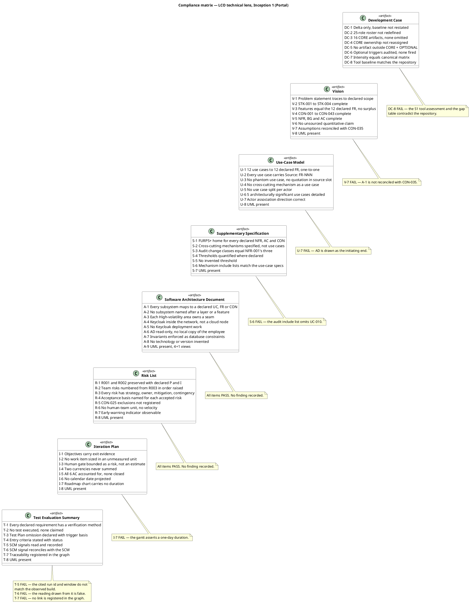
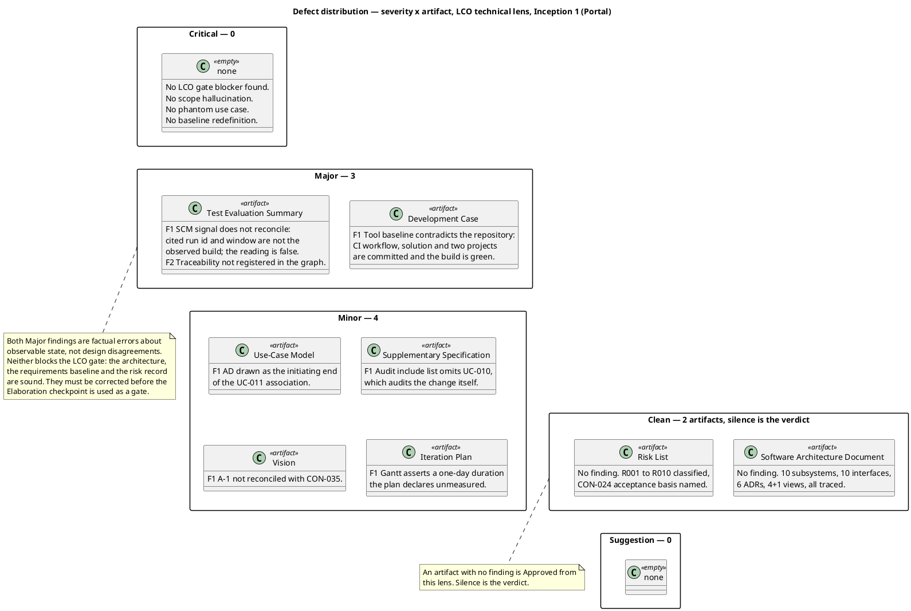
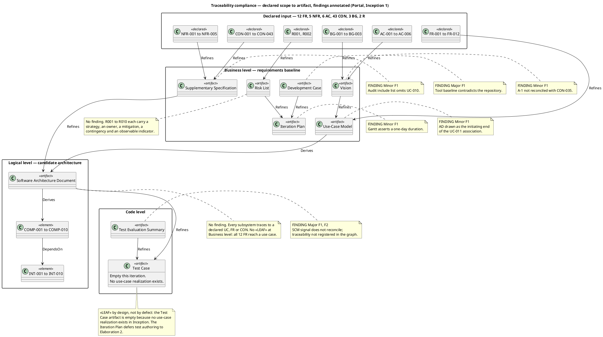

## Document Control
### Reviewer lens
- **Phase:** Inception
- **Status:** Draft — under review
- **Milestone Target:** End of Inception (not yet achieved)
- **Iteration:** 1, Cycle 1
- **Owner:** Reviewer
- **Date:** 2026-10-07

### Business Reviewer lens
- **Phase:** Inception
- **Status:** Draft — under review
- **Milestone Target:** End of Inception (not yet achieved)
- **Iteration:** 1, Cycle 1
- **Owner:** BusinessReviewer
- **Date:** 2026-10-07

## Review Scope and Criteria
### Reviewer lens
#### Iteration 1

**Review type.** Technical review, checklist-driven, at the Lifecycle Objectives review point. The evaluative lens is FEASIBILITY and LCO EXIT CRITERIA, not completion: Inception 1 produces no executable increment, so no completion lens applies and no acceptance criterion is closable.

**Artifacts in scope.** All eight artifacts persisted this iteration: Development Case, Vision, Use-Case Model, Supplementary Specification, Software Architecture Document, Risk List, Iteration Plan, Test Evaluation Summary.

**Checklists applied.** Per artifact type, and recorded item by item in the compliance matrix below.

| Artifact | Checklist applied |
|---|---|
| Development Case | DC Baseline Conformance (roster, CORE catalog, ownership, artifact universe, intensity) + Optional Trigger Justification against each §5.2 condition + tool-baseline verification against the repository |
| Vision | Requirements quality: complete, consistent, unambiguous, traceable, no unsourced quantitative claim; scope adherence against the declared input |
| Use-Case Model | Use-case quality: one-to-one with declared requirements, `Source: FR-NNN` on every use case, no phantom use case, no cross-cutting mechanism as a use case, no per-actor split, UML formal correctness |
| Supplementary Specification | FURPS+ coverage of every declared NFR, AC and CON; cross-cutting mechanisms specified and not promoted to use cases; threshold quantification |
| Software Architecture Document | Architecture quality: every subsystem traces to a declared element, no layer- or feature-named subsystem, one seam per High-volatility area, external-system placement, invariants as constraints, no invented technology |
| Risk List | Risk quality: declared risks preserved, team risks numbered per CON-023, strategy and owner per risk, acceptance basis named, no human-team unit |
| Iteration Plan | Plan quality: objectives carry exit evidence, no unmeasured unit, human gate bounded as a risk, two currencies never summed, all acceptance criteria accounted for |
| Test Evaluation Summary | Verifiability: every declared requirement has an observable verification method, no execution claimed, SCM signals read and recorded |

**Upstream consumption.** Every artifact was read in full before any finding was recorded. The declared scope in the Work Order was read as the ceiling. The trace graph was projected from the Business level (43 roots, 141 nodes) and read against each artifact's declared traceability. The SCM was read directly: build status on `main`, the issue tracker in all states, the open pull-request list, the branches awaiting review, and the repository tree.

**SCM evidence read this iteration.**

| Signal | Observed |
|---|---|
| Build, branch `main` | `ci-run-37583334371` — success, 2026-10-07 06:45:58Z to 06:47:38Z |
| Open pull requests | None |
| Branches labelled `ready-for-review` | None |
| Issues, all states | None |
| Repository tree | `.github/workflows/ci.yml` (sha `0c2fd7cf47eeab68d19420fe3897d209258bd074`), `Portal.sln` (sha `f554bf5bc04df43103677206c7727fcc62ea2bc4`), `src/Portal.Web/Portal.Web.csproj`, `tests/Portal.Tests/Portal.Tests.csproj`, `README.md`, `docs/inputs/employee-portal-design.html` (sha `715d4f73d6ef4de18c46242258bc17a67f51ba6f`). `CONTRIBUTING.md` and `.editorconfig` absent. |

**Pull-request disposition.** No open pull request exists, so every pull request has reached a terminal disposition vacuously and no disposition call was required. The repository carries scaffolding only — a solution, two empty projects, a CI workflow, a README and the mandatory design reference. No productive code is present, which is consistent with Inception scope. No scope-ahead branch exists.

**Entry criteria.** Met. All eight artifacts are complete and stable, no section is a placeholder, the upstream artifacts each artifact depends on are persisted, and the checklists were prepared before the artifacts were read.

## Findings
### Reviewer lens
#### Iteration 1

Seven findings: three Major, four Minor, no Critical. Two artifacts carry no finding and are Approved from this lens.

```plantuml
@startuml
title Compliance matrix — LCO technical lens, Inception 1 (Portal)

skinparam classAttributeIconSize 0
skinparam classFontStyle bold
skinparam classBackgroundColor #FFFFFF

class "Development Case" as DC <<artifact>> {
  DC-1 Delta only, baseline not restated
  DC-2 25-role roster not redefined
  DC-3 16 CORE artifacts, none omitted
  DC-4 CORE ownership not reassigned
  DC-5 No artifact outside CORE + OPTIONAL
  DC-6 Optional triggers audited, none fired
  DC-7 Intensity equals canonical matrix
  DC-8 Tool baseline matches the repository
}

class "Vision" as VIS <<artifact>> {
  V-1 Problem statement traces to declared scope
  V-2 STK-001 to STK-004 complete
  V-3 Features equal the 12 declared FR, no surplus
  V-4 CON-001 to CON-043 complete
  V-5 NFR, BG and AC complete
  V-6 No unsourced quantitative claim
  V-7 Assumptions reconciled with CON-035
  V-8 UML present
}

class "Use-Case Model" as UCM <<artifact>> {
  U-1 12 use cases to 12 declared FR, one-to-one
  U-2 Every use case carries Source: FR-NNN
  U-3 No phantom use case, no quotation in source slot
  U-4 No cross-cutting mechanism as a use case
  U-5 No use case split per actor
  U-6 5 architecturally significant use cases detailed
  U-7 Actor association direction correct
  U-8 UML present
}

class "Supplementary Specification" as SS <<artifact>> {
  S-1 FURPS+ home for every declared NFR, AC and CON
  S-2 Cross-cutting mechanisms specified, not use cases
  S-3 Audit change classes equal NFR-001's three
  S-4 Thresholds quantified where declared
  S-5 No invented threshold
  S-6 Mechanism include lists match the use-case specs
  S-7 UML present
}

class "Software Architecture Document" as SAD <<artifact>> {
  A-1 Every subsystem maps to a declared UC, FR or CON
  A-2 No subsystem named after a layer or a feature
  A-3 Each High-volatility area owns a seam
  A-4 Keycloak inside the network, not a cloud node
  A-5 No Keycloak deployment work
  A-6 AD read-only, no local copy of the employee
  A-7 Invariants enforced as database constraints
  A-8 No technology or version invented
  A-9 UML present, 4+1 views
}

class "Risk List" as RL <<artifact>> {
  R-1 R001 and R002 preserved with declared P and I
  R-2 Team risks numbered from R003 in order raised
  R-3 Every risk has strategy, owner, mitigation, contingency
  R-4 Acceptance basis named for each accepted risk
  R-5 CON-025 exclusions not registered
  R-6 No human-team unit, no velocity
  R-7 Early-warning indicator observable
  R-8 UML present
}

class "Iteration Plan" as IP <<artifact>> {
  I-1 Objectives carry exit evidence
  I-2 No work item sized in an unmeasured unit
  I-3 Human gate bounded as a risk, not an estimate
  I-4 Two currencies never summed
  I-5 All 6 AC accounted for, none closed
  I-6 No calendar date projected
  I-7 Roadmap chart carries no duration
  I-8 UML present
}

class "Test Evaluation Summary" as TES <<artifact>> {
  T-1 Every declared requirement has a verification method
  T-2 No test executed, none claimed
  T-3 Test Plan omission declared with trigger basis
  T-4 Entry criteria stated with status
  T-5 SCM signals read and recorded
  T-6 SCM signal reconciles with the SCM
  T-7 Traceability registered in the graph
  T-8 UML present
}

note bottom of DC
  DC-8 FAIL — the S1 tool assessment and the gap
  table contradict the repository.
end note

note bottom of TES
  T-5 FAIL — the cited run id and window do not
  match the observed build.
  T-6 FAIL — the reading drawn from it is false.
  T-7 FAIL — no link is registered in the graph.
end note

note bottom of UCM
  U-7 FAIL — AD is drawn as the initiating end.
end note

note bottom of SS
  S-6 FAIL — the audit include list omits UC-010.
end note

note bottom of VIS
  V-7 FAIL — A-1 is not reconciled with CON-035.
end note

note bottom of IP
  I-7 FAIL — the gantt asserts a one-day duration.
end note

note bottom of SAD
  All items PASS. No finding recorded.
end note

note bottom of RL
  All items PASS. No finding recorded.
end note

DC -[hidden]- VIS
VIS -[hidden]- UCM
UCM -[hidden]- SS
SS -[hidden]- SAD
SAD -[hidden]- RL
RL -[hidden]- IP
IP -[hidden]- TES
@enduml
```

```plantuml
@startuml
title Defect distribution — severity x artifact, LCO technical lens, Inception 1 (Portal)

skinparam classAttributeIconSize 0
skinparam packageStyle rectangle

package "Critical — 0" as CRIT {
  class "none" as C0 <<empty>> {
    No LCO gate blocker found.
    No scope hallucination.
    No phantom use case.
    No baseline redefinition.
  }
}

package "Major — 3" as MAJ {
  class "Development Case" as M1 <<artifact>> {
    F1 Tool baseline contradicts the repository:
    CI workflow, solution and two projects
    are committed and the build is green.
  }
  class "Test Evaluation Summary" as M2 <<artifact>> {
    F1 SCM signal does not reconcile:
    cited run id and window are not the
    observed build; the reading is false.
    F2 Traceability not registered in the graph.
  }
}

package "Minor — 4" as MIN {
  class "Use-Case Model" as N1 <<artifact>> {
    F1 AD drawn as the initiating end
    of the UC-011 association.
  }
  class "Supplementary Specification" as N2 <<artifact>> {
    F1 Audit include list omits UC-010,
    which audits the change itself.
  }
  class "Vision" as N3 <<artifact>> {
    F1 A-1 not reconciled with CON-035.
  }
  class "Iteration Plan" as N4 <<artifact>> {
    F1 Gantt asserts a one-day duration
    the plan declares unmeasured.
  }
}

package "Clean — 2 artifacts, silence is the verdict" as CLEAN {
  class "Software Architecture Document" as K1 <<artifact>> {
    No finding. 10 subsystems, 10 interfaces,
    6 ADRs, 4+1 views, all traced.
  }
  class "Risk List" as K2 <<artifact>> {
    No finding. R001 to R010 classified,
    CON-024 acceptance basis named.
  }
}

package "Suggestion — 0" as SUG {
  class "none" as S0 <<empty>>
}

note bottom of MAJ
  Both Major findings are factual errors about
  observable state, not design disagreements.
  Neither blocks the LCO gate: the architecture,
  the requirements baseline and the risk record
  are sound. They must be corrected before the
  Elaboration checkpoint is used as a gate.
end note

note bottom of CLEAN
  An artifact with no finding is Approved from
  this lens. Silence is the verdict.
end note

CRIT -[hidden]- MAJ
MAJ -[hidden]- MIN
MIN -[hidden]- CLEAN
CLEAN -[hidden]- SUG
@enduml
```

#### Development Case — Major

**F1 — The tool baseline contradicts the repository.** The section "Organization and tool assessment (S1, 2026-10-07)" states the repository holds the design reference "and nothing else. No CI workflow file, no `CONTRIBUTING.md`, no lint or analyzer configuration, and no open Change Requests." The gap table repeats it: "CI workflow under the hosted provider | Absent — gap". The SCM contradicts this. `.github/workflows/ci.yml` is committed at sha `0c2fd7cf47eeab68d19420fe3897d209258bd074`; `Portal.sln` is committed with two projects, `src/Portal.Web/Portal.Web.csproj` and `tests/Portal.Tests/Portal.Tests.csproj`; and a build ran on `main` (`ci-run-37583334371`). The two other gap claims — `CONTRIBUTING.md` and the lint/analyzer configuration — are correct. The consequence is operational: the Elaboration iteration-preparation checkpoint demands "CI workflow committed and green on an empty build" as an outstanding condition, and that condition is already satisfied, so the checkpoint as written would send Elaboration to close a gap that does not exist.

*Remediation.* Rewrite the S1 tool assessment and the gap table against the repository: record the CI workflow as present, the solution and the two scaffolding projects as present, and keep only `CONTRIBUTING.md` and the lint/analyzer configuration as open gaps. Remove "CI workflow committed and green on an empty build" from the Elaboration checkpoint's outstanding conditions, or restate it as already satisfied. The tailoring decisions T-1 to T-7, the classification verdicts, the optional-trigger table and the intensity statement are unaffected and stand.

*Evidence.* DC: "The repository holds the mandatory UI design reference at `docs/inputs/employee-portal-design.html` (CON-038) and nothing else. No CI workflow file..." against `scm_get_file_content('.github/workflows/ci.yml')` sha `0c2fd7cf47eeab68d19420fe3897d209258bd074`; `scm_get_file_content('Portal.sln')` sha `f554bf5bc04df43103677206c7727fcc62ea2bc4`; `scm_get_build_status(main)` `ci-run-37583334371`.

#### Test Evaluation Summary — Major

**F1 — The recorded SCM quality signal does not reconcile with the SCM, and the conclusion drawn from it is false.** The table cites "`ci-run-37581397618` — build and test completed, 2026-10-07 06:25:16Z to 06:26:16Z" and reads it as "No workflow file is committed, so this run is not the per-push build-and-test the regression rule needs (CON-033, E-6)." The run observed on `main` is `ci-run-37583334371`, 2026-10-07 06:45:58Z to 06:47:38Z; the cited run id and window do not match it. The inference is false independently of which run was read: `.github/workflows/ci.yml` is committed and triggers on `push` and on `pull_request`, so the run IS the per-push build-and-test. Entry criterion E-6 is met, not unmet, and the CI workflow appears wrongly in the three conditions of "Recommendation — Proceed to Elaboration" and in "Carried into Elaboration".

*Remediation.* Re-read the build status and the workflow file, replace the cited run id and window with the observed values, and correct the reading: E-6 is met. Remove the CI workflow from the three conditions in "Recommendation — Proceed to Elaboration" and from "Carried into Elaboration", leaving the two genuine gaps — the test stand-ins and the test conventions in `CONTRIBUTING.md`.

*Evidence.* TES: "`ci-run-37581397618` — build and test completed, 2026-10-07 06:25:16Z to 06:26:16Z" and "No workflow file is committed" against `scm_get_build_status(main)` = `ci-run-37583334371`, 2026-10-07 06:45:58Z to 06:47:38Z; `scm_get_file_content('.github/workflows/ci.yml')` present with `on: push` and `on: pull_request`.

**F2 — The declared traceability is not registered in the trace repository.** The Traceability table declares `Refines` links to Test Case, Risk List, Development Case, Use-Case Model, Vision and Supplementary Specification, and `DependsOn` links to the Software Architecture Document, and the "Coverage" paragraph claims twelve requirements, six acceptance criteria, five non-functional requirements and ten risks are each accounted for. The graph carries none of it: `model_get_upstream('Test Evaluation Summary')` returns no links, and the artifact does not appear anywhere in the Business-level trace tree, which lists Development Case, Vision, Use-Case Model, Supplementary Specification, Risk List, Iteration Plan, Software Architecture Document and Test Case. The coverage the summary claims therefore cannot be verified from the graph.

*Remediation.* Register the Test Evaluation Summary's upstream links in the trace repository — NFR-001 to NFR-005, AC-001 to AC-006, UC-001 to UC-012, R001 to R010, FR-001 to FR-012, CON-021/CON-033/CON-035/CON-040/CON-041, COMP-001 to COMP-010 and INT-001 to INT-010 — so the declared coverage is machine-verifiable. If the registration belongs to the SystemAnalyst as steward of the trace repository, raise it to that role rather than leaving the artifact unlinked.

*Evidence.* `model_get_upstream(projectId, 'Test Evaluation Summary')` returns "No trace links found for 'Test Evaluation Summary' (direction: upstream)"; the Business-level trace tree contains no Test Evaluation Summary node.

#### Use-Case Model — Minor

**F1 — Active Directory is drawn as the initiating end of the association to UC-011.** The Use-Case Diagram carries `AD --> UC011`, which asserts that the external system initiates the use case. The portal initiates the LDAP read; AD never initiates anything. The Actors table already describes AD correctly as "External system, supporting", so the diagram and the table disagree about the direction of initiation.

*Remediation.* Draw the association from UC-011 to Active Directory, or use a directed association whose arrow sits at AD, and keep AD as a supporting actor in the Actors table. The justification for modelling AD as a supporting actor — a live read of a system of record the portal does not own — is sound and needs no change.

*Evidence.* Use-Case Model, Use-Case Diagram: `AD --> UC011`; Actors table: "Active Directory | External system, supporting".

#### Supplementary Specification — Minor

**F1 — The audit mechanism's include list omits UC-010, while UC-010's own specification audits the change.** The cross-cutting mechanism table lists the audit trail as "Included by UC-005, UC-006, UC-008, UC-009, UC-012", and the mechanism diagram draws no AUDIT edge from U10. UC-010's main flow step 5 reads "The portal audits the change." Two statements about the same change class disagree, and NFR-001 is a mandatory audit requirement, so a downstream implementer has no single answer for whether the featuring path writes an audit record.

*Remediation.* Reconcile the two. Either add UC-010 to the audit mechanism's include list and draw the AUDIT edge from U10, or remove the audit step from UC-010 and state there that featuring is audited through UC-006 or UC-008. Keep the existing NFR-001 reasoning that featuring is not a fourth change class.

*Evidence.* Supplementary Specification, cross-cutting mechanism table: "Audit trail ... Included by UC-005, UC-006, UC-008, UC-009, UC-012"; Use-Case Model, UC-010 main flow step 5: "The portal audits the change."

#### Vision — Minor

**F1 — Assumption A-1 is not reconciled with CON-035.** A-1 reads "The portal's OIDC client is already registered in Keycloak and the credentials are with the development team, so login can be tested from day one." It does not say which issuer "tested from day one" means, while CON-035 requires the team to build and test against stand-ins and never against the real Keycloak, and A-3 in the same table states the stand-in rule. A downstream role can read A-1 as authorising team testing against the real Keycloak, which CON-035 forbids.

*Remediation.* State in A-1 that the registered client and its credentials exist for the human validation gate performed by Infrastructure with HR, and that team testing is against the stand-in OIDC issuer per CON-035 and A-3. The declared stakeholder statement is faithfully recorded; only the reconciliation is missing.

*Evidence.* Vision, Assumptions and Dependencies: A-1 against A-3 ("The team builds and tests against stand-ins it controls") and CON-035.

#### Iteration Plan — Minor

**F1 — The roadmap chart asserts durations the plan itself declares unmeasured.** The `@startgantt` block gives every iteration "lasts 1 day" and chains them end to end, while the caption states "The axis is ordinal, not calendar: one bar is one iteration and its width is a nominal unit, not a duration" and "No project start date is set and no calendar date is projected from an estimate." A reader who reads the chart and not the caption sees a seven-day project, which is a duration in a unit this system does not measure.

*Remediation.* Replace the gantt with a sequence or activity diagram that carries no duration, or state the nominal unit inside the chart itself — in its title or a note — so the chart cannot be read as a schedule. The milestone sequence, the iteration boundaries and the human-gate treatment are correct and need no change.

*Evidence.* Iteration Plan, Plan and Milestones: "[I1 Inception 1] lasts 1 day" ... "[T1 Transition 1] lasts 1 day" against the caption "The axis is ordinal, not calendar".

#### Software Architecture Document — no finding

No defect recorded. Every subsystem traces to a declared use case, requirement or constraint; no subsystem is named after a layer or a feature; each `Volatility: High` area owns a seam (`COMP-002` behind `INT-002`, `COMP-004` behind `INT-004`); Keycloak is placed inside the corporate network and no Keycloak deployment work is planned; AD is read-only with no local copy of the employee; the three invariants are enforced as database constraints; and no technology or version is invented. Approved from this lens.

#### Risk List — no finding

No defect recorded. R001 and R002 are preserved with their declared probability and impact; R003 to R010 are numbered in the order raised per CON-023; every risk carries a strategy, an owner, a mitigation, a contingency and an observable early-warning indicator; every accepted risk names its CON-024 basis; the CON-025 exclusions are not registered; and no human-team unit or velocity appears. Approved from this lens.

#### Traceability compliance — this iteration

```plantuml
@startuml
title Traceability compliance — declared scope to artifact, findings annotated (Portal, Inception 1)

skinparam classAttributeIconSize 0
skinparam packageStyle rectangle

package "Declared input — 12 FR, 5 NFR, 6 AC, 43 CON, 3 BG, 2 R" as DECL {
  class "FR-001 to FR-012" as FR <<declared>>
  class "NFR-001 to NFR-005" as NFR <<declared>>
  class "AC-001 to AC-006" as AC <<declared>>
  class "CON-001 to CON-043" as CON <<declared>>
  class "BG-001 to BG-003" as BG <<declared>>
  class "R001, R002" as R <<declared>>
}

package "Business level — requirements baseline" as BIZ {
  class "Vision" as VIS <<artifact>>
  class "Use-Case Model" as UCM <<artifact>>
  class "Supplementary Specification" as SS <<artifact>>
  class "Risk List" as RL <<artifact>>
  class "Iteration Plan" as IP <<artifact>>
  class "Development Case" as DC <<artifact>>
}

package "Logical level — candidate architecture" as LOG {
  class "Software Architecture Document" as SAD <<artifact>>
  class "COMP-001 to COMP-010" as COMP <<element>>
  class "INT-001 to INT-010" as INT <<element>>
}

package "Code level" as CODE {
  class "Test Evaluation Summary" as TES <<artifact>>
  class "Test Case" as TC <<artifact>> {
    Empty this iteration.
    No use-case realization exists.
  }
}

FR --> UCM : Refines
NFR --> SS : Refines
AC --> VIS : Refines
CON --> SS : Refines
BG --> VIS : Refines
R --> RL : Refines

UCM --> SAD : Derives
SS --> SAD : Refines
VIS --> UCM : Refines
RL --> IP : Refines
DC --> IP : Refines

SAD --> COMP : Derives
COMP --> INT : DependsOn
SAD --> TC : Refines
TES --> TC : Refines

note right of UCM
  FINDING Minor F1
  AD drawn as the initiating end
  of the UC-011 association.
end note

note right of SS
  FINDING Minor F1
  Audit include list omits UC-010.
end note

note right of VIS
  FINDING Minor F1
  A-1 not reconciled with CON-035.
end note

note right of IP
  FINDING Minor F1
  Gantt asserts a one-day duration.
end note

note right of DC
  FINDING Major F1
  Tool baseline contradicts the repository.
end note

note right of TES
  FINDING Major F1, F2
  SCM signal does not reconcile;
  traceability not registered in the graph.
end note

note bottom of SAD
  No finding. Every subsystem traces to a
  declared UC, FR or CON. No «LEAF» at
  Business level: all 12 FR reach a use case.
end note

note bottom of RL
  No finding. R001 to R010 each carry a
  strategy, an owner, a mitigation, a
  contingency and an observable indicator.
end note

note bottom of TC
  «LEAF» by design, not by defect: the Test
  Case artifact is empty because no use-case
  realization exists in Inception. The
  Iteration Plan defers test authoring to
  Elaboration 2.
end note

DECL -[hidden]- BIZ
BIZ -[hidden]- LOG
LOG -[hidden]- CODE
@enduml
```

**What the graph shows.** Every one of the twelve declared requirements reaches a use case — no `«LEAF»` at the Business level, so no requirement is unrealized. Every use case reaches a component in the Software Architecture Document. No `«SUSPECT → role»` edge exists anywhere in the tree, so no role is holding an unreviewed change. The `Test Case` node is a `«LEAF»` by design: the artifact is empty because no use-case realization exists in Inception, and the Iteration Plan defers test authoring to Elaboration 2.

**What the graph does not show.** The Test Evaluation Summary is absent from the tree entirely, which is finding F2 above. Its declared coverage of twelve requirements, six acceptance criteria, five non-functional requirements and ten risks is asserted in prose and unverifiable from the graph.

**Coverage of the declared input.** All twelve FR, five NFR, six AC, forty-three CON, three BG and two declared risks are cited by at least one artifact. No artifact cites an identifier outside the declared families. No artifact quotes the stakeholder in place of citing an identifier.

## Resolutions and Actions
### Reviewer lens
#### Iteration 1

**No prior finding of this lens exists.** This is the first review pass of the project: `read_artifact_findings` returned an empty list for all eight artifacts, so no closure, deferral or rejection was available to record and no `resolve_artifact_finding` call was emitted. The closure state is consistent with the finding ledger.

**Open actions.** Seven findings are open, each with a named owner and a concrete remediation. None is a Critical finding, so none blocks the LCO gate; the three Major findings must be corrected before the Elaboration iteration-preparation checkpoint is used as a gate.

| Finding | Severity | Owner | Action | Blocks LCO |
|---|---|---|---|---|
| Development Case#F1 | Major | ProcessEngineer | Rewrite the S1 tool assessment and the gap table against the repository; remove the CI workflow from the Elaboration checkpoint's outstanding conditions. | No |
| Test Evaluation Summary#F1 | Major | TestManager | Replace the cited run id and window with the observed build; correct the reading of E-6 to met; remove the CI workflow from the recommendation and the carried-forward list. | No |
| Test Evaluation Summary#F2 | Major | TestManager, with SystemAnalyst as trace steward | Register the artifact's upstream links in the trace repository so its declared coverage is machine-verifiable. | No |
| Use-Case Model#F1 | Minor | SystemAnalyst | Reverse the UC-011 to Active Directory association so the portal is the initiating end. | No |
| Supplementary Specification#F1 | Minor | RequirementsSpecifier | Reconcile the audit mechanism's include list with UC-010's audit step. | No |
| Vision#F1 | Minor | SystemAnalyst | Reconcile A-1 with CON-035 and A-3. | No |
| Iteration Plan#F1 | Minor | ProjectManager | Remove the duration from the roadmap chart, or state the nominal unit inside the chart. | No |

**No action is deferred to a later iteration.** All seven are correctable within Inception 1 and none requires a Change Request: each restores the artifact's agreement with the declared scope or with observable state, and none changes declared scope.

## Disposition
### Reviewer lens
#### Iteration 1

**Disposition from this lens: Approved with Changes.**

**Basis.** The requirements baseline is sound and complete. Twelve declared requirements map one-to-one to twelve use cases, each carrying its `Source: FR-NNN`; no phantom use case exists; no cross-cutting mechanism was promoted to a use case; no use case was split per actor. The candidate architecture is sound: ten subsystems, ten interfaces, six architecture decision records, all four-plus-one views, every subsystem traced to a declared element, and the two `Volatility: High` areas each isolated behind a seam. The risk record is sound: R001 to R010 classified with strategy, owner, mitigation, contingency and an observable indicator, and every accepted risk naming its CON-024 basis. The Development Case's tailoring is baseline-conformant: the roster is not redefined, no CORE artifact is omitted, no ownership is reassigned, no artifact outside the CORE plus OPTIONAL universe is listed, the intensity equals the canonical matrix, and all six optional triggers were audited against their §5.2 conditions and none fired.

**Why not Approved.** Three Major findings are open. Two of them are factual errors about observable state — the Development Case's tool baseline and the Test Evaluation Summary's SCM signal — and the third is an unregistered traceability claim. Each is a statement a downstream role would act on and be misled by: the Elaboration checkpoint would be used to close a gap that does not exist, and the Test Evaluation Summary's coverage would be taken as verified when the graph does not carry it.

**Why not Rejected.** No Critical finding exists. No scope hallucination, no phantom use case, no baseline redefinition, no ownership reassignment, no invented technology, no fabricated quantitative claim, no unsourced financial figure. The defects are corrections to statements about observable state, not defects in the requirements, the architecture or the risk treatment.

**LCO exit criteria, from this lens.** The technical artifacts collectively satisfy the LCO conditions: the scope is agreed and complete with no open scope question, the initial risks are identified and classified, and the architecture is first-cut and confronts the highest-magnitude technical risks rather than deferring them. The three Major findings are corrections to be made within this iteration, not conditions the project cannot meet.

**This is the Reviewer's technical-lens disposition on the artifacts. The LCO milestone verdict is the ReviewCoordinator's, and the milestone is not achieved until that verdict is recorded.**

## Traceability
### Reviewer lens
| Element | Traces From | Link Type | Traces To |
|---|---|---|---|
| Review Record | Development Case, Vision, Use-Case Model, Supplementary Specification, Software Architecture Document, Risk List, Iteration Plan, Test Evaluation Summary | Refines | — |
| Development Case#F1 | Development Case | Refines | — |
| Test Evaluation Summary#F1 | Test Evaluation Summary | Refines | — |
| Test Evaluation Summary#F2 | Test Evaluation Summary | Refines | — |
| Use-Case Model#F1 | Use-Case Model | Refines | — |
| Supplementary Specification#F1 | Supplementary Specification | Refines | — |
| Vision#F1 | Vision | Refines | — |
| Iteration Plan#F1 | Iteration Plan | Refines | — |
| Review Record | FR-001, FR-002, FR-003, FR-004, FR-005, FR-006, FR-007, FR-008, FR-009, FR-010, FR-011, FR-012 | Refines | — |
| Review Record | NFR-001, NFR-002, NFR-003, NFR-004, NFR-005 | Refines | — |
| Review Record | AC-001, AC-002, AC-003, AC-004, AC-005, AC-006 | Refines | — |
| Review Record | R001, R002 | Refines | — |
| Review Record | `ci-run-37583334371` | DependsOn | — |

**Reading the table.** `Traces From` is the artifact or declared input this review is accountable to. The `Traces To` end is empty: the Review Record is a terminal quality-gate artifact, and the elements it feeds — the corrected artifacts and the ReviewCoordinator's milestone verdict — are produced by other roles after this review. The `ci-run-37583334371` row is the observed build the SCM-evidence section rests on.

