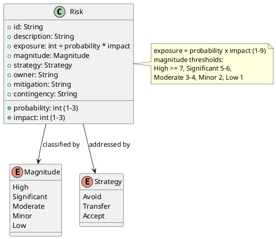

## Document Control

| Field | Value |
|---|---|
| Phase | Inception |
| Status | Draft |
| Milestone Target | End-of-Inception (Lifecycle Objectives) — NOT YET ACHIEVED |

## Risk Classification

Risks are classified by **probability × impact = exposure** (1–9), mapped to a magnitude band. Every risk carries a strategy (Avoid / Transfer / Accept); accepted risks carry both a mitigation action and a contingency plan.

## Risk Register

| ID | Description | P | I | Exposure | Magnitude | Strategy | Owner |
|---|---|---|---|---|---|---|---|
| R001 | AD integration: LDAP attributes the directory reads (job title, extension) may not be filled consistently across the 3 offices; directory shows gaps if not tested early | 3 | 3 | 9 | High | Accept | Software Architect |
| R002 | Digital clocking adoption: employees may keep using Excel out of habit if the change is not communicated well | 3 | 2 | 6 | Significant | Accept | Project Manager |
| R003 | Human gate queue time: STK-003 (Infrastructure) has low interest in features; AD/Keycloak clarifications may stall in queue. Ceiling 14 days, then the process SUSPENDS (DC measurement policy) | 2 | 3 | 6 | Significant | Accept | Project Manager |
| R004 | Scope volatility of UC-001 (clocking interaction, offline-retry window) and UC-008 (directory field availability) — both Medium volatility; may expand scope in Elaboration | 2 | 2 | 4 | Moderate | Accept | System Analyst |

## Risk Mitigation and Contingency

| ID | Mitigation (reduce probability/impact) | Contingency (if it occurs) |
|---|---|---|
| R001 | Validate AD attribute consistency in Elaboration iteration 1 against UC-008 (detailed this iteration); confirm with STK-003 which LDAP attributes are populated per office | Render blank fields gracefully (UC-008 A2 already specifies this); surface gaps to STK-001 for an AD data-quality decision |
| R002 | Communication + training plan in Transition; clocking is the first screen employees see (UC-001); adoption measured against BG-003 (80% in 3 months) | HR-assisted clocking during the adoption window; escalate to STK-001 if adoption lags BG-003 |
| R003 | Ask AD/Keycloak questions early and in parallel (single questionnaire per gate); route technical clarifications to STK-002 where possible to avoid STK-003 queue | Escalate stalled gates to STK-001 (sponsor, High influence) to unblock; track queue time in the Risk List each iteration |
| R004 | UC-001 and UC-008 already detailed in Inception (architecturally significant); any change flows through the CCB Change Request process (CON-016 closed list, CON-015 invariant) | A CR re-scopes the affected iteration; scope bends to the iteration budget box, not the reverse |

## Traceability

| Element | Traces From | Link Type | Traces To |
|---|---|---|---|
| R001 | CON-007, FR-008, UC-008 | DependsOn | Software Architecture Document (Elaboration) |
| R002 | BG-003, AC-004, FR-001 | DependsOn | Iteration Plan (Transition) |
| R003 | STK-003, CON-006, CON-010 | DependsOn | Iteration Plan (human gates) |
| R004 | UC-001, UC-008, CON-015, CON-016 | DependsOn | Iteration Plan (Elaboration) |
