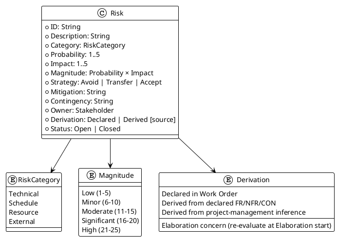
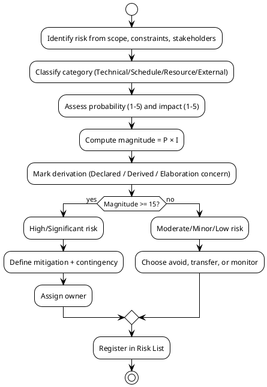

## Document Control

| Field | Value |
|---|---|
| Project | Portal |
| Phase | Inception |
| Iteration | 3 |
| Status | Draft |
| Milestone Target | LCO final closure / Elaboration entry readiness |

## Risk Classification

### Classification Rules

| Magnitude | Range | Response |
|---|---|---|
| High | 21–25 | Mitigation + contingency mandatory; track weekly |
| Significant | 16–20 | Mitigation + contingency; track each iteration |
| Moderate | 11–15 | Mitigation or transfer; monitor |
| Minor | 6–10 | Transfer or accept; monitor |
| Low | 1–5 | Accept; no active tracking |

### Derivation Rules

| Derivation | Meaning | Treatment |
|---|---|---|
| Declared | Risk explicitly named in the Work Order (R001, R002) | Treated as confirmed project risk |
| Derived from declared FR/NFR/CON | Risk inferred from a declared requirement or constraint | Marked with source identifiers; valid Inception risk if it threatens milestone viability |
| Derived from project-management inference | Risk inferred from process mechanics (e.g., gate queue time) | Owned by Project Manager; tracked as schedule risk |
| Elaboration concern | Risk that cannot be validated until architecture decisions are made | Carried forward to Elaboration; not counted as closed Inception risk |

## Risk Register

| ID | Description | Category | P | I | Magnitude | Strategy | Owner | Derivation | Status |
|---|---|---|---|---|---|---|---|---|---|
| R001 | Active Directory LDAP attributes (job title, extension) may not be filled consistently across the 3 offices; directory shows gaps and AC-003 fails | Technical | 3 | 3 | 9 (Minor) | Accept + Mitigate | STK-003 | Declared (Work Order) | Open |
| R002 | Employees may keep using Excel for clocking out of habit if the change is not communicated well; BG-002 and BG-003 at risk | External | 3 | 2 | 6 (Minor) | Accept + Mitigate | STK-001 | Declared (Work Order) | Open |
| R003 | Keycloak OIDC client credentials or AD group claim mapping not aligned with portal role model; blocks authentication and authorization testing | Technical | 2 | 4 | 8 (Minor) | Transfer | STK-003 | Derived — from CON-004, CON-005, NFR-006 | Open |
| R004 | Custom UI design (`docs/inputs/employee-portal-design.html`) is incomplete or not committed; visual layer cannot be validated | Schedule | 2 | 3 | 6 (Minor) | Avoid | STK-002 | Derived — from CON-015 | Open |
| R005 | localStorage clocking retry logic fails across Chrome/Edge edge cases (private browsing, storage quotas); NFR-007 and AC-005 at risk | Technical | 2 | 4 | 8 (Minor) | Accept + Mitigate | STK-002 | Derived — from NFR-007, CON-009 | Open |
| R006 | PostgreSQL on internal Windows Server deployment differs from team development environment; deployment/integration issues in Transition | Technical | 2 | 3 | 6 (Minor) | Transfer | STK-003 | Derived — from CON-007, CON-013 | Open |
| R007 | HR news featuring invariant (CON-019) implemented only in UI form, not enforced at service/domain layer; data integrity risk | Technical | 2 | 4 | 8 (Minor) | Avoid | STK-002 | Derived — from CON-019 | Open |
| R008 | Stakeholder availability for iteration-close review and acceptance decisions; gates extend elapsed time | Schedule | 3 | 2 | 6 (Minor) | Accept + Mitigate | STK-001 | Derived — from project-management inference (gate model) | Open |
| R010 | `CONTRIBUTING.md` coding-standards section missing at end of Inception; blocks CodeReviewer gate E1-G1 before Construction | Schedule | 2 | 3 | 6 (Minor) | Avoid | Implementer + CodeReviewer | Derived — from Development Case §Guidelines and Procedures E1-G1 | Open |
| R011 | `CONTRIBUTING.md` UI-conventions section missing; blocks UserInterfaceDesigner gate E1-G2 before UI construction | Schedule | 2 | 3 | 6 (Minor) | Avoid | UserInterfaceDesigner | Derived — from Development Case §Guidelines and Procedures E1-G2 | Open |
| R012 | `CONTRIBUTING.md` test-conventions section missing; blocks TestDesigner/TestManager gate E1-G3 before Test Case production | Schedule | 2 | 3 | 6 (Minor) | Avoid | TestDesigner + TestManager | Derived — from Development Case §Guidelines and Procedures E1-G3 | Open |
| R013 | `CONTRIBUTING.md` design-conventions section missing; blocks SoftwareArchitect/Designer gate E1-G4 before Design Model elaboration | Schedule | 2 | 3 | 6 (Minor) | Avoid | SoftwareArchitect + Designer | Derived — from Development Case §Guidelines and Procedures E1-G4 | Open |
| R014 | `.github/workflows/ci.yml` does not build solution or run tests green before Construction; blocks gate E1-G5 | Technical | 2 | 4 | 8 (Minor) | Avoid | ConfigurationManager + Implementer | Derived — from Development Case §Guidelines and Procedures E1-G5 | Open |
| R015 | Lint/format config (`.editorconfig`, `dotnet-tools.json`) missing or not enforced in CI; blocks gate E1-G6 | Technical | 2 | 3 | 6 (Minor) | Avoid | Implementer + CodeReviewer | Derived — from Development Case §Guidelines and Procedures E1-G6 | Open |

## Risk Mitigation and Contingency

### R001 — Active Directory attribute gaps

- **Mitigation:** In the first Elaboration iteration, build a directory prototype that reads all six AD attributes for a sample of employees from each office and reports fill rates to STK-003 before full directory implementation.
- **Contingency:** If fill rate is below 90% for job title or extension, escalate to STK-003 to clean AD data; meanwhile, render missing fields as blank (per UC-012 A1) and document the gap in the Iteration Assessment.

### R002 — Digital clocking adoption

- **Mitigation:** Include a communication work item in the first Construction iteration; STK-001 owns a launch memo and on-screen guidance so employees know the Excel process is retired.
- **Contingency:** If adoption metrics (measured by unique clocking employees / total employees) fall below 60% at the 6-week mark, STK-001 runs a follow-up campaign and the project reserves one iteration for usability improvements.

### R003 — Keycloak OIDC / AD group claim mapping

- **Mitigation:** Transfer ownership to STK-003 to confirm the OIDC client registration, available claims, and HR AD group name. The Software Architect validates the mapping in a spike during Elaboration. **Scope-level mitigation:** CON-005 already states the OIDC client is registered and credentials are with the development team, so the risk is reduced to claim-name alignment rather than client provisioning.
- **Contingency:** If claims cannot carry the HR group, fall back to a configured list of HR user IDs in application settings (explicitly scoped as a temporary measure requiring CR to make permanent).

### R004 — Custom UI design not available

- **Mitigation:** Avoid by verifying the design file exists in the repository before any UI construction begins. The Iteration Plan for Elaboration-1 includes a gate: "design file present and versioned."
- **Contingency:** If the file is missing, block UI implementation and request stakeholder input; do not author a replacement design.

### R005 — localStorage retry edge cases

- **Mitigation:** Implement the retry queue with explicit storage-quota handling and test in normal and private browsing modes on Chrome and Edge. Include automated unit tests for the retry logic.
- **Contingency:** If localStorage proves unreliable, switch to an in-memory queue with a visible warning that the retry window is lost on page close; this requires a CR because it changes NFR-007.

### R006 — Windows Server PostgreSQL deployment mismatch

- **Mitigation:** Transfer to STK-003 to provide a target-like staging environment early in Construction. The Implementer runs deployment smoke tests there.
- **Contingency:** If staging is unavailable, use a containerized PostgreSQL instance for development and flag deployment validation as a Transition risk.

### R007 — News featuring invariant not enforced at domain layer

- **Mitigation:** Avoid by requiring the Software Architect to model the featured invariant in the domain/service layer, with database-level uniqueness constraint on `IsFeatured = true`. Include a unit test that asserts only one featured item exists.
- **Contingency:** If the invariant cannot be enforced at the database, enforce it in a transaction-wrapped service operation and add an integration test.

### R008 — Stakeholder availability for gates

- **Mitigation:** Schedule iteration-close reviews at the start of each iteration and send the review package 2 days before the gate. Track gate queue time separately from agent work.
- **Contingency:** If a stakeholder cannot attend, obtain written sign-off asynchronously; if sign-off is delayed beyond 5 queue days, record the slip in the Iteration Assessment and adjust the next iteration's elapsed-time forecast.

### R010 — Missing coding-standards section

- **Mitigation:** Avoid by assigning Implementer + CodeReviewer to create the `CONTRIBUTING.md` coding-standards section as the first work item in Elaboration Iteration 1, before any Construction work.
- **Contingency:** If the section is not reviewed by the end of Elaboration Iteration 1, block Construction Iteration 1 start until CodeReviewer sign-off is obtained.

### R011 — Missing UI-conventions section

- **Mitigation:** Avoid by assigning UserInterfaceDesigner to add a UI-conventions section to `CONTRIBUTING.md` referencing `design.html` in Elaboration Iteration 1.
- **Contingency:** If missing before UI construction, defer UI work and request stakeholder clarification on whether the mandatory design file is sufficient guidance.

### R012 — Missing test-conventions section

- **Mitigation:** Avoid by assigning TestDesigner + TestManager to add test-conventions to `CONTRIBUTING.md` in Elaboration Iteration 1.
- **Contingency:** If missing before Test Case production in Construction, use the IARI baseline test conventions as a fallback and record a technical-debt item.

### R013 — Missing design-conventions section

- **Mitigation:** Avoid by assigning SoftwareArchitect + Designer to add design-conventions to `CONTRIBUTING.md` in Elaboration Iteration 1.
- **Contingency:** If missing before Design Model elaboration in Elaboration Iteration 2, hold a design review and document agreed conventions in the Iteration Assessment.

### R014 — CI workflow not green

- **Mitigation:** Avoid by verifying `.github/workflows/ci.yml` builds the .NET 10 solution and runs tests successfully on the default branch before Construction starts. The workflow is already present (SHA `631383c12d2692881e092439857a435d6392b2a7`); the gate is to confirm it is green.
- **Contingency:** If the workflow fails, assign ConfigurationManager + Implementer to fix it and block Construction code merge until CI is green.

### R015 — Lint/format config missing

- **Mitigation:** Avoid by creating `.editorconfig` and/or `dotnet-tools.json` and enforcing them in CI in Elaboration Iteration 1.
- **Contingency:** If config cannot be enforced in CI, run lint/format checks locally and record the gap as a technical-debt item for Transition.

## Traceability

| Element | Traces From | Link Type | Traces To |
|---|---|---|---|
| R001 | Work Order R001 | DependsOn | UC-012 |
| R002 | Work Order R002 | DependsOn | UC-003 |
| R003 | CON-004, CON-005, NFR-006 | DependsOn | UC-001..UC-012 |
| R004 | CON-015 | DependsOn | UC-001..UC-012 |
| R005 | NFR-007, CON-009 | DependsOn | UC-003 |
| R006 | CON-007, CON-013 | DependsOn | SAD Deployment View, Transition planning |
| R007 | CON-019 | DependsOn | UC-008, UC-009, UC-010 |
| R008 | STK-001, gate model | DependsOn | Iteration Plan |
| R010 | Development Case §Guidelines and Procedures E1-G1 | DependsOn | CONTRIBUTING.md coding-standards section |
| R011 | Development Case §Guidelines and Procedures E1-G2 | DependsOn | CONTRIBUTING.md UI-conventions section |
| R012 | Development Case §Guidelines and Procedures E1-G3 | DependsOn | CONTRIBUTING.md test-conventions section |
| R013 | Development Case §Guidelines and Procedures E1-G4 | DependsOn | CONTRIBUTING.md design-conventions section |
| R014 | Development Case §Guidelines and Procedures E1-G5 | DependsOn | `.github/workflows/ci.yml` |
| R015 | Development Case §Guidelines and Procedures E1-G6 | DependsOn | `.editorconfig` / `dotnet-tools.json` |
