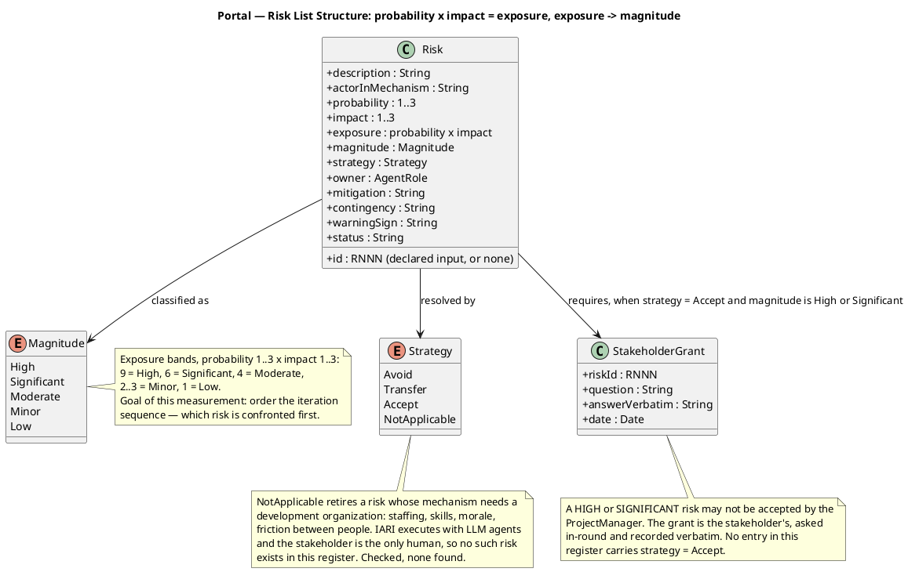
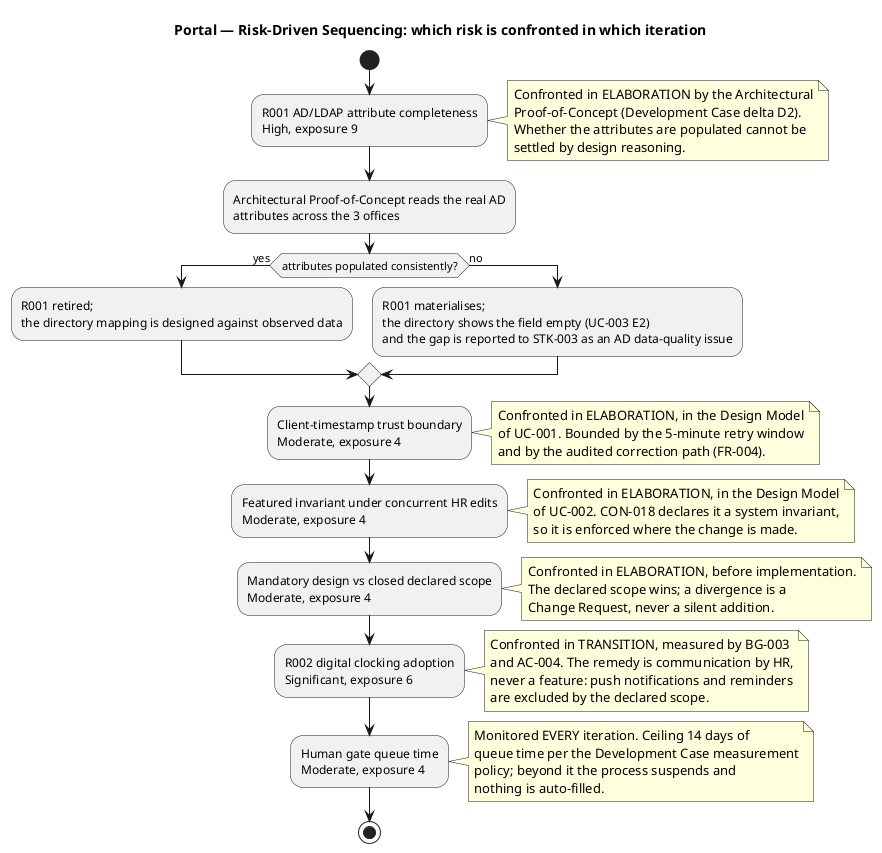

## Document Control

| Field | Value |
|---|---|
| Artifact | Risk List — Portal (Employee Portal, Cuba Corp) |
| Phase | Inception |
| Status | Draft — produced for review; milestone NOT YET ACHIEVED |
| Milestone Target | End-of-Inception (not marked complete by this artifact) |
| Iteration / Cycle | 1 / 1 |
| Owner | ProjectManager |
| Date | 2026-09-17 |
| Governing process | Development Case (Inception) — measurement policy: tokens + elapsed time, agent vs human queue, never summed |
| Evolution this iteration | Initial register created. R001 and R002 are the two risks the declared scope carries and are cited by their **declared** identifiers. Four further risks were identified by the ProjectManager from the declared constraints and the Development Case; they are recorded **without** R-family identifiers, because that family is declared input and is not minted by this role. No risk carries strategy `accept`. |

**What this register is for.** It is the primary driver of iteration sequencing. Every risk below names the actor in its mechanism, is classified by probability × impact = exposure, and is assigned a strategy with a mitigation action and a contingency. The decision this register enables is: **which risk is confronted in which iteration, and what we do if it materialises.**

**On identifiers.** The `RNNN` family is **declared input** — assigned in the Work Order and copied exactly, never minted. R001 and R002 are the two risks the declared scope carries. The four additional risks below are real and are classified with the same rigour, but they carry **no identifier**: composing one would produce a citation that looks verified and is not. They are referenced by name. If the stakeholder wants them tracked as first-class risks with identifiers, assigning those identifiers is the stakeholder's act.

## Risk Classification

**Exposure bands.** Probability and impact are each scored 1–3. Exposure = probability × impact.

| Exposure | Magnitude | Meaning for this project |
|---|---|---|
| 9 | **High** | Threatens the project's viability or a declared acceptance criterion. Confronted before anything else. |
| 6 | **Significant** | Threatens a declared business goal. Confronted, but not ahead of a High. |
| 4 | **Moderate** | Threatens a quality attribute or a design invariant. Confronted within the iteration that owns the affected use case. |
| 2–3 | Minor | Absorbed by normal iteration work. |
| 1 | Low | Recorded for completeness. |

**The measurement goal of this classification.** It exists to order the iteration sequence — nothing else. It is not a scorecard and it is not reported as a project health figure. A risk whose magnitude does not change which iteration confronts it does not belong in this table.

**Risks retired as not applicable — the development-organization check.** Every risk names an actor in its mechanism. IARI executes with LLM agents; the stakeholder is the only human. A risk whose mechanism needs a *development organization* — staffing, skills, morale, friction between people, key-person dependency, onboarding time — has no actor here. I checked the declared scope and the Development Case for such risks and found **none**: the declared risks (R001, R002) are about the system's data source and about the people the system serves, both of which are domain risks and both of which stay. No entry in this register carries `not applicable`.

**Risks about the people the SYSTEM serves stay.** R002 is about Cuba Corp's 200 employees and their habit of using Excel. That is a domain risk — the actor is the end user, who is real — and it is classified, not retired.

## Risk Register

### Declared risks — cited by their declared identifiers

| ID | Risk statement | Actor in the mechanism | P | I | Exposure | Magnitude | Confronted in |
|---|---|---|---|---|---|---|---|
| R001 | **Active Directory integration.** The LDAP attributes the directory reads may not be filled consistently across the 3 offices (job title, extension). If not tested early, the directory shows gaps. | STK-003 Infrastructure team (operates AD and owns its data quality); ACT-003 Active Directory | 3 | 3 | 9 | **High** | **Elaboration** — Architectural Proof-of-Concept (DC delta D2) |
| R002 | **Digital clocking adoption.** Some employees may keep using Excel out of habit if the change is not communicated well. | STK-004 Cuba Corp Employees (the end users whose habit is the mechanism); STK-001 HR Director (owns the communication) | 3 | 2 | 6 | **Significant** | **Transition** — measured by BG-003 and AC-004 |

### Additional risks identified by the ProjectManager — no declared identifier

These four are variables that can take a value that endangers success, and each one changes a decision. They carry no `RNNN` identifier because that family is declared input; they are referenced by name.

| Risk (by name) | Risk statement | Actor in the mechanism | P | I | Exposure | Magnitude | Confronted in |
|---|---|---|---|---|---|---|---|
| Client-timestamp trust boundary | FR-012 requires the server to accept the timestamp the client sends — the time the employee pressed the button, not the time the server received it. A client clock that is wrong, or a queued press replayed later, writes an attendance record that is wrong and is not detectable from the record itself. | ACT-001 Employee (the browser whose clock supplies the value); the portal's clocking endpoint | 2 | 2 | 4 | **Moderate** | **Elaboration** — Design Model of UC-001 |
| Featured invariant under concurrent HR edits | CON-018 declares "at most one featured" a system invariant that must hold wherever the change comes from. Two HR administrators featuring two different items at the same moment can leave two featured items, and the banner then has no defined content. | ACT-002 HR Administrator (two concurrent sessions); the news write path | 2 | 2 | 4 | **Moderate** | **Elaboration** — Design Model of UC-002 |
| Human gate queue time | The stakeholder is the only human in the loop. Every gate — a questionnaire answer, a milestone approval, a Change Request decision — is queue time, not work time, and an unanswered gate suspends the process. | STK-001 Laura Gómez (project sponsor, the gate approver); STK-002 Miguel Torres (engineering clarifications) | 2 | 2 | 4 | **Moderate** | **Every iteration** — monitored, ceiling 14 days |
| Mandatory design versus closed declared scope | CON-013 makes `docs/inputs/employee-portal-design.html` mandatory and authoritative for the UI visual layer, while the declared scope is a closed set of fourteen functional requirements with named exclusions. If the supplied design depicts a screen or a control the declared scope does not authorise, the two mandates conflict. | UserInterfaceDesigner and Designer (who must implement the design); STK-001 (who owns the scope decision) | 2 | 2 | 4 | **Moderate** | **Elaboration** — before implementation starts |

**Why these four are in the register and not in a backlog.** Each one changes a decision: the client-timestamp risk changes how the clocking endpoint validates what it accepts; the featured-invariant risk changes where the invariant is enforced; the gate-queue risk changes whether a gate must be bounded; the design-versus-scope risk changes whether a Change Request is raised before implementation. A risk that changes no decision is not recorded here.

**Why R001 is the dominant risk.** It is the only High. The declared scope gives the portal **no local copy of the employee** (CON-020) and **no reconciliation path**, so a gap in AD is a gap in the directory with no fallback — and the directory is the subject of AC-003. Whether the attributes are actually populated across the 3 offices is an empirical question that design reasoning cannot settle, which is exactly why the Development Case fired the Architectural Proof-of-Concept trigger on it (delta D2) and why it is confronted in Elaboration rather than deferred.

## Risk Mitigation and Contingency

### Declared risks

| ID | Strategy | Mitigation action | Contingency if it materialises | Warning sign | Owner |
|---|---|---|---|---|---|
| R001 | **Avoid** | Confront it empirically before designing the mapping: the Architectural Proof-of-Concept reads the real AD attributes across all 3 offices and reports which of job title, department, office, email and extension are actually populated. The directory's attribute mapping is then designed against observed data, not against the assumption that AD is complete. | The directory shows the missing field **empty** and substitutes nothing (UC-003 E2, CON-020 forbids a local copy and CON-024 forbids inventing data). The gap is reported to STK-003 as an AD data-quality issue — AD is their system of record (CON-006, CON-010) and this project neither administers nor writes to it. No fallback value, no local cache, no sync job is created. | The Proof-of-Concept finds any of the five attributes unpopulated for a material share of employees in any one office. | SoftwareArchitect (Proof-of-Concept); ProjectManager (escalation to STK-003) |
| R002 | **Avoid** | The remedy is communication, not a feature. HR (STK-001) communicates the change before go-live; the clocking action is reachable and unambiguous from the main screen (SS-USA-05, SS-USA-08) so that no training is required (AC-004). Adoption is measured against BG-003 (80% of 200 employees within 3 months) and AC-004. | If adoption lags, the response is **more communication and a scope decision by the stakeholder** — never a new feature. Push notifications, reminders and any automatic prompting are excluded by the declared scope, and adding one is a Change Request, not a mitigation. | Fewer than 80% of employees have completed a clocking at the 3-month mark, or Excel use for new clockings persists after go-live (BG-002). | ProjectManager (tracking); STK-001 (communication) |

### Additional risks identified by the ProjectManager

| Risk (by name) | Strategy | Mitigation action | Contingency if it materialises | Warning sign | Owner |
|---|---|---|---|---|---|
| Client-timestamp trust boundary | **Avoid** | Bound the exposure by design rather than by trusting the client: the retry window is capped at 5 minutes (FR-012), so a queued press cannot be replayed hours later; duplicates are rejected by an idempotency key, so a replay cannot create a second record; and every HR correction is additive and audited with the previous value and a reason (CON-017, SS-AUD-03), so a wrong record is correctable without destroying the original. The Design Model of UC-001 must state where the accepted timestamp is validated and what the accepted window is. | A wrong clocking is corrected by HR under FR-004 — the original record is never overwritten in place and never deleted (CON-017), so the correction is visible in the audit trail rather than silent. | A clocking record whose timestamp is outside the 5-minute retry window, or a duplicate record for one press. | Designer (UC-001 Design Model); TestDesigner (the duplicate and window cases) |
| Featured invariant under concurrent HR edits | **Avoid** | Enforce the invariant where the change is made, not in the form HR happens to use — CON-018 states this explicitly. The Design Model of UC-002 must place the "at most one featured" rule in a single enforcement point on the news write path, so that featuring at publish time and featuring at edit time reach the same rule, and so that unpublishing the featured item un-features it and promotes nothing in its place. | If two items are ever featured at once, the banner has no defined content; the correction is to un-feature one through the same enforcement point, and the case is added to the test set. | Two news items carrying the featured flag simultaneously; or a banner showing an item that was not manually flagged. | Designer (UC-002 Design Model); TestDesigner (the invariant test) |
| Human gate queue time | **Transfer** | The gate is bounded rather than absorbed: the Development Case measurement policy sets a **ceiling of 14 days of human queue time**, after which the process suspends and nothing is auto-filled. Gate queue time is reported separately from agent time and the two are never summed. | If a gate exceeds the ceiling, the process suspends and the blocked decision is escalated to STK-001 as the sponsor rather than being decided by an agent. No artifact is completed on an unanswered gate. | A gate unanswered for more than 14 days; or a decision that an agent is about to make on the stakeholder's behalf. | ProjectManager |
| Mandatory design versus closed declared scope | **Avoid** | Resolve the conflict before implementation, not during it: the UserInterfaceDesigner and Designer read `docs/inputs/employee-portal-design.html` against the declared scope in Elaboration and report any screen or control the scope does not authorise. The declared scope is the ceiling — a divergence is raised as a Change Request to STK-001, never implemented silently and never resolved by dropping the design. | If the design and the scope conflict, the **declared scope wins** and the divergence is a Change Request decided by STK-001. CON-013 makes the design mandatory for the visual layer of what is in scope; it does not extend the scope. | A screen, control or field in the supplied design that traces to no declared FR-NNN. | UserInterfaceDesigner; ProjectManager (Change Request) |

**No risk in this register carries strategy `accept`.** Avoidance and transfer are the ProjectManager's to choose; acceptance hands the consequence to the stakeholder and is theirs to grant. No risk here required acceptance, so no stakeholder grant was needed and none is recorded. Should a future iteration find a High or Significant risk that no artifact can retire, that finding is a question to STK-001 asked in-round — not a self-granted acceptance and not a line of explanation carried forward unchanged.

## Traceability

| Element | Traces From | Link Type | Traces To |
|---|---|---|---|
| R001 | CON-006, CON-010, CON-020, AC-003 | Derives | Architectural Proof-of-Concept |
| R001 | SS-IF-02 | Derives | Software Architecture Document |
| R002 | BG-002, BG-003, AC-004 | Derives | Test Evaluation Summary |
| Risk List | R001, R002 | Derives | Iteration Plan |
| Risk List | R001, R002 | Derives | Iteration Assessment |

**Why only R001 and R002 appear above.** They are the two risks the declared scope carries, and the `RNNN` family is declared input — copied, never minted. The four additional risks are recorded in the register without identifiers and therefore carry no trace edge. Their mitigation actions are nonetheless binding on the Design Model of UC-001 and UC-002 and on the Elaboration review, and are stated as such in the mitigation table above.
