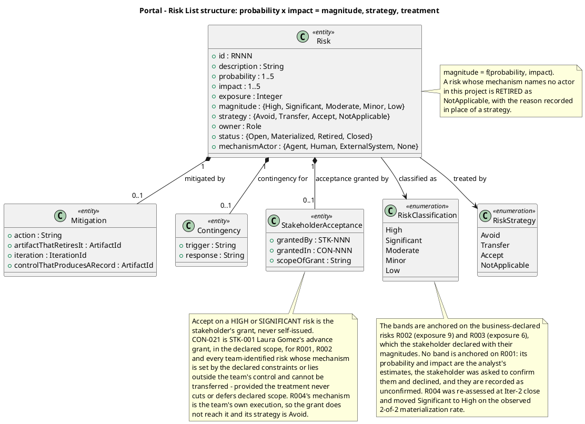
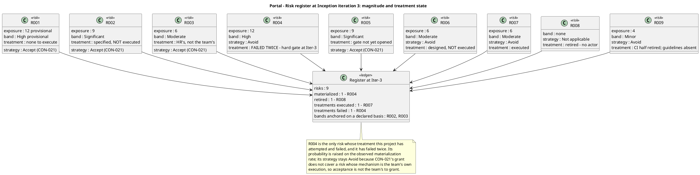
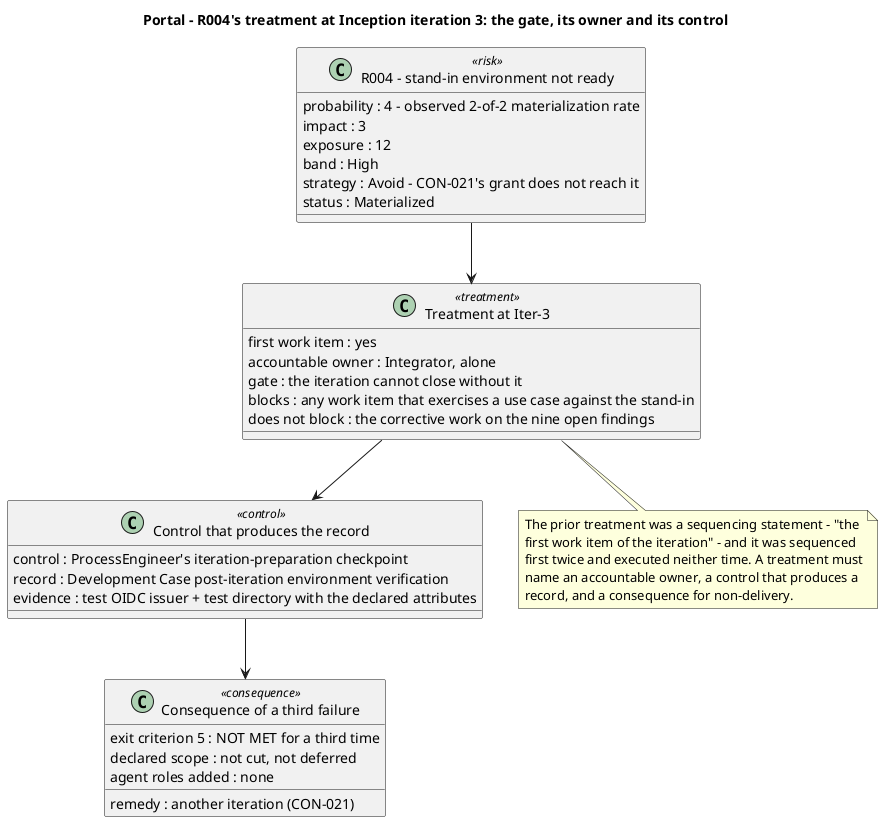
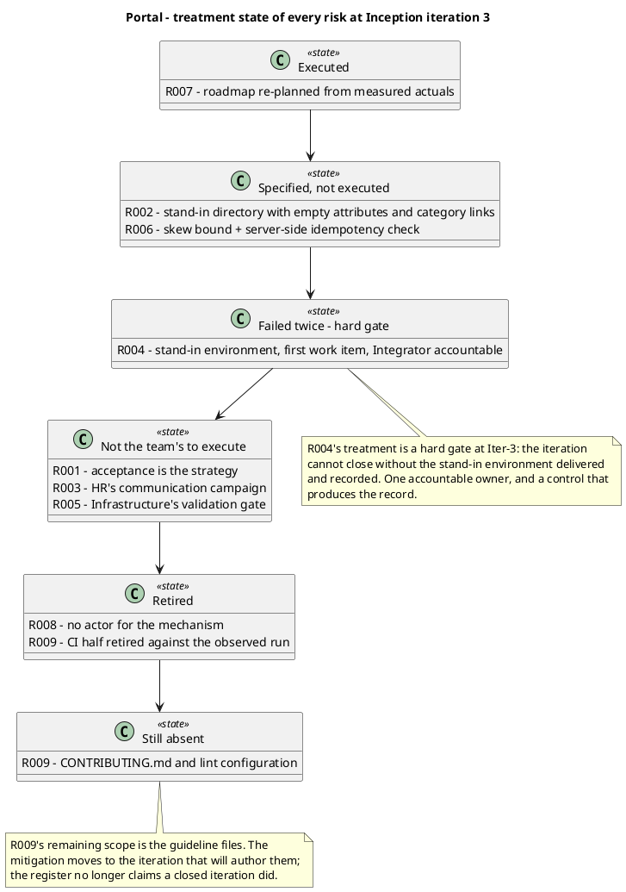

## Document Control

- **Phase:** Inception
- **Status:** Draft — iteration 3
- **Milestone Target:** Lifecycle Objectives (LCO) — end of Inception. NOT YET ACHIEVED.

## Risk Classification
Probability and impact are each scored 1–5; exposure is their product. CON-020 fixes this scheme for every risk the team identifies — the same probability, impact, mitigation and contingency as R001 and R002 — so no second scheme is introduced.

**The bands are anchored on the business-declared risks.** R002 (P=3, I=3, exposure=9) and R003 (P=3, I=2, exposure=6) are declared by the business with their identifiers and magnitudes, so their exposures are a confirmed basis. The Significant band is anchored on R002's declared exposure of 9; the Moderate band on R003's declared exposure of 6. No band is anchored on R001.

**R001's probability and impact are the analyst's estimates, not values the stakeholder stated.** The stakeholder was asked to confirm them and declined. They are therefore recorded as unconfirmed estimates, and no magnitude band is anchored on them. This changes no acceptance decision: the boundary that decides whether a risk needs the stakeholder's grant is the Significant/Moderate boundary at 8, anchored on R002's declared exposure of 9 — and both the High and the Significant band require the stakeholder's grant in any case, so a risk moving between them changes no strategy.

**R004 was re-assessed at Iter-2 close and moved from Significant to High.** Its treatment has failed twice: the stand-in environment was not delivered in Iter-1 and was not delivered in Iter-2, so its probability is raised from 3 to 4 on the observed 2-of-2 materialization rate, giving exposure 12. R004's exposure is derived from an observation, not an estimate. The High band's lower boundary therefore rests on two figures of different provenance — R001's unconfirmed estimate of 12 and R004's observed exposure of 12 — and neither is stakeholder-confirmed. This changes no acceptance decision either: R004's strategy is Avoid, and avoidance is the team's to decide. CON-021's advance grant does not reach R004, because the grant covers risks whose mechanism is set by the declared constraints or lies outside the team's control, and R004's mechanism is the team's own execution.

| Magnitude | Exposure | Anchor | Who may decide the strategy |
|---|---|---|---|
| High | 12–25 | Lower boundary provisional — rests on R001's unconfirmed estimate of 12 and R004's observed exposure of 12 | Avoid or transfer is the team's. Acceptance is the stakeholder's grant, never the team's |
| Significant | 8–11 | R002, declared by the business at exposure 9 | Avoid or transfer is the team's. Acceptance is the stakeholder's grant, never the team's |
| Moderate | 5–7 | R003, declared by the business at exposure 6 | Avoid or transfer is the team's; acceptance recorded with mitigation and contingency |
| Minor | 3–4 | — | Avoid or transfer is the team's |
| Low | 1–2 | — | Avoid or transfer is the team's |

**Risks retired as not applicable.** A risk whose mechanism names an actor that does not exist in this project is retired, not classified. IARI executes with LLM agents and the stakeholder is the only human: a risk whose mechanism needs a development organization — staffing, onboarding, skills, morale, friction between people — has no actor here. The reason is recorded in place of a strategy, so the retirement is visible rather than silent.

**Acceptance already granted.** CON-021 records the advance grant of STK-001 Laura Gómez, the project sponsor: R001, R002 and every risk the team identifies whose mechanism is set by the declared constraints or lies outside the team's control and cannot be transferred are accepted, provided the treatment never cuts or defers declared scope. Every `accept` below cites that grant. No acceptance in this register is self-issued, and no risk is accepted on the team's own authority. R004 is not covered by the grant: its mechanism is the team's own execution, so its strategy is Avoid and no acceptance is claimed for it.

**Not registered.** CON-021 states that the availability, configuration and ownership of Keycloak and Active Directory are not risks of this project. They are not registered here, and no risk below restates them.

## Risk Register
| ID | Risk | Mechanism actor | P | I | Exposure | Magnitude | Strategy | Owner | Status | Treatment state at Iter-3 |
|---|---|---|---|---|---|---|---|---|---|---|
| R001 | A change on Infrastructure's side to Active Directory or Keycloak breaks the portal. | STK-003 Infrastructure | 3 — analyst's estimate, unconfirmed; the stakeholder declined to confirm | 4 — analyst's estimate, unconfirmed; the stakeholder declined to confirm | 12 provisional | High provisional | Accept (CON-021) | ProjectManager | Open | No treatment to execute: acceptance is the strategy. The dependency is confined to two configuration-held boundaries (CON-028) and the real values are substituted at deployment (CON-029) |
| R002 | The LDAP attributes the directory reads (job title, extension) are not filled consistently across the 3 offices, so the directory shows gaps. | STK-001 HR and the office staff who maintain the AD attributes | 3 | 3 | 9 | Significant | Accept (CON-021) | ProjectManager | Open | Treatment specified, NOT executed: the stand-in directory is to carry entries with empty job title and extension, and entries with no category link. The stand-in environment was not delivered at Iter-2 close either (R004), so the gap path is still unexercised. Iter-3: the stand-in directory is the first work item |
| R003 | Employees keep recording clockings in Excel out of habit, so BG-002 and BG-003 are not met. | STK-004 Employees | 3 | 2 | 6 | Moderate | Accept (CON-021) | ProjectManager | Open | No team treatment to execute: the mechanism is HR's communication campaign. AC-005 measures it after go-live |
| R004 | The stand-in environment (CON-028) is not ready, so no use case can be built or tested and the iteration produces no verifiable increment. | Integrator (the team) | 4 — raised from 3 on the observed 2-of-2 materialization rate | 3 | 12 | High — raised from Significant | Avoid | Integrator, accountable | Materialized | **Treatment FAILED TWICE.** Not delivered at Iter-1 close and not delivered at Iter-2 close; the Development Case's LCO-gate verification records no stand-in configuration. Re-assessed at Iter-2 close: probability raised, magnitude Significant → High, owner changed to the Integrator alone, treatment replaced by a hard gate — no work item that exercises a use case against the stand-in starts until it is delivered and recorded. The stand-in directory must also carry the worker-category link, because UC-008 filters by it (CON-013). Strategy stays Avoid: CON-021's grant does not reach a risk whose mechanism is the team's own execution |
| R005 | The human validation of the real Keycloak and AD by Infrastructure with HR (CON-028) does not return before Elaboration closes, delaying the LCA milestone. | STK-003 Infrastructure + STK-001 HR | 3 | 3 | 9 | Significant | Accept (CON-021) | ProjectManager | Open | Gate not yet opened; it opens in Elaboration. Bounded at 14 days of queue time, after which the process suspends |
| R006 | A skewed client clock makes the server record a press timestamp that did not happen, so the audit trail is wrong (AC-006). | STK-004 Employees' client clocks | 2 | 3 | 6 | Moderate | Avoid | ProjectManager | Open | Treatment designed, NOT executed: the skew bound and the server-side idempotency check are design decisions carried by UC-001. The stand-in test exercising a skewed clock is not built (R004). Iter-3: the test is built once the stand-in environment exists |
| R007 | The coarse roadmap under-counts the iterations the declared scope needs, so the declared scope is not complete at PR. | ProjectManager (the team's own planning) | 2 | 3 | 6 | Moderate | Avoid | ProjectManager | Open | Treatment executed: the coarse roadmap is re-planned at every iteration from the measured actuals of the phases that have closed. Iter-3's plan is re-planned from Iter-1's and Iter-2's measured actuals |
| R008 | Developer turnover and knowledge loss. | None — no development organization exists in this project | — | — | — | — | Not applicable — retired | ProjectManager | Retired | Not applicable: the mechanism names no actor in this project |
| R009 | The guideline files the Development Case references (`CONTRIBUTING.md`, lint configuration) are not in place, so the first increment is built without the agreed coding and review standards. | ConfigurationManager + Implementer (the team) | 2 | 2 | 4 | Minor | Avoid | ProjectManager | Open | **CI half RETIRED against the observed run:** the pipeline exists and builds green on `main` (run `36095051721`). Remaining scope: the guideline files are still absent at Iter-2 close. Iter-3: the ConfigurationManager and Implementer author them; this register no longer claims a closed iteration did |

R001, R002 and R003 are the business-declared risks, carried with the identifiers and magnitudes the stakeholder declared. R004 onwards are the risks the team identifies, numbered in the same series in the order raised (CON-020).

## Risk Mitigation and Contingency
**R001 — a change on Infrastructure's side breaks the portal (High provisional, accept).**
Mitigation: the portal's dependency on AD and Keycloak is confined to two configuration-held boundaries — the OIDC client and the LDAP connection (CON-028). The team never works against the real systems, so a change on Infrastructure's side cannot break development, and the real values are substituted at deployment.
Contingency: Infrastructure operates the portal in production (CON-029) and owns the change. If a change breaks the portal, the remedy is another iteration (CON-021). Declared scope is not cut.
Basis: R001's probability and impact are the analyst's estimates and the stakeholder declined to confirm them, so its exposure and the High band's lower boundary are provisional. The strategy is unaffected: CON-021 grants acceptance for R001 in advance, and the boundary that decides whether a risk needs a grant is anchored on R002's declared exposure.

**R002 — LDAP attributes inconsistently filled across the 3 offices (Significant, accept).**
Mitigation: the stand-in directory carries entries whose job title or extension is empty, and entries with no category link, so UC-008's gap path (A1) and UC-002's blank-FullName path (A5) are exercised before the real AD is validated. An empty attribute renders as blank and the entry is still shown. The mitigation is not executed: the stand-in environment was not delivered at Iter-2 close (R004), so the gap path remains unexercised.
Contingency: HR fills the attributes in AD; the portal renders blank meanwhile and no default value is invented (CON-015). If the validation delays a milestone, the remedy is another iteration (CON-021).

**R003 — employees keep using Excel out of habit (Moderate, accept).**
Mitigation: AC-005 requires 80% of employees to complete a clocking with no prior training, and the UI is the mandatory committed design (CON-031), so no training programme is needed for the clocking path.
Contingency: HR communication campaign; BG-003 measures adoption at 3 months. The mechanism is HR's, not the team's, and the remedy for a milestone delay is another iteration (CON-021).

**R004 — the stand-in environment is not ready (High, avoid, materialized, treatment replaced by a hard gate).**
The risk materialized twice. The stand-in environment was not delivered at Iter-1 close and was not delivered at Iter-2 close; the Development Case's LCO-gate verification records no stand-in configuration. Two consecutive executions of the same treatment have failed, so the treatment is not working and is replaced rather than repeated.

Re-assessment at Iter-2 close, on the observed evidence:
- **Probability raised from 3 to 4.** The observed materialization rate is 2 of 2 attempts. The prior probability of 3 was an estimate; the observed rate is evidence, and it is higher.
- **Magnitude raised from Significant to High** (exposure 9 → 12). This changes no acceptance decision: the strategy is Avoid, and avoidance is the team's to decide.
- **Strategy unchanged — Avoid, and not the team's to change.** CON-021's advance grant covers risks whose mechanism is set by the declared constraints or lies outside the team's control. R004's mechanism is the team's own execution, so the grant does not reach it and acceptance is not available. The strategy stays Avoid.
- **Owner changed.** The Integrator is accountable for the delivery, not the Implementer and Integrator jointly. A shared owner is what allowed the item to be sequenced first and executed by nobody.
- **Treatment replaced by a hard gate.** No work item that exercises a use case against the stand-in starts until the stand-in environment is delivered and recorded. The prior treatment — "the first work item of the iteration" — was a sequencing statement, and sequencing alone has now failed twice.
- **Control named.** The ProcessEngineer's iteration-preparation checkpoint is the control that produces the record; the Development Case's post-iteration environment verification is the artifact that carries it. The mitigation names a control that produces a record, not a stated intention.
- **Scope of the stand-in widened.** The stand-in directory must also carry the worker-category link, because UC-008 filters the directory by worker category (CON-013). The stand-in is the only place that filter can be exercised.

Contingency: if the hard gate is not cleared, no work item that exercises a use case against the stand-in starts and the iteration's exit criteria cannot pass. The remedy is another iteration (CON-021). Declared scope is not cut and no agent role is added: the lever is the iteration, not the parallelism.

**R005 — the human validation gate does not return before Elaboration closes (Significant, accept).**
Mitigation: the gate is bounded at 14 days of queue time, after which the process suspends (Development Case measurement policy). The team's work does not wait on it — every use case is built and tested against the stand-ins (CON-028).
Contingency: another iteration (CON-021). The gate is reported in days of queue time, apart from agent time, and the two are never added into one figure.

**R006 — a skewed client clock records a timestamp that did not happen (Moderate, avoid).**
Mitigation: the design bounds the accepted client-clock skew, and the idempotency key is verified server-side so a retry cannot create a second record; the stand-in test exercises a skewed clock. The test is not built, because the stand-in environment is not delivered (R004).
Contingency: HR corrects the clocking through UC-003, which records who, when, the previous value and a reason (NFR-004).

**R007 — the coarse roadmap under-counts the iterations the declared scope needs (Moderate, avoid).**
Mitigation: the coarse roadmap is re-planned at every iteration from the measured spend and elapsed time of the phases that have closed (CON-027), never from a theoretical capacity, and the fine plan is built only for the current and next iteration.
Contingency: another iteration to finish the declared scope. Declared scope is never cut or deferred to fit an estimate (CON-027); reducing it is a Change Request the stakeholder decides, not a planning lever.

**R008 — developer turnover and knowledge loss (retired, not applicable).**
The mechanism names a development organization: staffing, onboarding, skills, morale, friction between people. IARI executes with LLM agents — there is no employment relationship, no onboarding, no morale and no interpersonal friction to manage. No actor exists for this mechanism, so it is not classified and carries no strategy. Recorded here so the retirement is visible rather than silent.

**R009 — the guideline files are not in place (Minor, avoid).**
The CI half of this risk is retired against observable state: the pipeline definition exists and builds green on `main` (run `36095051721`), so the first build is verifiable and the risk as originally stated no longer holds. What remains is the guideline files.
Mitigation: the ConfigurationManager and Implementer author `CONTRIBUTING.md` and the lint configuration. The files are still absent at Iter-2 close, so the mitigation moves to Iter-3, the iteration that will author them; this register no longer claims a closed iteration did. The Development Case's post-iteration environment verification records their state at the gate.
Contingency: the iteration's exit criteria name the guideline files as evidence; if they are not in place, the criterion fails and the remedy is another iteration.

## Traceability
| Element | Traces From | Link Type | Traces To |
|---|---|---|---|
| R001 | CON-021, STK-003 | DependsOn | UC-001 |
| R001 | CON-021, STK-003 | DependsOn | UC-008 |
| R001 | CON-021, STK-003 | DependsOn | COMP-010 |
| R002 | CON-005, CON-028 | DependsOn | UC-008 |
| R002 | CON-005, CON-028 | DependsOn | UC-002 |
| R002 | CON-005, CON-028 | DependsOn | COMP-006 |
| R003 | BG-003, AC-005 | DependsOn | UC-001 |
| R004 | CON-028 | DependsOn | UC-001 |
| R004 | CON-028 | DependsOn | UC-008 |
| R004 | CON-028 | DependsOn | COMP-006 |
| R005 | CON-021, CON-028 | DependsOn | UC-008 |
| R005 | CON-021, CON-028 | DependsOn | UC-009 |
| R006 | AC-006 | DependsOn | UC-001 |
| R006 | AC-006 | DependsOn | COMP-003 |
| R007 | CON-027 | DependsOn | AC-001 |
| R009 | CON-026 | DependsOn | UC-001 |

R008 is retired as not applicable: its mechanism names no actor in this project, so it threatens no element and carries no trace edge. The retirement and its reason are recorded in the Risk Register and in Risk Mitigation and Contingency.

R009's remaining scope is the guideline files, which govern how UC-001's implementation is written and reviewed; the CI half of the risk is retired against run `36095051721` and no longer threatens the build.

**Re-read against UC-008's change.** UC-008 now filters the directory by worker category (CON-013), accepting a category as a search term and excluding an employee with no category from a category filter. Each risk edge into UC-008 was re-read against that change: R001, R002 and R005 still hold unchanged — the directory still reads AD over LDAP and still depends on the stand-in. R004's end changed: the stand-in directory must now also carry the worker-category link, because the category filter is the one part of UC-008 that cannot be exercised against AD at all. That change is declared in turn.

**Trace endpoints.** `CON-001`..`CON-032`, `BG-001`..`BG-003`, `AC-001`..`AC-006` and `STK-001`..`STK-004` are declared identifiers, copied exactly from the work order. `UC-001`..`UC-009` are the System Analyst's use-case identifiers; `COMP-003`, `COMP-006` and `COMP-010` are the Software Architect's component identifiers. `run 36095051721` is an observed SCM fact, cited as returned by the `scm_*` tools. The findings cited above are the reviewers' `<artifact>#<key>` handles; a finding is not an element and no edge is registered on one.

**No element of this role is minted.** The Project Manager produces no `UC-NNN`, `CLS-NNN`, `COMP-NNN`, `TC-NNN` or `INT-NNN`; those families belong to other authorities. The magnitude band table, the risk register and the mitigation narrative are sections of this artifact, not trace-graph elements, so no edge is registered on them.
