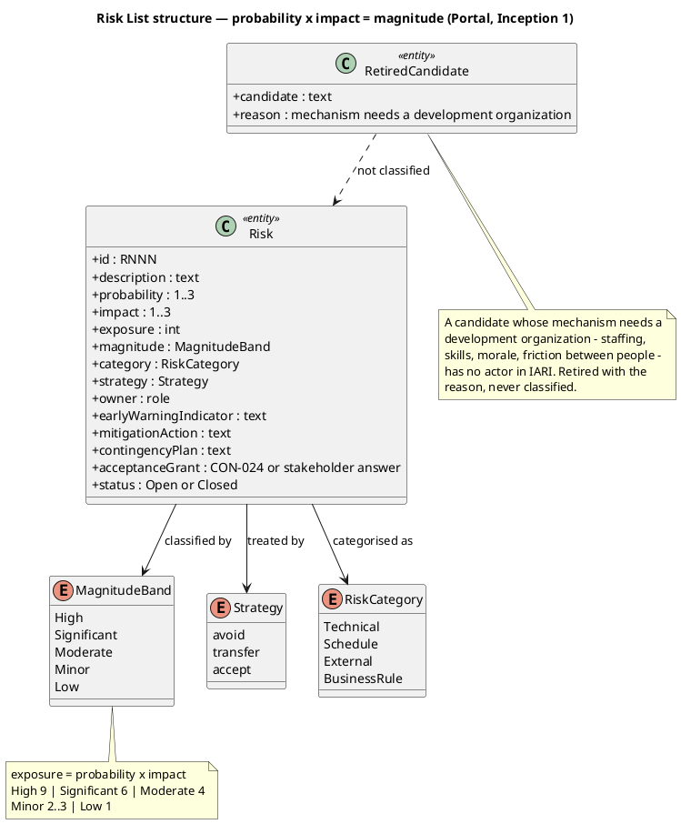

## Document Control

- **Phase:** Inception
- **Status:** Draft — under review
- **Milestone Target:** End of Inception (not yet achieved)
- **Iteration:** 1, Cycle 1
- **Owner:** ProjectManager
- **Date:** 2026-10-07

## Risk Classification

Risk is the primary driver of iteration sequencing. Every risk below names the actor in its mechanism. In this project the executing actors are LLM agents and the only human is the stakeholder, so a candidate whose mechanism needs a development organization — staffing, skills, morale, friction between people — has no actor and is retired rather than classified.

```plantuml
@startuml
title Risk List structure — probability x impact = magnitude (Portal, Inception 1)

skinparam classAttributeIconSize 0

class "Risk" as RISK <<entity>> {
  + id : RNNN
  + description : text
  + probability : 1..3
  + impact : 1..3
  + exposure : int
  + magnitude : MagnitudeBand
  + category : RiskCategory
  + strategy : Strategy
  + owner : role
  + earlyWarningIndicator : text
  + mitigationAction : text
  + contingencyPlan : text
  + acceptanceGrant : CON-024 or stakeholder answer
  + status : Open or Closed
}

enum "MagnitudeBand" as BAND {
  High
  Significant
  Moderate
  Minor
  Low
}

enum "Strategy" as STRAT {
  avoid
  transfer
  accept
}

enum "RiskCategory" as CAT {
  Technical
  Schedule
  External
  BusinessRule
}

class "RetiredCandidate" as RET <<entity>> {
  + candidate : text
  + reason : mechanism needs a development organization
}

RISK --> BAND : classified by
RISK --> STRAT : treated by
RISK --> CAT : categorised as
RET ..> RISK : not classified

note bottom of BAND
  exposure = probability x impact
  High 9 | Significant 6 | Moderate 4
  Minor 2..3 | Low 1
end note

note bottom of RET
  A candidate whose mechanism needs a
  development organization - staffing,
  skills, morale, friction between people -
  has no actor in IARI. Retired with the
  reason, never classified.
end note
@enduml
```

### Scale

| Probability | Meaning | Impact | Meaning |
|---|---|---|---|
| 3 | Likely — the mechanism is present and unmitigated today | 3 | The declared scope, an acceptance criterion or the audit trail is not met |
| 2 | Possible — the mechanism is present but bounded | 2 | A declared feature is degraded or a milestone slips |
| 1 | Unlikely — the mechanism is remote | 1 | Local rework, no declared outcome affected |

| Exposure | Magnitude | Treatment authority |
|---|---|---|
| 9 | High | Avoidance and transfer are the ProjectManager's. Acceptance is the stakeholder's. |
| 6 | Significant | As above. |
| 4 | Moderate | As above. |
| 2–3 | Minor | As above. |
| 1 | Low | As above. |

### Strategy

| Strategy | Meaning here |
|---|---|
| avoid | The treatment removes the mechanism. Chosen where the mechanism is inside the team's control — a design decision, a checkpoint, a test. |
| transfer | The consequence is shifted to a party that already carries it. No candidate in this project qualifies: no vendor delivers anything, no insurance applies, and CON-039 places backups with Infrastructure outside this project. |
| accept | The consequence is carried. Where the mechanism is set by the declared constraints or lies outside the team's control (Infrastructure, HR, the stakeholders) and cannot be transferred, acceptance is granted in advance by the project sponsor under CON-024 and is not asked again. |

### Retired candidates — not classified

| Candidate | Reason retired |
|---|---|
| Team turnover, key-person dependency, staffing availability | Mechanism needs a development organization. No actor: the executing roles are LLM agents, invoked per iteration. |
| Skill gap or learning curve on .NET 10, Razor Pages or PostgreSQL 18 | Mechanism needs a development organization. No actor: no skill is held or lost by an agent between iterations. |
| Team morale, friction between people, coordination overhead between agents | Mechanism needs a development organization. No actor. |
| Estimation error, velocity uncertainty, schedule variance against an estimate | No unit exists to be wrong. This system measures tokens and elapsed time; no estimate is quoted, so no estimate can be missed. |
| Budget overrun or cost cap breach | CON-034: there is no budget or cap on token spend and none is set by the team. |
| Keycloak availability, configuration or ownership | CON-025: not a risk of this project and not registered. |
| Active Directory availability or ownership | CON-025: not a risk of this project and not registered. |
| Backup or restore failure | CON-039: covered by Infrastructure's existing server-backup practice, confirmed in writing with a verified restore test. No backup design, tooling or restore procedure is part of this project. |
| Data migration corruption or reconciliation conflict | CON-037: there is no migration. The portal starts empty. |
| Third-party or vendor delivery slippage | No vendor delivers any element of this project. |
| Regulatory or compliance regime change | CON-021: no external compliance regime applies to the audit trail and no retention period is mandated. |

## Risk Register
| ID | Risk | Category | P | I | Exposure | Magnitude | Strategy | Owner | Acceptance basis |
|---|---|---|---|---|---|---|---|---|---|
| R001 | Active Directory integration — the LDAP attributes the directory reads (job title, extension) may not be filled consistently across the 3 offices. If not tested early the directory shows gaps. | Technical | 3 | 3 | 9 | High | accept | SoftwareArchitect | CON-024 — R001 is named in the sponsor's advance grant. Mechanism is AD data quality, owned by Infrastructure and HR, outside the team's control; not transferable; treatment cuts no declared scope. |
| R002 | Digital clocking adoption — some employees may keep using Excel out of habit if the change is not communicated well. | External | 3 | 2 | 6 | Significant | accept | ProjectManager | CON-024 — R002 is named in the sponsor's advance grant. Mechanism is employee habit and HR communication, outside the team's control; not transferable; treatment cuts no declared scope. |
| R003 | Human validation gate — the validation of the real Keycloak and the real AD is human work by Infrastructure with HR (CON-035). If its feedback does not reach the team before Elaboration closes, the architecture is validated only against stand-ins and a late finding invalidates the LDAP read or the OIDC client. | Schedule | 2 | 3 | 6 | Significant | accept | ProjectManager | CON-024 — mechanism is a human gate owned by Infrastructure and HR, outside the team's control; not transferable; treatment cuts no declared scope. |
| R004 | Client-supplied clocking timestamp — the server accepts the time the employee pressed (CON-040). A skewed client clock records a time that did not happen and the audit trail is wrong. | Technical | 2 | 3 | 6 | Significant | accept | SoftwareArchitect | CON-024 — mechanism is the client device clock, outside the team's control; not transferable; treatment cuts no declared scope. |
| R005 | Mandatory UI design reference — `docs/inputs/employee-portal-design.html` is authoritative and mandatory (CON-038). A declared screen state it does not cover (no-connection message, empty-attribute directory entry, banner with no featured item, pending clocking retry) has no authoritative rendering. | Technical | 2 | 2 | 4 | Moderate | accept | UserInterfaceDesigner | CON-024 — mechanism is the coverage of a fixed project input set by CON-038, outside the team's control; not transferable; treatment cuts no declared scope. |
| R006 | High-volatility features — FR-004 (export column contract) and FR-010 (featuring policy) encode a business decision HR can restate. A restatement after implementation reaches the clocking or news core. | BusinessRule | 2 | 2 | 4 | Moderate | avoid | Designer | Not required — the treatment removes the damage mechanism: a restatement does not reach the core. |
| R007 | Offline retry window — the queued press lives in localStorage for up to 5 minutes (CON-040). A closed tab or cleared storage inside the window loses the press. | Technical | 2 | 1 | 2 | Minor | accept | Designer | CON-024 — mechanism is browser storage behaviour, outside the team's control; not transferable; treatment cuts no declared scope. |
| R008 | Directory page load — NFR-002 and AC-001 measure the full page load, while the directory performs a live LDAP read (CON-032) and no client cache is permitted (CON-041). | Technical | 2 | 2 | 4 | Moderate | avoid | SoftwareArchitect | Not required — the mechanism is inside the team's control and the treatment removes it. |
| R009 | Elaboration tool gaps — `CONTRIBUTING.md`, the lint configuration and the test stand-ins are absent. If they are not closed before the first implementation task, Elaboration starts without conventions or a testable identity and directory stand-in. | Schedule | 2 | 2 | 4 | Moderate | avoid | ProcessEngineer | Not required — the mechanism is inside the team's control and the treatment removes it. |
| R010 | Audit completeness — NFR-001 requires an audit record for every change of the three classes, and NFR-005 means no in-portal screen would reveal a missing record. | Technical | 2 | 2 | 4 | Moderate | avoid | Designer | Not required — the mechanism is inside the team's control and the treatment removes it. |

**No risk is accepted on the ProjectManager's own authority.** R001 to R005 and R007 are accepted under CON-024, the sponsor's advance grant, and each names the mechanism class that brings it inside that grant. R006 and R008 to R010 are avoided, so no acceptance arises. **No risk is accepted whose damage mechanism the team can design away** — R006 was reclassified from accept to avoid on exactly that ground: encapsulation removes the path by which a restatement reaches the core, so the residual is the ordinary change process, not a risk.

## Risk Mitigation and Contingency

| ID | Mitigation action | Contingency plan | Early warning indicator |
|---|---|---|---|
| R001 | The stand-in directory carries entries whose job title and extension are empty (CON-035), so the blank-field path is built and tested from the first iteration; the directory renders a blank field and invents no default (CON-016); the real-AD validation starts at the beginning of Elaboration 1 so its feedback lands before Elaboration closes (CON-035). | HR corrects the missing attributes in AD, which is their system of record (CON-004, CON-032) — no portal change and no local copy. If the finding delays a milestone, the remedy is another iteration (CON-026). | The stand-in's empty-attribute entries pass, but the real-AD validation reports a share of blank job title or extension that makes the directory unusable for search. |
| R002 | AC-005 requires 80% of employees to complete a clocking with no prior training, so the clocking screen is one press with confirmation (FR-002) and needs no instruction; HR communicates the change and the retirement of the shared Excel sheet as a recording channel (BG-002); the portal is reachable from the corporate browser with no install (CON-019, CON-020). | HR reinforces the communication and the shared Excel sheet is retired as a recording channel. Adoption is measured against BG-003 at 3 months. | Clocking volume per working day below the declared population in the weeks after go-live. |
| R003 | The gate starts at the beginning of Elaboration 1, not at its end, so its feedback has the whole phase to land; the stand-ins carry the declared attributes including the empty ones, so the team's own testing is not blocked while the gate is open; placeholder configuration values are held in configuration, never in code (CON-035). | Another iteration (CON-026). The gate is bounded as a risk, not as an estimate: ceiling 14 days, actual measured and reported apart from agent time. | The gate has produced no feedback by the midpoint of Elaboration 1. |
| R004 | The server records the server receipt time alongside the client timestamp, so a skew is detectable from the data without rejecting the press CON-040 requires it to accept; the idempotency key prevents a retry from recording a second clocking; HR corrects an affected clocking with who, when, previous value and reason (UC-005, NFR-001). | HR corrects the affected clockings. If the skew is systemic rather than per-device, raise a Change Request to bound the accepted skew. | Recorded clocking times clustering at implausible minutes, or a clocking whose client timestamp precedes the previous day's clock-out. |
| R005 | The UserInterfaceDesigner maps every declared screen state to the design reference before implementation and records each state the reference does not cover; an uncovered state is rendered from the reference's own tokens, components and patterns, never invented, and the gap is reported. | Escalate the uncovered state to the sponsor as a scope question rather than deciding the visual layer unilaterally. | A declared state — no-connection message, empty-attribute entry, banner with no featured item, pending retry — with no counterpart in the reference. |
| R006 | The export layout and the featuring policy are each encapsulated behind a single seam, so a restatement of the column contract or of the featuring policy does not reach the clocking or news core. The invariants behind them — CON-011, CON-012, CON-013 — are stable and are not the volatile part. | A Change Request: the CCB assesses the impact and the change is implemented in the seam. | HR restating the column order, the empty-not-zero rule or the featuring policy after the seam is implemented. |
| R007 | The press is written to localStorage before the POST is attempted and the page shows the pending state, so a reload replays the queue; the idempotency key makes a replay safe. | Beyond the window the employee reports the clocking to HR (CON-042) and HR corrects it with audit (UC-005). | An employee reports a pending press as lost. |
| R008 | Avoided by design: the LDAP read is bounded to the declared attributes with a scoped search base and server-side paging, and the directory page renders the result set without a client cache (CON-041). The page-load target is measured as the full page load (AC-001), not as a server response time. | None required — the strategy is avoidance. If the target still cannot be met, the finding is raised as a Change Request rather than met by caching, which CON-041 forbids. | Directory page load measured above the NFR-002 threshold on the corporate network. |
| R009 | Avoided by the Development Case's iteration-preparation checkpoint: Elaboration does not start until `CONTRIBUTING.md`, the lint configuration and the test stand-ins are committed and the CI workflow is green on an empty build (CON-033, CON-035). | None required — the strategy is avoidance. The checkpoint is the gate. | An Elaboration work item opened before the checkpoint passes. |
| R010 | Avoided by design: the audit record is written in the same transaction as the change it records, for every one of the three change classes, and the TestDesigner covers each alternative flow that changes audited data, not only the main flow. | None required — the strategy is avoidance. | An alternative flow that changes audited data with no corresponding test case. |

## Traceability
| Element | Traces From | Link Type | Traces To |
|---|---|---|---|
| R001 | FR-011, CON-004, CON-032 | DependsOn | UC-011 |
| R002 | BG-002, BG-003, AC-005 | DependsOn | UC-002 |
| R003 | CON-035, CON-026 | DependsOn | Software Architecture Document |
| R004 | CON-040, NFR-001 | DependsOn | UC-002 |
| R005 | CON-038 | DependsOn | Software Architecture Document |
| R006 | FR-004, FR-010 | DependsOn | UC-004, UC-010 |
| R007 | CON-040, CON-042 | DependsOn | UC-002 |
| R008 | NFR-002, AC-001, CON-032, CON-041 | DependsOn | UC-011 |
| R009 | CON-035, CON-033 | DependsOn | Iteration Plan |
| R010 | NFR-001, NFR-005 | DependsOn | Supplementary Specification |

**Reading the table.** `Traces From` is the declared input each risk bears on — the constraint, requirement or goal copied from the Work Order. `Traces To` is the element the risk threatens, which is what makes the risk actionable in design rather than a note in a register. R001 and R002 are the two risks declared with the project; R003 to R010 are identified by the team and numbered from R003 in the order raised, per CON-023.

**Direction of the plan link.** The Iteration Plan carries the link to this Risk List, not the reverse: the plan is sequenced by the risk list and is the more detailed artifact of the two. The reverse link is withdrawn so the graph holds no cycle.

