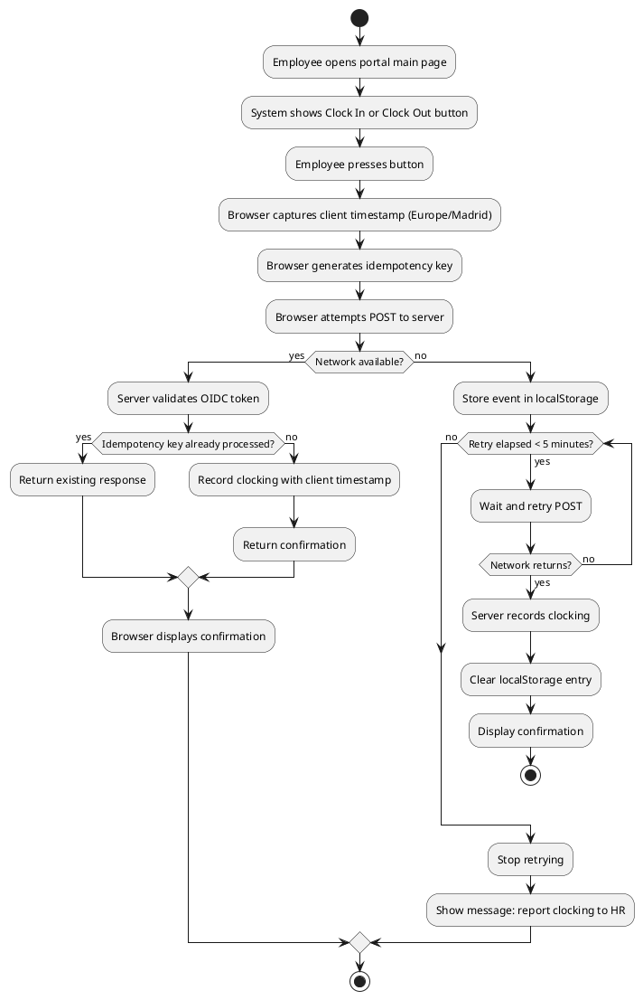

## Document Control

| Field | Value |
|---|---|
| Project | Portal |
| Phase | Inception |
| Iteration | 1 |
| Status | Draft |
| Milestone Target | End-of-Inception review |

## Functionality

### Security

| ID | Requirement | Source | Detail | Volatility |
|---|---|---|---|---|
| REQ-S001 | OIDC authentication via Keycloak | NFR-006, CON-004, CON-005 | Portal is an OIDC client; login redirects to Keycloak; token validation reads AD group claims. | Low |
| REQ-S002 | Two-level authorization from AD group membership | NFR-006 | Members of the HR AD group receive HR role; all other authenticated users receive Employee role. No role matrix or permission administration screen. | Low |
| REQ-S003 | Audit trail for news lifecycle | NFR-004 | Every publish, edit, and unpublish records author and timestamp. | Low |
| REQ-S004 | Audit trail for worker category changes | NFR-005 | Every assign/clear of a worker category records who made the change and when. | Low |
| REQ-S005 | Audit trail for clocking corrections | FR-007, CON-020 | Every correction/insertion records who, when, previous value, new value, and free-text reason. | Low |

### Cross-Cutting Mechanisms (included from dependent use cases)

The following mechanisms are included from every dependent use case via `<<include>>`. They are NOT standalone use cases.

| Mechanism | Included From | Description |
|---|---|---|
| Authentication (Keycloak OIDC) | UC-001..UC-012 | Validates the user before any portal action. |
| Authorization (AD group → HR/Employee role) | UC-001, UC-002, UC-005..UC-010 | Enforces two-level access control. |
| Audit logging | UC-001, UC-002, UC-007..UC-010 | Records author and timestamp for news and category changes; records correction details for clocking changes. |

### Licensing

| ID | Requirement | Source | Detail | Volatility |
|---|---|---|---|---|
| REQ-L001 | Use only organization-approved software | CON-001..CON-003, CON-007 | .NET 10, Razor Pages, PostgreSQL, internal Windows Server. No additional licensing introduced by the portal. | Low |

## Usability

| ID | Requirement | Source | Detail | Volatility |
|---|---|---|---|---|
| REQ-U001 | Responsive intranet UI | Scope Statement, CON-002 | Razor Pages frontend; works on current Chrome and Edge (CON-009). No SPA, no client-side router. | Low |
| REQ-U002 | Mandatory custom design | CON-015 | UI visual layer must implement `docs/inputs/employee-portal-design.html`. | Low |
| REQ-U003 | Clocking without training | AC-004 | 80% of employees complete at least one clocking with no prior training. | Low |
| REQ-U004 | Directory lookup under 10 seconds | AC-003 | Any employee finds a colleague's phone or email in under 10 seconds. | Low |

## Reliability

| ID | Requirement | Source | Detail | Volatility |
|---|---|---|---|---|
| REQ-R001 | Availability during extended working hours | NFR-003 | Monday–Friday 7:00–19:00, with fault tolerance within the corporate network. 24/7 availability not required. | Low |
| REQ-R002 | Clocking network resilience | NFR-007 | Browser stores button press in localStorage and retries POST for up to 5 minutes. Server accepts client-sent timestamp and rejects duplicates by idempotency key. | Low |
| REQ-R003 | No data loss for clocking corrections | CON-020 | Original records never overwritten or deleted; corrections create new audited entries. | Low |
| REQ-R004 | News items never hard-deleted | FR-010 | Unpublishing hides items; audit trail is preserved. | Low |

## Performance

| ID | Requirement | Source | Detail | Volatility |
|---|---|---|---|---|
| REQ-P001 | Page load performance | NFR-001 | Pages must load in under 3 seconds on the corporate network. | Low |
| REQ-P002 | Clocking response performance | NFR-002 | Clock in/out operation must respond in under 1 second. | Low |
| REQ-P003 | Directory read performance | FR-012, AC-003 | Directory search results must support under-10-second lookup target. | Low |

## Supportability

| ID | Requirement | Source | Detail | Volatility |
|---|---|---|---|---|
| REQ-SU001 | Maintainable .NET 10 codebase | CON-001 | REST API backend; standard Razor Pages frontend. | Low |
| REQ-SU002 | Infrastructure handover | CON-013 | Development team hands over to Infrastructure team at end of Transition; team operates portal thereafter. | Low |
| REQ-SU003 | Backup coverage by existing practice | CON-016 | No backup design or tooling in project scope; Infrastructure confirms existing server-backup practice covers PostgreSQL. | Low |

## Design Constraints

| ID | Constraint | Source | Detail |
|---|---|---|---|
| CON-001 | Backend technology | Work Order | .NET 10, REST API. |
| CON-002 | Frontend technology | Work Order | Razor Pages; no SPA, no client-side router. Page-level JavaScript allowed for clocking retry. |
| CON-003 | Database | Work Order | PostgreSQL. |
| CON-007 | Hosting | Work Order | Internal Windows Server; no cloud. |
| CON-009 | Browser support | Work Order | Current Chrome and Edge only. |
| CON-015 | UI design authority | Work Order | `docs/inputs/employee-portal-design.html` is mandatory and authoritative. |

## Interfaces

### User Interfaces

| ID | Interface | Source | Detail |
|---|---|---|
| INT-001 | Main page / clocking page | FR-003, NFR-007 | Shows Clock In/Out button; includes localStorage retry script. |
| INT-002 | Personal clocking history page | FR-004 | Current-month history view. |
| INT-003 | HR all-clockings view | FR-005, FR-007 | List all clockings; launch correction/insertion. |
| INT-004 | Monthly CSV export | FR-006 | Download CSV with defined columns and timezone. |
| INT-005 | News browsing page | FR-011 | Newest-first list, category filter, featured banner. |
| INT-006 | News management page | FR-008, FR-009, FR-010 | Publish, edit, unpublish news. |
| INT-007 | Directory search page | FR-012 | Search by name, department, office; show AD-sourced + category fields. |

### External System Interfaces

| ID | Interface | Source | Detail |
|---|---|---|
| INT-008 | Keycloak OIDC | CON-004, CON-005, NFR-006 | Authentication and AD group claims; read-only from portal perspective. |
| INT-009 | Active Directory LDAP | CON-006, CON-010, CON-012 | Read employee attributes on demand; no write-back. |

## Applicable Standards

| ID | Standard / Practice | Source | Detail |
|---|---|---|
| STD-001 | Europe/Madrid timezone handling | CON-021 | Clockings stored in UTC; displayed and exported in Europe/Madrid local time. |
| STD-002 | CSV column order | FR-006 | EmployeeId, FullName, WorkerCategory, Date, ClockIn, ClockOut, HoursWorked, Corrected. |
| STD-003 | Closed worker category list | CON-017 | Full-time, Part-time, Contractor, Intern. |

### Clocking Network Resilience Activity

## Traceability

| Element | Traces From | Link Type | Traces To |
|---|---|---|---|
| REQ-S001 | NFR-006, CON-004, CON-005 | Refines | UC-001..UC-012 |
| REQ-S002 | NFR-006 | Refines | UC-001, UC-002, UC-005..UC-010 |
| REQ-S003 | NFR-004 | Refines | UC-008, UC-009, UC-010 |
| REQ-S004 | NFR-005 | Refines | UC-001, UC-002 |
| REQ-S005 | FR-007, CON-020 | Refines | UC-007 |
| REQ-P001 | NFR-001 | Refines | UC-003, UC-011, UC-012 |
| REQ-P002 | NFR-002 | Refines | UC-003 |
| REQ-R002 | NFR-007 | Refines | UC-003 |
| INT-008 | CON-004, CON-005 | Refines | UC-001..UC-012 |
| INT-009 | CON-006, CON-010 | Refines | UC-001, UC-002, UC-012 |
