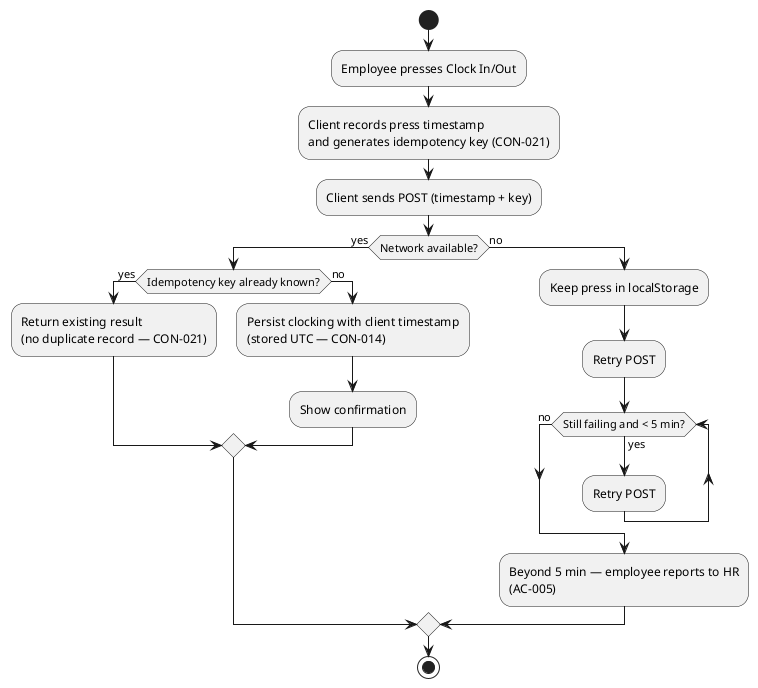

## Document Control

| Field | Value |
|---|---|
| Phase | Inception |
| Status | Draft |
| Milestone Target | End-of-Inception (Lifecycle Objectives) — NOT YET ACHIEVED |

## Functionality

| ID | Requirement | Source | Notes |
|---|---|---|---|
| NFR-004 | Audit traceability: who publishes/edits/unpublishes each news item (author + timestamp); any worker-category change; every clocking HR corrects or inserts (who, when, previous value, reason). Employee fields are read-only from AD — nothing to audit there. | NFR-004 | Cross-cutting; `<<include>>`d by UC-003, UC-005, UC-006, UC-007, UC-009, UC-010, UC-011, UC-012 |
| NFR-005 | Two-level authorization from AD group membership: HR group → publish/edit/unpublish news + manage categories; everyone else → employee (read directory/news + own clockings). No role matrix, no permission screen, no per-category rule. | NFR-005 | Cross-cutting; `<<include>>`d by every UC |
| — | Authentication via Keycloak OIDC (portal is a client only; register client, redirect, validate token, read roles from claims). | CON-006 | Cross-cutting mechanism — NOT a use case |
| — | Employee data read from AD on demand, never copied; portal stores only `AD user id → worker category`. | CON-007 | Cross-cutting mechanism — NOT a use case |
| — | No access from outside the corporate network (internal-only application). | CON-009 | Security boundary — cross-cutting |

## Usability

| ID | Requirement | Source |
|---|---|---|
| — | Custom design at docs/inputs/employee-portal-design.html is mandatory and authoritative for the UI visual layer. | CON-008 |
| — | Responsive web only; compatible with current Chrome and Edge (corporate browsers). | CON-005 |
| — | Employee can find a colleague's phone/email in under 10 seconds. | AC-003 |

## Reliability

| ID | Requirement | Source |
|---|---|---|
| NFR-003 | Availability window: extended working hours Mon–Fri 7:00–19:00, with fault tolerance within the corporate network. 24/7 not required. | NFR-003 |
| — | Clocking made while the network is down up to 5 minutes is not lost: clocking page keeps the press in localStorage and retries its POST up to 5 minutes; beyond 5 minutes the employee reports to HR. Applies to clocking only — directory and news show a "no connection" message. | AC-005 |
| — | Backups covered by Infrastructure's existing server-backup practice (verified restore test). No backup design/tooling in this project. | CON-013 |

**Offline-retry and idempotency flow (AC-005, CON-021):**

## Performance

| ID | Requirement | Source |
|---|---|---|
| NFR-001 | Pages load in under 3 seconds on the corporate network. | NFR-001 |
| NFR-002 | Clock in/out operation responds in under 1 second. | NFR-002 |

## Supportability

| ID | Requirement | Source |
|---|---|---|
| — | Post-launch: Infrastructure team operates the portal in production (deployment, monitoring, patching); dev team hands over at end of Transition. | CON-011 |
| — | No data migration; portal starts empty; historical Excel stays read-only archive (not imported). | CON-012 |

## Design Constraints

| ID | Constraint | Source |
|---|---|---|
| CON-001 | Backend: .NET 10, REST API | CON-001 |
| CON-002 | Frontend: Razor Pages (no SPA, no client-side router; page-level scripts allowed) | CON-002 |
| CON-003 | Database: PostgreSQL | CON-003 |
| CON-004 | Hosting: internal Windows Server (no cloud) | CON-004 |
| CON-006 | Keycloak is an OIDC client dependency only — not part of this project | CON-006 |
| CON-007 | Employee data read from AD on demand, never copied | CON-007 |
| CON-008 | Custom design (docs/inputs/employee-portal-design.html) mandatory and authoritative | CON-008 |
| CON-009 | No access from outside the corporate network | CON-009 |
| CON-014 | Single timezone (Europe/Madrid); clockings stored UTC, displayed Europe/Madrid | CON-014 |
| CON-015 | At most one featured news item (invariant) | CON-015 |
| CON-016 | Worker categories: closed list of exactly four values (Full-time, Part-time, Contractor, Intern) | CON-016 |
| CON-017 | Worker category descriptive only — does not drive access control | CON-017 |
| CON-018 | At most one category per worker; may be empty; no default | CON-018 |
| CON-019 | Original clocking never overwritten/deleted; corrections audited | CON-019 |
| CON-020 | News never hard-deleted; unpublish hides | CON-020 |
| CON-021 | Server accepts client timestamp; idempotency key rejects duplicates (clocking only) | CON-021 |

## Interfaces

| ID | Interface | Source |
|---|---|---|
| — | Keycloak OIDC: register client, redirect for login, validate token, read roles from claims. | CON-006 |
| — | Active Directory: read six employee fields (name, job title, department, office, email, extension) + group membership on demand; never write. | CON-007, CON-010, FR-008 |
| — | CSV export: monthly clocking report, exact column order (EmployeeId, FullName, WorkerCategory, Date, ClockIn, ClockOut, HoursWorked, Corrected), Europe/Madrid timestamps. | FR-002 |

## Applicable Standards

| ID | Standard | Source |
|---|---|---|
| — | No external regulatory/legal standards declared for this internal intranet. | — |

## Traceability

| Element | Traces From | Link Type | Traces To |
|---|---|---|---|
| NFR-001 | Declared input | — | (Elaboration: quantified thresholds by Requirements Specifier) |
| NFR-002 | Declared input | — | (Elaboration: quantified thresholds) |
| NFR-003 | Declared input | — | (Elaboration: quantified thresholds) |
| NFR-004 | Declared input | — | UC-003, UC-005, UC-006, UC-007, UC-009, UC-010, UC-011, UC-012 |
| NFR-005 | Declared input | — | All UCs |
| CON-001…CON-021 | Declared input | — | Vision (Constraints) |
