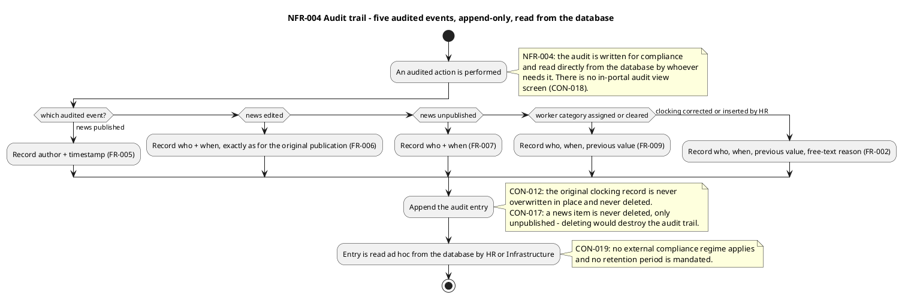
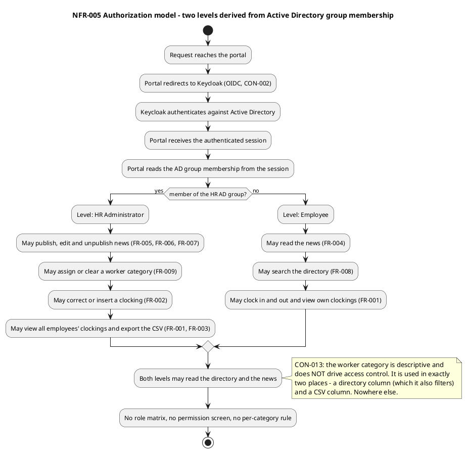
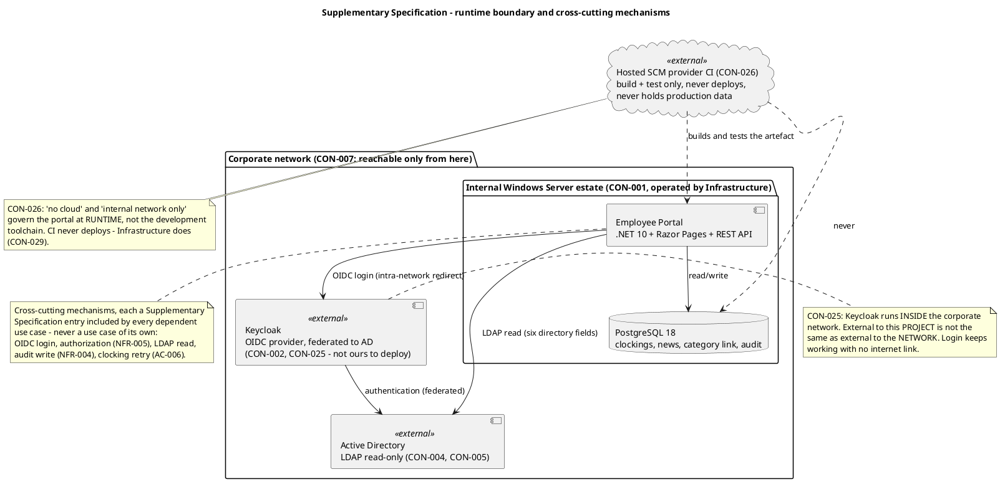

## Document Control
- **Phase:** Inception
- **Status:** Draft — iteration 3
- **Milestone Target:** Lifecycle Objectives (LCO) — end of Inception. NOT YET ACHIEVED.
## Functionality
Functionality here covers the system-wide functional requirements that no single use case owns: security, licensing, the audit trail and the authorization model. The functional behaviour of the portal itself is specified in the Use-Case Model (UC-001..UC-009).

### NFR-004 Audit Trail

Mandatory traceability. The audit is written for compliance and read directly from the database by whoever needs it; there is no in-portal audit view screen (CON-018).

| Audited event | Recorded | Source |
|---|---|---|
| News published | Author + timestamp | FR-005 |
| News edited | Author + timestamp, exactly as for the original publication | FR-006 |
| News unpublished | Author + timestamp | FR-007 |
| Worker category assigned or cleared | Who, when, previous value | FR-009 |
| Clocking corrected or inserted by HR | Who, when, previous value, free-text reason | FR-002 |

Employee fields are read-only from AD, so there is nothing to audit there (NFR-004). No external compliance regime applies and no retention period is mandated (CON-019). The original clocking record is never overwritten in place and never deleted (CON-012); a news item is never deleted, only unpublished (CON-017).

### NFR-005 Authorization Model

Two levels, derived from Active Directory group membership.

| Level | Derivation | Permitted |
|---|---|---|
| HR Administrator | Member of the HR AD group | Publish, edit and unpublish news (FR-005, FR-006, FR-007); assign or clear worker categories (FR-009); correct or insert clockings (FR-002); view all employees' clockings and export the monthly CSV (FR-001, FR-003) |
| Employee | Everyone else | Read the directory and the news; clock in and out and view own clockings (FR-001, FR-004, FR-008) |

No role matrix, no permission screen, no per-category rule. The worker category is descriptive and does NOT drive access control — it is used in exactly two places: as a column of the directory (which it also filters) and as a column of the CSV export (CON-013).

### Cross-cutting mechanisms

These mechanisms are not use cases — they deliver no observable value to an actor on their own. Each is included by every use case that depends on it.

| Mechanism | Included by | Constraint |
|---|---|---|
| OIDC login against Keycloak, federated to Active Directory | UC-001..UC-009 | CON-002, CON-025 |
| Authorization: two levels from AD group membership | UC-001..UC-009 | NFR-005 |
| LDAP read of the six read-only directory fields | UC-002 (FullName at export time), UC-008, UC-009 | CON-005, CON-016 |
| Audit write | UC-002, UC-003, UC-005, UC-006, UC-007, UC-009 | NFR-004 |
| Clocking retry with client timestamp and idempotency key | UC-001 | AC-006 |

### Business rules

| ID | Rule |
|---|---|
| CON-009 | At most one news item is featured at any moment — featuring one un-features the previous. A system invariant that must hold wherever the change comes from, not only in the HR form. HR can also un-feature the current one and leave none. |
| CON-010 | A clocking pair never crosses midnight. A clocking still open at midnight is an incomplete day. |
| CON-011 | At most one clocking pair per employee per calendar day. |
| CON-012 | Only HR corrects or inserts clockings; the original record is never overwritten in place and never deleted. |
| CON-013 | Worker category is descriptive and does NOT drive access control. Used in exactly two places: a directory column (which it also filters) and a CSV column. |
| CON-014 | Worker categories are a closed list of exactly four values: Full-time, Part-time, Contractor, Intern. Not configurable; no fifth value without a Change Request. |
| CON-015 | A worker has at most one category and it may be empty. An employee with no category still appears in the directory and the export with that field blank. No default value is invented. |
| CON-016 | Employee data has exactly one home (Active Directory). The portal stores only a link (AD user id → category) — no duplicate, no synchronisation, no reconciliation, no conflict to resolve. |
| CON-017 | News is never deleted, only unpublished. |
| CON-018 | The audit is read directly from the database; there is no in-portal audit view screen. |
| CON-019 | No external compliance regime applies to the audit, and no retention period is mandated. |

### Security

| ID | Requirement | Source |
|---|---|---|
| SEC-001 | Every request is authenticated. The portal is an OIDC client of the existing Keycloak, which federates Active Directory. There is no local account, no local password and no second credential store. | CON-002, CON-025 |
| SEC-002 | Authorization is the two-level model of NFR-005, derived from AD group membership. There is no role matrix, no permission screen and no per-category rule. | NFR-005, CON-013 |
| SEC-003 | The portal never writes to Active Directory. The only write the portal makes about a person is the worker-category link (AD user id → category). | CON-004, CON-016 |
| SEC-004 | The portal is reachable only from the internal corporate network. | CON-007 |
| SEC-005 | The directory shows corporate data only — name, job title, department, office, email, extension, worker category. No private personal information is shown. | FR-008 |
| SEC-006 | Nothing about the directory or the news is cached on the client. Both require the network and show a 'no connection' message when it is unavailable. | AC-006 |
| SEC-007 | The OIDC client secret and the LDAP bind account are held in configuration, never in code. Infrastructure substitutes the real values at deployment. | CON-028 |
| SEC-008 | CI never holds production data or credentials and never deploys. | CON-026 |

### Licensing

No licensing requirement is declared. The stack is the declared one — .NET 10 (CON-022), Razor Pages (CON-023), PostgreSQL 18 (CON-024) — and the project introduces no third-party component, licence or subscription. Keycloak and Active Directory are existing corporate systems the project neither deploys nor operates (CON-002, CON-025).

## Usability

| ID | Requirement | Source |
|---|---|---|
| USA-001 | An employee can clock in and out without help from HR or the development team. | AC-002 |
| USA-002 | An HR Administrator can publish a news item without technical assistance. | AC-003 |
| USA-003 | Any employee finds a colleague's phone or email in under 10 seconds. | AC-004 |
| USA-004 | 80% of employees complete at least one clocking with no prior training. | AC-005 |
| USA-005 | The UI visual layer is the committed design at `docs/inputs/employee-portal-design.html`, which is mandatory and authoritative. The portal MUST implement it. | CON-031 |
| USA-006 | The portal is a responsive web application. There is no native mobile app. | Declared scope |
| USA-007 | Corporate browsers: current Chrome and Edge. | CON-006 |

## Reliability

| ID | Requirement | Source |
|---|---|---|
| NFR-003 | Available during extended working hours Monday–Friday 07:00–19:00, with fault tolerance within the corporate network. 24/7 is not required. | NFR-003 |
| REL-001 | A clocking made while the corporate network is down for up to 5 minutes is not lost. The clocking page keeps the press in the browser (localStorage) and retries its POST for up to 5 minutes. The server accepts the timestamp the client sends — the time the employee pressed the button, not the time the server received it — and rejects duplicates by an idempotency key. Beyond 5 minutes the employee reports the clocking to HR. | AC-006 |
| REL-002 | The directory and the news need the network and show a 'no connection' message. Nothing is copied locally, so there is nothing to cache and nothing to sync. | AC-006 |
| REL-003 | The clocking retry is one action, one queue, one entity: two clocking presses by the same employee cannot conflict with anything, so there is nothing to reconcile and no conflict resolution to write. | AC-006 |
| REL-004 | Clockings are stored in UTC and displayed in Europe/Madrid. All three offices are in the same timezone; there is no multi-timezone case and no normalisation to design. | CON-008 |
| REL-005 | Backups are the Infrastructure team's existing server-backup practice, which already covers this PostgreSQL instance in restorable form, confirmed in writing with a verified restore test. No backup design, tooling or restore procedure is part of this project. | CON-032 |

## Performance

| ID | Requirement | Threshold | Source |
|---|---|---|---|
| NFR-001 | Page load performance | Under 3 seconds on the corporate network, measured as the full page load the employee experiences — browser request to page displayed and usable, including the clocking page's script. | NFR-001, AC-001 |
| NFR-002 | Clock in/out response time | Under 1 second. | NFR-002 |
| PERF-001 | Server response time is the engineering target that makes NFR-001 achievable, not a substitute for it. The acceptance criterion is the full page load as the employee experiences it. | — | AC-001 |

## Supportability
| ID | Requirement | Source |
|---|---|---|
| SUP-001 | The Infrastructure team operates the portal in production once it is live — deployment, monitoring and patching — exactly as they already operate AD and Keycloak. The development team hands over at the end of Transition and does not run it afterwards. | CON-029 |
| SUP-002 | The portal is a .NET application running on the internal Windows Server estate already operated by Infrastructure. | CON-001 |
| SUP-003 | The OIDC client and the LDAP connection are configured with placeholder values (issuer, client id, client secret, LDAP host, bind account, base DN), held in configuration and never in code. Infrastructure puts the real values in at deployment. | CON-028 |
| SUP-004 | The team builds and tests against stand-ins it controls — a test OIDC issuer and a test directory carrying the declared attributes, including entries whose job title or extension is empty. | CON-028 |
| SUP-005 | There is no data migration. The portal starts empty and records clockings from go-live onwards. The historical Excel sheets stay on the shared drive as a read-only archive and are not imported. | CON-030 |
| SUP-006 | There is no budget or cap on token spend, and none is to be set by the team. Each iteration's measured spend is recorded and used to forecast the next; declared scope is never cut or deferred to fit an estimate. | CON-027 |
| SUP-007 | Risk numbering and risk acceptance are project-process constraints, not requirements on the portal: a risk the team identifies is numbered in the same series as the business-declared risks (R003 onwards, in the order raised), and R001, R002 and every risk whose mechanism is set by these constraints or lies outside the team's control and cannot be transferred are accepted in advance, provided the treatment never cuts or defers declared scope. The availability, configuration and ownership of Keycloak and AD are not risks of this project. | CON-020, CON-021 |
| SUP-008 | Backups are the Infrastructure team's existing server-backup practice, which already covers this PostgreSQL instance in restorable form, confirmed in writing with a verified restore test. No backup design, tooling or restore procedure is part of this project. | CON-032 |

No maintainability, configurability or portability requirement is declared beyond the above. The portal has no configuration screen, no feature flag and no administrative console: the only configurable values are the OIDC and LDAP connection settings of SUP-003, which Infrastructure sets at deployment.
## Design Constraints

| ID | Constraint | Source |
|---|---|---|
| CON-001 | The portal is a .NET application running on the internal Windows Server estate already operated by Infrastructure. | CON-001 |
| CON-002 | The portal is an OIDC client of the existing Keycloak, which federates Active Directory. Keycloak is not ours to deploy. | CON-002 |
| CON-003 | The OIDC client is already registered in Keycloak and its credentials are with the development team — login can be tested from day one; there is no request to raise, no queue to wait on and no gate. | CON-003 |
| CON-004 | Active Directory must not be modified by this project. | CON-004 |
| CON-005 | Employee directory fields (name, job title, department, office, email, extension) are read from Active Directory over LDAP and are read-only in the portal; there is no local copy and no edit form. | CON-005 |
| CON-006 | Corporate browsers: current Chrome and Edge. | CON-006 |
| CON-007 | The portal is accessible only from the internal corporate network. | CON-007 |
| CON-008 | All three offices are in the same timezone (Europe/Madrid). Clockings are stored in UTC and displayed in Europe/Madrid. | CON-008 |
| CON-022 | Backend: .NET 10 exposing a REST API. | CON-022 |
| CON-023 | Frontend: Razor Pages — an intranet app, no SPA needed. 'No SPA' means no client-side framework and no client-side router; it does NOT mean no JavaScript. A page-level script on an already-rendered page is Razor Pages as normal, and the clocking page needs one. | CON-023 |
| CON-024 | Database: PostgreSQL 18 — the latest stable major at project start. The patch level floats; the major is pinned. Infrastructure installs it on the same Windows Server estate. | CON-024 |
| CON-025 | Keycloak runs INSIDE the corporate network. External to this PROJECT is not the same as external to the NETWORK. The OIDC redirect is an intra-network call, nothing about login crosses the corporate boundary, and login keeps working with no internet link. | CON-025 |
| CON-026 | CI: the repository lives on the hosted SCM provider this workspace is configured with, so build and test run on that provider's hosted CI. 'No cloud' and 'internal network only' govern the portal at runtime, not the development toolchain. CI never holds production data or credentials, and never deploys: Infrastructure does. | CON-026 |
| CON-031 | The custom design at `docs/inputs/employee-portal-design.html` is MANDATORY and authoritative for the UI visual layer, not only for its structure. | CON-031 |

## Interfaces
Interface requirements the portal must satisfy. These are requirements, not design interfaces: the Designer owns the `INT-NNN` design-interface identifiers, so the rows below carry the Supplementary Specification's own `IFC-NNN` labels and are not trace-graph elements.

| ID | Interface | Direction | Contract | Source |
|---|---|---|---|---|
| IFC-001 | Keycloak OIDC | Outbound (portal is the client) | Authorization-code flow. The portal is an OIDC client of the existing Keycloak, which federates AD. The client is already registered; credentials are with the development team. The redirect is intra-network. | CON-002, CON-003, CON-025 |
| IFC-002 | Active Directory over LDAP | Outbound, read-only | Reads name, job title, department, office, email and extension. Never writes. The portal stores only a link (AD user id → category). | CON-004, CON-005, CON-016 |
| IFC-003 | Clocking REST API | Internal (page script → API) | Accepts a clocking POST carrying the client-supplied press timestamp and an idempotency key; rejects duplicates by that key. | AC-006, CON-022 |
| IFC-004 | Monthly CSV export | Outbound (file to HR) | Columns in order: EmployeeId, FullName, WorkerCategory, Date, ClockIn, ClockOut, HoursWorked, Corrected. Date ISO 8601; ClockIn/ClockOut 24-hour HH:mm without seconds; HoursWorked decimal hours with two decimals; Corrected Y/N. Europe/Madrid local time. | FR-003 |
| IFC-005 | Hosted SCM provider CI | Development toolchain | Build and test only. Never holds production data or credentials, never deploys. | CON-026 |

## Applicable Standards

| ID | Standard | Applies to | Source |
|---|---|---|---|
| STD-001 | OIDC (OpenID Connect) authorization-code flow | Authentication against Keycloak | CON-002 |
| STD-002 | LDAP | Reading the six directory fields from Active Directory | CON-005 |
| STD-003 | ISO 8601 date format (`2026-06-22`) | The Date column of the monthly CSV export | FR-003 |
| STD-004 | 24-hour `HH:mm` time format without seconds | The ClockIn and ClockOut columns of the monthly CSV export | FR-003 |
| STD-005 | CSV | The monthly clocking report | FR-003 |
| STD-006 | UTC storage, Europe/Madrid display | All clocking timestamps | CON-008 |
| STD-007 | Current Chrome and Edge | The supported browser set | CON-006 |

No external compliance regime applies to the audit and no retention period is mandated (CON-019), so no regulatory standard is listed.

## Traceability
Every row below ends in a trace-graph element identifier, never a document section. One edge is registered per row.

| Element | Traces From | Link Type | Traces To |
|---|---|---|---|
| NFR-001 Page Load Performance | AC-001 | Derives | COMP-001 |
| NFR-002 Clock In/Out Response Time | FR-001 | Derives | COMP-004 |
| NFR-003 Availability Window | CON-007 | Derives | — not yet minted |
| NFR-004 Audit Trail | FR-002, FR-005, FR-006, FR-007, FR-009, CON-012, CON-017, CON-018, CON-019 | Derives | COMP-009 |
| NFR-005 Authorization Model | CON-002, CON-013, STK-001 | Derives | COMP-010 |
| CON-001 | — | DependsOn | COMP-002 |
| CON-002 | — | Derives | COMP-010 |
| CON-004 | — | Derives | COMP-006 |
| CON-005 | — | Derives | COMP-006 |
| CON-009 | — | Derives | COMP-005 |
| CON-010, CON-011, CON-012 | — | Derives | COMP-004 |
| CON-013, CON-014, CON-015, CON-016 | — | Derives | COMP-007 |
| CON-017 | — | Derives | COMP-005 |
| CON-018 | — | Derives | COMP-009 |
| CON-022 | — | Derives | COMP-002 |
| CON-023 | — | Derives | COMP-001 |
| CON-024 | — | DependsOn | COMP-009 |
| CON-025 | — | Derives | COMP-010 |
| CON-026 | — | DependsOn | COMP-001 |
| CON-028 | — | Derives | COMP-006 |
| CON-031 | — | Derives | COMP-001 |
| AC-001 | — | Derives | COMP-001 |
| AC-006 | — | Derives | COMP-003 |

**NFR-003 — downstream element not yet minted.** The Software Architect's component view assigns no component to the availability window, and the Test Designer's `TC-NNN` do not exist. No element-level edge is claimed for it; the edge is registered when that element is minted. The graph carries an artifact-level edge `NFR-003 → Supplementary Specification`, which records that this artifact elaborates the requirement — containment, not a design or test element, and not claimed as a trace endpoint here.

**AC-001 and AC-006.** `AC-006 → COMP-003` is registered. `AC-001 → COMP-001` is registered on the Software Architect's own declaration that COMP-001's server-rendered, script-minimal pages are the tactic for NFR-001/AC-001. The `TC-NNN` that verify both criteria are the Test Designer's to mint; those edges are registered then.

**Constraints carrying no design element.** CON-006, CON-007, CON-008, CON-019, CON-020, CON-021, CON-027, CON-029, CON-030 and CON-032 impose no element of the design of their own: they are satisfied by the declared environment, by the operating arrangement or by project process. They carry no row and no edge.

**Label scope.** `NFR-001..NFR-005`, `FR-001..FR-009`, `AC-001..AC-006`, `CON-001..CON-032`, `STK-001..STK-004`, `BG-001..BG-003` and `R001..R003` are declared identifiers, copied exactly. `USA-`, `REL-`, `PERF-`, `SUP-`, `SEC-`, `IFC-` and `STD-` are document-local labels of this Supplementary Specification; they are not trace-graph elements and no trace is registered on them. The same rule governs the Traces To column: every entry there is a trace-graph element identifier (`COMP-NNN`) or an explicit not-yet-minted statement — no document section, no artifact name and no document-local label appears in it. The Designer owns `INT-NNN` and `CLS-NNN`, the Software Architect owns `COMP-NNN`, the Test Designer owns `TC-NNN` — none is minted here.
