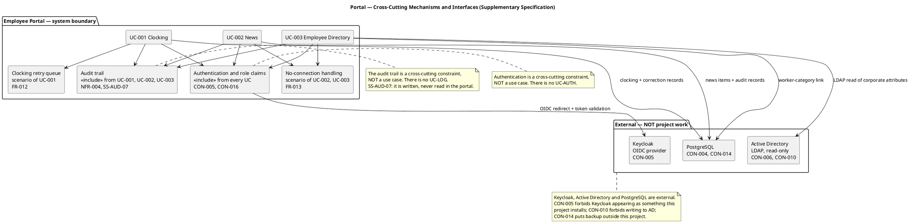

## Document Control

| Field | Value |
|---|---|
| Artifact | Supplementary Specification — Portal (Employee Portal, Cuba Corp) |
| Phase | Inception |
| Status | Draft — produced for review; milestone NOT YET ACHIEVED |
| Milestone Target | End-of-Inception (not marked complete by this artifact) |
| Iteration / Cycle | 1 / 1 |
| Owner | SystemAnalyst |
| Date | 2026-09-17 |
| Detail level | Inception — FURPS+ categories established and every declared NFR/constraint placed. RequirementsSpecifier quantifies thresholds and details per-UC non-functional flows in Elaboration. |
| Governing process | Development Case (Inception) — CON-016/CON-021 and CON-023 are the DC's named inputs to this artifact |

**Scope of this artifact.** It carries the requirements that are **not** expressible as a use-case flow: the non-functional requirements (NFR-001..NFR-004), the cross-cutting mechanisms, and the design, interface and standard constraints (CON-001..CON-024). Every category below is addressed; where a category has no declared requirement, that is stated as **N/A with its basis** rather than left blank.

## Functionality

### Security and access control

| ID | Requirement | Basis | Testable threshold |
|---|---|---|---|
| SS-SEC-01 | The portal authenticates every user through Keycloak as an OIDC client: register a client, redirect for login, validate the token, read roles from its claims. Nothing more. | CON-005 | No portal page or API endpoint is reachable without a validated token. |
| SS-SEC-02 | Keycloak is **external and is not project work**. No realm design, no client provisioning script, no Keycloak hosting, and no Keycloak entry in the deployment diagram as something this project installs. | CON-005 | Zero Keycloak work items; zero Keycloak components owned by this project. |
| SS-SEC-03 | Authorization has exactly **two levels**, derived from Active Directory group membership: members of the HR AD group publish, edit and unpublish news and manage worker categories; everybody else is an employee with read access to the directory and the news, plus their own clockings. | CON-016 | Exactly two authorization levels exist. No role matrix, no permission screen, no per-category rule. |
| SS-SEC-04 | The worker category is **descriptive and does NOT drive access control**. It appears in exactly two places: as a directory column that also filters it, and as a CSV export column. Nowhere else. | CON-021 | A grep of the authorization path finds no reference to the worker category. |
| SS-SEC-05 | The portal is reachable only from the internal corporate network. | CON-008 | No route from outside the corporate network. |
| SS-SEC-06 | The portal never writes to Active Directory and never edits an employee field anywhere. | CON-006, CON-010 | Zero write operations against AD; zero employee-field edit endpoints. |
| SS-SEC-07 | The directory shows corporate data only — no private personal information. | CON-024 | The displayed attribute set is exactly: name, job title, department, office, email, extension phone, worker category. |

**Authentication is a cross-cutting constraint, not a use case.** There is deliberately no `UC-AUTH`. Every use case includes SS-SEC-01. The same applies to the audit trail (SS-AUD-01) and to the no-connection handling (SS-REL-03): there is no `UC-LOG` and no `UC-SYNC`.

### Audit trail

| ID | Requirement | Basis | Testable threshold |
|---|---|---|---|
| SS-AUD-01 | **Mandatory traceability** of who publishes each news item, who edits it and who unpublishes it — author + timestamp in every case. | NFR-004 | Every news state change carries an author identifier and a timestamp. No news state change is possible without one. |
| SS-AUD-02 | Any change to a worker's category is audited. | NFR-004 | Every assign and every clear of a category carries an author identifier and a timestamp. |
| SS-AUD-03 | Every clocking HR corrects or inserts is audited with **who, when, the previous value and a free-text reason**. | NFR-004, CON-017 | All four fields are present on every correction. For an *insert*, the previous value is recorded as "none" — an insert is a correction too. |
| SS-AUD-04 | Corrections are **additive**: the original record is never overwritten in place and never deleted. | CON-017 | The original clocking row is byte-identical after a correction. |
| SS-AUD-05 | News items are **never hard-deleted**. Unpublish hides an item; the record stays for the audit trail. | CON-019 | Zero hard-delete operations on news items. |
| SS-AUD-06 | Employee fields are read-only from AD, so there is nothing to audit there. | NFR-004 | No audit record is produced for employee attributes. |
| SS-AUD-07 | **The audit trail is written, not read in the portal.** There is **no in-portal audit view screen** for HR or for anyone else. The audit is recorded for compliance and read directly from the database by whoever needs it. | Stakeholder decision, 2026-09-17 — asked whether the portal needs an in-portal audit view screen for HR or whether the audit is recorded for compliance and read directly from the database; the stakeholder answered **No**. | Zero audit-view screens in the portal. The audit records of SS-AUD-01..SS-AUD-03 are persisted and queryable in the database. |

**Consequence of SS-AUD-07 for the rest of the model.** NFR-004's obligation is discharged entirely by *writing* the audit. No use case gains an audit-reading scenario, no screen is added, and the declared exclusions (no news archive screen, no permission administration screen, no self-service correction screen) are joined by this one: no audit view screen. The audit remains a cross-cutting constraint included by UC-001, UC-002 and UC-003 — never a use case, and now explicitly never a screen either.

### Business rules carried as functional constraints

| ID | Rule | Basis |
|---|---|---|
| SS-BR-01 | There is **no data migration**. The portal starts empty and records clockings from go-live onwards. The historical Excel sheets stay on the shared drive as a read-only archive and are not imported. | CON-012 |
| SS-BR-02 | All three offices are in the same timezone (Europe/Madrid). Clockings are **stored in UTC and displayed in Europe/Madrid**. There is no multi-timezone case and no normalisation to design. | CON-015 |
| SS-BR-03 | Only HR corrects or inserts a clocking. There is **no self-service correction screen** for the employee. | CON-017 |
| SS-BR-04 | Featuring is a **manual HR flag**, set when publishing or when editing — never automatic. There are no criteria, no dates and no rules that promote a news item by themselves. | CON-018 |
| SS-BR-05 | **At most one news item is featured at any moment.** Featuring one un-features the previous. This is an **invariant of the system, not a convention of the screen** — it must hold wherever the change comes from, not only in the form HR happens to use. Unpublishing the featured item un-features it too; **no other item is promoted in its place**. | CON-018 |
| SS-BR-06 | The worker category is the **only field of the directory the portal owns**. It is stored as a **link** — AD user id → category — never as a duplicate of the employee. The local table holds two columns and nothing else. There is no synchronisation, no reconciliation and no conflict to resolve. The employee data has exactly one home. | CON-020 |
| SS-BR-07 | A worker has **at most one category and it may be empty**. An employee with no category still appears in the directory and in the export, with that field blank. **No default value is invented for it.** | CON-022 |
| SS-BR-08 | Worker categories are a **closed list of exactly four values**, fixed for this project: **Full-time, Part-time, Contractor, Intern**. They are not configurable, there is no screen to create or rename them, and no fifth value is added without a Change Request. | CON-023 |
| SS-BR-09 | The news category list is the four values named in FR-006 — **General, HR, IT, Events**. The declared scope enumerates no capability to create, rename or manage a news category, and the scope guard forbids adding an undeclared functional area; a fifth news category is therefore a **Change Request**, resolved on the same basis as SS-BR-08. | FR-006; scope guard. **Volatility: Medium** — the list is not declared closed, so it is encapsulated to keep a change cheap. |

### Licensing

**N/A — no third-party licensing obligation is declared.** The stack is .NET 10 (CON-001), Razor Pages (CON-003) and PostgreSQL (CON-004), all of which the organization already operates; Keycloak is already deployed and maintained separately (CON-005). No commercial component, no per-seat licence and no third-party service subscription is declared. Recorded as N/A rather than left blank.

## Usability

| ID | Requirement | Basis | Testable threshold |
|---|---|---|---|
| SS-USA-01 | The portal **MUST implement** the custom design at `docs/inputs/employee-portal-design.html`. It is mandatory and authoritative for the UI **visual layer**, not only for its structure. | CON-013 | Every screen matches the supplied design's visual layer. The design is committed and needs no confirmation that it will arrive. |
| SS-USA-02 | The portal is a **responsive web application** — no native app. | Declared scope | Usable on the browsers and screen sizes the design targets. |
| SS-USA-03 | Compatible with **current Chrome and Edge**. | CON-009 | Both browsers, current versions, no other browser is a target. |
| SS-USA-04 | Any employee finds a colleague's phone or email in **under 10 seconds**. | AC-003 | The contact data appears in the search result list itself — not behind a second click. |
| SS-USA-05 | **80% of employees complete at least one clocking with no prior training.** | AC-004 | The clocking action is reachable and unambiguous from the main screen. |
| SS-USA-06 | An employee can clock in and out **without help from HR or the development team**. | AC-001 | No HR or developer involvement in the clocking path. |
| SS-USA-07 | An HR Administrator can publish a news item **without technical assistance**. | AC-002 | Publishing requires no developer, no deployment and no database access. |
| SS-USA-08 | The main screen shows a **Clock In or Clock Out button according to current status**, and pressing it shows a confirmation. | FR-002 | The button label reflects the current status on page load. |

**Accessibility.** No accessibility standard is declared. Recorded as **N/A — not declared**; no WCAG level is asserted here, and none is invented. If a level is required it is a Change Request.

**Documentation.** User documentation is a Deployment-discipline deliverable (Release Notes, User Documentation) and is not specified here. The declared scope requires no in-product help system.

## Reliability

| ID | Requirement | Basis | Testable threshold |
|---|---|---|---|
| SS-REL-01 | Available **Monday–Friday 07:00–19:00**, with fault tolerance within the corporate network. **24/7 is not required.** | NFR-003 | The system is up throughout the declared window. This is an **availability target, not a curfew**: the declared title is "Availability During Extended Working Hours" and the requirement states that 24/7 is not required — it does not state that the portal must refuse a clocking outside the window. A clocking made while the system is up is recorded whenever it is made. |
| SS-REL-02 | **Clocking retry after network loss.** The clocking page keeps the press in the browser (localStorage) and retries its POST for up to **5 minutes**. The server accepts the **timestamp the client sends** — the time the employee pressed the button, not the time the server received it — and rejects duplicates by an **idempotency key**. Beyond 5 minutes the employee reports the clocking to HR. | FR-012, AC-005 | A clocking made while the network is down for up to 5 minutes is not lost, and carries the press time. A duplicate press creates exactly one record. |
| SS-REL-03 | The directory and the news show a **no-connection message** when the network is unavailable. **Nothing is copied locally**, so there is nothing to cache and nothing to sync. | FR-013 | No client-side cache of the directory or the news exists. |
| SS-REL-04 | **No offline mode beyond the clocking retry** — no PWA, no service worker, no installable app, no client cache of the directory or the news. | Declared scope | Zero service workers; zero installable manifest. |
| SS-REL-05 | **Backups are out of scope.** The Infrastructure team's existing server-backup practice already covers this PostgreSQL instance in restorable form, confirmed in writing with a verified restore test. No backup design, no backup tooling and no restore procedure are part of this project. | CON-014 | Zero backup deliverables. |
| SS-REL-06 | **One action, one queue, one entity.** Two clocking presses by the same employee cannot conflict with anything, so there is nothing to reconcile. | FR-012 | No reconciliation or conflict-resolution mechanism exists. |

**Recoverability.** The only declared recovery path is SS-REL-02 (the 5-minute retry) and, beyond it, HR inserting the clocking under SS-AUD-03. No other recovery mechanism is declared, and none is invented.

## Performance

| ID | Requirement | Basis | Testable threshold |
|---|---|---|---|
| SS-PER-01 | The page must load in **under 3 seconds** on the corporate network. | NFR-001 | Page load < 3 s, measured on the corporate network. |
| SS-PER-02 | The clock in/out operation must respond in **under 1 second**. | NFR-002 | Clocking response < 1 s. |

**Scale.** 200 employees across 3 offices (declared). No throughput, concurrency or data-volume target is declared beyond this, and none is invented. The declared scale is the basis for every performance decision; a target for a system 10× this size would be gold-plating.

**Resource usage.** No CPU, memory or storage target is declared. **N/A — not declared.**

## Supportability

| ID | Requirement | Basis | Testable threshold |
|---|---|---|---|
| SS-SUP-01 | **Post-launch operations belong to the Infrastructure team.** They operate the portal in production once it is live — deployment, monitoring and patching — exactly as they already operate AD and Keycloak. The development team hands over at the end of Transition and does not run it afterwards. | CON-011 | A handover deliverable exists; no post-handover operational duty remains with the development team. |
| SS-SUP-02 | The portal runs as a **.NET application on the internal Windows Server estate** the Infrastructure team already runs. No cloud. | CON-007, CON-001 | Deployable to the existing Windows Server estate. |
| SS-SUP-03 | **Active Directory is operated by the Infrastructure team.** This project neither administers it nor writes to it. | CON-010 | Zero AD administration deliverables. |
| SS-SUP-04 | The stack is fixed: **.NET 10** backend, **Razor Pages** frontend, **PostgreSQL** database, **REST API** between them. | CON-001, CON-003, CON-004, CON-002 | No additional runtime, framework or datastore is introduced. |
| SS-SUP-05 | **"No SPA" means no client-side framework and no client-side router — it does not mean no JavaScript.** A page-level script on an already-rendered page is Razor Pages as normal, and the clocking page needs one for the offline retry. | CON-003 | The clocking page's retry script is not a framework violation. |
| SS-SUP-06 | **Configurability is deliberately minimal.** The worker category list is not configurable (SS-BR-08); there is no permission administration screen (SS-SEC-03); there is no category-management screen. | CON-023, CON-016 | No configuration screen beyond what the declared scope names. |

**Maintainability.** No code-quality, coverage or documentation metric is declared. The Development Case records `CONTRIBUTING.md`, the CI workflow and the lint configuration as Elaboration gaps owned by the discipline experts; they are not requirements of this artifact.

## Design Constraints

| ID | Constraint | Basis | Effect |
|---|---|---|---|
| SS-DC-01 | Backend: **.NET 10**. | CON-001 | Fixes the runtime and the language version. |
| SS-DC-02 | Backend exposes a **REST API**. | CON-002 | The frontend consumes a REST API; there is no server-side-only data path. |
| SS-DC-03 | Frontend: **Razor Pages** (intranet, no SPA needed). | CON-003 | No client-side framework, no client-side router. A page-level script is permitted (SS-SUP-05). |
| SS-DC-04 | Database: **PostgreSQL**, target version **latest**. | CON-004; Development Case version policy D4 | The stakeholder declared PostgreSQL without a version and, on being asked which version the project must target, answered **latest**. No version floor and no LTS-only rule. |
| SS-DC-05 | Hosting: **internal Windows Server**, no cloud. | CON-007 | Single-node, on-premises. |
| SS-DC-06 | The employee directory is read **directly from Active Directory over LDAP**. Keycloak is authentication and authorization only — it is **not** a directory to query. Corporate attributes (job title, department, office, email, extension) live in AD, and AD is their system of record. | CON-006 | The directory's data path is LDAP, not Keycloak and not a local table. |
| SS-DC-07 | The worker category is stored as a **link** (AD user id → category) in a **two-column table and nothing else**. | CON-020 | No local copy of the employee; no sync, no reconciliation, no conflict resolution. |
| SS-DC-08 | The supplied design at `docs/inputs/employee-portal-design.html` is **mandatory and authoritative for the UI visual layer**. | CON-013 | The design is a design constraint, not a suggestion. |
| SS-DC-09 | **No Keycloak work of any kind.** | CON-005 | No realm design, no client provisioning scripts, no Keycloak hosting, no Keycloak in the deployment diagram as something this project installs. |

## Interfaces

| ID | Interface | Direction | Specification | Basis |
|---|---|---|---|---|
| SS-IF-01 | **Keycloak OIDC** | Outbound (portal is the client) | OIDC authorization-code redirect for login; token validation; roles read from claims. The client is already registered and its credentials are with the development team, so login is testable from day one. | CON-005 |
| SS-IF-02 | **Active Directory over LDAP** | Outbound, **read-only** | Reads corporate attributes: job title, department, office, email, extension. Never writes. | CON-006, CON-010 |
| SS-IF-03 | **REST API** | Internal, frontend ↔ backend | The portal's own API. | CON-002 |
| SS-IF-04 | **Browser** | Inbound | Current Chrome and Edge, from the internal corporate network only. | CON-009, CON-008 |
| SS-IF-05 | **CSV export** | Outbound, file | One calendar month, 00:00 on the first day to 23:59:59 on the last day, Europe/Madrid. Exactly these columns, in this order: `EmployeeId, FullName, WorkerCategory, Date, ClockIn, ClockOut, HoursWorked, Corrected`. Timestamps in Europe/Madrid local time. | FR-014, CON-015 |
| SS-IF-06 | **PostgreSQL** | Outbound | The portal's own datastore. Backup and restore are external (SS-REL-05). | CON-004, CON-014 |

## Applicable Standards

| ID | Standard | Application | Basis |
|---|---|---|---|
| SS-STD-01 | **OpenID Connect (OIDC)** | Authentication and role claims; the portal is an OIDC client. | CON-005 |
| SS-STD-02 | **LDAP** | Directory reads against Active Directory. | CON-006 |
| SS-STD-03 | **CSV** | The monthly clocking export format. | FR-014 |
| SS-STD-04 | **UTC for storage, Europe/Madrid for display and export** | All timestamps. All three offices share one timezone; there is no multi-timezone case. | CON-015 |
| SS-STD-05 | **REST** | The portal's own API style. | CON-002 |
| SS-STD-06 | **Current Chrome and Edge** | The supported browser set. | CON-009 |

**Standards explicitly not applicable.** No accessibility standard is declared (see *Usability*). No regulatory or statutory standard is declared — no GDPR, no SOX, no sector regulation appears anywhere in the declared scope, and none is asserted here. No payroll or accounting standard applies, because payroll integration is excluded.

## Traceability

| Element | Traces From | Link Type | Traces To |
|---|---|---|---|
| Supplementary Specification | NFR-001, NFR-002 | Derives | Design Model |
| Supplementary Specification | NFR-003, NFR-004 | Derives | Design Model |
| Supplementary Specification | CON-001, CON-002, CON-003, CON-004 | Derives | Software Architecture Document |
| Supplementary Specification | CON-005, CON-006, CON-007, CON-008, CON-009, CON-010, CON-011 | Derives | Software Architecture Document |
| Supplementary Specification | CON-012, CON-013, CON-014, CON-015 | Derives | Design Model |
| Supplementary Specification | CON-016, CON-017, CON-018, CON-019 | Derives | Design Model |
| Supplementary Specification | CON-020, CON-021, CON-022, CON-023, CON-024 | Derives | Design Model |
| SS-AUD-01, SS-AUD-02, SS-AUD-03, SS-AUD-04, SS-AUD-05 | NFR-004 | Derives | Test Case |
| SS-AUD-07 | NFR-004; stakeholder decision 2026-09-17 (no in-portal audit view screen) | Derives | Design Model |
| SS-REL-02 | FR-012, AC-005 | Derives | Test Case |
| SS-USA-04 | AC-003 | Derives | Test Case |
| SS-USA-05 | AC-004 | Derives | Test Case |
| SS-IF-05 | FR-014 | Derives | Design Model |
| SS-DC-06, SS-DC-07 | CON-006, CON-020 | Derives | Design Model |
| SS-BR-05 | CON-018 | Derives | Test Case |
