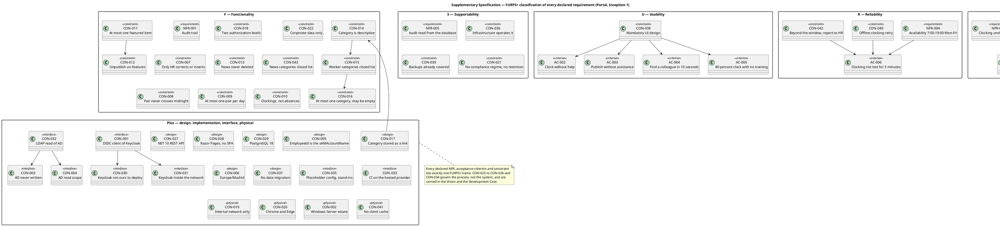
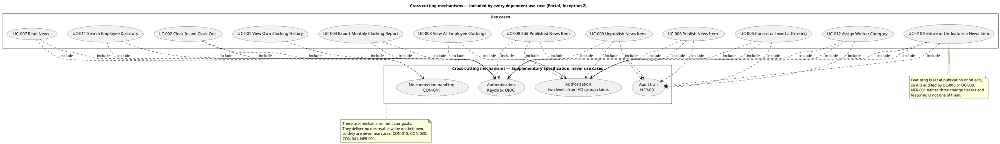

## Document Control
- **Phase:** Inception
- **Status:** Draft — under review
- **Milestone Target:** End of Inception (not yet achieved)
- **Iteration:** 2, Cycle 1
- **Owner:** SystemAnalyst
- **Date:** 2026-10-07
## Functionality

```plantuml
@startuml
title Supplementary Specification — FURPS+ classification of every declared requirement (Portal, Inception 1)

skinparam classAttributeIconSize 0
skinparam packageStyle rectangle

package "F — Functionality" as F {
  class "NFR-001\nAudit trail" as N1 <<requirement>>
  class "CON-018\nTwo authorization levels" as C18 <<constraint>>
  class "CON-022\nCorporate data only" as C22 <<constraint>>
  class "CON-007\nOnly HR corrects or inserts" as C7 <<constraint>>
  class "CON-011\nAt most one featured item" as C11 <<constraint>>
  class "CON-012\nUnpublish un-features" as C12 <<constraint>>
  class "CON-013\nNews never deleted" as C13 <<constraint>>
  class "CON-014\nCategory is descriptive" as C14 <<constraint>>
  class "CON-015\nWorker categories closed list" as C15 <<constraint>>
  class "CON-016\nAt most one category, may be empty" as C16 <<constraint>>
  class "CON-043\nNews categories closed list" as C43 <<constraint>>
  class "CON-008\nPair never crosses midnight" as C8 <<constraint>>
  class "CON-009\nAt most one pair per day" as C9 <<constraint>>
  class "CON-010\nClockings, not absences" as C10 <<constraint>>
}

package "U — Usability" as U {
  class "AC-002\nClock without help" as A2 <<criterion>>
  class "AC-003\nPublish without assistance" as A3 <<criterion>>
  class "AC-004\nFind a colleague in 10 seconds" as A4 <<criterion>>
  class "AC-005\n80 percent clock with no training" as A5 <<criterion>>
  class "CON-038\nMandatory UI design" as C38 <<constraint>>
}

package "R — Reliability" as R {
  class "NFR-004\nAvailability 7:00-19:00 Mon-Fri" as N4 <<requirement>>
  class "AC-006\nClocking not lost for 5 minutes" as A6 <<criterion>>
  class "CON-040\nOffline clocking retry" as C40 <<constraint>>
  class "CON-042\nBeyond the window, report to HR" as C42 <<constraint>>
}

package "P — Performance" as P {
  class "NFR-002\nPage load under 3 seconds" as N2 <<requirement>>
  class "NFR-003\nClocking under 1 second" as N3 <<requirement>>
  class "AC-001\nFull page load as experienced" as A1 <<criterion>>
}

package "S — Supportability" as S {
  class "NFR-005\nAudit read from the database" as N5 <<requirement>>
  class "CON-036\nInfrastructure operates it" as C36 <<constraint>>
  class "CON-039\nBackups already covered" as C39 <<constraint>>
  class "CON-021\nNo compliance regime, no retention" as C21 <<constraint>>
}

package "Plus — design, implementation, interface, physical" as PLUS {
  class "CON-027\nNET 10 REST API" as C27 <<design>>
  class "CON-028\nRazor Pages, no SPA" as C28 <<design>>
  class "CON-029\nPostgreSQL 18" as C29 <<design>>
  class "CON-017\nCategory stored as a link" as C17 <<design>>
  class "CON-005\nEmployeeId is the sAMAccountName" as C5 <<design>>
  class "CON-006\nEurope/Madrid" as C6 <<design>>
  class "CON-037\nNo data migration" as C37 <<design>>
  class "CON-001\nOIDC client of Keycloak" as C1 <<interface>>
  class "CON-030\nKeycloak not ours to deploy" as C30 <<interface>>
  class "CON-031\nKeycloak inside the network" as C31 <<interface>>
  class "CON-032\nLDAP read of AD" as C32 <<interface>>
  class "CON-003\nAD never written" as C3 <<interface>>
  class "CON-004\nAD read scope" as C4 <<interface>>
  class "CON-035\nPlaceholder config, stand-ins" as C35 <<interface>>
  class "CON-033\nCI on the hosted provider" as C33 <<interface>>
  class "CON-019\nInternal network only" as C19 <<physical>>
  class "CON-020\nChrome and Edge" as C20 <<physical>>
  class "CON-002\nWindows Server estate" as C2 <<physical>>
  class "CON-041\nNo client cache" as C41 <<physical>>
}

N2 --> A1
N3 --> A1
N4 --> A6
C40 --> A6
C42 --> A6
C38 --> A2
C38 --> A3
C38 --> A4
C38 --> A5
C11 --> C12
C14 --> C15
C15 --> C16
C1 --> C30
C1 --> C31
C32 --> C3
C32 --> C4
C17 --> C14

note bottom of PLUS
  Every declared NFR, acceptance criterion and constraint
  has exactly one FURPS+ home. CON-023 to CON-026 and
  CON-034 govern the process, not the system, and are
  carried in the Vision and the Development Case.
end note
@enduml
```

### Audit trail (NFR-001)

Mandatory traceability of three change classes. Employee fields are read-only from AD, so there is nothing to audit there.

| Change class | Recorded | Use cases |
|---|---|---|
| News publication, edit, unpublish and featuring | Author and timestamp in every case | UC-006, UC-008, UC-009, UC-010 |
| Worker category assignment or clearing | Who and when | UC-012 |
| Clocking corrected or inserted by HR | Who, when, previous value, free-text reason | UC-005 |

The audit trail is append-only. The original clocking record is never overwritten in place and never deleted (CON-007); a news item is never deleted, only unpublished (CON-013).

Featuring is not a fourth change class: the featured flag is an attribute of a news item, so a change to it is audited by the news-item change class above. UC-010 writes that record whenever it changes the flag. It cannot rely on UC-006 or UC-008 having run: HR can un-feature the current item and leave none without editing the item (FR-010, CON-012), so the featuring path is a news-item change in its own right. NFR-001 names three classes and this specification does not add a fourth.

### Authorization (CON-018)

Two levels, derived from Active Directory group membership carried in the Keycloak token claims. Members of the HR AD group publish, edit and unpublish news and manage worker categories. Everybody else is an employee with read access to the directory and the news, plus their own clockings. There is no role matrix, no permission screen and no per-category rule. The worker category is descriptive and does not drive access control (CON-014).

### Data protection (CON-022)

The directory shows corporate data only — name, job title, department, office, email, extension and worker category. No private personal information.

### System-wide business rules

Invariants that hold wherever the change comes from, not only in the screen HR happens to use. They are not steps of any single use case, which is why they are specified here.

| ID | Rule | Bearing |
|---|---|---|
| CON-007 | Only HR corrects or inserts a clocking. The original record is never overwritten in place and never deleted. No self-service correction screen. | UC-005 |
| CON-008 | A clocking pair never crosses midnight. A pair belongs to one calendar date. | UC-002, UC-004 |
| CON-009 | At most one clocking pair per employee per calendar day. | UC-002, UC-004, UC-005 |
| CON-010 | The portal records clockings, not absences. A day with no clocking produces no export row. | UC-004 |
| CON-011 | At most one news item is featured at any moment. An invariant of the system, not a convention of the screen. | UC-006, UC-008, UC-010 |
| CON-012 | Unpublishing the featured item un-features it too. No other item is promoted in its place. | UC-009, UC-010 |
| CON-013 | News items are never deleted — unpublishing hides them. | UC-009 |
| CON-014 | The worker category is descriptive and does not drive access control. Used in exactly two places: the directory column that also filters it, and the CSV export. | UC-011, UC-012 |
| CON-015 | Worker categories are a closed list of exactly four values: Full-time, Part-time, Contractor, Intern. Not configurable. | UC-011, UC-012 |
| CON-016 | A worker has at most one category and it may be empty. No default value is invented. | UC-011, UC-012 |
| CON-043 | News categories are a closed list of exactly four values: General, HR, IT, Events. Not configurable. | UC-006, UC-007, UC-008 |

### Cross-cutting mechanisms

```plantuml
@startuml
title Cross-cutting mechanisms — included by every dependent use case (Portal, Inception 2)

skinparam packageStyle rectangle

package "Cross-cutting mechanisms — Supplementary Specification, never use cases" as X {
  usecase "Authentication\nKeycloak OIDC" as AUTH
  usecase "Authorization\ntwo levels from AD group claims" as AUTHZ
  usecase "Audit trail\nNFR-001" as AUDIT
  usecase "No-connection handling\nCON-041" as NET
}

package "Use cases" as UC {
  usecase "UC-001 View Own Clocking History" as U1
  usecase "UC-002 Clock In and Clock Out" as U2
  usecase "UC-003 View All Employee Clockings" as U3
  usecase "UC-004 Export Monthly Clocking Report" as U4
  usecase "UC-005 Correct or Insert a Clocking" as U5
  usecase "UC-006 Publish News Item" as U6
  usecase "UC-007 Read News" as U7
  usecase "UC-008 Edit Published News Item" as U8
  usecase "UC-009 Unpublish News Item" as U9
  usecase "UC-010 Feature or Un-feature a News Item" as U10
  usecase "UC-011 Search Employee Directory" as U11
  usecase "UC-012 Assign Worker Category" as U12
}

U1 ..> AUTH : include
U2 ..> AUTH : include
U3 ..> AUTH : include
U4 ..> AUTH : include
U5 ..> AUTH : include
U6 ..> AUTH : include
U7 ..> AUTH : include
U8 ..> AUTH : include
U9 ..> AUTH : include
U10 ..> AUTH : include
U11 ..> AUTH : include
U12 ..> AUTH : include

U3 ..> AUTHZ : include
U4 ..> AUTHZ : include
U5 ..> AUTHZ : include
U6 ..> AUTHZ : include
U8 ..> AUTHZ : include
U9 ..> AUTHZ : include
U10 ..> AUTHZ : include
U12 ..> AUTHZ : include

U5 ..> AUDIT : include
U6 ..> AUDIT : include
U8 ..> AUDIT : include
U9 ..> AUDIT : include
U10 ..> AUDIT : include
U12 ..> AUDIT : include

U2 ..> NET : include
U7 ..> NET : include
U11 ..> NET : include

note bottom of X
  These are mechanisms, not actor goals.
  They deliver no observable value on their own,
  so they are never use cases. CON-018, CON-030,
  CON-041, NFR-001.
end note

note bottom of U10
  Featuring is set at publication or on edit,
  so it is audited by UC-006 or UC-008.
  NFR-001 names three change classes and
  featuring is not one of them.
end note
@enduml
```

| Mechanism | Specification | Included by |
|---|---|---|
| Authentication | OIDC client of the existing Keycloak: register a client, redirect for login, validate the token, read roles from its claims. Keycloak is already running and maintained separately; no realm design, no client provisioning, no hosting (CON-001, CON-030, CON-031). | Every use case — UC-001 to UC-012 |
| Authorization | Two levels from AD group membership in the token claims (CON-018). | UC-003, UC-004, UC-005, UC-006, UC-008, UC-009, UC-010, UC-012 |
| Audit trail | Append-only record of the three change classes (NFR-001). | UC-005, UC-006, UC-008, UC-009, UC-010, UC-012 |
| No-connection handling | The directory and the news require the network and show a 'no connection' message; nothing is cached locally (CON-041). Clocking retries for up to 5 minutes (CON-040). | UC-002, UC-007, UC-011 |

## Usability

| ID | Requirement | Threshold | Basis |
|---|---|---|---|
| AC-002 | An employee can clock in and out without help from HR or the development team. | Zero assistance required. | Declared acceptance criterion. |
| AC-003 | An HR Administrator can publish a news item without technical assistance. | Zero assistance required. | Declared acceptance criterion. |
| AC-004 | Any employee finds a colleague's phone/email. | Under 10 seconds. | Declared acceptance criterion. |
| AC-005 | Employees complete at least one clocking with no prior training. | 80% of employees. | Declared acceptance criterion. |
| CON-038 | The UI visual layer implements `docs/inputs/employee-portal-design.html`. | Mandatory and authoritative. | Declared constraint. |

The clocking page carries a page-level script on an already-rendered page — that is Razor Pages as normal and is not a SPA (CON-028).

## Reliability

| ID | Requirement | Threshold | Basis |
|---|---|---|---|
| NFR-004 | Availability window. | Monday–Friday 7:00–19:00, with fault tolerance within the corporate network. 24/7 explicitly not required. | Declared requirement. |
| AC-006 | A clocking made while the corporate network is down is not lost. | Up to 5 minutes. | Declared acceptance criterion. |
| CON-040 | Offline clocking retry — clocking only. | The press is kept in localStorage and the POST retried for up to 5 minutes. The server accepts the client timestamp and rejects duplicates by an idempotency key. | Declared constraint. |
| CON-042 | Beyond the 5-minute retry window. | The employee reports the clocking to HR. | Declared constraint. |

**Recoverability.** Backups are covered by Infrastructure's existing server-backup practice, confirmed in writing with a verified restore test. No backup design, tooling or restore procedure is part of this project (CON-039).

## Performance

| ID | Requirement | Threshold | Measurement |
|---|---|---|---|
| NFR-002 | Page load on the corporate network. | Under 3 seconds. | The full page load as the employee experiences it — browser request to page displayed and usable, including the clocking page's script (AC-001). Server response time is the engineering target that makes this achievable, not a substitute for it. |
| NFR-003 | Clock in/out operation response time. | Under 1 second. | The clocking operation itself. |

**Resource usage.** No throughput, concurrency or capacity target is declared. The declared population is 200 employees across 3 offices (STK-004) and the declared availability window is Monday–Friday 7:00–19:00 (NFR-004). No target beyond these is invented.

## Supportability

| ID | Requirement | Threshold | Basis |
|---|---|---|---|
| NFR-005 | Audit read access. | Consumed directly from the database. No in-portal audit view screen; building one is out of scope. | Declared requirement. |
| CON-036 | Post-launch operations. | Infrastructure operates the portal in production — deployment, monitoring and patching. The development team hands over at the end of Transition and does not run it afterwards. | Declared constraint. |
| CON-039 | Backups. | Covered by Infrastructure's existing practice. No backup design, tooling or restore procedure in this project. | Declared constraint. |
| CON-021 | Retention. | No external compliance regime applies to the audit trail and no retention period is mandated. HR or Infrastructure read it ad hoc. | Declared constraint. |

**Maintainability.** The two closed value lists — worker categories (CON-015) and news categories (CON-043) — are fixed for this project and are not configurable. No screen creates or renames a value, and no fifth value is added without a Change Request.

## Design Constraints

| ID | Constraint |
|---|---|
| CON-027 | Backend: .NET 10, REST API. |
| CON-028 | Frontend: Razor Pages. No client-side framework and no client-side router. A page-level script on an already-rendered page is Razor Pages as normal. |
| CON-029 | Database: PostgreSQL 18. The patch level floats, the major is pinned. |
| CON-017 | The worker category is stored as a link — AD user id to category. Two columns and nothing else. No synchronisation, no reconciliation, no conflict resolution. |
| CON-005 | EmployeeId in the CSV export is the AD sAMAccountName read from the authenticated session and written as-is. No mapping table. |
| CON-006 | Clockings are stored in UTC and displayed in Europe/Madrid. One timezone; no normalisation to design. |
| CON-037 | No data migration. The portal starts empty. |
| CON-038 | `docs/inputs/employee-portal-design.html` is mandatory and authoritative for the UI visual layer. |
| CON-040 | Offline clocking retry — clocking only. One action, one queue, one entity. |
| CON-041 | The directory and the news require the network and show a 'no connection' message. No client cache. |

The system-wide business rules — CON-007 to CON-016 and CON-043 — are specified under Functionality, where they belong as functional invariants. They are not repeated here.

## Interfaces

| ID | Interface | Specification |
|---|---|---|
| CON-001 | Keycloak — OIDC | The portal is an OIDC client of the existing Keycloak, which federates Active Directory. Register a client, redirect for login, validate the token, read roles from its claims. Keycloak is not ours to deploy (CON-030). |
| CON-031 | Keycloak — network position | Keycloak runs inside the corporate network. The OIDC redirect is an intra-network call; login keeps working with no internet link. |
| CON-032 | Active Directory — LDAP | The directory is read directly from AD over LDAP. Keycloak is authentication and authorization only — it is not a directory to query. Corporate attributes live in AD and AD is their system of record. |
| CON-003 | Active Directory — write | Never. AD must not be modified. |
| CON-004 | Active Directory — read scope | Name, job title, department, office, email, extension. Read-only in the portal. No edit form, no local copy. |
| CON-035 | Configuration | Placeholder values for issuer, client id, client secret, LDAP host, bind account and base DN are held in configuration and never in code. Infrastructure puts the real values in at deployment. The team builds and tests against stand-ins it controls. |
| CON-033 | CI | Build and test run on the hosted SCM provider's CI. It never holds production data or credentials and never deploys. |

## Applicable Standards

| ID | Standard or regime | Applicability |
|---|---|---|
| CON-021 | External compliance regime | None applies to the audit trail. No retention period is mandated. |
| CON-020 | Browser compatibility | Current versions of Chrome and Edge. |
| CON-019 | Network reachability | Internal corporate network only. |
| CON-006 | Timezone | Europe/Madrid for all three offices. |
| CON-002 | Hosting platform | The internal Windows Server estate Infrastructure already operates. |

## Traceability
| Element | Traces From | Link Type | Traces To |
|---|---|---|---|
| Supplementary Specification | NFR-001, NFR-002, NFR-003, NFR-004, NFR-005 | Refines | Software Architecture Document |
| Supplementary Specification | CON-001, CON-002, CON-003, CON-004, CON-005, CON-006, CON-007, CON-008, CON-009, CON-010, CON-011, CON-012, CON-013, CON-014, CON-015, CON-016, CON-017, CON-018, CON-019, CON-020, CON-021, CON-022, CON-027, CON-028, CON-029, CON-030, CON-031, CON-032, CON-033, CON-035, CON-036, CON-037, CON-038, CON-039, CON-040, CON-041, CON-042, CON-043 | Refines | Software Architecture Document |
| Supplementary Specification | AC-001, AC-002, AC-003, AC-004, AC-005, AC-006 | Refines | Test Case |
| Supplementary Specification | R001 | Refines | Risk List |

**Cross-cutting mechanism coverage.** Every one of the twelve use cases includes at least one mechanism specified here. Authentication is included by all twelve, UC-001 to UC-012. Authorization is included by the eight HR use cases — UC-003, UC-004, UC-005, UC-006, UC-008, UC-009, UC-010, UC-012. The audit trail is included by the six use cases that change audited data — UC-005, UC-006, UC-008, UC-009, UC-010, UC-012. No-connection handling is included by the three use cases that read over the network — UC-002, UC-007, UC-011. The Use-Case Model depends on this specification for those mechanisms; the dependency is registered on the Use-Case Model side, so the two artifacts are not linked in both directions.

**Threshold quantification.** NFR-002 and NFR-003 carry declared thresholds (under 3 seconds, under 1 second) and AC-001 fixes how NFR-002 is measured. NFR-001, NFR-004 and NFR-005 are stated as declared and are not further quantified here; the RequirementsSpecifier owns any refinement in Elaboration.
