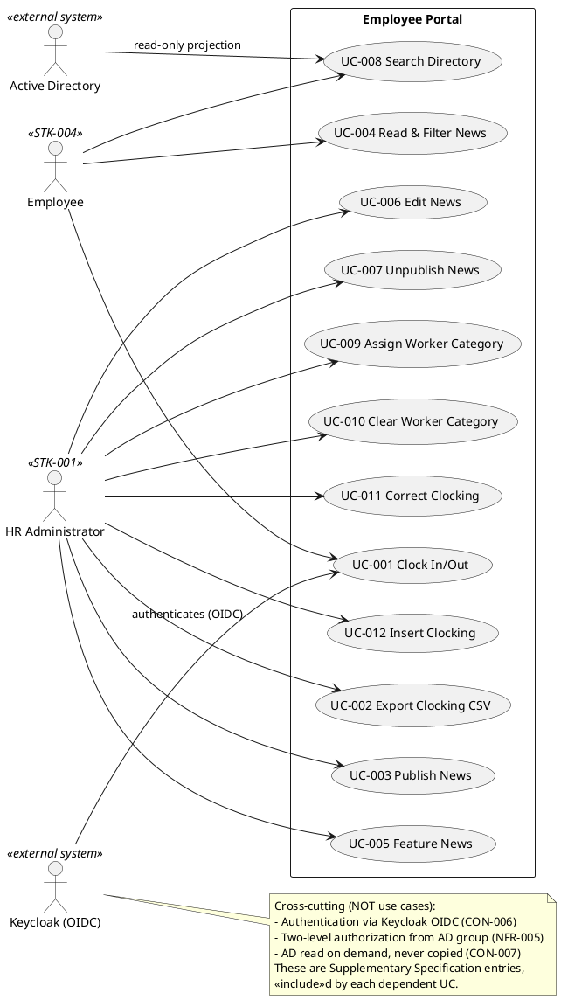
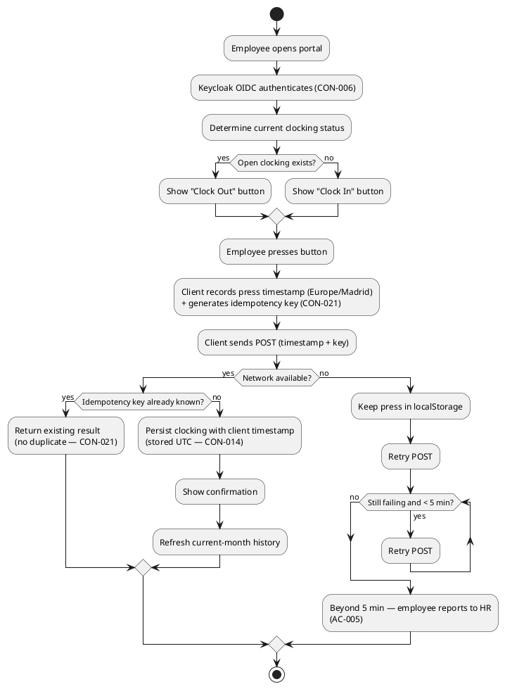
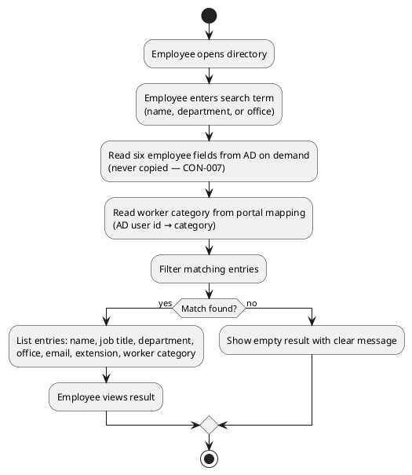

## Document Control
| Field | Value |
|---|---|
| Phase | Elaboration |
| Status | Draft |
| Milestone Target | End-of-Elaboration (Lifecycle Architecture) — NOT YET ACHIEVED |

## Use-Case Diagram

## Actors

| ID | Actor | Type | Description | Traces To |
|---|---|---|---|---|
| STK-004 | Employee | Human (primary) | Cuba Corp employee (200 people, 3 offices). Clocks in/out, reads/filters news, searches the directory. | FR-001, FR-004, FR-008 |
| STK-001 | HR Administrator | Human (primary) | HR staff (AD "HR" group). Publishes/edits/unpublishes/features news, manages worker categories, corrects/inserts clockings, exports CSV. | FR-002, FR-003, FR-005, FR-006, FR-007, FR-009, FR-010, FR-011, FR-012 |
| — | Keycloak (OIDC) | External system (supporting) | Identity provider. Authenticates every actor via OIDC; portal is a client only (CON-006). Not a use-case actor — a cross-cutting mechanism. | CON-006, NFR-005 |
| — | Active Directory | External system (supporting) | Source of employee identity and six read-only directory fields; source of group membership for two-level authorization. Read on demand, never copied (CON-007). Not a use-case actor — a cross-cutting mechanism. | CON-007, CON-010, NFR-005 |

**Actor coverage note:** No time-triggered actors (no scheduled jobs — backups are Infrastructure's, CON-013; no sync, CON-007). No hardware-device actors. No separate administrative actor beyond HR (Infrastructure operates the portal post-launch but has no in-app use cases — CON-011).

## Use-Case Survey

| UC | Name | Primary Actor | Priority (MoSCoW) | Volatility | Source |
|---|---|---|---|---|---|
| UC-001 | Clock In/Out | Employee | Must | Medium | FR-001 |
| UC-002 | Export Clocking CSV | HR Administrator | Must | Low | FR-002 |
| UC-003 | Publish News | HR Administrator | Must | Low | FR-003 |
| UC-004 | Read & Filter News | Employee | Must | Low | FR-004 |
| UC-005 | Feature News | HR Administrator | Must | Low | FR-005 |
| UC-006 | Edit News | HR Administrator | Must | Low | FR-006 |
| UC-007 | Unpublish News | HR Administrator | Must | Low | FR-007 |
| UC-008 | Search Directory | Employee | Must | Medium | FR-008 |
| UC-009 | Assign Worker Category | HR Administrator | Must | Low | FR-009 |
| UC-010 | Clear Worker Category | HR Administrator | Must | Low | FR-010 |
| UC-011 | Correct Clocking | HR Administrator | Must | Low | FR-011 |
| UC-012 | Insert Clocking | HR Administrator | Must | Low | FR-012 |

**Volatility rationale:** UC-001 (Medium) — clocking interaction may evolve with adoption feedback (R002) and the offline-retry window (AC-005). UC-008 (Medium) — directory field availability depends on AD attribute consistency across offices (R001). All others are stable business rules fixed by the closed-list category set (CON-016), the single-featured invariant (CON-015), and the immutable-record audit rules (CON-019, CON-020).

**Architecturally significant use cases (detailed this iteration):** UC-001 and UC-008. UC-001 forces decisions on client-timestamp acceptance + idempotency (CON-021) and offline retry (AC-005). UC-008 forces the AD on-demand projection boundary (CON-007) and surfaces R001. Remaining UCs are outlined; the Requirements Specifier details their flows in Elaboration.

## Use-Case Specifications
### UC-001 — Clock In/Out (fully specified)

| Field | Value |
|---|---|
| Primary Actor | Employee (STK-004) |
| Trigger | Employee opens the portal main screen and presses the Clock In / Clock Out button |
| Precondition | Employee authenticated via Keycloak OIDC (CON-006); for "Clock In" no open clocking exists, for "Clock Out" one open clocking exists |
| Postcondition | A clocking record is persisted with the exact press time; confirmation shown; current-month history updated |
| Priority | Must | Volatility: Medium |

**Main flow:**
1. Employee opens the portal; system authenticates via Keycloak OIDC and determines current clocking status.
2. System shows the main screen with a single "Clock In" or "Clock Out" button reflecting current status.
3. Employee presses the button; the client records the press timestamp and sends it with an idempotency key (CON-021).
4. System validates the idempotency key, rejects duplicates, and persists the clocking with the client-supplied timestamp (stored UTC, CON-014).
5. System shows a confirmation and refreshes the current-month history.

**Alternative flows:**
- **A1 — Duplicate press (idempotency):** the idempotency key is already known → system returns the existing result without creating a second record (CON-021).
- **A2 — Network down (offline retry):** the POST fails → the clocking page keeps the press in localStorage and retries for up to 5 minutes; beyond 5 minutes the employee reports the clocking to HR (AC-005). Directory and news show a "no connection" message instead.
- **A3 — Not authenticated:** Keycloak redirects to login; flow resumes at step 1 after authentication.

**Concrete scenarios (discovery walk-through):**

| # | Scenario | Data | Outcome |
|---|---|---|---|
| S1 | First clock-in of the day | Employee "Ana Ruiz" (AD id `aruiz`), presses Clock In at 08:03:12 Europe/Madrid | Clocking persisted with press time 08:03:12 (stored UTC 06:03:12Z); button flips to "Clock Out"; history shows the entry |
| S2 | Clock-out after a shift | Same employee presses Clock Out at 17:15:44 | Clocking persisted; button flips to "Clock In"; day's pair complete |
| S3 | Double-click on the button | Employee double-clicks Clock In; two POSTs carry the same idempotency key | First POST persists; second returns the existing result — exactly one record (CON-021) |
| S4 | Network blip during press | POST fails at 09:00; network returns at 09:02 | Press held in localStorage, retried, persisted at 09:02 with the original 09:00 press timestamp; no data loss (AC-005) |
| S5 | Network down > 5 min | POST fails at 09:00; network returns at 09:07 | Retry window expired; employee reports the clocking to HR (UC-011/UC-012 path) |

**Business rules:** CON-014 (UTC storage, Europe/Madrid display), CON-021 (client timestamp + idempotency key), AC-005 (offline retry window).

**Activity diagram:**

### UC-008 — Search Directory (fully specified)

| Field | Value |
|---|---|
| Primary Actor | Employee (STK-004) |
| Trigger | Employee opens the directory and enters a search term (name, department, or office) |
| Precondition | Employee authenticated via Keycloak OIDC |
| Postcondition | Matching colleagues are listed with name, job title, department, office, email, extension, and worker category |
| Priority | Must | Volatility: Medium |

**Main flow:**
1. Employee opens the directory and enters a search term (name, department, or office).
2. System reads the six employee fields from AD on demand (never copied — CON-007) and the worker category from the portal's `AD user id → worker category` mapping.
3. System lists matching entries: name, job title, department, office, email, extension phone number, worker category.
4. Employee views the result. No private personal information is shown (FR-008).

**Alternative flows:**
- **A1 — No match:** system shows an empty result with a clear message.
- **A2 — AD attribute gap:** a field (e.g., job title or extension) is empty in AD → the field renders blank; the entry still appears (R001 — to be validated early).

**Concrete scenarios (discovery walk-through):**

| # | Scenario | Data | Outcome |
|---|---|---|---|
| S1 | Search by name | Employee searches "Ruiz" | Ana Ruiz listed with all seven fields populated |
| S2 | Search by department | Employee searches "HR" | All HR members listed |
| S3 | Search by office | Employee searches "Madrid" | All Madrid-office employees listed |
| S4 | AD attribute gap | Employee "Carlos Vega" has no extension in AD (R001) | Entry appears with extension blank; other six fields populated |
| S5 | No match | Employee searches "Zzz" | Empty result with clear "no match" message |

**Business rules:** CON-007 (AD read on demand, no copy), CON-017 (worker category descriptive only), FR-008 (six AD fields + category; no private info).

**Activity diagram:**

### UC-002 — Export Clocking CSV (outline)

HR exports a monthly clocking CSV for one calendar month (00:00 first day to 23:59:59 last day, Europe/Madrid). Columns in exact order: EmployeeId, FullName, WorkerCategory, Date, ClockIn, ClockOut, HoursWorked, Corrected. Timestamps in Europe/Madrid local time. Source: FR-002. Priority: Must. Volatility: Low.

### UC-003 — Publish News (outline)

HR publishes a news item (title, body, date, category). Publication is audited (author + timestamp). Source: FR-003. Priority: Must. Volatility: Low.

### UC-004 — Read & Filter News (outline)

Employees see news newest-first, filter by category (General, HR, IT, Events), featured item with banner at top. Read-only — no comments/reactions. Source: FR-004. Priority: Must. Volatility: Low.

### UC-005 — Feature News (outline)

HR manually flags one item featured (never automatic). At most one featured at any moment (CON-015 invariant). Featuring un-features the previous; un-featuring leaves none; unpublishing the featured item un-features it. Source: FR-005. Priority: Must. Volatility: Low.

### UC-006 — Edit News (outline)

HR edits a published item (typo must not force republish). Every edit audited like publication (who + when). Source: FR-006. Priority: Must. Volatility: Low.

### UC-007 — Unpublish News (outline)

HR unpublishes a news item — hides it, never deletes (CON-020). No archive screen. Source: FR-007. Priority: Must. Volatility: Low.

### UC-009 — Assign Worker Category (outline)

HR assigns one of four closed-list categories (Full-time, Part-time, Contractor, Intern — CON-016) to a worker from the directory screen. Audited. At most one category per worker (CON-018). Source: FR-009. Priority: Must. Volatility: Low.

### UC-010 — Clear Worker Category (outline)

HR clears a worker's category, leaving the field empty. Employee still appears in directory and export with blank field (CON-018). Audited. Source: FR-010. Priority: Must. Volatility: Low.

### UC-011 — Correct Clocking (outline)

HR corrects an erroneous clocking to reflect actual time worked. Audited: who, when, previous value, free-text reason. Original never overwritten/deleted (CON-019). HR only — no employee self-service. Source: FR-011. Priority: Must. Volatility: Low.

### UC-012 — Insert Clocking (outline)

HR inserts a missing clocking (e.g., forgotten clock-out). Audited: who, when, free-text reason. Original never overwritten/deleted (CON-019). HR only. Source: FR-012. Priority: Must. Volatility: Low.

## Traceability

| Element | Traces From | Link Type | Traces To |
|---|---|---|---|
| UC-001 | FR-001 | Derives | (Elaboration: Use-Case Realization) |
| UC-002 | FR-002 | Derives | (Elaboration: Use-Case Realization) |
| UC-003 | FR-003 | Derives | (Elaboration: Use-Case Realization) |
| UC-004 | FR-004 | Derives | (Elaboration: Use-Case Realization) |
| UC-005 | FR-005 | Derives | (Elaboration: Use-Case Realization) |
| UC-006 | FR-006 | Derives | (Elaboration: Use-Case Realization) |
| UC-007 | FR-007 | Derives | (Elaboration: Use-Case Realization) |
| UC-008 | FR-008 | Derives | (Elaboration: Use-Case Realization) |
| UC-009 | FR-009 | Derives | (Elaboration: Use-Case Realization) |
| UC-010 | FR-010 | Derives | (Elaboration: Use-Case Realization) |
| UC-011 | FR-011 | Derives | (Elaboration: Use-Case Realization) |
| UC-012 | FR-012 | Derives | (Elaboration: Use-Case Realization) |
| NFR-001…NFR-005 | Declared input | — | Supplementary Specification |
