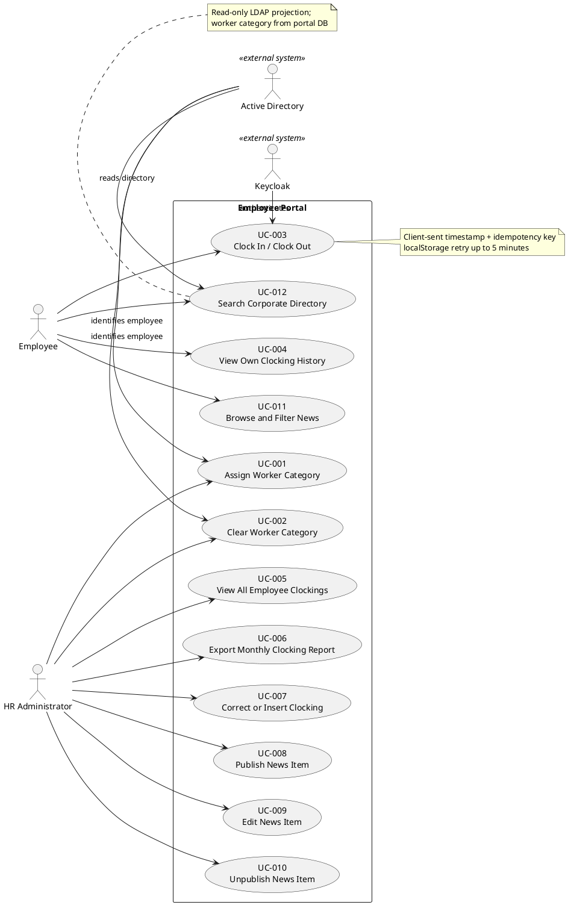

## Document Control

| Field | Value |
|---|---|
| Project | Portal |
| Phase | Inception |
| Iteration | 1 |
| Status | Draft |
| Milestone Target | End-of-Inception review |

## Use-Case Diagram

## Actors

| ID | Actor | Type | Description |
|---|---|---|---|
| A-001 | Employee | Human | Cuba Corp employee who clocks in/out, views own clocking history, browses news, and searches the corporate directory. Derived from STK-004. |
| A-002 | HR Administrator | Human | Member of the HR AD group who manages worker categories, oversees all clockings, exports reports, corrects clockings, and manages news. Derived from STK-001. |
| A-003 | Keycloak | External System | Existing OIDC provider for authentication and AD group claims. Derived from CON-004, CON-005, NFR-006. |
| A-004 | Active Directory | External System | Existing LDAP directory that is the system of record for employee attributes. Derived from CON-006, CON-010. |

## Use-Case Survey

| ID | Use Case | Primary Actor | Source | Priority | Volatility | Status |
|---|---|---|---|---|---|---|
| UC-001 | Assign Worker Category | HR Administrator | FR-001 | Must | Low | Outlined |
| UC-002 | Clear Worker Category | HR Administrator | FR-002 | Must | Low | Outlined |
| UC-003 | Clock In / Clock Out | Employee | FR-003, NFR-007 | Must | Low | Detailed (architecturally significant) |
| UC-004 | View Own Clocking History | Employee | FR-004 | Must | Low | Outlined |
| UC-005 | View All Employee Clockings | HR Administrator | FR-005 | Must | Low | Outlined |
| UC-006 | Export Monthly Clocking Report | HR Administrator | FR-006 | Must | Low | Outlined |
| UC-007 | Correct or Insert Clocking | HR Administrator | FR-007, CON-020 | Must | Low | Detailed (architecturally significant) |
| UC-008 | Publish News Item | HR Administrator | FR-008, CON-019 | Must | Medium | Detailed (architecturally significant) |
| UC-009 | Edit News Item | HR Administrator | FR-009 | Must | Medium | Outlined |
| UC-010 | Unpublish News Item | HR Administrator | FR-010 | Must | Medium | Outlined |
| UC-011 | Browse and Filter News | Employee | FR-011 | Must | Low | Outlined |
| UC-012 | Search Corporate Directory | Employee | FR-012, CON-010 | Must | Low | Detailed (architecturally significant) |

## Use-Case Specifications

### UC-003 Clock In / Clock Out

**Source:** FR-003, NFR-007
**Primary Actor:** Employee (A-001)
**Trigger:** Employee opens the portal main page and presses the Clock In or Clock Out button.
**Precondition:** Employee is authenticated via Keycloak OIDC.
**Postcondition:** A clocking event is recorded with the client-sent timestamp and an idempotency key; duplicates are rejected.

**Main Flow:**
1. System displays the main page with a button labeled "Clock In" if the employee has no open clocking, or "Clock Out" if a clocking is open.
2. Employee presses the button.
3. Browser captures the exact local timestamp of the button press (Europe/Madrid).
4. Browser generates an idempotency key for the request.
5. Browser attempts to POST the event to the server.
6. Server validates the OIDC token and records the event with the client-sent timestamp and idempotency key.
7. Server returns a confirmation to the browser.
8. Browser displays the confirmation to the employee.

**Alternative Flows:**
- **A1 Network unavailable:** If the POST fails due to network outage, the browser stores the event (timestamp + idempotency key) in localStorage and retries the POST for up to 5 minutes. When the network returns, the retry succeeds and the stored entry is cleared.
- **A2 Duplicate detected:** If the server receives a request with an idempotency key it has already processed, it returns the existing response without creating a new record.
- **A3 Retry exhausted:** If the network outage exceeds 5 minutes, the browser stops retrying and instructs the employee to report the clocking to HR.

**Business Rules:**
- CON-021: All timestamps are stored in UTC and displayed in Europe/Madrid.
- NFR-007: Retry window is exactly 5 minutes.

**Volatility:** Low

---

### UC-007 Correct or Insert Clocking

**Source:** FR-007, CON-020
**Primary Actor:** HR Administrator (A-002)
**Trigger:** HR Administrator selects an employee and chooses to correct an existing clocking or insert a missing one.
**Precondition:** HR Administrator is authenticated and belongs to the HR AD group.
**Postcondition:** A new audited correction/insertion entry is created; the original record remains unchanged.

**Main Flow:**
1. HR Administrator navigates to the all-clockings view.
2. System displays clocking records for the selected period.
3. HR Administrator selects an employee and a date.
4. HR Administrator chooses "Correct" on an existing clocking or "Insert" for a missing one.
5. System presents a form with the current value (if correcting) or empty fields (if inserting).
6. HR Administrator enters the corrected/inserted timestamp(s) and a free-text reason.
7. System records a new correction entry containing: who made the change, when, the previous value, the new value, and the reason.
8. System updates the effective clocking view for that employee/date.
9. System confirms the correction to HR Administrator.

**Alternative Flows:**
- **A1 Missing original:** If the employee never clocked on the selected date, the "Correct" option is unavailable; only "Insert" is offered.
- **A2 Reason not provided:** System rejects the submission and prompts for a reason.

**Business Rules:**
- CON-020: Original records are never overwritten or deleted.
- NFR-004: Every correction is audited with author and timestamp.

**Volatility:** Low

---

### UC-008 Publish News Item

**Source:** FR-008, CON-019
**Primary Actor:** HR Administrator (A-002)
**Trigger:** HR Administrator chooses to publish a new internal news item.
**Precondition:** HR Administrator is authenticated and belongs to the HR AD group.
**Postcondition:** A published news item is visible to employees; at most one item is featured.

**Main Flow:**
1. HR Administrator opens the news management page.
2. System presents the publish form with fields: title, body, date, category (General, HR, IT, Events), and a "featured" checkbox.
3. HR Administrator fills the form and submits.
4. System validates the inputs.
5. If the "featured" flag is set, system clears the featured flag from any currently featured item.
6. System stores the news item with author and timestamp.
7. System confirms publication to HR Administrator.

**Alternative Flows:**
- **A1 Featured flag not set:** The item is published without changing the current featured item.
- **A2 Validation fails:** System returns the form with error messages.

**Business Rules:**
- CON-019: At most one news item is featured at any moment.
- NFR-004: Publication is audited with author and timestamp.

**Volatility:** Medium

---

### UC-012 Search Corporate Directory

**Source:** FR-012, CON-010, CON-012
**Primary Actor:** Employee (A-001)
**Trigger:** Employee opens the directory page and enters search criteria.
**Precondition:** Employee is authenticated via Keycloak OIDC.
**Postcondition:** Directory results matching the criteria are displayed, with AD-sourced fields and portal-managed worker category.

**Main Flow:**
1. Employee navigates to the directory page.
2. System reads employee attributes from Active Directory over LDAP on demand.
3. System joins AD attributes with the portal-managed worker category stored in PostgreSQL.
4. System displays the directory list with columns: name, job title, department, office, email, extension phone number, and worker category.
5. Employee enters search/filter terms (name, department, office, or worker category).
6. System filters the displayed results.

**Alternative Flows:**
- **A1 AD attribute missing:** The corresponding field is displayed blank; the entry still appears.
- **A2 Worker category blank:** The category column is blank; the entry still appears.

**Business Rules:**
- CON-010: Employee data is read from AD on demand; no local copy of AD attributes.
- CON-012: AD-sourced fields are read-only in the portal.
- CON-017: Worker category is one of Full-time, Part-time, Contractor, Intern, or blank.

**Volatility:** Low

---

### UC-001 Assign Worker Category

**Source:** FR-001, NFR-005
**Primary Actor:** HR Administrator (A-002)
**Trigger:** HR Administrator selects an employee in the directory and assigns a worker category.
**Postcondition:** The employee's worker category is updated and audited.
**Volatility:** Low

### UC-002 Clear Worker Category

**Source:** FR-002, NFR-005
**Primary Actor:** HR Administrator (A-002)
**Trigger:** HR Administrator selects an employee in the directory and clears the worker category.
**Postcondition:** The employee's worker category is empty and the change is audited.
**Volatility:** Low

### UC-004 View Own Clocking History

**Source:** FR-004
**Primary Actor:** Employee (A-001)
**Trigger:** Employee opens the clocking history page.
**Postcondition:** The employee sees their own clockings for the current month.
**Volatility:** Low

### UC-005 View All Employee Clockings

**Source:** FR-005
**Primary Actor:** HR Administrator (A-002)
**Trigger:** HR Administrator opens the all-clockings view.
**Postcondition:** HR Administrator sees all employees' clockings for the selected period.
**Volatility:** Low

### UC-006 Export Monthly Clocking Report

**Source:** FR-006
**Primary Actor:** HR Administrator (A-002)
**Trigger:** HR Administrator selects a month and requests CSV export.
**Postcondition:** A CSV file is generated with the exact columns and timezone specified in FR-006.
**Volatility:** Low

### UC-009 Edit News Item

**Source:** FR-009, NFR-004
**Primary Actor:** HR Administrator (A-002)
**Trigger:** HR Administrator selects a published news item and edits it.
**Postcondition:** The news item is updated; edits are audited; featured flag changes maintain CON-019.
**Volatility:** Medium

### UC-010 Unpublish News Item

**Source:** FR-010, NFR-004
**Primary Actor:** HR Administrator (A-002)
**Trigger:** HR Administrator selects a published news item and unpublishes it.
**Postcondition:** The item is hidden but retained; if it was featured, the banner disappears and no other item is promoted.
**Volatility:** Medium

### UC-011 Browse and Filter News

**Source:** FR-011
**Primary Actor:** Employee (A-001)
**Trigger:** Employee opens the main page or news section.
**Postcondition:** Published news is displayed newest-first; category filter works; featured banner appears if a featured item exists.
**Volatility:** Low

## Traceability

| Element | Traces From | Link Type | Traces To |
|---|---|---|---|
| UC-001 | FR-001 | Derives | F-001 |
| UC-002 | FR-002 | Derives | F-001 |
| UC-003 | FR-003, NFR-007 | Derives | F-002 |
| UC-004 | FR-004 | Derives | F-003 |
| UC-005 | FR-005 | Derives | F-004 |
| UC-006 | FR-006 | Derives | F-004 |
| UC-007 | FR-007, CON-020 | Derives | F-005 |
| UC-008 | FR-008, CON-019 | Derives | F-006 |
| UC-009 | FR-009 | Derives | F-007 |
| UC-010 | FR-010 | Derives | F-008 |
| UC-011 | FR-011 | Derives | F-009 |
| UC-012 | FR-012, CON-010 | Derives | F-010 |
