## Document Control
| Field | Value |
|---|---|
| Phase | Elaboration |
| Status | Draft |
| Milestone Target | End-of-Elaboration (Lifecycle Architecture) — NOT YET ACHIEVED |

## Use-Case Diagram

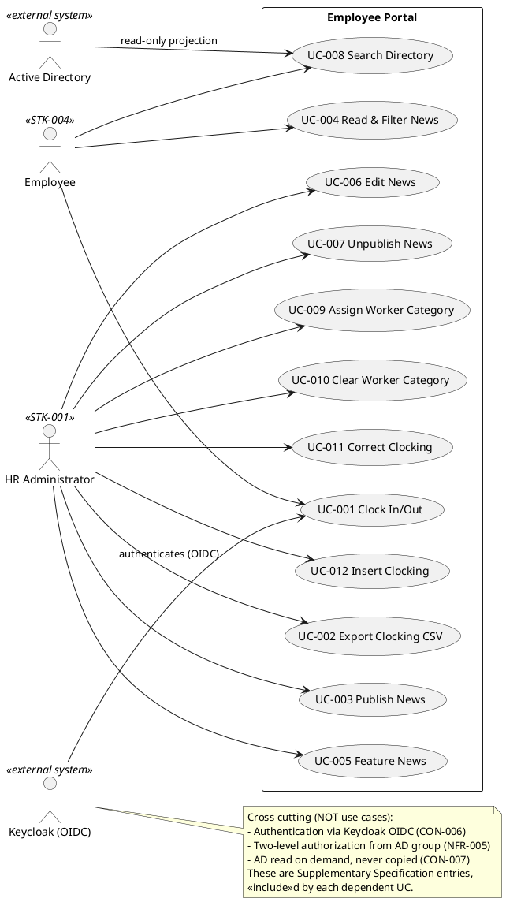

## Actors

| ID | Actor | Type | Description | Traces To |
|---|---|---|---|---|
| STK-004 | Employee | Human (primary) | Cuba Corp employee (200 people, 3 offices). Clocks in/out, reads/filters news, searches the directory. | FR-001, FR-004, FR-008 |
| STK-001 | HR Administrator | Human (primary) | HR staff (AD "HR" group). Publishes/edits/unpublishes/features news, manages worker categories, corrects/inserts clockings, exports CSV. | FR-002, FR-003, FR-005, FR-006, FR-007, FR-009, FR-010, FR-011, FR-012 |
| — | Keycloak (OIDC) | External system (supporting) | Identity provider. Authenticates every actor via OIDC; portal is a client only (CON-006). Not a use-case actor — a cross-cutting mechanism. | CON-006, NFR-005 |
| — | Active Directory | External system (supporting) | Source of employee identity and six read-only directory fields; source of group membership for two-level authorization. Read on demand, never copied (CON-007). Not a use-case actor — a cross-cutting mechanism. | CON-007, CON-010, NFR-005 |

**Actor coverage note:** No time-triggered actors (no scheduled jobs — backups are Infrastructure's, CON-013; no sync, CON-007). No hardware-device actors. No separate administrative actor beyond HR (Infrastructure operates the portal post-launch but has no in-app use cases — CON-011).

## Use-Case Survey
| UC | Name | Primary Actor | Priority (MoSCoW) | Volatility | Source |
|---|---|---|---|---|---|
| UC-001 | Clock In/Out | Employee | Must | Medium | FR-001 |
| UC-002 | Export Clocking CSV | HR Administrator | Must | Low | FR-002 |
| UC-003 | Publish News | HR Administrator | Must | Low | FR-003 |
| UC-004 | Read & Filter News | Employee | Must | Low | FR-004 |
| UC-005 | Feature News | HR Administrator | Must | Low | FR-005 |
| UC-006 | Edit News | HR Administrator | Must | Low | FR-006 |
| UC-007 | Unpublish News | HR Administrator | Must | Low | FR-007 |
| UC-008 | Search Directory | Employee | Must | Medium | FR-008 |
| UC-009 | Assign Worker Category | HR Administrator | Must | Low | FR-009 |
| UC-010 | Clear Worker Category | HR Administrator | Must | Low | FR-010 |
| UC-011 | Correct Clocking | HR Administrator | Must | Low | FR-011 |
| UC-012 | Insert Clocking | HR Administrator | Must | Low | FR-012 |

**Volatility rationale:** UC-001 (Medium) — clocking interaction may evolve with adoption feedback (R002) and the offline-retry window (AC-005). UC-008 (Medium) — directory field availability depends on AD attribute consistency across offices (R001). All others are stable business rules fixed by the closed-list category set (CON-016), the single-featured invariant (CON-015), and the immutable-record audit rules (CON-019, CON-020).

**Specification status (Elaboration Iter-1):** all 12 use cases are now fully specified — main flow, alternative flows, concrete scenarios, and activity diagrams. UC-001 and UC-008 were detailed in Inception (architecturally significant: UC-001 forces CON-021 client-timestamp + idempotency and AC-005 offline retry; UC-008 forces CON-007 AD on-demand projection and surfaces R001). UC-002…UC-007 and UC-009…UC-012 were detailed in Elaboration Iter-1 by the Requirements Specifier.
## Use-Case Specifications
### UC-001 — Clock In/Out (fully specified)

| Field | Value |
|---|---|
| Primary Actor | Employee (STK-004) |
| Trigger | Employee opens the portal main screen and presses the Clock In / Clock Out button |
| Precondition | Employee authenticated via Keycloak OIDC (CON-006); for "Clock In" no open clocking exists, for "Clock Out" one open clocking exists |
| Postcondition | A clocking record is persisted with the exact press time; confirmation shown; current-month history updated |
| Priority | Must | Volatility: Medium |

**Main flow:**
1. Employee opens the portal; system authenticates via Keycloak OIDC and determines current clocking status.
2. System shows the main screen with a single "Clock In" or "Clock Out" button reflecting current status.
3. Employee presses the button; the client records the press timestamp and sends it with an idempotency key (CON-021).
4. System validates the idempotency key, rejects duplicates, and persists the clocking with the client-supplied timestamp (stored UTC, CON-014).
5. System shows a confirmation and refreshes the current-month history.

**Alternative flows:**
- **A1 — Duplicate press (idempotency):** the idempotency key is already known → system returns the existing result without creating a second record (CON-021).
- **A2 — Network down (offline retry):** the POST fails → the clocking page keeps the press in localStorage and retries for up to 5 minutes; beyond 5 minutes the employee reports the clocking to HR (AC-005). Directory and news show a "no connection" message instead.
- **A3 — Not authenticated:** Keycloak redirects to login; flow resumes at step 1 after authentication.

**Concrete scenarios (discovery walk-through):**

| # | Scenario | Data | Outcome |
|---|---|---|---|
| S1 | First clock-in of the day | Employee "Ana Ruiz" (AD id `aruiz`), presses Clock In at 08:03:12 Europe/Madrid | Clocking persisted with press time 08:03:12 (stored UTC 06:03:12Z); button flips to "Clock Out"; history shows the entry |
| S2 | Clock-out after a shift | Same employee presses Clock Out at 17:15:44 | Clocking persisted; button flips to "Clock In"; day's pair complete |
| S3 | Double-click on the button | Employee double-clicks Clock In; two POSTs carry the same idempotency key | First POST persists; second returns the existing result — exactly one record (CON-021) |
| S4 | Network blip during press | POST fails at 09:00; network returns at 09:02 | Press held in localStorage, retried, persisted at 09:02 with the original 09:00 press timestamp; no data loss (AC-005) |
| S5 | Network down > 5 min | POST fails at 09:00; network returns at 09:07 | Retry window expired; employee reports the clocking to HR (UC-011/UC-012 path) |

**Business rules:** CON-014 (UTC storage, Europe/Madrid display), CON-021 (client timestamp + idempotency key), AC-005 (offline retry window).

**Activity diagram:**

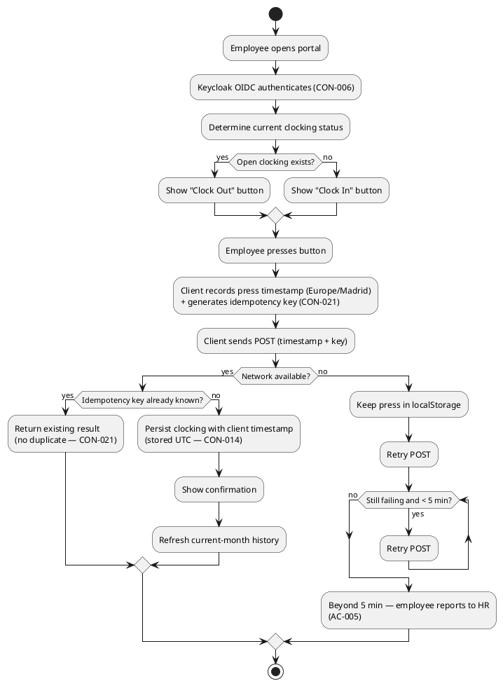

### UC-008 — Search Directory (fully specified)

| Field | Value |
|---|---|
| Primary Actor | Employee (STK-004) |
| Trigger | Employee opens the directory and enters a search term (name, department, or office) |
| Precondition | Employee authenticated via Keycloak OIDC |
| Postcondition | Matching colleagues are listed with name, job title, department, office, email, extension, and worker category |
| Priority | Must | Volatility: Medium |

**Main flow:**
1. Employee opens the directory and enters a search term (name, department, or office).
2. System reads the six employee fields from AD on demand (never copied — CON-007) and the worker category from the portal's `AD user id → worker category` mapping.
3. System lists matching entries: name, job title, department, office, email, extension phone number, worker category.
4. Employee views the result. No private personal information is shown (FR-008).

**Alternative flows:**
- **A1 — No match:** system shows an empty result with a clear message.
- **A2 — AD attribute gap:** a field (e.g., job title or extension) is empty in AD → the field renders blank; the entry still appears (R001 — to be validated early).

**Concrete scenarios (discovery walk-through):**

| # | Scenario | Data | Outcome |
|---|---|---|---|
| S1 | Search by name | Employee searches "Ruiz" | Ana Ruiz listed with all seven fields populated |
| S2 | Search by department | Employee searches "HR" | All HR members listed |
| S3 | Search by office | Employee searches "Madrid" | All Madrid-office employees listed |
| S4 | AD attribute gap | Employee "Carlos Vega" has no extension in AD (R001) | Entry appears with extension blank; other six fields populated |
| S5 | No match | Employee searches "Zzz" | Empty result with clear "no match" message |

**Business rules:** CON-007 (AD read on demand, no copy), CON-017 (worker category descriptive only), FR-008 (six AD fields + category; no private info).

**Activity diagram:**

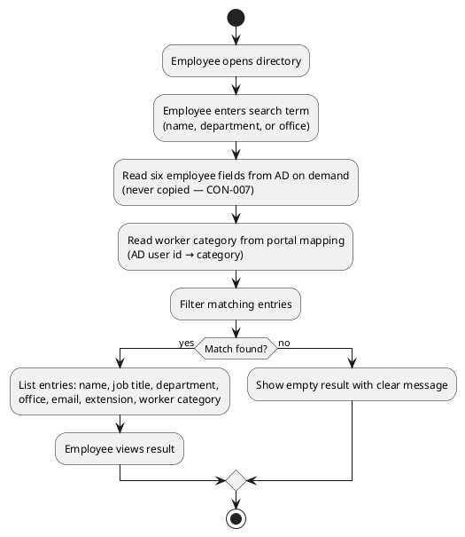

### UC-002 — Export Clocking CSV (fully specified)

| Field | Value |
|---|---|
| Primary Actor | HR Administrator (STK-001) |
| Trigger | HR opens the export screen and selects a calendar month |
| Precondition | HR authenticated via Keycloak OIDC and authorized via AD "HR" group (NFR-005) |
| Postcondition | A CSV file is generated/downloaded covering the selected month with the exact column order |
| Priority | Must | Volatility: Low |

**Main flow:**
1. HR opens the export screen and selects a calendar month.
2. System computes the month window: 00:00 first day to 23:59:59 last day, Europe/Madrid (FR-002).
3. System retrieves all clockings in the window and joins the worker category from the `AD user id → category` mapping.
4. System computes HoursWorked and the Corrected flag per row.
5. System generates the CSV with columns in exact order: EmployeeId, FullName, WorkerCategory, Date, ClockIn, ClockOut, HoursWorked, Corrected. Timestamps written in Europe/Madrid local time (CON-014).
6. HR downloads the CSV.

**Alternative flows:**
- **A1 — No clockings in month:** system generates a CSV with the header row only.
- **A2 — Worker with no category:** the WorkerCategory column is blank for that row (CON-018); the employee still appears.

**Concrete scenarios (discovery walk-through):**

| # | Scenario | Data | Outcome |
|---|---|---|---|
| S1 | Monthly export | HR selects September 2026 | CSV covers 2026-09-01 00:00 → 2026-09-30 23:59:59 Europe/Madrid; all clockings included |
| S2 | Corrected clocking | A clocking was corrected via UC-011 | Corrected flag = true; HoursWorked reflects corrected value |
| S3 | Worker without category | Employee "Carlos Vega" has no category | Row present with WorkerCategory blank (CON-018) |
| S4 | Empty month | HR selects a month with no clockings | CSV with header row only |

**Business rules:** FR-002 (exact column order + month window), CON-014 (Europe/Madrid timestamps), CON-018 (blank category allowed), NFR-004 (Corrected flag reflects audited correction).

**Activity diagram:**

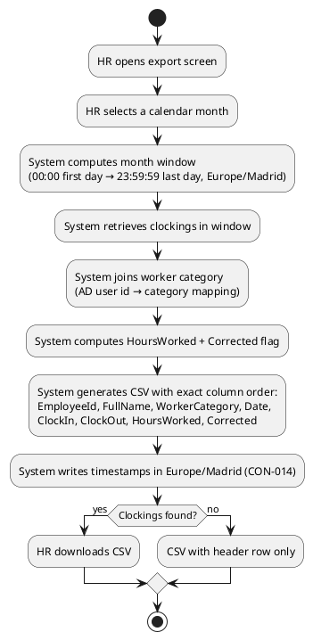

### UC-003 — Publish News (fully specified)

| Field | Value |
|---|---|
| Primary Actor | HR Administrator (STK-001) |
| Trigger | HR opens "Publish News" and enters the item details |
| Precondition | HR authenticated and authorized via AD "HR" group (NFR-005) |
| Postcondition | A news item is persisted with author + timestamp (audit); visible to employees |
| Priority | Must | Volatility: Low |

**Main flow:**
1. HR opens "Publish News" and enters title, body, date, and category.
2. HR optionally marks the item featured; if so, the system un-features the previously featured item (CON-015).
3. System validates required fields.
4. System persists the item with author + timestamp (audit — NFR-004).
5. System shows confirmation; the item appears in the news list.

**Alternative flows:**
- **A1 — Validation error:** a required field is missing → system shows the error; HR corrects and resubmits.
- **A2 — Feature conflict:** HR marks featured while another item is featured → the previous item is un-featured automatically (CON-015 invariant).

**Concrete scenarios (discovery walk-through):**

| # | Scenario | Data | Outcome |
|---|---|---|---|
| S1 | Plain publication | HR publishes "Office closure Friday" (category General) | Item persisted with author + timestamp; appears newest-first |
| S2 | Featured publication | HR publishes "New HR policy" and marks featured | Previous featured item un-featured; new item carries the banner |
| S3 | Missing body | HR submits with empty body | Validation error; item not persisted |

**Business rules:** FR-003 (title, body, date, category; audited), CON-015 (single-featured invariant), NFR-004 (audit author + timestamp).

**Activity diagram:**

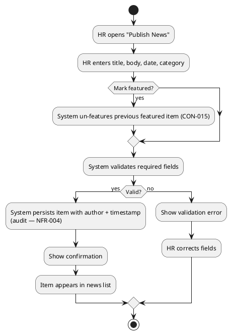

### UC-004 — Read & Filter News (fully specified)

| Field | Value |
|---|---|
| Primary Actor | Employee (STK-004) |
| Trigger | Employee opens the main page |
| Precondition | Employee authenticated via Keycloak OIDC |
| Postcondition | Published news listed newest-first; featured item with banner at top; optional category filter applied |
| Priority | Must | Volatility: Low |

**Main flow:**
1. Employee opens the main page.
2. System loads published news sorted by date (newest first).
3. If a featured item exists, it appears with a banner at the top.
4. Employee optionally filters by category (General, HR, IT, Events).
5. Employee reads news — read-only, no comments or reactions (FR-004).

**Alternative flows:**
- **A1 — No featured item:** no banner is shown (CON-015 allows zero featured).
- **A2 — Filter applied:** only items of the selected category are listed.
- **A3 — No connection:** directory and news show a "no connection" message (AC-005).

**Concrete scenarios (discovery walk-through):**

| # | Scenario | Data | Outcome |
|---|---|---|---|
| S1 | Default view | Employee opens main page | News newest-first; featured item with banner at top |
| S2 | Filter by category | Employee filters "IT" | Only IT-category items listed |
| S3 | No featured item | HR un-featured the only featured item | No banner shown |

**Business rules:** FR-004 (newest-first, category filter, featured banner, read-only), CON-015 (featured invariant), AC-005 (no-connection message).

**Activity diagram:**

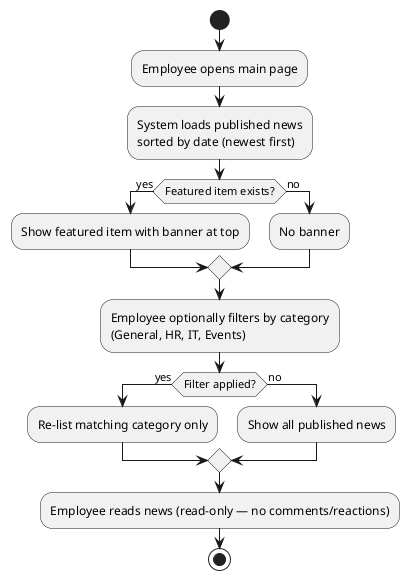

### UC-005 — Feature News (fully specified)

| Field | Value |
|---|---|
| Primary Actor | HR Administrator (STK-001) |
| Trigger | HR selects a news item and chooses to feature or un-feature it |
| Precondition | HR authenticated and authorized via AD "HR" group (NFR-005) |
| Postcondition | At most one item featured; banner reflects the change |
| Priority | Must | Volatility: Low |

**Main flow:**
1. HR selects a news item.
2. HR chooses "Feature" or "Un-feature".
3. If featuring and another item is currently featured, the system un-features it (CON-015).
4. System marks the selected item featured (or removes the flag).
5. System shows confirmation; the banner updates.

**Alternative flows:**
- **A1 — Un-feature leaving none:** HR un-features the only featured item → no banner (CON-015 allows zero).
- **A2 — Unpublish the featured item:** unpublishing (UC-007) un-features it too (FR-005).

**Concrete scenarios (discovery walk-through):**

| # | Scenario | Data | Outcome |
|---|---|---|---|
| S1 | Feature a second item | Item A featured; HR features item B | A un-featured; B featured; banner shows B |
| S2 | Un-feature all | Only item B featured; HR un-features B | No featured item; banner disappears |
| S3 | Feature while none featured | No featured item; HR features item C | C featured; banner shows C |

**Business rules:** FR-005 (manual only, at most one, un-feature leaves none), CON-015 (invariant).

**Activity diagram:**

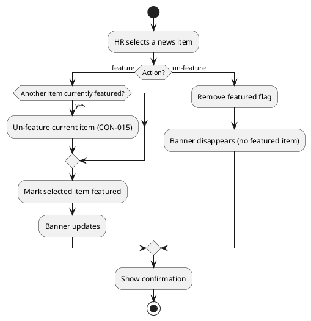

### UC-006 — Edit News (fully specified)

| Field | Value |
|---|---|
| Primary Actor | HR Administrator (STK-001) |
| Trigger | HR opens a published item for editing |
| Precondition | HR authenticated and authorized via AD "HR" group (NFR-005); item is published |
| Postcondition | Item updated; edit audited with author + timestamp |
| Priority | Must | Volatility: Low |

**Main flow:**
1. HR opens a published item for editing.
2. HR modifies title, body, date, or category.
3. System validates the fields.
4. System persists the edit with author + timestamp (audit — NFR-004).
5. System shows confirmation.

**Alternative flows:**
- **A1 — Validation error:** invalid field → system shows error; HR corrects and resubmits.
- **A2 — Typo fix:** a typo is corrected without republishing — the item stays published (FR-006).

**Concrete scenarios (discovery walk-through):**

| # | Scenario | Data | Outcome |
|---|---|---|---|
| S1 | Typo fix | HR fixes "Offcie" → "Office" in a published item | Item updated in place; still published; edit audited |
| S2 | Category change | HR moves an item from General to HR | Item re-categorized; edit audited |

**Business rules:** FR-006 (edit without republish; audited like publication), NFR-004 (audit author + timestamp).

**Activity diagram:**

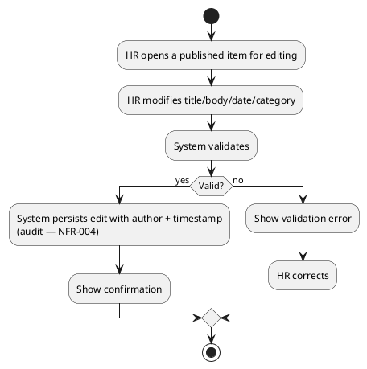

### UC-007 — Unpublish News (fully specified)

| Field | Value |
|---|---|
| Primary Actor | HR Administrator (STK-001) |
| Trigger | HR selects a published item and chooses "Unpublish" |
| Precondition | HR authenticated and authorized via AD "HR" group (NFR-005); item is published |
| Postcondition | Item hidden from employees; record retained (never deleted) |
| Priority | Must | Volatility: Low |

**Main flow:**
1. HR selects a published news item.
2. HR chooses "Unpublish".
3. System hides the item from employee view; the record is retained (CON-020).
4. If the item was featured, the system un-features it (CON-015).
5. System shows confirmation.

**Alternative flows:**
- **A1 — Unpublish featured item:** the featured item is un-featured as part of unpublishing (FR-005).

**Concrete scenarios (discovery walk-through):**

| # | Scenario | Data | Outcome |
|---|---|---|---|
| S1 | Unpublish a normal item | HR unpublishes "Office closure Friday" | Item hidden; record retained for audit |
| S2 | Unpublish the featured item | HR unpublishes the featured item | Item hidden AND un-featured; banner disappears |

**Business rules:** FR-007 (hide, never delete; no archive screen), CON-020 (never hard-delete), CON-015 (unpublish un-features).

**Activity diagram:**

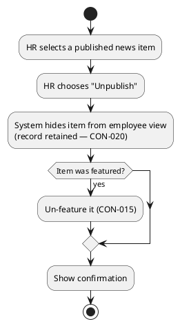

### UC-009 — Assign Worker Category (fully specified)

| Field | Value |
|---|---|
| Primary Actor | HR Administrator (STK-001) |
| Trigger | HR opens the directory, selects a worker, and assigns a category |
| Precondition | HR authenticated and authorized via AD "HR" group (NFR-005) |
| Postcondition | Worker has exactly one category; assignment audited; reflected in directory + CSV export |
| Priority | Must | Volatility: Low |

**Main flow:**
1. HR opens the directory and selects a worker.
2. System shows the four closed-list categories (Full-time, Part-time, Contractor, Intern — CON-016).
3. HR selects one category.
4. System persists the `AD user id → category` mapping with author + timestamp (audit — NFR-004).
5. System shows confirmation; the directory and CSV export reflect the category.

**Alternative flows:**
- **A1 — Reassign:** assigning a new category replaces the existing one (at most one per worker — CON-018).

**Concrete scenarios (discovery walk-through):**

| # | Scenario | Data | Outcome |
|---|---|---|---|
| S1 | First assignment | HR assigns "Full-time" to Ana Ruiz | Mapping persisted; directory + CSV show Full-time |
| S2 | Reassign | Ana Ruiz currently "Contractor"; HR assigns "Full-time" | Category replaced; audit records the change |

**Business rules:** FR-009 (closed list, audited, at most one), CON-016 (four values), CON-018 (at most one), NFR-004 (audit).

**Activity diagram:**

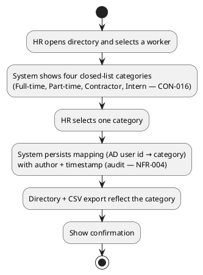

### UC-010 — Clear Worker Category (fully specified)

| Field | Value |
|---|---|
| Primary Actor | HR Administrator (STK-001) |
| Trigger | HR opens the directory, selects a worker with a category, and clears it |
| Precondition | HR authenticated and authorized via AD "HR" group (NFR-005); worker has a category |
| Postcondition | Worker's category field is empty; clearing audited; worker still appears in directory + export |
| Priority | Must | Volatility: Low |

**Main flow:**
1. HR opens the directory and selects a worker with an assigned category.
2. HR chooses "Clear category".
3. System removes the mapping (audit — NFR-004).
4. System shows confirmation; the worker still appears in directory and export with the category field blank (CON-018).

**Alternative flows:**
- **A1 — No category to clear:** the worker has no category → the clear action is not offered.

**Concrete scenarios (discovery walk-through):**

| # | Scenario | Data | Outcome |
|---|---|---|---|
| S1 | Clear a category | Ana Ruiz is "Full-time"; HR clears it | Mapping removed; directory + CSV show blank category; audit recorded |

**Business rules:** FR-010 (clear, audited, still appears), CON-018 (blank allowed, no default), NFR-004 (audit).

**Activity diagram:**

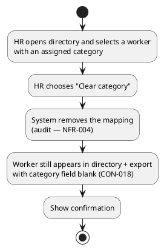

### UC-011 — Correct Clocking (fully specified)

| Field | Value |
|---|---|
| Primary Actor | HR Administrator (STK-001) |
| Trigger | HR opens a worker's clocking history and selects an erroneous clocking |
| Precondition | HR authenticated and authorized via AD "HR" group (NFR-005) |
| Postcondition | Corrected value applied; original preserved; correction audited (who, when, previous value, reason) |
| Priority | Must | Volatility: Low |

**Main flow:**
1. HR opens a worker's clocking history and selects an erroneous clocking.
2. HR enters the corrected time and a free-text reason.
3. System records the correction: who, when, previous value, reason (NFR-004).
4. System preserves the original record — never overwritten in place, never deleted (CON-019).
5. System applies the corrected value to display and export.
6. System shows confirmation.

**Alternative flows:**
- **A1 — Missing reason:** the free-text reason is required → system shows an error; HR provides it.

**Concrete scenarios (discovery walk-through):**

| # | Scenario | Data | Outcome |
|---|---|---|---|
| S1 | Correct a clock-out | Ana Ruiz clocked out 17:15 but actually 17:45; HR corrects with reason "forgot to clock out" | Corrected value 17:45 applied; original 17:15 preserved; audit records who/when/previous/reason |

**Business rules:** FR-011 (HR only, audited, original preserved), CON-019 (never overwrite/delete), NFR-004 (audit with previous value + reason).

**Activity diagram:**

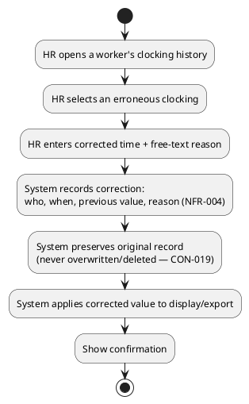

### UC-012 — Insert Clocking (fully specified)

| Field | Value |
|---|---|
| Primary Actor | HR Administrator (STK-001) |
| Trigger | HR opens a worker's clocking history and chooses "Insert clocking" |
| Precondition | HR authenticated and authorized via AD "HR" group (NFR-005) |
| Postcondition | A missing clocking is added; insertion audited (who, when, reason); existing records preserved |
| Priority | Must | Volatility: Low |

**Main flow:**
1. HR opens a worker's clocking history and chooses "Insert clocking".
2. HR enters the missing clock time and a free-text reason.
3. System records the insertion: who, when, reason (NFR-004).
4. System preserves existing records — never overwritten in place, never deleted (CON-019).
5. System adds the completed record.
6. System shows confirmation.

**Alternative flows:**
- **A1 — Missing reason:** the free-text reason is required → system shows an error; HR provides it.

**Concrete scenarios (discovery walk-through):**

| # | Scenario | Data | Outcome |
|---|---|---|---|
| S1 | Insert a forgotten clock-out | Ana Ruiz clocked in 08:00 but forgot to clock out; HR inserts 17:30 with reason "forgotten clock-out" | Record added; day's pair complete; audit records who/when/reason |

**Business rules:** FR-012 (HR only, audited, original preserved), CON-019 (never overwrite/delete), NFR-004 (audit with reason).

**Activity diagram:**

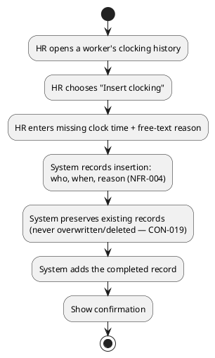

## Traceability

| Element | Traces From | Link Type | Traces To |
|---|---|---|---|
| UC-001 | FR-001 | Derives | (Elaboration: Use-Case Realization) |
| UC-002 | FR-002 | Derives | (Elaboration: Use-Case Realization) |
| UC-003 | FR-003 | Derives | (Elaboration: Use-Case Realization) |
| UC-004 | FR-004 | Derives | (Elaboration: Use-Case Realization) |
| UC-005 | FR-005 | Derives | (Elaboration: Use-Case Realization) |
| UC-006 | FR-006 | Derives | (Elaboration: Use-Case Realization) |
| UC-007 | FR-007 | Derives | (Elaboration: Use-Case Realization) |
| UC-008 | FR-008 | Derives | (Elaboration: Use-Case Realization) |
| UC-009 | FR-009 | Derives | (Elaboration: Use-Case Realization) |
| UC-010 | FR-010 | Derives | (Elaboration: Use-Case Realization) |
| UC-011 | FR-011 | Derives | (Elaboration: Use-Case Realization) |
| UC-012 | FR-012 | Derives | (Elaboration: Use-Case Realization) |
| NFR-001…NFR-005 | Declared input | — | Supplementary Specification |
