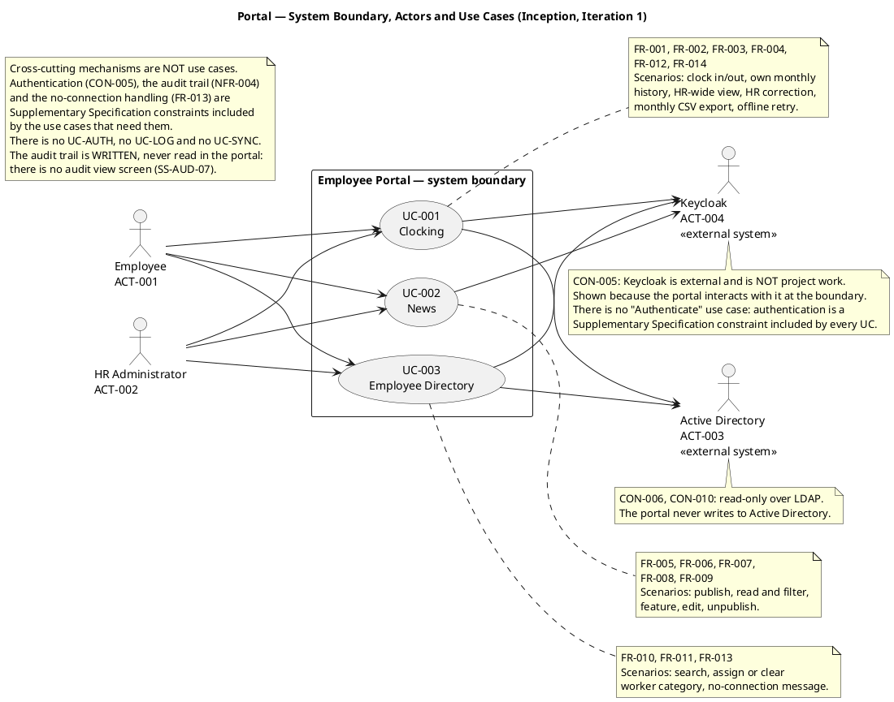
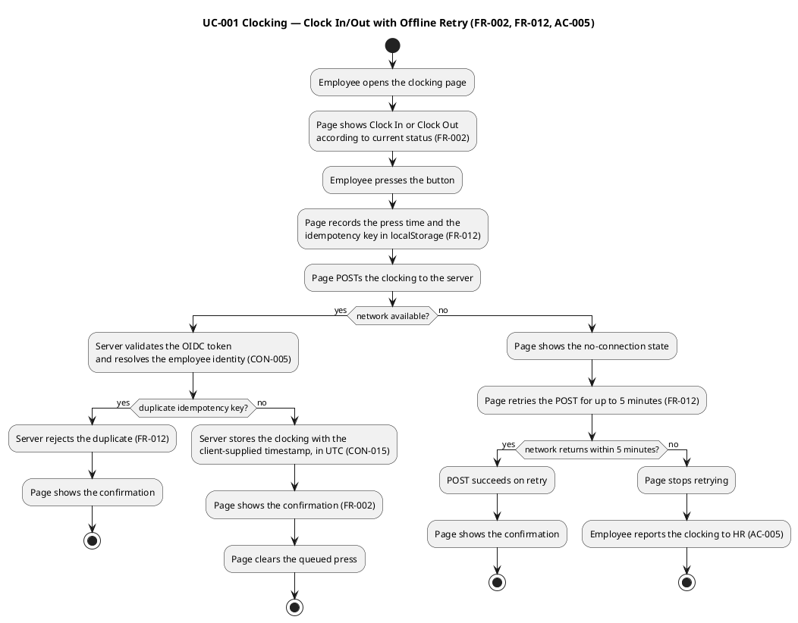
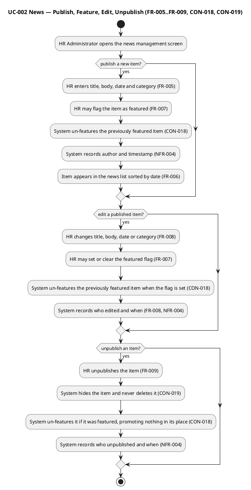
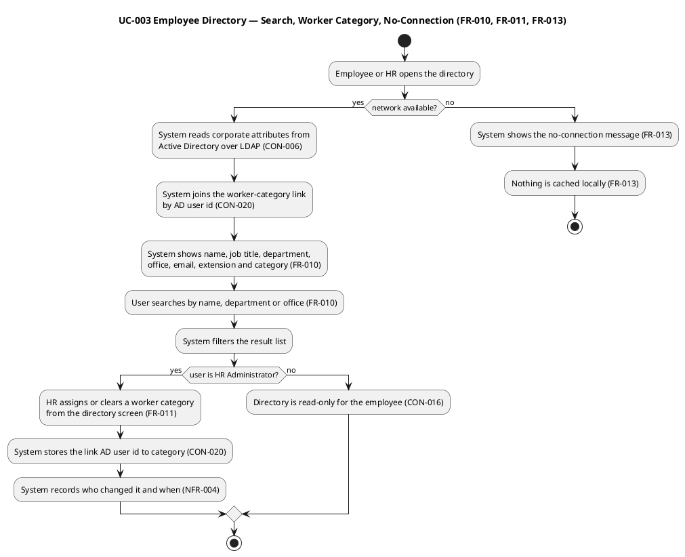

## Document Control

| Field | Value |
|---|---|
| Artifact | Use-Case Model — Portal (Employee Portal, Cuba Corp) |
| Phase | Inception |
| Status | Draft — produced for review; milestone NOT YET ACHIEVED |
| Milestone Target | End-of-Inception (not marked complete by this artifact) |
| Iteration / Cycle | 1 / 1 |
| Owner | SystemAnalyst |
| Date | 2026-09-17 |
| Detail level | Inception — all 3 use cases identified; UC-001 and UC-003 detailed (the architecturally significant ones). UC-002 surveyed with its scenarios; RequirementsSpecifier details per-UC flows in Elaboration. |
| Governing process | Development Case (Inception) — Business Modeling INACTIVE, so no BUC → UC derivation applies |
| Evolution this iteration | Actors section corrected: the audit trail is **written, never read in the portal** (SS-AUD-07, stakeholder decision 2026-09-17). The prior statement that HR reads the audit through the scenarios of UC-001/UC-002 is retired. No use case gained an audit-reading scenario. |

## Use-Case Diagram

**Why exactly three use cases.** The declared scope names three use cases — `UC01`, `UC02`, `UC03` — in the `Source:` field of the fourteen functional requirements. This model defines exactly those three and no more. Two scope guards were applied deliberately:

- **No per-actor split.** UC-001, UC-002 and UC-003 each have *two* primary actors (Employee and HR Administrator) interacting with the *same* declared process. That is ONE use case with multiple scenarios, never one use case per actor. There is no "HR views clockings" use case separate from "Employee clocks in" — both are scenarios of UC-001.
- **No cross-cutting mechanism promoted to a use case.** Authentication (CON-005), the AD/LDAP read (CON-006), the audit trail (NFR-004) and the no-connection handling (FR-013) are cross-cutting. Authentication and the audit trail are Supplementary Specification constraints included by every use case; the AD/LDAP read and the no-connection message are *scenarios* of the use cases that need them, not use cases of their own. There is deliberately no `UC-AUTH`, no `UC-SYNC` and no `UC-LOG`.

## Actors

| ID | Actor | Type | Primary for | Goal | Basis |
|---|---|---|---|---|---|
| ACT-001 | Employee | Human, primary | UC-001, UC-002, UC-003 | Clock in and out and see own monthly history; read and filter news; find a colleague's contact data | STK-004 |
| ACT-002 | HR Administrator | Human, primary | UC-001, UC-002, UC-003 | Monitor and correct attendance and export the monthly report; publish, feature, edit and unpublish news; manage the worker category | STK-001, CON-016 |
| ACT-003 | Active Directory | External system, supporting | UC-001, UC-003 | Supply corporate employee attributes over LDAP, read-only | CON-006, CON-010 |
| ACT-004 | Keycloak | External system, supporting | UC-001, UC-002, UC-003 | Authenticate the user and supply the role claims the portal reads | CON-005 |

**Actor types checked and found absent — deliberately.**

| Actor type | Verdict | Basis |
|---|---|---|
| Time-based trigger (batch job, scheduled report) | **Absent** | No scheduled or batch process is declared. FR-014's monthly CSV export is an on-demand HR action, not a scheduled job. Inventing a scheduler would be scope creep. |
| Hardware device | **Absent** | Biometric clocking is explicitly excluded from the declared scope; clocking is AD username/password only. |
| Administrative actor (sysadmin, auditor) | **Absent as a portal actor** | STK-003 operates the portal in production — deployment, monitoring, patching (CON-011). That is operational activity *on* the system, not a goal *served by* the system, so it produces no use case. **There is no auditor actor either:** the audit trail is *written*, not read in the portal — there is no in-portal audit view screen (SS-AUD-07, stakeholder decision 2026-09-17). The audit is recorded for compliance and read directly from the database by whoever needs it, which is activity outside the system boundary and therefore produces no use case and no actor. |
| Negative actor | **Absent** | No actor is declared as hostile or adversarial. CON-008 (no access from outside the corporate network) is an environmental constraint, not an actor. |

**Authorization is not an actor.** CON-016 derives two levels from AD group membership. The HR Administrator is a *role an Employee holds*, not a separate person type — which is why ACT-002 appears as a distinct actor for goal-clarity while the underlying identity is the same corporate account. The worker category does **not** drive access control (CON-021), so it never appears in an actor definition.

**The audit trail produces no actor and no use case.** NFR-004 mandates that the audit be *written* — who published, edited and unpublished each news item; who changed a worker's category; and who corrected or inserted a clocking, with the previous value and a reason. The declared scope does not say how it is *read*, and on being asked whether the portal needs an in-portal audit view screen for HR or whether the audit is recorded for compliance and read directly from the database, the stakeholder answered **No** (2026-09-17). The consequence for this model is explicit: no use case gains an audit-reading scenario, no screen is added, and no auditor actor exists. The audit remains a cross-cutting constraint (SS-AUD-01..SS-AUD-07) included by UC-001, UC-002 and UC-003 — never a use case, and never a screen.

## Use-Case Survey

| UC | Name | Primary actors | Source | Priority | Volatility | Architecturally significant |
|---|---|---|---|---|---|---|
| UC-001 | Clocking | ACT-001 Employee, ACT-002 HR Administrator | FR-001, FR-002, FR-003, FR-004, FR-012, FR-014 | Must | **High** | **Yes** — the only client-side mechanism in the product; client-supplied timestamp, idempotency key and a 5-minute retry window cross the boundary (FR-012) |
| UC-002 | News | ACT-001 Employee, ACT-002 HR Administrator | FR-005, FR-006, FR-007, FR-008, FR-009 | Must | Medium | Partly — CON-018's "at most one featured" is a declared **system invariant**, not a screen convention, so it must hold wherever the change comes from |
| UC-003 | Employee Directory | ACT-001 Employee, ACT-002 HR Administrator | FR-010, FR-011, FR-013 | Must | Medium | **Yes** — the AD/LDAP boundary carries R001 (exposure 9), the project's dominant technical risk, and the portal holds no local copy of the employee (CON-020), so a gap in AD is a gap in the directory with no fallback |

**ATM test — applied to each use case.**

| UC | (a) Primary actor who initiates | (b) Clear trigger | (c) Measurable outcome delivering observable value |
|---|---|---|---|
| UC-001 | ACT-001 Employee (clock in/out, own history); ACT-002 HR Administrator (all clockings, correction, export) | The employee arrives at or leaves work; or HR needs the attendance record | A clocking exists with the exact press time and is visible to its owner; HR sees all clockings and holds a CSV for the month. AC-001, AC-004, AC-005 |
| UC-002 | ACT-002 HR Administrator (publish, feature, edit, unpublish); ACT-001 Employee (read) | HR has an announcement; or an employee wants to know what is happening | The item is readable by employees, filterable by category, and the banner shows the one featured item. AC-002 |
| UC-003 | ACT-001 Employee (search); ACT-002 HR Administrator (search, assign/clear category) | Someone needs a colleague's contact data; or HR needs to set a worker category | The colleague's phone and email are on screen; the category is set or cleared and audited. AC-003 |

All three pass: each has a named initiating actor, a trigger event, and an outcome observable by that actor. None of the three is a function in disguise — "Clock In and Clock Out" is a goal, not a step; there is no "Validate Input" or "Save Record" use case.

**MoSCoW.** All three are **Must**. The declared scope is a closed set of fourteen functional requirements with no optional member, so no use case is downgraded. Sequencing, not priority, distinguishes them: UC-001 and UC-003 are detailed first because they carry the architectural risk.

## Use-Case Specifications

### UC-001 — Clocking

| Field | Value |
|---|---|
| **Primary actors** | ACT-001 Employee; ACT-002 HR Administrator |
| **Supporting actors** | ACT-004 Keycloak (authentication, role claims); ACT-003 Active Directory (employee identity resolution) |
| **Source** | FR-001, FR-002, FR-003, FR-004, FR-012, FR-014 |
| **Priority / Volatility** | Must / **High** |
| **Preconditions** | The user is authenticated via Keycloak OIDC (CON-005) and is on the corporate network (CON-008). For the HR scenarios, the user is a member of the HR AD group (CON-016). |
| **Trigger** | The employee arrives at or leaves work and presses the clocking button; or HR opens the attendance view, corrects a clocking, or requests the monthly export. |
| **Postconditions** | A clocking record exists carrying the time the employee pressed the button, stored in UTC (CON-015). For a correction, the original record is unchanged and an additive audited correction exists (CON-017). For the export, a CSV exists with the exact declared columns. |
| **Main flow** | 1. The employee opens the clocking page. 2. The page shows Clock In or Clock Out according to the current status (FR-002). 3. The employee presses the button. 4. The page records the press time and an idempotency key in localStorage (FR-012). 5. The page POSTs the clocking. 6. The server validates the token and resolves the employee identity. 7. The server stores the clocking with the client-supplied timestamp, in UTC. 8. The page shows the confirmation and clears the queued press. |
| **Alternative flows** | **A1 — Duplicate press (FR-012).** The idempotency key is already recorded; the server rejects the duplicate and the page shows the confirmation without creating a second record. **A2 — Network lost at press (FR-012, AC-005).** The page shows the no-connection state and retries the POST for up to 5 minutes; on success the flow rejoins step 8. **A3 — Network lost beyond 5 minutes (AC-005).** The page stops retrying and the employee reports the clocking to HR, who inserts it under A4. **A4 — HR corrects or inserts a clocking (FR-004, CON-017).** HR supplies the corrected value and a free-text reason; the system records who, when, the previous value and the reason; the original record is never overwritten in place and never deleted. **A5 — HR views all clockings (FR-001).** HR opens the attendance view and sees the clockings of all employees. **A6 — HR exports the month (FR-014).** HR selects one calendar month; the system produces a CSV covering 00:00 on the first day to 23:59:59 on the last day, Europe/Madrid, with exactly the columns EmployeeId, FullName, WorkerCategory, Date, ClockIn, ClockOut, HoursWorked, Corrected, timestamps in Europe/Madrid local time. **A7 — Employee views own history (FR-003).** The employee opens their own clocking history for the current month. |
| **Exception flows** | **E1 — Token invalid or expired.** The user is redirected to Keycloak to authenticate; no clocking is recorded. **E2 — Employee identity not resolvable.** The clocking is refused with an error; nothing is written. |
| **Business rules** | CON-015 (store UTC, display Europe/Madrid; one timezone, no normalisation), CON-017 (only HR corrects; additive, audited, never overwritten or deleted), CON-021 (the worker category appears in the CSV as a column and nowhere else in this use case), CON-022 (a worker with no category appears in the export with that field blank — no invented default). |
| **Non-functional** | NFR-002 (clocking responds in under 1 s), NFR-003 (available Mon–Fri 07:00–19:00), NFR-004 (audit of every correction: who, when, previous value, reason — **written only**; there is no audit view screen, SS-AUD-07). |

**Concrete scenarios walked (discovery).** Three concrete walks were used to expose gaps, and each exposed one:

1. *Ana clocks in at 08:02 from Office 1, network fine.* Exposes nothing new — the happy path. Confirms the page must know the current status to choose the button label (FR-002), which means the status is read on page load, not only on press.
2. *Luis presses Clock Out at 18:30 in the lift, network drops, returns at 18:33.* Exposes the **client-timestamp rule**: the record must carry 18:30, not 18:33 (FR-012). It also exposes that the confirmation shown at 18:33 must not imply a second clocking — hence the idempotency key, and hence A1.
3. *Marta forgets to clock out on Friday; on Monday HR inserts the missing clocking.* Exposes that an *insert* is a correction too, not only an edit — CON-017 covers both, and the audit must record a previous value of "none" for an insert. It also exposes that the CSV's `Corrected` column must distinguish a corrected row from an untouched one (FR-014).

### UC-002 — News

| Field | Value |
|---|---|
| **Primary actors** | ACT-002 HR Administrator (publish, feature, edit, unpublish); ACT-001 Employee (read) |
| **Supporting actors** | ACT-004 Keycloak (authentication, role claims) |
| **Source** | FR-005, FR-006, FR-007, FR-008, FR-009 |
| **Priority / Volatility** | Must / Medium |
| **Preconditions** | The user is authenticated (CON-005). For the HR scenarios, the user is a member of the HR AD group (CON-016). |
| **Trigger** | HR has an announcement to publish or manage; or an employee opens the main page to read the news. |
| **Postconditions** | The item is readable by employees, or hidden if unpublished, and never deleted (CON-019). At most one item is featured (CON-018). Every publish, edit and unpublish carries author and timestamp (NFR-004). |
| **Main flow** | 1. HR opens the news management screen. 2. HR enters title, body, date and category (FR-005). 3. HR may flag the item as featured (FR-007). 4. The system un-features the previously featured item (CON-018). 5. The system records author and timestamp (NFR-004). 6. The item appears in the news list sorted by date (FR-006). |
| **Alternative flows** | **A1 — Edit a published item (FR-008).** HR changes title, body, date or category; the system records who edited and when; a typo does not force a republish. **A2 — Feature an existing item (FR-007).** HR sets the flag on an already-published item; the previously featured item is un-featured. **A3 — Un-feature and leave none (FR-007).** HR clears the flag; the banner simply does not appear. **A4 — Unpublish (FR-009, CON-019).** The item is hidden and never deleted; if it was the featured one it is un-featured and **no other item is promoted in its place** (CON-018). **A5 — Employee reads and filters (FR-006).** The employee sees news on the main page sorted by date, filters by category (General, HR, IT, Events), and sees the featured item in the banner at the top; read-only, no comments or reactions. **A6 — No connection (FR-013).** The news shows a no-connection message; nothing is cached locally. |
| **Exception flows** | **E1 — Token invalid or expired.** Redirect to Keycloak; no change is made. **E2 — Non-HR user attempts a management action.** Refused; the employee has read access only (CON-016). |
| **Business rules** | CON-016 (only the HR AD group publishes, edits and unpublishes), CON-018 (featuring is a manual flag, never automatic; at most one featured — a **system invariant** that must hold wherever the change comes from, not only in the form HR happens to use; unpublishing the featured item promotes nothing), CON-019 (never hard-deleted). |
| **Non-functional** | NFR-001 (page load under 3 s), NFR-004 (author + timestamp on every publish, edit and unpublish — **written only**; there is no audit view screen, SS-AUD-07). |

**Concrete scenarios walked (discovery).**

1. *HR publishes a General item and features it.* Exposes that featuring at publish time and featuring at edit time are the *same* invariant reached by two routes — which is exactly why CON-018 insists the rule is a system invariant and not a screen convention.
2. *HR edits the featured item's body to fix a typo.* Exposes that an edit must **not** silently clear the featured flag: the flag is a separate concern from the content, and A1 must preserve it unless HR changes it.
3. *HR unpublishes the featured item.* Exposes the sharpest edge in this use case: the banner must go empty, and **no other item may be promoted in its place**. A naive "show the most recent published item" implementation would violate CON-018 here — which is precisely the rule the declared scope forbids ("no 'most recent', no 'most read', no expiry date on the banner").

### UC-003 — Employee Directory

| Field | Value |
|---|---|
| **Primary actors** | ACT-001 Employee (search); ACT-002 HR Administrator (search, assign or clear worker category) |
| **Supporting actors** | ACT-003 Active Directory (corporate attributes over LDAP, read-only); ACT-004 Keycloak (authentication, role claims) |
| **Source** | FR-010, FR-011, FR-013 |
| **Priority / Volatility** | Must / Medium |
| **Preconditions** | The user is authenticated (CON-005) and on the corporate network (CON-008). Active Directory is reachable over LDAP (CON-006). For the category scenario, the user is a member of the HR AD group (CON-016). |
| **Trigger** | Someone needs a colleague's contact data; or HR needs to set or clear a worker category. |
| **Postconditions** | The colleague's corporate attributes are on screen. For the category scenario, the link AD user id → category is set or cleared and audited (NFR-004). No employee field is edited anywhere (CON-006, CON-010). |
| **Main flow** | 1. The user opens the directory. 2. The system reads corporate attributes from Active Directory over LDAP (CON-006). 3. The system joins the worker-category link by AD user id (CON-020). 4. The system shows name, job title, department, office, email, extension and worker category (FR-010). 5. The user searches by name, department or office. 6. The system filters the result list. |
| **Alternative flows** | **A1 — HR assigns or clears a category (FR-011).** HR acts from the directory screen itself; the system stores the link AD user id → category and records who changed it and when. This is the only write the portal makes about a person. **A2 — Employee with no category (CON-022).** The employee still appears in the directory with that field blank; no default value is invented. **A3 — No connection (FR-013).** The directory shows a no-connection message; nothing is copied locally, so there is nothing to cache and nothing to sync. |
| **Exception flows** | **E1 — AD unreachable.** The directory reports the failure; no partial or stale data is shown, because no local copy exists (CON-020). **E2 — AD attribute missing for a person (R001).** The field is shown empty; the directory does not substitute a value. **E3 — Non-HR user attempts a category change.** Refused; the directory is read-only for the employee (CON-016). |
| **Business rules** | CON-006 (AD is the system of record; Keycloak is never queried as a directory), CON-010 (AD is never written to), CON-016 (only the HR AD group manages categories), CON-020 (the category is a link, two columns, no sync, no reconciliation, no local copy of the employee), CON-021 (the category is descriptive and appears in exactly two places — this directory column that also filters it, and the CSV export column — and nowhere else; it does **not** drive access control), CON-022 (at most one category, may be empty, no invented default), CON-023 (closed list of exactly four values: Full-time, Part-time, Contractor, Intern — not configurable, no screen to create or rename, no fifth value without a Change Request), CON-024 (corporate data only, no private personal information). |
| **Non-functional** | NFR-001 (page load under 3 s), NFR-004 (audit of any change to a worker's category — **written only**; there is no audit view screen, SS-AUD-07). |

**Concrete scenarios walked (discovery).**

1. *An employee searches "Torres" and needs his extension.* Exposes AC-003's 10-second budget: the search must return the contact data in the result list itself, not behind a second click. It also exposes that the extension is an AD attribute (CON-006) and therefore subject to R001 — if it is empty in AD, the directory shows it empty.
2. *HR assigns "Contractor" to a new joiner, then clears it a month later.* Exposes that "clear" is a first-class operation, not a delete: CON-022 allows an empty category and forbids inventing a default, so clearing must leave the field blank rather than fall back to Full-time.
3. *An employee opens the directory from a meeting room with no network.* Exposes that the no-connection message (FR-013) is a *scenario of this use case*, not a use case of its own — and that no cached copy may be shown, because CON-020 forbids a local copy of the employee.

## Traceability

| Element | Traces From | Link Type | Traces To |
|---|---|---|---|
| UC-001 | FR-001, FR-002, FR-003, FR-004, FR-012, FR-014 | Derives | Design Model |
| UC-002 | FR-005, FR-006, FR-007, FR-008, FR-009 | Derives | Design Model |
| UC-003 | FR-010, FR-011, FR-013 | Derives | Design Model |
| UC-001 | STK-004, AC-001, AC-004, AC-005 | Derives | Test Case |
| UC-002 | STK-001, AC-002 | Derives | Test Case |
| UC-003 | STK-004, AC-003, R001 | Derives | Test Case |
| UC-001, UC-002, UC-003 | CON-005, CON-016, NFR-004 | Derives | Supplementary Specification |
| UC-001 | CON-015, CON-017, CON-021, CON-022 | Derives | Supplementary Specification |
| UC-002 | CON-018, CON-019 | Derives | Supplementary Specification |
| UC-003 | CON-006, CON-010, CON-020, CON-021, CON-022, CON-023, CON-024 | Derives | Supplementary Specification |
| UC-001, UC-002, UC-003 | NFR-004; stakeholder decision 2026-09-17 (no in-portal audit view screen) | Derives | Supplementary Specification |
