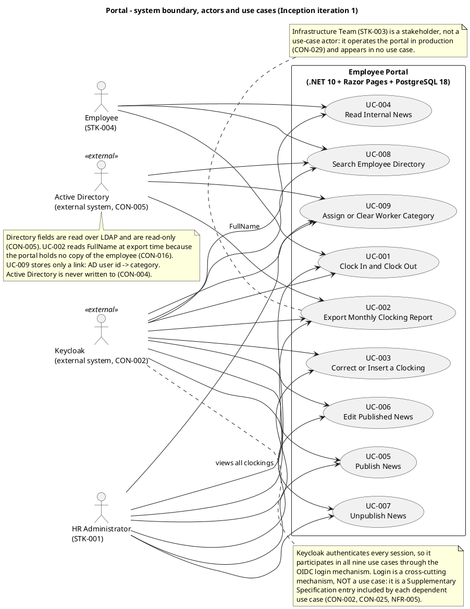
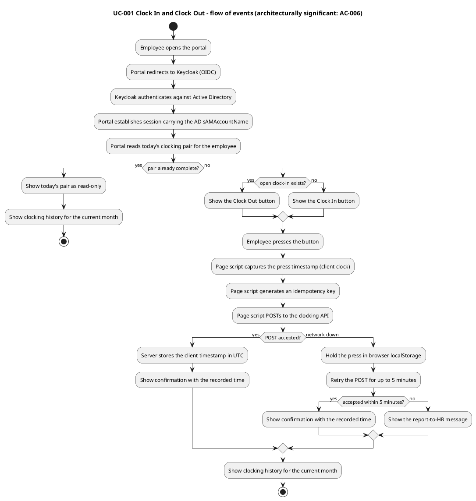
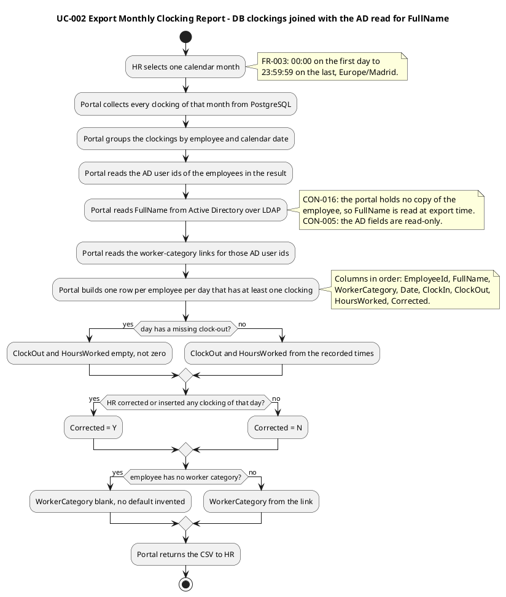
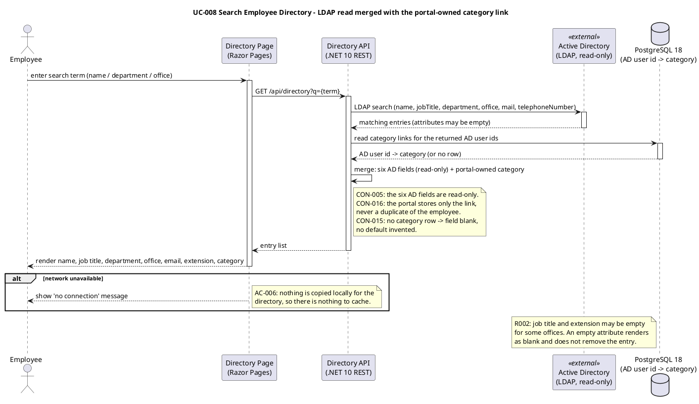

## Document Control

- **Phase:** Inception
- **Status:** Draft — iteration 1, not yet reviewed
- **Milestone Target:** Lifecycle Objectives (LCO) — end of Inception. NOT YET ACHIEVED.

## Use-Case Diagram
The system boundary is the Employee Portal application. Actors sit ON the boundary line: the two human roles outside it, and the two external systems the portal depends on. Everything inside the rectangle is built by this project; everything outside it is not.

### Cross-cutting mechanisms — not use cases

These are technical mechanisms every use case depends on. They are Supplementary Specification entries, included by each dependent use case, and are deliberately NOT modelled as use cases (they deliver no observable value to an actor on their own):

| Mechanism | Included by | Home |
|---|---|---|
| OIDC login against Keycloak, federated to Active Directory (CON-002, CON-025) | UC-001..UC-009 | Supplementary Specification — Functionality |
| Authorization: two levels from AD group membership (NFR-005) | UC-001..UC-009 | Supplementary Specification — Functionality |
| LDAP read of the six read-only directory fields (CON-005) | UC-002, UC-008, UC-009 | Supplementary Specification — Interfaces |
| Audit write (NFR-004) | UC-002, UC-003, UC-005, UC-006, UC-007, UC-009 | Supplementary Specification — Functionality |
| Clocking retry with client timestamp and idempotency key (AC-006) | UC-001 | Supplementary Specification — Reliability |

## Actors
| Actor | Type | Description | Use cases |
|---|---|---|---|
| Employee (STK-004) | Human, primary | A Cuba Corp employee — 200 people across 3 offices. Authenticates with corporate credentials. Clocks in and out, reads news, searches the directory. | UC-001 (primary), UC-004, UC-008 |
| HR Administrator (STK-001) | Human, primary | A member of the HR AD group. Publishes, edits and unpublishes news, manages worker categories, corrects or inserts clockings, views all clockings and exports the monthly CSV. | UC-002, UC-003, UC-005, UC-006, UC-007, UC-009 (primary); UC-001 (secondary) |
| Keycloak | External system | The company's internal identity provider, federated to Active Directory. Authenticates every session. Not deployed or operated by this project (CON-002, CON-025). | UC-001..UC-009 (via the login mechanism) |
| Active Directory | External system | The single home of employee data. Read over LDAP for the six directory fields. Never written to (CON-004, CON-005, CON-016). | UC-002 (FullName at export time), UC-008, UC-009 |

**Actor discovery completeness.** Human actors: Employee, HR Administrator. External systems: Keycloak, Active Directory. Time-triggered actors: none — no scheduled job, batch or report is declared, and the monthly CSV is exported on demand by HR, not on a schedule. Hardware devices: none — no biometric clocking (declared exclusion). Administrative actors: none — the Infrastructure Team (STK-003) operates the portal in production (CON-029) but performs no in-portal administration, and there is no permission administration screen (NFR-005) and no in-portal audit view (CON-018).

**Why Active Directory is an actor of UC-002.** FR-003 requires a FullName column; CON-016 forbids the portal holding any copy of the employee; CON-005 makes the six directory fields AD-read-only. The export therefore reads FullName from Active Directory at export time, and the portal's own store contributes only the clockings and the category link.
## Use-Case Survey

Nine use cases, one per declared functional requirement. Priority is MoSCoW; volatility is assessed on two axes — will this change for the same customer over time, and does it differ across customers right now.

| UC | Source | Name | Primary actor | Priority | Volatility | Detail this iteration |
|---|---|---|---|---|---|---|
| UC-001 | FR-001 | Clock In and Clock Out | Employee | Must | High | Full specification |
| UC-002 | FR-003 | Export Monthly Clocking Report | HR Administrator | Must | Medium | Full specification |
| UC-003 | FR-002 | Correct or Insert a Clocking | HR Administrator | Must | Low | Outline |
| UC-004 | FR-004 | Read Internal News | Employee | Must | Low | Outline |
| UC-005 | FR-005 | Publish News | HR Administrator | Must | Low | Outline |
| UC-006 | FR-006 | Edit Published News | HR Administrator | Should | Low | Outline |
| UC-007 | FR-007 | Unpublish News | HR Administrator | Should | Low | Outline |
| UC-008 | FR-008 | Search Employee Directory | Employee | Must | High | Full specification |
| UC-009 | FR-009 | Assign or Clear Worker Category | HR Administrator | Should | Low | Outline |

**Volatility rationale.** UC-001 is High: AC-006 fixes a client-side retry with a client-supplied timestamp and an idempotency key, and the clocking page carries a page-level script (CON-023) — the mechanism is the most likely thing to change, and it must be encapsulated. UC-008 is High: R002 is precisely the risk that the LDAP attributes it reads are inconsistently filled across the three offices, so its behaviour against incomplete data is volatile. UC-002 is Medium: the CSV column set, order and formats are fixed by FR-003, but the export is the artefact HR consumes and is the most likely to attract a format change. The remaining use cases are Low: their rules are fixed by CON-009..CON-019 and their fields are declared literally.

**Architecturally significant use cases (detailed this iteration).** UC-001, UC-002 and UC-008. UC-001 forces the client-timestamp and idempotency decisions (AC-006) and the page-level script (CON-023). UC-008 forces the LDAP read and the merge with the portal-owned category link (CON-005, CON-016) and must survive empty attributes (R002). UC-002 forces the exact export contract of FR-003. The remaining six are outlined; the RequirementsSpecifier details them in Elaboration.

## Use-Case Specifications
### UC-001 Clock In and Clock Out

| Field | Value |
|---|---|
| Source | FR-001 |
| Primary actor | Employee (STK-004) |
| Secondary actor | HR Administrator (STK-001) — views all employees' clockings |
| Stakeholders and interests | Employee: the recorded time is the time the button was pressed, and a clocking is never lost. HR: the record is trustworthy and correctable with an audit trail. Infrastructure: the portal never writes to AD. |
| Trigger | The employee presses Clock In or Clock Out on the main screen. |
| Precondition | The employee is authenticated (OIDC via Keycloak, federated to AD) and the session carries the AD sAMAccountName. |
| Postcondition | A clocking record exists for the employee for the current calendar date, stored in UTC with the timestamp the employee pressed the button. The employee sees a confirmation and their clocking history for the current month. |
| Priority | Must |
| Volatility | High |

**Main flow**

1. The employee opens the portal; the portal redirects to Keycloak and establishes the session.
2. The portal reads today's clocking pair for the employee and shows the Clock In button (no open clock-in) or the Clock Out button (open clock-in).
3. The employee presses the button.
4. The page script captures the press timestamp and generates an idempotency key.
5. The page script POSTs the clocking to the API.
6. The server stores the client-supplied timestamp in UTC and shows the confirmation with the recorded time.
7. The portal shows the employee's clocking history for the current month.

**Alternative flows**

- **A1 — Network unavailable at the moment of the press (AC-006).** At step 5 the POST fails. The page script holds the press in browser localStorage and retries the POST for up to 5 minutes. If a retry is accepted, the flow continues at step 6 with the original press timestamp. If 5 minutes elapse without acceptance, the portal shows the report-to-HR message and the flow ends. The server rejects duplicates by the idempotency key, so a retry that the server already accepted does not create a second record.
- **A2 — Today's pair is already complete (CON-011).** At step 2 the portal finds a complete pair for the current date. It shows the pair as read-only and the flow continues at step 7. At most one clocking pair per employee per calendar day.
- **A3 — Clocking still open at midnight (CON-010).** A pair never crosses midnight. A clocking still open at midnight is an incomplete day and is exported with ClockOut and HoursWorked empty (FR-003).
- **A4 — HR views all employees' clockings.** The HR Administrator opens the clocking overview and sees every employee's clockings. This is the same declared process with a second actor, so it is a scenario of this use case, not a separate use case. It leads to UC-002 for the export.

**Business rules applied:** CON-010, CON-011, CON-012, CON-008 (stored UTC, displayed Europe/Madrid).

### UC-002 Export Monthly Clocking Report

| Field | Value |
|---|---|
| Source | FR-003 |
| Primary actor | HR Administrator (STK-001) |
| Secondary actor | Active Directory (external system) — read over LDAP for FullName |
| Stakeholders and interests | HR: the CSV is the artefact that replaces the Excel sheet, so its columns, order, formats and row rules must match FR-003 exactly. Infrastructure: AD is read, never written (CON-004). |
| Trigger | HR selects a calendar month and requests the export. |
| Precondition | The HR Administrator is authenticated and is a member of the HR AD group. |
| Postcondition | A CSV file covering the selected calendar month has been produced with the declared columns, order, formats and row rules. |
| Priority | Must |
| Volatility | Medium |

**Main flow**

1. HR selects one calendar month (00:00 on the first day to 23:59:59 on the last, Europe/Madrid).
2. The portal collects every clocking of that month from its own store and groups them by employee and calendar date.
3. The portal reads FullName from Active Directory over LDAP for the employees in the result. The portal holds no copy of the employee (CON-016), so the name is read at export time and never stored.
4. The portal reads the worker-category links for those AD user ids.
5. The portal writes one row per employee per day that has at least one clocking, with the columns EmployeeId, FullName, WorkerCategory, Date, ClockIn, ClockOut, HoursWorked, Corrected, in that order.
6. The portal returns the CSV to HR.

**Alternative flows**

- **A1 — A day with no clocking.** No row is produced for that employee on that day.
- **A2 — A day with a missing clock-out.** The row is still exported, with ClockOut and HoursWorked empty — not zero.
- **A3 — A day HR corrected or inserted.** Corrected is Y for that day; otherwise N.
- **A4 — An employee with no worker category (CON-015).** The WorkerCategory field is blank. No default value is invented.
- **A5 — An employee's FullName is empty in Active Directory (R002).** The row is still exported with the FullName field blank. The stand-in directory carries such entries so this path is exercised before the real AD is validated (CON-028).

**Field rules**

| Column | Rule |
|---|---|
| EmployeeId | The AD sAMAccountName read from the authenticated session, written as-is. No mapping table. |
| FullName | Read from Active Directory over LDAP at export time. The portal holds no copy of the employee (CON-016). |
| WorkerCategory | The portal-owned category link; blank when none (CON-015). |
| Date | ISO 8601, e.g. 2026-06-22. |
| ClockIn / ClockOut | 24-hour HH:mm without seconds, Europe/Madrid local time. |
| HoursWorked | Decimal hours with two decimals, computed from the recorded times — not from the minute-rounded values shown. |
| Corrected | Y if HR corrected or inserted any clocking of that day, else N. |

### UC-003 Correct or Insert a Clocking

| Field | Value |
|---|---|
| Source | FR-002 |
| Primary actor | HR Administrator (STK-001) |
| Trigger | An employee who forgot to clock out asks HR, and HR opens the clocking to correct or insert it. |
| Precondition | The HR Administrator is authenticated and is a member of the HR AD group. |
| Postcondition | The clocking is corrected or inserted, and an audit entry records who corrected it, when, the previous value and a free-text reason. The original record is never overwritten in place and never deleted. |
| Priority | Must |
| Volatility | Low |

**Main flow**

1. HR locates the employee's clocking for the day in question.
2. HR enters the corrected or inserted value and a free-text reason.
3. The portal writes a new record and an audit entry (who, when, previous value, reason).
4. The portal shows the corrected day.

**Alternative flows**

- **A1 — No reason supplied.** The correction is not accepted; the reason is mandatory (NFR-004).
- **A2 — The employee attempts a self-service correction.** There is no self-service correction screen for the employee (FR-002). The employee reports the clocking to HR instead.

**Business rules applied:** CON-012, CON-010, CON-011.

### UC-004 Read Internal News

| Field | Value |
|---|---|
| Source | FR-004 |
| Primary actor | Employee (STK-004) |
| Trigger | The employee opens the main page. |
| Precondition | The employee is authenticated. |
| Postcondition | The employee has seen the published news sorted by date, optionally filtered by category, with the featured item in the banner. |
| Priority | Must |
| Volatility | Low |

**Main flow**

1. The employee opens the main page.
2. The portal shows published news (title, body, date, category) sorted by date.
3. The employee optionally filters by category (General, HR, IT, Events).
4. The portal shows the featured item in a banner at the top.

**Alternative flows**

- **A1 — No item is featured.** The banner is absent. At most one item is featured at any moment, and there may be none (CON-009).
- **A2 — Network unavailable.** The portal shows a 'no connection' message. Nothing is copied locally, so there is nothing to cache (AC-006).

**Business rules applied:** CON-009, CON-017. Read-only for employees — no comments or reactions.

### UC-005 Publish News

| Field | Value |
|---|---|
| Source | FR-005 |
| Primary actor | HR Administrator (STK-001) |
| Trigger | HR decides to publish an internal news item or announcement. |
| Precondition | The HR Administrator is authenticated and is a member of the HR AD group. |
| Postcondition | The item is published with title, body, date and category, and an audit entry records the author and timestamp. |
| Priority | Must |
| Volatility | Low |

**Main flow**

1. HR enters the title, body, date and category.
2. HR optionally flags the item as featured.
3. The portal publishes the item and writes the audit entry (author + timestamp).

**Alternative flows**

- **A1 — HR flags the item as featured while another item is already featured.** The previous item is un-featured. At most one item is featured at any moment, and this invariant holds wherever the change comes from (CON-009).
- **A2 — HR publishes without flagging.** Featuring is never automatic; no item is featured by the system (FR-005).

**Business rules applied:** CON-009, NFR-004.

### UC-006 Edit Published News

| Field | Value |
|---|---|
| Source | FR-006 |
| Primary actor | HR Administrator (STK-001) |
| Trigger | HR needs to correct a published item — a typo should not force a republish. |
| Precondition | The item is published. |
| Postcondition | The item carries the edited content and an audit entry records who edited it and when. |
| Priority | Should |
| Volatility | Low |

**Main flow**

1. HR opens the published item.
2. HR changes the content and optionally the featured flag.
3. The portal saves the change and writes the audit entry (who + when), exactly as for the original publication.

**Alternative flows**

- **A1 — HR changes the featured flag.** The invariant of CON-009 holds: featuring this item un-features the previous one; un-featuring it leaves none.

**Business rules applied:** CON-009, NFR-004.

### UC-007 Unpublish News

| Field | Value |
|---|---|
| Source | FR-007 |
| Primary actor | HR Administrator (STK-001) |
| Trigger | HR decides an item should no longer be visible. |
| Precondition | The item is published. |
| Postcondition | The item is hidden and still present in the database, and an audit entry records who unpublished it and when. |
| Priority | Should |
| Volatility | Low |

**Main flow**

1. HR selects the published item and unpublishes it.
2. The portal hides the item and writes the audit entry (who + when).

**Alternative flows**

- **A1 — The unpublished item was the featured one.** It is also un-featured: the banner disappears and no other item is promoted in its place (FR-007).
- **A2 — HR attempts to delete the item.** There is no hard delete of a news item; deleting would destroy the audit trail (CON-017).

**Business rules applied:** CON-017, CON-009, NFR-004.

### UC-008 Search Employee Directory

| Field | Value |
|---|---|
| Source | FR-008 |
| Primary actor | Employee (STK-004) |
| Secondary actor | Active Directory (external system) |
| Stakeholders and interests | Employee: finds a colleague's phone or email in under 10 seconds (AC-004). HR: the directory is never stale and never a duplicate of AD. Infrastructure: AD is read, never written (CON-004). |
| Trigger | The employee enters a search term. |
| Precondition | The employee is authenticated. |
| Postcondition | The employee sees matching colleagues with name, job title, department, office, email, extension and worker category. |
| Priority | Must |
| Volatility | High |

**Main flow**

1. The employee enters a search term — a name, a department or an office.
2. The portal reads the matching entries from Active Directory over LDAP (name, job title, department, office, email, extension).
3. The portal reads the category links for the returned AD user ids.
4. The portal merges the six read-only AD fields with the portal-owned category and renders the entries.

**Alternative flows**

- **A1 — An entry has an empty job title or extension (R002).** The attribute renders as blank and the entry is still shown. The stand-in directory carries such entries so this path is exercised before the real AD is validated (CON-028).
- **A2 — An employee has no category (CON-015).** The category field is blank. No default value is invented.
- **A3 — Network unavailable.** The portal shows a 'no connection' message. Nothing is copied locally, so there is nothing to cache (AC-006).
- **A4 — No match.** The portal shows an empty result. No private personal information is shown — corporate data only.

**Business rules applied:** CON-004, CON-005, CON-013, CON-015, CON-016.

### UC-009 Assign or Clear Worker Category

| Field | Value |
|---|---|
| Source | FR-009 |
| Primary actor | HR Administrator (STK-001) |
| Secondary actor | Active Directory (external system) |
| Trigger | HR assigns a category to an employee, or clears the one they have. |
| Precondition | The HR Administrator is authenticated and is a member of the HR AD group. |
| Postcondition | The category link (AD user id → category) is written or removed, and an audit entry records the change. |
| Priority | Should |
| Volatility | Low |

**Main flow**

1. HR opens the employee's entry on the directory screen.
2. HR selects one of the four categories, or clears the current one.
3. The portal writes or removes the link (AD user id → category) and writes the audit entry.

**Alternative flows**

- **A1 — HR clears the category.** The link is removed. The employee still appears in the directory and in the export with the field blank (CON-015).
- **A2 — HR attempts to enter a fifth value.** The list is closed at exactly four values — Full-time, Part-time, Contractor, Intern — and is not configurable (CON-014). A fifth value requires a Change Request.
- **A3 — HR attempts to edit another employee field.** No employee field is editable anywhere in the portal; the six AD fields are read-only (CON-005). The category is the only write the portal makes about a person.

**Business rules applied:** CON-004, CON-013, CON-014, CON-015, CON-016, NFR-004.

## Traceability

| Element | Traces From | Link Type | Traces To |
|---|---|---|---|
| UC-001 Clock In and Clock Out | FR-001, AC-006, CON-010, CON-011 | Derives | Supplementary Specification, Design Model |
| UC-002 Export Monthly Clocking Report | FR-003, CON-015 | Derives | Supplementary Specification, Design Model |
| UC-003 Correct or Insert a Clocking | FR-002, CON-012, NFR-004 | Derives | Supplementary Specification, Design Model |
| UC-004 Read Internal News | FR-004, CON-009, CON-017 | Derives | Supplementary Specification, Design Model |
| UC-005 Publish News | FR-005, CON-009, NFR-004 | Derives | Supplementary Specification, Design Model |
| UC-006 Edit Published News | FR-006, CON-009, NFR-004 | Derives | Supplementary Specification, Design Model |
| UC-007 Unpublish News | FR-007, CON-017, NFR-004 | Derives | Supplementary Specification, Design Model |
| UC-008 Search Employee Directory | FR-008, CON-005, CON-016, R002 | Derives | Supplementary Specification, Design Model |
| UC-009 Assign or Clear Worker Category | FR-009, CON-014, CON-015, CON-016 | Derives | Supplementary Specification, Design Model |
| Actor: Employee | STK-004 | Refines | UC-001, UC-004, UC-008 |
| Actor: HR Administrator | STK-001, NFR-005 | Refines | UC-002, UC-003, UC-005, UC-006, UC-007, UC-009 |
| Actor: Keycloak | CON-002, CON-025 | Refines | Supplementary Specification |
| Actor: Active Directory | CON-004, CON-005 | Refines | UC-008, UC-009 |
| Cross-cutting mechanism: OIDC login | CON-002, CON-025, NFR-005 | Refines | Supplementary Specification |
| Cross-cutting mechanism: audit write | NFR-004, CON-018 | Refines | Supplementary Specification |
