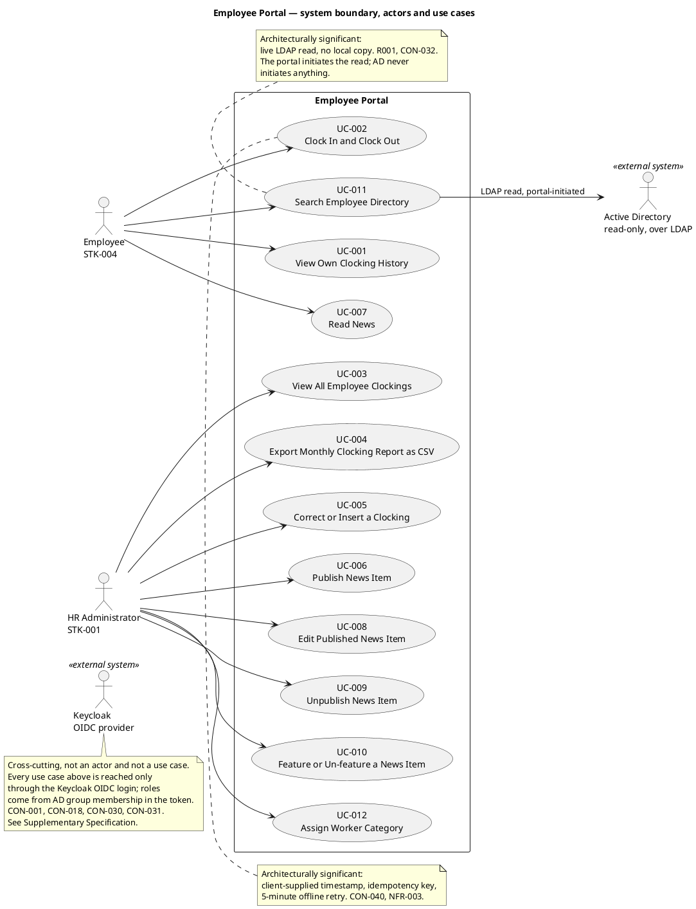
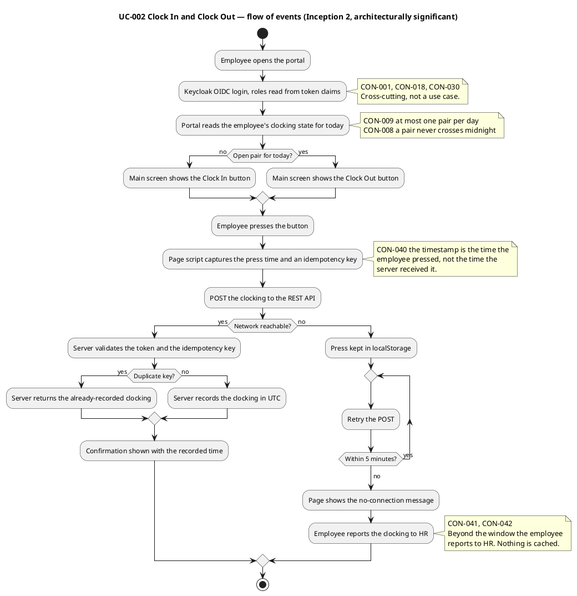
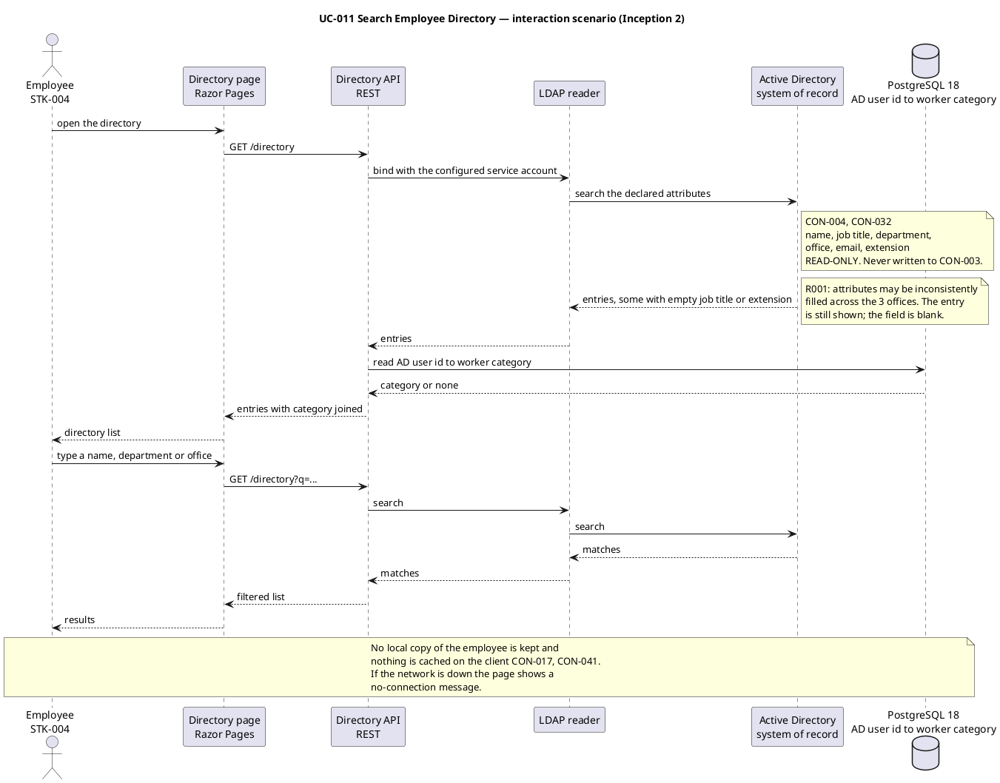
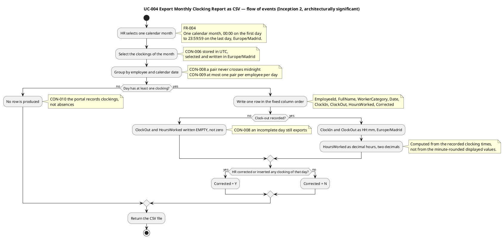
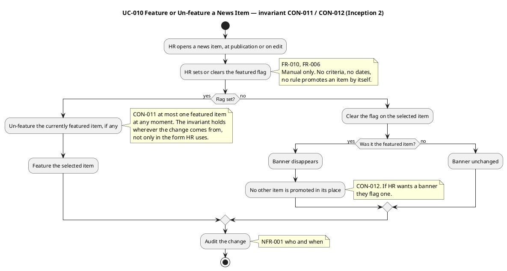
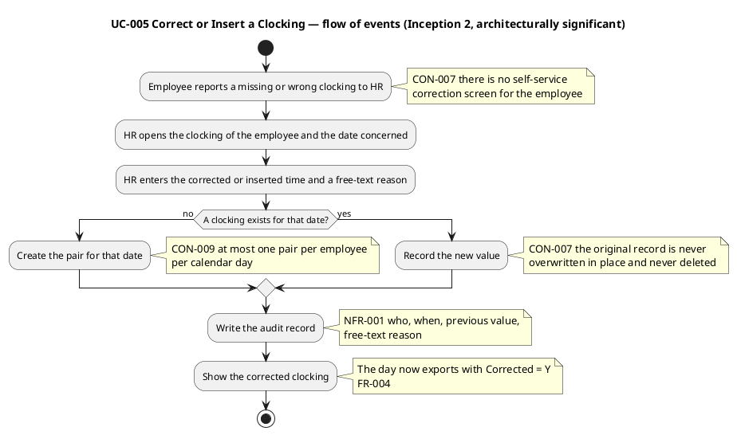

## Document Control
- **Phase:** Inception
- **Status:** Draft — under review
- **Milestone Target:** End of Inception (not yet achieved)
- **Iteration:** 3, Cycle 1
- **Owner:** SystemAnalyst
- **Date:** 2026-10-07
## Use-Case Diagram

```plantuml
@startuml
title Employee Portal — system boundary, actors and use cases

left to right direction
skinparam packageStyle rectangle

actor "Employee\nSTK-004" as EMP
actor "HR Administrator\nSTK-001" as HR
actor "Active Directory\nread-only, over LDAP" as AD <<external system>>
actor "Keycloak\nOIDC provider" as KC <<external system>>

rectangle "Employee Portal" {
  usecase "UC-001\nView Own Clocking History" as UC001
  usecase "UC-002\nClock In and Clock Out" as UC002
  usecase "UC-003\nView All Employee Clockings" as UC003
  usecase "UC-004\nExport Monthly Clocking Report as CSV" as UC004
  usecase "UC-005\nCorrect or Insert a Clocking" as UC005
  usecase "UC-006\nPublish News Item" as UC006
  usecase "UC-007\nRead News" as UC007
  usecase "UC-008\nEdit Published News Item" as UC008
  usecase "UC-009\nUnpublish News Item" as UC009
  usecase "UC-010\nFeature or Un-feature a News Item" as UC010
  usecase "UC-011\nSearch Employee Directory" as UC011
  usecase "UC-012\nAssign Worker Category" as UC012
}

EMP --> UC001
EMP --> UC002
EMP --> UC007
EMP --> UC011
HR --> UC003
HR --> UC004
HR --> UC005
HR --> UC006
HR --> UC008
HR --> UC009
HR --> UC010
HR --> UC012
UC011 --> AD : LDAP read, portal-initiated

note bottom of KC
  Cross-cutting, not an actor and not a use case.
  Every use case above is reached only
  through the Keycloak OIDC login; roles
  come from AD group membership in the token.
  CON-001, CON-018, CON-030, CON-031.
  See Supplementary Specification.
end note

note top of UC002
  Architecturally significant:
  client-supplied timestamp, idempotency key,
  5-minute offline retry. CON-040, NFR-003.
end note

note bottom of UC011
  Architecturally significant:
  live LDAP read, no local copy. R001, CON-032.
  The portal initiates the read; AD never
  initiates anything.
end note
@enduml
```

**Boundary.** The rectangle is the Portal. Actors sit on the boundary line. Keycloak is drawn outside the rectangle and is deliberately NOT an actor of any use case: authentication and authorization are cross-cutting mechanisms that every use case depends on, and they are specified in the Supplementary Specification with `<<include>>` from each dependent use case. Active Directory IS an actor of UC-011 because the directory search is a live read of a system of record the portal does not own; the association is directed from UC-011 to AD, because the portal initiates the LDAP read and AD never initiates anything.

**Architecturally significant use cases.** Five of the twelve force an architectural decision and are detailed in this artifact: UC-002 (client-trusted timestamp, idempotency key, offline retry — CON-040), UC-004 (High volatility: the fixed export contract — FR-004), UC-005 (append-only correction with audit — CON-007, NFR-001), UC-010 (High volatility: the at-most-one-featured invariant — CON-011, CON-012), UC-011 (live LDAP read with no local copy — CON-032, R001). The remaining seven are surveyed only; the RequirementsSpecifier details them in Elaboration.
## Actors
| Actor | Type | Description | Use cases |
|---|---|---|---|
| Employee (STK-004) | Human, primary | A Cuba Corp employee — 200 people across 3 offices. Logs in with corporate credentials. Reads the directory and the news, and manages their own clockings. | UC-001, UC-002, UC-007, UC-011 |
| HR Administrator (STK-001) | Human, primary | Member of the HR AD group (CON-018). Owns the clocking data, the news and the worker category. | UC-003, UC-004, UC-005, UC-006, UC-008, UC-009, UC-010, UC-012 |
| Active Directory | External system, supporting | The system of record for people. Read-only over LDAP; never written to (CON-003, CON-004, CON-032). | UC-011 |

**Keycloak is not an actor.** It appears on the use-case diagram outside the system boundary to show that every use case is reached through it, and it is deliberately absent from the table above. Authentication and authorization are cross-cutting technical mechanisms: they deliver no observable value to an actor on their own, and the scope guard forbids a use case named "Authenticate". They are specified in the Supplementary Specification and included by every use case that depends on them (CON-001, CON-018, CON-030, CON-031).

**Actor discovery completeness.** Human actors: Employee, HR Administrator. External systems: Active Directory (supporting actor of UC-011), Keycloak (cross-cutting mechanism, not an actor). Time-trigger actors: **none** — no scheduled job, batch report or expiry rule is declared, and CON-011/CON-012 explicitly forbid a rule that features a news item by itself. Hardware devices: **none** — no biometric clocking (declared exclusion). Administrative actors: **none** — there is no permission administration screen, no role matrix and no audit view screen (CON-018, NFR-005); Infrastructure operates the portal but does not use it (CON-036).

## Use-Case Survey

Twelve use cases, one per declared requirement. Every use case passes the ATM test: a named primary actor initiates it, a trigger event starts it, and it ends in a measurable outcome the actor can observe.

| UC | Source | Use case | Primary actor | Priority | Volatility | Architecturally significant |
|---|---|---|---|---|---|---|
| UC-001 | FR-001 | View Own Clocking History | Employee | Must | Low | No |
| UC-002 | FR-002 | Clock In and Clock Out | Employee | Must | Low | **Yes** — client timestamp, idempotency key, offline retry (CON-040, NFR-003, AC-006) |
| UC-003 | FR-003 | View All Employee Clockings | HR Administrator | Must | Medium | No |
| UC-004 | FR-004 | Export Monthly Clocking Report as CSV | HR Administrator | Must | **High** | **Yes** — fixed column contract, empty-not-zero semantics, Europe/Madrid |
| UC-005 | FR-005 | Correct or Insert a Clocking | HR Administrator | Must | Medium | **Yes** — append-only correction with audit (CON-007, NFR-001) |
| UC-006 | FR-006 | Publish News Item | HR Administrator | Must | Low | No |
| UC-007 | FR-007 | Read News | Employee | Must | Medium | No |
| UC-008 | FR-008 | Edit Published News Item | HR Administrator | Must | Low | No |
| UC-009 | FR-009 | Unpublish News Item | HR Administrator | Must | Low | No |
| UC-010 | FR-010 | Feature or Un-feature a News Item | HR Administrator | Must | **High** | **Yes** — the at-most-one-featured invariant (CON-011, CON-012) |
| UC-011 | FR-011 | Search Employee Directory | Employee | Must | Medium | **Yes** — live LDAP read, no local copy (CON-032, R001) |
| UC-012 | FR-012 | Assign Worker Category | HR Administrator | Must | Medium | **Yes** — the only write about a person (CON-014, CON-017) |

**Multi-actor note.** UC-003, UC-004 and UC-005 are three distinct HR goals over the same clocking data — viewing, exporting and correcting are separate outcomes with separate triggers, not one process split per actor. No use case is split per actor.

**Detail level this iteration.** Per the 80/20 rule of Inception, the five architecturally significant use cases are detailed below. The remaining seven are surveyed only; the RequirementsSpecifier details them in Elaboration.

## Use-Case Specifications
### UC-002 Clock In and Clock Out

| Field | Value |
|---|---|
| Source | FR-002 |
| Primary actor | Employee (STK-004) |
| Stakeholders and interests | Employee — one press, immediate confirmation, never a lost clocking. HR — the recorded time is the time the employee pressed, not the time the server received it. |
| Trigger | The employee presses the Clock In or Clock Out button on the main screen. |
| Preconditions | The employee is authenticated through Keycloak and holds a valid token. The portal is reachable from the corporate network, or the page is already loaded and the network has just gone down. |
| Postconditions | Exactly one clocking is recorded for the employee for the current calendar date, or the press is queued for retry, or the employee is told to report to HR. |
| Priority | Must |
| Volatility | Low |

**Main flow**

1. The employee opens the portal and authenticates through Keycloak; the portal reads the role from the token claims.
2. The portal reads the employee's clocking state for the current calendar date.
3. The portal shows the Clock In button if no pair is open, or the Clock Out button if a pair is open.
4. The employee presses the button.
5. The page script captures the press time and an idempotency key.
6. The portal posts the clocking to the REST API.
7. The server validates the token and the idempotency key, records the clocking in UTC, and returns the recorded time.
8. The portal shows a confirmation with the recorded time.

**Alternative flows**

- **A1 — Duplicate press (step 7).** The idempotency key was already recorded. The server returns the already-recorded clocking and records nothing new. The confirmation shows the original time.
- **A2 — Network unreachable at step 6.** The press is kept in localStorage and the POST is retried for up to 5 minutes. On success the flow rejoins step 7. If the window expires, the page shows the no-connection message and the employee reports the clocking to HR (CON-042).
- **A3 — Clock-out with no open pair.** The portal shows the Clock In button; the employee cannot clock out twice.

**Business rules applied.** CON-006 (stored UTC, displayed Europe/Madrid), CON-008 (a pair never crosses midnight), CON-009 (at most one pair per employee per calendar day), CON-040 (client timestamp, idempotency key, 5-minute retry).

```plantuml
@startuml
title UC-002 Clock In and Clock Out — flow of events (Inception 2, architecturally significant)

start
:Employee opens the portal;
:Keycloak OIDC login, roles read from token claims;
note right
  CON-001, CON-018, CON-030
  Cross-cutting, not a use case.
end note

:Portal reads the employee's clocking state for today;
note right
  CON-009 at most one pair per day
  CON-008 a pair never crosses midnight
end note

if (Open pair for today?) then (no)
  :Main screen shows the Clock In button;
else (yes)
  :Main screen shows the Clock Out button;
endif

:Employee presses the button;
:Page script captures the press time and an idempotency key;
note right
  CON-040 the timestamp is the time the
  employee pressed, not the time the
  server received it.
end note

:POST the clocking to the REST API;

if (Network reachable?) then (yes)
  :Server validates the token and the idempotency key;
  if (Duplicate key?) then (yes)
    :Server returns the already-recorded clocking;
  else (no)
    :Server records the clocking in UTC;
  endif
  :Confirmation shown with the recorded time;
else (no)
  :Press kept in localStorage;
  repeat
    :Retry the POST;
  repeat while (Within 5 minutes?) is (yes)
  ->no;
  :Page shows the no-connection message;
  :Employee reports the clocking to HR;
  note right
    CON-041, CON-042
    Beyond the window the employee
    reports to HR. Nothing is cached.
  end note
endif

stop
@enduml
```

### UC-011 Search Employee Directory

| Field | Value |
|---|---|
| Source | FR-011 |
| Primary actor | Employee (STK-004) |
| Supporting actor | Active Directory (read-only, over LDAP) |
| Stakeholders and interests | Employee — find a colleague's phone and email in under 10 seconds (AC-004). Infrastructure — AD is never written to (CON-003). HR — the worker category is visible and filters the list. |
| Trigger | The employee opens the directory or types a search term. |
| Preconditions | The employee is authenticated. The portal can reach Active Directory over LDAP. |
| Postconditions | The employee sees the matching entries with name, job title, department, office, email, extension and worker category. Nothing is written anywhere. |
| Priority | Must |
| Volatility | Medium |

**Main flow**

1. The employee opens the directory.
2. The portal binds to Active Directory over LDAP with the configured service account and searches the declared attributes.
3. The portal reads the AD user id to worker category link from its own table and joins it to the entries.
4. The portal shows the entries: name, job title, department, office, email, extension, worker category.
5. The employee types a name, a department or an office.
6. The portal re-searches and shows the filtered list.

**Alternative flows**

- **A1 — An attribute is empty (step 4).** The entry is still shown and the field is blank. No default value is invented (CON-016). This is the R001 case: job title and extension may be inconsistently filled across the 3 offices.
- **A2 — No category assigned (step 3).** The entry appears with the category field blank (CON-016).
- **A3 — Network unreachable (step 2).** The page shows a no-connection message. Nothing is cached locally (CON-041).
- **A4 — No match (step 6).** The portal shows an empty result list.

**Business rules applied.** CON-004 (read-only, no edit form), CON-014 (the category is descriptive and does not drive access control), CON-016 (at most one category, may be empty), CON-017 (no local copy of the employee), CON-022 (corporate data only), CON-032 (AD is the system of record, read directly over LDAP).

```plantuml
@startuml
title UC-011 Search Employee Directory — interaction scenario (Inception 2)

actor "Employee\nSTK-004" as EMP
participant "Directory page\nRazor Pages" as UI
participant "Directory API\nREST" as API
participant "LDAP reader" as LDAP
participant "Active Directory\nsystem of record" as AD
database "PostgreSQL 18\nAD user id to worker category" as DB

EMP -> UI : open the directory
UI -> API : GET /directory
API -> LDAP : bind with the configured service account
LDAP -> AD : search the declared attributes
note right of AD
  CON-004, CON-032
  name, job title, department,
  office, email, extension
  READ-ONLY. Never written to CON-003.
end note
AD --> LDAP : entries, some with empty job title or extension
note right
  R001: attributes may be inconsistently
  filled across the 3 offices. The entry
  is still shown; the field is blank.
end note
LDAP --> API : entries
API -> DB : read AD user id to worker category
DB --> API : category or none
API --> UI : entries with category joined
UI --> EMP : directory list

EMP -> UI : type a name, department or office
UI -> API : GET /directory?q=...
API -> LDAP : search
LDAP -> AD : search
AD --> LDAP : matches
LDAP --> API : matches
API --> UI : filtered list
UI --> EMP : results

note over EMP, DB
  No local copy of the employee is kept and
  nothing is cached on the client CON-017, CON-041.
  If the network is down the page shows a
  no-connection message.
end note
@enduml
```

### UC-004 Export Monthly Clocking Report as CSV

| Field | Value |
|---|---|
| Source | FR-004 |
| Primary actor | HR Administrator (STK-001) |
| Trigger | HR selects a calendar month and requests the export. |
| Preconditions | HR is authenticated and is a member of the HR AD group. |
| Postconditions | A CSV file is produced for the selected month, one row per employee per day that has at least one clocking. |
| Priority | Must |
| Volatility | **High** — the column contract and the empty-not-zero semantics are a business decision HR can restate without any change to the stored clockings. |

**Main flow**

1. HR selects one calendar month.
2. The portal selects the clockings from 00:00 on the first day to 23:59:59 on the last day, Europe/Madrid.
3. The portal writes one row per employee per day that has at least one clocking, in the fixed column order.
4. The portal returns the CSV file.

**Column contract.** `EmployeeId, FullName, WorkerCategory, Date, ClockIn, ClockOut, HoursWorked, Corrected` — in this exact order.

| Column | Rule |
|---|---|
| EmployeeId | The AD sAMAccountName read from the authenticated session, written as-is. No mapping table (CON-005). |
| FullName | Read from Active Directory. |
| WorkerCategory | The assigned category, blank when none (CON-016). |
| Date | ISO 8601, e.g. 2026-06-22. |
| ClockIn / ClockOut | 24-hour HH:mm, no seconds, Europe/Madrid local time. |
| HoursWorked | Decimal hours with two decimals, computed from the recorded clocking times, not from the minute-rounded displayed values. Empty when clock-out is missing. |
| Corrected | Y when HR corrected or inserted any clocking of that day, N otherwise. |

**Alternative flows**

- **A1 — Clock-out missing (step 3).** ClockOut and HoursWorked are written EMPTY, not zero, and the row is still exported (CON-008).
- **A2 — A day with no clocking.** No row is produced (CON-010).
- **A3 — No category assigned.** WorkerCategory is blank (CON-016).

```plantuml
@startuml
title UC-004 Export Monthly Clocking Report as CSV — flow of events (Inception 2, architecturally significant)

start
:HR selects one calendar month;
note right
  FR-004
  One calendar month, 00:00 on the first day
  to 23:59:59 on the last day, Europe/Madrid.
end note

:Select the clockings of the month;
note right
  CON-006 stored in UTC,
  selected and written in Europe/Madrid
end note

:Group by employee and calendar date;
note right
  CON-008 a pair never crosses midnight
  CON-009 at most one pair per employee per day
end note

if (Day has at least one clocking?) then (no)
  :No row is produced;
  note right
    CON-010 the portal records clockings,
    not absences
  end note
else (yes)
  :Write one row in the fixed column order;
  note right
    EmployeeId, FullName, WorkerCategory, Date,
    ClockIn, ClockOut, HoursWorked, Corrected
  end note
  if (Clock-out recorded?) then (no)
    :ClockOut and HoursWorked written EMPTY, not zero;
    note right
      CON-008 an incomplete day still exports
    end note
  else (yes)
    :ClockIn and ClockOut as HH:mm, Europe/Madrid;
    :HoursWorked as decimal hours, two decimals;
    note right
      Computed from the recorded clocking times,
      not from the minute-rounded displayed values.
    end note
  endif
  if (HR corrected or inserted any clocking of that day?) then (yes)
    :Corrected = Y;
  else (no)
    :Corrected = N;
  endif
endif

:Return the CSV file;
stop
@enduml
```

### UC-010 Feature or Un-feature a News Item

| Field | Value |
|---|---|
| Source | FR-010 |
| Primary actor | HR Administrator (STK-001) |
| Trigger | HR sets or clears the featured flag, at publication or on edit. |
| Preconditions | HR is authenticated and is a member of the HR AD group. |
| Postconditions | At most one news item is featured. The change is audited. |
| Priority | Must |
| Volatility | **High** — the featuring policy is a business decision; the invariant behind it is not. |

**Main flow**

1. HR opens a news item, at publication or on edit.
2. HR sets the featured flag.
3. The portal un-features the currently featured item, if any.
4. The portal features the selected item.
5. The portal audits the change.

**Alternative flows**

- **A1 — HR clears the flag on the featured item (step 2).** The banner disappears and no other item is promoted in its place (CON-012). If HR wants a banner they flag one.
- **A2 — No item is featured.** The banner simply does not appear.

**Business rules applied.** CON-011 (at most one featured item at any moment — an invariant of the system, holding wherever the change comes from, not only in the form HR happens to use), CON-012, NFR-001.

```plantuml
@startuml
title UC-010 Feature or Un-feature a News Item — invariant CON-011 / CON-012 (Inception 2)

start
:HR opens a news item, at publication or on edit;
:HR sets or clears the featured flag;
note right
  FR-010, FR-006
  Manual only. No criteria, no dates,
  no rule promotes an item by itself.
end note

if (Flag set?) then (yes)
  :Un-feature the currently featured item, if any;
  note right
    CON-011 at most one featured item
    at any moment. The invariant holds
    wherever the change comes from,
    not only in the form HR uses.
  end note
  :Feature the selected item;
else (no)
  :Clear the flag on the selected item;
  if (Was it the featured item?) then (yes)
    :Banner disappears;
    :No other item is promoted in its place;
    note right
      CON-012. If HR wants a banner
      they flag one.
    end note
  else (no)
    :Banner unchanged;
  endif
endif

:Audit the change;
note right
  NFR-001 who and when
end note
stop
@enduml
```

### UC-005 Correct or Insert a Clocking

| Field | Value |
|---|---|
| Source | FR-005 |
| Primary actor | HR Administrator (STK-001) |
| Trigger | An employee reports a missing or wrong clocking to HR. |
| Preconditions | HR is authenticated and is a member of the HR AD group. |
| Postconditions | A corrected or inserted clocking exists, the original record is intact, and an audit record carries who, when, the previous value and the reason. |
| Priority | Must |
| Volatility | Medium |

**Main flow**

1. HR opens the clocking of the employee and the date concerned.
2. HR enters the corrected or inserted time and a free-text reason.
3. The portal records the new value without overwriting the original in place and without deleting it.
4. The portal writes the audit record: who, when, previous value, reason.
5. The portal shows the corrected clocking.

**Alternative flows**

- **A1 — Insertion for a day with no clocking (step 2).** The portal creates the pair for that date. The day then exports with Corrected = Y.
- **A2 — The employee attempts a correction.** There is no self-service correction screen; the employee asks HR (CON-007).

**Business rules applied.** CON-007 (only HR corrects or inserts; the original is never overwritten in place and never deleted), CON-008, CON-009, NFR-001.

```plantuml
@startuml
title UC-005 Correct or Insert a Clocking — flow of events (Inception 2, architecturally significant)

start
:Employee reports a missing or wrong clocking to HR;
note right
  CON-007 there is no self-service
  correction screen for the employee
end note

:HR opens the clocking of the employee and the date concerned;
:HR enters the corrected or inserted time and a free-text reason;

if (A clocking exists for that date?) then (no)
  :Create the pair for that date;
  note right
    CON-009 at most one pair per employee
    per calendar day
  end note
else (yes)
  :Record the new value;
  note right
    CON-007 the original record is never
    overwritten in place and never deleted
  end note
endif

:Write the audit record;
note right
  NFR-001 who, when, previous value,
  free-text reason
end note

:Show the corrected clocking;
note right
  The day now exports with Corrected = Y
  FR-004
end note
stop
@enduml
```

## Traceability
| Element | Traces From | Link Type | Traces To |
|---|---|---|---|
| UC-001 | FR-001 | Refines | COMP-001 |
| UC-002 | FR-002 | Refines | COMP-001, Software Architecture Document |
| UC-003 | FR-003 | Refines | COMP-002 |
| UC-004 | FR-004 | Refines | COMP-002, Software Architecture Document |
| UC-005 | FR-005 | Refines | COMP-001, Software Architecture Document |
| UC-006 | FR-006 | Refines | COMP-003 |
| UC-007 | FR-007 | Refines | COMP-003 |
| UC-008 | FR-008 | Refines | COMP-003 |
| UC-009 | FR-009 | Refines | COMP-003 |
| UC-010 | FR-010 | Refines | COMP-004, Software Architecture Document |
| UC-011 | FR-011 | Refines | COMP-005, COMP-006, COMP-009, Software Architecture Document |
| UC-012 | FR-012 | Refines | COMP-005, COMP-006 |
| Use-Case Model | FR-001, FR-002, FR-003, FR-004, FR-005, FR-006, FR-007, FR-008, FR-009, FR-010, FR-011, FR-012 | Derives | Software Architecture Document |
| Use-Case Model | CON-001, CON-018, CON-030, CON-031, NFR-001, CON-041 | DependsOn | Supplementary Specification |
| Use-Case Model | R001 | Refines | Risk List |
| Use-Case Model | AC-002, AC-003, AC-004, AC-005, AC-006 | Refines | Test Case |

**Reading the table.** `Traces From` is the declared input each use case realizes — the `Source:` identifier copied from the Work Order. `Traces To` is the component in the Software Architecture Document that realizes the use case. All twelve use cases reach a component: the five detailed this iteration constrain the architecture directly, and the seven surveyed ones are carried by the subsystems the architect decomposed for their functional area.

**Coverage.** Twelve declared requirements, twelve use cases, one-to-one. No use case exists without a declared source, and no declared requirement is left without a use case. The cross-cutting mechanisms — authentication, authorization, audit trail, no-connection handling — are specified in the Supplementary Specification and included by the use cases that depend on them; they are not use cases and carry no identifier of the `UC-` family.
