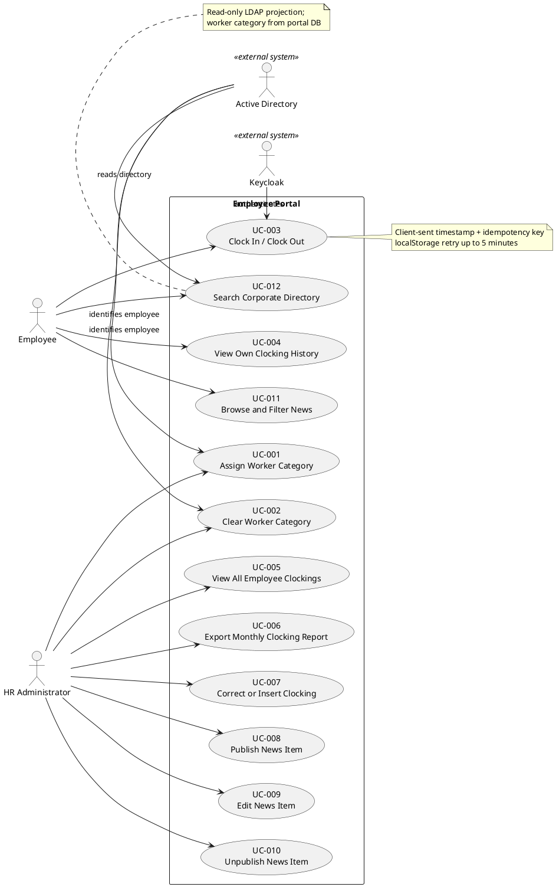

## Document Control

| Field | Value |
|---|---|
| Project | Portal |
| Phase | Inception |
| Iteration | 2 |
| Status | Draft |
| Milestone Target | End-of-Inception review |

## Problem Statement

Cuba Corp (200 employees across 3 offices) currently manages clocking, HR news distribution, and corporate directory access through disconnected, manual tools: shared Excel sheets for clockings, mass emails for news, and an outdated PDF for the phone directory. These tools are error-prone, create duplicate work for HR, and provide no reliable audit trail. The root problem is the absence of a single, authoritative internal web application that employees and HR can use for these daily processes.

Affected stakeholders:
- **STK-001 Laura Gómez** (HR Director / project sponsor) — sponsors the project and is accountable for HR process outcomes and project success.
- **HR Administrators** (members of the AD "HR" group, represented in the Use-Case Model by Actor A-002) — lose time consolidating and correcting clocking data, lack an auditable news channel, and manually maintain worker categories.
- **STK-004 Cuba Corp Employees** — cannot reliably clock in/out, find colleague contact details, or read current HR news in one place.
- **STK-003 Infrastructure team** — must support fragmented data stores and ad-hoc distribution channels.

Success criteria (measurable):
- BG-001 Reduce HR management time by 50% for clockings, news distribution, and directory updates.
- BG-002 Eliminate 100% of Excel usage for recording new clockings from go-live onwards.
- BG-003 80% of 200 employees actively use the portal for clocking within 3 months of go-live.

## Product Position Statement

For Cuba Corp employees and HR administrators who need a single internal source for clocking, HR news, and the corporate directory, the Employee Portal is an internal web application that centralizes these processes and replaces shared Excel sheets, mass emails, and an outdated PDF directory. Unlike the current fragmented tools, the portal provides an authenticated, auditable, and responsive intranet experience integrated with existing Keycloak and Active Directory.

## Stakeholder Summary

| ID | Stakeholder | Role / Interest | Influence |
|---|---|---|---|
| STK-001 | Laura Gómez | HR Director and project sponsor. Operational HR capabilities (news management, worker categories, clocking oversight, CSV export, clocking correction) are performed by members of the AD "HR" group (Actor A-002 HR Administrator), not by Laura as an individual. | High |
| STK-002 | Miguel Torres | Software Engineer; clarifies engineering questions for technical roles | High |
| STK-003 | Infrastructure team | Operates AD, Keycloak, and the portal in production; wants no AD/Keycloak changes or new platform types | High |
| STK-004 | Cuba Corp Employees | 200 end users across 3 offices; clock in/out, read news, search directory | Medium |

## Product Overview

The Employee Portal is an internal web application for Cuba Corp. It runs on the internal Windows Server estate as a .NET 10 application with a Razor Pages frontend and a PostgreSQL database. It authenticates through the existing Keycloak OIDC client and reads employee directory data from Active Directory over LDAP on demand. The portal stores only the AD user identifier and the portal-managed worker category; all other employee attributes are projected from AD at read time.

### System Boundary

### In Scope

- Employee clock in/out with current-month history view.
- HR view of all clockings with monthly CSV export.
- HR correction/insertion of clockings with full audit trail.
- HR publishing, editing, and unpublishing of news with manual featured banner.
- Employee browsing and filtering of news.
- Employee directory search with AD-sourced fields plus portal-managed worker category.
- HR assignment and clearing of worker categories.
- OIDC authentication via existing Keycloak.
- LDAP read from AD for directory data.
- Clocking retry for network outages up to 5 minutes via localStorage.

### Not in Scope

- Native mobile app (responsive web only).
- Push notifications.
- Payroll system integration.
- Vacation or sick-leave management.
- Biometric clocking.
- Any Keycloak deployment, provisioning, or design work.
- Writing back to Active Directory or editing AD-sourced employee fields in the portal.
- Local copy of employee data, sync job, reconciliation screen, or conflict resolution.
- News archive screen.
- Hard delete of news items.
- Offline mode beyond clocking retry (no PWA, service worker, installable app, or client cache of directory/news).
- Permission model beyond two levels (no role matrix, permission administration screen, or per-category access rules).
- Automatic news featuring.
- Data migration from historical Excel sheets.
- Self-service clocking correction for employees.

## Features

| ID | Feature | Source | Success Criteria | Volatility |
|---|---|---|---|---|
| F-001 | Worker category management (assign/clear) | FR-001, FR-002, NFR-005 | Category stored and audited; blank allowed | Low |
| F-002 | Employee clocking (in/out) | FR-003, NFR-007 | Client timestamp accepted; idempotency prevents duplicates; 5-minute retry | Low |
| F-003 | Personal clocking history | FR-004 | Current month visible to employee | Low |
| F-004 | HR clocking oversight and export | FR-005, FR-006 | All clockings viewable; monthly CSV with defined columns | Low |
| F-005 | HR clocking correction/insertion | FR-007, NFR-004, CON-020 | Audited corrections; original record preserved | Low |
| F-006 | HR news publishing | FR-008, NFR-004, CON-019 | Manual featured flag; at most one featured item | Medium |
| F-007 | HR news editing | FR-009, NFR-004 | Edits audited; featured flag can change | Medium |
| F-008 | HR news unpublishing | FR-010, NFR-004 | Hidden but not deleted; featured item un-featured | Medium |
| F-009 | Employee news browsing/filtering | FR-011 | Newest-first; category filter; featured banner | Low |
| F-010 | Corporate directory search | FR-012, NFR-006, CON-010, CON-012 | AD-sourced fields read-only; category filters directory | Low |
| F-011 | OIDC authentication via Keycloak | NFR-006, CON-004, CON-005 | Two authorization levels from AD group claims | Low |

## Assumptions and Dependencies

| ID | Assumption / Dependency | Owner / Source | Risk if Invalid |
|---|---|---|---|
| A-001 | Keycloak OIDC client credentials are available to the development team (CON-005). | Infrastructure team / Miguel Torres | Blocks login testing and authentication integration. |
| A-002 | Active Directory LDAP attributes (job title, department, office, email, extension) are populated consistently for all 200 employees (R001). | Infrastructure team | Directory entries show gaps; AC-003 fails. |
| A-003 | The custom UI design at `docs/inputs/employee-portal-design.html` is committed to the repository (CON-015). | Project inputs | Visual layer cannot be validated against authoritative design. |
| A-004 | Infrastructure team's existing server-backup practice covers the PostgreSQL instance (CON-016). | Infrastructure team | Backup/recovery responsibility becomes unclear. |
| A-005 | All three offices operate in Europe/Madrid timezone (CON-021). | Business rule | Clocking display/export logic would need timezone handling. |

## Constraints

The full set of declared constraints is reproduced below for traceability. See the Work Order for authoritative detail.

| ID | Constraint | Category |
|---|---|---|
| CON-001 | Backend: .NET 10, REST API | Technical |
| CON-002 | Frontend: Razor Pages (intranet, no SPA) | Technical |
| CON-003 | Database: PostgreSQL | Technical |
| CON-004 | Keycloak already running and maintained separately | Architectural |
| CON-005 | OIDC client already registered in Keycloak | Architectural |
| CON-006 | Directory read directly from AD over LDAP | Architectural |
| CON-007 | Hosting: internal Windows Server | Environmental |
| CON-008 | No access from outside corporate network | Operational |
| CON-009 | Compatible with current Chrome and Edge only | Technical |
| CON-010 | Employee data read from AD on demand, never copied | Architectural |
| CON-011 | AD operated by Infrastructure team; portal does not administer it | Operational |
| CON-012 | No writing back to AD; AD fields read-only | Architectural |
| CON-013 | Infrastructure team operates portal post-launch | Operational |
| CON-014 | No data migration; portal starts empty | Business Rule |
| CON-015 | Custom design at `docs/inputs/employee-portal-design.html` is mandatory | Technical |
| CON-016 | Existing server-backup practice covers PostgreSQL | Operational |
| CON-017 | Worker categories: closed list of four values | Business Rule |
| CON-018 | Worker category descriptive only; does not drive access control | Business Rule |
| CON-019 | At most one featured news item at any moment | Business Rule |
| CON-020 | Original clocking records never overwritten or deleted | Business Rule |
| CON-021 | All offices in Europe/Madrid timezone | Business Rule |

## Other Product Requirements

### Risks to Monitor

| ID | Risk | Probability | Impact | Exposure |
|---|---|---|---|---|
| R001 | AD LDAP attributes may not be filled consistently across offices | 3 | 3 | 9 |
| R002 | Employees may keep using Excel if change is not communicated | 3 | 2 | 6 |

### Acceptance Criteria

| ID | Criterion |
|---|---|
| AC-001 | An employee can clock in and clock out without help from HR or the development team. |
| AC-002 | An HR Administrator can publish a news item without technical assistance. |
| AC-003 | Any employee finds a colleague's phone or email in under 10 seconds. |
| AC-004 | 80% of employees complete at least one clocking with no prior training. |
| AC-005 | A clocking made while the corporate network is down for up to 5 minutes is not lost; localStorage retry + idempotency key. |

## Traceability

| Element | Traces From | Link Type | Traces To |
|---|---|---|---|
| Vision | STK-001 | Refines | BG-001, BG-002, BG-003 |
| Vision | STK-004 | Refines | UC-003, UC-004, UC-011, UC-012 |
| Vision | A-002 (HR Administrator) | Refines | UC-001, UC-002, UC-005, UC-006, UC-007, UC-008, UC-009, UC-010 |
| Vision | BG-001, BG-002, BG-003 | Refines | F-001..F-011 |
| Vision | R001, R002 | DependsOn | A-002 |
