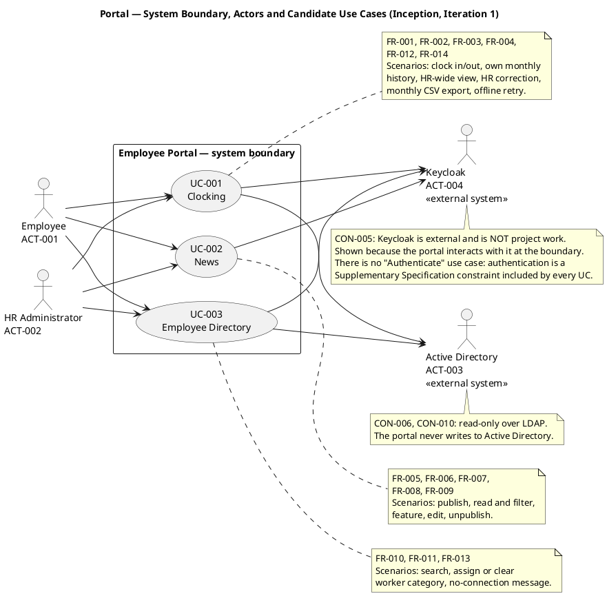

## Document Control

| Field | Value |
|---|---|
| Artifact | Vision — Portal (Employee Portal, Cuba Corp) |
| Phase | Inception |
| Status | Draft — produced for review; milestone NOT YET ACHIEVED |
| Milestone Target | End-of-Inception (not marked complete by this artifact) |
| Iteration / Cycle | 1 / 1 |
| Owner | SystemAnalyst |
| Date | 2026-09-17 |
| Governing process | Development Case (Inception) — Business Modeling INACTIVE; Glossary trigger NOT FIRED |

## Problem Statement

| Aspect | Statement |
|---|---|
| **The problem of** | Recording attendance, distributing internal news and locating colleagues at Cuba Corp |
| **affects** | STK-004 (200 employees across 3 offices), STK-001 (HR Director and the HR function), STK-003 (Infrastructure team, as the operator of the resulting system) |
| **the impact of which is** | Attendance is recorded on shared Excel sheets, so the record is fragmented, manually consolidated and not authoritative; internal news travels by mass email, so it is not discoverable after the fact; colleague contact data lives in an outdated PDF phone list, so finding a phone number or an email address is slow and the list is stale. HR time is consumed by manual consolidation rather than by HR work (BG-001), and there is no auditable record of who changed an attendance entry. |
| **a successful solution would** | Centralise clocking, news and the directory in one internal web application reachable from the corporate browser, so that a clocking is recorded once and authoritatively, news is published once and remains readable, and a colleague's contact data is found in seconds — with every HR intervention on attendance or news carrying an audit trail. |

**Root cause.** The three processes are not broken in their logic; they are broken in their *medium*. Each is currently carried by a document (a spreadsheet, an email, a PDF) that is copied, mailed and re-consolidated by hand. The root cause is the absence of a single authoritative store with a defined owner per datum — not a missing feature, and not a missing process. This is why the solution is a thin web application over existing corporate identity and directory infrastructure rather than a reengineered business process: the process is already understood and already correct, and the Development Case records `business-process-led = false` on exactly this basis.

**Measurable success criteria.** BG-002 (100% of new clockings recorded outside Excel from go-live), BG-003 (80% of the 200 employees using the portal within 3 months), BG-001 (50% reduction in HR management time — see *Assumptions and Dependencies*: the measurement basis is not declared), and AC-001..AC-005.

## Product Position Statement

| Aspect | Statement |
|---|---|
| **For** | Cuba Corp's 200 employees across 3 offices, and the HR function that administers them |
| **Who** | currently record attendance on shared Excel sheets, receive news by mass email, and look up colleagues in an outdated PDF phone list |
| **The product** | Employee Portal |
| **Is** | an internal, responsive web application — no native app — that records clock in/out, publishes and reads HR news, and searches the corporate directory |
| **That** | centralises the three processes in one place, reads corporate employee data directly from Active Directory rather than copying it, and audits every HR intervention on attendance and news |
| **Unlike** | the shared spreadsheet, the mass email and the PDF phone list |
| **Our product** | makes the clocking record authoritative and single-sourced, keeps published news readable and filterable, and answers a colleague lookup in seconds — while adding no new system of record for employee data and no new identity infrastructure |

**Positioning constraint.** The product is deliberately thin at the edges. It does not own employee data (CON-006, CON-020), does not own identity (CON-005), does not own backups (CON-014), and does not own its own production operation (CON-011). Its value is the single authoritative store for the three processes it does own, and the audit trail over the two of them that HR can change.

## Stakeholder Summary

| ID | Stakeholder | Role / interest | Influence | Key need this product must satisfy |
|---|---|---|---|---|
| STK-001 | Laura Gómez | HR Director, project sponsor. Ownership of the HR processes, news publishing and worker-category management is inferred from the HR Director role, not stated by the stakeholder. | High | Publish and manage news without technical assistance (AC-002); monitor attendance across all employees (FR-001); correct or insert a clocking with a defensible audit trail (FR-004, CON-017); export a monthly CSV (FR-014); manage the worker category (FR-011); reduce HR management time (BG-001) |
| STK-002 | Miguel Torres | Software Engineer — does not build the system; clarifies engineering-related doubts for the technical roles | High | The requirements must be stated precisely enough that engineering doubts are answered by the artifacts rather than by re-interviewing the business |
| STK-003 | Infrastructure team | Operates Active Directory and Keycloak (external systems the portal depends on) and operates the portal in production after handover — deployment, monitoring, patching. Low interest in portal features; requires that AD is not modified, and has accepted operating the portal as a .NET application on the internal Windows Server estate they already run. No outstanding concerns: the portal's OIDC client is already registered in Keycloak and its credentials are with the development team, so login can be tested from day one. | High | Active Directory is never written to (CON-010); the portal is operable on the existing Windows Server estate (CON-007, CON-011); no new infrastructure to run (CON-005, CON-014) |
| STK-004 | Cuba Corp Employees | End users — 200 people across 3 offices; clock in/out, read news, search the directory | Medium | Clock in and out unaided (AC-001, AC-004); find a colleague's phone or email in under 10 seconds (AC-003); read news and filter it by category; a clocking made during a network outage is not lost (AC-005) |

**Negative / constraining stakeholders.** STK-003 is the constraining stakeholder: it does not want the product, it wants the product not to add operational burden. Every requirement that would create new infrastructure, a new system of record, or a write path into AD is refused on this basis, and the declared scope refuses them explicitly (CON-005, CON-010, CON-014, CON-020).

## Product Overview

**What the product is.** A single internal web application with three capability areas, each corresponding to one declared system use case:

**System boundary.** Inside: the clocking record and its audit trail, the news item and its audit trail, the worker-category link, and the three capability areas above. Outside: identity (Keycloak, CON-005), employee master data (Active Directory, CON-006), the database instance's backup and restore (CON-014), and production operation (CON-011). The boundary is drawn so that the portal owns exactly one new system of record — the clocking — and one new field about a person — the worker category, stored as a link and never as a copy (CON-020).

**Not in scope.** Each line below is a declared exclusion and is binding on every downstream artifact:

- No native mobile app — responsive web only.
- No push notifications.
- No integration with the payroll system.
- No vacation or sick-leave management — that is a separate system.
- No biometric clocking — AD username/password only.
- No Keycloak work of any kind — already deployed, already federated to AD, maintained by someone else; no realm design, no client provisioning scripts, no Keycloak hosting, and no Keycloak in the deployment diagram as something this project installs.
- No writing back to Active Directory, and no editing of employee fields anywhere in the portal.
- No local copy of the employee — no sync job, no reconciliation screen, no conflict resolution.
- No news archive screen.
- No hard delete of a news item.
- No offline mode beyond the clocking retry — no PWA, no service worker, no installable app, no client cache of the directory or the news.
- No permission model beyond the two levels — no role matrix, no permission administration screen, no rule that reads the worker category to decide what somebody may do.
- No rule that features a news item by itself — no "most recent", no "most read", no expiry date on the banner.
- **No in-portal audit view screen.** The audit trail is written, not read in the portal: it is recorded for compliance and read directly from the database by whoever needs it. (Stakeholder decision, 2026-09-17 — asked whether the portal needs an in-portal audit view screen for HR or whether the audit is recorded for compliance and read directly from the database; the stakeholder answered **No**.)

## Features

Every feature below is a declared requirement, cited by its declared identifier. No feature is added, and none is derived: the declared scope already enumerates the complete functional surface.

**On MoSCoW.** All fourteen are **Must**. The stakeholder declared a fixed, closed scope of fourteen functional requirements and no requirement is optional, so downgrading any of them to Should/Could would misrepresent the declaration. Prioritisation for this project is therefore expressed by *sequencing* (which use case is detailed first, which is architecturally significant), not by MoSCoW downgrade.

| Feature | Capability | MoSCoW | Volatility | Traces to |
|---|---|---|---|---|
| FR-001 | HR views all employee clockings, to monitor attendance and spot issues | Must | Low | STK-001, BG-001 |
| FR-002 | Employee clocks in or out with corporate credentials; the main screen shows Clock In or Clock Out per current status; the press records the exact time and confirms | Must | Low | STK-004, AC-001, AC-004 |
| FR-003 | Employee views own clocking history for the current month | Must | Low | STK-004 |
| FR-004 | HR corrects or inserts a clocking; audited with who, when, previous value and a free-text reason; no self-service correction screen | Must | Medium | STK-001, CON-017, NFR-004 |
| FR-005 | HR publishes internal news with title, body, date and category | Must | Low | STK-001, AC-002 |
| FR-006 | Employees read news on the main page sorted by date, filter by category (General, HR, IT, Events), and see featured news in a banner; read-only, no comments or reactions | Must | Medium | STK-004 |
| FR-007 | HR manually flags a news item as featured, when publishing or when editing; at most one featured at any moment; featuring one un-features the previous; HR may leave none and the banner then does not appear; unpublishing the featured item un-features it with no promotion in its place | Must | Medium | STK-001, CON-018 |
| FR-008 | HR edits a published news item — a typo does not force a republish — and every edit is audited like the original publication | Must | Low | STK-001, NFR-004 |
| FR-009 | HR unpublishes an item, which hides it and never deletes it | Must | Low | STK-001, CON-019, NFR-004 |
| FR-010 | Employee searches the directory by name, department or office; each entry shows name, job title, department, office, email, extension phone and worker category; corporate data only | Must | Medium | STK-004, AC-003, CON-024, R001 |
| FR-011 | HR assigns or clears a worker's category from the directory screen; the only write the portal makes about a person, and it is audited | Must | Medium | STK-001, CON-020, CON-023, NFR-004 |
| FR-012 | The clocking page keeps the press in the browser (localStorage) and retries its POST for up to 5 minutes; the server accepts the client timestamp — the time the employee pressed the button — and rejects duplicates by an idempotency key; beyond 5 minutes the employee reports the clocking to HR | Must | High | STK-004, AC-005, CON-003 |
| FR-013 | The directory and the news show a no-connection message when the network is unavailable; nothing is copied locally, so there is nothing to cache and nothing to sync | Must | Low | STK-004 |
| FR-014 | HR exports a CSV covering one calendar month (00:00 on the first day to 23:59:59 on the last day, Europe/Madrid) with exactly these columns in this order: EmployeeId, FullName, WorkerCategory, Date, ClockIn, ClockOut, HoursWorked, Corrected; timestamps in Europe/Madrid local time | Must | Medium | STK-001, CON-015 |

**Volatility reading (feeds the Software Architect's decomposition).** Three features are **High/Medium** on the axis "will this change for the same customer over time?" and must be encapsulated rather than spread:

- **FR-012 (High)** — the offline retry is the only client-side mechanism in the product and the only place where a client-supplied timestamp and an idempotency key cross the boundary. The 5-minute window, the queue and the duplicate rule are all likely to be revisited once real network behaviour is observed. It must live in one encapsulated place, not be smeared across the clocking page.
- **FR-007 (Medium)** — the "at most one featured" rule is declared as a **system invariant** (CON-018), not a screen convention: it must hold wherever the change comes from. Encapsulating it in one place is what makes the invariant checkable.
- **FR-010 (Medium)** — the directory's attribute set depends on what AD actually holds across the 3 offices (R001). The mapping from AD attributes to displayed fields is the volatile part, not the search.
- **FR-011 (Medium)** — the worker category is a closed four-value list (CON-023) that is explicitly not configurable; the volatility is in the *link* semantics (CON-020), not in the value set.
- **FR-014 (Medium)** — the CSV column set is exact and ordered; downstream consumers of the file make it change-resistant, so it must be produced from one place.

## Assumptions and Dependencies

**Assumptions.**

| # | Assumption | Basis | Consequence if false |
|---|---|---|---|
| A1 | The measurement basis for BG-001's 50% reduction in HR management time is not declared, and no baseline is asserted here. | BG-001 is declared with the target but without a baseline. | BG-001 cannot be verified as stated; a baseline must be declared before the benefit is claimed. Recorded, not invented. |
| A2 | The four news categories named in FR-006 (General, HR, IT, Events) are the complete set for this project. | FR-006 enumerates exactly these four. Unlike the worker category (CON-023), the news category list is not declared closed. | If a fifth news category is needed, it is a Change Request. Flagged as **Volatility: Medium** so the category list is encapsulated and a change is cheap. |
| A3 | The clocking record is the only new system of record this project creates; the worker category is a link, not a record about a person. | CON-020, CON-012. | If the portal were expected to hold employee data, the boundary and the whole data design would change. |
| A4 | The historical Excel sheets remain a read-only archive and are never imported. | CON-012, BG-002. | Any import would be new scope and a new data-migration risk. |

**Dependencies.**

| # | Dependency | Type | State | Risk |
|---|---|---|---|---|
| D1 | Active Directory, read over LDAP for corporate attributes (job title, department, office, email, extension) | External system, read-only | Available; operated by STK-003 (CON-006, CON-010) | **R001** — the attributes may not be filled consistently across the 3 offices, and the portal holds no local copy (CON-020), so a gap in AD is a gap in the directory with no fallback. This is the project's dominant technical risk and the reason the Architectural Proof-of-Concept trigger fired. |
| D2 | Keycloak OIDC client for authentication and for reading roles from claims | External system | Already registered; credentials with the development team, so login is testable from day one (CON-005) | Low. Explicitly not project work. |
| D3 | PostgreSQL instance | External system | Available; covered by the Infrastructure team's existing backup practice with a verified restore test (CON-004, CON-014) | Low. No backup design is in scope. |
| D4 | `docs/inputs/employee-portal-design.html` — mandatory and authoritative for the UI visual layer | Project input, committed | Present (CON-013) | Low. Not pending and needs no confirmation that it will arrive. |
| D5 | Infrastructure team operates the portal in production after handover | Organizational | Accepted (CON-011) | Low. The development team hands over at the end of Transition. |
| D6 | Employee adoption of digital clocking | Organizational | Not yet demonstrated | **R002** — some employees may keep using Excel out of habit. Addressed by communication, not by a feature; measured by BG-003 and AC-004. |

## Constraints

The declared constraints are binding on every downstream artifact. They are listed here by identifier and category; the Supplementary Specification carries the ones that become non-functional requirements and design constraints.

| Category | Constraints | Effect on the product |
|---|---|---|
| Technical | CON-001 (.NET 10), CON-002 (REST API), CON-003 (Razor Pages, no SPA), CON-004 (PostgreSQL), CON-009 (current Chrome and Edge) | Fixes the implementation stack. CON-003 permits a page-level script on an already-rendered page — required by FR-012 — and forbids a client-side framework and router. |
| Architectural | CON-006 (directory read directly from AD over LDAP; Keycloak is not a directory), CON-013 (the supplied design is mandatory and authoritative for the visual layer), CON-020 (worker category stored as a link, two columns, no sync/reconciliation) | Fixes where employee data lives and forbids a local copy. |
| Authentication / authorization | CON-005 (Keycloak external, OIDC client only), CON-016 (two levels from AD group membership; no role matrix, no permission screen, no per-category rule) | Authentication is a cross-cutting constraint, not a use case. |
| Environmental | CON-007 (internal Windows Server, no cloud), CON-008 (no access from outside the corporate network) | Single-node, intranet-only. |
| Operational | CON-010 (AD neither administered nor written by this project), CON-011 (Infrastructure team operates the portal post-handover), CON-014 (backups already covered; no backup design in scope) | No operational deliverables beyond handover. |
| Business rules | CON-012 (no data migration), CON-015 (one timezone; store UTC, display Europe/Madrid), CON-017 (only HR corrects; additive, audited, never overwritten or deleted), CON-018 (featuring is manual; at most one featured — a system invariant), CON-019 (news never hard-deleted), CON-021 (worker category is descriptive and appears in exactly two places), CON-022 (at most one category, may be empty, no invented default), CON-023 (closed list of four categories), CON-024 (corporate data only) | These are the rules the Use-Case Model and the Supplementary Specification must make testable. |

## Other Product Requirements

| Area | Requirement | Basis |
|---|---|---|
| Non-functional requirements | NFR-001 (page load under 3 s), NFR-002 (clocking response under 1 s), NFR-003 (available Mon–Fri 07:00–19:00, fault tolerance within the corporate network; 24/7 not required), NFR-004 (audit trail for news, worker category and clocking corrections) | Carried and quantified in the Supplementary Specification. NFR-004's obligation is discharged by *writing* the audit; there is no in-portal audit view screen (stakeholder decision, 2026-09-17). |
| Applicable standards | OIDC for authentication (CON-005); LDAP for directory reads (CON-006); CSV as the export format (FR-014); Europe/Madrid for display and export, UTC for storage (CON-015) | Supplementary Specification, *Applicable Standards*. |
| Interface requirements | REST API (CON-002); the AD/LDAP read interface (CON-006); the Keycloak OIDC interface (CON-005); the browser interface on current Chrome and Edge (CON-009) | Supplementary Specification, *Interfaces*. |
| Design constraints | The supplied design is authoritative for the visual layer, not only its structure (CON-013) | Supplementary Specification, *Design Constraints*. |
| Licensing | No third-party licensing obligation is declared. | Recorded as N/A in the Supplementary Specification rather than left blank. |
| Acceptance | AC-001..AC-005 | Verified through the Test Case and Test Evaluation Summary artifacts. |

## Traceability

| Element | Traces From | Link Type | Traces To |
|---|---|---|---|
| Vision | STK-001, STK-002, STK-003, STK-004 | Derives | Use-Case Model |
| Vision | BG-001, BG-002, BG-003 | Derives | Use-Case Model |
| Vision | FR-001, FR-002, FR-003, FR-004, FR-005, FR-006, FR-007, FR-008, FR-009, FR-010, FR-011, FR-012, FR-013, FR-014 | Derives | Use-Case Model |
| Vision | NFR-001, NFR-002, NFR-003, NFR-004 | Derives | Supplementary Specification |
| Vision | CON-001, CON-002, CON-003, CON-004, CON-005, CON-006, CON-007, CON-008, CON-009, CON-010, CON-011, CON-012, CON-013, CON-014, CON-015, CON-016, CON-017, CON-018, CON-019, CON-020, CON-021, CON-022, CON-023, CON-024 | Derives | Supplementary Specification |
| Vision | NFR-004; stakeholder decision 2026-09-17 (no in-portal audit view screen) | Derives | Supplementary Specification |
| Vision | R001, R002 | Derives | Risk List |
| Vision | AC-001, AC-002, AC-003, AC-004, AC-005 | Derives | Test Evaluation Summary |
