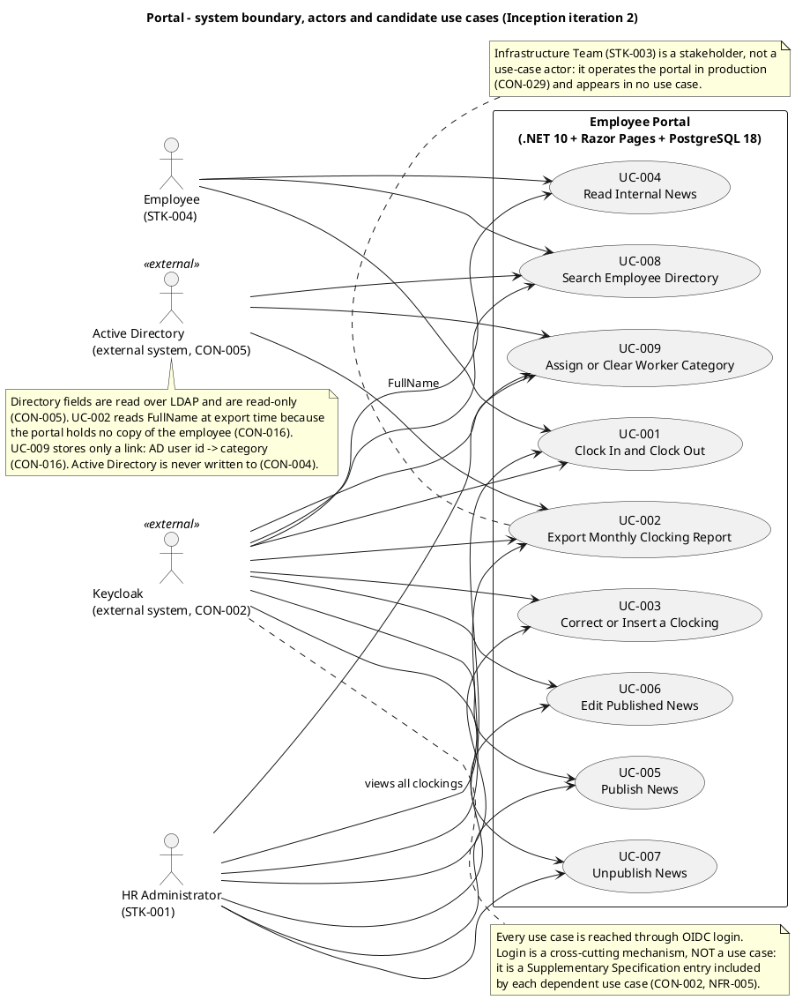

## Document Control
- **Phase:** Inception
- **Status:** Draft — iteration 3
- **Milestone Target:** Lifecycle Objectives (LCO) — end of Inception. NOT YET ACHIEVED.
## Problem Statement
| Aspect | Statement |
|---|---|
| The problem | Cuba Corp records attendance, distributes HR announcements and publishes the corporate phone list through three disconnected manual artefacts: shared Excel clocking sheets, mass emails, and an outdated PDF phone list. |
| Root cause | There is no single system of record for these three activities. Each is maintained by hand in a different medium, so the data is duplicated, stale and unverifiable — and HR spends its time maintaining the medium instead of the process. |
| Affected stakeholders | STK-001 Laura Gómez (HR Director) maintains all three artefacts by hand. STK-004 Cuba Corp Employees (200 people, 3 offices) depend on them and cannot trust the directory or find an announcement. STK-003 Infrastructure operates the identity systems the replacement must rely on. |
| Impact if unsolved | HR management time stays consumed by manual upkeep (BG-001 unachievable); clockings continue to be recorded in Excel (BG-002 unachievable); the directory stays stale and employees keep asking HR for phone numbers (AC-004 unachievable). |
| Success criteria | The verification path is stated per goal, because the three goals are not closed by the same instrument. **BG-001** (HR management time reduced by 50% against the current manual processes) — verified through AC-002, AC-003, AC-004 and AC-006, the criteria that measure HR effort removed from clocking, publishing and directory lookup. **BG-002** (zero new clockings recorded in Excel after go-live) — verified through AC-002 and AC-005. **BG-003** (80% of the 200 employees actively using the portal within 3 months) — measured with STK-004 after go-live, outside the project's test effort: AC-005 is the adoption measure taken with real employees after launch, and no acceptance criterion the team can run closes BG-003. |

## Product Position Statement

| Aspect | Statement |
|---|---|
| For | Cuba Corp employees (STK-004) and the HR Director (STK-001) |
| Who | currently clock in and out on shared Excel sheets, receive announcements by mass email, and look up colleagues in a PDF phone list that is out of date |
| The product | Employee Portal |
| Is | an internal web application, reachable only from the corporate network, that centralizes clock in/out, HR news and the corporate directory in one place |
| That | records clockings as the employee presses the button, publishes news with a full audit trail, and reads the directory live from Active Directory so it is never stale |
| Unlike | the shared Excel sheets, the mass emails and the PDF phone list |
| Our product | gives every employee one authenticated entry point to the three things they need daily, and gives HR a single place to publish, correct and export — with no duplicate of employee data anywhere. |

## Stakeholder Summary

| ID | Stakeholder | Role and interest | Influence | Needs the product must satisfy |
|---|---|---|---|---|
| STK-001 | Laura Gómez | HR Director, project sponsor. Owns the HR processes, news publishing and worker-category management | High | Publish, edit and unpublish news without technical assistance (AC-003); correct or insert a clocking with an audit trail (FR-002); export the monthly CSV (FR-003); assign or clear a worker category (FR-009); stop maintaining Excel and mass emails (BG-001, BG-002) |
| STK-002 | Miguel Torres | Software Engineer. Does not build the system; clarifies engineering-related doubts for the technical roles | High | The declared technical constraints are respected and the engineering questions raised by the technical roles are answered against them |
| STK-003 | Infrastructure Team | Operates Active Directory and Keycloak; has accepted operating the portal as a .NET app on the existing internal Windows Server estate; requires that AD is not modified | High | Active Directory is never written to (CON-004); the portal runs on the existing Windows Server estate (CON-001); the portal is handed over for operation at the end of Transition (CON-029); existing server-backup practice covers the database (CON-032) |
| STK-004 | Cuba Corp Employees | End users — 200 people across 3 offices; clock in/out, read news, search the directory | Medium | Clock in and out without help from HR or the development team (AC-002); find a colleague's phone or email in under 10 seconds (AC-004); complete a clocking with no prior training (AC-005); a clocking made during a network outage of up to 5 minutes is not lost (AC-006) |

## Product Overview
Employee Portal is a single internal web application for Cuba Corp's 200 employees across 3 offices. It replaces three manual artefacts with one authenticated entry point:

- **Clocking** replaces the shared Excel clocking sheets. The employee presses Clock In or Clock Out on the main screen; the portal records the time the button was pressed and shows the confirmation. HR corrects or inserts clockings when needed, and exports the monthly CSV.
- **News** replaces mass emails. HR publishes, edits and unpublishes internal news; employees read it on the main page, sorted by date and filterable by category, with at most one item featured in a banner.
- **Directory** replaces the PDF phone list. Employees search colleagues by name, department or office; the six corporate fields are read live from Active Directory and are read-only, and HR assigns the one field the portal owns — the worker category.

The portal is a .NET 10 application with Razor Pages and a REST API, backed by PostgreSQL 18, running on the internal Windows Server estate. It is an OIDC client of the existing Keycloak, which federates Active Directory. It is reachable only from the internal corporate network.

### Not in scope

Each line below is a declared exclusion. It is published here so that no later iteration re-proposes it as a gap.

- No native mobile app (responsive web only).
- No push notifications.
- No integration with the payroll system.
- No vacation or sick-leave management (separate system).
- No biometric clocking (AD username/password only).
- No Keycloak work of any kind — it is already deployed, already federated to AD, and maintained by someone else: no realm design, no client provisioning scripts, no Keycloak hosting, no Keycloak in the deployment diagram as something we install.
- No writing back to Active Directory, and no editing of employee fields anywhere in the portal.
- No local copy of the employee; no sync job, no reconciliation screen, no conflict resolution.
- No news archive screen.
- No hard delete of a news item.
- No offline mode beyond the clocking retry; no PWA, no service worker, no installable app, no client cache of the directory or the news.
- No permission model beyond the two levels; no role matrix, no permission administration screen, no rule that reads the worker category to decide what somebody may do.
- No rule that features a news item by itself — no 'most recent', no 'most read', no expiry date on the banner.

## Features
Every feature below is a declared requirement (FR-001..FR-009). No feature is added that the stakeholder did not declare. Volatility is the Use-Case Model's annotation, restated here so the Architect reads one value: High means the mechanism is likely to change and must be encapsulated in a dedicated component.

| Feature | Description | Success criterion | Priority | Volatility |
|---|---|---|---|---|
| FR-001 Clock In and Clock Out | Employee logs in with corporate credentials (AD via Keycloak). The main screen shows a Clock In or Clock Out button depending on current status; pressing it records the exact time and shows a confirmation. The employee can view their clocking history for the current month. HR can view all employees' clockings and export a monthly CSV report. | AC-002 (clock in/out without help), AC-005 (80% complete a clocking with no training), AC-006 (a clocking during a 5-minute outage is not lost) | Must | High |
| FR-002 HR Corrects or Inserts a Clocking | Only HR corrects or inserts a clocking. The correction is audited: who corrected it, when, the previous value, and a free-text reason. The original record is never overwritten in place and never deleted. There is no self-service correction screen for the employee. | NFR-004 audit entry present for every correction; CON-012 invariant holds | Must | Low |
| FR-003 HR Exports Monthly Clocking Report (CSV) | HR exports a CSV covering one calendar month (Europe/Madrid) with exactly the columns EmployeeId, FullName, WorkerCategory, Date, ClockIn, ClockOut, HoursWorked, Corrected, in that order, with the declared formats and row rules. | The exported file matches the declared column set, order, formats and row rules for a month with complete, incomplete and corrected days | Must | Medium |
| FR-004 Read Internal News | Employees see HR-published news (title, body, date, category) on the main page sorted by date, filterable by category (General, HR, IT, Events). Featured news appears with a banner at the top. Read-only for employees — no comments or reactions. | An employee sees the published items sorted by date and can filter by category; the featured item appears in the banner | Must | Low |
| FR-005 HR Publishes News | HR publishes internal news and announcements (title, body, date, category). HR may manually flag an item as featured when publishing; featuring is never automatic. Publication is audited (author + timestamp). | AC-003 (HR publishes without technical assistance); NFR-004 audit entry present; CON-009 invariant holds | Must | Low |
| FR-006 HR Edits Published News | HR can edit a news item after publishing. Every edit is audited exactly like the original publication (who and when). HR may also change the featured flag when editing. | NFR-004 audit entry present for every edit; CON-009 invariant holds after a featured-flag change | Should | Low |
| FR-007 HR Unpublishes News | HR can unpublish a news item, which hides it and never deletes it. Unpublishing is audited (who and when). Unpublishing the featured item also un-features it — the banner disappears and no other item is promoted in its place. | The item is hidden and still present in the database; NFR-004 audit entry present; the banner is empty after un-featuring the featured item | Should | Low |
| FR-008 Search Employee Directory | Employee searches colleagues by name, department, or office. Each entry shows name, job title, department, office, email, extension phone number, and worker category. The first six fields come from Active Directory (read-only); worker category is the only field the portal owns. No private personal information is shown — corporate data only. | AC-004 (a colleague's phone/email found in under 10 seconds); an entry with an empty job title or extension still renders (R002) | Must | High |
| FR-009 HR Assigns or Clears Worker Category | HR assigns one category (or clears it) to an employee from the directory screen. This is the only write the portal makes about a person, and it is audited. The category is stored as a link (AD user id → category), never as a duplicate of the employee. | NFR-004 audit entry present; CON-014 closed list of four values enforced; CON-015 (at most one, may be empty) holds; CON-016 (link only) holds | Should | Low |

**Why FR-001 and FR-008 are High.** FR-001 carries AC-006's client-side retry with a client-supplied timestamp and an idempotency key, plus the clocking page's page-level script (CON-023) — the mechanism is the most likely thing to change. FR-008 reads LDAP attributes that R002 says are inconsistently filled across the three offices, so its behaviour against incomplete data is volatile. Both must be encapsulated in dedicated components rather than spread through the application.
## Assumptions and Dependencies

| ID | Type | Statement |
|---|---|---|
| CON-002 | Dependency | The portal is an OIDC client of the existing Keycloak, which federates Active Directory. Keycloak is not ours to deploy. |
| CON-003 | Assumption | The OIDC client is already registered in Keycloak and its credentials are with the development team — login can be tested from day one; there is no request to raise, no queue to wait on and no gate. |
| CON-005 | Dependency | Employee directory fields are read from Active Directory over LDAP and are read-only in the portal. |
| CON-008 | Assumption | All three offices are in the same timezone (Europe/Madrid). Clockings are stored in UTC and displayed in Europe/Madrid. There is no multi-timezone case. |
| CON-025 | Dependency | Keycloak runs inside the corporate network; the OIDC redirect is an intra-network call and login keeps working with no internet link. |
| CON-028 | Dependency | The team works against stand-ins it controls — a test OIDC issuer and a test directory carrying the declared attributes, including entries whose job title or extension is empty. Validation against the real Keycloak and real AD is human work by Infrastructure with HR, and its feedback reaches the team before Elaboration closes. |
| CON-029 | Dependency | The Infrastructure team operates the portal in production once it is live — deployment, monitoring and patching. The development team hands over at the end of Transition. |
| CON-030 | Assumption | There is no data migration. The portal starts empty and records clockings from go-live onwards. The historical Excel sheets stay on the shared drive as a read-only archive and are not imported. |
| CON-031 | Dependency | The custom design at `docs/inputs/employee-portal-design.html` is mandatory and authoritative for the UI visual layer. It is committed to the repository with the project inputs. |
| CON-032 | Dependency | The Infrastructure team's existing server-backup practice already covers this PostgreSQL instance in restorable form, confirmed in writing with a verified restore test. |
| R001 | Risk | The portal depends on Active Directory and Keycloak, both operated by Infrastructure; a change on their side breaks the portal. Accepted in advance (CON-021). |
| R002 | Risk | The LDAP attributes the directory reads may not be filled consistently across the 3 offices (job title, extension). If not tested early the directory shows gaps. |
| R003 | Risk | Some employees may keep using Excel out of habit if the change is not communicated well. |

## Constraints

| ID | Category | Constraint |
|---|---|---|
| CON-001 | Technical | The portal is a .NET application running on the internal Windows Server estate already operated by Infrastructure. |
| CON-004 | Technical | Active Directory must not be modified by this project. |
| CON-006 | Technical | Corporate browsers: current Chrome and Edge. |
| CON-007 | Operational | The portal is accessible only from the internal corporate network. |
| CON-022 | Technical | Backend: .NET 10 exposing a REST API. |
| CON-023 | Technical | Frontend: Razor Pages — an intranet app, no SPA needed. No client-side framework and no client-side router; a page-level script on an already-rendered page is Razor Pages as normal. |
| CON-024 | Technical | Database: PostgreSQL 18 — the latest stable major at project start. The patch level floats; the major is pinned. |
| CON-025 | Architectural | Keycloak runs inside the corporate network. External to this project is not the same as external to the network. |
| CON-026 | Technical | CI: build and test run on the hosted SCM provider's CI. 'No cloud' and 'internal network only' govern the portal at runtime, not the development toolchain. CI never holds production data or credentials, and never deploys. |
| CON-009 | BusinessRule | At most one news item is featured at any moment — featuring one un-features the previous. A system invariant that must hold wherever the change comes from. |
| CON-010 | BusinessRule | A clocking pair never crosses midnight. A clocking still open at midnight is an incomplete day. |
| CON-011 | BusinessRule | At most one clocking pair per employee per calendar day. |
| CON-012 | BusinessRule | Only HR corrects or inserts clockings; the original record is never overwritten in place and never deleted. |
| CON-013 | BusinessRule | Worker category is descriptive and does NOT drive access control. It is used in exactly two places: as a column of the directory (which it also filters) and as a column of the CSV export. |
| CON-014 | BusinessRule | Worker categories are a closed list of exactly four values: Full-time, Part-time, Contractor, Intern. Not configurable; no fifth value without a Change Request. |
| CON-015 | BusinessRule | A worker has at most one category and it may be empty. No default value is invented. |
| CON-016 | BusinessRule | Employee data has exactly one home (Active Directory). The portal stores only a link (AD user id → category). |
| CON-017 | BusinessRule | News is never deleted, only unpublished. |
| CON-018 | BusinessRule | The audit is read directly from the database; there is no in-portal audit view screen. |
| CON-019 | Regulatory | No external compliance regime applies to the audit, and no retention period is mandated. |
| CON-020 | Operational | A risk the team identifies is numbered in the same series as the business-declared risks (R003 onwards, in the order raised). |
| CON-021 | Operational | Risk acceptance granted in advance by Laura Gómez: R001, R002 and every risk the team identifies whose mechanism is set by these constraints or lies outside the team's control and that cannot be transferred, are ACCEPTED, provided the treatment never cuts or defers declared scope. |
| CON-027 | Operational | There is no budget or cap on token spend, and none is to be set by the team. Declared scope is never cut or deferred to fit an estimate. |
| CON-028 | Technical | The team works with Keycloak and AD against stand-ins, never against the real ones. Placeholder values held in configuration, never in code. |
| CON-029 | Operational | The Infrastructure team operates the portal in production once it is live. |
| CON-030 | Operational | Data migration: there is none. |
| CON-031 | Technical | The custom design at `docs/inputs/employee-portal-design.html` is MANDATORY and authoritative for the UI visual layer. |
| CON-032 | Operational | Backups: the Infrastructure team's existing server-backup practice already covers this PostgreSQL instance. |

## Other Product Requirements

### Non-functional requirements

| ID | Requirement | Category |
|---|---|---|
| NFR-001 | The page must load in under 3 seconds on the corporate network, measured as the full page load the employee experiences (browser request to page displayed and usable, including the clocking page's script). | Performance |
| NFR-002 | The clock in/out operation must respond in under 1 second. | Performance |
| NFR-003 | Available during extended working hours Monday–Friday 07:00–19:00, with fault tolerance within the corporate network. 24/7 is not required. | Reliability |
| NFR-004 | Mandatory traceability: who publishes each news item, who edits it and who unpublishes it (author + timestamp in every case); any change to a worker's category; and every clocking HR corrects or inserts (who, when, previous value, reason). The audit is written for compliance and read directly from the database. | Functionality |
| NFR-005 | Two authorization levels, derived from Active Directory group membership: members of the HR AD group publish/edit/unpublish news and manage worker categories; everyone else is an employee with read access to the directory and news plus their own clockings. No role matrix, no permission screen, no per-category rule. | Functionality |

### Acceptance criteria

| ID | Criterion |
|---|---|
| AC-001 | The full page load as the employee experiences it — browser request to page displayed and usable, including the clocking page's script — is the acceptance criterion for the performance requirement (under 3 seconds). Server response time is the engineering target that makes it achievable, not a substitute for it. |
| AC-002 | An employee can clock in and out without help from HR or the development team. |
| AC-003 | An HR Administrator can publish a news item without technical assistance. |
| AC-004 | Any employee finds a colleague's phone/email in under 10 seconds. |
| AC-005 | 80% of employees complete at least one clocking with no prior training. |
| AC-006 | A clocking made while the corporate network is down for up to 5 minutes is not lost: the clocking page keeps the press in the browser (localStorage) and retries its POST for up to 5 minutes. The server accepts the timestamp the client sends — the time the employee pressed the button — and rejects duplicates by an idempotency key. This applies to clocking only; the directory and the news show a 'no connection' message. Beyond 5 minutes the employee reports the clocking to HR. |

### Business goals

| ID | Goal |
|---|---|
| BG-001 | Reduce HR management time by 50%, measured against the current manual processes (Excel clocking sheets, mass emails, PDF directory). |
| BG-002 | Eliminate 100% of Excel usage for recording new clockings: no new clocking is recorded in Excel after go-live. |
| BG-003 | 80% employee adoption within 3 months: 80% of the 200 employees actively using the portal within 3 months of launch. |

## Traceability
Every row below ends in a trace-graph element identifier, never a document section. One edge is registered per row.

| Element | Traces From | Link Type | Traces To |
|---|---|---|---|
| STK-001 | — | Refines | FR-002, FR-003, FR-005, FR-006, FR-007, FR-009 |
| STK-004 | — | Refines | FR-001, FR-004, FR-008 |
| BG-001 | — | Refines | FR-003 |
| BG-002 | — | Refines | FR-001 |
| BG-003 | — | Refines | AC-005 |
| FR-001 Clock In and Clock Out | STK-004, BG-002 | Derives | UC-001 |
| FR-002 HR Corrects or Inserts a Clocking | STK-001, CON-012 | Derives | UC-003 |
| FR-003 HR Exports Monthly Clocking Report (CSV) | STK-001, BG-001 | Derives | UC-002 |
| FR-004 Read Internal News | STK-004 | Derives | UC-004 |
| FR-005 HR Publishes News | STK-001, CON-009 | Derives | UC-005 |
| FR-006 HR Edits Published News | STK-001, NFR-004 | Derives | UC-006 |
| FR-007 HR Unpublishes News | STK-001, CON-017 | Derives | UC-007 |
| FR-008 Search Employee Directory | STK-004, CON-005, R002 | Derives | UC-008 |
| FR-009 HR Assigns or Clears Worker Category | STK-001, CON-014, CON-015, CON-016 | Derives | UC-009 |
| NFR-001 Page Load Performance | AC-001 | Derives | COMP-001 |
| NFR-002 Clock In/Out Response Time | AC-001 | Derives | COMP-004 |
| NFR-003 Availability Window | CON-007 | Derives | — not yet minted |
| NFR-004 Audit Trail | CON-018, CON-019 | Derives | COMP-009 |
| NFR-005 Authorization Model | CON-002, CON-013 | Derives | COMP-010 |
| AC-006 Offline clocking retry | CON-023, CON-028 | Derives | COMP-003 |
| R001 | CON-020, CON-021 | DependsOn | UC-001, UC-008, COMP-010 |
| R002 | CON-020, CON-021 | DependsOn | UC-002, UC-008, COMP-006 |
| R003 | CON-020, CON-021 | DependsOn | UC-001 |

**NFR-003 — downstream element not yet minted.** The Software Architect's component view assigns no component to the availability window, and the Test Designer's `TC-NNN` do not exist. No element-level edge is claimed for it; the edge is registered when that element is minted. The graph carries an artifact-level edge `NFR-003 → Supplementary Specification`, which records that the Supplementary Specification elaborates the requirement in its Reliability category — containment, not a design or test element, and not claimed as a trace endpoint here.

**BG-003's verification path.** BG-003 is measured with STK-004 after go-live, outside the project's test effort. AC-005 is the adoption measure taken with real employees after launch; no acceptance criterion the team can run closes BG-003. The row records the goal's own downstream element, not a claim that a test closes it.

**Label scope.** `STK-`, `BG-`, `FR-`, `NFR-`, `AC-`, `CON-` and `R` identifiers are declared identifiers, copied exactly. Every entry in the Traces To column is a trace-graph element identifier (`UC-NNN`, `COMP-NNN`, `FR-NNN`, `AC-NNN`) or an explicit not-yet-minted statement — no document section and no artifact name appears in it. `UC-NNN` is this role's, `COMP-NNN` is the Software Architect's, `TC-NNN` is the Test Designer's; none is minted here.
