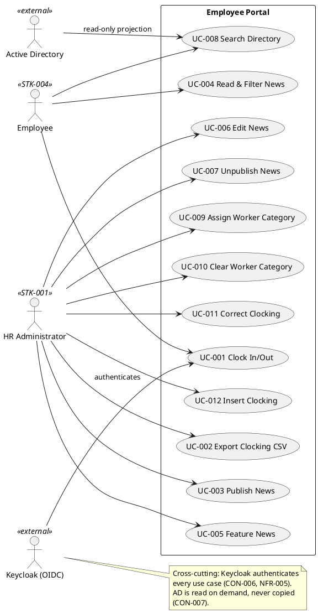

## Document Control

| Field | Value |
|---|---|
| Phase | Inception |
| Status | Draft |
| Milestone Target | End-of-Inception (Lifecycle Objectives) — NOT YET ACHIEVED |

## Problem Statement

| Aspect | Description |
|---|---|
| The problem | Cuba Corp (200 employees, 3 offices) manages employee clocking, HR news publication, and the corporate directory through shared Excel sheets, mass emails, and an outdated PDF. |
| Who is affected | HR (STK-001) spends disproportionate time on manual administration; employees (STK-004) lack a single reliable place to clock in/out, read announcements, and find colleagues. |
| Impact | Manual clocking is error-prone and unauditable; news reaches employees inconsistently; the directory is stale and hard to search. |
| Root cause | No single internal web application centralizes these three functions; data lives in disconnected, non-authoritative artifacts. |
| Success criteria | BG-001 (HR time −50%), BG-002 (0% Excel for new clockings), BG-003 (80% adoption in 3 months), plus AC-001…AC-005. |

## Product Position Statement

| For | Cuba Corp employees and HR administrators |
|---|---|
| Who | need to clock in/out, publish and read internal news, and find colleagues |
| The Employee Portal | is an internal web application |
| That | centralizes clocking, HR news, and the corporate directory in one corporate-browser-accessible app |
| Unlike | shared Excel sheets, mass emails, and an outdated PDF |
| Our product | provides audited clocking, audited news publication, and a live directory projected from Active Directory — with no data duplication |

## Stakeholder Summary

| ID | Name | Role | Influence | Key Needs |
|---|---|---|---|---|
| STK-001 | Laura Gómez | HR Director (project sponsor) | High | Reduce HR administration time; audited clocking corrections/insertions; audited news and category management; CSV export |
| STK-002 | Miguel Torres | Software Engineer (technical clarifier) | High | Engineering clarity on integration boundaries (Keycloak, AD) and constraints |
| STK-003 | Infrastructure team | Operates AD and Keycloak; operates portal post-launch | High | Portal consumes AD/Keycloak without writing to them; clean handover at end of Transition |
| STK-004 | Cuba Corp Employees | End users (200 people, 3 offices) | Medium | Simple clock in/out, readable news, fast colleague lookup |

## Product Overview

The Employee Portal is a single internal web application (Razor Pages frontend, .NET 10 REST API, PostgreSQL) accessible from the corporate browser. It delivers three functional areas:

1. **Clocking** — employee clock in/out with current-month history; HR correction, insertion, and monthly CSV export.
2. **HR News** — publish, edit, unpublish, feature, and read/filter news, fully audited.
3. **Directory** — search colleagues by name/department/office; HR manages the worker-category field.

Authentication is delegated to Keycloak (OIDC); authorization derives from AD group membership (two levels: HR vs. employee). Employee data is read from AD on demand and never copied into the portal database — the portal stores only the `AD user id → worker category` mapping.

### Not in scope

- Native mobile app, push notifications
- Payroll integration
- Vacation / sick-leave management
- Biometric clocking
- Any Keycloak infrastructure work (external system we consume)
- Writing to AD or editing employee fields
- Local copy of employee data (no sync/reconciliation)
- News archive screen
- Hard delete of news
- Offline mode beyond clocking retry (no PWA/service worker/client cache)
- Permission model beyond two levels
- Automatic news featuring

### System boundary and actors

## Features

| Feature | Description | Traces To |
|---|---|---|
| F-001 Clock In/Out | Employee clocks in/out with corporate credentials; main screen shows the correct button; records exact press time; shows current-month history | FR-001 |
| F-002 Clocking CSV Export | HR exports a monthly CSV (Europe/Madrid, exact column order) | FR-002 |
| F-003 News Publication | HR publishes audited news (title, body, date, category) | FR-003 |
| F-004 News Reading & Filtering | Employees read news newest-first, filter by category, see featured banner | FR-004 |
| F-005 News Featuring | HR manually features at most one item; featuring un-features the previous | FR-005 |
| F-006 News Editing | HR edits a published item; every edit audited like publication | FR-006 |
| F-007 News Unpublishing | HR hides (never deletes) a news item | FR-007 |
| F-008 Directory Search | Employee searches colleagues; six AD fields + worker category shown | FR-008 |
| F-009 Worker Category Assignment | HR assigns one of four closed-list categories, audited | FR-009 |
| F-010 Worker Category Clearing | HR clears a category, leaving the field blank, audited | FR-010 |
| F-011 Clocking Correction | HR corrects a clocking; audited (who, when, previous value, reason); original never overwritten | FR-011 |
| F-012 Clocking Insertion | HR inserts a missing clocking; audited (who, when, reason); original never overwritten | FR-012 |

## Assumptions and Dependencies

| # | Assumption / Dependency | Basis |
|---|---|---|
| A-001 | Keycloak is already running and maintained separately; the portal is an OIDC client only | CON-006 |
| A-002 | Employee data is read from AD on demand, never copied; portal stores only `AD user id → worker category` | CON-007 |
| A-003 | All three offices share Europe/Madrid timezone; clockings stored UTC, displayed Europe/Madrid | CON-014 |
| A-004 | Backups are covered by Infrastructure's existing server-backup practice (verified restore test) | CON-013 |
| A-005 | The custom design at docs/inputs/employee-portal-design.html is authoritative for the UI visual layer | CON-008 |

## Constraints

| ID | Category | Constraint |
|---|---|---|
| CON-001 | Technical | Backend: .NET 10, REST API |
| CON-002 | Technical | Frontend: Razor Pages (no SPA, no client-side router) |
| CON-003 | Technical | Database: PostgreSQL |
| CON-004 | Technical | Hosting: internal Windows Server (no cloud) |
| CON-005 | Technical | Compatible with current Chrome and Edge |
| CON-006 | Architectural | Keycloak is an OIDC client dependency only — not part of this project |
| CON-007 | Architectural | Employee data read from AD on demand, never copied |
| CON-008 | Architectural | Custom design (docs/inputs/employee-portal-design.html) is mandatory and authoritative |
| CON-009 | Operational | No access from outside the corporate network |
| CON-010 | Operational | AD operated by Infrastructure; project neither administers nor writes to it |
| CON-011 | Operational | Infrastructure operates the portal post-launch; dev team hands over at end of Transition |
| CON-012 | Operational | No data migration; portal starts empty; historical Excel stays read-only archive |
| CON-013 | Operational | Backups covered by Infrastructure's existing practice |
| CON-014 | BusinessRule | Single timezone (Europe/Madrid); clockings UTC storage, local display |
| CON-015 | BusinessRule | At most one featured news item (invariant) |
| CON-016 | BusinessRule | Worker categories: closed list of exactly four values |
| CON-017 | BusinessRule | Worker category is descriptive only — does not drive access control |
| CON-018 | BusinessRule | At most one category per worker; may be empty; no default |
| CON-019 | BusinessRule | Original clocking never overwritten/deleted; corrections audited |
| CON-020 | BusinessRule | News never hard-deleted; unpublish hides |
| CON-021 | BusinessRule | Server accepts client timestamp; idempotency key rejects duplicates (clocking only) |

## Other Product Requirements

| ID | Category | Requirement |
|---|---|---|
| NFR-001 | Performance | Pages load < 3s on corporate network |
| NFR-002 | Performance | Clock in/out responds < 1s |
| NFR-003 | Reliability | Availability Mon–Fri 7:00–19:00; 24/7 not required |
| NFR-004 | Functionality (audit) | Mandatory audit of news publication/edit/unpublish, category changes, clocking corrections/insertions |
| NFR-005 | Functionality (authorization) | Two-level authorization from AD group membership (HR vs. employee) |

## Traceability

| Element | Traces From | Link Type | Traces To |
|---|---|---|---|
| F-001 | FR-001 | Derives | UC-001 |
| F-002 | FR-002 | Derives | UC-002 |
| F-003 | FR-003 | Derives | UC-003 |
| F-004 | FR-004 | Derives | UC-004 |
| F-005 | FR-005 | Derives | UC-005 |
| F-006 | FR-006 | Derives | UC-006 |
| F-007 | FR-007 | Derives | UC-007 |
| F-008 | FR-008 | Derives | UC-008 |
| F-009 | FR-009 | Derives | UC-009 |
| F-010 | FR-010 | Derives | UC-010 |
| F-011 | FR-011 | Derives | UC-011 |
| F-012 | FR-012 | Derives | UC-012 |
| NFR-001…NFR-005 | Declared input | — | Supplementary Specification |
