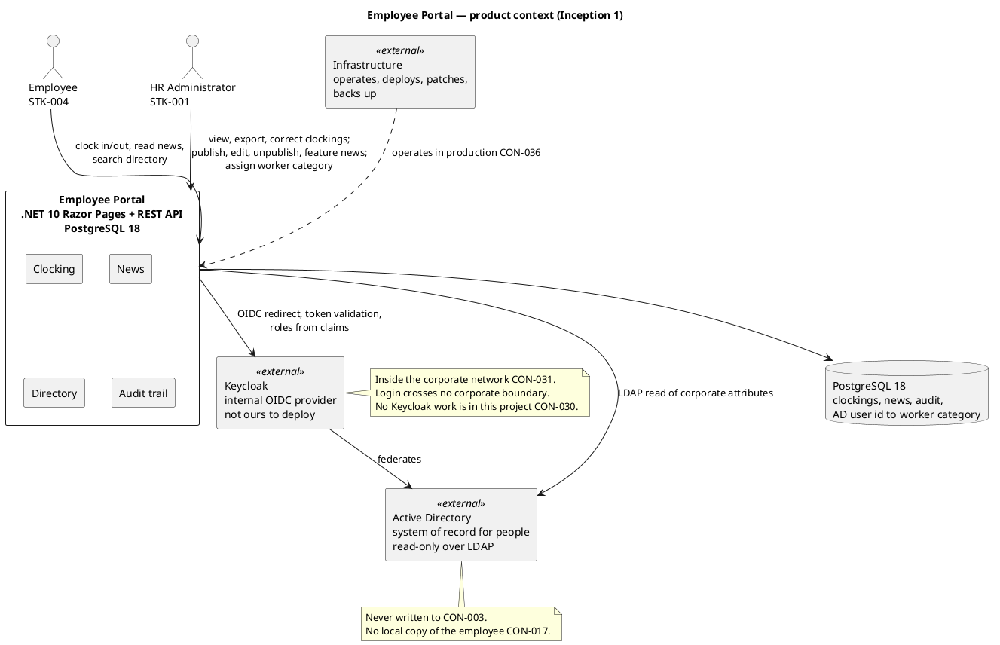
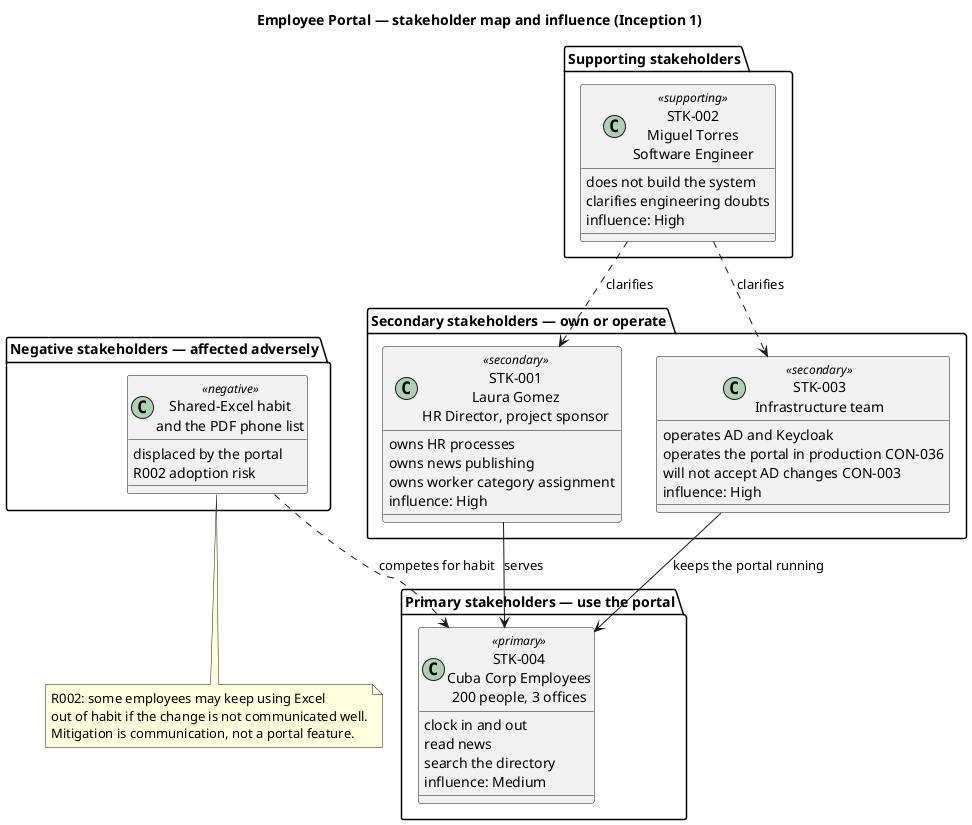
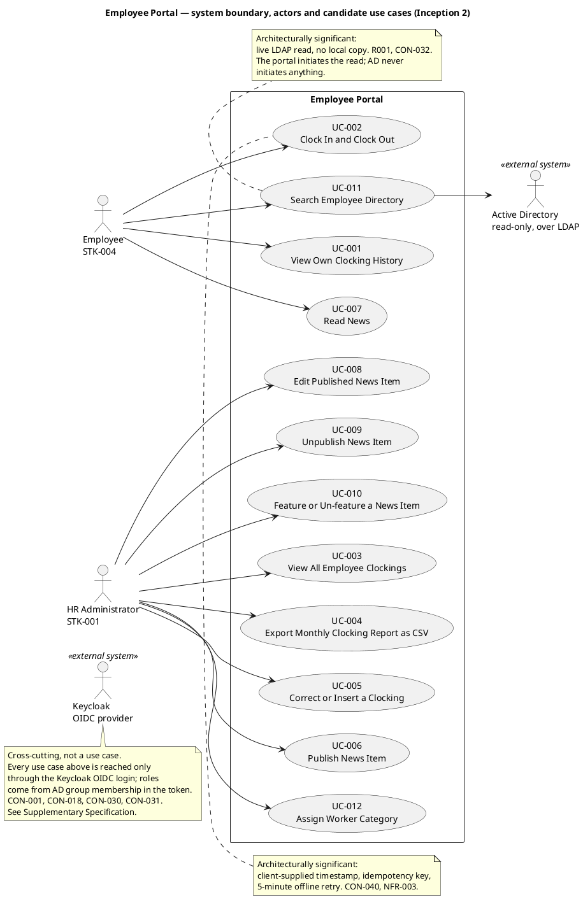
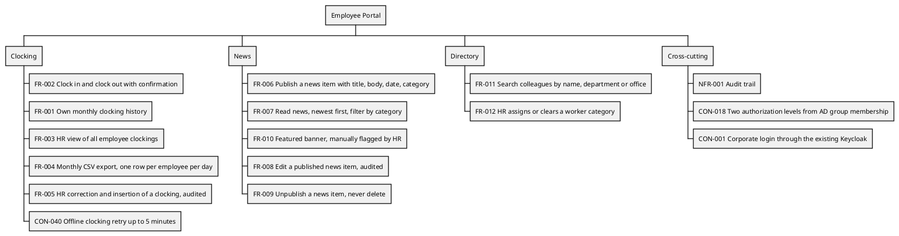

## Document Control
- **Phase:** Inception
- **Status:** Draft — under review
- **Milestone Target:** End of Inception (not yet achieved)
- **Iteration:** 2, Cycle 1
- **Owner:** SystemAnalyst
- **Date:** 2026-10-07
## Problem Statement

Cuba Corp runs three internal processes on fragmented manual tooling: employee clock-in/clock-out is collected on shared Excel sheets, internal news is distributed by mass email, and the corporate phone list is an outdated PDF. The three processes have no common home, no single source of truth and no audit trail.

| Aspect | Statement |
|---|---|
| The problem | Clocking data is collected by hand from shared Excel sheets, so HR spends time chasing and consolidating entries and no clocking is traceable to a source. News reaches employees as mass email, so it is neither navigable nor filterable and there is no record of who published what. The directory is a PDF that goes stale the moment a job title or extension changes. |
| Affected stakeholders | STK-001 (HR Director — owns the three processes and absorbs the manual effort), STK-004 (200 employees across 3 offices — the current tooling is slow and unreliable for them), STK-003 (Infrastructure — must not be asked to modify AD, and must not take on a new kind of platform). |
| Impact | HR effort is spent on collection and consolidation rather than on HR work (BG-001). New clockings keep landing in Excel (BG-002). Employees cannot find a colleague's phone or email quickly (AC-004). |
| Root cause | There is no single web application that owns these three processes. Each is handled by a different manual artefact, none of which is authoritative, auditable or reachable from the corporate browser. |
| Success criteria | BG-001 HR management time reduced by 50% against current effort. BG-002 no new clocking recorded in a shared Excel sheet once live. BG-003 80% of the 200 employees actively using the portal within 3 months of go-live. Verified by AC-001 to AC-006. |

## Product Position Statement

```plantuml
@startuml
title Employee Portal — product context (Inception 1)

skinparam componentStyle rectangle

actor "Employee\nSTK-004" as EMP
actor "HR Administrator\nSTK-001" as HR

component "Employee Portal\n.NET 10 Razor Pages + REST API\nPostgreSQL 18" as PORTAL {
  component "Clocking" as C1
  component "News" as C2
  component "Directory" as C3
  component "Audit trail" as C4
}

component "Keycloak\ninternal OIDC provider\nnot ours to deploy" as KC <<external>>
component "Active Directory\nsystem of record for people\nread-only over LDAP" as AD <<external>>
database "PostgreSQL 18\nclockings, news, audit,\nAD user id to worker category" as DB
component "Infrastructure\noperates, deploys, patches,\nbacks up" as INFRA <<external>>

EMP --> PORTAL : clock in/out, read news,\nsearch directory
HR --> PORTAL : view, export, correct clockings;\npublish, edit, unpublish, feature news;\nassign worker category
PORTAL --> KC : OIDC redirect, token validation,\nroles from claims
KC --> AD : federates
PORTAL --> AD : LDAP read of corporate attributes
PORTAL --> DB
INFRA ..> PORTAL : operates in production CON-036

note right of KC
  Inside the corporate network CON-031.
  Login crosses no corporate boundary.
  No Keycloak work is in this project CON-030.
end note

note bottom of AD
  Never written to CON-003.
  No local copy of the employee CON-017.
end note
@enduml
```

| Aspect | Statement |
|---|---|
| For | Cuba Corp employees and the HR Director, across 3 offices and 200 people. |
| Who | Currently record clockings on shared Excel sheets, receive news by mass email and consult a stale PDF phone list. |
| The product | Employee Portal is an internal web application, reachable from the corporate browser, that owns clocking, internal news and the employee directory. |
| That | Records clock in/out with confirmation and own monthly history, lets HR view, export and correct clockings, lets HR publish, edit, unpublish and feature news that employees read and filter, and lets any employee search colleagues by name, department or office — with an audit trail over every change. |
| Unlike | The shared Excel sheets, the mass-email distribution and the PDF phone list, which are separate, manual, unauditable and stale. |
| Our product | Centralizes the three processes in one application, reads people data live from Active Directory so it cannot go stale, and records every change to clockings, news and worker category in an audit trail. |

## Stakeholder Summary

```plantuml
@startuml
title Employee Portal — stakeholder map and influence (Inception 1)

skinparam classAttributeIconSize 0

package "Primary stakeholders — use the portal" as PRIM {
  class "STK-004\nCuba Corp Employees\n200 people, 3 offices" as S4 <<primary>> {
    clock in and out
    read news
    search the directory
    influence: Medium
  }
}

package "Secondary stakeholders — own or operate" as SEC {
  class "STK-001\nLaura Gomez\nHR Director, project sponsor" as S1 <<secondary>> {
    owns HR processes
    owns news publishing
    owns worker category assignment
    influence: High
  }
  class "STK-003\nInfrastructure team" as S3 <<secondary>> {
    operates AD and Keycloak
    operates the portal in production CON-036
    will not accept AD changes CON-003
    influence: High
  }
}

package "Supporting stakeholders" as SUP {
  class "STK-002\nMiguel Torres\nSoftware Engineer" as S2 <<supporting>> {
    does not build the system
    clarifies engineering doubts
    influence: High
  }
}

package "Negative stakeholders — affected adversely" as NEG {
  class "Shared-Excel habit\nand the PDF phone list" as N1 <<negative>> {
    displaced by the portal
    R002 adoption risk
  }
}

S1 --> S4 : serves
S3 --> S4 : keeps the portal running
S2 ..> S1 : clarifies
S2 ..> S3 : clarifies
N1 ..> S4 : competes for habit

note bottom of N1
  R002: some employees may keep using Excel
  out of habit if the change is not communicated well.
  Mitigation is communication, not a portal feature.
end note
@enduml
```

| ID | Stakeholder | Role | Interest | Influence | What they need from the portal |
|---|---|---|---|---|---|
| STK-001 | Laura Gómez | HR Director, project sponsor | High | High | Clocking data collected without manual consolidation; a monthly CSV she can key by EmployeeId; news she can publish, correct and retract herself; worker category she can assign from the directory screen. |
| STK-002 | Miguel Torres | Software Engineer | Low | High | Does not build the system. Clarifies engineering-related doubts for the technical roles. |
| STK-003 | Infrastructure team | Operates AD and Keycloak | Low | High | Not to be asked to modify AD (CON-003); not to take on a new kind of platform — the portal is a .NET application on the Windows Server estate they already run (CON-002); to operate it in production after handover (CON-036). |
| STK-004 | Cuba Corp Employees | End users, 200 people, 3 offices | High | Medium | Clock in and out in one press with confirmation; read news and filter by category; find a colleague's phone and email in under 10 seconds (AC-004). |

## Product Overview
The portal is a single .NET 10 web application (Razor Pages front end, REST API back end, PostgreSQL 18) reachable only from the internal corporate network on current Chrome and Edge. It authenticates through the existing Keycloak as an OIDC client and reads people data live from Active Directory over LDAP. It owns three processes and the audit trail they require.

```plantuml
@startuml
title Employee Portal — system boundary, actors and candidate use cases (Inception 2)

left to right direction
skinparam packageStyle rectangle

actor "Employee\nSTK-004" as EMP
actor "HR Administrator\nSTK-001" as HR
actor "Active Directory\nread-only, over LDAP" as AD <<external system>>
actor "Keycloak\nOIDC provider" as KC <<external system>>

rectangle "Employee Portal" {
  usecase "UC-001\nView Own Clocking History" as UC001
  usecase "UC-002\nClock In and Clock Out" as UC002
  usecase "UC-003\nView All Employee Clockings" as UC003
  usecase "UC-004\nExport Monthly Clocking Report as CSV" as UC004
  usecase "UC-005\nCorrect or Insert a Clocking" as UC005
  usecase "UC-006\nPublish News Item" as UC006
  usecase "UC-007\nRead News" as UC007
  usecase "UC-008\nEdit Published News Item" as UC008
  usecase "UC-009\nUnpublish News Item" as UC009
  usecase "UC-010\nFeature or Un-feature a News Item" as UC010
  usecase "UC-011\nSearch Employee Directory" as UC011
  usecase "UC-012\nAssign Worker Category" as UC012
}

EMP --> UC001
EMP --> UC002
EMP --> UC007
EMP --> UC011
HR --> UC003
HR --> UC004
HR --> UC005
HR --> UC006
HR --> UC008
HR --> UC009
HR --> UC010
HR --> UC012
UC011 --> AD

note bottom of KC
  Cross-cutting, not a use case.
  Every use case above is reached only
  through the Keycloak OIDC login; roles
  come from AD group membership in the token.
  CON-001, CON-018, CON-030, CON-031.
  See Supplementary Specification.
end note

note top of UC002
  Architecturally significant:
  client-supplied timestamp, idempotency key,
  5-minute offline retry. CON-040, NFR-003.
end note

note bottom of UC011
  Architecturally significant:
  live LDAP read, no local copy. R001, CON-032.
  The portal initiates the read; AD never
  initiates anything.
end note
@enduml
```

**Inside the boundary.** Clocking capture and own history; HR view, CSV export and correction of clockings; news publication, editing, unpublishing, featuring and reading; directory search; worker category assignment; the audit trail over all of it.

**Outside the boundary.** Keycloak (existing internal OIDC provider — CON-001, CON-030, CON-031); Active Directory (read-only over LDAP — CON-003, CON-004, CON-032); the payroll system; vacation and sick-leave management; the historical Excel archive (CON-037); Infrastructure's production operations (CON-036).

### Not in scope

Declared exclusions, published here so the boundary can be policed:

- No native mobile app (responsive web only).
- No push notifications.
- No integration with the payroll system.
- No vacation or sick-leave management (separate system).
- No biometric clocking (AD username/password only).
- No Keycloak work of any kind — it is already deployed, already federated to AD, maintained by someone else; no realm design, no client provisioning scripts, no Keycloak hosting, no Keycloak in the deployment diagram as something we install.
- No writing back to Active Directory, and no editing of employee fields anywhere in the portal.
- No local copy of the employee — no sync job, no reconciliation screen, no conflict resolution; the portal stores AD user id → worker category and nothing else about a person.
- No news archive screen — newest-first plus the category filter is the whole navigation.
- No hard delete of a news item — unpublish hides it, the record stays for the audit trail.
- No offline mode beyond the clocking retry — no PWA, no service worker, no installable app, no client cache of the directory or the news.
- No permission model beyond the two levels — no role matrix, no permission administration screen, no rule that reads the worker category to decide what somebody may do.
- No rule that features a news item by itself — no 'most recent', no 'most read', no expiry date on the banner; HR flags it and HR unflags it.

## Features

Every feature below is a declared requirement, cited by its identifier. No feature is derived, inferred or added.

```plantuml
@startuml
title Employee Portal — feature derivation from declared requirements (Inception 1)

@startwbs
* Employee Portal
** Clocking
*** FR-002 Clock in and clock out with confirmation
*** FR-001 Own monthly clocking history
*** FR-003 HR view of all employee clockings
*** FR-004 Monthly CSV export, one row per employee per day
*** FR-005 HR correction and insertion of a clocking, audited
*** CON-040 Offline clocking retry up to 5 minutes
** News
*** FR-006 Publish a news item with title, body, date, category
*** FR-007 Read news, newest first, filter by category
*** FR-010 Featured banner, manually flagged by HR
*** FR-008 Edit a published news item, audited
*** FR-009 Unpublish a news item, never delete
** Directory
*** FR-011 Search colleagues by name, department or office
*** FR-012 HR assigns or clears a worker category
** Cross-cutting
*** NFR-001 Audit trail
*** CON-018 Two authorization levels from AD group membership
*** CON-001 Corporate login through the existing Keycloak
@endwbs
@enduml
```

| Feature | Statement | Priority | Volatility | Traces to |
|---|---|---|---|---|
| FR-001 | View Own Clocking History — the employee views their own clocking history for the current month. | Must | Low | BG-002, STK-004 |
| FR-002 | Clock In and Clock Out — one press records the exact time and shows a confirmation; the button reflects current status. | Must | Low | BG-002, AC-002, AC-005, STK-004 |
| FR-003 | View All Employee Clockings — HR views the clockings of all employees. | Must | Medium | BG-001, STK-001 |
| FR-004 | Export Monthly Clocking Report as CSV — one calendar month, Europe/Madrid, fixed column order, one row per employee per day with at least one clocking. | Must | High | BG-001, BG-002, STK-001 |
| FR-005 | Correct or Insert a Clocking — HR only; the original record is never overwritten in place and never deleted; audited with who, when, previous value and reason. | Must | Medium | BG-001, NFR-001, CON-007, STK-001 |
| FR-006 | Publish News Item — title, body, date and category; featuring is a manual flag set at publication time. | Must | Low | BG-001, AC-003, STK-001 |
| FR-007 | Read News — newest first, filter by category (General, HR, IT, Events), featured item shown in a banner; read-only, no comments, no reactions. | Must | Medium | BG-003, STK-004 |
| FR-008 | Edit Published News Item — a typo does not force a republish; every edit audited like the original publication. | Must | Low | NFR-001, STK-001 |
| FR-009 | Unpublish News Item — hides it, never deletes it; audited. | Must | Low | NFR-001, CON-013, STK-001 |
| FR-010 | Feature or Un-feature a News Item — HR sets the flag manually; at most one item featured at any moment; un-featuring the last one leaves no banner. | Must | High | CON-011, CON-012, STK-001 |
| FR-011 | Search Employee Directory — by name, department or office; each entry shows name, job title, department, office, email, extension and worker category; corporate data only. | Must | Medium | BG-003, AC-004, CON-022, CON-032, STK-004 |
| FR-012 | Assign Worker Category — HR assigns or clears a worker's category from the directory screen; the only write the portal makes about a person; audited; the category also filters the directory. | Must | Medium | NFR-001, CON-014, CON-015, CON-016, CON-017, STK-001 |

**Volatility note for the Software Architect.** FR-004 (export format and column semantics) and FR-010 (banner policy) are the two High-volatility features: both encode a business decision that HR can restate without any change to the underlying data. They must be encapsulated so a change to the export layout or to the featuring policy does not reach the clocking or news core. The invariants behind them — CON-011, CON-012, CON-013 — are stable and are not the volatile part.

## Assumptions and Dependencies
| # | Statement | Basis |
|---|---|---|
| A-1 | The portal's OIDC client is already registered in Keycloak and the credentials are with the development team. That registration and those credentials exist for the human validation gate performed by Infrastructure with HR (A-2). Team build and test is against the stand-in OIDC issuer, never against the real Keycloak — CON-035 and A-3 govern the team's work. | STK-003, CON-035 |
| A-2 | The real Keycloak and the real Active Directory are validated by people — Infrastructure with HR — and that feedback reaches the team before Elaboration closes. It is not team work to plan. | CON-035 |
| A-3 | The team builds and tests against stand-ins it controls: a test OIDC issuer and a test directory carrying the declared attributes, including entries whose job title or extension is empty. | CON-035, R001 |
| A-4 | The custom design at `docs/inputs/employee-portal-design.html` is committed to the repository with the project inputs and is authoritative for the UI visual layer. It is not pending and needs no confirmation that it will arrive. | CON-038 |
| A-5 | Infrastructure's existing server-backup practice already covers this PostgreSQL instance in restorable form, confirmed in writing with a verified restore test. | CON-039 |
| A-6 | The portal starts empty. The historical Excel sheets stay on the shared drive as a read-only archive and are not imported. | CON-037 |
| A-7 | All three offices are in Europe/Madrid. Clockings are stored in UTC and displayed in Europe/Madrid. There is no multi-timezone case. | CON-006 |
| A-8 | No external compliance regime applies to the audit trail and no retention period is mandated. HR or Infrastructure read it ad hoc. | CON-021 |

**Dependencies.** Keycloak (authentication and authorization, CON-001, CON-030); Active Directory (people data, read-only, CON-003, CON-004, CON-032); the internal Windows Server estate and its PostgreSQL instance (CON-002, CON-029); the hosted SCM provider's CI for build and test (CON-033); Infrastructure for deployment and production operation (CON-036).
## Constraints

| ID | Category | Constraint |
|---|---|---|
| CON-001 | Technical | The portal is an OIDC client of the existing Keycloak, which federates Active Directory. Keycloak is not ours to deploy. |
| CON-002 | Technical | The portal is a .NET application on the internal Windows Server estate Infrastructure already operates. |
| CON-003 | Technical | Active Directory must not be modified. |
| CON-004 | Technical | Employee data is read from AD over LDAP and is read-only in the portal. No edit form, no local copy. |
| CON-005 | Technical | EmployeeId in the CSV export is the AD sAMAccountName, read from the authenticated session and written as-is. No mapping table. |
| CON-006 | Technical | One timezone, Europe/Madrid. Stored in UTC, displayed in Europe/Madrid. |
| CON-007 | BusinessRule | Only HR corrects or inserts a clocking. The original record is never overwritten in place and never deleted. No self-service correction screen. |
| CON-008 | BusinessRule | A clocking pair never crosses midnight. A pair belongs to one calendar date. |
| CON-009 | BusinessRule | At most one clocking pair per employee per calendar day. |
| CON-010 | BusinessRule | The portal records clockings, not absences. A day with no clocking produces no export row. |
| CON-011 | BusinessRule | At most one news item is featured at any moment. An invariant of the system, not a convention of the screen. |
| CON-012 | BusinessRule | Unpublishing the featured item un-features it too. No other item is promoted in its place. |
| CON-013 | BusinessRule | News items are never deleted — unpublishing hides them. |
| CON-014 | BusinessRule | The worker category is descriptive and does not drive access control. Used in exactly two places: the directory column that also filters it, and the CSV export. |
| CON-015 | BusinessRule | Worker categories are a closed list of exactly four values: Full-time, Part-time, Contractor, Intern. Not configurable. |
| CON-016 | BusinessRule | A worker has at most one category and it may be empty. No default value is invented. |
| CON-017 | Technical | The worker category is stored as a link — AD user id to category. Two columns and nothing else. No synchronisation, no reconciliation. |
| CON-018 | Technical | Authorization has two levels, derived from AD group membership. No role matrix, no permission screen, no per-category rule. |
| CON-019 | Operational | Accessible only from the internal corporate network. |
| CON-020 | Environmental | Corporate browsers: current Chrome and Edge. |
| CON-021 | Regulatory | No external compliance regime and no mandated retention period for the audit trail. |
| CON-022 | BusinessRule | The directory shows corporate data only — no private personal information. |
| CON-023 | BusinessRule | Risk governance: a team-identified risk is adopted and numbered from R003 onwards, with the same fields as R001/R002. |
| CON-024 | BusinessRule | Risk acceptance is granted in advance by the project sponsor and is not asked again, provided the treatment never cuts or defers declared scope. |
| CON-025 | BusinessRule | The availability, configuration and ownership of Keycloak and AD are not risks of this project and are not registered. |
| CON-026 | BusinessRule | If human validation of the real Keycloak and AD delays a milestone, the remedy is another iteration. |
| CON-027 | Technical | Backend: .NET 10, REST API. |
| CON-028 | Technical | Frontend: Razor Pages. No SPA means no client-side framework and no client-side router — a page-level script on an already-rendered page is Razor Pages as normal. |
| CON-029 | Technical | Database: PostgreSQL 18. The patch level floats, the major is pinned. |
| CON-030 | Technical | Keycloak is already running and maintained separately. The portal is an OIDC client: register a client, redirect for login, validate the token, read roles from its claims. Nothing more. |
| CON-031 | Architectural | Keycloak runs inside the corporate network. The OIDC redirect is an intra-network call; login keeps working with no internet link. |
| CON-032 | Technical | The directory is read directly from Active Directory over LDAP. Keycloak is authentication and authorization only — it is not a directory to query. |
| CON-033 | Technical | CI runs on the hosted SCM provider's CI. It never holds production data or credentials and never deploys. |
| CON-034 | BusinessRule | No budget or cap on token spend, and none is set by the team. Declared scope is never cut or deferred to fit an estimate. |
| CON-035 | Technical | The team works against stand-ins, never the real Keycloak and AD. Placeholder values live in configuration, never in code. |
| CON-036 | Operational | Infrastructure operates the portal in production after handover. The development team does not run it afterwards. |
| CON-037 | BusinessRule | No data migration. The portal starts empty. |
| CON-038 | Architectural | `docs/inputs/employee-portal-design.html` is mandatory and authoritative for the UI visual layer. |
| CON-039 | Operational | Backups are covered by Infrastructure's existing practice. No backup design, tooling or restore procedure is part of this project. |
| CON-040 | Architectural | Offline clocking retry — clocking only. The press is kept in localStorage and the POST retried for up to 5 minutes. The server accepts the client timestamp and rejects duplicates by an idempotency key. |
| CON-041 | Architectural | The directory and the news require the network and show a 'no connection' message. No client cache. |
| CON-042 | BusinessRule | Beyond the 5-minute retry window, the employee reports the clocking to HR. |
| CON-043 | BusinessRule | News categories are a closed list of exactly four values: General, HR, IT, Events. Not configurable. |

## Other Product Requirements

### Non-functional requirements

| ID | Category | Requirement | Threshold |
|---|---|---|---|
| NFR-001 | Functionality / Audit | Mandatory traceability of who publishes, edits and unpublishes each news item (author + timestamp); any change to a worker's category; and every clocking HR corrects or inserts (who, when, previous value, reason). | Every one of the three change classes carries an audit record. Employee fields are read-only from AD, so there is nothing to audit there. |
| NFR-002 | Performance | Page load on the corporate network. | Under 3 seconds, measured as the full page load the employee experiences (AC-001). |
| NFR-003 | Performance | Clock in/out operation response time. | Under 1 second. |
| NFR-004 | Reliability | Availability window. | Monday–Friday 7:00–19:00, with fault tolerance within the corporate network. 24/7 explicitly not required. |
| NFR-005 | Supportability | Audit read access. | Consumed directly from the database. No in-portal audit view screen; building one is out of scope. |

### Business goals

| ID | Goal | Measure |
|---|---|---|
| BG-001 | Reduce HR management time by 50%. | Against current HR effort spent on clocking collection, news distribution and directory maintenance. |
| BG-002 | Eliminate 100% of Excel usage for recording new clockings. | No new clocking recorded in a shared Excel sheet once the portal is live. |
| BG-003 | 80% employee adoption within 3 months. | 80% of the 200 employees actively using the portal within 3 months of go-live. |

### Acceptance criteria

| ID | Criterion |
|---|---|
| AC-001 | The performance criterion is the full page load as the employee experiences it — browser request to page displayed and usable, including the clocking page's script. Server response time is the engineering target, not a substitute. |
| AC-002 | An employee can clock in and out without help from HR or the development team. |
| AC-003 | An HR Administrator can publish a news item without technical assistance. |
| AC-004 | Any employee finds a colleague's phone/email in under 10 seconds. |
| AC-005 | 80% of employees complete at least one clocking with no prior training. |
| AC-006 | A clocking made while the corporate network is down for up to 5 minutes is not lost. |

### Risks carried into this vision

| ID | Risk | P | I | Exposure | Bearing on the vision |
|---|---|---|---|---|---|
| R001 | Active Directory integration: the LDAP attributes the directory reads may not be filled consistently across the 3 offices (job title, extension). If not tested early the directory shows gaps. | 3 | 3 | 9 | FR-011 and CON-004 depend on it. The stand-in directory must carry entries with empty job title and extension (A-3). |
| R002 | Digital clocking adoption: some employees may keep using Excel out of habit if the change is not communicated well. | 3 | 2 | 6 | BG-002 and BG-003 depend on it. Mitigation is communication, not a portal feature. |

## Traceability

| Element | Traces From | Link Type | Traces To |
|---|---|---|---|
| Vision | STK-001, STK-002, STK-003, STK-004 | Refines | Use-Case Model |
| Vision | FR-001, FR-002, FR-003, FR-004, FR-005, FR-006, FR-007, FR-008, FR-009, FR-010, FR-011, FR-012 | Refines | Use-Case Model |
| Vision | NFR-001, NFR-002, NFR-003, NFR-004, NFR-005 | Refines | Supplementary Specification |
| Vision | CON-001, CON-002, CON-003, CON-004, CON-005, CON-006, CON-007, CON-008, CON-009, CON-010, CON-011, CON-012, CON-013, CON-014, CON-015, CON-016, CON-017, CON-018, CON-019, CON-020, CON-021, CON-022, CON-023, CON-024, CON-025, CON-026, CON-027, CON-028, CON-029, CON-030, CON-031, CON-032, CON-033, CON-034, CON-035, CON-036, CON-037, CON-038, CON-039, CON-040, CON-041, CON-042, CON-043 | Refines | Supplementary Specification |
| Vision | BG-001, BG-002, BG-003 | Refines | Use-Case Model |
| Vision | AC-001, AC-002, AC-003, AC-004, AC-005, AC-006 | Refines | Test Case |
| Vision | R001, R002 | Refines | Risk List |
