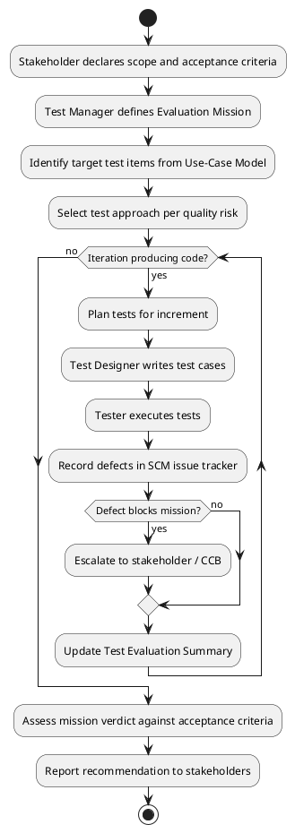
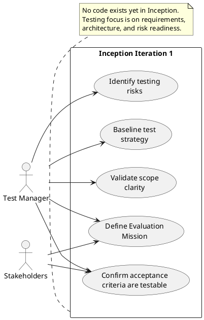
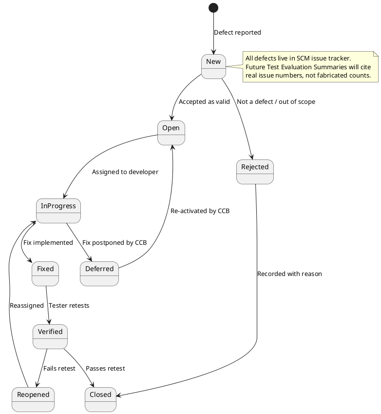

## Document Control
| Field | Value |
|---|---|
| Project | Portal |
| Phase | Inception |
| Iteration | 2 |
| Status | Draft |
| Milestone Target | End-of-Inception review (LCO re-review after findings closed) |
## Test Scope
### Purpose

This Test Evaluation Summary records the testing mission for the **Portal** project during Inception. At this stage no executable code exists; the test effort focuses on validating that the declared scope, use cases, supplementary requirements, and candidate architecture are ready to support a testable system in Elaboration and Construction.

### Evaluation Mission for Inception

| Element | Definition |
|---|---|
| **Objectives** | 1. Confirm that the 12 declared functional requirements (FR-001..FR-012) and 8 non-functional requirements (NFR-001..NFR-008) are stated in a testable form.   2. Verify that the 5 acceptance criteria (AC-001..AC-005) can be mapped to concrete use-case scenarios and measurable conditions.   3. Identify testing risks and dependencies that will shape the Elaboration test strategy.   4. Baseline the test approach so that Construction test cases can be derived directly from the Use-Case Model and Supplementary Specification. |
| **Scope in** | Review of Vision, Use-Case Model, Supplementary Specification, Software Architecture Document, and Risk List for testability. |
| **Scope out** | No test-case design, no test execution, no test environment provisioning, and no defect data collection — these activities require code or stable design artifacts that do not yet exist. |
| **Resources** | Test Manager time; access to upstream artifacts; stakeholder input on acceptance-criteria interpretation. |
| **Monitoring** | Traceability of test concerns to declared requirements, use cases, risks, and architecture decisions; this summary is the baseline against which future iterations will be evaluated. |
## Test Summary

### Inception Test Workflow

### Inception Testing Focus

### Test Strategy Baseline

| Quality Risk | Test Approach | When to Start | Evidence Needed |
|---|---|---|---|
| Functional correctness of clocking, news, directory workflows | Use-case-driven black-box tests derived from UC-001..UC-012 | Construction Iteration 1 | Test cases trace to UC main and alternative flows; pass/fail mapped to acceptance criteria. |
| AD LDAP attribute gaps (R001) | Prototype / data-quality assessment in Elaboration; directory smoke tests in Construction | Elaboration Iteration 1 | Fill-rate report for job title and extension across 3 offices; AC-003 stopwatch test. |
| Keycloak OIDC / AD group claim mapping (R003) | Authentication/authorization spike test in Elaboration | Elaboration Iteration 1 | End-to-end login with HR and Employee users; claim-to-role mapping verified. |
| localStorage retry edge cases (R005) | Browser-level resilience tests on Chrome and Edge, normal and private browsing | Elaboration / Construction | Simulated outage recovery; idempotency duplicate rejection; storage-quota handling. |
| News featured invariant (R007) | Domain-layer and integration tests asserting at most one featured item | Construction | Concurrent publish/edit scenarios; database unique constraint verification. |
| Performance (NFR-001, NFR-002, AC-003) | Load/response-time tests on corporate network with target population | Construction | Measured page-load and clocking-response times; directory lookup under 10 seconds. |
| Availability (NFR-003) | Availability-window monitoring during extended working hours | Transition | Uptime evidence for Monday–Friday 7:00–19:00. |
| Usability / adoption (AC-002, AC-004, BG-003) | Stakeholder-observed acceptance tests and adoption metrics | Transition | Observation that HR publishes news unassisted; 80% employee clocking adoption within 3 months. |

### Test Levels Planned

| Level | Purpose | Scope for Portal |
|---|---|---|
| Unit | Verify individual classes and functions | Clocking idempotency, timezone conversion, news featured invariant, audit entry creation. |
| Integration | Verify subsystem interactions | LDAP gateway + AD; OIDC handler + Keycloak; EF Core repositories + PostgreSQL; CSV generator output. |
| System | Verify end-to-end use-case scenarios | Full Razor Pages flows for UC-003, UC-007, UC-008, UC-012 and remaining UCs. |
| Acceptance | Validate against AC-001..AC-005 and business goals | Stakeholder-executed or witnessed scenarios; adoption metrics for BG-003. |

### Regression Testing Stance

Regression testing is mandatory per iteration once Construction begins. Because no code exists in Inception, the regression baseline is empty. The first Construction iteration will establish the initial regression suite around the architecturally significant use cases (UC-003, UC-007, UC-008, UC-012). Each subsequent iteration must re-run the prior suite plus tests for the new increment.

## Defects and Incidents
### Planned Defect Lifecycle

The defect lifecycle below is **adopted for use from Construction Iteration 1 onward**. No executable artifacts exist in Inception; therefore no defects have been observed or tracked yet. The lifecycle is shown now so that Construction test activities can reference it without redefining it.

### SCM Evidence Available in Inception

Because no code has been delivered for the Portal yet, the authoritative quality signals at this stage are the repository's continuous-integration state and issue tracker, not a defect count. The table below records the actual observations retrieved from SCM.

| Evidence | Observation | Source |
|---|---|---|
| CI build status on `main` | Success | GitHub Actions run `34609595628`, completed 2026-09-11 14:21:43Z |
| Open issues / change requests | None | `scm_list_issues` returned no open issues |
| Open pull requests | Not reported by available tooling | To be checked manually before Construction starts |

### Current Defect Status

No defects or incidents have been observed in Inception. The zero counts below reflect the absence of executable artifacts, not an exercised defect-tracking process.

| Metric | Value |
|---|---|
| Defects reported | 0 |
| Defects open | 0 |
| Defects closed | 0 |
| Incidents | 0 |
## Conclusions
### Mission Verdict

| Criterion | Status | Evidence |
|---|---|---|
| Evaluation Mission defined and documented | **Pass** | Mission stated in this summary with objectives, scope, resources, and monitoring. |
| All declared requirements traceable to test concerns | **Pass** | FR-001..FR-012, NFR-001..NFR-008, AC-001..AC-005 mapped to use cases and test approach. |
| Testing risks identified and linked to mitigation strategy | **Pass** | R001, R003, R005, R007, R008 and performance/availability risks addressed in strategy baseline. |
| Test strategy ready to guide Elaboration and Construction | **Pass** | Test levels, regression stance, and defect lifecycle defined. |
| SCM evidence referenced instead of fabricated defect data | **Pass** | CI build `34609595628` on `main` reported as success; no open issues. |

### Recommendation

The Inception test mission is **met**. The project is ready to proceed to Elaboration with the testing risks and strategy documented. The next test-related actions are:

1. Participate in Elaboration architecture spikes for R001, R003, R005, and R007.
2. Refine acceptance thresholds (exact load, response-time percentiles, browser versions, AD sample sizes) once the Requirements Specifier quantifies them.
3. Begin test-case design in Construction Iteration 1, starting with the four architecturally significant use cases (UC-003, UC-007, UC-008, UC-012).

### Open Items

- [OMITTED: Test Plan — trigger not fired; per-iteration testing scope lives in the Iteration Plan]
- Performance acceptance thresholds require quantification in Elaboration (noted in Supplementary Specification as an Elaboration task).
- AD attribute fill-rate prototype must be completed before directory implementation proceeds (R001).
## Traceability
| Element | Traces From | Link Type | Traces To |
|---|---|---|---|
| Test Evaluation Summary | Vision | Refines | UC-001..UC-012 |
| Test Evaluation Summary | FR-001..FR-012, NFR-001..NFR-008 | Refines | UC-001..UC-012 |
| Test Evaluation Summary | AC-001..AC-005 | Refines | UC-003, UC-008, UC-012 |
| Test Evaluation Summary | R001, R003, R005, R007, R008 | DependsOn | SAD PoC Plan |
| Test Evaluation Summary | BG-001, BG-002, BG-003 | Refines | AC-001, AC-002, AC-004 |
| Inception test mission | UC-001..UC-012 | Tests | AC-001..AC-005 |
| SCM evidence (CI build success, no open issues) | `main` branch | DependsOn | GitHub Actions run `34609595628` |
