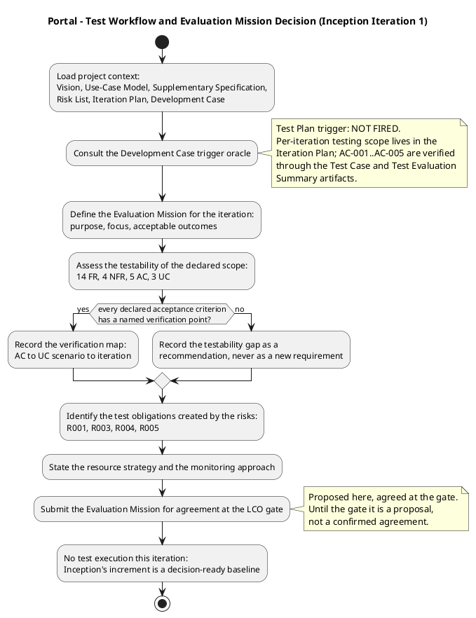
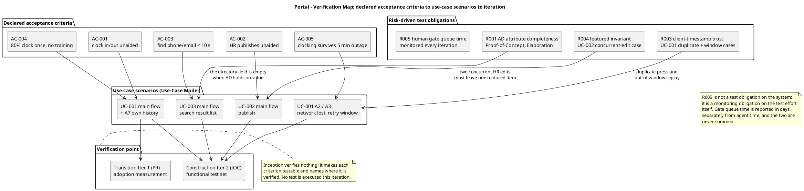
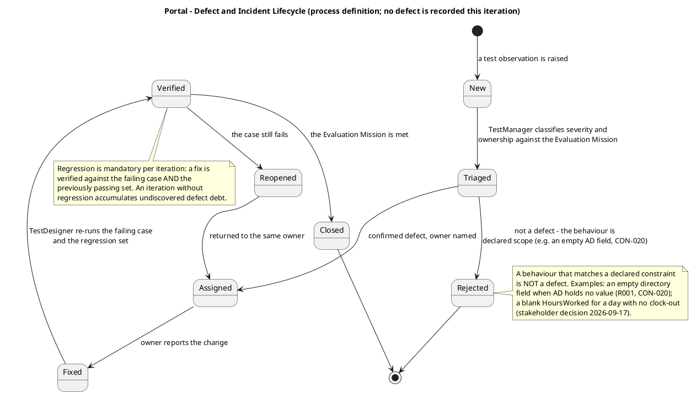

## Document Control

| Field | Value |
|---|---|
| Artifact | Test Evaluation Summary — Portal (Employee Portal, Cuba Corp) |
| Phase | Inception |
| Status | Draft — produced for review; milestone NOT YET ACHIEVED |
| Milestone Target | End-of-Inception (LCO) — not marked complete by this artifact |
| Iteration / Cycle | 1 / 1 |
| Owner | TestManager |
| Date | 2026-09-18 |
| Detail level | Inception — Evaluation Mission defined, declared scope assessed for testability, verification map established. **No test is executed this iteration.** |
| Governing process | Development Case (Inception) — Test Plan trigger NOT FIRED; per-iteration testing scope lives in the Iteration Plan |
| Companion artifact | **Test Plan: NOT PRODUCED.** The Development Case's optional-artifact trigger for the Test Plan reports `fired: false` (no regulatory audit and no contractual test-reporting obligation is declared). Per-iteration testing scope is carried by the Iteration Plan. This artifact is the CORE verification vehicle the Development Case, Vision, Risk List and Iteration Plan all name for AC-001..AC-005. |

**What this artifact is, at Inception depth.** It is the **Evaluation Mission** — the explicit statement of the test effort's purpose, focus and acceptable outcomes for this iteration — together with the assessment of whether the declared scope is *testable at all*. It is not a results report: Inception's increment is a decision-ready baseline, not an executable, so there is nothing to execute and no pass rate to report. Claiming a pass rate here would be fabricating observable state.

**What this artifact is not.** It is not a Test Plan. It does not define test procedures, test cases or test scripts — those are the TestDesigner's artifacts, produced in Elaboration and Construction. It states *what must be true for the iteration to be acceptable*, and *who verifies it, where, and against which declared criterion*.

## Test Scope

### The Evaluation Mission

The Evaluation Mission is the agreement with the stakeholders on the purpose, focus and acceptable outcomes of the test effort. It is stated here as a **proposal**; it becomes an agreement at the LCO gate, which is the stakeholder's decision and not mine to make.

| Mission element | Statement |
|---|---|
| **Purpose** | Establish, before any code exists, that every declared acceptance criterion (AC-001..AC-005) has a named verification point, and that every declared requirement is *testable* — expressible as an observation that can pass or fail. The test effort exists to answer one question for the stakeholder: **is this system ready to deploy?** |
| **Focus this iteration** | Testability of the declared scope, and the test obligations created by the project's risks. Not execution. |
| **Focus across the project** | UC-001 Clocking (the only client-side mechanism, and the only place a client-supplied timestamp crosses the boundary), UC-003 Employee Directory (the AD/LDAP boundary carrying the project's dominant risk), UC-002 News (a declared system invariant that must hold wherever the change comes from). |
| **Acceptable outcome** | The mission is met when every declared acceptance criterion has been verified against a running system, every declared non-functional threshold has been measured, and the risk-driven obligations have been discharged — **not** when a pass rate reaches 100%. A zero-defect standard is not the criterion and is not asserted. |
| **Resource strategy** | Test effort is planned as a share of the iteration budget, not as an unbounded activity. The declared scale (200 employees, 3 offices, 3 use cases, 14 FRs) bounds the test surface; a test set sized for a system an order of magnitude larger would be destructive over-testing. |
| **Monitoring approach** | Defect data is read from the SCM issue tracker, which is the authoritative source. CI build status is read as a quality signal. Gate queue time is monitored as R005, in days, separately from agent time. |

### In scope for the test effort

| Area | What is tested | Declared basis |
|---|---|---|
| Clocking | Clock in/out with the exact press time; own monthly history; HR-wide view; HR correction and insertion with the audit fields; the 5-minute retry and the duplicate rule; the monthly CSV export | FR-001, FR-002, FR-003, FR-004, FR-012, FR-014 |
| News | Publish, read and filter by category, feature, edit, unpublish; the at-most-one-featured invariant; the audit fields on every state change | FR-005, FR-006, FR-007, FR-008, FR-009 |
| Employee Directory | Search by name, department and office; the displayed attribute set; assign and clear the worker category; the no-connection message | FR-010, FR-011, FR-013 |
| Non-functional | Page load under 3 s; clocking response under 1 s; availability Mon–Fri 07:00–19:00; the audit trail is written on every mandated change | NFR-001, NFR-002, NFR-003, NFR-004 |
| Authorization | Exactly two levels from AD group membership; the worker category does **not** drive access control | CON-016, CON-021 |
| Acceptance | AC-001..AC-005, each against a running system | Declared acceptance criteria |

### Explicitly OUT of scope for the test effort

Each exclusion below is a declared constraint or a stakeholder decision. Testing any of them would be testing something the project does not build.

| Not tested | Why | Basis |
|---|---|---|
| Keycloak itself — realm, client provisioning, hosting | Keycloak is external and is not project work. The portal is an OIDC client only. | CON-005 |
| Any write to Active Directory | The portal never writes to AD. There is no write path to test. | CON-006, CON-010 |
| Backup and restore of PostgreSQL | Covered by the Infrastructure team's existing practice with a verified restore test. No backup deliverable exists. | CON-014 |
| Data migration | There is none. The portal starts empty. | CON-012 |
| Payroll integration, vacation/sick-leave, biometric clocking, native mobile app, push notifications | Declared exclusions. | Declared scope |
| An in-portal audit view screen | The audit is written, never read in the portal. There is no screen to test. | NFR-004; stakeholder decision 2026-09-17 |
| A permission administration screen or a role matrix | Authorization is two levels from AD group membership. No such screen exists. | CON-016 |
| Offline mode beyond the clocking retry — PWA, service worker, installable app, client cache of directory or news | Declared exclusions. | FR-013, declared scope |
| A news archive screen; hard delete of a news item | Declared exclusions. Unpublish hides; the record stays. | CON-019, declared scope |
| Multi-timezone behaviour | All three offices share one timezone. There is no multi-timezone case. | CON-015 |
| A fifth worker category | The list is closed at four values. | CON-023 |

## Test Summary

### No test execution this iteration — and why that is the correct result

Inception produces a decision-ready baseline: a scope the stakeholders can agree on, a risk register that sequences the work, and a plan. It produces no executable. There is therefore **no test run, no pass rate, no coverage percentage and no defect count** to report from execution, and none is asserted. The measured facts available this iteration are the SCM observations in *Defects and Incidents*.

What this iteration *does* produce is the thing that makes later execution possible: the demonstration that the declared scope is testable, and the map from each declared acceptance criterion to the scenario and iteration that will verify it.

### Testability assessment of the declared scope

| Declared input | Testable? | Verification point | Note |
|---|---|---|---|
| AC-001 | Yes | UC-001 main flow; SS-USA-06 | Observable: an employee completes a clocking with no HR or developer involvement. |
| AC-002 | Yes | UC-002 main flow; SS-USA-07 | Observable: HR publishes without a developer, a deployment or database access. |
| AC-003 | Yes | UC-003 main flow; SS-USA-04 | Observable and time-bounded: contact data appears in the result list itself, under 10 s. |
| AC-004 | Yes | UC-001 main flow; SS-USA-05 | Observable at scale: 80% of 200 employees complete one clocking with no prior training. Measured in Transition. |
| AC-005 | Yes | UC-001 A2 and A3; SS-REL-02 | Observable: a clocking made during an outage of up to 5 minutes is not lost and carries the press time. |
| NFR-001 | Yes | SS-PER-01 | Measurable: page load < 3 s on the corporate network. |
| NFR-002 | Yes | SS-PER-02 | Measurable: clocking response < 1 s. |
| NFR-003 | Yes | SS-REL-01 | Measurable: the system is up throughout Mon–Fri 07:00–19:00. This is an availability target, not a curfew — a clocking outside the window is not a failure. |
| NFR-004 | Yes | SS-AUD-01..SS-AUD-07 | Observable in the datastore: every mandated change carries author and timestamp; corrections carry previous value and reason. Verified by reading the database, not a screen. |
| FR-001..FR-014 | Yes | UC-001, UC-002, UC-003 scenarios | Each declared functional requirement maps to a named scenario in the Use-Case Model. |
| CON-016, CON-021 | Yes | SS-SEC-03, SS-SEC-04 | Observable: exactly two authorization levels; no reference to the worker category in the authorization path. |
| CON-023 | Yes | SS-BR-08 | Observable: the category value set is exactly four values and no screen creates or renames one. |

**No declared requirement is untestable.** Every declared acceptance criterion, non-functional requirement and functional requirement has a named verification point. No testability gap is recorded, and therefore no recommendation is raised on this axis.

### Verification map

### Risk-driven test obligations

The Risk List is the driver of what the test effort must confront, and in which iteration. Each obligation below is a test the risk makes necessary — not a test the declared scope would otherwise demand.

| Risk | Test obligation it creates | Confronted in |
|---|---|---|
| R001 | The Architectural Proof-of-Concept reads the real AD attributes across all 3 offices and reports which of job title, department, office, email and extension are actually populated. The directory's attribute mapping is then designed against observed data. The test consequence: a directory field with no value in AD must render **empty**, and the test set must assert that no substitute value appears. | Elaboration (Proof-of-Concept) |
| R003 | The clocking endpoint must be tested for the two ways a client-supplied timestamp can go wrong: a duplicate press (rejected by the idempotency key, exactly one record) and a replay outside the 5-minute window. The test set must assert the accepted window and the duplicate rule, not merely the happy path. | Construction Iter 2 (IOC) |
| R004 | The at-most-one-featured invariant must be tested **wherever the change comes from**, not only through the form HR happens to use: featuring at publish time, featuring at edit time, and two concurrent HR edits must each leave exactly one featured item. Unpublishing the featured item must leave the banner empty and promote nothing. | Construction Iter 2 (IOC) |
| R005 | Not a test of the system. A monitoring obligation on the test effort itself: gate queue time is reported in days, separately from agent time, and the two are never summed. | Every iteration |
| R002 | Adoption is measured, not tested: 80% of the 200 employees completing at least one clocking within 3 months, against BG-003 and AC-004. The remedy for lagging adoption is communication by HR, never a new feature. | Transition Iter 1 (PR) |
| R006 | The supplied design at `docs/inputs/employee-portal-design.html` is mandatory for the visual layer of what is in scope. The test consequence: a screen or control in the design that traces to no declared FR-NNN is a Change Request, not a test failure. | Elaboration, before implementation |

### Resource strategy

| Resource | Requirement | Justification against the mission |
|---|---|---|
| Test environments | **One** — the internal Windows Server estate the Infrastructure team already runs, plus the already-registered Keycloak OIDC client and the existing PostgreSQL instance. | The system is single-node, intranet-only, with no cloud and no multi-environment topology. A staging tier would test a topology the project does not have. |
| Test data | Clockings, news items and worker-category links created through the portal itself. No imported data set. | There is no data migration (CON-012) and the portal starts empty. A synthetic employee data set would duplicate a system of record the portal does not own (CON-020). |
| Directory test data | Read from the real Active Directory across the 3 offices. | AD is the system of record (CON-006) and the portal holds no local copy (CON-020). A mock directory would test the mock, not the risk R001 describes. |
| Browsers | Current Chrome and Edge. | The declared supported browser set (CON-009). No other browser is a target. |
| Test tooling | The SCM issue tracker as the authoritative defect record; the CI build as the quality signal. | Both already exist. No new test tooling is declared and none is introduced. |
| Test effort share | Planned as a share of each iteration's token box, sized to the declared surface (3 use cases, 14 FRs, 4 NFRs, 5 ACs). | Testing is a substantial share of project cost and is planned as such — but the declared scale bounds it. A test set sized for a system an order of magnitude larger is destructive over-testing. |

**No test environment is requested beyond the one the project already has.** Every resource above is justified against the mission; none is requested because it is conventional.

## Defects and Incidents

### Observed SCM state

Read from the SCM tools this iteration, not asserted:

| Observation | Value | Source |
|---|---|---|
| Open and closed issues in the tracker | **None** — the tracker holds no issue of any kind | `scm_list_issues(state=all)` |
| Change Requests raised | **None** | `scm_list_issues(state=all)` |
| Defects recorded | **None** | `scm_list_issues(state=all)` |
| Latest CI build on `main` | **success** — run `35323925165`, started 2026-09-18 08:21:04Z, completed 2026-09-18 08:22:18Z | `scm_get_build_status` |

**How to read this.** Zero defects is not a quality achievement and is not reported as one. No test has been executed, so no defect could have been found; the tracker is empty because the test effort has not yet run, not because the system is defect-free. The CI build succeeding is a signal that the repository builds — it is not evidence about any declared acceptance criterion, because no acceptance criterion is exercised by a build.

### Defect and incident lifecycle

### Behaviours that are NOT defects

The declared scope fixes several behaviours that a tester unfamiliar with it would reasonably raise as defects. Each is recorded here so that the test effort does not manufacture findings out of correct behaviour.

| Observed behaviour | Verdict | Basis |
|---|---|---|
| A directory field is empty for an employee | **Not a defect** — the field is empty because AD holds no value, and the portal substitutes nothing. The gap is an AD data-quality issue for the Infrastructure team. | R001, CON-020, CON-024 |
| `HoursWorked` is blank for a day with a clock-in and no clock-out | **Not a defect** — a zero would assert the employee worked no hours, which is false; blank states the value is unknown. The row still appears in the export. | Stakeholder decision 2026-09-17 |
| The banner does not appear | **Not a defect** — HR may leave no item featured. | FR-007, CON-018 |
| The banner is empty after the featured item is unpublished | **Not a defect** — no other item is promoted in its place. | CON-018 |
| An unpublished news item still exists in the database | **Not a defect** — news is never hard-deleted; the record stays for the audit trail. | CON-019 |
| A worker has no category | **Not a defect** — at most one category, and it may be empty. No default is invented. | CON-022 |
| A clocking exists outside 07:00–19:00 | **Not a defect** — NFR-003 is an availability target, not a curfew. | SS-REL-01 |
| A clocking carries the time the employee pressed the button, not the time the server received it | **Not a defect** — this is the declared behaviour. | FR-012 |
| A page-level JavaScript file exists on the clocking page | **Not a defect** — "no SPA" means no client-side framework and no client-side router; it does not mean no JavaScript. | CON-003, SS-SUP-05 |
| No audit view screen exists | **Not a defect** — the audit is written, never read in the portal. | SS-AUD-07; stakeholder decision 2026-09-17 |

### Regression policy

Regression testing is mandatory in every iteration that changes the system. A fix is verified against the failing case **and** the previously passing set. An iteration that skips regression accumulates undiscovered defect debt, and the debt is paid at the worst possible moment — in Transition, where a defect costs orders of magnitude more than it would have in Inception. No regression set exists yet because no test has been executed; the policy is stated here so that the first execution establishes it.

## Conclusions

### Mission verdict

**Not yet assessable — and that is the honest verdict.** The Evaluation Mission for this iteration is *testability of the declared scope*, and that mission is met: every declared acceptance criterion, non-functional requirement and functional requirement has a named verification point, and no declared requirement is untestable. The mission for the *project* — is this system ready to deploy? — cannot be answered this iteration, because no executable exists and no test has been executed. No pass rate, coverage figure or defect count is reported, because none has been measured.

| Mission element | Verdict this iteration |
|---|---|
| Every declared acceptance criterion has a named verification point | **Met** — AC-001..AC-005 mapped to UC scenarios and to the iteration that verifies each |
| Every declared requirement is testable | **Met** — no testability gap recorded |
| Risk-driven test obligations identified | **Met** — R001, R002, R003, R004, R005, R006 each carry a named obligation and the iteration that confronts it |
| Test scope bounded by the declared exclusions | **Met** — ten exclusions recorded, each traced to a declared constraint or a stakeholder decision |
| The system is ready to deploy | **Not assessable** — no executable, no execution |
| The Evaluation Mission is agreed with the stakeholders | **Proposed, not yet agreed** — agreement is the LCO gate, which is the stakeholder's decision |

### Recommendation

1. **Agree the Evaluation Mission at the LCO gate.** The mission is proposed here; it becomes an agreement only when the stakeholder accepts it. Until then it is a proposal, and this artifact does not claim otherwise.
2. **Carry the verification map into Elaboration as the TestDesigner's input.** The map names the scenario and the iteration for each criterion; the TestDesigner turns it into test cases. No test case is defined here.
3. **Confront R001 empirically before the directory's attribute mapping is designed.** This is the project's dominant risk and the one obligation that cannot be discharged by design reasoning or by a test against a mock. It is the Architectural Proof-of-Concept's job in Elaboration.
4. **Establish the regression set at the first execution.** The policy is stated; the set does not yet exist.
5. **No new test resource is requested.** The single environment, the real AD, the real PostgreSQL instance and the existing SCM and CI tooling are sufficient for the declared scale. A request for more would be over-testing a system of 200 users and 3 use cases.

## Traceability

| Element | Traces From | Link Type | Traces To |
|---|---|---|---|
| Test Evaluation Summary | AC-001, AC-002, AC-003, AC-004, AC-005 | Derives | Test Case |
| Test Evaluation Summary | NFR-001, NFR-002, NFR-003, NFR-004 | Derives | Test Case |
| Test Evaluation Summary | FR-001, FR-002, FR-003, FR-004, FR-005, FR-006, FR-007, FR-008, FR-009, FR-010, FR-011, FR-012, FR-013, FR-014 | Derives | Test Case |
| Test Evaluation Summary | UC-001, UC-002, UC-003 | Derives | Test Case |
| Test Evaluation Summary | R001, R002, R003, R004, R005, R006 | Derives | Test Case |
| Test Evaluation Summary | CON-005, CON-006, CON-010, CON-012, CON-014, CON-015, CON-016, CON-019, CON-020, CON-021, CON-022, CON-023 | Derives | Test Case |
| Test Evaluation Summary | BG-002, BG-003 | Derives | Iteration Assessment |
| Test Evaluation Summary | STK-001, STK-003, STK-004 | Derives | Iteration Assessment |
| Test Evaluation Summary | NFR-004; stakeholder decision 2026-09-17 (no in-portal audit view screen) | Derives | Test Case |
| Test Evaluation Summary | R001 | Derives | Architectural Proof-of-Concept |
| Test Evaluation Summary | R003, R004 | Derives | Design Model |
| Test Evaluation Summary | R005 | Derives | Iteration Plan |

**Reading the table.** The declared acceptance criteria, non-functional requirements, functional requirements and use cases are the inputs the Evaluation Mission is derived from; the Test Case artifact is what the mission feeds, because the mission defines what the test cases must cover. R001 traces to the Architectural Proof-of-Concept because that is the artifact that discharges it empirically. R003 and R004 trace to the Design Model because each is discharged by a design decision — where the accepted timestamp is validated, and where the featured invariant is enforced — and the test set then verifies that decision. R005 traces to the Iteration Plan because gate queue time is a planning constraint, not a test of the system. BG-002, BG-003 and the stakeholders trace to the Iteration Assessment because adoption and stakeholder acceptance are assessed at iteration close, not by a test case.
