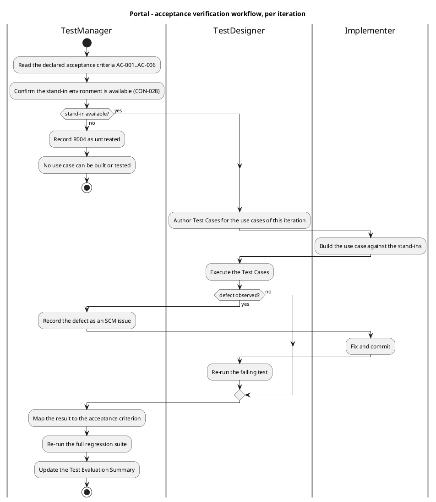
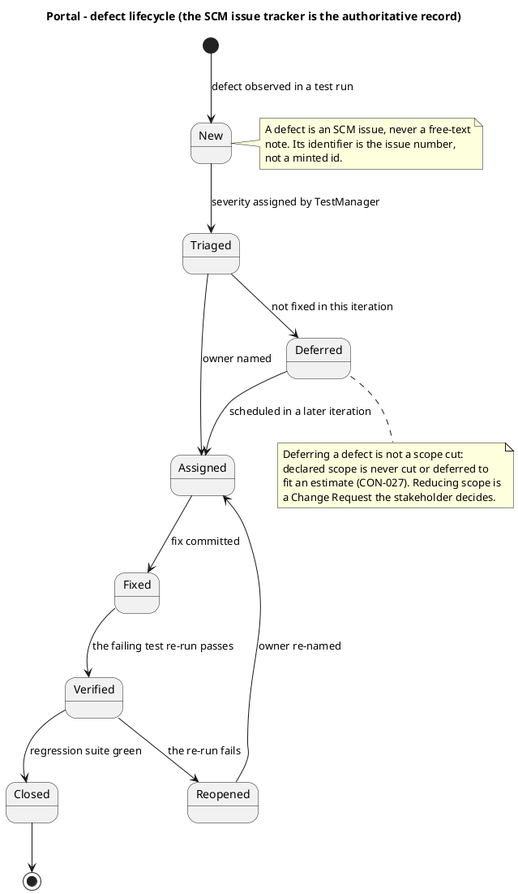

## Document Control
- **Phase:** Inception
- **Status:** Draft — iteration 3
- **Milestone Target:** Lifecycle Objectives (LCO) — end of Inception. NOT YET ACHIEVED.
## Test Scope

The test effort verifies the declared acceptance criteria AC-001..AC-006 against the declared use cases UC-001..UC-009, the declared non-functional requirements NFR-001..NFR-005 and the declared business rules CON-009..CON-019. Nothing outside the declared scope is tested, and no criterion is invented.

| Dimension | In scope | Basis |
|---|---|---|
| Functional | UC-001..UC-009, exercised against the stand-ins | FR-001..FR-009 |
| Business rules | CON-009 (at most one featured item), CON-010 (no pair crosses midnight), CON-011 (one pair per employee per day), CON-012 (original clocking never overwritten or deleted), CON-013 (category drives no access control), CON-014 (closed list of four values), CON-015 (at most one category, may be empty), CON-016 (link only, no duplicate employee), CON-017 (news never deleted) | CON-009..CON-019 |
| Audit | An audit entry with author and timestamp for every publish, edit, unpublish, category change and clocking correction or insertion | NFR-004 |
| Authorization | Two levels derived from AD group membership; no third level and no per-category rule | NFR-005 |
| Performance | Full page load under 3 seconds as the employee experiences it; clock in/out under 1 second | NFR-001, NFR-002, AC-001 |
| Availability | Monday–Friday 07:00–19:00 within the corporate network | NFR-003 |
| Acceptance | AC-001..AC-006 | Declared acceptance criteria |
| Regression | The full suite re-run every iteration | RUP iterative principle |

**Out of scope, with the declared basis.** Each line is a declared exclusion or a boundary the stakeholder placed outside the team's test work. None is a gap to be filled later.

| Excluded | Basis |
|---|---|
| Validation against the real Keycloak and the real Active Directory | CON-028 — human work by Infrastructure with HR, not team test work. The team's job is that every use case works correctly against the stand-ins |
| Data migration | CON-030 — there is none; the portal starts empty |
| Backup and restore | CON-032 — Infrastructure's existing practice, confirmed in writing with a verified restore test |
| Multi-timezone behaviour | CON-008 — all three offices are Europe/Madrid; there is no normalisation to test |
| Payroll integration, native mobile app, push notifications, vacation and sick-leave, biometric clocking | Declared scope exclusions |
| Offline behaviour of the directory and the news | AC-006 — clocking only; the directory and the news show a 'no connection' message and cache nothing |
| Keycloak realm, client provisioning and hosting | Declared scope exclusion — Keycloak is not ours to deploy |
| Load and concurrency beyond the declared thresholds | No declared NFR covers concurrent users; NFR-001 and NFR-002 are per-page and per-operation |

[RECOMMENDATION — requires CR] No declared non-functional requirement covers concurrent load at the peak clocking windows (200 employees, 3 offices, arrival and departure). NFR-001 and NFR-002 are single-user measurements. A concurrency target would need a Change Request; it is not added here.

## Test Summary
The test effort at Inception iteration 3 defines the mission and the acceptance-verification plan. It does not execute: no use case is implemented and no stand-in environment exists yet, so no acceptance criterion is verifiable at this point.

| Evidence | Source | Value |
|---|---|---|
| CI build on `main` | `scm_get_build_status` | success — run `36110698735`, 2026-09-25 |
| Defects recorded | SCM issue tracker | 3 open — `Issue #1`, `Issue #2`, `Issue #3` |
| Test Cases authored | Test Case artifact | not yet produced — TestDesigner's artifact, not this one |
| Stand-in OIDC issuer and stand-in directory | CON-028 | not yet built — R004 |
| Executed test results | — | none — no use case is implemented |

The CI baseline is the one piece of test-relevant evidence that exists: the pipeline that will carry the regression suite builds and tests on `main`. Everything else in the table is a gap with a named owner, not a result.

**Acceptance verification plan.** Each criterion is stated with what it verifies and how it will be verified, so that the iteration that builds the corresponding use case knows what evidence closes it.

| Criterion | What it verifies | How it will be verified | First verifiable |
|---|---|---|---|
| AC-001 | Full page load under 3 seconds as the employee experiences it — browser request to page displayed and usable, including the clocking page's script | Measured in the browser on the corporate network. Server response time is the engineering target, not the criterion | The iteration that delivers UC-001's page |
| AC-002 | An employee clocks in and out without help from HR or the development team | End-to-end clock in and clock out against the stand-in OIDC issuer, with no intervention | The iteration that delivers UC-001 |
| AC-003 | An HR Administrator publishes a news item without technical assistance | End-to-end publish through the HR screen against the stand-in OIDC issuer | The iteration that delivers UC-005 |
| AC-004 | Any employee finds a colleague's phone or email in under 10 seconds | Timed search by name, department and office against the stand-in directory | The iteration that delivers UC-008 |
| AC-005 | 80% of employees complete at least one clocking with no prior training | Measured with real employees after go-live. It is an adoption measure, not an in-iteration test: it cannot be verified before the portal is in use | Post-launch, with STK-004 |
| AC-006 | A clocking made while the corporate network is down for up to 5 minutes is not lost | Network loss simulated on the clocking page: the press is held in localStorage, the POST retries for up to 5 minutes, the server accepts the client-supplied press timestamp, and a duplicate is rejected by the idempotency key | The iteration that delivers UC-001 |

AC-005 and BG-003 are the only criteria that depend on real users rather than on the system. They are verified with STK-004 after go-live and cannot be closed by any test the team runs.

**Risk-directed test priority.** The declared risks decide what is tested first, not the order the use cases were written in.

| Risk | Test consequence |
|---|---|
| R002 — LDAP attributes inconsistently filled across the 3 offices | The stand-in directory must carry entries whose job title or extension is empty, so UC-008's gap path and UC-002's blank-FullName path are exercised from the first iteration. A stand-in holding only complete records cannot exercise this risk |
| R006 — a skewed client clock records a timestamp that did not happen | The stand-in test exercises a skewed client clock and confirms the idempotency key is verified server-side, so a retry cannot create a second record |
| R004 — the stand-in environment is not ready | The stand-in environment is the first construction item of iteration 1. If it is absent, no use case can be built or tested and the iteration's exit criteria cannot pass |
| R001, R005 — Infrastructure's side and the human validation gate | Not team test work (CON-021, CON-028). The team's evidence is that every use case works against the stand-ins |
## Defects and Incidents
The SCM issue tracker is the authoritative record of defects. It holds three open issues, all recorded as defects. A defect is an issue in the tracker, never a free-text note, and its identifier is the issue number.

| Issue | Title | Labels | Status |
|---|---|---|---|
| `Issue #1` | Development Case environment-readiness record for the CI pipeline is stale | severity:minor, nature:defect, configuration-record | open |
| `Issue #2` | `docs/BRANCHING_STRATEGY.md` cites a superseded blob sha for the CI configuration item | severity:minor, nature:defect, configuration-record | open |
| `Issue #3` | `.github/workflows/README.md` records `Issue #2` as outstanding after its correction | severity:minor, nature:defect, configuration-record | open |

All three are configuration-record defects: none is a product defect, because no use case is implemented and no test has executed. None blocks an acceptance criterion. All three are owned by the ProcessEngineer, whose artifact and documents they concern.

**Severity scheme.** Three levels, each anchored on a declared element rather than on taste.

| Severity | Meaning | Example |
|---|---|---|
| Blocker | An acceptance criterion cannot be verified | AC-006's retry loses the press, or the server records the receipt time instead of the press time |
| Major | A declared business rule or a required audit entry is wrong | Two items featured at once (CON-009); a corrected clocking overwrites the original (CON-012); a publish leaves no audit entry (NFR-004) |
| Minor | The UI deviates from the mandatory design, or a non-blocking defect | A field rendered out of the committed design (CON-031) |

**Incidents.** No incident has occurred. The two conditions that would stop the test effort are already registered as risks: R004 (the stand-in environment is not ready) blocks all testing, and R006 (a skewed client clock) is a test-design concern carried into the AC-006 test.
## Conclusions
**Mission verdict for Inception iteration 2.** The Evaluation Mission is established: the test effort is scoped to AC-001..AC-006 against the declared use cases, the declared non-functional requirements and the declared business rules, with the stand-in boundary (CON-028) as its operating condition. Acceptance verification is not yet possible — no use case is implemented, no Test Case has been authored and no stand-in environment exists.

| Question | Answer |
|---|---|
| Is the test effort's Inception objective met? | Yes — the mission, the scope, the acceptance-verification plan and the risk-directed priority are defined |
| Is any acceptance criterion verified? | No — none. No use case is implemented and no stand-in exists |
| Is the regression path in place? | The pipeline that will carry it builds and tests on `main` (run `36094575395`). No suite exists yet |
| Are there defects to report? | Yes — two open, `Issue #1` and `Issue #2`, both configuration-record defects owned by the ProcessEngineer |
| Is the Inception milestone achieved? | Not by this artifact. The milestone is decided by the reviewers, not here |

**Recommendation.** Proceed to Elaboration with the stand-in environment as the first construction item, since R004 gates every test. The first acceptance-verifiable increment is UC-001, which carries AC-002, AC-005 and AC-006, followed by UC-008, which carries AC-004 and exercises R002's gap path. AC-005 and BG-003 are verified with real employees after go-live and cannot be closed by any test the team runs.
## Traceability
This artifact mints no element of its own, so it registers no new trace edge. The edges below already exist in the graph, registered by the authority of each declared element; this table records which of them the test effort verifies. A document section is not an element and is not named as a trace endpoint.

| Declared element | Verified by | Edge already registered by its authority |
|---|---|---|
| FR-001, FR-002, FR-003 | UC-001, UC-003 | SystemAnalyst |
| FR-004, FR-005, FR-006, FR-007 | UC-002, UC-004, UC-005, UC-006, UC-007 | SystemAnalyst |
| FR-008, FR-009 | UC-008, UC-009 | SystemAnalyst |
| AC-001 | UC-001 | SystemAnalyst |
| AC-002, AC-005 | UC-001 | SystemAnalyst |
| AC-003 | UC-005 | SystemAnalyst |
| AC-004 | UC-008 | SystemAnalyst |
| AC-006 | UC-001 | SystemAnalyst |
| NFR-001, NFR-002 | COMP-001 | SoftwareArchitect |
| NFR-003 | COMP-001 | SoftwareArchitect |
| NFR-004 | COMP-009 | SoftwareArchitect |
| NFR-005 | COMP-002 | SoftwareArchitect |
| CON-009 | COMP-005 | SoftwareArchitect |
| CON-010, CON-011, CON-012 | COMP-003 | SoftwareArchitect |
| CON-013, CON-014, CON-015, CON-016 | COMP-006 | SoftwareArchitect |
| CON-017 | COMP-005 | SoftwareArchitect |
| CON-028 | COMP-006 | SoftwareArchitect |
| R002 | UC-002, UC-008, COMP-006 | ProjectManager |
| R004 | UC-001, UC-008, COMP-006 | ProjectManager |
| R006 | UC-001, COMP-003 | ProjectManager |

The downstream Test Case elements (`TC-NNN`) do not yet exist — they are the TestDesigner's to mint. No edge to them is claimed here; the edges are registered when those elements are minted. The CI run cited in the Test Summary is an observed external fact, not an element, and carries no edge.
