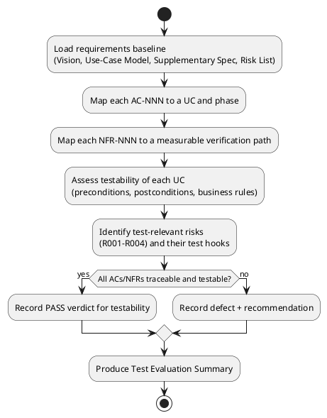

## Document Control

| Field | Value |
|---|---|
| Phase | Inception |
| Status | Draft |
| Milestone Target | End-of-Inception (Lifecycle Objectives) — NOT YET ACHIEVED |

## Test Scope

**Evaluation Mission (Inception Iter-1):** The Test Plan optional artifact is **not triggered** by the Development Case (no formal delivery / regulatory audit / contractual test reporting). Per-iteration testing scope therefore lives in the Iteration Plan. This Test Evaluation Summary assesses the **testability of the requirements baseline** and the **readiness of the test effort** — not executed test results, which do not exist in Inception.

**What is in scope for this evaluation:**

- Traceability of every declared acceptance criterion (AC-001…AC-005) to a use case and a phase where it becomes verifiable.
- Traceability of every non-functional requirement (NFR-001…NFR-005) to a measurable verification path.
- Testability of the 12 use cases (UC-001…UC-012) against their preconditions, postconditions, and business rules.
- Test-relevant risks (R001…R004) and the test hooks that will retire them.

**What is out of scope:** executed test cases, defect counts from execution, and pass/fail rates — none exist before Construction. No test environment has been provisioned (single-node topology, SAD Deployment View).

## Test Summary

**Coverage mapping — acceptance criteria:**

| AC | Verifiable in | Via | Test hook |
|---|---|---|---|
| AC-001 | Construction | UC-001 | Employee clocks in/out unaided; confirmation shown |
| AC-002 | Construction | UC-003 | HR publishes news unaided; audit record written |
| AC-003 | Construction | UC-008 | Directory search returns phone/email < 10s (R001 must be retired first) |
| AC-004 | Transition | UC-001 | Adoption measured vs BG-003 (80% in 3 months) |
| AC-005 | Construction | UC-001 A2 | Offline retry ≤ 5 min via localStorage; idempotency (CON-021) |

**Coverage mapping — non-functional requirements:**

| NFR | Verification path | Phase |
|---|---|---|
| NFR-001 (page < 3s) | Load test on corporate network | Construction |
| NFR-002 (clocking < 1s) | Response-time test on clocking POST | Construction |
| NFR-003 (Mon–Fri 7:00–19:00) | Availability window validation | Construction/Transition |
| NFR-004 (audit traceability) | Audit-trail assertions on UC-003/005/006/007/009/010/011/012 | Construction |
| NFR-005 (two-level authz) | AD-group role tests (HR vs employee) | Construction |

**Testability assessment of the 12 use cases:** all 12 UCs carry explicit preconditions, postconditions, and business rules (Use-Case Model), and every business rule traces to a declared constraint (CON-014…CON-021). The two architecturally significant UCs (UC-001, UC-008) are fully detailed with alternative flows (A1/A2/A3 and A1/A2 respectively), which gives the test effort concrete scenarios to target in Elaboration. The remaining 10 UCs are outlined only — their flows are detailed in Elaboration, which is the correct point to derive test cases.

**Test-relevant risks and their test hooks:**

| Risk | Test hook |
|---|---|
| R001 (AD attribute gaps) | UC-008 A2 — blank-field rendering; validated in Elaboration PoC |
| R002 (adoption) | AC-004 / BG-003 — measured in Transition |
| R003 (human-gate queue) | Process risk, not a test target; tracked in Risk List |
| R004 (scope volatility of UC-001/UC-008) | Any CR re-scopes the affected iteration's test scope |

**Test workflow (Inception → Elaboration):**

## Defects and Incidents

No executed tests exist in Inception, so there are no execution defects. The following are **testability findings** (not execution defects):

| # | Finding | Severity | Recommendation |
|---|---|---|---|
| 1 | 10 of 12 UCs are outlined only (flows not yet detailed) | Low — expected at Inception | Detail flows in Elaboration before deriving test cases; no action this iteration |
| 2 | NFR-001/NFR-002 thresholds are declared but not yet quantified into testable load/response targets | Low — expected | Requirements Specifier quantifies thresholds in Elaboration (already noted in Supplementary Spec traceability) |
| 3 | No test environment provisioned | Low — expected | Single-node topology (SAD); environment is provisioned in Construction, not Inception |

No blocking defects. No incidents.

## Conclusions

**Verdict: PASS — the Inception baseline is testable and the test effort is ready to proceed to Elaboration.**

- All 5 acceptance criteria trace to a use case and a named phase where they become verifiable.
- All 5 non-functional requirements have a measurable verification path.
- All 12 use cases carry the preconditions/postconditions/business rules needed to derive test cases; the two architecturally significant ones (UC-001, UC-008) are already detailed with alternative flows.
- The test-relevant risks (R001, R002) have concrete test hooks; R001 is scheduled for retirement in Elaboration iteration 1, which is the correct risk-driven ordering.

**Recommendation for Elaboration:** derive test cases first for UC-001 (clocking — idempotency CON-021, offline retry AC-005) and UC-008 (directory — AD projection CON-007, gap handling R001), matching the Software Architect's prioritized use-case list. Regression testing is mandatory per iteration once Construction begins (immutable-record invariants CON-015/CON-019/CON-020 are prime regression targets).

## Traceability

| Element | Traces From | Link Type | Traces To |
|---|---|---|---|
| Test Evaluation Summary | AC-001…AC-005, NFR-001…NFR-005, UC-001…UC-012 | DependsOn | Iteration Plan (Inception Iter-1) |
| AC-001 | FR-001 | Tests | UC-001 |
| AC-002 | FR-003 | Tests | UC-003 |
| AC-003 | FR-008 | Tests | UC-008 |
| AC-004 | BG-003, FR-001 | Tests | UC-001 |
| AC-005 | FR-001, CON-021 | Tests | UC-001 |
| R001 | CON-007, FR-008 | DependsOn | Elaboration PoC |
| R002 | BG-003, AC-004 | DependsOn | Transition plan |
