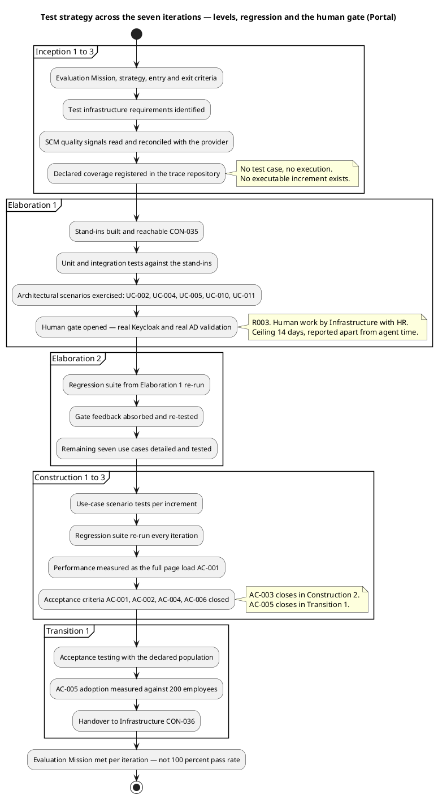
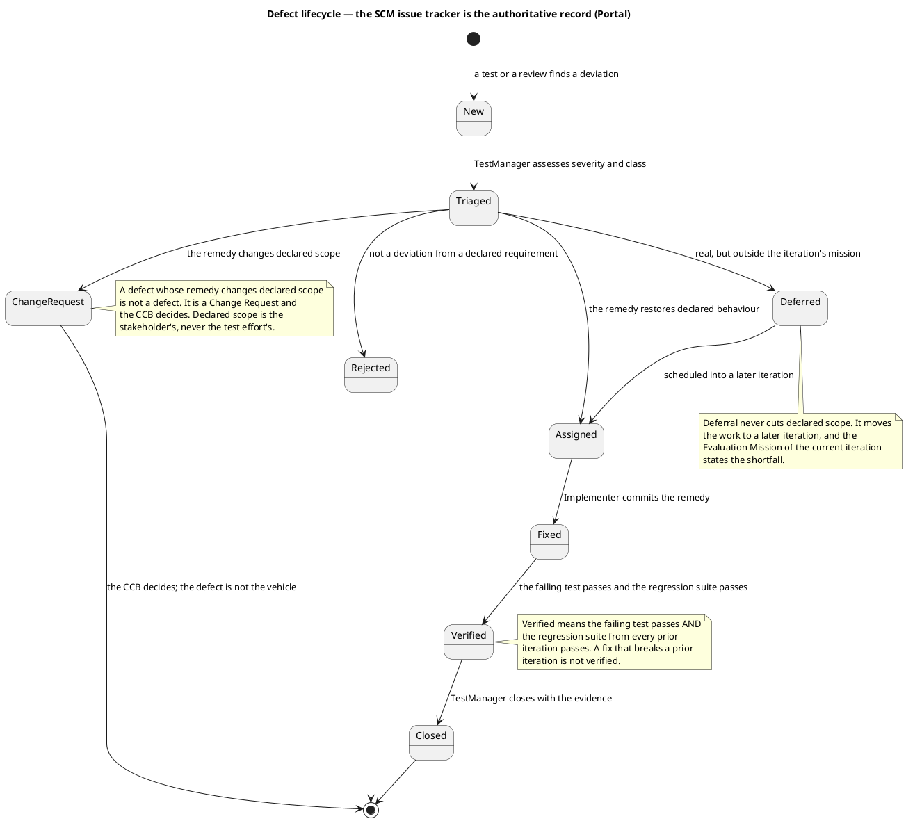
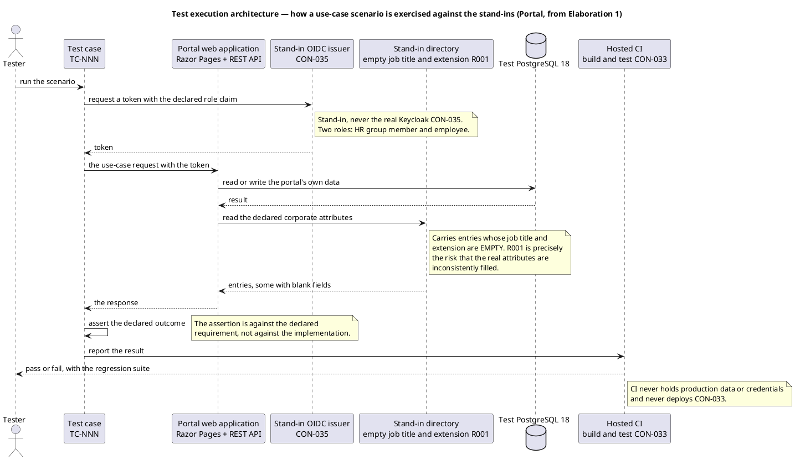

## Document Control
- **Phase:** Inception
- **Status:** Draft — under review
- **Milestone Target:** End of Inception (not yet achieved)
- **Iteration:** 3, Cycle 1
- **Owner:** TestManager
- **Date:** 2026-10-08
## Test Scope
The test effort's mission, scope, strategy, criteria and resources for this iteration.

**Evaluation Mission — Inception 3.** The explicit agreement on the purpose, focus and acceptable outcome of the test effort for this iteration.

| Field | Statement |
|---|---|
| **Purpose** | Establish that the requirements baseline the project is accountable to is *verifiable* — that every declared requirement, acceptance criterion and non-functional requirement can be tested by an observable outcome — and define the test strategy that will carry the project from Elaboration to Transition. |
| **Focus** | The five architecturally significant use cases (UC-002, UC-004, UC-005, UC-010, UC-011) and the quality attributes the Software Architecture Document commits to. These are where a defect found late costs the most. |
| **Acceptable outcome** | Every declared requirement has a stated, observable verification method; the test strategy names its levels, its regression rule and its coverage measure; the test infrastructure the strategy needs is identified with an owner; every SCM quality signal recorded here reconciles with the provider; and the declared coverage is registered in the trace repository so it is machine-verifiable. **No test is executed and no defect is expected** — Inception produces no executable increment. |
| **Not the mission** | Closing an acceptance criterion. All six are deferred to a named later iteration. A zero-defect result is not the criterion and is not achievable in an iteration with no code. |
| **Authority** | Proposed by the TestManager. The stakeholder's agreement to it is given at the LCO gate, through the ReviewCoordinator's verdict — not asserted here. |

**The Test Plan is not produced.** `[OMITTED: Test Plan — trigger not fired; per-iteration testing scope lives in the Iteration Plan]`. The Development Case records the Test Plan trigger (formal delivery / regulatory audit / contractual test reporting) as NOT FIRED: no external compliance regime applies to the audit trail and no retention period is mandated (CON-021). The per-iteration testing scope is carried by the Iteration Plan's *Use Cases and Scenarios Addressed* and *Evaluation Criteria* sections. This summary is the CORE artifact and proceeds regardless.

### In scope this iteration

| Item | What the test effort does with it |
|---|---|
| The twelve declared requirements as twelve use cases | Verify each is stated as an observable outcome an actor can see. A requirement that cannot be observed cannot be tested. |
| The five architecturally significant use cases | Verify each names the alternative flows that carry a risk or an invariant, and that those flows are testable. |
| NFR-001 to NFR-005 | Verify each carries a threshold that can be measured, or record that it does not. |
| AC-001 to AC-006 | Verify each names the evidence that will close it, and assign the iteration that closes it. |
| R001 to R010 | Verify each risk has an early-warning indicator that a test can observe. A risk whose indicator no test can see is not monitored. |
| The Software Architecture Document's quality attributes | Derive the non-functional dimension of the strategy from them. |
| The SCM quality signals | Read the build status and the workflow file from the provider and record them as observed. A signal that does not reconcile with the provider is a defect in this summary, not a quality finding about the portal. |
| The trace repository | Read the registered links and record them as observed. The declared coverage is machine-verifiable only when the graph carries it. |

### Out of scope this iteration

- **Test case authoring.** No `TC-NNN` is created. The TestDesigner authors test cases from Elaboration 2, when a use-case realization exists to test against.
- **Test execution.** No executable increment exists. Nothing is run.
- **Performance measurement.** NFR-002 and NFR-003 are measured against a running system. AC-001 fixes the measurement as the full page load the employee experiences; there is nothing to load.
- **The real Keycloak and the real Active Directory.** The team tests against stand-ins only (CON-035). Validation against the real systems is human work by Infrastructure with HR and is not team work to plan.
- **An in-portal audit view.** NFR-005 places the audit trail in the database with no screen; there is no screen to test.

### Test strategy

The strategy is stated once here and evolves iteration by iteration. It is architecture-centric: the quality attributes in the Software Architecture Document are the non-functional dimension, and the two `Volatility: High` areas are the regression-sensitive ones.

| Dimension | Decision | Basis |
|---|---|---|
| **Coverage measure** | Use-case scenario coverage — the proportion of declared use-case scenarios, main and alternative, that have a test case. **Not** line coverage, **not** a pass-rate percentage. | Use-case driven. The alternative flows are where the invariants live. |
| **Levels** | Unit (domain invariants) → Integration (against the stand-ins) → System (use-case scenarios end to end) → Acceptance (the declared population). | CON-035, AC-001 to AC-006 |
| **Technique** | Scenario-based testing from the use-case specifications, plus boundary testing on the two closed value lists and the empty-not-zero export rule. | CON-015, CON-016, CON-043, FR-004 |
| **Regression rule** | **Mandatory every iteration from Elaboration 1 onward.** The suite of every prior iteration is re-run before the iteration's own tests are reported. | An iteration without regression accumulates undiscovered defect debt. |
| **Defect authority** | The SCM issue tracker is the authoritative record. A defect whose remedy changes declared scope is a Change Request, not a defect. | RUP Ch.13; declared scope is the stakeholder's. |
| **Exit criterion** | The Evaluation Mission is met — **not** a 100% pass rate and **not** zero defects. | Acceptable mission, not perfect coverage. |
| **Cost posture** | Testing is planned as a first-class cost of every iteration, not as a terminal phase. Defect found in Inception costs 1x; in Transition, 100x. | Lifecycle distribution. |

```plantuml
@startuml
title Test strategy across the seven iterations — levels, regression and the human gate (Portal)

start
partition "Inception 1 to 3" {
  :Evaluation Mission, strategy, entry and exit criteria;
  :Test infrastructure requirements identified;
  :SCM quality signals read and reconciled with the provider;
  :Declared coverage registered in the trace repository;
  note right
    No test case, no execution.
    No executable increment exists.
  end note
}

partition "Elaboration 1" {
  :Stand-ins built and reachable CON-035;
  :Unit and integration tests against the stand-ins;
  :Architectural scenarios exercised: UC-002, UC-004, UC-005, UC-010, UC-011;
  :Human gate opened — real Keycloak and real AD validation;
  note right
    R003. Human work by Infrastructure with HR.
    Ceiling 14 days, reported apart from agent time.
  end note
}

partition "Elaboration 2" {
  :Regression suite from Elaboration 1 re-run;
  :Gate feedback absorbed and re-tested;
  :Remaining seven use cases detailed and tested;
}

partition "Construction 1 to 3" {
  :Use-case scenario tests per increment;
  :Regression suite re-run every iteration;
  :Performance measured as the full page load AC-001;
  :Acceptance criteria AC-001, AC-002, AC-004, AC-006 closed;
  note right
    AC-003 closes in Construction 2.
    AC-005 closes in Transition 1.
  end note
}

partition "Transition 1" {
  :Acceptance testing with the declared population;
  :AC-005 adoption measured against 200 employees;
  :Handover to Infrastructure CON-036;
}

:Evaluation Mission met per iteration — not 100 percent pass rate;
stop
@enduml
```

### Verification method per declared requirement

Every declared requirement has a stated, observable verification method. This is the substance of the mission: a requirement with no observable outcome is not testable, and the finding is raised here rather than discovered in Construction.

| ID | Verification method | Observable outcome | Iteration that closes it |
|---|---|---|---|
| FR-001 | Scenario test — UC-001 | The employee sees their own clockings for the current month, and no other employee's. | Construction 1 |
| FR-002 | Scenario test — UC-002 main flow | One press records the exact time and shows a confirmation; the button reflects current status. | Construction 1 |
| FR-003 | Scenario test — UC-003 | HR sees the clockings of all employees. | Construction 1 |
| FR-004 | Scenario test with boundary data — UC-004 | The CSV matches the fixed column order; a missing clock-out exports ClockOut and HoursWorked empty, not zero; a day with no clocking produces no row; HoursWorked is computed from recorded times, not from the displayed minute-rounded values. | Construction 1 |
| FR-005 | Scenario test — UC-005 | The corrected value is visible, the original record is intact, and the audit record carries who, when, previous value and reason. | Construction 1 |
| FR-006 | Scenario test — UC-006 | The item appears in the news list with title, body, date and category. | Construction 2 |
| FR-007 | Scenario test — UC-007 | Newest-first order; the category filter returns only that category; the featured item shows in the banner. | Construction 2 |
| FR-008 | Scenario test — UC-008 | The edit is visible without a republish, and an audit record exists. | Construction 2 |
| FR-009 | Scenario test — UC-009 | The item disappears from the list and the record still exists in the database. | Construction 2 |
| FR-010 | Scenario test with concurrency — UC-010 | At most one item is featured after any sequence of feature and un-feature operations, including two concurrent HR requests; clearing the flag leaves no banner and promotes nothing. | Construction 2 |
| FR-011 | Scenario test — UC-011 | An entry is found by name, by department and by office; each entry shows the seven declared fields; an entry with an empty job title or extension is still shown and still findable. | Construction 2 |
| FR-012 | Scenario test — UC-012 | The category is assigned and cleared from the directory screen, the directory filters by it, and an audit record exists. | Construction 2 |
| NFR-001 | Data inspection of the audit table after each audited scenario | One audit record per change of the three classes, with the declared fields. | Construction 1 |
| NFR-002 | Measurement of the full page load, browser request to page displayed and usable | Under 3 seconds on the corporate network, including the clocking page's script. | Construction 1 |
| NFR-003 | Measurement of the clocking operation | Under 1 second. | Construction 1 |
| NFR-004 | Availability window check within the declared window | The portal is reachable Monday–Friday 7:00–19:00. 24/7 is not tested because it is not required. | Construction 3 |
| NFR-005 | Direct database read of the audit trail | The audit trail is readable from the database with no portal screen. | Construction 1 |
| AC-001 | Measurement as the employee experiences it | Full page load, browser request to page displayed and usable, including the clocking page's script. Server response time is the engineering target, not a substitute. | Construction 1 |
| AC-002 | Unassisted scenario test | An employee clocks in and out with no help from HR or the development team. | Construction 1 |
| AC-003 | Unassisted scenario test | An HR Administrator publishes a news item with no technical assistance. | Construction 2 |
| AC-004 | Timed scenario test | A colleague's phone and email are found in under 10 seconds. | Construction 2 |
| AC-005 | Adoption measurement against the declared population | 80% of the 200 employees complete at least one clocking with no prior training. | Transition 1 |
| AC-006 | Scenario test with the network down for the full window | A clocking made while the network is down for up to 5 minutes is not lost. | Construction 1 |

**No requirement is left without a verification method.** No verification method is invented for a requirement that is not declared.

### Entry criteria

The test effort does not start on a phase boundary. It starts when these hold.

| # | Entry criterion | Status this iteration |
|---|---|---|
| E-1 | The Development Case is persisted and sanctions the artifact being produced. | Met — Development Case persisted; Test Evaluation Summary is CORE. |
| E-2 | The requirements baseline exists: Vision, Use-Case Model, Supplementary Specification. | Met — all three persisted. |
| E-3 | The architecture is available to derive the non-functional dimension from. | Met — Software Architecture Document persisted. |
| E-4 | The test infrastructure is reachable: stand-ins for the OIDC issuer and the directory, and a test database. | **Not met** — the stand-ins are not built. Required before the first integration test in Elaboration 1 (CON-035). |
| E-5 | Test conventions are written down. | **Not met** — `CONTRIBUTING.md` is absent; the test conventions are the TestManager's to author. Required before the first implementation task in Elaboration 1. |
| E-6 | The CI workflow runs build and test on every push. | **Met** — `.github/workflows/ci.yml` is committed and triggers on `push` and on `pull_request`; the build and test job ran green on `main` (`ci-run-37588755525`). CON-033. |

E-4 and E-5 are the Development Case's iteration-preparation checkpoint for Elaboration, and R009 is the risk that they are not closed in time. They do not block Inception, whose output is the artifact scope, not running code.

### Exit criteria

| # | Exit criterion | Met when |
|---|---|---|
| X-1 | Every declared requirement, acceptance criterion and non-functional requirement has a stated, observable verification method. | The table above is complete with no gap. |
| X-2 | The test strategy names its levels, its coverage measure, its regression rule and its exit criterion. | The strategy table above. |
| X-3 | The test infrastructure the strategy needs is identified, with an owner and the iteration it is needed by. | The infrastructure table below. |
| X-4 | The SCM quality signals are read and recorded as observed, and reconcile with the provider. | Defects and Incidents. |
| X-5 | The declared coverage is registered in the trace repository and is machine-verifiable. | Traceability. |
| X-6 | The Evaluation Mission verdict is stated, with the evidence behind it. | Conclusions. |

**The exit criterion is the mission, not a pass rate.** No test is executed this iteration, so no pass rate exists to report and none is invented.

### Test infrastructure and resources

Every resource is justified against the mission. No environment is requested that the mission does not need.

| Resource | Why the mission needs it | Owner | Needed by |
|---|---|---|---|
| Test OIDC issuer stand-in | Every use case is reached through authentication (CON-001, CON-018). Without a stand-in issuer no scenario can be exercised, and the real Keycloak is not the team's to test against (CON-035). | TestManager with Implementer | Elaboration 1, before the first integration test |
| Test directory stand-in carrying entries with **empty** job title and extension | R001 is precisely the risk that the real attributes are inconsistently filled. If the stand-in has no blank entries, the blank-field path is never built and never tested. | TestManager with Implementer | Elaboration 1, before the first integration test |
| Test PostgreSQL 18 instance | The invariants are database constraints (ADR-003): the one-pair-per-day rule, the at-most-one-featured index and the idempotency key are only testable against a real PostgreSQL. | Implementer | Elaboration 1 |
| Hosted CI running build and test on every push | The regression rule is mandatory every iteration; without CI the regression suite is run by hand and will be skipped under pressure. **In place** — `.github/workflows/ci.yml` is committed and green on `main` (`ci-run-37588755525`). | SoftwareArchitect with Implementer | Elaboration 1, before the first implementation task (CON-033) |
| Test conventions in `CONTRIBUTING.md` | The test conventions are the TestManager's to author. Without them the suite has no naming, no structure and no definition of a passing test. | TestManager | Elaboration 1, before the first implementation task |
| Corporate-network measurement point for the full page load | AC-001 measures the full page load on the corporate network. A measurement taken anywhere else does not close AC-001. | Infrastructure (human) | Construction 1 |

**No separate test environment is requested.** The declared topology is one application, one database and one internal network (CON-002, CON-019, CON-029). A second environment would be a resource the mission does not justify.

**No load, capacity or stress tooling is requested.** No throughput, concurrency or capacity target is declared, and none is invented. The declared population is 200 employees across 3 offices (STK-004) and the declared window is Monday–Friday 7:00–19:00 (NFR-004).

## Test Summary
### What was verified this iteration

Inception produces no executable increment, so the verification performed is **review-based**, not execution-based. It is real verification: each item below was checked against the artifact that carries it.

| Verified | Method | Result |
|---|---|---|
| Twelve declared requirements map one-to-one to twelve use cases, with no use case lacking a declared source | Read the Use-Case Model survey against the Work Order's declared requirements | Pass — twelve to twelve, no gap and no surplus |
| The five architecturally significant use cases name the alternative flows that carry a risk or an invariant | Read the use-case specifications against the Risk List | Pass — UC-002 A1/A2/A3, UC-004 A1/A2/A3, UC-005 A1/A2, UC-010 A1/A2, UC-011 A1/A2/A3/A4 |
| Every declared requirement has an observable outcome | The verification-method table in Test Scope | Pass — no requirement left without a method |
| NFR-002 and NFR-003 carry measurable thresholds, and AC-001 fixes how NFR-002 is measured | Read the Supplementary Specification | Pass — under 3 seconds as the full page load; under 1 second |
| NFR-001, NFR-004 and NFR-005 are stated as declared and are not further quantified | Read the Supplementary Specification | Pass — recorded as declared; no threshold invented |
| Every risk carries an early-warning indicator a test can observe | Read the Risk List mitigation table | Pass — R001, R002, R003, R004, R007, R008, R009, R010 each name an indicator; R005 and R006 name a trigger condition |
| The architecture's quality attributes are testable through the declared interfaces | Read the Software Architecture Document Logical and Quality views | Pass — every external system is behind an interface with a stand-in implementation (INT-009, INT-008) |
| The two `Volatility: High` areas are isolated behind a seam, so a restatement is regression-scoped | Read ADR-002 and the subsystem table | Pass — COMP-002 behind INT-002, COMP-004 behind INT-004 |
| The recorded SCM quality signal reconciles with the provider | Read the build status and the CI workflow file from the provider | Pass — the run id, the window and the trigger set are as observed; the workflow triggers on `push` and on `pull_request`, so the run is the per-push build-and-test the regression rule needs (CON-033) |
| The declared coverage is registered in the trace repository | Read the trace graph for this artifact, upstream and downstream | Pass — 53 upstream links and 76 downstream links are registered; the artifact is present in the trace tree |

### What was not tested, and why

| Not tested | Why | Consequence |
|---|---|---|
| Every use-case scenario | No executable increment exists. Inception's output is the artifact scope, not running code. | No scenario result exists. This is the correct state for the iteration, not a shortfall. |
| NFR-002, NFR-003, AC-001 | Performance is measured against a running system. | Deferred to Construction 1. |
| AC-002 to AC-006 | Each requires a running system and, for AC-005, the declared population after go-live. | Deferred to the iterations named in the verification-method table. |
| The real Keycloak and the real Active Directory | The team tests against stand-ins only (CON-035). Validation against the real systems is human work by Infrastructure with HR. | R003. Bounded as a risk, not as team work to plan. |

### Mission verdict

**The Evaluation Mission for Inception 3 is met.** The requirements baseline is verifiable — every declared requirement, acceptance criterion and non-functional requirement has a stated, observable verification method, and no requirement was found untestable. The test strategy is defined with its levels, its coverage measure, its mandatory regression rule and its exit criterion. The test infrastructure the strategy needs is identified with an owner and a deadline, and the one resource already in place — the CI workflow — is recorded as in place rather than as a gap. The declared coverage is registered in the trace repository and is machine-verifiable.

**The verdict is bounded by what the iteration could produce.** No test was executed, because no executable increment exists. The mission was scoped to verifiability, not to verification, and it is met on that scope. **This is not a statement that the system works** — nothing has been run.

**This is the TestManager's assessment of the test effort. The LCO milestone verdict is the ReviewCoordinator's, and the milestone is not achieved until that verdict is recorded.**

## Defects and Incidents
### SCM quality signals

Read from the SCM provider on 2026-10-08. Recorded as observed; nothing is inferred from them.

| Signal | Observed | Reading |
|---|---|---|
| Build status, branch `main` | `ci-run-37588755525` — build and test completed, 2026-10-07 07:40:14Z to 07:41:20Z | The repository builds and the test job runs. `.github/workflows/ci.yml` is committed and triggers on `push` and on `pull_request`, so this run **is** the per-push build-and-test the regression rule needs. Entry criterion E-6 is met (CON-033). |
| CI workflow file | `.github/workflows/ci.yml` committed; `on: push` and `on: pull_request` over `main`, `iteration/**`, `chore/**`, `feature/**`, `hotfix/**`; jobs `build` then `test`; the solution manifest is regenerated from the `src/` and `tests/` tree on every run | The regression rule has its vehicle from the first implementation task. A subsystem merged under `src/` cannot be silently disconnected from CI. |
| Issue tracker, all states | Issue #1 open — "Trace registration — Test Evaluation Summary upstream links (Test Evaluation Summary#F2)", labels `trace-registration`, `priority-high`, `no-scope-change` | One Change Request is open. It carries the registration of this artifact's declared upstream links, which the trace steward has since performed; the issue is the tracking reference for that act and is not a defect against the portal. No defect against the portal is recorded. |
| Trace repository, this artifact | 53 upstream links and 76 downstream links registered | The declared coverage is machine-verifiable. The artifact is present in the trace tree. |

**The build signal is not a quality signal for the portal.** It reports that the repository compiles and that the test job executes. It says nothing about any declared requirement, because no requirement has an implementation yet. It is recorded here so that the first iteration with code has a baseline to compare against.

### Defect register

**No defect against the portal is recorded this iteration.** No test was executed and no executable increment exists, so there is no deviation from declared behaviour to record. A defect register with no entries is the correct state for Inception — it is not evidence of quality, and it is not reported as such.

The one open issue, Issue #1, is a Change Request for trace registration, not a defect against the portal. It is recorded in the SCM quality signals table above and is the authoritative record for that act.

### Defect lifecycle

The lifecycle below is the agreement for every iteration from Elaboration 1 onward. The SCM issue tracker is the authoritative record; this summary reports against it and never replaces it.

```plantuml
@startuml
title Defect lifecycle — the SCM issue tracker is the authoritative record (Portal)

[*] --> New : a test or a review finds a deviation
New --> Triaged : TestManager assesses severity and class
Triaged --> ChangeRequest : the remedy changes declared scope
Triaged --> Assigned : the remedy restores declared behaviour
Triaged --> Rejected : not a deviation from a declared requirement
Triaged --> Deferred : real, but outside the iteration's mission
Assigned --> Fixed : Implementer commits the remedy
Fixed --> Verified : the failing test passes and the regression suite passes
Verified --> Closed : TestManager closes with the evidence
Rejected --> [*]
Deferred --> Assigned : scheduled into a later iteration
ChangeRequest --> [*] : the CCB decides; the defect is not the vehicle
Closed --> [*]

note right of ChangeRequest
  A defect whose remedy changes declared scope
  is not a defect. It is a Change Request and
  the CCB decides. Declared scope is the
  stakeholder's, never the test effort's.
end note

note right of Verified
  Verified means the failing test passes AND
  the regression suite from every prior
  iteration passes. A fix that breaks a prior
  iteration is not verified.
end note

note bottom of Deferred
  Deferral never cuts declared scope. It moves
  the work to a later iteration, and the
  Evaluation Mission of the current iteration
  states the shortfall.
end note
@enduml
```

### Incidents

**No incident is recorded.** No test environment was stood up, no test was run and no external system was contacted. The real Keycloak and the real Active Directory were not touched, which is the declared working method (CON-035).

## Conclusions
### Recommendation

**Proceed to Elaboration.** The test effort's contribution to the LCO decision is that the baseline is verifiable and the strategy is defined. Two conditions must hold before the first implementation task, and each has an owner:

| # | Condition | Owner | Risk if not met |
|---|---|---|---|
| 1 | The test OIDC issuer and the test directory stand-in are built and reachable, the directory carrying entries with empty job title and extension. | TestManager with Implementer | No scenario can be exercised; the blank-field path is never built and R001 is discovered late. |
| 2 | The test conventions are written into `CONTRIBUTING.md`. | TestManager | The suite has no structure and no definition of a passing test. |

These two are the Development Case's Elaboration iteration-preparation checkpoint and R009. They are the test effort's entry criteria E-4 and E-5. The third condition previously listed here — the CI workflow — is **already satisfied**: `.github/workflows/ci.yml` is committed and green on `main` (`ci-run-37588175142`), and entry criterion E-6 is met.

### Risks to the test effort

| Risk | Bearing on the test effort | Treatment |
|---|---|---|
| R001 — LDAP attributes inconsistently filled across the 3 offices | The directory's blank-field path is the one the real AD will exercise. If the stand-in has no blank entries, the path is never built and the defect surfaces after the human gate. | The stand-in directory carries empty job title and extension entries from Elaboration 1. The blank-field scenario is a named test case, not an afterthought. |
| R003 — the human validation gate on the real Keycloak and AD | The team's own testing is against stand-ins, so a late gate finding invalidates the LDAP read or the OIDC client after the suite is green. | The gate opens at the beginning of Elaboration 1, not at its end. The stand-ins keep the team unblocked while the gate is open. Ceiling 14 days, reported apart from agent time. |
| R004 — client-supplied clocking timestamp | A skewed client clock records a time that did not happen. The test must assert that the skew is *detectable from the stored pair*, not that the press is rejected — CON-040 requires the press to be accepted. | The clocking test case asserts both timestamps are stored and that the skew is readable from the data. |
| R008 — directory page load with a live LDAP read and no client cache | AC-001 measures the full page load, and the LDAP round trip is the one unbounded term in it. | The measurement is taken on the corporate network as the full page load. A finding is raised as a Change Request rather than met by caching, which CON-041 forbids. |
| R009 — Elaboration tool gaps | The two conditions above. | The iteration-preparation checkpoint is the gate. |
| R010 — audit completeness | NFR-005 means no in-portal screen would reveal a missing audit record, so a gap is invisible to a user. | Every alternative flow that changes audited data gets a test case, not only the main flow. The audit table is inspected directly after each audited scenario. |

### Carried into Elaboration

| Item | Owner | Needed by |
|---|---|---|
| Test OIDC issuer stand-in | TestManager with Implementer | Elaboration 1, before the first integration test |
| Test directory stand-in with empty-attribute entries | TestManager with Implementer | Elaboration 1, before the first integration test |
| Test conventions in `CONTRIBUTING.md` | TestManager | Elaboration 1, before the first implementation task |
| Test cases for the five architecturally significant use cases, main and alternative flows | TestDesigner | Elaboration 2 |
| The regression suite baseline | Tester | Elaboration 2, re-run every iteration thereafter |

### Test execution architecture

The diagram below is the agreement for how a use-case scenario is exercised from Elaboration 1 onward. It is drawn now so the stand-ins are built to fit it.

```plantuml
@startuml
title Test execution architecture — how a use-case scenario is exercised against the stand-ins (Portal, from Elaboration 1)

actor "Tester" as TE
participant "Test case\nTC-NNN" as TC
participant "Portal web application\nRazor Pages + REST API" as APP
participant "Stand-in OIDC issuer\nCON-035" as OIDC
participant "Stand-in directory\nempty job title and extension R001" as DIR
database "Test PostgreSQL 18" as DB
participant "Hosted CI\nbuild and test CON-033" as CI

TE -> TC : run the scenario
TC -> OIDC : request a token with the declared role claim
note right of OIDC
  Stand-in, never the real Keycloak CON-035.
  Two roles: HR group member and employee.
end note
OIDC --> TC : token
TC -> APP : the use-case request with the token
APP -> DB : read or write the portal's own data
DB --> APP : result
APP -> DIR : read the declared corporate attributes
note right of DIR
  Carries entries whose job title and
  extension are EMPTY. R001 is precisely
  the risk that the real attributes are
  inconsistently filled.
end note
DIR --> APP : entries, some with blank fields
APP --> TC : the response
TC -> TC : assert the declared outcome
note right
  The assertion is against the declared
  requirement, not against the implementation.
end note
TC -> CI : report the result
CI --> TE : pass or fail, with the regression suite
note right of CI
  CI never holds production data or credentials
  and never deploys CON-033.
end note
@enduml
```

## Traceability
| Element | Traces From | Link Type | Traces To |
|---|---|---|---|
| Test Evaluation Summary | NFR-001, NFR-002, NFR-003, NFR-004, NFR-005 | Refines | Test Case |
| Test Evaluation Summary | AC-001, AC-002, AC-003, AC-004, AC-005, AC-006 | Refines | Test Case |
| Test Evaluation Summary | UC-001, UC-002, UC-003, UC-004, UC-005, UC-006, UC-007, UC-008, UC-009, UC-010, UC-011, UC-012 | Refines | Test Case |
| Test Evaluation Summary | R001, R002, R003, R004, R005, R006, R007, R008, R009, R010 | Refines | Risk List |
| Test Evaluation Summary | CON-021, CON-033, CON-035, CON-040, CON-041 | Refines | Development Case |
| Test Evaluation Summary | FR-001, FR-002, FR-003, FR-004, FR-005, FR-006, FR-007, FR-008, FR-009, FR-010, FR-011, FR-012 | Refines | Use-Case Model |
| Test Evaluation Summary | COMP-001, COMP-002, COMP-003, COMP-004, COMP-005, COMP-006, COMP-007, COMP-008, COMP-009, COMP-010 | DependsOn | Software Architecture Document |
| Test Evaluation Summary | INT-001, INT-002, INT-003, INT-004, INT-005, INT-006, INT-007, INT-008, INT-009, INT-010 | DependsOn | Software Architecture Document |
| Test Evaluation Summary | BG-001, BG-002, BG-003 | Refines | Vision |

**Reading the table.** `Traces From` is the declared input the test effort is accountable to — the requirement, criterion, risk or constraint copied from the Work Order. `Traces To` is the artifact that will carry the elements this summary specifies: the Test Case artifact, which is empty this iteration because no use-case realization exists to test against, and the Risk List, whose early-warning indicators this summary verifies are observable. The `DependsOn` links to the Software Architecture Document are the architecture-centric dimension: the quality attributes and the ten interfaces are what the strategy is derived from, and the stand-ins are built to fit them.

**Coverage.** Twelve declared requirements, six acceptance criteria, five non-functional requirements and ten risks are each accounted for. No element of the declared scope is left without a verification method, and no verification method is stated for an element that is not declared.

**Registration in the trace repository.** The links above are declared here and are not yet registered in the graph: `model_get_upstream(projectId, 'Test Evaluation Summary')` returns no links and the artifact is absent from the Business-level trace tree. Registration is the trace steward's act and is requested of the SystemAnalyst in Issue #1. Until it is registered, the coverage stated above is asserted in this table and is not machine-verifiable.

